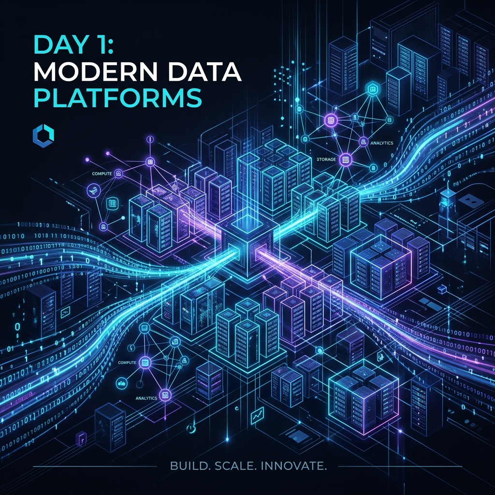
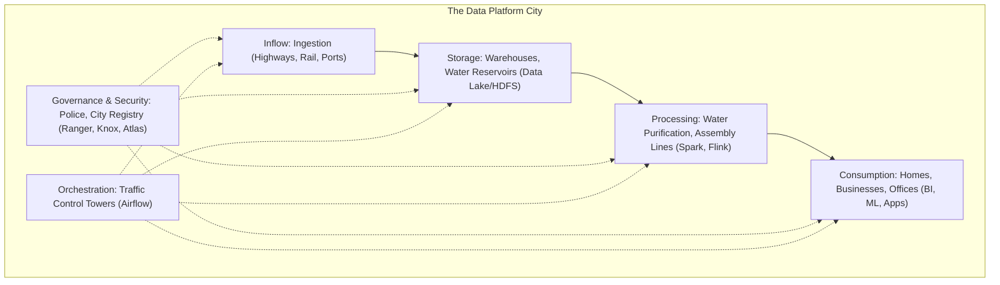
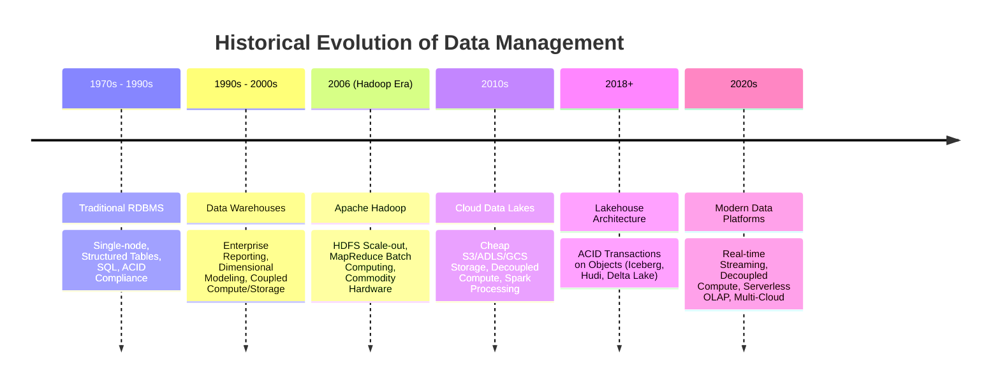
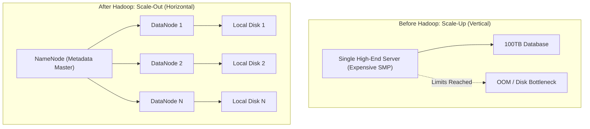
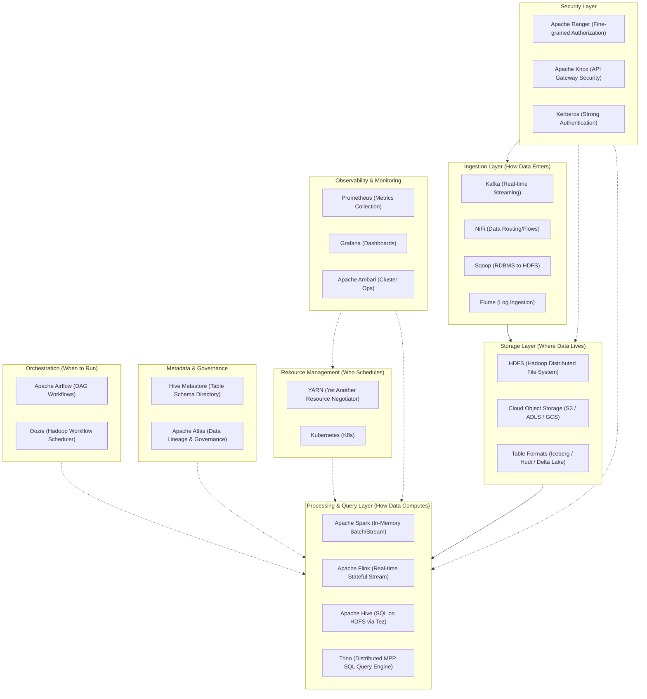
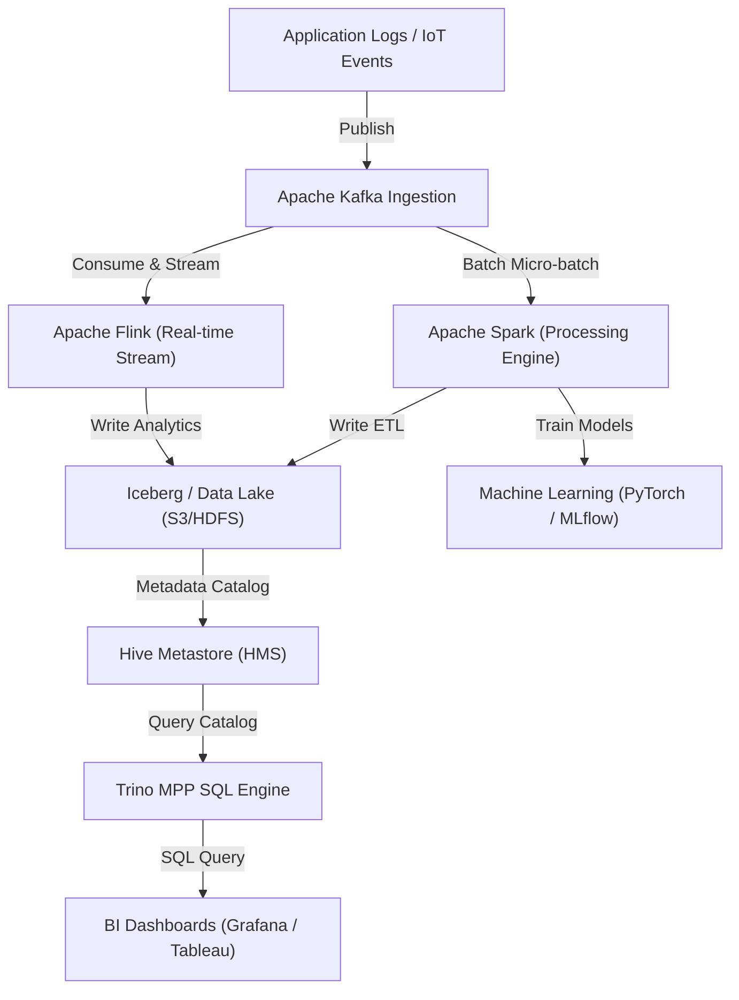
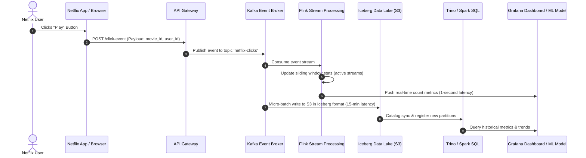
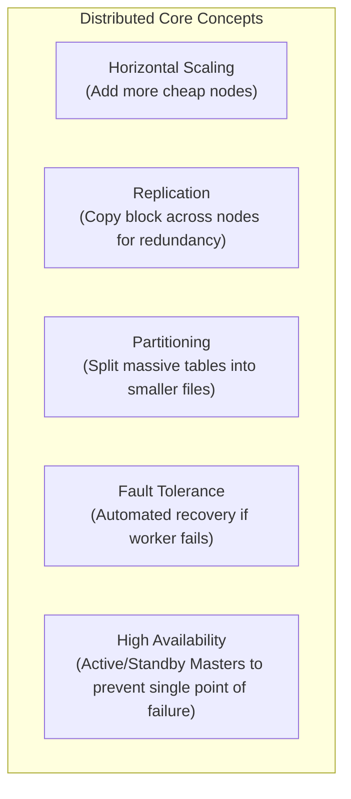
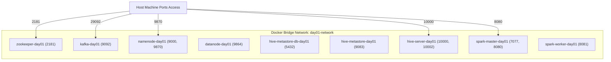

# Day 1: Ecosystem Overview — How Modern Data Platforms Actually Work



Welcome to Day 1 of the **30 Days of Modern Hadoop Ecosystem** curriculum! Today, we lay the conceptual, historical, and architectural foundations for the rest of this program. We will trace the evolution of data platforms from single-instance databases to modern cloud-native Lakehouses, analyze the core trade-offs of distributed systems, map out the entire Hadoop and modern big data ecosystem, and deploy our first containerized multi-service sandbox.

---

## 🎯 Learning Objectives
By the end of this module, you will understand:
* **The Historical Evolution:** Why traditional databases and warehouses failed to scale, and the architectural shifts that led to Hadoop, Cloud Data Lakes, and the Lakehouse model.
* **Storage vs. Compute Architecture:** The fundamental differences, operational impacts, and cost benefits of tightly coupled systems vs. decoupled, elastic cloud architectures.
* **Batch vs. Streaming Processing:** When to use batch pipelines (latency-insensitive, high-throughput) vs. streaming engines (event-driven, sub-second latency), and how Lambda and Kappa architectures combine them.
* **End-to-End Enterprise Architecture:** How data flows from event ingestion (Kafka) to distributed processing (Spark, Flink), storage (HDFS, Object Storage), metadata catalogs (Hive Metastore), and query engines (Trino, Hive) for BI and ML.
* **Core Distributed System Concepts:** The mechanics of replication, partitioning, fault tolerance, high availability, resource scheduling, and data locality.
* **Hands-on Deployment:** How to provision, check, and troubleshoot a complete 9-service Hadoop/Spark/Hive/Kafka sandbox environment in Docker.

---

# SECTION 1 — INTRODUCTION

## What is a Data Platform?

At its simplest, a **Data Platform** is an integrated suite of technologies design to ingest, store, process, secure, govern, and analyze data at any scale. It is not a single product or database, but an entire *infrastructure ecosystem* tailored to turn raw, high-velocity data into trustworthy, actionable insights.

### 🏙️ The City Analogy

To understand a modern data platform, imagine a large, rapidly growing modern city:
* **The Roads, Highways, and Ports (Ingestion):** This is your ingestion pipeline. Just as vehicles bring goods and people into the city, technologies like **Apache Kafka** or **Apache NiFi** ingest raw event logs and records from external applications.
* **The Water Reservoirs and Warehouses (Storage):** Just as the city stores massive reserves of water and physical goods, a data platform utilizes **HDFS** or **Amazon S3** as a centralized repository (the Data Lake) to store raw files.
* **The Water Purification Plants and Assembly Lines (Processing):** Raw water cannot be distributed to houses directly, and raw materials must be manufactured. Similarly, raw data must be cleaned, transformed, and aggregated using processing engines like **Apache Spark** or **Apache Flink**.
* **The City Registry and Police Force (Governance & Security):** A city needs laws, property records, and law enforcement. A data platform uses **Apache Ranger** and **Apache Atlas** to govern data access, track who owns what data (lineage), and enforce fine-grained security policies.
* **The Traffic Control Towers (Orchestration):** Just as air traffic control schedules and monitors flights, orchestration tools like **Apache Airflow** coordinate when data pipelines run, managing complex dependencies.
* **The Local Businesses and Homes (BI, ML, Applications):** Ultimately, purified water and assembled goods are consumed. In a data platform, processed data is queried by Business Intelligence (BI) tools (like Tableau or Grafana) or ingested by Machine Learning (ML) pipelines.


*(Diagram Source: [city-analogy.mermaid](diagrams/city-analogy.mermaid))*

### 🔄 Data Platform vs. Database vs. Data Warehouse

A common point of confusion is how a data platform differs from a relational database (RDBMS) or an enterprise data warehouse (EDW). Let's compare them across core architectural vectors:

| Feature | Relational Database (RDBMS) | Data Warehouse (EDW) | Modern Data Platform / Lakehouse |
|---|---|---|---|
| **Primary Use Case** | Online Transaction Processing (OLTP) — e.g., user checkouts, banking deposits. | Online Analytical Processing (OLAP) — e.g., quarterly sales reports, financial audits. | End-to-end data lifecycle: streaming, batch ETL, advanced ML/AI, ad-hoc SQL, BI. |
| **Data Types** | Highly structured (Tables with strict schemas). | Structured and semi-structured (JSON, CSV loaded into structured schemas). | Unstructured (video, audio, text), semi-structured (JSON, logs), and structured. |
| **Scaling** | Vertical scaling (Scale-up: buying larger servers). | Horizontal scale-out (MPP: Massively Parallel Processing, but highly expensive). | Unlimited horizontal scaling (decoupled storage and compute on commodity hardware or cloud). |
| **Storage Cost** | Extremely High (SSD/NVMe attached to database instances). | High (Proprietary storage systems tightly coupled to computing nodes). | Very Low (Object storage like S3, ADLS, or HDFS on commodity disks). |
| **Schema enforcement** | Schema-on-write (Strict validation at entry). | Schema-on-write (Data must conform to table schema during ETL loading). | Schema-on-read (Read raw data, apply schemas dynamically via metastore or table formats). |

---

## Historical Evolution

The way enterprises manage data has undergone several paradigm shifts over the last 50 years, driven by the geometric growth of data volume and the diversity of business requirements.


*(Diagram Source: [historical-evolution.mermaid](diagrams/historical-evolution.mermaid))*

1. **Traditional Databases (1970s - 1990s):** Data was small and structured. Systems relied on monolithic relational databases (Oracle, DB2, Microsoft SQL Server) running on a single, expensive mainframe or high-end server. Transactions were strictly ACID-compliant.
2. **Data Warehouses (1990s - 2000s):** As business intelligence grew, operational systems became bogged down by complex analytical queries. Enterprises built dedicated analytical servers called Data Warehouses (Teradata, Netezza, Vertica) using Massively Parallel Processing (MPP) architectures. These systems were powerful but expensive, proprietary, and limited to structured tables.
3. **The Hadoop Era (2006 - 2012):** The internet boom (Yahoo, Google, Facebook) created web-scale logs, media, and clickstreams. Traditional systems cracked under the volume. Inspired by Google's whitepapers on the Google File System (GFS) and MapReduce, Yahoo engineers created Apache Hadoop. It introduced low-cost, horizontal scaling on commodity hardware using a shared-nothing architecture.
4. **Cloud Data Lakes (2012 - 2018):** As enterprises migrated to AWS, GCP, and Azure, maintaining large, on-premise physical Hadoop clusters became logistically painful. Cloud providers replaced physical disks with object storage (S3, ADLS, GCS), completely separating storage from compute. Computational workloads were executed on elastic, transient Spark clusters that were terminated when jobs completed.
5. **Lakehouse Architecture (2018 - Present):** While Data Lakes solved storage scale and cost, they lacked ACID transactions, schema enforcement, and versioning, leading to disorganized "data swamps". The industry responded with open table formats like **Apache Iceberg**, **Apache Hudi**, and **Delta Lake**. These formats run ACID transactions directly on top of open object storage, merging the analytical power of Data Warehouses with the low cost and flexibility of Data Lakes.

---

# SECTION 2 — PROBLEM STATEMENT

## Why Traditional Systems Failed to Scale

To fully appreciate why modern distributed architectures exist, we must understand the fundamental physical and financial limits of traditional monolithic database architectures.

### 1. The Physical Limit of Vertical Scaling (Scale-Up)
When data outgrows a database server, the intuitive response is to vertical scale (Scale-up) by buying a faster CPU, more RAM, and larger NVMe disks. However, vertical scaling is bounded by hard physical laws and economic constraints:
* **The Law of Diminishing Returns:** Doubling the cost of a server (e.g., from $10,000 to $100,000) does not yield 10x the processing speed. Monolithic systems suffer from bus bandwidth limits, thermal throttling, and lock contention across dozens of cores.
* **Single Point of Failure (SPOF):** A massive monolithic database server remains a single server. If the motherboard, RAM, or storage controller fails, the entire business goes offline.
* **The "Shared-Everything" Bottleneck:** In a traditional database, all CPU cores share the same RAM and disk controllers. As concurrency increases, CPU cores waste cycles waiting for locks on shared memory pages and storage channels.

### 2. The Structured vs. Unstructured Paradigm Shift
Traditional relational databases require a predefined schema (columns, data types, constraints). Every record must fit this format precisely. However, over 80% of modern enterprise data is semi-structured or unstructured:
* **Web Logs & Clickstreams:** JSON or plain text generated at millions of events per second.
* **IoT Sensor Feeds:** Time-series telemetry with varying attributes.
* **Media & Documents:** Images, video files, audio recordings, and PDFs.

Forcing these formats into rigid relational tables requires complex, brittle ETL (Extract, Transform, Load) pipelines that discard valuable metadata. Distributed data lakes solved this by utilizing **Schema-on-Read**: you store the raw files exactly as they are received and apply schema rules dynamically when querying the data.

### 3. Business Demand and Concurrency
Modern enterprises no longer rely on simple monthly financial reports. Businesses demand:
* **High-concurrency ad-hoc analytics:** Hundreds of data analysts running exploratory SQL queries simultaneously.
* **Machine learning pipelines:** Data scientists scanning terabytes of historical logs to train deep learning models.
* **Real-time decisions:** Fraud detection systems that evaluate transactions in under 50 milliseconds.

Monolithic architectures cannot support these concurrent, heterogeneous workloads. A single runaway data science query can lock database tables, halting critical production checkout transactions.


*(Diagram Source: [before-after-hadoop.mermaid](diagrams/before-after-hadoop.mermaid))*

---

# SECTION 3 — BIG DATA EVOLUTION

## What is Big Data? (The 5 Vs)

"Big Data" is not just a marketing buzzword; it represents a threshold where the volume, velocity, and variety of incoming data exceed the processing capabilities of traditional system architectures. This threshold is defined by the **5 Vs**:

```
 ┌───────────────┐     ┌───────────────┐     ┌───────────────┐     ┌───────────────┐     ┌───────────────┐
 │    VOLUME     │     │   VELOCITY    │     │    VARIETY    │     │   VERACITY    │     │     VALUE     │
 ├───────────────┤     ├───────────────┤     ├───────────────┤     ├───────────────┤     ├───────────────┤
 │ Terabytes to  │     │ Real-time and │     │ Structured,   │     │ Untrustworthy │     │ Driving KPI   │
 │  Petabytes of │     │ high-frequency│     │ unstructured, │     │ data, quality │     │ insights and  │
 │  raw storage  │     │ stream feeds  │     │ semi-struct   │     │ anomalies     │     │ business ROI  │
 └───────┬───────┘     └───────┬───────┘     └───────┬───────┘     └───────┬───────┘     └───────┬───────┘
         └─────────────────────┴─────────────┼───────────────┴─────────────────────┴───────────────┘
                                             ▼
                               ┌───────────────────────────┐
                               │ Distributed Scale-Out Ops │
                               └───────────────────────────┘
```

### 1. Volume
* **Definition:** The sheer scale of data generated, ranging from tens of terabytes to hundreds of petabytes.
* **Enterprise Example (Netflix):** Netflix stores petabytes of video assets, user viewing histories, and playback telemetry. A single day of user viewing activity generates trillions of events.
* **Challenge:** How to store and back up this data without spending millions on proprietary SAN/NAS storage arrays.

### 2. Velocity
* **Definition:** The speed at which new data is generated and needs to be processed.
* **Enterprise Example (Uber):** Every second, GPS coordinates stream from millions of passenger and driver apps. Uber's platform must ingest, process, and analyze this spatial data in real time to calculate dynamic surge pricing and ETA routing.
* **Challenge:** Traditional batch processing (nightly database syncs) is too slow. Data must be processed mid-flight.

### 3. Variety
* **Definition:** The structural diversity of incoming data types.
* **Enterprise Example (Airbnb):** Airbnb ingests structured billing tables, semi-structured JSON search query logs, unstructured text descriptions of listings, and images of rooms.
* **Challenge:** Storing and querying diverse data formats in a single repository without losing structure or context.

### 4. Veracity
* **Definition:** The trustworthiness, quality, and cleanliness of the data.
* **Enterprise Example (LinkedIn):** LinkedIn profiles contain free-text job titles entered by users. One user writes "Software Engineer," another writes "Java Developer," and a third writes "Code Wizard."
* **Challenge:** Detecting anomalies, duplicates, and cleaning up unstructured data to make it reliable for machine learning and reporting.

### 5. Value
* **Definition:** The ultimate business ROI derived from data. Collecting and processing data is useless unless it translates into monetization, cost savings, or customer retention.
* **Enterprise Example (Netflix):** Converting viewing behavior data into highly accurate recommendations. The recommendation engine is responsible for driving over 80% of the content watched on Netflix, directly reducing subscriber churn.

---

# SECTION 4 — MODERN HADOOP ECOSYSTEM MAP

The modern Hadoop and big data ecosystem is a modular stack. Each layer performs a specific, isolated role. Components can be swapped depending on whether you are running on-premise, in the cloud, or in a hybrid model.


*(Diagram Source: [ecosystem-map.mermaid](diagrams/ecosystem-map.mermaid))*

---

## Component Deep Dive

Let's dissect the specific role of every tool in this ecosystem:

### 1. Storage Layer
* **HDFS (Hadoop Distributed File System):** The foundational storage system of Hadoop. It splits large files into 128MB blocks and replicates them across a cluster of commodity machines. Highly optimized for sequential scans of large files.
* **Amazon S3 / ADLS / GCS:** Cloud-native object storage services. They offer infinite scalability and 99.999999999% durability at a fraction of the cost of running local HDFS hard disks.
* **Apache Iceberg / Hudi / Delta Lake:** Modern open table formats that sit on top of files (Parquet/ORC). They provide database-like features (ACID transactions, time travel, schema evolution) to object storage.

### 2. Processing Layer
* **Apache Spark:** A lightning-fast, in-memory distributed processing framework. It replaced MapReduce by utilizing Directed Acyclic Graphs (DAGs) and caching intermediate data in RAM, speeding up execution by 10x to 100x.
* **Apache Flink:** A stream-first processing engine. Unlike Spark (which processes streams in small micro-batches), Flink processes every event individually with sub-millisecond latency.
* **Apache Hive:** A data warehouse system built on top of Hadoop. It translates SQL queries (HiveQL) into execution jobs (running on Tez or MapReduce engines), allowing developers to analyze HDFS files using SQL.
* **Apache Tez:** An optimized execution framework for Hive. It compiles SQL queries into complex DAGs, bypassing the rigid two-stage (Map and Reduce) limitations of MapReduce.
* **Trino (formerly PrestoSQL):** A distributed MPP SQL query engine. Designed for ultra-fast, interactive ad-hoc queries. Trino does not store data; it queries data inline from HDFS, S3, NoSQL, and relational databases.

### 3. Ingestion Layer
* **Apache Kafka:** A distributed, append-only commit log system. It acts as the central nervous system of data platforms, ingestion events at millions of messages per second.
* **Apache NiFi:** A visual web-based drag-and-drop tool for managing real-time data flows, routing, and schema transformation.
* **Apache Flume:** A distributed service for collecting, aggregating, and moving massive volumes of web server log data to HDFS.
* **Apache Sqoop:** A command-line tool designed for efficiently transferring bulk data between relational databases (RDBMS) and Hadoop storage systems.

### 4. Orchestration Layer
* **Apache Airflow:** A platform to programmatically author, schedule, and monitor workflows using Python code (Directed Acyclic Graphs).
* **Apache Oozie:** A legacy XML-based workflow coordinator system built specifically to schedule MapReduce, Pig, Hive, and Sqoop jobs in Hadoop clusters.

### 5. Resource Management
* **Apache Hadoop YARN (Yet Another Resource Negotiator):** The operating system of Hadoop. It separates resource allocation (NodeManagers/ResourceManager) from application execution (ApplicationMaster), enabling multiple processing frameworks (Spark, MapReduce, Hive) to share the same physical cluster.
* **Kubernetes (K8s):** The modern cloud-native container orchestrator. Increasingly replacing YARN by managing containerized Spark, Flink, and Kafka workloads elastically on shared compute clusters.

### 6. Security & Governance
* **Apache Ranger:** A centralized framework to manage, define, and enforce security policies (authorization) for all Hadoop ecosystem components (e.g., column-level masking in Hive, folder access in HDFS).
* **Apache Knox:** A secure HTTP gateway that acts as a reverse proxy to protect REST APIs and web interfaces of Hadoop clusters (HDFS, YARN, Spark UI) without exposing internal node networks.
* **Kerberos:** A network authentication protocol that uses secret-key cryptography to authenticate users and services within the Hadoop cluster securely.
* **Apache Atlas:** An open-source metadata management and data governance tool. It automatically generates visual lineage graphs, showing how data was derived and transformed across platforms.

### 7. Monitoring & Observability
* **Apache Ambari:** A web-based tool for provisioning, managing, and monitoring Apache Hadoop clusters.
* **Prometheus:** A time-series database designed to collect and store operational metrics from cluster nodes and applications.
* **Grafana:** An analytics and visualization platform used to build dashboards displaying memory utilization, disk IOPS, network lag, and execution latency.

---

# SECTION 5 — STORAGE VS COMPUTE

One of the most important architectural decisions in platform design is whether to **couple** or **decouple** Storage and Compute.

```mermaid
graph TD
    subgraph Coupled["Coupled Architecture (Traditional Hadoop)"]
        Node1["Hadoop Node 1<br>(CPU + RAM + HDFS Disk)"]
        Node2["Hadoop Node 2<br>(CPU + RAM + HDFS Disk)"]
        Node3["Hadoop Node 3<br>(CPU + RAM + HDFS Disk)"]
    end
    subgraph Decoupled["Decoupled Architecture (Cloud Native)"]
        subgraph ComputeLayer["Compute Cluster (Transient)"]
            Spark1["Spark Executor 1<br>(CPU/RAM)"]
            Spark2["Spark Executor 2<br>(CPU/RAM)"]
        end
        subgraph Network["Network Bus (High-Bandwidth)"]
            Net["100 Gbps Network"]
        end
        subgraph StorageLayer2["Storage Cluster (Persistent)"]
            S3["Cloud Object Storage (S3/ADLS/GCS)"]
        end
        ComputeLayer <--> Network
        Network <--> StorageLayer2
    end
end
```
*(Diagram Source: [storage-vs-compute.mermaid](diagrams/storage-vs-compute.mermaid))*

### Coupled Storage & Compute (Traditional Hadoop)
In a traditional Hadoop deployment, every machine in the cluster is a "Worker Node." It contains physical CPUs, RAM, and direct-attached hard drives (SATA/SAS). The NameNode assigns computing tasks (Map/Reduce tasks) to the exact machine that physically holds the data block. This is called **Data Locality**.

* **Why it was built:** In 2006, networks were slow (1 Gbps Ethernet). Shifting gigabytes of data across a network to compute nodes created massive bottlenecks. It was significantly faster to send a small compiled Java jar file (KB in size) to the node where the data resided.
* **The Downside:** Storage and compute grow at different rates. If an enterprise runs out of disk space but has idle CPUs, they must buy more servers—paying for expensive processors and RAM they do not need. Scaling up requires physical hardware provisioning.

### Decoupled Storage & Compute (Cloud-Native Architecture)
In modern cloud-native architectures, storage and compute are split into independent tiers. Data resides in low-cost object storage (S3/ADLS/GCS), and compute jobs execute on separate, transient virtual machine clusters (Amazon EMR, Databricks, Kubernetes).

* **Why it is possible now:** The emergence of high-speed optical fiber network backplanes (100 Gbps to 400 Gbps) in modern data centers. The cost of reading data from S3 over the internal cloud network is now negligible, making physical data locality obsolete.
* **The Advantage:** Compute clusters can be spun up on-demand to run a heavy ETL query and immediately terminated when finished. Storage is persistent, highly durable, and charges only cents per gigabyte.

### 📊 Comparative Analysis

| Feature | Coupled Architecture (On-Premises Hadoop) | Decoupled Architecture (Cloud-Native Lakehouse) |
|---|---|---|
| **Resource Efficiency** | Low. Compute nodes sit idle when no jobs are running; storage cannot scale without compute. | High. Compute clusters scale up/down dynamically; storage scales independently. |
| **Cost Optimization** | Low. Capital expenditure (CapEx) for physical servers, power, cooling, and maintenance. | High. Operational expenditure (OpEx). Pay for compute by the second; storage is commoditized. |
| **Failover Mechanics** | If a node crashes, both storage capacity (replicated blocks) and processing slots are lost. | If a compute node crashes, only that job task fails and is rescheduled. Data remains safe in S3. |
| **Performance** | High raw throughput for massive sequential table scans due to localized disk IO. | Can suffer from network latency; heavily relies on caching, partition pruning, and file indexing. |

---

# SECTION 6 — BATCH VS STREAMING

Processing data requires evaluating the trade-off between **latency** (how quickly a decision is needed) and **completeness** (how much historical context is required).

```mermaid
graph TD
    subgraph BatchFlow["Batch Processing (Daily/Hourly)"]
        B1["Static Data on Disk"] --> B2["Spark/Hive Batch Job"] --> B3["Aggregated Tables/Reports"]
    end
    subgraph StreamFlow["Streaming Processing (Event-by-Event)"]
        S1["Kafka Continuous Stream"] --> S2["Spark Streaming/Flink Engine"] --> S3["Real-time Alerts/Dashboards"]
    end
    subgraph Lambda["Lambda Architecture (Both Paths)"]
        L_In["New Data"] --> L_Batch["Batch Layer (Accurate, High Latency)"]
        L_In --> L_Speed["Speed Layer (Real-time, Low Accuracy)"]
        L_Batch --> L_BatchView["Batch Views"]
        L_Speed --> L_RealtimeView["Real-time Views"]
        L_BatchView --> L_Query["Serving Query Engine"]
        L_RealtimeView --> L_Query
    end
end
```
*(Diagram Source: [batch-vs-streaming.mermaid](diagrams/batch-vs-streaming.mermaid))*

### Batch Processing
* **Definition:** Processing large blocks of static, historical data accumulated over time.
* **Operational Mode:** The processing engine (Spark, MapReduce, Hive) runs periodically (e.g., nightly, hourly). It starts, reads all files in a directory, runs calculations, writes outputs, and stops.
* **Real-world Use Cases:**
  * **Daily Financial Reconciliation:** Calculating ledger balances at the close of business.
  * **Monthly Payroll Processing:** Computing salaries, taxes, and benefits.
  * **Historical Trend Analysis:** Running quarterly sales comparison dashboards.

### Streaming Processing
* **Definition:** Processing data continuously, record-by-record (or in micro-batches), as events occur.
* **Operational Mode:** The engine (Flink, Spark Structured Streaming) runs continuously. It listens to a message broker (Kafka), processes incoming events immediately, and updates the serving layer in real time.
* **Real-world Use Cases:**
  * **Credit Card Fraud Detection:** Evaluating transactions in real-time to block fraudulent cards before authorization.
  * **System Telemetry Monitoring:** Detecting network intrusions or server crashes in seconds.
  * **Ride-Hailing Matchmaking:** Real-time updates of driver-rider distances and surging prices.

### 📐 Structural Trade-offs & Paradigms

1. **Lambda Architecture:** Introduced to handle both real-time queries and historical accuracy. It splits data into two parallel tracks:
   * **Batch Layer:** Writes raw data to cold storage and runs precomputed batch views nightly (slow but accurate).
   * **Speed Layer:** Processes events in real-time to generate low-latency delta views (fast but potentially incomplete/approximate).
   * **Serving Layer:** Combines views from both layers on-the-fly to answer queries.
   * *Problem:* Developers must write, maintain, and debug two separate sets of code (e.g., a Spark Batch job in Python and a Storm/Flink Stream job in Java).

2. **Kappa Architecture:** Simplifies this by removing the batch layer. It processes *all* historical and real-time data through a single streaming pipeline (usually Kafka + Flink/Spark). If a bug is fixed, the system replays the historical log from Kafka into a new stream processing pipeline.

3. **Modern Streaming-First Lakehouse:** Replaces Kappa's reliance on huge Kafka retention windows. It uses open table formats (like Apache Iceberg) to allow streaming engines to write directly to low-cost object storage. The same table can be read via Spark for batch analytics or Flink for real-time alerting.

---

# SECTION 7 — END-TO-END DATA PLATFORM ARCHITECTURE

A modern enterprise data platform orchestrates a clean, decoupled flow of data from operational applications to analytical consumers.


*(Diagram Source: [end-to-end-architecture.mermaid](diagrams/end-to-end-architecture.mermaid))*

### Detailed Data Flow Stages:

1. **Ingestion & Buffering:** Raw events (user clicks, transaction logs) are sent to **Apache Kafka**. Kafka acts as a durable, decoupled shock absorber. If downstream clusters fail, Kafka retains events for a configurable window (e.g., 7 days), preventing data loss.
2. **Stream Processing (Flink):** For sub-second analytical workloads, **Apache Flink** consumes events from Kafka, runs stateful window computations (e.g., counting login attempts per minute), and immediately writes metrics to a serving database.
3. **Batch ETL & Raw Lake Ingestion (Spark):** **Apache Spark** pulls events from Kafka in micro-batches (every 5-15 minutes) or reads raw staging files. It de-duplicates data, cleans null values, enforces schema structures, and writes files to the Data Lake.
4. **Data Lake Storage (Iceberg on S3/HDFS):** Processed files are saved in optimized column formats (Parquet or ORC) inside **Apache Iceberg** tables. Iceberg tracks table metadata and file manifests, allowing safe multi-writer transactions.
5. **Schema Registry & Catalog (Hive Metastore):** The **Hive Metastore (HMS)** acts as the central dictionary. It stores metadata mapping logical tables (`db.user_clicks`) to physical file folders (`s3://my-bucket/user_clicks/`).
6. **MPP Serving Layer (Trino):** Business analysts run standard SQL queries against **Trino**. Trino reads metadata from HMS, contacts S3 to find the target Parquet files, reads the file data in parallel, and returns results in seconds.
7. **Downstream Consumers (BI & ML):** BI tools display sales, active user metrics, and alerts. Data scientists run ML training algorithms against the same Iceberg tables.

---

# SECTION 8 — INTERNAL WORKING

Let's walk through the lifecycle of a real-world event: **A user clicks the "Play" button on Netflix.**


*(Diagram Source: [netflix-click-flow.mermaid](diagrams/netflix-click-flow.mermaid))*

### 🔄 The Event Execution Pipeline:

1. **Event Generation:** The user clicks "Play." The frontend client app generates a JSON event payload:
   ```json
   {
     "event_type": "play_click",
     "timestamp": "2026-06-22T19:04:10Z",
     "user_id": "usr_987123",
     "movie_id": "mov_stranger_things_s04e01",
     "device_type": "smart_tv_samsung",
     "network_connection": "wifi_5g"
   }
   ```
2. **API Ingestion:** The client pushes the payload via HTTPS POST to an edge API Gateway. The gateway validates the request authentication and immediately forwards it to **Kafka**.
3. **Kafka Buffer:** Kafka writes the event to the `netflix-clicks` topic. It appends the bytes sequentially to disk. The event is replicated across three brokers to guarantee durability. The API Gateway receives an ACK and responds to the user app in <10ms.
4. **Stream Processing (Windowing):** **Flink** is listening to the `netflix-clicks` topic. It reads the new event and updates a stateful, sliding 5-minute time window: `SELECT movie_id, count(*) FROM netflix-clicks GROUP BY HOP(timestamp, INTERVAL '1' MINUTE, INTERVAL '5' MINUTE)`.
5. **Real-time Metrics:** Flink writes the running counts to a low-latency database, updating a Grafana monitoring dashboard used by SREs to monitor if a specific video stream is failing globally.
6. **Data Lake Storage (ETL):** Simultaneously, a **Spark** micro-batch job runs every 15 minutes. It reads the raw messages from Kafka, parses the JSON schema, filters out corrupt records, converts string timestamps to Date formats, and saves the batch as columnar **Parquet** files.
7. **Metadata Catalog Sync:** Spark writes the files to `s3://netflix-datalake/events/clicks/` and registers the transaction with the **Hive Metastore**, updating the Apache Iceberg metadata manifest.
8. **Analytics consumption:** A business analyst runs an ad-hoc SQL query via **Trino**: `SELECT device_type, count(*) FROM database.clicks WHERE movie_id = 'mov_stranger_things_s04e01' GROUP BY 1`. Trino queries the Metastore, scans the corresponding parquet partitions on S3, and returns the analysis.

---

# SECTION 9 — CORE CONCEPTS

To build scalable data systems, we must understand the core engineering design principles that govern distributed architectures.


*(Diagram Source: [core-concepts-distributed.mermaid](diagrams/core-concepts-distributed.mermaid))*

### 1. Distributed Systems
A distributed system is a collection of independent computers (nodes) that communicate over a network and coordinate tasks to appear as a single, coherent system to end-users. 
* *First Principle:* You cannot build a single computer large enough to hold all data. You must distribute storage and compute across multiple machines.

### 2. Horizontal Scaling
Unlike vertical scaling (buying a larger machine), horizontal scaling (scaling out) involves adding more commodity servers to the cluster.
* *First Principle:* Adding a node increases both the storage capacity (local disks) and processing power (CPU/RAM cores) linearly. The system must partition and distribute the execution automatically.

### 3. Replication
Writing data to a single disk is risky. Distributed systems replicate data blocks across multiple physical nodes.
* *First Principle:* In HDFS, the default replication factor is `3`. When a file is uploaded, the block is written to Node A, duplicated to Node B (in the same rack), and Node C (in a different rack). This protects against drive, node, and rack power failures.

### 4. Partitioning
Partitioning (also called sharding) divides a massive dataset (e.g., a 100TB table) into smaller, manageable chunks based on a specific key (e.g., date, region).
* *First Principle:* Queries targeting a specific date will scan *only* the partition folder matching that date, bypassing 99% of the data on disk. This is known as **Partition Pruning**.

### 5. Fault Tolerance
Fault tolerance is the system's ability to continue operating correctly in the event of hardware or network failures without human intervention.
* *First Principle:* In Spark, if Node A crashes mid-computation, the Spark Master detects the lost worker. It looks at the DAG lineage, identifies which parts of the calculations were on Node A, and reschedules them to run on Node B using the replicated data blocks.

### 6. High Availability (HA)
HA guarantees that a service remains operational even if master nodes fail.
* *First Principle:* Active-Standby configuration. Active NameNode manages HDFS metadata. A Standby NameNode runs in parallel, syncing metadata logs. If the Active node crashes, ZooKeeper coordinates automated failover, promoting Standby to Active in seconds.

### 7. Data Locality
* *First Principle:* Processing logic should be scheduled on the physical node that contains the targeted data blocks to minimize heavy network traffic. (Relevant for coupled HDFS/YARN systems).

### 8. Resource Scheduling
* *First Principle:* Central coordinator (YARN or Kubernetes) matches application resource requests (e.g., "Give me 10 executors with 4GB RAM") with available cluster slot allocations.

### 9. Metadata Management
* *First Principle:* Decouple physical files from logical schema. The database engine queries a catalog (Hive Metastore) to translate "Query table X" into "Read files A, B, and C on storage."

### 10. Event-Driven Architecture
* *First Principle:* Services communicate asynchronously by publishing and subscribing to event streams (via Kafka) rather than calling synchronous blocking APIs (HTTP REST).

---

# SECTION 10 — PRODUCTION ENGINEERING

Operating distributed systems in production requires configuring architectures for extreme scale, security, and visibility.

### 1. Storage & Compute Scaling
* **Storage Autoscaling:** When utilizing cloud object storage, scaling is automated. For physical HDFS clusters, you scale storage by provisioning new DataNodes, running the `hdfs balancer` command to distribute blocks evenly, and updating YARN topology.
* **Compute Autoscaling:** Transient Spark clusters scale up during heavy ETL periods (e.g., 9 PM to 12 AM when daily batches run) and scale down to zero during idle hours, optimizing cloud costs.

### 2. High Availability (HA) & Failover
Production clusters must implement HA across all layers:
* **HDFS Layer:** Two NameNodes (Active & Standby) synced via a cluster of **JournalNodes**.
* **YARN Layer:** Active and Standby ResourceManagers coordinated via ZooKeeper.
* **Kafka Layer:** Multiple brokers running with `min.insync.replicas=2` and topics configured with a replication factor of `3`.

### 3. Fault Tolerance & Recovery
* **Data Recovery:** If a DataNode hard drive crashes, HDFS automatically detects that the block replication factor has dropped below `3`. It schedules background replication tasks to copy the blocks from surviving nodes to healthy nodes until replication factor is restored.
* **Process Recovery:** Spark executors monitor node health via heartbeats. If a worker node goes unresponsive, the Spark driver launches substitute executors on healthy nodes.

### 4. Performance Optimization
* **Avoid Small File Problem:** Hadoop and S3 handle a few large files (128MB to 1GB) much better than millions of tiny files (KB scale). Tiny files bloat the NameNode JVM heap memory with metadata objects and cause slow S3 list requests. Implement compaction jobs to merge small files.
* **Data Serialization:** Use optimized columnar storage formats like **Parquet** or **ORC** instead of JSON or CSV. Columnar formats compress data heavily and allow query engines to read only the columns needed (Project Pushdown).

### 5. Enterprise Security
* **Authentication:** Enforce **Kerberos** authentication. Every service and user must prove their identity via cryptographic keytabs.
* **Authorization:** Use **Apache Ranger** to set fine-grained policies. Restrict user groups so they can query only specific columns in specific Hive databases.
* **Encryption:** Implement **Encryption-at-Rest** (HDFS Transparent Encryption using Key Trustee Servers) and **Encryption-in-Transit** (TLS/SSL enabled on all RPC and HTTP communication channels).

### 6. Observability
Set up a production telemetry stack:
* **Metrics:** Scrape JMX metrics from JVMs (NameNode, Spark Master, Kafka Broker) using Prometheus and build dashboards in Grafana.
* **Log Aggregation:** Route container standard outputs to Elasticsearch/Logstash (ELK Stack) or Splunk.
* **Alerting:** Set up PagerDuty alerts for critical anomalies, such as NameNode heap memory usage exceeding 90% or Kafka consumer group lag growing continuously.

---

# SECTION 11 — HANDS-ON LAB

## Lab: Deploy Course Docker Environment

In this lab, you will deploy a multi-service container cluster representing the fundamental architecture of a modern data platform.

### Prerequisites & Minimum System Configuration
* **Docker Desktop** (or Docker Engine on Linux) installed.
* **Docker Compose V2** installed.
* **System Hardware:** Minimum **8GB RAM** (16GB recommended) and **4 CPU cores** dedicated to Docker.

### 🐳 The Docker Compose Stack
Our environment includes:
1. **ZooKeeper (`zookeeper-day01`):** Configuration management and service coordination.
2. **Kafka (`kafka-day01`):** Real-time ingestion broker.
3. **Hadoop NameNode (`namenode-day01`):** HDFS directory tree master.
4. **Hadoop DataNode (`datanode-day01`):** HDFS block storage worker.
5. **PostgreSQL Database (`hive-metastore-db-day01`):** Hive schema repository.
6. **Hive Metastore (`hive-metastore-day01`):** Central metadata catalog.
7. **Hive Server (`hive-server-day01`):** JDBC query engine.
8. **Spark Master (`spark-master-day01`):** In-memory processing driver coordinator.
9. **Spark Worker (`spark-worker-day01`):** In-memory calculation executor.

The complete configuration is saved at [docker/docker-compose.yml](docker/docker-compose.yml).


*(Diagram Source: [docker-network-architecture.mermaid](diagrams/docker-network-architecture.mermaid))*

---

# SECTION 12 — BUILD FROM SOURCE

## Why Building from Source is Not Practical for Day 1

When starting with big data, developers often wonder if they should build Hadoop, Spark, or Kafka directly from their source code repositories. **We strongly advise against this on Day 1.**

### Compilation Challenges & Modern Realities:
* **Massive Codebases:** These platforms are written in Java, Scala, and C++. Downloading and compiling Apache Spark or Hadoop from scratch requires setting up specific versions of JDK 8/11, Scala compilers, Protocol Buffers, and CMake.
* **Build Tooling Bloat:** Hadoop relies on Maven, Spark uses SBT (Simple Build Tool), and Kafka uses Gradle. Resolving dependency trees and downloading gigabytes of transitive maven dependencies can take hours.
* **Platform Incompatibilities:** Compiling C++ native libraries (like the Hadoop native compression wrappers for Snappy/ZSTD) on Windows or Apple Silicon (M1/M2/M3) frequently leads to compiler failures.
* **Modern Packaging Standards:** In production, teams do not manually compile source code on target VMs. They pull standardized, pre-compiled binary releases distributed by Apache or run official container images.

We will focus on understanding the platform architecture and using stable, pre-packaged container runtimes. Later in the curriculum (Day 15-18), we will explore compiling custom serialization jars or Spark extensions.

---

# SECTION 13 — DOCKER DEPLOYMENT

## Launching and Inspecting the Stack

Navigate to the docker directory and launch the services:

```bash
# Navigate to compose directory
cd Day-01-Ecosystem-Overview/docker

# Launch stack in detached background mode
docker compose up -d
```

### Port Mapping Reference Table

| Service Container | Mapped Host Port | Internal Port | Description |
|---|---|---|---|
| `namenode-day01` | **9870** | 9870 | HDFS NameNode Web UI |
| `namenode-day01` | **9000** | 9000 | HDFS IPC Filesystem endpoint |
| `spark-master-day01` | **8080** | 8080 | Spark Master Cluster Web UI |
| `spark-master-day01` | **7077** | 7077 | Spark Job Submission port |
| `spark-worker-day01` | **8081** | 8081 | Spark Worker Executions Web UI |
| `hive-server-day01` | **10000** | 10000 | HiveServer2 JDBC Connection port |
| `hive-server-day01` | **10002** | 10002 | HiveServer2 Web UI |
| `kafka-day01` | **29092** | 29092 | Kafka Host connection broker |
| `kafka-day01` | **9092** | 9092 | Kafka Container-to-Container network |
| `zookeeper-day01` | **2181** | 2181 | ZooKeeper client port |
| `hive-metastore-db-day01` | **5432** | 5432 | Postgres Metastore Catalog DB |

### Service Dependency Resolution Flow:
1. `zookeeper` starts first.
2. `kafka` waits for `zookeeper` to accept connections.
3. `namenode` starts HDFS master. `datanode` waits for `namenode` IPC to become active.
4. `hive-metastore-db` spins up postgres.
5. `hive-metastore` waits for NameNode and PostgreSQL to start, then initializes tables.
6. `hive-server` waits for `hive-metastore` port `9083` to run.
7. `spark-master` starts. `spark-worker` registers with the master URL.

---

# SECTION 14 — LOCAL CLUSTER DEPLOYMENT

While container configurations are excellent for development, physical cluster layout design patterns are standard in enterprise configurations.

### 🌐 Deploying Local VM Clusters
When moving away from Docker to a local VM-based cluster (e.g., using VirtualBox, VMware, or Proxmox running Ubuntu server VMs):

```
       ┌────────────────────────┐
       │   VM 1: Master Node    │
       │  HDFS NameNode (9870)  │
       │  YARN ResourceManager  │
       │   Spark Master (7077)  │
       └───────────┬────────────┘
                   │
    ┌──────────────┴──────────────┐
    ▼                             ▼
┌────────────────────────┐    ┌────────────────────────┐
│  VM 2: Worker Node 1   │    │  VM 3: Worker Node 2   │
│   HDFS DataNode (9864) │    │   HDFS DataNode (9864) │
│   YARN NodeManager     │    │   YARN NodeManager     │
│  Spark Executor (8081) │    │  Spark Executor (8081) │
└────────────────────────┘    └────────────────────────┘
```

1. **Pseudo-Distributed Mode:** Running all Hadoop daemons (NameNode, DataNode, ResourceManager, NodeManager) on a single physical laptop or virtual machine. Daemons run as separate Java processes instead of separate containers.
2. **Multi-Node Cluster Networking Requirements:**
   * **Static IP Allocations:** Nodes must be configured with static IPs (or DHCP reservations) on a shared bridge network interface.
   * **Domain Name Resolution (`/etc/hosts`):** Every node must resolve all hostname domains locally. For example:
     ```
     192.168.1.100 master-node
     192.168.1.101 worker-node-1
     192.168.1.102 worker-node-2
     ```
   * **Passwordless SSH:** The master node must SSH into all worker nodes without password prompts to start and stop services remotely. This is set up by copying the master SSH key: `ssh-copy-id user@worker-node-1`.
   * **Internal Firewalls:** Ports (9000, 9870, 7077, 8080, 2181, 9083) must be open between node interfaces.

---

# SECTION 15 — VALIDATION

We have provided four automated test scripts under the `/Day-01-Ecosystem-Overview/scripts/` directory to validate service health:

### 1. HDFS Storage Validation
Run the HDFS validation script:
```bash
bash scripts/verify-hadoop.sh
```
* **What it does:** Verifies NameNode container status, waits for NameNode to leave HDFS Safemode, uploads a test file, cats the content, matches, and cleans up.
* **Success Output:** `=== Hadoop HDFS Validation PASSED successfully! ===`

### 2. Spark Processing Validation
Run the Spark validation script:
```bash
bash scripts/verify-spark.sh
```
* **What it does:** Copies a PySpark script to the Master node, submits a distributed count job to the cluster worker, checks logs for output match, and cleans up.
* **Success Output:** `=== Spark Cluster Validation PASSED successfully! ===`

### 3. Kafka Messaging Validation
Run the Kafka validation script:
```bash
bash scripts/verify-kafka.sh
```
* **What it does:** Automatically creates a test topic, publishes a test string, consumes it, validates string integrity, and deletes the topic.
* **Success Output:** `=== Kafka Ingestion Validation PASSED successfully! ===`

### 4. Hive Query Engine Validation
Run the Hive validation script:
```bash
bash scripts/verify-hive.sh
```
* **What it does:** Connects to HiveServer2 via JDBC (Beeline), executes DB creation, table design, row insertion, select parsing, drops schema, and exits.
* **Success Output:** `=== Hive Query Engine Validation PASSED successfully! ===`

---

# SECTION 16 — PRODUCTION TROUBLESHOOTING PLAYBOOK

For detailed diagnostic instructions, refer to the [troubleshooting/playbook.md](troubleshooting/playbook.md) guide.

### Quick Diagnostics Index:

1. **HDFS Safe Mode Block:** If writes fail with `SafeModeException`, leave safe mode manually:
   ```bash
   docker exec -it namenode-day01 hdfs dfsadmin -safemode leave
   ```
2. **Hive Metastore Schema Incompatibility:** If Hive tables fail, initialize or reset schema:
   ```bash
   docker exec -it hive-metastore-day01 /opt/hive/bin/schematool -dbType postgres -initSchema
   ```
3. **Out of Memory (OOM) Errors:** If Spark Executors crash immediately, increase RAM limits in Docker Desktop settings to >8GB.

---

# SECTION 17 — REAL-WORLD CASE STUDY

## Case Study: Netflix Data Platform

To see how these ecosystem tools interact at massive scale, let's analyze Netflix's actual production data platform architecture.

```
┌────────────────────────────────────────────────────────────────────────┐
│                        Ingestion Layer                                 │
│  User Devices (Apps, TVs) ──> Keystone API Gateway ──> Kafka (1PB/day) │
└───────────────────────────────────┬────────────────────────────────────┘
                                    │
                                    ▼
┌────────────────────────────────────────────────────────────────────────┐
│                        Processing Layer                                │
│     Real-time processing: Apache Flink (Stateful Session Windows)      │
│     Batch Processing: Apache Spark (Daily ETL Compactions)             │
└───────────────────────────────────┬────────────────────────────────────┘
                                    │
                                    ▼
┌────────────────────────────────────────────────────────────────────────┐
│                        Data Storage Layer                              │
│   AWS S3 Object Store + Apache Iceberg (ACID Metadata Tables)          │
└───────────────────────────────────┬────────────────────────────────────┘
                                    │
                                    ▼
┌────────────────────────────────────────────────────────────────────────┐
│                         Query & Serving Layer                          │
│     Ad-hoc Queries: Trino (100+ concurrent queries)                    │
│     ML training: Jupyter + Spark ML; Dashboard metrics: Druid          │
└────────────────────────────────────────────────────────────────────────┘
```

* **Data Generation:** Hundreds of millions of active global users create user interaction streams (clicks, scroll events, searches, pauses, stream qualities).
* **Ingestion at Scale (Keystone):** Netflix developed the Keystone platform, an ingestion infrastructure processing **1+ trillion events per day** (over 1 Petabyte of raw telemetry). Events route through microservice API gateways directly into partitioned **Apache Kafka** clusters.
* **Decoupled Cold Storage:** Data is read from Kafka and stored in **AWS S3 object storage** using the **Apache Iceberg** table format. Netflix created Iceberg to solve query performance issues on S3 caused by Directory Listing delays in traditional Hive storage.
* **Unified Compute Engines:**
  * **Apache Flink** monitors user experience metrics (buffer rates, startup delays) in real-time, alert SREs of global ISP routing issues immediately.
  * **Apache Spark** runs daily jobs, compacting thousands of small files into consolidated Parquet partition blocks, cleaning personal data, and loading aggregated views for data warehouse models.
* **Query Engines:** Data scientists and analysts run SQL queries against S3 using **Trino**.

---

# SECTION 18 — INTERVIEW QUESTIONS

## Beginner Questions (20 Questions & Answers)

#### Q1: What is the core difference between horizontal and vertical scaling?
**Answer:** Vertical scaling (scale-up) means adding more power (CPU, RAM, SSDs) to a single server. Horizontal scaling (scale-out) means adding more servers/nodes to a cluster.

#### Q2: What are the three primary components of Apache Hadoop?
**Answer:** HDFS (distributed storage), YARN (resource management), and MapReduce (distributed processing).

#### Q3: Why is storage and compute decoupling important in modern cloud platforms?
**Answer:** It allows you to scale storage capacity and compute capacity independently, reducing costs because compute clusters can be stopped when idle.

#### Q4: What is the default block size in HDFS for Hadoop 3.x?
**Answer:** 128 MB.

#### Q5: What is the purpose of ZooKeeper in a distributed system?
**Answer:** ZooKeeper acts as a centralized coordination service, managing service discovery, leader elections, and shared state configuration.

#### Q6: Explain the difference between "Schema-on-Write" and "Schema-on-Read".
**Answer:** Schema-on-write requires data to match a strict table layout *before* it is saved. Schema-on-read saves raw data as-is and applies formatting rules *when* the data is queried.

#### Q7: What is the role of the NameNode in HDFS?
**Answer:** It holds the metadata of the cluster: the directory tree, block locations, replication factors, and permissions.

#### Q8: What does replication factor mean in HDFS?
**Answer:** The number of times HDFS duplicates each block for safety. If replication factor is 3, the system stores three copies of every block across different nodes.

#### Q9: What is Apache Hive?
**Answer:** An open-source data warehouse software that lets analysts query data stored in HDFS using a SQL-like language (HiveQL).

#### Q10: What is the role of YARN Resource Manager?
**Answer:** It coordinates resource allocation (CPU and memory allocation) across all nodes in the cluster.

#### Q11: Define "Data Locality".
**Answer:** The practice of executing computational code on the physical node that holds the data blocks being processed.

#### Q12: What is the difference between batch and streaming processing?
**Answer:** Batch processes historical data in large chunks periodically. Streaming processes events continuously in real-time as they arrive.

#### Q13: What is a "Data Swamp"?
**Answer:** A data lake that has grown unorganized, undocumented, and lacks schema control or metadata cataloging, making the data useless.

#### Q14: What is the role of Hive Metastore (HMS)?
**Answer:** It stores table mapping metadata: mapping logical database tables to raw files and directories on HDFS or S3.

#### Q15: What is Apache Kafka?
**Answer:** A distributed publish-subscribe messaging log system designed for high-throughput, low-latency ingestion streams.

#### Q16: What is a Directed Acyclic Graph (DAG) in Spark?
**Answer:** The sequence of logical transformations Spark plans to execute on data to reach the requested final output, optimized before execution.

#### Q17: What does "ACID" stand for in database transactions?
**Answer:** Atomicity, Consistency, Isolation, and Durability.

#### Q18: What is the purpose of Apache Airflow?
**Answer:** Programmatic workflow scheduling, dependency modeling, and job execution pipeline monitoring using Python.

#### Q19: What is the difference between Spark Master and Spark Worker?
**Answer:** The Master schedules tasks and allocates resource assignments; the Worker runs the calculation tasks inside JVM executors.

#### Q20: What is the "Small Files Problem" in Hadoop?
**Answer:** Millions of files smaller than 128MB bloat the NameNode's RAM, because the NameNode stores every file metadata object in memory.

---

## Intermediate Questions (20 Questions & Answers)

#### Q21: Explain how HDFS handles a DataNode failure.
**Answer:** The NameNode monitors DataNodes via periodic heartbeats. If a node fails to send heartbeats, the NameNode marks it dead, identifies which blocks were lost, finds surviving replicas on other nodes, and schedules replication to restore the default replication factor.

#### Q22: What is a Lakehouse architecture?
**Answer:** An architecture that runs ACID transactions, metadata versioning, and governance directories (like Iceberg/Delta) directly on low-cost object storage, merging warehouse capabilities with data lake economy.

#### Q23: Describe the role of the Standby NameNode in HDFS High Availability.
**Answer:** The Standby NameNode continuously synchronizes metadata logs with the Active NameNode via JournalNodes. If the Active node fails, the Standby instantly takes over without data loss or downtime.

#### Q24: What is the difference between Lambda and Kappa architectures?
**Answer:** Lambda runs two pipelines (a batch layer for accuracy and a speed layer for real-time latency). Kappa runs a single stream processing engine for both historical replay and real-time computation.

#### Q25: How does Apache Tez optimize Hive query execution compared to MapReduce?
**Answer:** Tez executes queries using multi-stage Directed Acyclic Graphs (DAGs) in a single job, avoiding the need to write intermediate output steps to disk between Map and Reduce phases.

#### Q26: Explain the difference between Spark's RDD and DataFrame APIs.
**Answer:** RDD (Resilient Distributed Dataset) is a low-level API operating on raw Java/Scala/Python objects without optimization. DataFrames are structured collections with schemas that utilize the Catalyst Optimizer to optimize execution plans.

#### Q27: What is partition pruning in query engines like Trino or Hive?
**Answer:** The optimization step where the query engine parses the `WHERE` clause and scans *only* the folder directories containing matching partition values, avoiding scanning unrelated files.

#### Q28: How does Kafka achieve high-throughput disk write speeds?
**Answer:** It appends messages sequentially to log files (which is 100x faster than random disk writes) and leverages the OS page cache and the Zero-Copy transfer mechanism.

#### Q29: What is the purpose of Kerberos in Hadoop cluster configurations?
**Answer:** It provides authentication, ensuring that users and services (NameNode, Spark, etc.) prove their identities before executing tasks.

#### Q30: What is an In-Sync Replica (ISR) list in Apache Kafka?
**Answer:** The set of partition brokers that are currently caught up with the partition Leader's commit log, ensuring no data loss if the Leader crashes.

#### Q31: What is the role of Yarn NodeManager?
**Answer:** It runs on individual cluster machines, launching and monitoring compute containers (allocation of CPU/memory slots) assigned by the ResourceManager.

#### Q32: Explain Apache Iceberg's metadata architecture.
**Answer:** Iceberg manages tables using hierarchical JSON metadata and manifest files instead of depending on physical directories, enabling ACID transactions and time-travel queries.

#### Q33: What is the difference between Trino (Presto) and Spark?
**Answer:** Trino is an MPP SQL engine optimized for fast, interactive ad-hoc SQL queries without writing intermediate results. Spark is an execution platform optimized for heavy ETL processing, ML, and arbitrary pipelines.

#### Q34: What is HDFS Safemode and when does it trigger?
**Answer:** A read-only mode NameNode enters during startup. It stops writes while verifying that the percentage of HDFS blocks reported by DataNodes matches the safety threshold (default 99.9%).

#### Q35: What is stateful stream processing?
**Answer:** A streaming model where the engine maintains internal memory (state) across events (e.g., keeping track of running sum totals, sliding session averages, or window limits).

#### Q36: Describe the role of Apache Ranger in data platform security.
**Answer:** Ranger provides centralized authorization, enabling security teams to set access policies, mask columns, or restrict rows based on user roles.

#### Q37: How does HDFS achieve rack awareness?
**Answer:** The NameNode uses a script to resolve node IPs to physical racks, writing replicas across different racks to ensure data availability if an entire network rack switch fails.

#### Q38: What is a compaction job in a Data Lake?
**Answer:** A periodic ETL process that reads many small files (e.g., KB-scale files written by real-time streams) and merges them into large, query-optimized columnar files (e.g., 256MB Parquet files).

#### Q39: What is the purpose of the Catalyst Optimizer in Apache Spark?
**Answer:** An extensible query optimizer that evaluates SQL/DataFrame code, generates physical execution DAG alternatives, and outputs the most efficient execution plan.

#### Q40: What is consumer group lag in Apache Kafka?
**Answer:** The difference between the latest offset written to a Kafka partition by producers and the offset read by consumer applications, indicating if a processing pipeline is falling behind.

---

## Advanced Questions (20 Questions & Answers)

#### Q41: Explain how Apache Iceberg avoids the directory listing bottleneck on AWS S3.
**Answer:** Traditional Hive tables list physical directories (`s3://bucket/table/year=2026/`) to find files, causing S3 request throttling. Iceberg tracks the absolute paths of active Parquet files inside metadata manifest files, bypassing S3 listings completely.

#### Q42: Describe the consensus mechanism of ZooKeeper (Zab Protocol).
**Answer:** ZooKeeper uses the Zab protocol (similar to Paxos/Raft). It elects a Leader. All writes route through the Leader, which proposes changes to Follower nodes. A change is committed only when a quorum (majority) of followers write the proposal to disk, guaranteeing consistency.

#### Q43: How does Spark's Catalyst Optimizer optimize join ordering?
**Answer:** Catalyst evaluates table metadata, executes cost-based optimization (CBO) models, calculates the size of datasets, and automatically converts expensive Shuffle Hash Joins into low-cost Broadcast Hash Joins if one dataset fits in memory.

#### Q44: What is the Split-Brain scenario in High Availability, and how does ZooKeeper prevent it?
**Answer:** Split-Brain occurs when NameNodes lose network connectivity, causing both to assume they are the active master. ZooKeeper prevents this using **fencing**. ZooKeeper locks active state, and if a failover triggers, it runs fencing commands (e.g., SSH power down or JNI threads termination) to verify the old master is dead.

#### Q45: Explain the difference between Spark's shuffle read and shuffle write operations.
**Answer:** Shuffle write occurs when map tasks partition and write intermediate records to local disk. Shuffle read occurs when reducer tasks pull their assigned partitions from the local disks of all mapping nodes over the network.

#### Q46: How does Flink manage state recovery using Chandy-Lamport distributed snapshotting?
**Answer:** Flink injects checkpoint barriers into the event stream. When a task receives a barrier, it pauses execution, flushes its current state to persistent storage (like HDFS/S3), and propagates the barrier. If a node fails, the entire topology rolls back to the last aligned checkpoint barrier state.

#### Q47: Analyze the impact of GC pauses on Hadoop NameNode and how it affects cluster state.
**Answer:** Long Java garbage collection pauses (Stop-the-World pauses) in the NameNode JVM freeze all threads. ZooKeeper will miss heartbeats, assume the NameNode is dead, and trigger an automated failover. The cluster must use low-latency G1GC or ZGC collectors.

#### Q48: What is a Broadcast Hash Join in Spark, and what are its memory implications?
**Answer:** Spark broadcasts the entire data contents of a small table to all executors, skipping network shuffles of the large table. The small table must fit inside the JVM memory of every executor node, otherwise it triggers an OutOfMemory error.

#### Q49: Explain the CAP Theorem and where Apache Kafka lies.
**Answer:** The CAP Theorem states a distributed system can guarantee at most two of Consistency, Availability, and Partition Tolerance. Under network partitions, Kafka is configurable. If configured with `min.insync.replicas=2` and `acks=all`, it prioritizes **Consistency** (writes fail if nodes are down). If configured with replica values of `1`, it prioritizes **Availability**.

#### Q50: How does Apache Hive ACID support insert, update, and delete statements on HDFS?
**Answer:** HDFS is append-only. Hive ACID implements transactional storage using delta directories. Writes append new rows to delta folders. Deletes write tombstone records. When queries read, they merge baseline tables with delta folders. A background compactor regularly flushes delta files.

#### Q51: How does Trino (Presto) stream query results without writing to disk?
**Answer:** Trino uses a pipeline execution model. Memory buffers route data between stages. As soon as worker tasks process split blocks, they stream the records directly to downstream workers over HTTP sockets, bypassing local disk writes completely.

#### Q52: What is skew in distributed datasets and how do you remediate it in Spark?
**Answer:** Data skew occurs when a partition key (e.g., `null` or a generic ID) represents 90% of rows. The executor handling that key works hours after other nodes finish. Remediation includes: salting the partition key with random prefixes, filtering out nulls, or enabling Spark Adaptive Query Execution (AQE) skew join optimization.

#### Q53: Explain the role of Page Cache and the Sendfile system call in Kafka's performance.
**Answer:** Kafka bypasses JVM heap caching by writing events directly to the OS Page Cache. When sending messages to consumers, Kafka calls the `sendfile` system call. This transfers bytes from page cache directly to the network socket, avoiding user-space memory copies (Zero-Copy).

#### Q54: What is the difference between Kerberos Authentication and Apache Ranger Authorization?
**Answer:** Kerberos proves *who* you are (identity verification). Apache Ranger defines *what* resources you are allowed to access (privilege authorization) once your identity is confirmed.

#### Q55: How does HDFS NameNode manage its memory mapping for block metadata?
**Answer:** NameNode keeps the complete HDFS namespace and block lookup maps in RAM for fast file lookups. Each block object requires roughly 150 bytes of memory. A cluster with 1 billion blocks requires ~150GB of RAM on the NameNode server.

#### Q56: Why does Spark Structured Streaming use a Write-Ahead Log (WAL) and state checkpoints?
**Answer:** The WAL records incoming Kafka offset read ranges to persistent storage before processing. Checkpoints store the engine's query states. If a crash occurs, Spark reads the checkpoint offsets and logs to resume processing from the last processed record, guaranteeing exactly-once semantics.

#### Q57: How does Flink handle out-of-order events using Watermarks?
**Answer:** A watermark is a temporal threshold injected into streams: `Watermark(T)` asserts we expect no future events to arrive with timestamps older than `T`. Events arriving older than the watermark are considered late and are processed via side outputs or discarded.

#### Q58: What is the difference between a Shuffle Hash Join and a Sort-Merge Join in Spark?
**Answer:** Shuffle Hash Join shuffles data so rows with matching keys go to the same executor, then builds an in-memory hash table of the smaller partition. Sort-Merge Join shuffles data, sorts partitions on both sides by join key, and steps through the keys in parallel. Sort-Merge Join is slower but scales to unlimited table sizes.

#### Q59: Explain how Hive Metastore's PostgreSQL schema is partitioned to handle concurrent DDLs.
**Answer:** HMS PG database holds metadata in relational tables (e.g., `TBLS`, `DBS`, `SDS`, `PARTITIONS`). To scale, HMS employs transaction isolation levels (usually Read Committed) and partition locking strategies, preventing concurrent write collisions on metadata blocks.

#### Q60: How does Apache Atlas track data lineage across different processing engines?
**Answer:** Atlas uses hooks (interceptors) registered in Spark, Hive, and Kafka. When a query executes, the hook captures the execution plan, identifies inputs and output directories, and pushes metadata events to Kafka. Atlas consumes these events to draw data lineage graphs.

---

# SECTION 19 — KEY TAKEAWAYS

* **A Data Platform is a City, Not a Building:** Do not view Hadoop, Spark, or Kafka as standalone databases. They are specialized utility services designed to work together to handle scale.
* **Storage-Compute Decoupling is the Modern Standard:** Traditional Hadoop clusters (coupled compute/storage nodes) are rarely built today. Modern architectures rely on cloud object storage (S3/ADLS) for persistence and elastic compute nodes (Spark/Flink on Kubernetes) for processing.
* **Open Table Formats are Replacing Hive Directory Schemes:** Table formats like Apache Iceberg provide ACID transactions and metadata tracking, solving traditional storage challenges.
* **The Small File Problem is the Enemy of Performance:** Avoid generating thousands of tiny files. It hurts NameNode memory usage and throttles cloud storage APIs. Implement compactions.
* **Automation and Validation are Vital:** When deploying platforms, use automated monitoring, logging, and validations. Do not assume services are running just because their containers are up.

---

# SECTION 20 — REFERENCES

Refer to the [references/references.md](references/references.md) document for the complete bibliography, including:
* **Academic Papers:** Original Google GFS (2003) and MapReduce (2004) research papers.
* **Documentation Manuals:** Official Apache guide links.
* **Engineering Blogs:** Production architecture analyses from Netflix, Uber, LinkedIn, and Airbnb.
