# Day 2: HDFS Architecture & Write Path Internals

Welcome to Day 2 of the **30 Days of Modern Hadoop Ecosystem** curriculum! Today, we deep-dive into the core storage engine of the Hadoop ecosystem: the **Hadoop Distributed File System (HDFS)**. We will teach HDFS from first principles, analyzing the physical and financial limits of traditional storage arrays, explaining the mechanics of HDFS's Master-Worker topology, mapping out read and write execution pathways, and providing comprehensive production guides, scripts, and troubleshooting resources.

---

## 🎯 Learning Objectives
By the end of this module, you will understand:
* **The Storage Paradigm Shift:** Why traditional storage systems (SAN/NAS) could not scale, and how Google's GFS paper inspired the design of HDFS.
* **Component Responsibilities:** The internal mechanics of the NameNode, DataNode, and Secondary NameNode.
* **Block Serialization & Placement:** Why HDFS uses block storage, how block sizes (128MB) are calculated, and how the default block placement strategy works.
* **Internal Workflows:** The sequence of operations during HDFS file reads and pipelined file writes.
* **Metadata Management:** How the NameNode tracks namespace modifications using the `fsimage` and `edit logs`, and the checkpointing synchronization loop.
* **Production Operations:** High Availability configurations (Active/Standby, ZooKeeper, JournalNodes), security patterns, and monitoring metrics.
* **Hands-on Deployment:** How to provision, run, and troubleshoot a 4-container HDFS cluster locally.

---

# SECTION 1 — INTRODUCTION

## What is HDFS?

At its core, **HDFS (Hadoop Distributed File System)** is a Java-based, distributed, user-space filesystem designed to store exceptionally large files (gigabytes to petabytes) reliably across clusters of thousands of commodity servers. 

HDFS is not a kernel-level filesystem like ext4 or XFS; it is an abstraction layer that runs on top of the host operating system's native filesystems. It presents a single, unified POSIX-like namespace to applications, allowing them to create directories, upload files, and delete records as if they were interacting with a local disk, while silently managing the distribution, fragmentation, and redundancy of data across a network.

### Design Goals of HDFS
HDFS was built with several key architectural requirements in mind:
1. **Hardware Failure is the Norm, Not the Exception:** A cluster can consist of thousands of servers built from standard off-the-shelf components. With such large node counts, some component (hard disk, RAM module, power unit) will fail every single day. The system must automatically detect failures and recover.
2. **Streaming Data Access:** Rather than random read/write access (like an RDBMS), HDFS is optimized for batch processing of large datasets. The design prioritizes **high write throughput** and **sequential scan throughput** over low latency.
3. **Very Large Datasets:** A single HDFS file is typically gigabytes or terabytes in size. HDFS clusters routinely support exabyte-scale datasets.
4. **Simple Coherency Model (Write Once, Read Many):** HDFS files are immutable once written. Data cannot be modified inline. Appends are allowed, but modifications are forbidden, eliminating complex concurrency control locks.
5. **Moving Computation is Cheaper than Moving Data:** In big data clusters, transferring gigabytes of data across local network switches causes bandwidth bottlenecks. It is far faster to send the small compiled execution code (KB scale) to the node where the data already resides (Data Locality).

## GFS Inspiration and Evolution

HDFS is a direct open-source implementation of **Google's GFS (Google File System)** paper published in 2003. Yahoo engineers (principally Doug Cutting and Mike Cafarella) were building a web search crawler named Nutch and found that storing index files on local disks could not scale. The GFS paper outlined a distributed master-slave filesystem, which they implemented as HDFS and donated to the Apache Software Foundation.

### ⏳ The Storage Evolution Timeline
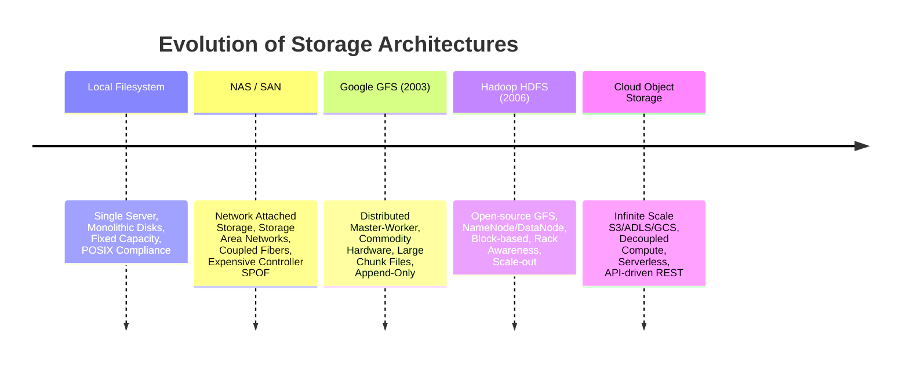
*(Diagram Source: [timeline-evolution.mermaid](diagrams/timeline-evolution.mermaid))*

1. **Local Filesystem:** Files reside on a single server's local hard disk (ext4, NTFS). Bound by the physical capacity of the slot drives.
2. **Network Attached Storage (NAS) / Storage Area Networks (SAN):** Systems share disk storage pools over dedicated fiber networks. Highly reliable, but extremely expensive and bounded by controller scalability limits.
3. **Google GFS:** Introduced master-worker architecture using cheap consumer computers, splitting files into 64MB chunks and replicating them across nodes.
4. **HDFS:** The open-source Java implementation of GFS, increasing block sizes to 128MB, introducing rack awareness and metadata journal systems.
5. **Modern Object Storage:** Cloud services (Amazon S3, Google Cloud Storage) decouple storage from compute completely, providing HTTP-based REST APIs to read/write unstructured objects.

---

# SECTION 2 — PROBLEM STATEMENT

## Traditional Storage Architecture Constraints

Before distributed filesystems, enterprises relied on centralized databases connected to dedicated **SAN (Storage Area Network)** or **NAS (Network Attached Storage)** arrays. As data volumes exploded in the web era, these monolithic architectures hit physical, financial, and network limits.

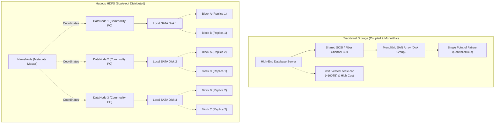
*(Diagram Source: [traditional-storage-v-hdfs.mermaid](diagrams/traditional-storage-v-hdfs.mermaid))*

### 1. The Physical Limit of Vertical Scaling (Scale-Up)
Relational databases and SAN units scale vertically by upgrading the CPU, RAM, and disks of a single machine.
* **Bus Bandwidth Limitation:** Even with fast SSDs, the server's internal PCI/SATA controller bus becomes saturated, bottlenecking read/write operations.
* **Scale Ceiling:** There is a physical limit to the number of hard drives and memory sticks a single motherboard can support.

### 2. Financial Limits of Enterprise Hardware
SAN and NAS systems rely on proprietary high-end storage controllers, fiber-channel networks, and enterprise-grade hard disks. Scaling from 100TB to 1PB on enterprise hardware increases costs exponentially, making it economically unfeasible for high-velocity logs and web events.

### 3. Single Point of Failure (SPOF)
In traditional NAS setups, a failure in the fiber switch or the storage controller CPU takes down the entire storage array, stopping all company applications.

### 4. Network Bottlenecks
In traditional configurations, the database server is physically separate from the storage array. The data must travel from the SAN over fiber/Ethernet cables to the server's CPU to execute queries. When analyzing terabytes of logs, the network channel becomes saturated, rendering computation slow.

---

# SECTION 3 — HDFS ARCHITECTURE DEEP DIVE

HDFS employs a **Master-Worker topology**, separating metadata management from physical data storage. 

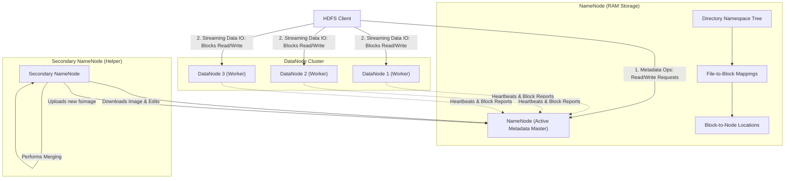
*(Diagram Source: [hdfs-architecture.mermaid](diagrams/hdfs-architecture.mermaid))*

## The NameNode (Master)

The **NameNode** is the single point of coordination for the HDFS cluster. It is a highly optimized JVM process that manages the file system directory structure and block allocations.

### Responsibilities:
* **Namespace Management:** Maintains the entire HDFS directory tree and file paths (e.g. `/user/curriculum/data/file.csv`).
* **Metadata Directory:** Stores file attributes: permissions, modification times, ownership (UID/GID), and block size.
* **File-to-Block Mapping:** Records which specific block IDs belong to a file. For instance, `file.csv` is mapped to `[Block 1001, Block 1002]`.
* **Block Location Directory:** Tracks which DataNode is hosting which block replicas. *Note: Unlike directory structures, block locations are not stored persistently on disk. Instead, the NameNode builds this map dynamically in memory from the Block Reports sent by DataNodes during startup.*

> [!IMPORTANT]
> The NameNode stores its entire metadata map in **RAM (System Memory)** to guarantee sub-millisecond lookups. This introduces a major scaling bottleneck: the namespace size is bounded by the NameNode server's physical RAM.

---

## The DataNode (Worker)

**DataNodes** are the workers of the cluster. They are responsible for storing and retrieving the raw binary blocks of HDFS files on their local native filesystems (e.g., ext4, XFS).

### Responsibilities:
* **Block Storage:** Stores individual HDFS block files (named like `blk_1073741825`) on local disks. Each block is stored along with a meta file (`.meta`) containing checksums to detect data corruption.
* **Data Block Operations:** Reads and writes block bytes stream directly from/to clients over TCP socket channels.
* **Heartbeats:** Sends periodic heartbeats (default every 3 seconds) to the NameNode to signal that the DataNode is alive and healthy.
* **Block Reports:** Sends a list of all locally stored block IDs to the NameNode (typically once every 6 hours) so the master can compile its global block-to-node location mapping.

---

## Secondary NameNode (The Helper)

A common misconception is that the **Secondary NameNode** is a hot backup or standby failover server. **This is false.** The Secondary NameNode does not handle queries or take over if the NameNode fails.

### Actual Purpose:
The Secondary NameNode is a housekeeping helper. Its sole responsibility is to download the NameNode's active metadata checkpoint files (`fsimage` and `edit logs`), merge them together, and upload the compact consolidated metadata back to the primary NameNode. This checkpointing process prevents the edit log from growing infinitely.

---

# SECTION 4 — INTERNAL WORKING

## File Write Flow

Writing a file to HDFS involves a direct handshake with the NameNode, followed by a pipelined write stream to the DataNodes to maximize network efficiency.

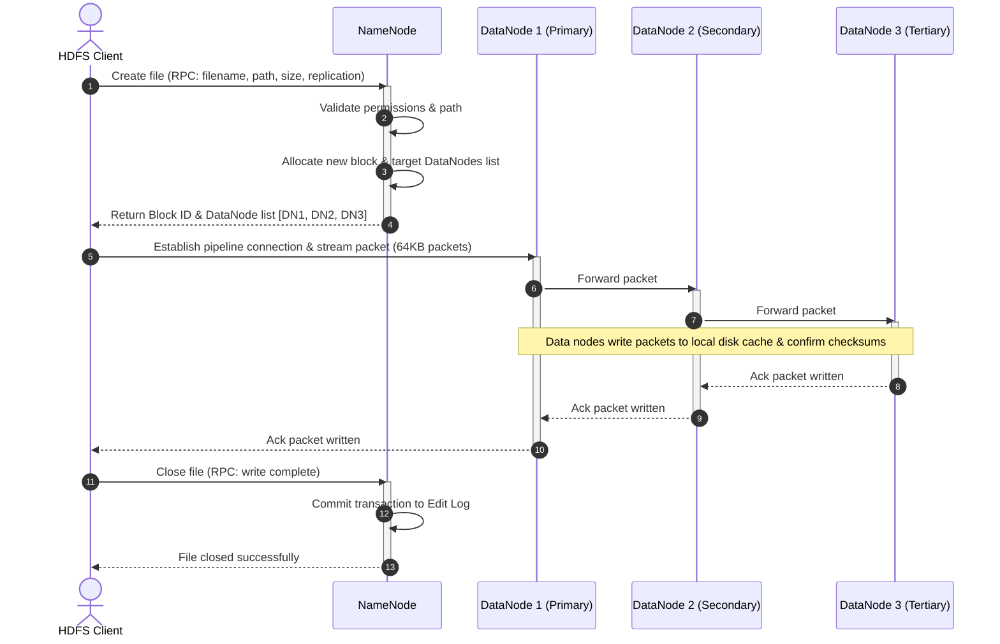
*(Diagram Source: [write-flow.mermaid](diagrams/write-flow.mermaid))*

### Step-by-Step Write Walkthrough:
1. **Creation Request:** The client calls `create()` on the HDFS `DistributedFileSystem` API. The client library executes an RPC request to the NameNode to create a new empty file entry.
2. **Metadata Checks:** The NameNode verifies that the client has write permissions and that the target directory exists. If checks pass, it locks the namespace path and returns a success response.
3. **Block Allocation:** The client calls `write()` on the returned `FSDataOutputStream`. The stream contacts the NameNode to request a new block allocation. The NameNode responds with a unique Block ID and a list of target DataNodes to host the replicas (e.g. DataNode 1, DataNode 2, DataNode 3).
4. **Pipelining Setup:** The client splits the data block into small 64KB packets. It establishes a TCP connection directly with the first DataNode (`DN1`), which in turn connects to `DN2`, which connects to `DN3`. This forms a **data pipeline**.
5. **Streaming Transfer:** The client streams packets to `DN1`. As `DN1` receives each packet, it writes it to its local cache and immediately pushes it down the pipeline to `DN2`, which forwards it to `DN3`.
6. **Acks & Verification:** Packet acknowledgments stream backward: `DN3` sends an ACK to `DN2`, which passes it to `DN1`, which forwards it to the client. This pipeline ensures the client can saturate its network interface without waiting for all disk writes to complete.
7. **Finalization:** Once the block is full (128MB), the pipeline is closed. The client contacts the NameNode to close the file. The NameNode registers the block allocations and commits the transaction to its edit log.

---

## File Read Flow

HDFS read operations query the NameNode for metadata locations once, then retrieve data blocks directly from the nearest DataNodes to bypass master bottlenecks.

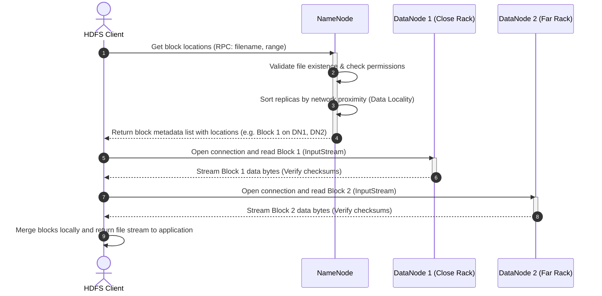
*(Diagram Source: [read-flow.mermaid](diagrams/read-flow.mermaid))*

### Step-by-Step Read Walkthrough:
1. **Metadata Lookup:** The client calls `open()` on `DistributedFileSystem`. It issues an RPC to the NameNode to get the block locations for the target file.
2. **Proximity Sorting:** The NameNode verifies permissions, locates the block list, and returns a sorted list of DataNode addresses for each block. Crucially, the NameNode sorts DataNode addresses based on **network topology distance** to the client. If a replica is in the client's local machine, it is listed first (Data Locality).
3. **Direct Data Streams:** The client opens an `FSDataInputStream` and connects directly to the first DataNode in the block's list. It reads the block bytes sequentially.
4. **Checksum Verification:** The client checks the data bytes against the checksums in the `.meta` file. If a mismatch is detected, the client logs the failure, reports the corrupt block to the NameNode, and attempts to read the block replica from the next healthy DataNode.
5. **Next Block Retrieval:** Once Block 1 is fully read, the input stream closes the socket connection and opens a new connection to the DataNode hosting Block 2. This cycle continues until the entire file is read.

---

## Failure Handling & Recovery

HDFS expects system components to fail, implementing automated recovery loops to maintain durability.

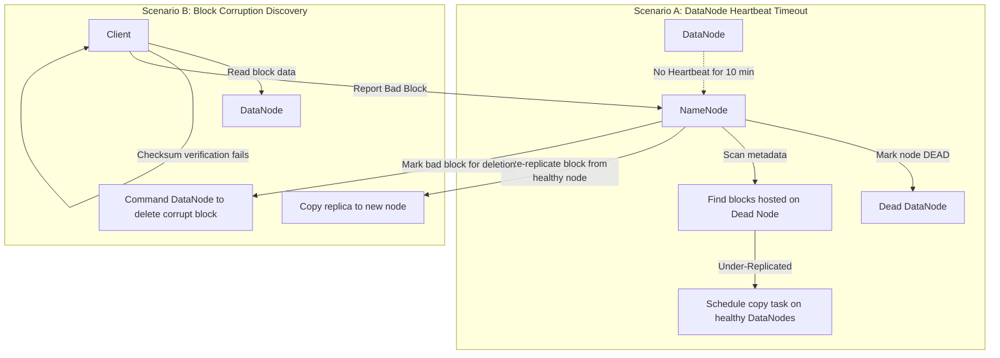
*(Diagram Source: [failure-recovery.mermaid](diagrams/failure-recovery.mermaid))*

### 1. DataNode Failure Detection
DataNodes register with the NameNode and send heartbeats every 3 seconds. If a DataNode crashes or is disconnected, heartbeats stop.
* **Heartbeat Timeout:** If the NameNode receives no heartbeat from a DataNode for **10 minutes** (configured via `dfs.namenode.heartbeat.recheck-interval`), it marks the node as **DEAD**.
* **Re-Replication:** The NameNode scans its metadata to identify blocks stored on the dead node. It schedules these blocks for copy tasks on healthy DataNodes to restore the target replication factor.

### 2. Block Corruption Detection
When a client reads a block, it validates checksums. If a checksum error occurs:
* The client notifies the NameNode of the corrupt block ID and host node.
* The NameNode schedules a copy of the block from a healthy replica to a new DataNode.
* Once copy is verified, the NameNode registers the new block and marks the corrupt replica on the failed node for background deletion.

### 3. NameNode Recovery (Startup & Edit Logs)
When the NameNode starts up:
1. It loads the consolidated `fsimage` checkpoint into memory.
2. It plays the unmerged transactions from the active `edit log` sequentially to reconstruct the directory state.
3. It enters **Safe Mode** (a read-only state).
4. It waits for DataNodes to register and send block reports. Once 99.9% of blocks have registered, it exits Safe Mode and opens the file system for write operations.

---

# SECTION 5 — BLOCKS

## Why HDFS Uses Blocks

Unlike traditional OS filesystems that store files in small clusters (typically 4KB), HDFS segments files into massive **Blocks** (default 128MB). 

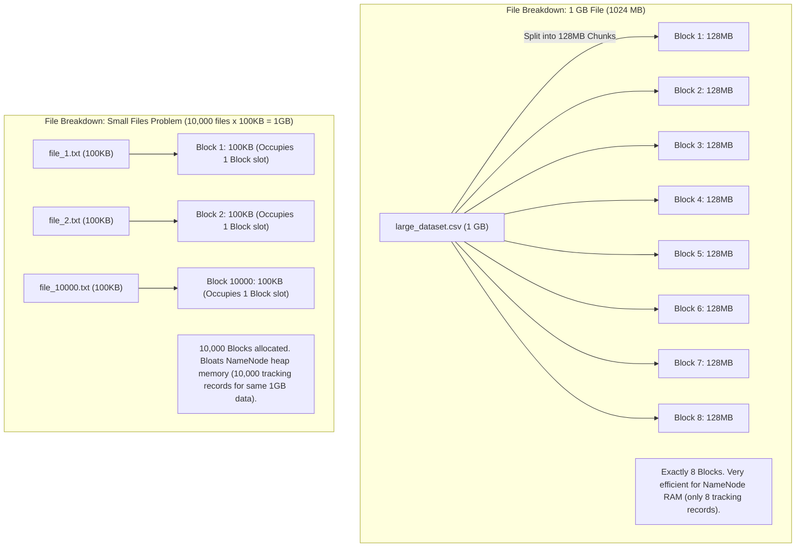
*(Diagram Source: [block-strategy.mermaid](diagrams/block-strategy.mermaid))*

### Reasons for Large Block Sizes:
1. **Minimize Disk Seek Time:** Hard drives are slow to seek (locate the physical cylinder on disk) but fast to stream bytes sequentially. If block size is 128MB, the disk controller spends negligible time seeking relative to the time spent streaming the block data, maximizing disk read speeds.
2. **Reduce NameNode RAM Footprint:** The NameNode keeps all file paths, block metadata, and mappings in memory. A 10GB file split into 4KB blocks yields 2.6 million blocks, consuming over 300MB of NameNode RAM. Split into 128MB blocks, it requires only 80 blocks, using less than 15KB of RAM.

---

## HDFS Block Calculations

Let's trace how files of different sizes are fragmented and stored inside an HDFS cluster with **dfs.blocksize = 128MB** and **dfs.replication = 3**.

### Case 1: 1 GB File (1024 MB)
* **Block Fragmentation:** 1024 MB / 128 MB = **Exactly 8 Blocks**.
* **Physical Space Occupied on Disk:** Each block is replicated 3 times.
  $$\text{Total Storage Space} = 8 \text{ blocks} \times 128\text{MB} \times 3 \text{ (replicas)} = 3072\text{MB} = 3\text{GB}$$
* **NameNode Memory Overhead:** 8 blocks + 1 file directory node = **9 metadata objects in RAM**.

### Case 2: 200 MB File
* **Block Fragmentation:** 
  * Block 1 = **128 MB** (Fully allocated)
  * Block 2 = **72 MB** (HDFS does *not* pre-allocate the full 128MB space. If a file block has only 72MB of data, it uses only 72MB on the physical host disk.)
* **Physical Space Occupied on Disk:**
  $$\text{Total Storage Space} = (128\text{MB} + 72\text{MB}) \times 3 = 600\text{MB}$$
* **NameNode Memory Overhead:** 2 blocks + 1 file directory node = **3 metadata objects in RAM**.

---

## The Small Files Problem

A "Small File" is any file that is significantly smaller than the block size (e.g. 10KB, 500KB logs). In enterprise clusters, having millions of small files is a severe operational risk.

### Why Small Files Damage HDFS:
* **NameNode RAM Exhaustion:** Every directory, file, and block metadata object in the NameNode namespace consumes approximately **150 bytes** of memory. If a client writes 10 million files of 10KB each (total data ~100GB), the NameNode must track 10 million files and 10 million blocks. This consumes 3GB of RAM. If they were merged into 100 files of 1GB, the NameNode would track only 800 blocks, using just 150KB of RAM!
* **Slow MapReduce / Spark Computations:** Data processing frameworks assign one task mapper per block. Scanning 10 million blocks spawns 10 million tasks, causing execution queues to freeze under scheduling overhead.
* **Remediations:**
  * Use compaction jobs (Spark/Flink or file aggregators) to merge small files.
  * Store files inside **HAR (Hadoop Archives)** which packages files into large metadata blocks.
  * Transition to modern object storage formats (like Apache Iceberg) that optimize metadata catalogs.

---

# SECTION 6 — REPLICATION

## Replication Factor (RF)

To guarantee high availability and fault tolerance, HDFS replicates blocks across the cluster. The number of block copies is determined by the **Replication Factor (RF)**, configured globally via `dfs.replication` and adjustable per-file during write operations.

* **RF = 1 (No Redundancy):** Blocks are stored on a single DataNode. If the node crashes, data is inaccessible. Used only for temporary scratch paths or non-critical logs.
* **RF = 2 (Medium Redundancy):** Blocks are stored on two different DataNodes. Protects against a single node failure.
* **RF = 3 (Default Enterprise Standard):** Blocks are replicated three times across at least two independent server racks. This protects against dual-disk failures or an entire rack losing power.

---

## Rack Awareness & Replica Placement Policy

In multi-node clusters, servers are mounted on physical chassis racks. Each rack has a single Top-of-Rack (TOR) switch. If the switch fails, all nodes on that rack go offline. To maximize durability, HDFS implements **Rack Awareness**.

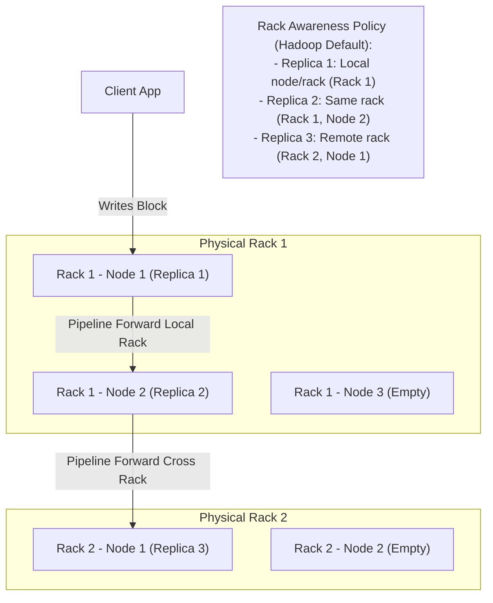
*(Diagram Source: [replication-workflow.mermaid](diagrams/replication-workflow.mermaid))*

### The Default Placement Policy (RF = 3):
1. **Replica 1:** Placed on the local node executing the write. If the write is initiated outside the cluster, it is placed on a random node with low CPU/disk utilization.
2. **Replica 2:** Placed on a different node in the same rack as the first replica. This reduces cross-rack network traffic during write operations.
3. **Replica 3:** Placed on a node in a completely different rack. If Rack 1 loses power, Rack 2 remains online, guaranteeing that the block replica can still be read.
4. **Replica 4+ (If RF > 3):** Placed on random nodes throughout the cluster, ensuring that no more than two replicas reside on the same rack.

---

# SECTION 7 — METADATA MANAGEMENT

## How NameNode Tracks Changes

Because the NameNode keeps its metadata in RAM for speed, a sudden server crash or power failure would wipe out the memory state, corrupting the filesystem namespace. To prevent this, NameNode uses a write-ahead logging strategy with two physical disk files.

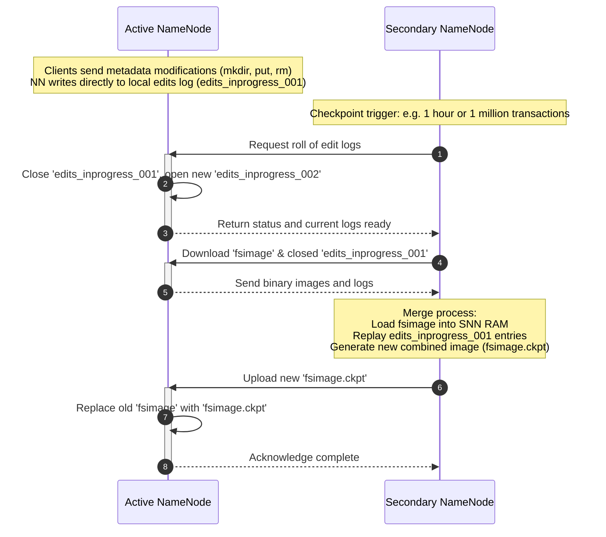
*(Diagram Source: [metadata-flow.mermaid](diagrams/metadata-flow.mermaid))*

### 1. The Edit Log
The `edit log` is an append-only transaction journal stored on the NameNode's local host disk (e.g. `edits_inprogress_000001`). 
* Every mkdir, rename, delete, or file creation transaction is appended sequentially to this log *before* the changes are committed to the NameNode's memory map.
* Sequential disk appends are fast, preserving metadata integrity with negligible latency.

### 2. The FSImage
The `fsimage` is a frozen snapshot of the HDFS directory tree structure, representing the filesystem namespace at a specific point in time. It is stored as a binary serialization file on disk. 
* The NameNode does *not* write every transaction to the `fsimage` directly because updating a global snapshot disk file for every client write would cause slow write latency.

---

## Checkpointing Loop

Since the `edit log` grows with every namespace change, it would eventually consume all disk space, and restarting the NameNode would take hours because it has to replay millions of edits. The checkpointing process merges these files.

### Step-by-Step Checkpointing (Secondary NameNode):
1. **Trigger:** The Secondary NameNode initiates checkpointing periodically (default: every 1 hour, or if the edit log reaches 1 million transactions).
2. **Log Roll:** It contacts the active NameNode and requests an edit log roll. The NameNode closes the current log file (e.g., `edits_inprogress_001`) and opens a new log (`edits_inprogress_002`) to handle active writes.
3. **Fetch:** The Secondary NameNode downloads the last frozen `fsimage` and `edits_inprogress_001` from the active NameNode via HTTP.
4. **Merge:** The Secondary NameNode loads the `fsimage` into its own RAM, replays all changes from `edits_inprogress_001`, and generates a consolidated metadata snapshot (`fsimage.ckpt`).
5. **Push:** The Secondary NameNode uploads the new `fsimage.ckpt` back to the active NameNode.
6. **Replace:** The Active NameNode replaces its old `fsimage` with the new checkpoint image, ensuring its disk backup remains current.

---

# SECTION 8 — CORE CONCEPTS

For beginners getting started with HDFS, here is a quick reference mapping key distributed engineering terms to basic analogies.

```
┌──────────────────────────────────────────────────────────────────────────────────────────────┐
│                                HDFS Core Architectural Concepts                              │
├───────────────────────┬──────────────────────────────────────────────────────────────────────┤
│ Distributed Storage   │ Splitting a large book across separate volumes on different shelves. │
├───────────────────────┼──────────────────────────────────────────────────────────────────────┤
│ Data Locality         │ Moving the cook to the kitchen ingredients rather than shipping food.│
├───────────────────────┼──────────────────────────────────────────────────────────────────────┤
│ Fault Tolerance       │ Having spare backup tires already mounted and ready on a utility van.│
├───────────────────────┼──────────────────────────────────────────────────────────────────────┤
│ Replication           │ Keeping copies of keys on separate rings to prevent lockout.         │
├───────────────────────┼──────────────────────────────────────────────────────────────────────┤
│ Block Storage         │ Packing a large shipments into standardized modular cargo shipping.  │
├───────────────────────┼──────────────────────────────────────────────────────────────────────┤
│ Heartbeats            │ Standard beacon signals sent by nodes confirming they are online.    │
├───────────────────────┼──────────────────────────────────────────────────────────────────────┤
│ Block Reports         │ Inventory lists sent from warehouses telling headquarters contents.  │
├───────────────────────┼──────────────────────────────────────────────────────────────────────┤
│ Rack Awareness        │ Distributing server power feeds across separate electrical circuits. │
├───────────────────────┴──────────────────────────────────────────────────────────────────────┘
```

---

# SECTION 9 — PRODUCTION ENGINEERING

## High Availability (HA)

In traditional Hadoop 1.x, the single NameNode was a Single Point of Failure (SPOF). If the NameNode crashed, the entire filesystem went offline. Hadoop 2.x and 3.x introduced **HDFS NameNode High Availability (HA)**.

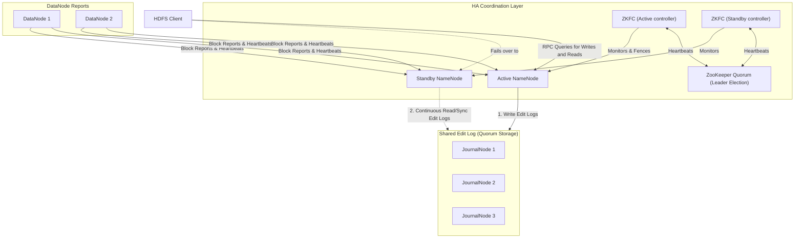
*(Diagram Source: [ha-architecture.mermaid](diagrams/ha-architecture.mermaid))*

### The HA Component Stack:
1. **Active NameNode:** Handles active clients requests (read/write), writes modifications to the JournalNode quorum, and coordinates block reports.
2. **Standby NameNode:** Runs continuously in parallel, reads modification entries from the JournalNodes to keep its memory map in sync, and processes block reports. If the Active node fails, it transitions to Active in seconds.
3. **JournalNodes (QJM):** A quorum cluster (typically 3 or 5 nodes) that stores shared edit logs. The Active NameNode writes transactions to them, and the Standby reads updates. Any write must be acknowledged by a quorum (e.g. 2 out of 3) to succeed.
4. **ZooKeeper:** A centralized service that coordinates leader election, ensuring that only one NameNode acts as the active writer at a time.
5. **ZKFC (ZooKeeper Failover Controller):** A daemon running on both NameNode servers. It monitors NameNode health and maintains a session lock in ZooKeeper. If the Active NameNode goes unresponsive, the ZKFC releases its lock, and the Standby's ZKFC detects this, promotes the Standby to Active, and secures the cluster.

---

## Scalability & Rebalancing

As HDFS clusters grow, servers are added to increase storage capacity.
* **Adding Nodes:** You can register a new DataNode by starting the service on a new host pointing to the NameNode. The NameNode registers the node and schedules block writes on it.
* **The Rebalancer:** A newly added DataNode starts with 0% utilization, while older nodes might be at 95%. This causes write bottlenecks. Administrators run the **HDFS Balancer** to move block replicas around:
  ```bash
  # Run the balancer with a 10% threshold
  hdfs balancer -threshold 10
  ```
  This command moves blocks from over-utilized nodes (usage > average + 10%) to under-utilized nodes (usage < average - 10%) until the cluster storage distribution stabilizes.

---

## Security in HDFS

HDFS uses a robust security model to protect corporate data:
* **Authentication (Kerberos):** Secures the cluster so that only authenticated users and services can connect. Every user and daemon must possess a valid cryptographic keytab.
* **Authorization (Apache Ranger):** Provides centralized, fine-grained access policies. You can configure rules like "Group analytics has read-only access to `/user/curriculum/` but no access to `/user/finance/`".
* **Encryption-at-Rest (Transparent Encryption):** Configures HDFS **Encryption Zones**. Data written to these directories is encrypted by the client before transmission, and decrypted on read, using keys managed by a Key Trustee Server.
* **Access Control Lists (ACLs):** Extends standard POSIX permissions to support fine-grained read/write permissions for specific users and groups.

---

## Observability & Monitoring Metrics

Administrators track HDFS health via JMX endpoints, using tools like Prometheus and Grafana.

### Key Production Metrics to Watch:
1. **Under-Replicated Blocks:** A non-zero value indicates that a DataNode has crashed or disk arrays have failed, meaning some blocks have fewer copies than configured.
2. **Missing Blocks:** A critical metric. If this is greater than zero, some blocks have no online replicas, meaning some files are unreadable.
3. **NameNode Heap Memory Usage:** Track JVM heap memory usage. If memory usage exceeds 90%, the NameNode may experience GC pauses or crash due to OOM errors.
4. **DataNode Dead Count:** Monitors the count of unresponsive DataNodes.
5. **Safe Mode State:** Indicates if the cluster is stuck in read-only safe mode.

---

# SECTION 10 — HANDS-ON LAB

## Create HDFS Cluster Locally

In this hands-on lab, we will launch a local HDFS cluster containing **one NameNode** and **three DataNodes** using Docker Compose. We will run diagnostics and execute file operations.

### Prerequisites:
* **System Hardware:** Minimum **8GB RAM** and **4 CPU cores** dedicated to Docker.
* **Software:** Docker Desktop installed and running.
* **Terminal:** Bash shell (WSL/Git Bash on Windows, Terminal on Linux/macOS).

---

### Step 1: Navigate and Deploy

Navigate to the day's root folder and spin up the Docker services:
```bash
cd Day-02-HDFS-Architecture
docker compose -f docker/docker-compose.yml up -d
```

---

### Step 2: Verify the Cluster Health

Run the NameNode verification script to check container status, port bindings, and JMX parameters:
```bash
bash scripts/verify-namenode.sh
```

**Example Output:**
```text
=== HDFS NameNode Diagnostics ===
[OK] Container 'namenode-day02' is running.

Checking port bindings...
[OK] NameNode is listening on RPC port 9000 (Internal IPC)
[OK] NameNode is listening on Web UI port 9870 (HTTP)

Querying NameNode JMX Endpoint...

=== NameNode Info ===
Hadoop Version:      3.2.1
Safe Mode Status:    Safe mode is OFF
Total HDFS Capacity: 62 GB
Used HDFS Capacity:  0 GB
Free HDFS Capacity:  48 GB
Live DataNodes:      3
Dead DataNodes:      0

[SUCCESS] NameNode health verification completed successfully. All 3 DataNodes are registered and active.
```

Next, verify that all three DataNodes are registered with the NameNode:
```bash
bash scripts/verify-datanodes.sh
```

---

### Step 3: Run File Operations

Now, write and read files from the distributed filesystem.

1. **Create an HDFS Directory:**
   ```bash
   docker exec -it namenode-day02 hdfs dfs -mkdir -p /user/data
   ```
2. **Upload a File to HDFS:**
   ```bash
   docker exec -it namenode-day02 hdfs dfs -put /etc/hadoop/core-site.xml /user/data/
   ```
3. **List Directory Contents and Inspect Replication Count:**
   ```bash
   docker exec -it namenode-day02 hdfs dfs -ls /user/data/
   ```
   *Note: In the output columns, the number 3 indicates the block replication factor.*
4. **Read File Content from HDFS:**
   ```bash
   docker exec -it namenode-day02 hdfs dfs -cat /user/data/core-site.xml
   ```

---

### Step 4: Run the Automated Replication Test

Run the verification script to trace how blocks are placed across nodes, and how HDFS manages replication adjustments:
```bash
bash scripts/verify-replication.sh
```

---

### Step 5: Tear Down the Cluster
When finished, stop the containers and delete volume mounts:
```bash
docker compose -f docker/docker-compose.yml down -v
```

---

# SECTION 11 — BUILD FROM SOURCE

In production enterprises, developers often build Apache Hadoop from source to apply patches, compile native libraries (like Snappy/LZO compression), or customize build options.

## Maven Build Process

### Build Prerequisites (Ubuntu/CentOS):
* **Java Development Kit:** JDK 8 (Hadoop 3.2.x compiles exclusively on JDK 8).
* **Build Tools:** Apache Maven 3.6.0+, Protocol Buffers compiler (protoc 2.5.0), CMake, GCC, and Zlib development libraries.

### Compiling Hadoop Step-by-Step:
1. **Clone the official repository:**
   ```bash
   git clone https://github.com/apache/hadoop.git
   cd hadoop
   git checkout rel/release-3.2.1
   ```
2. **Compile the source code using Maven:**
   ```bash
   mvn clean package -Pdist -DskipTests -Dtar -Dbundle.snappy
   ```
   * **`-Pdist`:** Activates distribution layouts.
   * **`-DskipTests`:** Skips compiling and running unit tests to speed up compilation.
   * **`-Dtar`:** Packages the binaries into a `.tar.gz` distribution file.
   * **`-Dbundle.snappy`:** Bundles native Snappy compression libraries.
3. **Locate Build Binaries:**
   Once compile succeeds, locate the package at:
   `hadoop-dist/target/hadoop-3.2.1.tar.gz`

---

## Common Build Failures & Debugging Techniques

1. **Protocol Buffer version mismatch:**
   * *Symptom:* Compilation fails under `hadoop-common-project` with protobuf compile errors.
   * *Fix:* Ensure `protoc --version` returns `2.5.0` (required for Hadoop 2.x and 3.2.x). Install it manually from source if needed.
2. **Java version mismatch:**
   * *Symptom:* Compiler throws class format error warnings.
   * *Fix:* Ensure `java -version` and `javac -version` point to JDK 8.

---

# SECTION 12 — DOCKER DEPLOYMENT

For Day 2, we deploy a sandbox environment using Docker Compose.

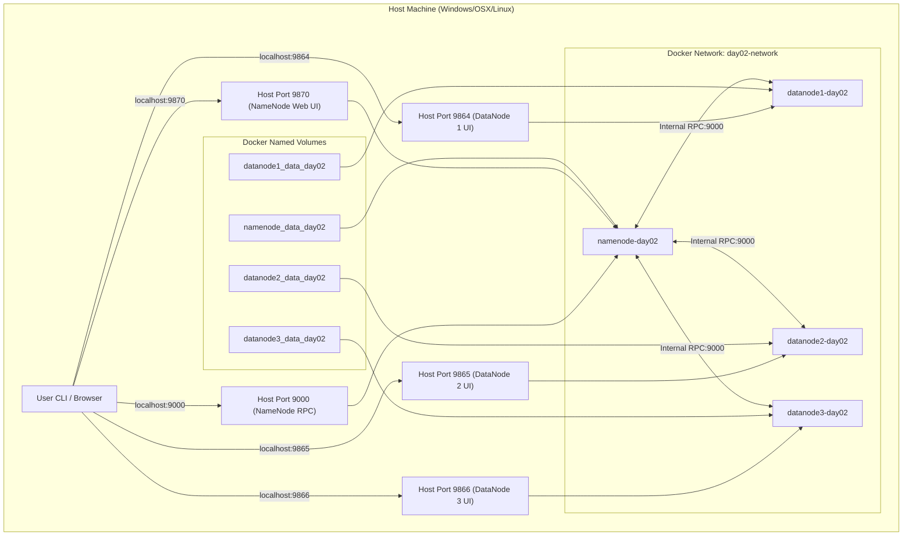
*(Diagram Source: [docker-deployment.mermaid](diagrams/docker-deployment.mermaid))*

### Network & Port Layout:

| Container | Image | Internal Port | Host Port Mapping | Volume Mount |
|---|---|---|---|---|
| `namenode-day02` | `bde2020/hadoop-namenode:2.0.0-hadoop3.2.1-java8` | `9870` (HTTP), `9000` (RPC) | `9870:9870`, `9000:9000` | `namenode_data_day02:/hadoop/dfs/name` |
| `datanode1-day02` | `bde2020/hadoop-datanode:2.0.0-hadoop3.2.1-java8` | `9864` (HTTP) | `9864:9864` | `datanode1_data_day02:/hadoop/dfs/data` |
| `datanode2-day02` | `bde2020/hadoop-datanode:2.0.0-hadoop3.2.1-java8` | `9864` (HTTP) | `9865:9864` | `datanode2_data_day02:/hadoop/dfs/data` |
| `datanode3-day02` | `bde2020/hadoop-datanode:2.0.0-hadoop3.2.1-java8` | `9864` (HTTP) | `9866:9864` | `datanode3_data_day02:/hadoop/dfs/data` |

---

# SECTION 13 — LOCAL CLUSTER DEPLOYMENT

## Hadoop Execution Modes

When deploying Hadoop outside of Docker, administrators configure the cluster in one of three modes:

```
 ┌───────────────────────┐     ┌───────────────────────┐     ┌───────────────────────┐
 │   Local (Standalone)  │     │   Pseudo-Distributed  │     │    Fully Distributed  │
 ├───────────────────────┤     ├───────────────────────┤     ├───────────────────────┤
 │ Single JVM Process    │     │ Daemons simulate nodes│     │ Daemons execute on    │
 │ Local host disk FS    │     │ Localhost interfaces  │     │ independent host servers│
 │ Used for testing Java │     │ Used for development  │     │ Production clusters   │
 └───────────────────────┘     └───────────────────────┘     └───────────────────────┘
```

1. **Local (Standalone) Mode:** The default execution mode. Hadoop runs as a single Java process, using the local filesystem instead of HDFS. Used for compiling MapReduce code.
2. **Pseudo-Distributed Mode:** Simulates a cluster on a single machine. Every HDFS daemon (NameNode, DataNode, Secondary NameNode) executes as an independent JVM process on localhost, communicating via network ports.
3. **Fully Distributed Mode:** The production standard. HDFS daemons execute on separate physical servers, using dedicated networks and host firewalls.

---

# SECTION 14 — VALIDATION

We have created four bash scripts inside `scripts/` to validate cluster status:

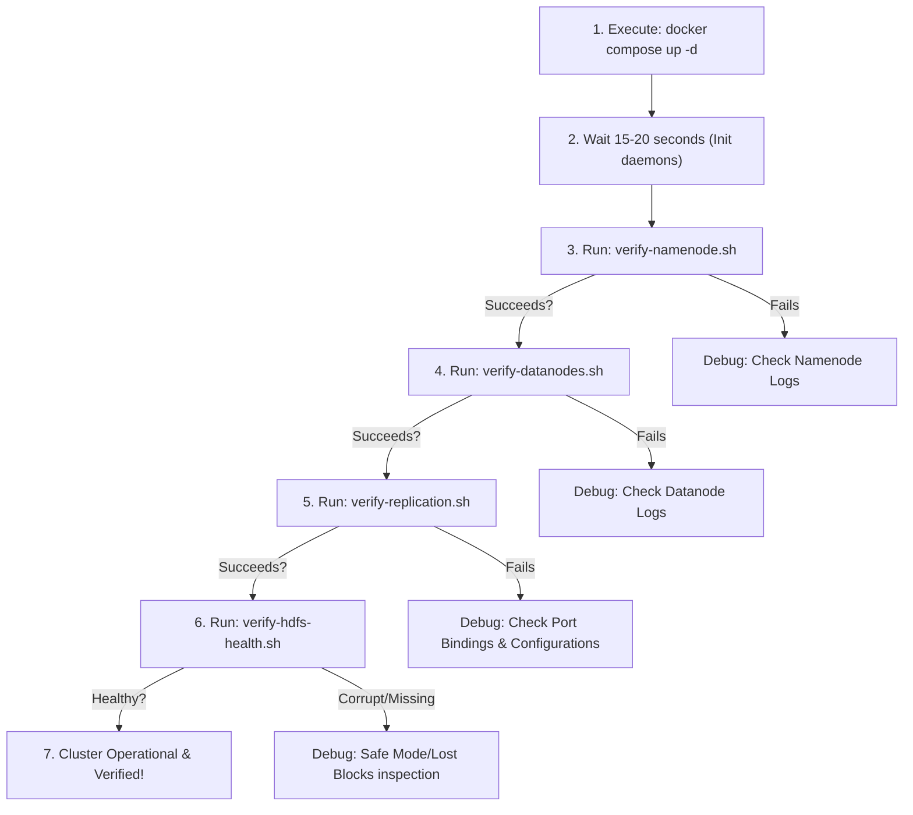
*(Diagram Source: [local-cluster-setup.mermaid](diagrams/local-cluster-setup.mermaid))*

1. **`scripts/verify-namenode.sh`**
   * Checks container status, verifies ports `9000` and `9870`, and parses NameNode Info from the JMX Web API.
2. **`scripts/verify-datanodes.sh`**
   * Validates DataNode container statuses, checks for heartbeat logs, and generates a report of registered DataNodes.
3. **`scripts/verify-replication.sh`**
   * Uploads a file with replication factor 3, runs `fsck` to show block allocations across nodes, and adjusts the replication factor dynamically.
4. **`scripts/verify-hdfs-health.sh`**
   * Queries Safe Mode status, checks disk capacity, and counts corrupt, missing, or under-replicated blocks.

---

# SECTION 15 — PRODUCTION TROUBLESHOOTING PLAYBOOK

Here is a quick reference matrix of common HDFS issues, symptoms, root causes, logs, and resolution actions:

| Issue | Symptoms | Root Cause | Logs | Resolution |
|---|---|---|---|---|
| **NameNode OOM** | NameNode process crashes; filesystem unresponsive. | JVM heap memory exhausted by excessive metadata (small files). | `java.lang.OutOfMemoryError: Java heap space` | Increase memory allocations in `hadoop-env.sh` (e.g. `HADOOP_NAMENODE_OPTS="-Xmx8g"`) and restart. |
| **Missing Blocks** | `fsck` reports missing blocks; client reads fail. | All nodes hosting a block's replicas are offline. | `BlockMissingException: Could not find block` | Start the offline DataNodes holding the replicas. If data is permanently lost, delete the corrupt file: `hdfs dfs -rm /file`. |
| **Under-Replicated Blocks** | `fsck` reports under-replication. | A DataNode crashed, or replication factor config was increased. | `ReplicationMonitor: block is under-replicated` | HDFS will re-replicate blocks automatically. Verify that all DataNodes are active. |
| **Safe Mode Stuck** | Client writes fail with SafeModeException. | NameNode is waiting for block reports from offline DataNodes. | `SafeModeException: Cannot write. NameNode in safe mode.` | Check DataNode connectivity. If safe mode persists and you accept the data loss, run: `hdfs dfsadmin -safemode leave`. |
| **DataNode Down** | DataNode service stops. | Local storage disk full, or connection to NameNode lost. | `IOException: No space left on device` or `DisallowedDatanodeException` | Free up local host disk space, adjust disk reservations, or correct hostname resolution configs. |
| **Block Corruption** | Checksum verification fails on read. | Disk sector failure corrupting the block file on a DataNode. | `ChecksumException: Checksum mismatch` | Client automatically reads from another replica. The NameNode will replace the corrupt block by copying a healthy replica to a new node. |
| **Disk Full** | DataNodes stop writing new blocks. | Storage allocation fully utilized. | `DataNode: Disk Out of Space` | Run the rebalancer: `hdfs balancer -threshold 10`. Delete obsolete files, or add new DataNodes to the cluster. |
| **Slow Reads** | Client read latency increases. | High CPU usage on DataNode, network congestion, or poor data locality. | `Slow BlockReceiver read took X ms` | Optimize data locality in application queries. Check for network switch congestion. |
| **Slow Writes** | Client write operations timeout. | One DataNode in the write pipeline is slow or suffering from disk IO bottlenecks. | `Slow packet write pipeline took X ms` | Identify and replace the slow disk or node in the pipeline. Adjust pipeline timeout configs. |

---

# SECTION 16 — REAL-WORLD CASE STUDY

## Case Study: Netflix-Scale Event Storage

Before migrating to cloud-native object storage formats (like Apache Iceberg on AWS S3), Netflix operated large, exabyte-scale physical HDFS clusters to store clickstream data and user streaming logs.

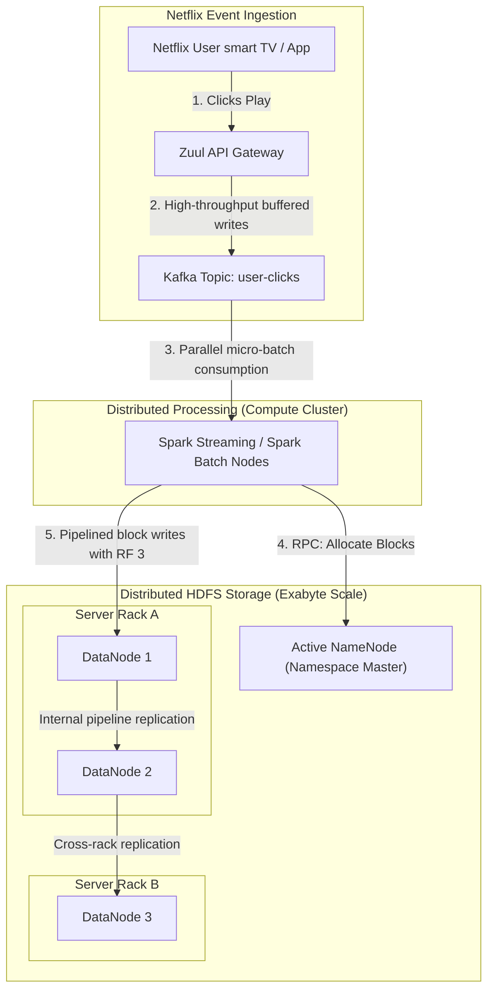
*(Diagram Source: [netflix-ingestion.mermaid](diagrams/netflix-ingestion.mermaid))*

### Ingestion Volume & Strategy:
* **Volume:** Over **500 billion events per day** (petabytes of raw logs).
* **Ingestion:** API Gateways buffered events into high-throughput Apache Kafka topic partitions.
* **Processing:** Spark streaming engines pulled micro-batches from Kafka, converted the JSON records to columnar Parquet formats, and wrote them to HDFS.
* **Durability Policies:** Critical financial and viewing records were configured with replication factor 3. Transient user search indices used replication factor 2 to save storage space.
* **Failure Mitigation:** Dynamic rebalancers ran continuously during low-traffic windows to distribute block writes evenly. When entire server racks failed during power outages, NameNodes automatically re-replicated blocks to healthy racks without client interruption.

---

# SECTION 17 — INTERVIEW QUESTIONS

## Beginner Questions (20)

1. **What does HDFS stand for and what is its primary purpose?**
   * *Answer:* HDFS stands for Hadoop Distributed File System. Its primary purpose is to store massive datasets reliably and stream data at high bandwidth to distributed processing applications.
2. **What architecture model does HDFS follow?**
   * *Answer:* It follows a Master-Worker architecture, consisting of a single master NameNode and multiple worker DataNodes.
3. **What is the default HDFS block size in Hadoop 3.x?**
   * *Answer:* The default block size is 128 MB (configured via `dfs.blocksize`).
4. **Why is the HDFS block size so much larger than local filesystem blocks?**
   * *Answer:* Large block sizes minimize disk seek times and reduce the metadata memory footprint on the NameNode JVM heap.
5. **What is the role of the NameNode?**
   * *Answer:* The NameNode manages the filesystem namespace, tracks directory structures, file metadata, permissions, and file-to-block mapping.
6. **What is the role of the DataNode?**
   * *Answer:* The DataNode stores the raw data block files on local disks and handles block read and write streams from clients.
7. **How does HDFS achieve fault tolerance for data blocks?**
   * *Answer:* It replicates blocks across multiple DataNodes (default replication factor is 3).
8. **What is the default block replication factor in HDFS?**
   * *Answer:* The default replication factor is 3.
9. **What is the function of the Secondary NameNode?**
   * *Answer:* The Secondary NameNode checkpoint-merges the `edit logs` and `fsimage` to prevent the edit log from growing too large.
10. **How often does a DataNode send heartbeats to the NameNode?**
    * *Answer:* By default, heartbeats are sent every 3 seconds (configured via `dfs.heartbeat.interval`).
11. **What is a Block Report?**
    * *Answer:* A report sent by a DataNode to the NameNode listing all HDFS blocks stored on its local disk. By default, it runs every 6 hours.
12. **What is Safe Mode in HDFS?**
    * *Answer:* A read-only state during NameNode startup where no modifications can be made to the filesystem. The NameNode waits for DataNodes to upload block reports before exiting Safe Mode.
13. **Can you modify the data of an existing file in HDFS?**
    * *Answer:* No. HDFS follows a "Write Once, Read Many" design. You cannot modify file contents inline, although you can append data if appends are enabled.
14. **What is the command to create a directory in HDFS?**
    * *Answer:* `hdfs dfs -mkdir -p /path/to/directory`
15. **How do you upload a file from a local filesystem to HDFS?**
    * *Answer:* `hdfs dfs -put /local/path /hdfs/path`
16. **How do you read the contents of an HDFS file in the command line?**
    * *Answer:* `hdfs dfs -cat /hdfs/path`
17. **What is a "Small File" in HDFS?**
    * *Answer:* Any file that is significantly smaller than the configured block size (128MB).
18. **Why are small files problematic for HDFS?**
    * *Answer:* Every file metadata object consumes ~150 bytes of JVM heap memory on the NameNode. Millions of small files can exhaust the NameNode's RAM.
19. **How do you check the storage capacity and health of HDFS?**
    * *Answer:* Run `hdfs dfsadmin -report`.
20. **What port does the HDFS NameNode Web UI use by default in Hadoop 3.x?**
    * *Answer:* Port 9870 (it was 50070 in Hadoop 2.x).

---

## Intermediate Questions (20)

21. **Explain the HDFS file write pipeline.**
    * *Answer:* The client requests a block allocation from the NameNode, which returns a list of target DataNodes. The client opens a connection to the first DataNode, which forwards data packets to the second, which forwards them to the third. Packet acknowledgments travel backward down the pipeline to the client.
22. **What is Rack Awareness?**
    * *Answer:* An algorithm that maps DataNodes to physical server racks, allowing the NameNode to distribute block replicas across different racks to prevent data loss during switch failures.
23. **How does HDFS place block replicas when replication factor is 3?**
    * *Answer:* 
      * Replica 1: On the local node (or a random node in the cluster).
      * Replica 2: On a different node in the same rack as the first replica.
      * Replica 3: On a node in a completely different rack.
24. **Explain the difference between `fsimage` and `edit logs`.**
    * *Answer:* The `fsimage` is a frozen binary snapshot of the HDFS directory structure. The `edit log` is an append-only journal of namespace modifications made since the last snapshot.
25. **How does the Secondary NameNode merge `fsimage` and `edit logs`?**
    * *Answer:* The Secondary NameNode triggers an edit log roll on the NameNode, downloads the active `fsimage` and closed `edit logs`, merges them in memory to create a new `fsimage.ckpt`, and uploads it back to the NameNode.
26. **What is Data Locality?**
    * *Answer:* The practice of running application task mappers on the physical nodes that store the targeted block data, minimizing network traffic.
27. **What happens when a DataNode fails to send heartbeats for 10 minutes?**
    * *Answer:* The NameNode marks the node as DEAD, identifies the blocks stored on it, and schedules replication tasks to restore the target replication factor on other healthy nodes.
28. **How does HDFS detect and handle corrupt data blocks?**
    * *Answer:* DataNodes store block checksum files (`.meta`). If a client detects a checksum mismatch during read operations, it reports it to the NameNode, which replicates the block from a healthy node and marks the corrupt replica for deletion.
29. **How do you adjust the replication factor of a file dynamically?**
    * *Answer:* Use the command `hdfs dfs -setrep -w <replication_factor> /path/to/file`.
30. **What is the command to find file system inconsistencies, corrupt blocks, and missing blocks?**
    * *Answer:* `hdfs fsck /`
31. **What is the default heartbeat recheck interval configuration?**
    * *Answer:* 10 minutes (defined by `dfs.namenode.heartbeat.recheck-interval`).
32. **Can a client read a file while it is being written?**
    * *Answer:* A client can read only the blocks that have been fully finalized and closed by the write pipeline. Active block packets are not visible until finalized.
33. **What is the default port for NameNode RPC IPC communication?**
    * *Answer:* Port 9000 (often configured as `hdfs://namenode:9000` in `core-site.xml`).
34. **Does HDFS pre-allocate the full 128MB space on the DataNode host disk for a 10MB file block?**
    * *Answer:* No. A block allocates only the actual size of the data on the local disk. A 10MB file block consumes only 10MB of physical host disk space.
35. **What is the purpose of the HDFS Balancer?**
    * *Answer:* It redistributes block replicas across DataNodes to balance storage utilization, preventing write bottlenecks on over-utilized nodes.
36. **Explain the Pseudo-Distributed execution mode.**
    * *Answer:* Simulates a multi-node cluster on a single host. Every HDFS daemon (NameNode, DataNode, Secondary NameNode) runs as an independent JVM process on localhost, communicating via network ports.
37. **What is the default block report interval?**
    * *Answer:* 6 hours (defined by `dfs.blockreport.intervalMsec` in milliseconds).
38. **How does a client locate block addresses during a file read?**
    * *Answer:* The client calls the NameNode via RPC, requesting the block locations. The NameNode returns a list sorted by network proximity to the client.
39. **What occurs if a DataNode disk runs completely full?**
    * *Answer:* The DataNode logs write failures and may stop accepting block writes, or take itself offline. Administrators configure disk reservations to reserve space for non-HDFS data.
40. **How can you force the NameNode to exit Safe Mode manually?**
    * *Answer:* Run `hdfs dfsadmin -safemode leave`.

---

## Advanced Questions (20)

41. **Explain the architecture of HDFS High Availability (HA).**
    * *Answer:* HA uses two NameNodes (Active and Standby) synced via a quorum of JournalNodes. ZooKeeper Failover Controllers (ZKFC) monitor health and maintain locks in ZooKeeper to automate failover. DataNodes send heartbeats and block reports to both NameNodes.
42. **What is the split-brain scenario in HDFS HA, and how is it prevented?**
    * *Answer:* Split-brain occurs when two NameNodes believe they are Active, causing metadata corruption. It is prevented by **Fencing**: ZooKeeper active lock leases, and ZKFC mechanisms that SSH into the failed NameNode and kill its process (fencing) before promoting the standby.
43. **Describe the role of JournalNodes in Quorum Journal Manager (QJM).**
    * *Answer:* JournalNodes store edit logs in a shared quorum. The Active NameNode writes transactions to them, and the Standby reads updates. Any write must be acknowledged by a majority of JournalNodes (e.g. 2 out of 3) to succeed, preventing split-brain writes.
44. **How does HDFS Federation solve NameNode scaling limitations?**
    * *Answer:* HDFS Federation uses multiple independent NameNodes that share a common pool of DataNodes. Each NameNode manages a separate namespace volume (e.g. `/user` vs `/analytics`), partitioning metadata RAM usage across different masters.
45. **What is the difference between HDFS Federation and HDFS High Availability?**
    * *Answer:* High Availability provides redundancy for a single namespace using Active/Standby states. Federation scales namespace capacity by running multiple active NameNodes that partition the directory structure.
46. **How does HDFS handle block replication recovery when a block's replica count exceeds the target replication factor?**
    * *Answer:* The NameNode detects over-replicated blocks and commands selected DataNodes to delete the extra replicas, prioritizing nodes with lower remaining storage space.
47. **How does the client write pipeline handle a DataNode failure mid-write?**
    * *Answer:* The client closes the active pipeline, requests the NameNode to remove the failed node from the pipeline, rebuilds the pipeline with the remaining healthy DataNodes, and continues streaming packets. The NameNode registers the block allocation and schedules replication to restore the target replica count later.
48. **Explain the write-ahead logging process of the NameNode.**
    * *Answer:* When a transaction is requested, the NameNode writes it to the append-only `edit log` on disk and flushes it before updating its in-memory namespace representation, ensuring durability.
49. **How is Kerberos integration achieved in HDFS?**
    * *Answer:* Kerberos authenticates users and daemons using cryptographic tickets. DataNodes and NameNodes verify identities via keytabs, and block tokens are generated by the NameNode to authorize client read/write access to specific blocks on DataNodes.
50. **What is HDFS Transparent Encryption?**
    * *Answer:* A feature that encrypts data-at-rest. Administrators configure Encryption Zones mapped to keys in a Key Trustee Server. The HDFS client encrypts data before sending it over the network, and decrypts it on read, preventing raw access on DataNode disks.
51. **Explain the impact of Garbage Collection (GC) pauses on the NameNode.**
    * *Answer:* Stop-the-world GC pauses on the NameNode halt all client RPC processing. ZooKeeper Failover Controllers (ZKFC) may interpret this pause as a node crash, triggering an unnecessary failover.
52. **How does HDFS Short-Circuit Local Reads work?**
    * *Answer:* When a client and a block replica reside on the same physical host, the client bypasses the DataNode's TCP socket and reads the block file directly from the local disk using domain sockets, reducing read latency.
53. **What is the block scanner on a DataNode?**
    * *Answer:* A background thread on the DataNode that periodically scans and verifies the checksums of all locally stored block files to detect silent data corruption.
54. **What is the purpose of `dfs.datanode.du.reserved`?**
    * *Answer:* Reserves local disk space for non-HDFS data (e.g. OS logs, system tasks), preventing DataNode write operations from filling the host drive and causing system lockups.
55. **Explain the role of ZKFC (ZooKeeper Failover Controller).**
    * *Answer:* A health-monitoring daemon running on each NameNode host. It maintains a session lock in ZooKeeper. If the monitored NameNode crashes, ZKFC drops the lock, allowing the standby's ZKFC to acquire it and promote its NameNode to Active.
56. **What is the purpose of HDFS viewfs?**
    * *Answer:* A client-side mount table that presents a unified namespace overlay across multiple independent HDFS clusters, routing paths (e.g. `/data` and `/logs`) to different filesystems.
57. **How does HDFS handle block deletions?**
    * *Answer:* When a file is deleted, the NameNode removes it from the directory namespace and records the deleted block IDs. It does not delete blocks immediately; instead, it sends the deletion commands in subsequent heartbeat responses to the DataNodes, which delete the local files.
58. **Explain the performance trade-offs of using Snappy vs Gzip compression in HDFS.**
    * *Answer:* Gzip yields high compression ratios but requires significant CPU overhead. Snappy provides lower compression ratios but offers exceptionally fast compression and decompression speeds, making it ideal for high-throughput MapReduce and Spark jobs.
59. **Why does HDFS not support multiple writers appending to the same file simultaneously?**
    * *Answer:* HDFS enforces a single-writer append model to prevent complex network locking overhead, ensuring reliable streaming throughput.
60. **What configuration property defines the NameNode heap size?**
    * *Answer:* Set via `HADOOP_HEAPSIZE` or `HADOOP_NAMENODE_OPTS` inside `hadoop-env.sh`.

---

# SECTION 18 — KEY TAKEAWAYS

* **Purpose:** HDFS was created to run on commodity hardware, storing petabytes of data reliably by splitting files into large blocks (128MB) and replicating them across the cluster.
* **Architecture:** The master NameNode manages metadata in RAM for sub-millisecond lookups, while worker DataNodes store raw blocks and stream data directly to clients.
* **Internal Flows:** Clients query the NameNode for metadata locations once, then read and write block data directly from/to DataNodes in pipelined connections to prevent master bottlenecks.
* **High Availability:** Production HA configurations eliminate Single Points of Failure by running Active and Standby NameNodes synced via JournalNodes and coordinated by ZooKeeper.
* **Operational Challenges:** The "Small File Problem" bloats NameNode memory and degrades processing speed, requiring compaction strategies to merge small partitions.

---

# SECTION 19 — REFERENCES

* **The Google File System (GFS) Paper:** [Ghemawat et al., 2003](https://static.googleusercontent.com/media/research.google.com/en//archive/gfs-sosp2003.pdf)
* **Apache Hadoop Project Home:** [Hadoop Official Portal](https://hadoop.apache.org/)
* **Apache HDFS Design Documentation:** [HDFS Architecture](https://hadoop.apache.org/docs/stable/hadoop-project-dist/hadoop-hdfs/HdfsDesign.html)
* **HDFS Shell Commands Reference:** [HDFS Commands Guide](https://hadoop.apache.org/docs/stable/hadoop-project-dist/hadoop-hdfs/HDFSCommands.html)
* **High Availability Using Active/Standby NameNodes:** [HDFS HA QJM Guide](https://hadoop.apache.org/docs/stable/hadoop-project-dist/hadoop-hdfs/HDFSHighAvailabilityWithQJM.html)
