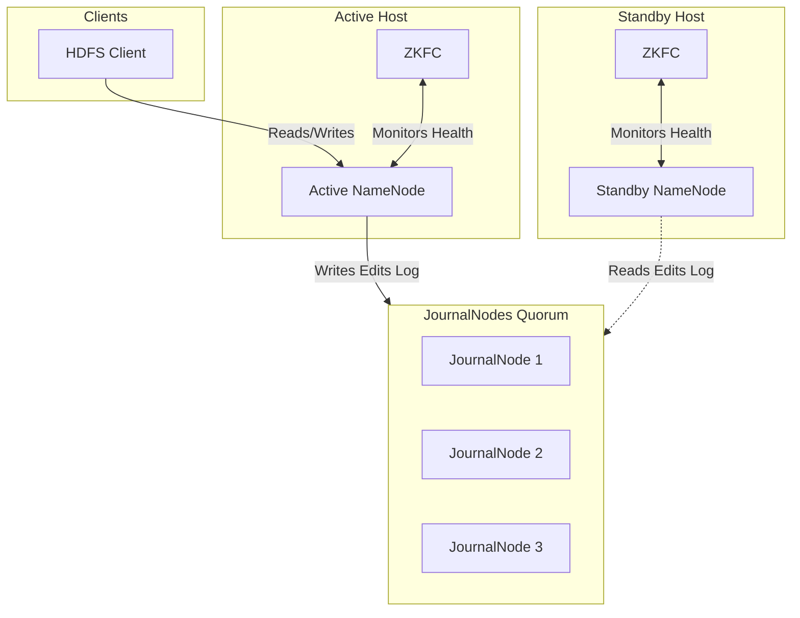
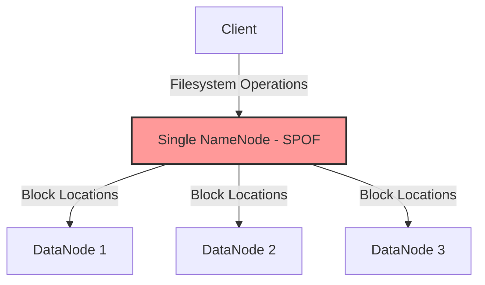
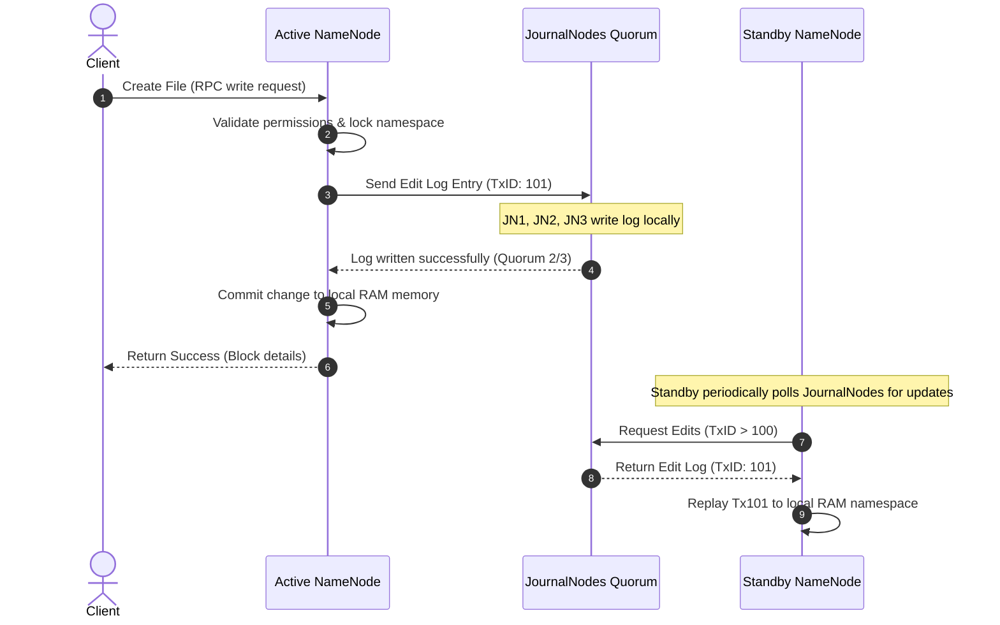
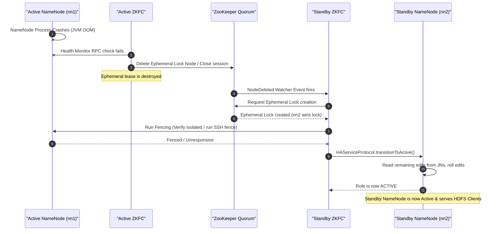
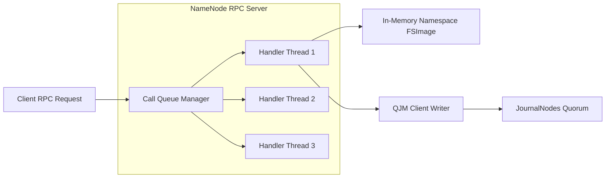
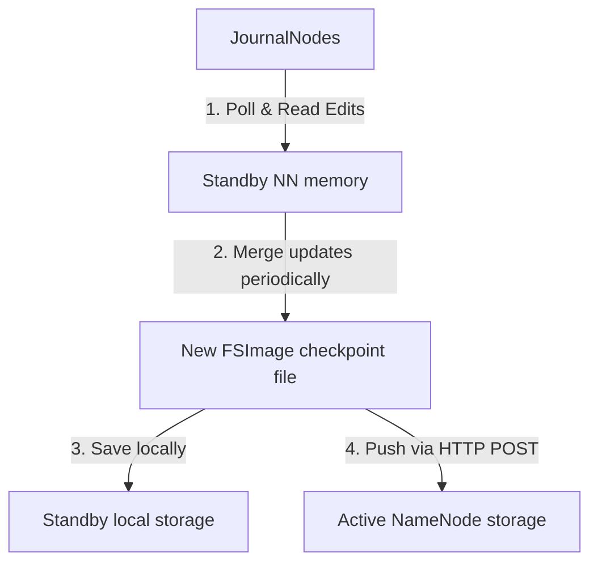
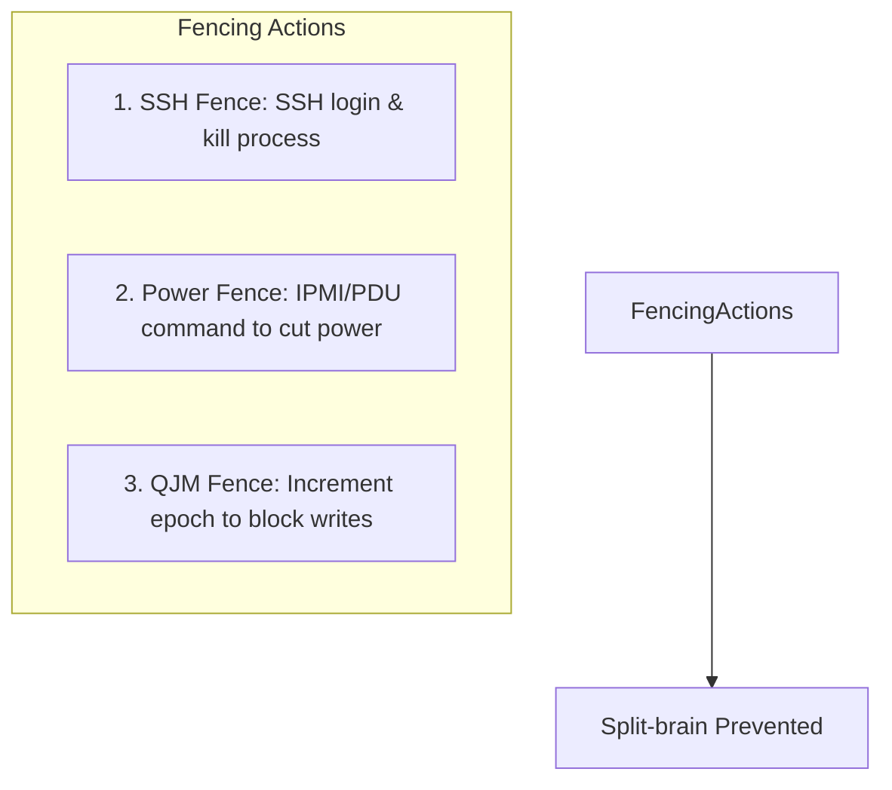
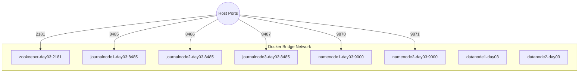

# Day 3 — HDFS High Availability & ZooKeeper Coordination

## 🚀 Module Overview
Welcome to Day 3 of the **30 Days of Modern Hadoop Ecosystem** curriculum. In this module, we will explore **HDFS High Availability (HA)** from first principles. We will dissect why early HDFS designs suffered from single-point-of-failure limits, how the Quorum Journal Manager (QJM) and ZooKeeper Failover Controller (ZKFC) solve these challenges, and how to operate, monitor, and troubleshoot HA clusters in enterprise production environments.

---

## 🗺️ Visual Directory Structure
```text
/Day-03-HDFS-High-Availability
├── README.md                  # Comprehensive architectural guide & curriculum (this file)
├── configs/
│   ├── core-site.xml          # HA global namespaces and ZooKeeper properties
│   └── hdfs-site.xml          # HA endpoints, nameservices, and QJM quorum config
├── diagrams/                  # Modular Mermaid source diagrams
│   ├── ha-architecture.mermaid
│   ├── metadata-sync-flow.mermaid
│   ├── failover-sequence.mermaid
│   ├── jn-quorum-flow.mermaid
│   ├── zookeeper-coordination.mermaid
│   ├── zkfc-interactions.mermaid
│   ├── split-brain-prevention.mermaid
│   ├── docker-deployment.mermaid
│   ├── local-cluster-topology.mermaid
│   └── disaster-recovery.mermaid
├── docker/
│   ├── docker-compose.yml     # Self-contained HDFS HA cluster topology
│   └── run-namenode-ha.sh     # Self-orchestrating HA entrypoint bootstrap script
├── labs/
│   └── lab-guide.md           # Step-by-step hands-on failover simulation instructions
├── scripts/
│   ├── verify-ha.sh           # Master validation and read/write check script
│   ├── verify-journalnodes.sh # Diagnostic script for QJM health
│   ├── verify-zookeeper.sh    # Diagnostic script for failover locks in ZK
│   ├── verify-failover.sh     # Automates Active NameNode crash & failover verify
│   └── verify-active-standby.sh # Queries current NameNode HA states
├── troubleshooting/
│   └── troubleshooting-guide.md # Runbooks for split-brain, quorum loss, etc.
└── references/
    └── references-list.md     # Annotated bibliography of HDFS design notes & papers
```

---

## SECTION 1 — INTRODUCTION

### What is High Availability?
In modern distributed computing, **High Availability (HA)** refers to a system design that guarantees a high level of operational performance, typically uptime, for a given period. It is measured as a percentage of service availability, often targeted at "five nines" ($99.999\%$), which equates to less than $5.26$ minutes of downtime per year.

To understand high availability in the real world, consider the following examples:
- **Banking Systems**: Payment gateways and transaction ledger databases must process transfers constantly. A minutes-long outage could block millions of credit card charges, leading to immediate revenue loss, regulatory penalties, and reputational damage.
- **Netflix**: A platform serving media streaming requests to millions of concurrent clients. If their catalog metadata databases go offline, users cannot load the homepage. The system uses highly redundant, cross-region replication databases to ensure catalogue lookup never fails.
- **Uber**: Ride-hailing matches rely on live location streams and active state databases. If a primary database fails, the platform must failover to a replica in seconds so rides are not interrupted and drivers are not stranded.
- **Cloud Infrastructure (Google Cloud, AWS)**: Object storage systems (like Google Cloud Storage or Amazon S3) use multi-datacenter consensus algorithms (Paxos/Raft) to ensure metadata is always accessible even if whole datacenters go offline.

### Availability vs. Reliability vs. Fault Tolerance
Though often used interchangeably, these three concepts represent distinct properties of a distributed platform:

| Concept | Definition | Primary Focus | Metric Example |
| :--- | :--- | :--- | :--- |
| **Availability** | The proportion of time a system remains in a functional, responsive state to client requests. | Maximizing uptime, minimizing mean time to repair (MTTR). | Uptime percentage (e.g., $99.99\%$). |
| **Reliability** | The probability that a system will perform its required function under specified conditions without failure for a set duration. | Minimizing failure frequency, maximizing mean time between failures (MTBF). | MTBF (e.g., 5,000 hours). |
| **Fault Tolerance** | The internal capacity of a system to continue executing its code and serving requests despite the immediate failure of some components. | Seamless failover, containment of hardware errors. | Number of acceptable dead nodes ($N-1$ or $\frac{N-1}{2}$). |

### HDFS High Availability Concept
In early Hadoop versions (Hadoop 1.x), HDFS operated on a single master model where one **NameNode** held the entire file namespace and block locations in memory. If this node failed, the entire cluster became inaccessible.

Hadoop 2.x and 3.x introduced **HDFS High Availability (HA)**. In this architecture, two or more NameNodes are configured in an Active/Standby layout.
- The **Active NameNode** is responsible for serving all client read and write requests.
- The **Standby NameNode** functions as a warm backup, maintaining synchrony with the Active node by reading transaction logs from a shared storage medium (**JournalNodes**) and receiving block reports from **DataNodes**.
- Automatic failover is coordinated by **ZooKeeper** and the **ZooKeeper Failover Controller (ZKFC)**, ensuring that if the active NameNode crashes, the standby is promoted instantly without client interruption or data corruption.



---

## SECTION 2 — PROBLEM STATEMENT

### The Single Point of Failure (SPOF)
In HDFS's original design, a single NameNode managed the namespace metadata. While DataNodes held the actual data blocks, the NameNode held the master dictionary mapping file directories to blocks.



This single NameNode layout was a severe **Single Point of Failure (SPOF)**. If the NameNode process terminated due to an Out of Memory (OOM) error, JVM GC pause, kernel panic, power failure, or disk crash, the cluster collapsed:
1. **Metadata Inaccessibility**: No client could look up blocks, write files, or read existing files.
2. **Cluster Downtime**: All compute engines (MapReduce, Hive, Spark) querying HDFS stopped working.
3. **Boot-Up Lag**: If a NameNode crashed cleanly, restarting it took hours for large clusters (e.g., hundreds of millions of files) because it had to read the huge `fsimage` checkpoint from disk, replay the edits log, and wait for heartbeats and block reports from thousands of DataNodes.

### Business & Operational Impact of Downtime
For companies running data lakes, a NameNode crash had severe consequences:
- **Financial Losses**: If the cluster was offline, business intelligence reports, user recommendation models, fraud detection pipelines, and ad-targeting engines stalled, costing millions in lost revenue.
- **SLA Breaches**: Data ingestion and processing pipelines failed to meet delivery windows, violating service-level agreements (SLAs) with external clients.
- **Operational Chaos**: Administrators had to execute complex recovery runs: copying `fsimage` files manually, restoring backups, verifying transaction boundaries, and executing offline filesystem audits (`fsck`).

### The Recovery Timeline (Non-HA vs HA)
Below is a timeline comparison showing the time-to-recovery difference when a crash occurs in a traditional HDFS setup vs an HA HDFS setup:

```mermaid
gantt
    title Cluster Recovery Timeline: Single NameNode vs. HA Failover
    dateFormat  X
    axisFormat %M:%S
    
    section Non-HA Recovery
    NameNode Crash & Detect   :crit, active, 0, 10
    Manual Hardware Triaging  :active, 10, 60
    Loading FSImage into Memory :active, 60, 150
    Replaying Edits Log       :active, 150, 240
    Waiting for DataNode Block Reports :active, 240, 360
    Cluster Online (Ready)    :after 360, 10s
    
    section HA Auto-Failover
    Active NN Crash           :crit, 0, 3
    ZKFC Heartbeat Loss Detect :active, 3, 6
    Fencing Roguish Active NN :active, 6, 9
    Promoting Standby NN      :active, 9, 12
    Cluster Online (Ready)    :after 12, 1s
```



---

## SECTION 3 — HDFS HA ARCHITECTURE DEEP DIVE

To eliminate the NameNode SPOF, HDFS HA introduces a coordinated master cluster. Below is the comprehensive architecture showing all components and their interaction links:

```mermaid
graph TB
    subgraph Client Space
        C[HDFS Client]
    end

    subgraph ZooKeeper Coordination
        ZK1[ZooKeeper 1]
        ZK2[ZooKeeper 2]
        ZK3[ZooKeeper 3]
    end

    subgraph Master Host 1 [NameNode Node 1]
        NN1[NameNode - nn1]
        ZKFC1[ZKFC]
    end

    subgraph Master Host 2 [NameNode Node 2]
        NN2[NameNode - nn2]
        ZKFC2[ZKFC]
    end

    subgraph JournalNodeCluster [JournalNode Cluster (QJM)]
        JN1[JournalNode 1]
        JN2[JournalNode 2]
        JN3[JournalNode 3]
    end

    subgraph Worker Nodes
        DN1[DataNode 1]
        DN2[DataNode 2]
        DN3[DataNode 3]
    end

    C -->|Read & Write Commands| NN1
    NN1 -->|1. Write Edits Quorum| JN1 & JN2 & JN3
    NN2 -.->|2. Read Edits Logs| JN1 & JN2 & JN3

    ZKFC1 <-->|Monitors Health via RPC| NN1
    ZKFC2 <-->|Monitors Health via RPC| NN2
    
    ZKFC1 <-->|Maintain Ephemeral Lock| ZK1
    ZKFC2 <-->|Attempt Ephemeral Lock| ZK1

    DN1 & DN2 & DN3 -->|Heartbeats & Block Reports| NN1
    DN1 & DN2 & DN3 -->|Heartbeats & Block Reports| NN2
```

### 1. Active NameNode
The **Active NameNode** is the primary driver of the cluster:
- **Responsibilities**: Serves HDFS client read/write calls, manages directories and permissions, coordinates file-to-block mappings, and executes metadata commands.
- **Metadata Operations**: When a write occurs, the Active NameNode modifies its in-memory namespace representation, serializes the change, and writes it to the JournalNode quorum.
- **Client Communication**: The Active NameNode listens on port `9000` (RPC) and port `9870` (HTTP Web UI).

### 2. Standby NameNode
The **Standby NameNode** functions as a warm standby for the Active node:
- **Synchronization Process**: The Standby node continuously reads edit logs written by the Active node to the JournalNode cluster and applies them to its own in-memory namespace.
- **State Management**: It does not accept write commands from clients. It does, however, maintain up-to-date block location details because the DataNodes send block reports to both NameNodes.
- **Metadata Consistency**: Because it maintains synchronized in-memory namespace states and block maps, it can instantly assume the Active role during failover without loading `fsimage` files or waiting for block reports.
- **Checkpointing**: The Standby NameNode periodically reads the in-memory namespace, merges the edit log transactions, writes out a new `fsimage` checkpoint file, and uploads it to the Active NameNode, saving memory resources on the Active node.

### 3. JournalNodes
**JournalNodes (JNs)** run as lightweight daemons (usually at least 3) to store HDFS transaction history:
- **Purpose**: Serve as a shared, highly available storage medium for the cluster's transaction edits.
- **Shared Edit Logs**: Only one NameNode (the Active one) can write to the JournalNodes at any given time.
- **Quorum Writes**: When the Active NameNode writes an edit transaction, it sends it to all JournalNodes. The transaction is marked successful once a majority (quorum) of JournalNodes acknowledge the write.
- **Recovery**: If a JournalNode crashes, the quorum remains operational as long as a majority of nodes ($\lfloor \frac{N}{2} \rfloor + 1$) are online. When the dead JournalNode restarts, it syncs missing transactions from its peers.

### 4. ZooKeeper
**ZooKeeper** is a highly available coordination service that manages leader election:
- **Leader Election**: Used to decide which NameNode host ZKFC should promote to Active.
- **Coordination**: Uses hierarchical znodes to register leases. ZKFC instances negotiate locks under ZooKeeper paths.
- **Health Monitoring**: Tracks ZKFC node connections via persistent TCP heartbeats and automatically expires locks if a connection drops.

### 5. ZKFC (ZooKeeper Failover Controller)
The **ZKFC** is a helper daemon that runs on the same machines as the NameNodes:
- **Health Checks**: ZKFC runs periodic health checks against its local NameNode daemon via a dedicated RPC interface (`HAServiceProtocol`).
- **ZooKeeper Session**: It maintains an active session in ZooKeeper. If the local NameNode is healthy, the ZKFC acquires a lock on a ZooKeeper ephemeral node (`/hadoop-ha/<nameservice-id>/ActiveStandbyElectorLock`).
- **Automatic Failover**: If the Active NameNode health check fails, or if the active ZKFC loses its connection to ZooKeeper, the lock node is deleted. The standby ZKFC, which watches this node, is notified, acquires the lock, and promotes its local NameNode to Active.

---

## SECTION 4 — INTERNAL WORKING

### 1. Metadata Update Flow
When a client requests a file write, the transaction must propagate through the JournalNodes to the Standby NameNode to maintain consistency:



### 2. Cluster Startup Flow
When the HDFS HA cluster starts up, the daemons coordinate to determine active/standby state and synchronize metadata:
1. **ZooKeeper and JournalNodes Boot**: These storage and coordination clusters start up first.
2. **Format and ZKFC Registration**:
   - The primary NameNode is formatted and registers its initial state.
   - ZKFC formats its active election nodes inside ZooKeeper (`hdfs zkfc -formatZK`).
3. **Standby Bootstrapping**:
   - The secondary NameNode runs a bootstrap process (`hdfs namenode -bootstrapStandby`) to pull the initial `fsimage` metadata from the Active NameNode.
4. **Daemon Launch**: NameNode and ZKFC daemons start on both hosts.
5. **Leader Election**:
   - ZKFC daemons attempt to create the ephemeral lock node `/hadoop-ha/mycluster/ActiveStandbyElectorLock` in ZooKeeper.
   - The NameNode associated with the ZKFC that wins the lock becomes **Active**, and the other becomes **Standby**.
6. **DataNode Registration**: DataNodes start, locate both NameNodes from their local configuration files, and send their block reports to both.

### 3. Failover Flow
If the Active NameNode fails, the standby ZKFC detects the outage, fences the failed node, and promotes the Standby NameNode:



---

## SECTION 5 — ACTIVE NAMENODE INTERNALS

The Active NameNode is the brain of HDFS. It manages two main structures in memory:
1. **Namespace Directory Tree**: The hierarchical folder structures, owners, groups, and permissions.
2. **Block-to-DataNode Mapping**: The translation index listing which HDFS block IDs reside on which DataNodes.

### Request Handling Pipeline
When processing requests, the Active NameNode uses an internal RPC queue model:



- **Call Queue**: Client requests are queued globally. The queue size can be adjusted using `ipc.server.handler.queue.size` to prevent client request backlogs.
- **Handler Threads**: Reader/Writer locks are acquired on the directory tree before metadata updates are written to the JournalNode quorum.
- **Double Buffering**: To minimize write latency, the NameNode writes transaction edit logs to a primary memory buffer while flushing a secondary buffer to the JournalNodes asynchronously.

---

## SECTION 6 — STANDBY NAMENODE INTERNALS

The Standby NameNode is a warm standby daemon that periodically checkpoints HDFS metadata to keep the Active NameNode's log directory clean.

### Metadata Checkpoint Pipeline
The Standby NameNode reads transaction files from the JournalNodes and periodically checkpoints the in-memory namespace to disk:



1. **Poll and Merge**: The Standby NameNode polls the JournalNodes for new transaction logs and applies them to its in-memory namespace.
2. **Checkpointing**: Every hour (configured via `dfs.namenode.checkpoint.period`) or after 1,000,000 transactions (configured via `dfs.namenode.checkpoint.txns`), the Standby NameNode saves its in-memory namespace to a new `fsimage` checkpoint file on its local disk.
3. **Upload**: The Standby NameNode uploads the new `fsimage` to the Active NameNode via HTTP POST. The Active NameNode replaces its old `fsimage` with this new version and purges the edit logs that were merged, preventing disk space issues.

---

## SECTION 7 — JOURNALNODES & CONSENSUS

The JournalNode cluster uses a Paxos-like consensus protocol called the Quorum Journal Manager (QJM).

### Quorum Mechanics
For a write transaction to succeed, it must be written to a majority of JournalNodes.
The quorum size is calculated as:
$$\text{Quorum Size} = \left\lfloor \frac{N}{2} \right\rfloor + 1$$
Where $N$ is the total number of JournalNodes.

- **3-Node Cluster**: Quorum size is $\lfloor 3/2 \rfloor + 1 = 2$. The cluster can survive 1 node failure ($3 - 2 = 1$).
- **5-Node Cluster**: Quorum size is $\lfloor 5/2 \rfloor + 1 = 3$. The cluster can survive 2 node failures ($5 - 3 = 2$).

If the number of online JournalNodes falls below the quorum size, the Active NameNode halts writes, transitions to standby, and puts the cluster into safe mode to prevent metadata loss or split-brain.

### Epoch Numbers & Shared Edits Consistency
To prevent a partitioned NameNode from writing stale transactions, the QJM uses an **Epoch Number** system:
1. When a NameNode becomes Active, it requests a new epoch number from the JournalNodes. The JournalNodes return their highest epoch number and increment it.
2. Any write request from the NameNode must include this epoch number.
3. If a JournalNode receives a write request with an epoch number lower than its current epoch, it rejects the write. This prevents stale NameNodes from writing to the journal.

---

## SECTION 8 — FAILOVER & FENCING

HDFS HA uses failover mechanisms to transition NameNode roles and fencing to prevent split-brain scenarios.

### 1. Automatic Failover
Coordinated by ZKFC and ZooKeeper.
- **Active Lock**: ZKFC maintains a lock on the ephemeral node `/hadoop-ha/<nameservice-id>/ActiveStandbyElectorLock`.
- **Health Checks**: ZKFC periodically polls the local NameNode. If the health check fails, the ZKFC drops the lock.
- **Failover**: The Standby NameNode's ZKFC detects the deleted lock, acquires it, fences the failed NameNode, and promotes its local NameNode to Active.

### 2. Manual Failover
Administrators can trigger failovers manually for maintenance or testing:
```bash
# Force transition of nn1 to standby and nn2 to active
hdfs haadmin -failover nn1 nn2
```

### 3. Fencing
**Fencing** isolates a failed Active NameNode to prevent it from serving client requests or writing to JournalNodes (split-brain):



- **SSH Fencing**: ZKFC logs into the failed NameNode host via SSH and runs `kill` to terminate the process.
- **Power Fencing**: ZKFC communicates with a power distribution unit (PDU) or server management controller (IPMI/iLO) to cut power to the host.
- **QJM Fencing**: The newly active NameNode increments the QJM epoch number, causing the JournalNodes to reject any future write requests from the old NameNode.

---

## SECTION 9 — CORE CONCEPTS GLOSSARY

Below is a glossary of core HDFS HA concepts:

- **Logical Namespace**: A virtual namespace (e.g., `hdfs://mycluster`) that represents the cluster. Client libraries map this nameservice ID to the active NameNode's physical address.
- **Active NameNode**: The NameNode instance that processes client reads/writes and maintains block mapping state.
- **Standby NameNode**: The warm backup NameNode instance that syncs transaction edits from the JournalNodes and stands ready to take over.
- **JournalNodes (QJM)**: A Paxos-based distributed storage quorum that stores NameNode transaction edit logs.
- **ZooKeeper Failover Controller (ZKFC)**: A daemon that runs alongside each NameNode to monitor its health and manage its ZooKeeper election lock.
- **Ephemeral ZNode**: A temporary file-like node in ZooKeeper that exists only while the client session that created it is active.
- **Fencing**: The practice of isolating a failed master node to prevent it from updating cluster state or interacting with clients.
- **Split-Brain**: A failure state where two master nodes in a cluster believe they are Active, leading to conflicting updates and data corruption.
- **Transaction ID (TxID)**: A sequential number assigned to each metadata modification in HDFS, used to track synchronization progress.
- **Namespace ID**: A unique identifier assigned to the HDFS namespace during formatting to ensure NameNodes and DataNodes belong to the same cluster.

---

## SECTION 10 — PRODUCTION ENGINEERING

Operating HDFS HA clusters at scale requires careful design around rack placement, disaster recovery, security, and monitoring.

### 1. Multi-Rack Deployments
To prevent outages from rack failures, NameNodes and JournalNodes should be distributed across multiple racks:
- **NameNode Placement**: Place the Active and Standby NameNodes in separate racks.
- **JournalNode Placement**: Distribute JournalNodes across at least three racks. In a 3-node JournalNode setup, place one JN in Rack 1, one in Rack 2, and one in Rack 3. This ensures the cluster retains a write quorum even if a rack switch fails.

### 2. Disaster Recovery
While HA protects against individual server or rack failures, disaster recovery (DR) protects against whole-datacenter outages:
- **DistCp (Distributed Copy)**: Run periodic DistCp jobs to replicate files and directories asynchronously from the production HDFS HA cluster to a remote DR cluster.
- **Metadata Backups**: Periodically back up `fsimage` files to a separate storage system (such as Google Cloud Storage, AWS S3, or a cold storage cluster).

### 3. Security
Secure HA environments by configuring authentication and communication encryption:
- **Kerberos**: Configure Kerberos SPNEGO authentication for NameNode Web UIs and RPC endpoints.
- **TLS/SSL**: Enable TLS for communication between HDFS daemons and client engines.
- **Apache Ranger**: Centralize access control policies and audit user actions across HDFS folders.

### 4. Monitoring
Monitor these key HMX metrics to track HDFS HA cluster health:

| Metric Name | JMX MBean Object | Purpose / Description | Danger Threshold |
| :--- | :--- | :--- | :--- |
| `HAState` | `Hadoop:service=NameNode,name=NameNodeInfo` | Returns role status ("active" or "standby"). | If both nodes are standby or both active. |
| `LastWrittenTransactionId` | `Hadoop:service=NameNode,name=NamesystemState` | The transaction ID of the last edit log write. | If standby lags behind active by > 10,000 transactions. |
| `NumLiveDataNodes` | `Hadoop:service=NameNode,name=NameNodeInfo` | The number of active DataNodes reporting block info. | If count drops below the minimum required for replication. |
| `CallQueueLength` | `Hadoop:service=NameNode,name=RpcActivityForPort9000` | The number of RPC requests waiting in the NameNode queue. | Consistent queue length > 1,000. |

Integrate these JMX endpoints with Prometheus and display cluster health on Grafana dashboards to track latency, disk usage, and node status.

---

## SECTION 11 — HANDS-ON LAB: SIMULATING FAILOVER

In this lab, you will run a local Docker-based HDFS HA cluster and simulate a NameNode failover.

### Step 1: Clone and Navigate to the Day 3 Folder
Open your terminal and navigate to the Day 3 directory:
```bash
cd Day-03-HDFS-High-Availability
```

### Step 2: Spin Up the Cluster
Run the Docker Compose file to start ZooKeeper, three JournalNodes, two NameNodes, and two DataNodes:
```bash
docker compose -f docker/docker-compose.yml up -d
```

### Step 3: Run Diagnostics
Run the verification scripts to check cluster health:
```bash
# Verify ZooKeeper locks
bash scripts/verify-zookeeper.sh

# Verify JournalNodes are online and in sync
bash scripts/verify-journalnodes.sh

# Check active/standby states
bash scripts/verify-active-standby.sh
```

### Step 4: Write Data to the Logical Nameservice
Write a file to the logical nameservice URI `hdfs://mycluster`:
```bash
docker exec -it namenode1-day03 hdfs dfs -put /etc/hadoop/core-site.xml hdfs://mycluster/system/ha-test.xml
```

### Step 5: Simulate Failover
Stop the Active NameNode container to simulate a failure:
```bash
# If NN1 is active:
docker stop namenode1-day03
```
Verify that the Standby NameNode is promoted to Active and that you can still read the file:
```bash
# Read the file using the logical namespace URI from the remaining container
docker exec -it namenode2-day03 hdfs dfs -cat hdfs://mycluster/system/ha-test.xml
```

---

## SECTION 12 — BUILD FROM SOURCE

Building HDFS and ZKFC from source is useful for auditing internals, applying security patches, or modifying the scheduler.

### Prerequisites
Ensure your build environment has these dependencies installed:
- JDK 8 or JDK 11
- Apache Maven 3.6.x+
- Protocol Buffers compiler (protoc 2.5.0 or 3.7.1 depending on Hadoop version)
- CMake and gcc/g++ compilers (for native libraries)

### Build and Packaging Commands
Run Maven inside the Hadoop source root directory to build the HDFS and ZKFC modules:
```bash
# Build the native distribution, skipping tests
mvn clean package -Pdist,native -DskipTests -Dtar
```
This command compiles the source code, compiles native C++ libraries for hardware acceleration and short-circuit local reads, and creates a tarball under `hadoop-dist/target/hadoop-x.y.z.tar.gz`.

---

## SECTION 13 — DOCKER DEPLOYMENT

The local Docker-based HA cluster uses a bridge network and maps ports for external access:



- **Network Name**: `day03-network`
- **Volume Mounts**: Configured for local directories so metadata is persisted if containers restart.
- **Port Mapping**:
  - `namenode1` HTTP UI is exposed on host port `9870`.
  - `namenode2` HTTP UI is exposed on host port `9871`.
  - JournalNodes use internal ports `8485` and map to host ports `8485`, `8486`, and `8487` respectively.

---

## SECTION 14 — LOCAL CLUSTER DEPLOYMENT

For non-containerized environments, HDFS HA can be deployed on virtual machines or bare-metal servers.

### Topology Layout
A typical 3-node HA deployment distributes roles across servers as follows:

- **Server nn-01.prod**: Active NameNode, ZKFC, JournalNode, ZooKeeper.
- **Server nn-02.prod**: Standby NameNode, ZKFC, JournalNode, ZooKeeper.
- **Server worker-01.prod**: DataNode, JournalNode, ZooKeeper.

### Configuration Configuration
Distribute the updated `core-site.xml` and `hdfs-site.xml` files to `/etc/hadoop/conf/` on all nodes, ensuring that security permissions and directories are identical.

---

## SECTION 15 — VALIDATION

Validate your HA deployment by running the diagnostic test scripts:

- **`verify-zookeeper.sh`**: Checks if ZooKeeper is running and if the ZKFC lock file exists.
- **`verify-journalnodes.sh`**: Checks if the 3 JournalNodes are running and synchronized.
- **`verify-active-standby.sh`**: Checks if exactly one NameNode is active and the other is standby.
- **`verify-ha.sh`**: Runs all diagnostic tests and performs read/write checks against the logical namespace.

Run the master script to verify your setup:
```bash
bash scripts/verify-ha.sh
```

---

## SECTION 16 — TROUBLESHOOTING PLAYBOOK

For detailed troubleshooting steps and log signatures, see the [troubleshooting playbook](file:///d:/30_Days_of_Modern_Hadoop_Ecosystem/Day-03-HDFS-High-Availability/troubleshooting/troubleshooting-guide.md).

Common scenarios covered include:
- **Split-Brain**: Resolving dual active NameNodes.
- **JournalNode Quorum Loss**: Restoring QJM when nodes go offline.
- **ZKFC Ephemeral Lock Loss**: Tuning session timeouts to prevent frequent failovers.
- **Standby NameNode Bootstrap Failures**: Resolving metadata mismatches on startup.

---

## SECTION 17 — CASE STUDY: NETFLIX-SCALE HDFS

### Background and Scales
Netflix runs large-scale Hadoop clusters to store catalog metadata, user telemetry, and studio video processing streams.
- **Data Volume**: Over $100\text{ Petabytes}$ of storage.
- **Namespace Size**: Hundreds of millions of files, directories, and blocks.
- **GC Challenges**: NameNode JVMs require over $120\text{ GB}$ of RAM, making garbage collection pauses a primary cause of failovers.

### HA Architecture and Evolution
Netflix transitioned from a single-master HDFS cluster to a multi-cluster HA architecture to handle this load:
- **JournalNode Placement**: Dedicated JournalNodes placed on NVMe SSD drives to minimize write latency.
- **ZKFC Tuning**: ZooKeeper session timeouts increased from $5$ seconds to $20$ seconds to prevent garbage collection pauses from triggering false failovers.
- **Compute and Storage Decoupling**: Compute engines (like Spark) query logical namespaces, allowing underlying nodes to be added, removed, or failed over without modifying job configurations.

---

## SECTION 18 — INTERVIEW QUESTIONS

### Beginner Questions

#### 1. What does the term "High Availability" mean in the context of HDFS?
HDFS High Availability (HA) refers to a cluster configuration that eliminates the single NameNode Single Point of Failure (SPOF). It uses two or more NameNodes (one Active and one or more Standby) to ensure the filesystem remains accessible even if the primary NameNode crashes.

#### 2. What was the single point of failure (SPOF) in Hadoop 1.x?
The single NameNode. If the NameNode process terminated, the entire cluster became inaccessible, and all client jobs failed until it was manually restarted.

#### 3. What is the role of the Active NameNode?
The Active NameNode serves client requests (reads/writes), manages the namespace metadata, coordinates file-to-block mappings, and writes transaction edit logs to the JournalNodes.

#### 4. What is the role of the Standby NameNode?
The Standby NameNode acts as a warm backup. It syncs its namespace with the Active NameNode by reading edit logs from the JournalNodes and periodically checkpoints the metadata.

#### 5. Why do DataNodes send block reports to both NameNodes?
This ensures the Standby NameNode maintains an up-to-date map of block locations, allowing it to transition to Active immediately during a failover without waiting for block reports from DataNodes.

#### 6. What is a JournalNode?
A JournalNode is a lightweight daemon that runs in a quorum. It stores the transaction edit logs written by the Active NameNode, which are read by the Standby NameNode to stay in sync.

#### 7. How many JournalNodes are required for a minimal HA cluster?
At least three. This allows the cluster to establish a majority write quorum of two nodes and survive the failure of one JournalNode.

#### 8. What is the formula for calculating JournalNode quorum?
$$\text{Quorum Size} = \left\lfloor \frac{N}{2} \right\rfloor + 1$$
Where $N$ is the total number of JournalNodes.

#### 9. What is ZKFC?
The ZooKeeper Failover Controller (ZKFC) is a client daemon that runs alongside the NameNode. It monitors the NameNode's health and manages its ZooKeeper session and election lock.

#### 10. What is an ephemeral node in ZooKeeper?
An ephemeral node (znode) is a temporary entry that exists only while the ZooKeeper session that created it remains active. If the session expires (due to a crash or timeout), the znode is deleted.

#### 11. What is the logical nameservice ID?
A virtual identifier (such as `mycluster`) configured in `hdfs-site.xml` that represents the HDFS HA cluster. Clients connect to this ID rather than a specific physical host.

#### 12. Why is fencing necessary in HDFS HA?
Fencing isolates a failed NameNode to ensure it cannot write edits or respond to client requests, preventing split-brain scenarios and data corruption.

#### 13. What is the difference between manual and automatic failover?
- **Manual Failover**: Run by administrators using CLI commands (`hdfs haadmin`).
- **Automatic Failover**: Coordinated automatically by ZKFC and ZooKeeper when a NameNode fails.

#### 14. What command checks NameNode HA status?
```bash
hdfs haadmin -getServiceState <namenode-id>
```

#### 15. Can you write data to the Standby NameNode?
No, the Standby NameNode is read-only and rejects client write requests.

#### 16. What is the purpose of formatting the ZKFC?
Running `hdfs zkfc -formatZK` initializes the required metadata paths (znodes) in ZooKeeper before running automatic failover.

#### 17. How does the Standby NameNode help reduce memory load on the Active NameNode?
The Standby NameNode performs checkpointing (merging edit logs into a new `fsimage`), saving the Active NameNode from running this resource-intensive process.

#### 18. What happens if all JournalNodes go offline?
The Active NameNode cannot write edit logs and transitions to Standby, putting the cluster into safe mode and blocking all write operations.

#### 19. Does a DataNode reboot cause a failover?
No. DataNode failures reduce block replication capacity but do not trigger NameNode failover, as the NameNodes themselves remain healthy.

#### 20. What protocol does ZKFC use to query NameNode health?
The `HAServiceProtocol` RPC interface.

---

### Intermediate Questions

#### 21. Explain the split-brain scenario.
Split-brain occurs when a network partition isolates the Active NameNode from the Standby NameNode and ZooKeeper, but not from the clients or JournalNodes. ZKFC promotes the Standby NameNode, resulting in two Active NameNodes that accept conflicting writes and corrupt the metadata.

#### 22. How does the Quorum Journal Manager (QJM) prevent split-brain?
The QJM uses epoch numbers. When a Standby NameNode is promoted, it increments the epoch number on the JournalNodes. The JournalNodes then reject any subsequent write requests from the old NameNode because its epoch number is stale.

#### 23. Compare SSH fencing with power fencing.
- **SSH Fencing**: ZKFC logs into the failed NameNode host via SSH and runs a command (like `kill -9`) to stop the process.
- **Power Fencing**: ZKFC sends a command to a power distribution unit (PDU) or management controller (IPMI) to reboot or power down the host.

#### 24. What are the steps for bootstrapping a Standby NameNode?
1. Format and start the primary Active NameNode.
2. On the Standby NameNode host, run `hdfs namenode -bootstrapStandby`. This copies the active NameNode's current `fsimage` checkpoint.
3. Start the Standby NameNode daemon.

#### 25. How do client applications locate the Active NameNode in an HA cluster?
Clients use the logical nameservice ID. The HDFS client library uses the proxy provider class (like `ConfiguredFailoverProxyProvider`) to query the endpoints of both NameNodes, trying them in sequence until it finds the Active node.

#### 26. What happens if a network partition isolates one JournalNode in a 3-node cluster?
The cluster continues to operate. The Active NameNode can still write edit logs to the remaining two JournalNodes, meeting the quorum requirement ($\lfloor 3/2 \rfloor + 1 = 2$).

#### 27. Why should JournalNodes be placed on separate physical racks?
This prevents a single rack switch failure from taking down multiple JournalNodes and causing the cluster to lose its write quorum.

#### 28. How does the Standby NameNode upload checkpoints to the Active NameNode?
It serializes its in-memory namespace to a new `fsimage` file and uploads it to the Active NameNode via an HTTP POST request.

#### 29. Can an HDFS HA cluster have three NameNodes?
Yes. Hadoop 3.x supports multiple standby NameNodes, allowing you to configure one Active NameNode and two or more Standby NameNodes for added redundancy.

#### 30. What parameter controls the ZooKeeper session timeout in ZKFC?
`ha.zookeeper.session-timeout.ms` (defaults to 5,000 milliseconds).

#### 31. What is the role of the ActiveBreadcrumb node in ZooKeeper?
The persistent node `/hadoop-ha/<nameservice-id>/ActiveBreadcrumb` stores the hostname and identifier of the last known Active NameNode. This helps ZKFC identify the previous Active node on startup and verify that it has been fenced before promoting a new node.

#### 32. What is the difference between `fsimage` and `edits` files?
- **`fsimage`**: A complete snapshot of the HDFS directory structure and file metadata at a specific point in time.
- **`edits`**: An incremental log listing every metadata modification (creates, deletes, moves) made since the last `fsimage` snapshot.

#### 33. How does ZKFC prevent multiple nodes from claiming the Active role at startup?
Both ZKFCs attempt to create the ephemeral node `/hadoop-ha/<nameservice-id>/ActiveStandbyElectorLock` in ZooKeeper. ZooKeeper guarantees that only one client can create this node, and the ZKFC that succeeds promotes its NameNode to Active.

#### 34. What are the key symptoms of JVM GC pauses in HDFS HA?
Long stop-the-world GC pauses on the Active NameNode can prevent ZKFC from sending heartbeats to ZooKeeper, causing the session to expire, the lock node to be deleted, and a failover to be triggered.

#### 35. Explain `ConfiguredFailoverProxyProvider`.
An HDFS client configuration class that reads the NameNode RPC addresses defined in `hdfs-site.xml` and attempts to connect to them in sequence to locate the Active NameNode.

#### 36. Why does the Standby NameNode need access to JournalNodes?
To read the edit logs written by the Active NameNode and apply those updates to its in-memory namespace, keeping its state in sync.

#### 37. What happens if the Active NameNode loses its connection to the JournalNodes?
If the Active NameNode cannot write edit logs to a majority of JournalNodes, it halts writes and transitions to Standby, and the ZKFC triggers a failover.

#### 38. How do you manually transition a NameNode to Standby?
```bash
hdfs haadmin -transitionToStandby <namenode-id>
```

#### 39. What is the purpose of `dfs.ha.automatic-failover.enabled`?
A boolean property in `hdfs-site.xml` that enables ZKFC-driven automatic failovers when set to `true`.

#### 40. Why does ZKFC run health checks on a separate thread?
Running health checks on a separate thread ensures they are not blocked by other ZKFC client operations, allowing health issues to be detected and handled promptly.

---

### Advanced Questions

#### 41. How does the QJM consensus algorithm guarantee transaction ordering?
Each log transaction is assigned a sequential Transaction ID (TxID). When writing edits, JournalNodes verify that incoming TxIDs are sequential and reject any out-of-order writes.

#### 42. Explain the QJM recovery phase when a new NameNode becomes active.
When a NameNode transitions to Active:
1. It requests a new epoch number and writes a special marker log to the JournalNodes.
2. It reads the edit logs from all JournalNodes to find the last committed transaction.
3. It synchronizes any missing transactions among the JournalNodes to ensure they all contain the same transaction history before accepting new writes.

#### 43. Why is SSH fencing sometimes unreliable in containerized environments?
Containerized environments often block root-level SSH access and do not install SSH servers by default. In these setups, it is better to use container management APIs (such as Kubernetes or Docker endpoints) or QJM epoch fencing.

#### 44. How do you troubleshoot "flapping" failovers?
Check if the Active NameNode is experiencing long JVM GC pauses or if network latency between ZKFC and ZooKeeper is high. To mitigate this, tune the JVM garbage collection settings and increase the ZooKeeper session timeout.

#### 45. Explain how DataNodes manage block reports in an HA cluster.
DataNodes send block reports (listing all blocks stored on their disks) to both NameNodes. However, they only execute block commands (such as block replication or deletion) sent by the Active NameNode.

#### 46. What JVM tuning settings are recommended for NameNodes in large HDFS clusters?
Use the G1 garbage collector, set the maximum GC pause target (`-XX:MaxGCPauseMillis=200`), and allocate sufficient heap space (`-Xms` and `-Xmx`) to prevent long stop-the-world pauses.

#### 47. Explain how the ZKFC uses ZK session watchers to handle transitions.
The ZKFC registers a watcher on the `/hadoop-ha/<nameservice-id>/ActiveStandbyElectorLock` node. If this node is deleted, ZooKeeper fires an event that notifies the Standby ZKFC, which then attempts to acquire the lock and initiate failover.

#### 48. What are the risks of using `shell(/bin/true)` as a fencing method?
`shell(/bin/true)` is a dummy fencing method that always returns success. If a split-brain scenario occurs, this dummy fencing will fail to isolate the old Active NameNode, which can lead to metadata corruption.

#### 49. How do you recover from a lost ZooKeeper quorum in HDFS HA?
1. Restore the ZooKeeper cluster to regain a quorum.
2. If the ZKFC lock paths are corrupted, reformat the ZKFC state using `hdfs zkfc -formatZK`.
3. Restart the ZKFC daemons on the NameNode hosts.

#### 50. How does HDFS HA handle edits log rollover?
When the Active NameNode rolls its edit logs (closing the current log segment and opening a new one), it coordinates with the JournalNodes to finalize the old segment, ensuring that all JournalNodes agree on the last transaction ID in that segment.

#### 51. Can you configure HDFS HA without ZooKeeper?
Yes. You can run HDFS HA without ZooKeeper by using manual failover, where administrators use the `hdfs haadmin` CLI tool to manage NameNode roles manually.

#### 52. How does the Standby NameNode handle block deletions?
The Standby NameNode processes block reports from DataNodes to track block locations, but it does not issue block deletion commands. Instead, it waits until it is promoted to Active to issue deletions.

#### 53. How do you upgrade HDFS in an HA cluster without downtime?
Perform a rolling upgrade:
1. Upgrade and restart the Standby NameNode.
2. Trigger a manual failover to promote the upgraded Standby NameNode to Active.
3. Upgrade and restart the old Active NameNode (which is now Standby).
4. Upgrade the DataNodes in small batches.

#### 54. What is the role of `dfs.namenode.shared.edits.dir`?
A configuration property in `hdfs-site.xml` that specifies the QJM connection string (`qjournal://...`) used by the NameNodes to read and write edit logs.

#### 55. How do you debug ZKFC-to-ZooKeeper connection timeouts?
Review the ZKFC logs (`hadoop-hdfs-zkfc-*.log`) and ZooKeeper logs (`zookeeper.log`) to check for heartbeat failures, session expirations, and socket disconnects.

#### 56. What happens if the Standby NameNode is formatted by mistake?
The Standby NameNode will lose its namespace ID and fail to sync with the Active NameNode. To recover, run `hdfs namenode -bootstrapStandby` to copy the Active NameNode's metadata and restore synchrony.

#### 57. How does the Active NameNode handle slow JournalNodes?
The Active NameNode only waits for a majority of JournalNodes to acknowledge a write. If one JournalNode is slow, the write still completes as long as the other JournalNodes acknowledge it quickly.

#### 58. How do you monitor metadata synchronization lag?
Compare the `LastWrittenTransactionId` metric on the Active NameNode with the `LastAppliedTransactionId` metric on the Standby NameNode. A large difference indicates synchronization lag.

#### 59. Explain the purpose of `dfs.ha.namenodes.<nameservice-id>`.
A configuration property in `hdfs-site.xml` that lists the individual NameNode identifiers (such as `nn1,nn2`) associated with the logical nameservice.

#### 60. How does ZKFC handle temporary network glitches?
ZKFC uses heartbeats to monitor its ZooKeeper connection. If a temporary network glitch occurs, ZKFC attempts to reconnect. If it cannot reconnect before the session timeout expires, the lock is released.

---

## SECTION 19 — KEY TAKEAWAYS

- **SPOF Elimination**: HDFS HA eliminates the single NameNode Single Point of Failure by running Active and Standby NameNodes.
- **JournalNode Quorum**: The Quorum Journal Manager (QJM) uses a Paxos-like consensus protocol to store edit logs, ensuring metadata consistency and preventing split-brain.
- **ZKFC and ZooKeeper**: The ZooKeeper Failover Controller (ZKFC) uses ZooKeeper locks and session heartbeats to monitor NameNode health and coordinate automatic failovers.
- **Fencing is Critical**: Proper fencing configuration is essential to isolate failed NameNodes and prevent split-brain scenarios.

---

## SECTION 20 — REFERENCES

- [Apache Hadoop HDFS High Availability with QJM](https://hadoop.apache.org/docs/stable/hadoop-project-dist/hadoop-hdfs/HDFSHighAvailabilityWithQJM.html)
- [HDFS High Availability Design Specification (HDFS-1623)](https://issues.apache.org/jira/browse/HDFS-1623)
- [Quorum Journal Manager (QJM) Design Spec (HDFS-3077)](https://issues.apache.org/jira/browse/HDFS-3077)
- [ZooKeeper: Wait-free coordination for ZooKeeper-like services](https://www.usenix.org/conference/usenix-atc-10/zookeeper-wait-free-coordination-internet-scale-systems)
