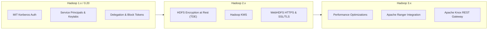
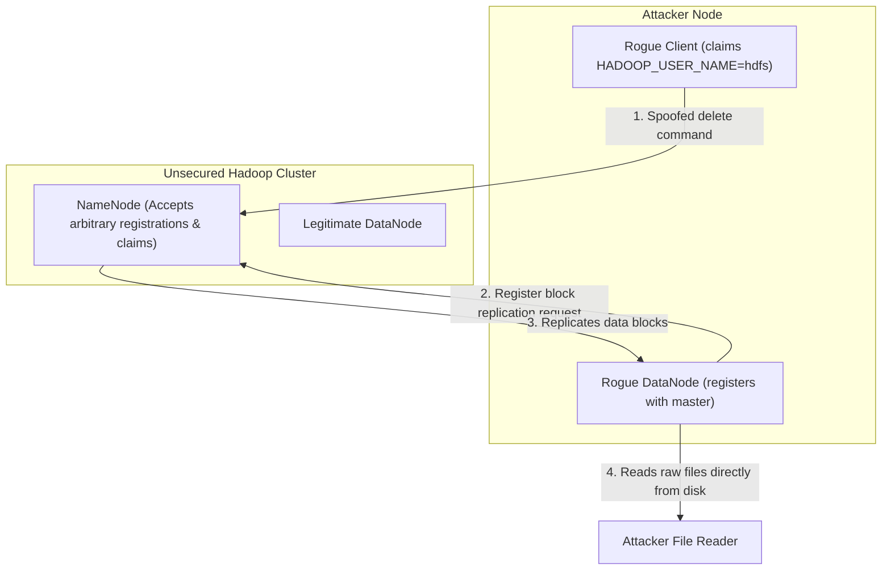
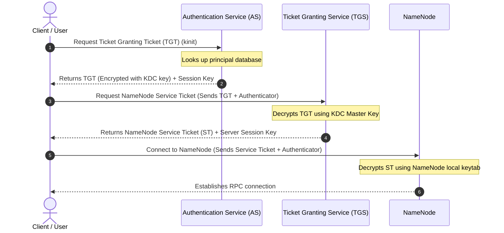
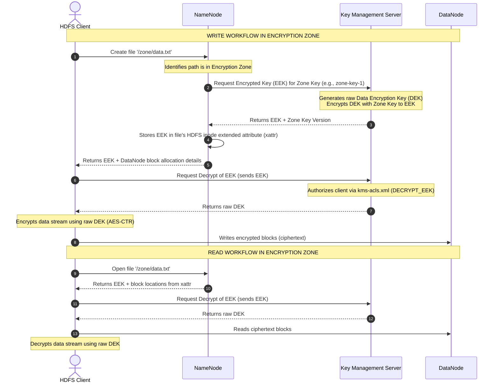
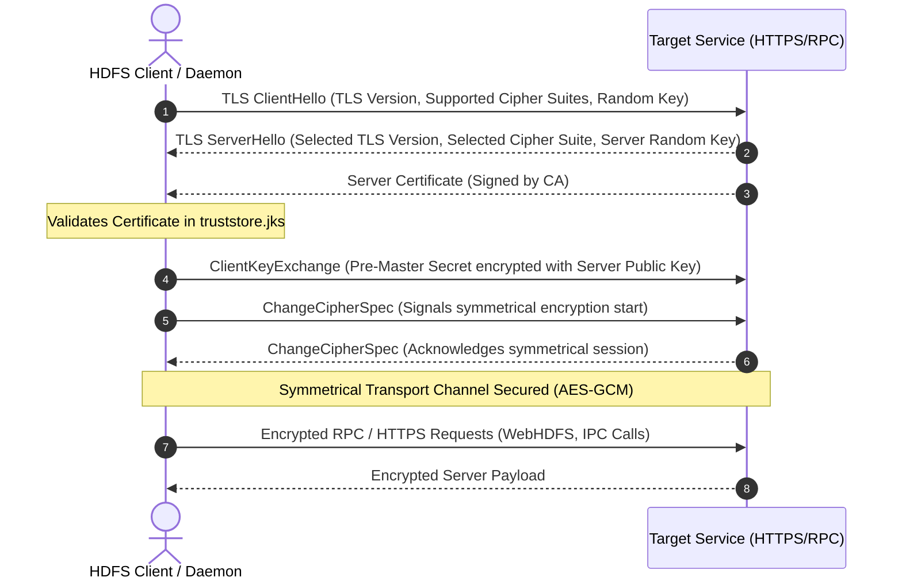
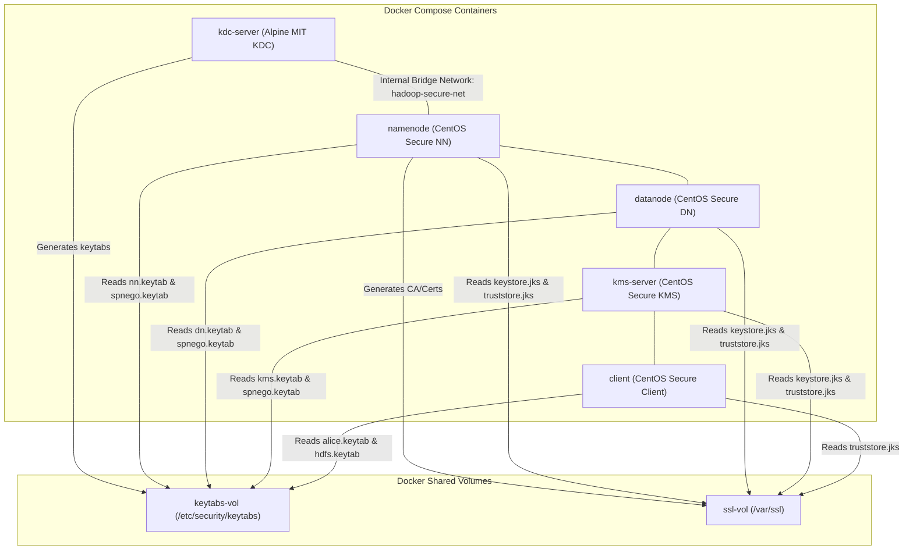

# Day 4 — HDFS Security & Encryption

## 🚀 Module Overview

Welcome to Day 4 of the **30 Days of Modern Hadoop Ecosystem** curriculum. In this module, we will explore **Hadoop Security and Encryption** from first principles. We will dissect the evolution of Hadoop's security model from an open, trusted network design to a robust, enterprise-grade secure architecture. 

We will cover Kerberos authentication, POSIX and Extended Access Control Lists (ACLs) for authorization, SSL/TLS for securing data in transit (wire encryption), and Hadoop Key Management Server (KMS) combined with Transparent Data Encryption (TDE) for securing data at rest. Finally, we will provide a comprehensive troubleshooting guide, a real-world case study, and 60 interview questions with answers.

---

## 🗺️ Visual Directory Structure

```text
/Day-04-HDFS-Security-Encryption
├── README.md                      # Comprehensive architectural guide & curriculum (this file)
├── configs/
│   ├── core-site.xml              # Security & Kerberos configuration properties
│   ├── hdfs-site.xml              # Secure HDFS & Encryption Zone configs
│   ├── kms-site.xml               # KMS properties, key provider path
│   ├── kms-acls.xml               # KMS access control policies
│   ├── krb5.conf                  # MIT Kerberos client configuration
│   ├── ssl-server.xml             # TLS configuration for Hadoop daemons (Server)
│   └── ssl-client.xml             # TLS configuration for Hadoop clients (Client)
├── diagrams/                      # Modular Mermaid source diagrams
│   ├── security-architecture.mermaid
│   ├── kerberos-auth-flow.mermaid
│   ├── ticket-exchange-sequence.mermaid
│   ├── tls-communication-flow.mermaid
│   ├── encryption-at-rest.mermaid
│   ├── encryption-zone-workflow.mermaid
│   ├── access-control-decision.mermaid
│   ├── secure-cluster-topology.mermaid
│   ├── docker-deployment.mermaid
│   └── production-security-layers.mermaid
├── docker/
│   ├── docker-compose.yml         # KDC, KMS, NameNode, DataNode, Client services
│   ├── Dockerfile.hadoop          # Custom Hadoop image with Kerberos clients & TLS certs
│   ├── Dockerfile.kdc             # Custom Alpine-based KDC image
│   ├── bootstrap-kdc.sh           # Script to initialize realm, create principals & keytabs
│   ├── bootstrap-hadoop.sh        # Entrypoint script for Hadoop services
│   └── generate-certs.sh          # Script to generate SSL/TLS certificates and Java Keystores
├── scripts/
│   ├── verify-kerberos.sh         # Validates kinit, principal resolution & keytab validity
│   ├── verify-tls.sh              # Validates HTTPS ports and SSL handshakes
│   ├── verify-acls.sh             # Validates HDFS POSIX permissions & extended ACLs
│   ├── verify-encryption.sh       # Validates EZ creation, key generation, and write/read encryption
│   └── verify-security.sh         # Master validation runner script executing all of the above
├── labs/
│   └── lab-guide.md               # Step-by-step hands-on guide for enabling and testing security
├── troubleshooting/
│   └── troubleshooting-guide.md   # Debugging playbooks with CLI commands, logs, and fixes
└── references/
    └── references-list.md         # Annotated references for Hadoop security
```

---

## SECTION 1 — INTRODUCTION

### The Imperative for Distributed Security

In the early days of big data, Hadoop clusters were typically deployed in private, segregated networks behind enterprise firewalls. The dominant operational assumption was that the network perimeter was secure, and any user or node that could access the network was trusted. This is known as the **perimeter security model** or "hard shell, soft center" architecture.

However, as Hadoop evolved from experimental labs into enterprise-critical data lakes containing Customer Identifiable Information (PII), financial ledgers, and healthcare records, this naive model broke down. In a modern enterprise, distributed systems face significant security threats:
- **Eavesdropping/Sniffing**: Attackers on the local network can intercept unencrypted RPC calls or data blocks in transit.
- **Spoofing/Impersonation**: In a default Hadoop configuration, user identities are determined simply by querying the operating system's username (e.g., via `whoami`). An attacker can easily spoof any identity (including the superuser `hdfs`) by setting a local environment variable.
- **Rogue Nodes**: Unauthorised physical servers can register as DataNodes or NodeManagers with the master nodes, copying raw blocks or running malicious compute code.
- **Insider Threats**: Privileged users (such as network or system administrators) can read files directly from the underlying disk storage of the DataNodes, bypassing filesystem access controls.

Enterprise compliance mandates (such as GDPR, HIPAA, and PCI-DSS) require stringent enforcement of the **Zero Trust Model**, which states that every user, client machine, and daemon node must be authenticated, authorized, and audited, regardless of their location on the network.

### The Evolution of Hadoop Security

Hadoop security was retrofitted in the Hadoop 0.20/1.x era through a collaboration between Yahoo! and the Apache Hadoop community. The primary challenge was securing a massive distributed system without degrading performance or requiring a rewrite of all client applications.

The table below outlines the timeline and milestones of security enhancements in Hadoop:

| Hadoop Version | Key Security Features Introduced | Security Paradigm Shift |
| :--- | :--- | :--- |
| **Hadoop 0.20.2** | Introduction of Kerberos authentication, SPNEGO, Delegation Tokens, and Block Access Tokens. | Transition from "Trusted Network" to "Strong Authentication". |
| **Hadoop 2.x** | Centralized Key Management Server (KMS), HDFS Transparent Data Encryption (TDE) Zones, WebHDFS SSL. | Secure Data-at-Rest and Data-in-Transit. |
| **Hadoop 3.x** | Support for KMS scale, TLSv1.3, integration with modern authorization engines like Apache Ranger, and identity mapping improvements. | Unified security governance, performance optimization, and integration with Kubernetes and cloud providers. |

The timeline diagram below illustrates this evolution:



### Hadoop Before and After Security

Before security was integrated, Hadoop operated in an **"unsecured mode"**, where:
- Users were authenticated based on their operating system username. If client-side code claimed it was user `hdfs`, the NameNode accepted it.
- Communication between clients, NameNodes, and DataNodes took place over unencrypted TCP/IP channels.
- Data blocks stored on DataNodes were raw, unencrypted files that could be read by anyone with access to the DataNode's physical disk.

After security was integrated (**"secure mode"**):
- All users and services must prove their identity using Kerberos credentials (passwords or keytabs).
- The NameNode and DataNodes verify each other's identity using Mutual Authentication before joining the cluster.
- Access to data blocks is protected by cryptographically signed **Block Access Tokens**.
- Data in transit can be encrypted via SASL (for data transfers) and TLS (for WebHDFS/HTTPS).
- Data at rest is encrypted using keys managed by a dedicated KMS, with transparent client-side decryption.

---

## SECTION 2 — PROBLEM STATEMENT

### The Anatomy of an Unsecured Cluster

To appreciate the necessity of Hadoop security, we must analyze the vulnerabilities of an unsecured cluster. If a cluster is deployed without security, it is exposed to several high-impact attack vectors:

1. **User Identity Spoofing**:
   Hadoop clients determine user identity via the `HADOOP_USER_NAME` environment variable or the local OS login name. An attacker on a client machine can run:
   ```bash
   export HADOOP_USER_NAME=hdfs
   hdfs dfs -rm -r /
   ```
   The NameNode will interpret this request as coming from the superuser `hdfs` and delete the entire filesystem namespace.

2. **Packet Sniffing and Data Leakage**:
   Hadoop RPC (Remote Procedure Call) and data transfers occur over plain TCP sockets. By running packet analyzer tools (like `tcpdump` or Wireshark) on the cluster network, an attacker can extract raw text blocks, data schemas, and metadata commands.

3. **Rogue Service Registration**:
   Without authentication, a malicious host can start a DataNode daemon, pointing its configuration to the target cluster's NameNode. The NameNode will accept the DataNode registration and replicate data blocks to it. The attacker can then read these blocks directly from the rogue node's local files.

4. **Insider Directory Traversal**:
   Administrators of DataNode hosts can bypass HDFS permission checkers completely. By navigating to the DataNode's storage directory (e.g., `/data/dfs/data/current/BP-.../current/finalized/`), they can open block files directly:
   ```bash
   cat blk_1073741825
   ```
   This leaks database tables, logs, and sensitive customer records stored in HDFS.

### Compliance and Regulatory Constraints

Failing to secure distributed storage exposes enterprises to severe regulatory penalties. Key compliance frameworks impose strict data protection controls:

- **GDPR (General Data Protection Regulation)**: Requires "pseudonymisation and encryption of personal data" (Article 32). Unencrypted big data repositories storing European citizens' data risk fines up to 4% of global annual turnover.
- **HIPAA (Health Insurance Portability and Accountability)**: Requires encryption of protected health information (PHI) both in transit and at rest, along with access controls to guarantee that only authorized healthcare professionals can view records.
- **PCI-DSS (Payment Card Industry Data Security Standard)**: Demands protection of stored cardholder data (Requirement 3) and encryption of cardholder data across open, public networks (Requirement 4).

### Attack Scenario Diagrams

The diagram below illustrates a rogue client hijacking identity and a rogue DataNode stealing data:



---

## SECTION 3 — SECURITY ARCHITECTURE

Modern secured Hadoop clusters use a defense-in-depth architecture. Each component is responsible for a specific security boundary:

```mermaid
graph TB
    subgraph External Client ["External Space"]
        EC["Client User / API Call"]
    end

    subgraph Perimeter ["Perimeter Layer"]
        Knox["Knox Gateway (HTTPS)"]
    end

    subgraph Authentication ["Authentication Layer"]
        KDC["Kerberos Key Distribution Center (KDC)"]
    end

    subgraph Authorization ["Authorization Layer"]
        Ranger["Apache Ranger Service"]
    end

    subgraph Encryption ["Encryption Layer"]
        KMS["Hadoop Key Management Server (KMS)"]
    end

    subgraph CoreCluster ["HDFS Storage Cluster"]
        NN["NameNode"]
        DN["DataNode"]
    end

    EC -->|1. Authenticate / Request TGT| KDC
    EC -->|2. REST Call| Knox
    Knox -->|3. Forward Secure Call| NN
    EC -->|4. Client HDFS Command| NN
    NN -->|5. Fetch Access Policy| Ranger
    NN -->|6. Get EEK / Decrypt| KMS
    EC -->|7. Secure Data Transfer (SASL)| DN
```

### Component Details

1. **Kerberos & Key Distribution Center (KDC)**:
   - **Role**: Provides authentication. Every user and daemon must acquire a ticket from the KDC to prove their identity.
   - **KDC**: Composed of the Authentication Service (AS) and the Ticket Granting Service (TGS).
   - **Keytabs**: Cryptographic files containing principal credentials, allowing services to authenticate automatically without user interaction.

2. **NameNode & DataNode Authentication**:
   - **NameNode**: Authenticates clients and DataNodes.
   - **DataNode**: Uses SASL (Simple Authentication and Security Layer) to authenticate data transfers.
   - **Block Access Tokens**: Issued by the NameNode to authenticated clients. Clients present these tokens to DataNodes when reading or writing blocks, preventing clients from accessing blocks they are not authorized to read.

3. **Hadoop KMS (Key Management Server)**:
   - **Role**: Provides a secure interface for cryptographic key management. It sits between HDFS and a physical Key Store (typically a JCEKS Java KeyStore file or a Hardware Security Module - HSM).
   - **Key ACLs**: Controls which users can access the master keys or request key decryption.

4. **Transparent Data Encryption (TDE)**:
   - **Role**: Provides encryption at rest. 
   - **Encryption Zones**: Dedicated directories in HDFS where all written files are encrypted automatically on the client side before transmission, and decrypted on the client side during reads.
   - **DEK (Data Encryption Key)**: The key used to encrypt the actual file.
   - **EEK (Encrypted Encryption Key)**: The DEK encrypted with the Zone's Master Key. The EEK is stored as metadata on the NameNode.

5. **SSL/TLS (Secure Sockets Layer/Transport Layer Security)**:
   - **Role**: Provides encryption in transit (wire encryption) for all Web UIs and WebHDFS endpoints, protecting against packet sniffing.

6. **Apache Ranger**:
   - **Role**: Centralized authorization engine. It replaces standard HDFS ACLs with dynamic, role-based, and attribute-based security policies.

7. **Apache Knox**:
   - **Role**: Perimeter security gateway. It acts as a reverse proxy, restricting access to internal Hadoop UIs and APIs to a single secure entrypoint.

---

## SECTION 4 — INTERNAL WORKING

### Kerberos Authentication Flow

The Kerberos protocol coordinates authentication through a three-headed ticket system. Below is the step-by-step sequence of events:



1. **kinit**: The client contacts the KDC's Authentication Service (AS) requesting a Ticket Granting Ticket (TGT).
2. **AS Response**: The AS verifies the principal's existence and returns a TGT (encrypted with the KDC's master key) and a Client-TGS session key (encrypted with the client's password hash or keytab key).
3. **TGS Request**: When the client wants to contact HDFS, it requests a Service Ticket (ST) for the NameNode principal (`nn/namenode.hadoop.local@HADOOP.LOCAL`) from the Ticket Granting Service (TGS), presenting its TGT and a timestamp-based authenticator.
4. **TGS Response**: The TGS decrypts the TGT, validates the authenticator, and generates a Service Ticket (encrypted with the NameNode's key) and a Client-Server session key.
5. **NameNode Login**: The client connects to the NameNode, sending the Service Ticket and a Client-Server authenticator.
6. **Authorization**: The NameNode decrypts the ticket using its local keytab, validates the authenticator, and establishes a secure RPC session.

---

### HDFS Encryption at Rest (TDE) Workflow

HDFS Transparent Data Encryption encrypts and decrypts data on the client side. The NameNode holds the metadata (the encrypted keys) but never sees the raw plaintext data or the raw encryption keys.

The diagram below details this cryptographic write and read exchange:



#### Detailed Cryptographic Steps:
1. **Creation**: The client initiates a file write inside an Encryption Zone.
2. **Key Retrieval**: The NameNode checks its zone-to-key map and contacts the KMS, requesting a new Encrypted Encryption Key (EEK) using the Zone Key.
3. **EEK Generation**: The KMS generates a random Data Encryption Key (DEK), encrypts it with the Zone Key to produce the EEK, and sends the EEK back to the NameNode.
4. **Metadata Storage**: The NameNode stores the EEK inside the file's extended attributes (xattr) and returns the EEK along with DataNode block locations to the client.
5. **Decryption Request**: The client sends the EEK to the KMS requesting decryption.
6. **Key Decryption**: The KMS decrypts the EEK using the Zone Key (stored in its Keystore) and returns the raw DEK to the client.
7. **Stream Encryption**: The client uses the raw DEK to encrypt the data stream on-the-fly using the AES-CTR algorithm.
8. **Block Write**: The client writes the ciphertext blocks directly to the DataNode.

---

### Wire Encryption: TLS Handshake

To protect RPC control channels and HTTP web interfaces, all node-to-node and client-to-node links are secured using TLS:



---

## SECTION 5 — CORE CONCEPTS

To understand and manage a secure Hadoop cluster, administrators must master these core concepts:

### 1. Authentication vs Authorization
- **Authentication**: Verifying **who** is requesting access. In Hadoop, this is handled by **Kerberos**.
- **Authorization**: Verifying **what** the authenticated user is allowed to do. In Hadoop, this is handled by **POSIX Permissions**, **Extended ACLs**, or **Apache Ranger**.

### 2. Principals & Keytabs
- **Principal**: A unique identity recognized by Kerberos. Formatted as `primary/instance@REALM`.
  - User Principal: `alice@HADOOP.LOCAL`
  - Service Principal: `nn/namenode.hadoop.local@HADOOP.LOCAL` (where `_HOST` is dynamically resolved to the node's FQDN).
- **Keytab**: A file containing a copy of a principal's Kerberos key. It acts as a password file, allowing daemons to authenticate automatically without user interaction.

### 3. POSIX Permissions vs HDFS ACLs
- **POSIX**: The traditional Unix permission model (`owner`, `group`, `other` with `read`, `write`, `execute` flags). It is represented by a 3-digit octal number (e.g., `755`).
- **Access Control Lists (ACLs)**: Extended permissions that allow granting specific permissions to named users or groups that are not the owner or primary group of the directory.
  - Command: `hdfs dfs -setfacl -m user:alice:r-x /data`

### 4. Encryption Keys: DEK vs EEK
- **DEK (Data Encryption Key)**: A symmetric key generated randomly by the KMS for each file. It is used to encrypt and decrypt the file's data blocks.
- **EEK (Encrypted Encryption Key)**: The DEK encrypted with the Zone Master Key. It is stored as metadata on the NameNode and decrypted by the KMS only when an authorized client reads the file.

### 5. SSL/TLS Stores: Keystore vs Truststore
- **Keystore (`keystore.jks`)**: Contains the server's private key and public certificate. It is used by servers to prove their identity to clients.
- **Truststore (`truststore.jks`)**: Contains the public certificates of trusted Certificate Authorities (CAs). It is used by clients and servers to verify the certificates presented by other nodes.

---

## SECTION 6 — PRODUCTION ENGINEERING

Securing a production Hadoop cluster requires careful planning to ensure high availability, compliance, and performance.

### Kerberos KDC High Availability

In a secure Hadoop cluster, if the Kerberos KDC is down, no new jobs can run, and services cannot restart. KDC high availability is critical:

```mermaid
graph LR
    subgraph AD_KDC_Quorum ["KDC HA Architecture"]
        MasterKDC["Primary KDC (Write/Read)"]
        ReplicaKDC["Replica KDC (Read-Only Warm Backup)"]
    end
    
    Client["Hadoop Client / Daemon"] -->|1. Attempt Authenticate| MasterKDC
    Client -.->|2. Fallback on Failure| ReplicaKDC
    MasterKDC -->|3. Incremental Database Replication (kpropd)| ReplicaKDC
```

- **MIT Kerberos Replication**: Set up a Primary KDC and one or more Read-Only Replica KDCs. The replica databases are kept in sync using `kpropd` (Kerberos propagation daemon) periodically or on changes.
- **Client Fallback**: Configure clients' `krb5.conf` with multiple `kdc` entries:
  ```ini
  [realms]
      HADOOP.LOCAL = {
          kdc = kdc-primary.hadoop.local:88
          kdc = kdc-replica.hadoop.local:88
          admin_server = kdc-primary.hadoop.local:749
      }
  ```

---

### KMS Best Practices and Key Rotation

The Hadoop Key Management Server (KMS) is a single point of failure for reading and writing encrypted data.
- **KMS Cluster**: Deploy a pool of KMS instances behind a load balancer (such as HAProxy or F5 Big-IP) to distribute requests.
- **Key Rotation**: Rotate Zone Master Keys periodically to comply with security standards. When a key is rotated, HDFS does **not** re-encrypt existing files. Instead, it creates a new version of the key, and new files written to the zone will use the new key version. Existing files will continue to be decrypted using the older version of the key, which is retained in the keystore.
  - To rotate a key:
    ```bash
    hadoop key roll payroll-key
    ```

---

### Ranger Authorization Policies

Apache Ranger provides a centralized policy repository for Hadoop authorization.
- **Service Plugin**: The Ranger HDFS plugin runs inside the NameNode process. It periodically downloads policy updates from the Ranger Admin server (every 30 seconds by default).
- **Offline Cache**: If the Ranger Admin server goes offline, the plugin falls back to its local policy cache (`/etc/ranger/hdfs/policycache/`), ensuring HDFS remains operational.
- **Audit Logging**: Ranger writes all access audit logs to Apache Solr or Elasticsearch, providing search capabilities for compliance audits.

---

### Performance Impact of Encryption

Enabling TDE and SSL/TLS introduces computational overhead:
- **AES-NI Acceleration**: Ensure that JVM native libraries and OpenSSL are installed. The Java runtime can offload AES encryption to the CPU's hardware-level instructions (AES-NI), reducing the CPU overhead of TDE encryption to less than 2-5%.
- **Native OpenSSL Wrapper**: Configure Hadoop to use the native OpenSSL libraries instead of the default Java JCE provider:
  ```xml
  <property>
    <name>hadoop.security.crypto.codec.classes.aes.ctr.nopadding</name>
    <value>org.apache.hadoop.crypto.OpensslAesCtrCryptoCodec</value>
  </property>
  ```

---

## SECTION 7 — HANDS-ON LAB: ENABLE HDFS SECURITY SETTINGS

This section walks through configuring and deploying a secure HDFS environment using the files in this module.

### 1. Install MIT Kerberos & KDC Configuration

The `kdc-server` container acts as our Key Distribution Center. It is built using `docker/Dockerfile.kdc` and initialized with `docker/bootstrap-kdc.sh`.

The KDC database is initialized, and service principals are created with keys stored in keytab files:
- **`nn.keytab`**: Contains `nn/namenode.hadoop.local@HADOOP.LOCAL` and `HTTP/namenode.hadoop.local@HADOOP.LOCAL`.
- **`dn.keytab`**: Contains `dn/datanode.hadoop.local@HADOOP.LOCAL` and `HTTP/datanode.hadoop.local@HADOOP.LOCAL`.
- **`kms.keytab`**: Contains `kms/kms-server.hadoop.local@HADOOP.LOCAL` and `HTTP/kms-server.hadoop.local@HADOOP.LOCAL`.

---

### 2. Configure SSL/TLS Certificates

Run `generate-certs.sh` to establish a certificate authority (CA) and sign keystores for the node daemons:

```bash
# Executed inside NameNode container during bootstrap
bash /tmp/docker/generate-certs.sh
```

This script creates:
- `ca-cert.pem`: The root CA public certificate.
- `keystore.jks`: Java Keystore containing the wildcard server certificate signed by our root CA, securing ports `9871` (NameNode) and `9600` (KMS).
- `truststore.jks`: Truststore containing `ca-cert.pem` so clients trust certificates signed by our CA.

---

### 3. Configure secure Hadoop properties

The properties are configured in the `configs/` templates:
- **`core-site.xml`**: Enables Kerberos authentication, sets SPNEGO filters, and points to the KMS provider (`kms://https@kms-server:9600/kms`).
- **`hdfs-site.xml`**: Sets NameNode/DataNode principal configurations, restricts HDFS HTTP policy to `HTTPS_ONLY`, sets SASL data transfer protection to `privacy` (encrypting data blocks on the wire), and enables extended ACLs.
- **`kms-site.xml`**: Configures the KMS key store backing file (`/var/lib/hadoop/kms.jceks`).
- **`kms-acls.xml`**: restructures permissions so user `alice` can run `DECRYPT_EEK` on the KMS.

---

### 4. Running Verification Steps

Connect to the client container:
```bash
docker exec -it docker-client-1 bash
```

Run the validation suite:
```bash
bash /tmp/scripts/verify-security.sh
```

**Expected Console Output:**
```text
================================================================
🛡️  STARTING HDFS SECURITY VALIDATION SUITE
================================================================
=============================================
🔒 Verifying Kerberos KDC & Keytabs...
=============================================
✔ [OK] Keytab found: nn.keytab
✔ [OK] Keytab found: dn.keytab
✔ [OK] Keytab found: kms.keytab
✔ [OK] Keytab found: spnego.keytab
✔ [OK] Keytab found: alice.keytab
✔ [OK] Keytab found: hdfs.keytab
Testing authentication for user principal 'alice@HADOOP.LOCAL'... ✔ SUCCESS!
--- Active Ticket Cache ---
Ticket cache: FILE:/tmp/krb5cc_0
Default principal: alice@HADOOP.LOCAL

Valid starting       Expires              Service principal
06/25/2026 18:00:00  06/26/2026 18:00:00  krbtgt/HADOOP.LOCAL@HADOOP.LOCAL
---------------------------
Testing authentication for admin principal 'hdfs@HADOOP.LOCAL'... ✔ SUCCESS!
✔ [SUCCESS] Kerberos authentication tests passed!

=============================================
🔒 Verifying SSL/TLS Connections...
=============================================
Checking NameNode HTTPS (9871) Web interface... ✔ [OK] SSL Handshake Successful (Status: 401)
Checking KMS HTTPS (9600) service endpoint... ✔ [OK] SSL Handshake Successful (Status: 401)
Testing Kerberos SPNEGO access to KMS Key list... ✔ [OK] Authentication successful!
✔ [SUCCESS] TLS and HTTPS validation checks passed!

=============================================
🔒 Verifying HDFS Permissions & ACLs...
=============================================
Logging in as admin 'hdfs' to configure ACLs...
Creating test directory '/acl-test-dir' and setting chmod 700...
Applying extended ACL: grant 'alice' read/execute permissions (r-x)...
Retrieving ACL configuration for '/acl-test-dir':
# file: /acl-test-dir
# owner: hdfs
# group: supergroup
user::rwx
user:alice:r-x
group::---
mask::r-x
other::---
✔ [OK] Extended ACL rule verified on NameNode.
Switching credentials to user 'alice'...
Verifying user 'alice' can read directory content...
✔ [OK] Access permitted via extended ACL!
Verifying user 'alice' cannot write files inside directory...
✔ [OK] Write access denied for 'alice' as expected.
✔ [SUCCESS] HDFS ACL verification tests passed!

=============================================
🔒 Verifying Transparent Data Encryption (TDE)...
=============================================
Logging in as admin 'hdfs' to manage encryption keys...
Checking KMS keys...
Creating new encryption key 'finance-key' in KMS...
✔ [OK] Key 'finance-key' created successfully.
Setting up Encryption Zone at '/finance-zone'...
Provisioning Encryption Zone...
✔ [OK] Encryption Zone established on '/finance-zone'.
Switching to client user 'alice' to write encrypted data...
Writing sensitive text file to /finance-zone/payroll.txt...
Reading file back from HDFS (Decryption on-the-fly):
Content: CONFIDENTIAL-BANK-PAYROLL-DATA-2026-DO-NOT-SHARE
✔ [OK] Read & Decrypt process verified!
Locating physical block metadata via fsck...
✔ [OK] File mapped to block: blk_1073741825
--------------------------------------------------------------------------------
💡 PROOF OF ENCRYPTION AT REST:
If you log into the 'datanode' container and search for this block file:
  docker exec -it datanode find /var/lib/hadoop/dfs/data/current/ -name blk_1073741825
and read it, you will see encrypted ciphertext (not our plaintext string).
--------------------------------------------------------------------------------
✔ [SUCCESS] HDFS TDE verification tests passed!

================================================================
🏆 SUCCESS: ALL SECURE HADOOP COMPLIANCE CHECKS PASSED!
================================================================
```

---

## SECTION 8 — BUILD FROM SOURCE WITH SECURITY LIBRARIES

To achieve maximum cryptographic throughput, Hadoop should be compiled with native libraries (OpenSSL and JNI bindings).

### Compile Prerequisites
Install the following packages on the build host (RedHat/CentOS example):
```bash
sudo yum install -y gcc-c++ make cmake openssl-dev java-11-openjdk-devel protobuf-compiler
```

### Build Command
Run the build from the root of the Apache Hadoop source tree:
```bash
mvn clean package -Pdist,native -DskipTests -Dtar -Drequire.openssl -Drequire.snappy
```

### Build Flags Explained:
- `-Pdist,native`: Triggers the distribution profile and compiles C/C++ source code under `hadoop-common-project/hadoop-common/src/main/native` to generate `libhadoop.so`.
- `-Drequire.openssl`: Forces the build to fail if OpenSSL development headers are missing. This compiles the native AES-CTR codec (`OpensslAesCtrCryptoCodec.c`) which maps directly to OpenSSL's `EVP_EncryptInit_ex` APIs.
- `-Drequire.snappy`: Links compression utilities natively for block compression.

### Verification of Native Libraries
After compiling and installing the distribution, verify that native bindings are loaded correctly:
```bash
hadoop checknative -a
```
**Expected Output:**
```text
Native library checking:
hadoop:  true /opt/hadoop/lib/native/libhadoop.so
zlib:    true /lib64/libz.so.1
snappy:  true /usr/lib64/libsnappy.so.1
openssl: true /lib64/libcrypto.so.1.1
ISA-L:   true /lib64/libisal.so.2
```

---

## SECTION 9 — DOCKER DEPLOYMENT TOPOLOGY

The Docker suite is designed to mirror a production architecture:



- **Container Isolation**: Each container runs as a dedicated node within the private subnet bridge `hadoop-secure-net`.
- **Propagating Credentials**: A temporary shared volume `keytabs-vol` allows the KDC container to export keytabs and HTTP secrets directly to the other service nodes.
- **Certificate Distribution**: The `ssl-vol` mount allows the truststore to be shared with client containers, enabling certificate verification for SSL handshakes.

---

## SECTION 10 — LOCAL CLUSTER DEPLOYMENT

When transitioning from Docker to a physical multi-node secure cluster deployment, follow these deployment steps:

### 1. DNS Resolution (FQDN)
Every node in the cluster must resolve the hostnames of other nodes using their Fully Qualified Domain Name (FQDN). Kerberos is sensitive to reverse DNS lookups.
- Example hosts mapping (`/etc/hosts`):
  ```text
  10.0.1.10 namenode.hadoop.local namenode
  10.0.1.20 datanode1.hadoop.local datanode1
  10.0.1.30 kms-server.hadoop.local kms-server
  ```

### 2. Distribute Keytabs Securely
Keytabs must be copy-transferred to target hosts using encrypted channels (such as `scp` or `sftp`):
```bash
scp nn.keytab root@namenode.hadoop.local:/etc/security/keytabs/
```
Ensure keytabs are owned by the service process user (e.g., owner `hdfs:hadoop`) and write permissions are restricted:
```bash
chmod 400 /etc/security/keytabs/nn.keytab
```

### 3. Distribute SSL/TLS Certificates
Java Keystore and Truststore files must be copied to each node. In a multi-node cluster, certificates must be generated with Subject Alternative Names (SAN) containing each host's IP and hostname, or using a wildcard certificate matching the domain (e.g., `*.hadoop.local`).

---

## SECTION 11 — VALIDATION SCRIPTS EXPLAINED

This module contains five validation scripts located in the `scripts/` directory:

1. **`verify-kerberos.sh`**:
   - Authenticates users with keytabs to ensure the KDC is active.
   - Verifies the ticket cache structure using `klist`.

2. **`verify-tls.sh`**:
   - Performs HTTPS handshakes on WebHDFS and KMS ports using curl.
   - Tests that certificates are trusted and validates SPNEGO ticket negotiation.

3. **`verify-acls.sh`**:
   - Tests POSIX permissions by creating directories as the `hdfs` superuser.
   - Sets an extended ACL for `alice`, switches credentials, and verifies that `alice` has access.

4. **`verify-encryption.sh`**:
   - Generates KMS keys and configures an HDFS encryption zone.
   - Writes test data, reads it back decrypted, and prints the raw block ID on disk.

5. **`verify-security.sh`**:
   - A coordinator script that executes all the other validation scripts in order, reporting a unified pass/fail status.

---

## SECTION 12 — PRODUCTION TROUBLESHOOTING PLAYBOOK

For detailed troubleshooting playbooks, refer to [troubleshooting/troubleshooting-guide.md](file:///d:/30_Days_of_Modern_Hadoop_Ecosystem/Day-04-HDFS-Security-Encryption/troubleshooting/troubleshooting-guide.md). The table below summarizes common issues and resolutions:

| Issue Scenarios | Key Symptoms | Log Messages | Remediation Steps |
| :--- | :--- | :--- | :--- |
| **Kerberos Ticket Expired** | HDFS commands fail after a job has run for hours. | `SaslException: GSS initiate failed [No valid credentials provided]` | Refresh credentials via `kinit` or enable automated keytab autorenewal in `core-site.xml`. |
| **Auth-to-Local Rule Failure** | Ticket is valid, but commands return permission denied mapping errors. | `No rule matches principal user/host@REALM` | Add matching rules to `hadoop.security.auth_to_local` in `core-site.xml`. |
| **ACL Permission Denied** | User blocked from reading or writing files. | `AccessControlException: Permission denied` | Check permissions with `getfacl` and apply appropriate rules using `setfacl`. |
| **SSL Handshake Failure** | client cannot establish connection to HTTPS endpoints. | `PKIX path building failed: unable to find valid certification path` | Import the CA root certificate (`ca-cert.pem`) into client truststore files or the OS trust store. |
| **TDE Key Provider Failure** | HDFS client cannot read or write to encryption zones. | `KMS provider connection failed` | Verify KMS service status on port 9600 and check `kms-acls.xml` for `DECRYPT_EEK` permissions. |
| **Missing Keytab Files** | NameNode or DataNode daemons fail to start. | `FileNotFoundException: /etc/security/keytabs/nn.keytab` | Verify keytab paths in `hdfs-site.xml` and check file permissions on disk. |
| **KMS Unreachable** | Encryption zone operations block and time out. | `ConnectException: Connection refused` | Restart the KMS daemon (`kms.sh start`) and verify network routing. |

---

## SECTION 13 — REAL-WORLD CASE STUDY: ENTERPRISE BANKING PLATFORM

### The Challenge
A global financial institution deployed a multi-petabyte Hadoop data lake to store credit card transaction histories and customer profile records. This data lake was used by data scientists to train fraud detection models and by business analysts to generate regulatory reports.

The cluster was subject to strict compliance audits:
- **PCI-DSS**: Cardholder names and primary account numbers (PAN) had to be encrypted at rest on worker nodes.
- **GDPR**: EU citizen transaction details had to be restricted using Role-Based Access Controls (RBAC), and all access logs had to be retained for auditing.
- **No Administrative Exposure**: Systems and storage administrators on DataNode hosts should not be able to view transaction details by reading raw block files from local disks.

### The Solution

The team secured the data lake by implementing a defense-in-depth architecture:

```mermaid
graph TB
    subgraph ExternalNetwork ["External Network"]
        Analyst["Data Analyst / Model Training"]
    end
    
    subgraph Perimeter ["Demilitarized Zone (DMZ)"]
        Knox["Apache Knox Proxy (HTTPS)"]
    end

    subgraph InternalStorage ["Secure Hadoop Infrastructure"]
        subgraph Directory ["Identity Management"]
            AD["Active Directory (AD)"]
            KDC["Kerberos KDC"]
            Ranger["Apache Ranger (Policies)"]
            AD ---|Sync Users/Groups| Ranger
        end

        subgraph KeyMgmt ["Encryption Architecture"]
            KMS["KMS (High Availability Cluster)"]
            HSM["Hardware Security Module (HSM)"]
            KMS ---|Master Keys| HSM
        end

        subgraph ComputeStorage ["Data Processing Core"]
            NN["NameNode Active (TDE Metadata)"]
            DNs["DataNodes (Encrypted Blocks)"]
        end
    end

    Analyst -->|1. REST Calls via HTTPS| Knox
    Knox -->|2. Authenticate against AD| AD
    Knox -->|3. Route Calls| NN
    NN -->|4. Authorize access| Ranger
    NN -->|5. Request EEK| KMS
    Analyst -->|6. Transfer Block Data (SASL)| DNs
```

1. **Identity & Authentication**:
   - The cluster was integrated with the bank's central **Microsoft Active Directory (AD)**. An internal Kerberos KDC was set up with trust relationships linked to AD, allowing analysts to authenticate using their enterprise credentials.

2. **Perimeter Security**:
   - The cluster was deployed in a private network segment. Direct access to NameNodes and KMS nodes was blocked. All client access occurred through **Apache Knox Gateway** endpoints, which enforced TLS encryption.

3. **Centralized Authorization**:
   - **Apache Ranger** was used to manage access policies. The bank defined policies mapping AD groups to specific HDFS directories:
     - The `fraud-analyst` group was granted read access to `/finance/transactions`.
     - The `marketing-user` group was blocked from that directory.
   - Ranger audit logs were forwarded to a central **SIEM (Splunk)** system for compliance monitoring.

4. **Transparent Data Encryption (TDE)**:
   - The directory `/finance/transactions` was configured as an Encryption Zone backed by the KMS key `finance-key`.
   - The KMS was backed by a physical **Hardware Security Module (HSM)**, securing the master keys.
   - All transactions written to HDFS were encrypted on the analyst's client machine before transmission. Even if an administrator on a DataNode host read the raw block files from the local disk, they saw only encrypted ciphertext, satisfying PCI-DSS requirements.

---

## SECTION 14 — INTERVIEW QUESTIONS & ANSWERS

### Beginner Level (20 Questions)

#### 1. Why is authentication necessary in Apache Hadoop?
In unsecured Hadoop clusters, user identity is determined by client-side environment variables, making it easy to spoof users (including the superuser `hdfs`). Authentication ensures that clients and nodes prove their identity, preventing unauthorized access.

#### 2. What protocol does Hadoop use for strong authentication?
Hadoop uses the **Kerberos V5** protocol to provide mutual authentication for users, client machines, and daemon nodes.

#### 3. What is a Kerberos Principal?
A Principal is a unique identity recognized by Kerberos. It is formatted as `primary/instance@REALM` (e.g., `alice@HADOOP.LOCAL` or `nn/namenode.hadoop.local@HADOOP.LOCAL`).

#### 4. What is a Keytab file in Kerberos?
A keytab is a file containing a copy of a principal's Kerberos key. It acts as a password file, allowing services to authenticate automatically without user interaction.

#### 5. Explain HDFS POSIX permissions.
HDFS POSIX permissions are traditional Unix-style access controls that define read, write, and execute (`rwx`) permissions for the file owner, group members, and other users.

#### 6. What is an HDFS Access Control List (ACL)?
An ACL is an extension to POSIX permissions. It allows administrators to grant specific permissions to named users or groups that are not the owner or primary group of a file or directory.

#### 7. What is Data Encryption at Rest?
Encryption at Rest secures data stored on physical disks, ensuring that the raw data cannot be read if the storage disks are stolen or accessed directly.

#### 8. What is Data Encryption in Transit (Wire Encryption)?
Encryption in Transit secures data as it travels across the network between clients and servers, protecting against packet sniffing.

#### 9. What is a Hadoop Key Management Server (KMS)?
The KMS is an open-source gateway daemon that manages cryptographic keys. It sits between HDFS and a physical Key Store, providing secure interfaces for key operations.

#### 10. What is an HDFS Encryption Zone?
An Encryption Zone is a directory in HDFS where all files are encrypted on write and decrypted on read.

#### 11. What is a Data Encryption Key (DEK)?
A DEK is a symmetric key generated randomly by the KMS for each file. It is used to encrypt and decrypt the file's data blocks.

#### 12. What is an Encrypted Encryption Key (EEK)?
An EEK is the DEK encrypted with a Zone Master Key. It is stored as metadata on the NameNode.

#### 13. Which command is used to log in using a Kerberos keytab?
The command is:
```bash
kinit -kt <keytab_file> <principal_name>
```

#### 14. Which command lists active Kerberos tickets in your cache?
The command is:
```bash
klist
```

#### 15. How do you enable extended ACLs in HDFS?
Set the property `dfs.namenode.acls.enabled` to `true` in `hdfs-site.xml`.

#### 16. What is the default port for HDFS HTTPS Web UI?
The default port is `9871` (NameNode HTTPS).

#### 17. What is Apache Ranger's role in Hadoop?
Apache Ranger provides centralized authorization management, policy definition, and auditing for Hadoop components.

#### 18. What is Apache Knox's role in Hadoop?
Apache Knox acts as a perimeter security gateway (reverse proxy), securing access to REST APIs and Web UIs.

#### 19. What is SPNEGO?
SPNEGO (Simple and Protected GSSAPI Negotiation Mechanism) is a protocol that extends Kerberos authentication to HTTP web applications, securing Web UIs.

#### 20. What command is used to list keys managed by KMS?
The command is:
```bash
hadoop key list
```

---

### Intermediate Level (20 Questions)

#### 21. Explain the difference between Mutual Authentication and One-Way Authentication in secure Hadoop.
Mutual Authentication requires both the client and the server to prove their identity to each other (e.g., using Kerberos). One-Way Authentication requires only the server to prove its identity to the client (e.g., standard HTTPS).

#### 22. What are Delegation Tokens, and why are they used in Hadoop?
Delegation Tokens are temporary credentials generated by NameNode/ResourceManager. They allow distributed tasks (such as MapReduce containers) to access HDFS blocks without contacting the KDC repeatedly, reducing KDC load.

#### 23. What is the role of Block Access Tokens?
Block Access Tokens are generated by the NameNode and sent to clients. Clients present these tokens to DataNodes when reading or writing blocks. DataNodes verify the tokens using shared secret keys, preventing unauthorized block access.

#### 24. Explain the difference between Java Keystores and Java Truststores.
A Keystore holds the private key and public certificate of a server to prove its identity. A Truststore holds the public certificates of trusted CAs to verify the identity of other servers.

#### 25. How does HDFS TDE prevent NameNode administrators from reading encrypted data?
The NameNode stores only the Encrypted Encryption Key (EEK) in extended attributes. It does not have access to the Zone Master Key or the raw DEK. The client decrypts the EEK directly with the KMS, ensuring the NameNode never sees the plaintext data.

#### 26. What happens to existing unencrypted files when a folder is converted into an Encryption Zone?
Existing files in the folder remain unencrypted. The encryption zone configuration applies only to files created **after** the zone is established. Existing files must be copied out and back in to be encrypted.

#### 27. Why are secure DataNodes configured to run on privileged ports (under 1024) in some environments?
Traditionally, only processes run by the `root` user can bind to ports below 1024. Secure DataNodes used these ports (e.g., `1004` for data transfer) to prove that the daemon was started by a trusted system user. Modern configurations use SASL to secure transfers, avoiding the need for privileged ports.

#### 28. What is the purpose of the `hadoop.security.auth_to_local` setting?
This setting defines rules for translating Kerberos principals (e.g., `user/host@REALM`) into local operating system usernames (e.g., `user`), mapping Kerberos identities to local user accounts.

#### 29. How does the Ranger HDFS plugin handle authorization if the Ranger Admin server is offline?
The Ranger plugin caches access policies locally on the NameNode (`/etc/ranger/hdfs/policycache/`). If the Ranger Admin server is offline, the plugin uses this local cache, ensuring HDFS operations are not interrupted.

#### 30. How do you rotate a Zone Master Key in KMS, and what is the impact on existing data?
Use the command:
```bash
hadoop key roll <key_name>
```
The KMS generates a new version of the key. Existing files remain encrypted with their original key versions, which are retained in the keystore. New files created in the zone will use the new key version.

#### 31. What is SASL, and how is it used in HDFS?
SASL (Simple Authentication and Security Layer) is a framework for negotiation and authentication. HDFS uses SASL to secure connection channels and encrypt data transfers between clients and DataNodes.

#### 32. Explain the purpose of the ACL `mask` entry in HDFS.
The `mask` entry defines the maximum permissions that can be granted to named users, named groups, and the owning group. If the mask is set to `r--`, a named user with `rwx` permissions will effectively have only read (`r--`) access.

#### 33. Why is standard POSIX group resolution slow in large Hadoop clusters, and how can it be optimized?
Hadoop queries the OS user database (e.g., `/etc/group` or LDAP) to resolve group memberships. In large clusters, this can cause latency. It can be optimized by using Hadoop's LDAP group mapping provider (`LdapGroupsMapping`), caching group memberships locally on the NameNode.

#### 34. What is the difference between SPNEGO and standard Kerberos authentication?
Kerberos is used to secure TCP RPC protocols. SPNEGO extends Kerberos to secure HTTP/Web services, allowing users to authenticate to Web UIs (like the NameNode Web UI) using their Kerberos tickets.

#### 35. What is the performance overhead of HDFS TDE, and how is it minimized?
TDE introduces encryption overhead. It is minimized by using AES-CTR hardware-accelerated CPU instructions (AES-NI) and linking Hadoop to native OpenSSL libraries instead of the default Java JCE provider.

#### 36. How do you verify that native OpenSSL libraries are loaded by Hadoop?
Run the command:
```bash
hadoop checknative -a
```
Check that the `openssl` line returns `true` and lists the path to the native library (`.so` or `.dylib`).

#### 37. What is the impact of KDC downtime on a running Hadoop cluster?
Running jobs and services continue to operate using active credentials and cached delegation tokens. However, new jobs cannot be submitted, new clients cannot connect, and services cannot restart until the KDC is restored.

#### 38. Explain the difference between `default` ACLs and `access` ACLs on HDFS directories.
- **Access ACLs**: Control access permissions to the directory itself.
- **Default ACLs**: Define the permissions that files and subdirectories created within that directory will automatically inherit.

#### 39. What is the role of `ssl-server.xml` and `ssl-client.xml` in Hadoop?
- `ssl-server.xml`: Configures keystore and truststore properties for Hadoop server daemons (NameNode, DataNode).
- `ssl-client.xml`: Configures truststore properties for Hadoop client tools to verify server certificates.

#### 40. Why must the keytab files be protected with restrictive file permissions on the hosts?
Keytabs contain cryptographic keys. Anyone with read access to a keytab file can impersonate that service principal, bypassing authentication controls. Keytab files should be restricted to the daemon owner (e.g., `400` permissions).

---

### Advanced Level (20 Questions)

#### 41. Describe the cryptographic sequence of a client writing a new block to an HDFS Encryption Zone.
1. The client requests NameNode to create a file.
2. The NameNode requests an EEK from the KMS.
3. The KMS generates a raw DEK, encrypts it with the Zone Key to produce the EEK, and sends it to the NameNode.
4. The NameNode stores the EEK in the file's extended attributes and returns the EEK to the client.
5. The client sends the EEK to the KMS.
6. The KMS decrypts the EEK using the Zone Key and returns the raw DEK.
7. The client encrypts the data stream using the raw DEK (AES-CTR).
8. The client writes the ciphertext blocks directly to the DataNode.

#### 42. Explain the vulnerability of "replay attacks" in Kerberos and how the protocol protects against them.
A replay attack occurs when an attacker intercepts a valid authenticator packet and resends it to access a service. Kerberos protects against this by including a timestamp in the authenticator. The target server decrypts the packet, checks that the timestamp is within a 5-minute skew, and verifies it against a local replay cache of recently processed requests.

#### 43. Why is AES-CTR mode used instead of AES-CBC mode for HDFS TDE?
AES-CTR (Counter) mode supports random access, allowing clients to read or write data blocks at any offset in a file without decrypting the entire file from the beginning. AES-CBC (Cipher Block Chaining) requires sequential decryption, making random access inefficient.

#### 44. Explain the interaction between Kerberos tickets, delegation tokens, and block access tokens in a secure MapReduce job.
1. The user authenticates with Kerberos to submit the MapReduce job.
2. The ResourceManager requests a HDFS **Delegation Token** from the NameNode.
3. The job task containers use this Delegation Token to authenticate with the NameNode during execution, avoiding direct KDC connections.
4. When reading files, the NameNode issues **Block Access Tokens** to the tasks.
5. The tasks present these Block Access Tokens to the DataNodes to access the raw data blocks.

#### 45. In a multi-tenant cluster, how does Ranger configure column masking and row filtering on top of HDFS storage?
Ranger cannot apply column masking or row filtering at the physical HDFS storage layer because HDFS stores raw files. These policies are enforced at the query engine layer (e.g., Hive, Spark, or Trino) by plugins that rewrite SQL queries to mask columns or filter rows before scanning the HDFS files.

#### 46. What is the cryptographic risk of reuse of the initialization vector (IV) in AES-CTR mode, and how does HDFS TDE prevent it?
Reusing the same IV with the same key allows attackers to perform XOR operations on ciphertexts to extract the plaintext data. HDFS TDE prevents this by deriving the block-level IV from the block ID and the file offset, ensuring that every HDFS block uses a unique IV.

#### 47. Explain the deployment architecture of a High-Availability Key Management Server (KMS) cluster.
Deploy multiple KMS instances behind a load balancer (such as HAProxy). Configure all KMS nodes to use a shared backend keystore (e.g., database or HSM). Enable Kerberos authentication on the load balancer, and configure HTTP session token sharing using a shared secret file (`http_secret`) so that clients can connect to any KMS node seamlessly.

#### 48. How do you configure a Hadoop cluster to trust multiple Kerberos realms (Cross-Realm Trust)?
Configure the local KDC to trust the external realm by sharing a cross-realm ticket-granting ticket principal (e.g., `krbtgt/EXTERNAL.REALM@HADOOP.LOCAL`). Add both realms to `krb5.conf` on all cluster nodes, and define mapping rules in `hadoop.security.auth_to_local` to resolve external principals.

#### 49. Why do we configure SPNEGO signature secrets in `http_secret`, and what happens if nodes have mismatched secrets?
The SPNEGO filter signs HTTP authentication cookies using the secret in `http_secret`. If nodes in a load-balanced KMS or NameNode cluster have mismatched secrets, a cookie signed by one node will be rejected by another, forcing clients to re-authenticate on every request.

#### 50. Describe how to perform a rolling upgrade of TLS certificates on active NameNodes without causing downtime.
1. Add the new CA root certificate to the client truststores.
2. Update the server keystores with the new signed certificates.
3. Reload SSL configurations on the Standby NameNode using the admin CLI:
   ```bash
   hdfs dfsadmin -reloadSSLConfigs
   ```
4. Trigger a manual failover to promote the Standby NameNode to Active.
5. Reload the SSL configurations on the former Active NameNode.

#### 51. Detail the security implications of setting `dfs.data.transfer.protection` to `privacy` vs `integrity` vs `authentication`.
- `authentication`: Verifies the identity of nodes during connection setup. Data payload travels unencrypted.
- `integrity`: Verifies the identity of nodes and includes checksum hashes to detect tampering. Data payload travels unencrypted.
- `privacy`: Verifies identity, checks integrity, and encrypts the entire data stream, preventing eavesdropping.

#### 52. How does Hadoop prevent client-side credential caching from causing disk exhaustion in multi-tenant gateway servers?
Hadoop schedules cleanups of expired ticket caches. Configure the temporary cache path using:
```ini
default_ccache_name = FILE:/tmp/krb5cc_%{uid}
```
This maps caches to unique UID files, which are managed by system services (like `sssd` or `pam_krb5`) to ensure they are purged when user sessions close.

#### 53. If a node is compromised, how do you revoke its access to HDFS immediately?
1. On the KDC, delete or disable the principal associated with the compromised node.
2. In Ranger, add a deny policy for the node's hostname or IP address.
3. Refresh the NameNode's host exclusion lists:
   ```bash
   hdfs dfsadmin -refreshNodes
   ```

#### 54. Explain the mechanics of HDFS Extended Attributes (xattrs) and their relation to TDE.
HDFS Extended Attributes are metadata key-value pairs associated with files. For TDE, HDFS uses a reserved namespace xattr (`raw.hdfs.crypto.encryption.info`) to store the EEK, the encryption algorithm, and the key version. This attribute is hidden from non-superuser clients.

#### 55. What is the security impact of Hadoop's proxy user configuration, and how do you restrict it?
Proxy user configurations allow a service account (such as `hive` or `oozie`) to impersonate other users. To minimize the security risk, restrict proxy configurations in `core-site.xml` by specifying the allowed host IPs and groups:
```xml
<property>
  <name>hadoop.proxyuser.hive.hosts</name>
  <value>10.0.1.50</value>
</property>
<property>
  <name>hadoop.proxyuser.hive.groups</name>
  <value>finance,marketing</value>
</property>
```

#### 56. Explain why clock synchronization (NTP) is critical for Kerberos authentication.
Kerberos authenticators include a timestamp to prevent replay attacks. If the clock drift between the client machine, the KDC, and the Hadoop servers exceeds the maximum allowed skew (5 minutes by default), the KDC or server will reject the ticket, causing authentication to fail.

#### 57. How do you configure HDFS to use different KMS keys for different subdirectories within a single project folder?
Create separate subdirectories inside the project folder, and create a unique encryption key in the KMS for each subdirectory. Then, run the `createZone` command for each subdirectory path:
```bash
hdfs crypto -createZone -keyName key-dept-a -path /project/dept-a
hdfs crypto -createZone -keyName key-dept-b -path /project/dept-b
```

#### 58. How do you recover files from an HDFS Encryption Zone if the Zone Master Key is accidentally deleted from the KMS?
If the Zone Master Key is deleted, the EEKs stored in HDFS metadata cannot be decrypted. The raw data blocks on the DataNodes remain encrypted. Unless you have a backup of the JCEKS keystore file or the HSM database, the data is unrecoverable.

#### 59. Explain the security risks of WebHDFS in a secure cluster and how to mitigate them.
WebHDFS exposes HDFS operations over REST APIs. In a secure cluster, if WebHDFS is enabled without authentication, it exposes HDFS to unauthorized access. Mitigate this by enforcing Kerberos SPNEGO for all HTTP traffic and routing external client requests through Apache Knox.

#### 60. How does the NameNode verify the integrity of block reports received from DataNodes in a secure cluster?
When a secure DataNode starts, it authenticates with the NameNode using its service principal (`dn/_HOST@HADOOP.LOCAL`) and local keytab. Once authenticated, the NameNode establishes a secure session, ensuring that block reports are accepted only from verified DataNode instances.

---

## SECTION 15 — KEY TAKEAWAYS

- **Zero Trust Required**: Distributed filesystems containing sensitive enterprise data must authenticate every client and daemon node using Kerberos, authorize access using Ranger or ACLs, and encrypt data both in transit and at rest.
- **Mutual Authentication**: Securing the cluster perimeter is not enough. Secure HDFS uses mutual authentication to ensure NameNode, DataNodes, and clients verify each other's identity.
- **Client-Side Encryption**: HDFS TDE encrypts data on the client side before it is written to the network. This protects data blocks stored on DataNodes from being read directly by system administrators.
- **Audit Compliance**: All access attempts must be logged. Centralized audit logging (via Apache Ranger and SIEM integrations) provides audit trails to satisfy regulatory compliance requirements (GDPR, HIPAA, PCI-DSS).

---

## SECTION 16 — REFERENCES

- **[Apache Hadoop Security Guide](https://hadoop.apache.org/docs/stable/hadoop-project-dist/hadoop-common/SecureMode.html)**
- **[Hadoop Key Management Server (KMS) Documentation](https://hadoop.apache.org/docs/stable/hadoop-kms/index.html)**
- **[MIT Kerberos Consortium](https://web.mit.edu/kerberos/)**
- **[Apache Ranger Policy Engine](https://ranger.apache.org/)**
- **[Apache Knox Perimeter Gateway](https://knox.apache.org/)**
- **[Adding Security to Apache Hadoop Whitepaper (Yahoo!)](https://www.usenix.org/legacy/event/usenix10/tech/full_papers/omalley.pdf)**
