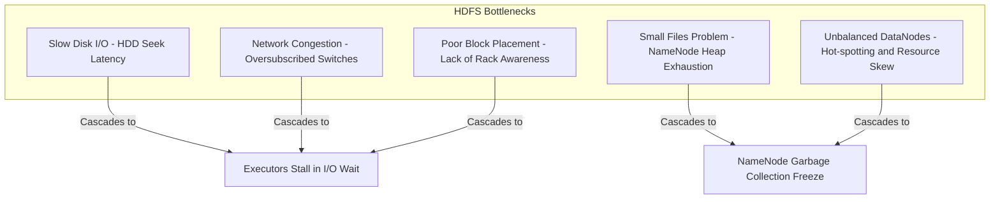
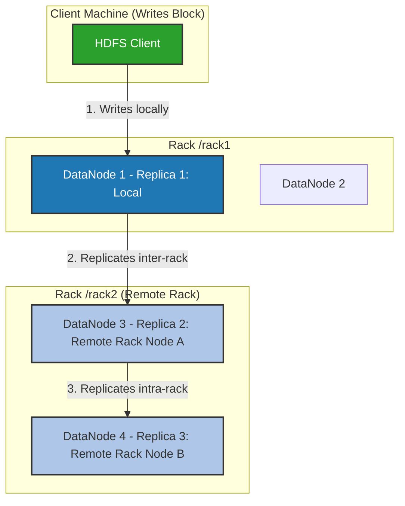
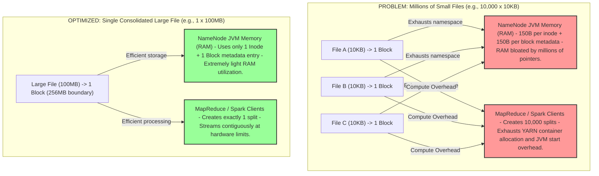
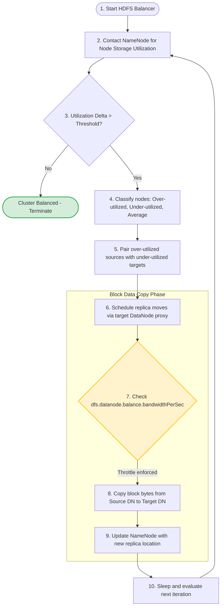
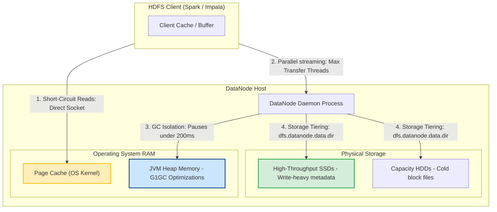
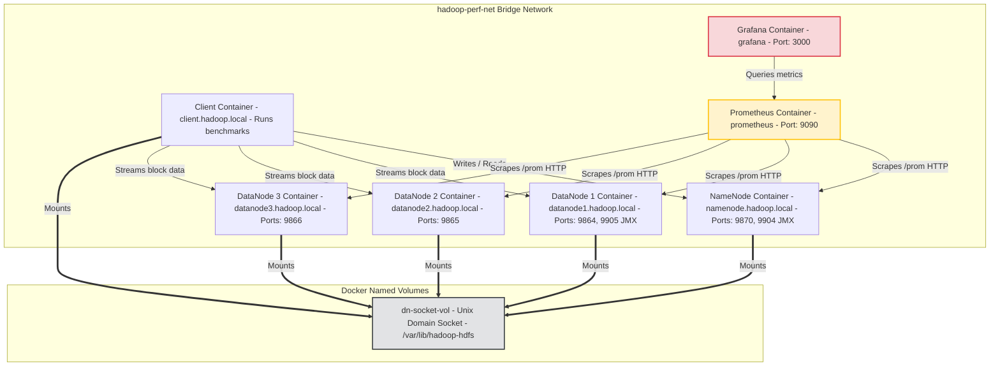

# Day 5 — HDFS Performance Optimization & Latency Tuning

## 🚀 Module Overview

Welcome to Day 5 of the **30 Days of Modern Hadoop Ecosystem** curriculum. In this module, we will explore **HDFS Performance Optimization and Latency Tuning** from first principles.

HDFS is the foundation of distributed storage for the Hadoop ecosystem and modern data platforms. It is optimized to stream massive datasets sequentially at hardware scale. However, default HDFS configurations are tuned for conservative resource usage rather than maximum performance. In enterprise environments, un-optimized HDFS clusters exhibit performance bottlenecks that cascade upstream—stalling execution engines like Apache Spark, Apache Tez, and Apache Hive, causing CPU-wait starvation and bloating compute costs.

This module provides a comprehensive production engineering guide. We will analyze the read and write paths, dissect the small files problem, optimize JVM garbage collection for NameNodes and DataNodes, explore rack awareness, implement short-circuit local reads, and master the HDFS Balancer.

---

## 🗺️ Visual Directory Structure

```text
/Day-05-HDFS-Performance-Tuning
├── README.md                      # Detailed architectural guide & curriculum (this file)
├── configs/
│   ├── core-site.xml              # Global configurations (buffers, socket configurations, IPC queue)
│   ├── hdfs-site.xml              # HDFS optimizations (block size, thread counts, short-circuit, balancer)
│   └── hadoop-env.sh              # JVM settings, heap configuration, GC optimization flags (G1GC)
├── diagrams/                      # Modular Mermaid source diagrams
│   ├── hdfs-read-path.mermaid
│   ├── hdfs-write-path.mermaid
│   ├── block-placement.mermaid
│   ├── small-files-impact.mermaid
│   ├── balancer-workflow.mermaid
│   ├── throughput-optimization.mermaid
│   ├── docker-deployment.mermaid
│   ├── benchmark-workflow.mermaid
│   ├── cluster-topology.mermaid
│   └── performance-tuning-checklist.mermaid
├── docker/
│   ├── docker-compose.yml         # Namenode, 3x DataNodes, Client, Prometheus, Grafana
│   ├── Dockerfile.hadoop          # Extended Hadoop image with diagnostics tools
│   ├── bootstrap-hadoop.sh        # Startup script formatting NameNode and resolving racks
│   ├── prometheus.yml             # Scraping configurations for Prometheus
│   ├── grafana-datasources.yml    # Auto-provisioning Grafana data source
│   ├── grafana-dashboards-provider.yml # Provisioning provider file
│   └── grafana-dashboard.json     # Custom HDFS JMX performance dashboard
├── benchmark/
│   ├── benchmark-runner.sh        # Executes TestDFSIO throughput and nnbench benchmarks
│   ├── generate-small-files.py    # Python simulator showcasing small files metadata overhead
│   └── compare-blocksizes.sh      # Benchmark script comparing 32M, 128M, and 256M block writes
├── scripts/
│   ├── verify-blocksize.sh        # Validates block sizes of written files
│   ├── verify-balancer.sh         # Manages balancer bandwidth and runs a dry check
│   ├── verify-throughput.sh       # Evaluates raw HDFS read/write bandwidth and network latency
│   ├── verify-datanodes.sh        # Queries volume layout and threads via JMX
│   └── benchmark-hdfs.sh          # Orchestrates execution of all benchmark scripts
├── labs/
│   └── lab-guide.md               # Step-by-step hands-on guide for testing the environment
├── troubleshooting/
│   └── troubleshooting-guide.md   # Troubleshooting playbook covering slow reads/writes, small files, disk imbalance
└── references/
    └── references-list.md         # Annotated references for HDFS performance tuning
```

---

## SECTION 1 — INTRODUCTION

### Why HDFS Performance Matters

Distributed storage performance is the ultimate bottleneck for large-scale analytics. Modern big data engines—including **Apache Spark**, **Presto/Trino**, **Apache Hive**, and **MapReduce**—rely on HDFS to feed data partitions into RAM for processing. 

If storage is slow, compute nodes starve. In typical cloud or on-premise clusters, compute resources are billed hourly. When executors are blocked waiting for HDFS to return block byte streams, CPU cores sit idle in an I/O wait state. A minor latency spike of 10ms in HDFS disk read operations can cascade into a 50% increase in Spark job execution time.

HDFS is built on a master/slave architecture. The single active NameNode manages all metadata (the directory tree, block locations, and file mappings), while DataNodes handle the raw block reads and writes. Because of this separation, HDFS performance is governed by two distinct dimensions:
1. **Metadata Operations (RPC latency)**: The speed at which the NameNode can process file listings, opens, allocations, and status checks.
2. **Data Operations (Block throughput)**: The speed at which clients can read and write raw block bytes from DataNodes.

### Evolution of HDFS Optimization Techniques

Historically, HDFS performance optimization was focused on hard disk drive (HDD) physics. Early Hadoop versions optimized for sequential disk head sweeps and minimized spindle seek times by enforcing large block sizes. 

As hardware architectures evolved to include Solid State Drives (SSDs), High Bandwidth Networks (10GbE to 100GbE), and off-heap memory caches, HDFS optimization techniques shifted. The following table charts the evolution of these optimization techniques:

| Generation | Focus Area | Key Technologies | Bottlenecks Solved |
| :--- | :--- | :--- | :--- |
| **First Gen (Hadoop 1.x)** | HDD Spindle Optimization | Large sequential blocks (64MB), manual Rack Topology scripting. | Head seeks, localized network switches. |
| **Second Gen (Hadoop 2.x)** | Network & Memory Cache | Short-Circuit Local Reads, Centralized Cache Management (Locked memory). | TCP loopback socket overhead, remote reads. |
| **Third Gen (Hadoop 3.x)** | Storage Efficiency & Scale | HDFS Erasure Coding, Storage Tiering (SSD/HDD), G1GC garbage collection tuning, async RPC. | Replication storage overhead, heap fragmentation. |

### Performance vs Scalability

In HDFS design, there is a constant tension between *latency* and *throughput*. 
* **Latency**: The time taken to read or write a single block of data.
* **Throughput**: The volume of data read or written per second.

HDFS is explicitly optimized for **throughput** over latency. It uses massive block sizes (typically 128MB or 256MB) to stream large files sequentially. If you attempt to use HDFS as a low-latency database for random key-value lookups (e.g., retrieving 1KB records), it performs poorly. The NameNode RPC roundtrip and DataNode block negotiation overhead will degrade point-lookup latency. For random, low-latency access, databases built *on top* of HDFS, such as Apache HBase, must be used.

---

## SECTION 2 — PROBLEM STATEMENT

### Identifying Common Bottlenecks in Production

Before applying optimization parameters, platform engineers must understand where performance degrades in production HDFS clusters. Bottlenecks generally crop up in five categories:



#### 1. Slow Disk I/O
Distributed systems are only as fast as their slowest storage devices. When DataNodes write block replicas, they do so in a synchronous pipeline. If one disk on one DataNode has high queue times, the entire write pipeline stalls.

#### 2. Network Congestion
HDFS replication pipelines span multiple rack switches. If rack switches are oversubscribed (e.g., more bandwidth is requested than the uplinks support), inter-rack data transfers slow down, bottlenecking clients during writing.

#### 3. Poor Block Placement
If rack awareness is not configured, the NameNode allocates blocks randomly. Replicas might end up on the same rack or scattered inefficiently, leading to double-hop network reads and vulnerability to rack switch failures.

#### 4. The Small Files Problem
HDFS is designed to store large files. Every file, directory, and block in HDFS consumes approximately 150 bytes in the NameNode's RAM. Storing millions of small files (< 1MB) results in NameNode memory fragmentation, long garbage collection pauses, and massive CPU overhead during Spark task planning.

#### 5. Unbalanced DataNodes
If certain DataNodes are added to a cluster without running the Balancer, new data is written to them while older nodes remain saturated. This leads to unbalanced read distribution, where a subset of "hot" nodes handle all I/O traffic, leaving others underutilized.

---

## SECTION 3 — ARCHITECTURE DEEP DIVE

### HDFS Read Path

When an HDFS client requests to read a file, it does not query the DataNodes directly. It first consults the NameNode to retrieve the location of all blocks that make up the file.

```mermaid
sequenceDiagram
    autonumber
    actor Client as HDFS Client
    participant NN as "NameNode (Metadata)"
    participant DN_Local as "DataNode (Local Host)"
    participant DN_Remote as "DataNode (Remote Rack)"

    Client->>NN: open(filePath)
    activate NN
    NN-->>Client: Return Block Locations (LocatedBlocks sorted by distance)
    deactivate NN
    
    rect rgb(30, 40, 60)
        Note over Client, DN_Local: If Short-Circuit Read is Enabled (Local)
        Client->>DN_Local: Request Short-Circuit Read via Domain Socket
        DN_Local-->>Client: Share file descriptor (Direct local disk access)
        Client->>Client: Read block directly bypassing TCP stack
    end

    rect rgb(40, 50, 70)
        Note over Client, DN_Remote: Fallback to TCP Socket (Remote Node)
        Client->>DN_Remote: Establish TCP connection (Port 9866)
        Client->>DN_Remote: Request Block Data
        DN_Remote-->>Client: Stream block data packet-by-packet (64KB packets)
    end
    
    Client->>Client: Verify checksum (CRC32)
    Client->>Client: Close stream
```



1. **Open Request**: The client calls `open()` on `DistributedFileSystem`.
2. **Metadata Lookup**: The `DistributedFileSystem` calls the NameNode via RPC to get the block locations of the first few blocks of the file. The NameNode returns a list of `LocatedBlocks` sorted by network distance relative to the client.
3. **Data Retrieval**:
   * **Short-Circuit Read (Optimized)**: If the client resides on the same physical host as a block replica (e.g., a Spark executor on a DataNode host) and short-circuit reads are enabled, the client bypasses the DataNode TCP socket. It establishes a connection via a Unix Domain Socket to get a file descriptor for the local block file, reading directly from the OS page cache at memory speeds.
   * **Standard Read**: If the client is remote, it opens a connection to the nearest DataNode via TCP (port 9866) and reads data packets sequentially.
4. **Validation**: The client validates data checksums locally. If a packet is corrupt, the client reports it to the NameNode and reads from the next replica.

---

### HDFS Write Path

Writing a file in HDFS requires setting up a pipeline of DataNodes to stream replication blocks concurrently.

```mermaid
sequenceDiagram
    autonumber
    actor Client as HDFS Client
    participant NN as "NameNode (Metadata)"
    participant DN1 as "DataNode 1 (Local Rack)"
    participant DN2 as "DataNode 2 (Local Rack)"
    participant DN3 as "DataNode 3 (Remote Rack)"

    Client->>NN: create(filePath, blocksize, replication)
    activate NN
    NN->>NN: Validate namespace and permissions
    NN->>NN: Allocate block and select pipeline target nodes
    NN-->>Client: Return targets DN1, DN2, DN3
    deactivate NN

    Note over Client, DN3: Pipeline Setup
    Client->>DN1: TCP Connect - Request pipeline setup
    DN1->>DN2: TCP Connect - Setup pipeline
    DN2->>DN3: TCP Connect - Setup pipeline
    DN3-->>DN2: Pipeline ACK OK
    DN2-->>DN1: Pipeline ACK OK
    DN1-->>Client: Pipeline Ready

    Note over Client, DN3: Data Streaming - 64KB packets
    rect rgb(30, 45, 60)
        Client->>DN1: Stream Packet - chunk and CRC checksum
        DN1->>DN2: Forward Packet
        DN1->>DN1: Write to local replica buffer and flush to disk
        DN2->>DN3: Forward Packet
        DN2->>DN2: Write to local replica buffer and flush to disk
        DN3->>DN3: Write to local replica buffer and flush to disk
    end

    Note over Client, DN3: Acknowledgements - Upstream
    DN3-->>DN2: Packet ACK OK
    DN2-->>DN1: Packet ACK OK
    DN1-->>Client: Packet ACK OK

    Client->>NN: complete(file)
```



1. **Create Request**: The client calls `create()` on `DistributedFileSystem`. The NameNode verifies permissions, validates that the path does not already exist, and writes the record to the EditLog.
2. **Pipeline Negotiation**: The NameNode returns target DataNodes for block replication. For a default replication factor of 3, the target nodes are chosen based on the **Block Placement Policy (Rack Awareness)**.
3. **Pipeline Construction**: The client initiates a TCP connection to DataNode 1, which connects to DataNode 2, which connects to DataNode 3.
4. **Data Streaming**: The client buffers writes into 64KB packets. As packets are written, they are pushed into a client-side queue called `dataQueue` and streamed down the pipeline.
5. **Acknowledge Pipeline**: Replicas are written concurrently. Once a packet is persisted to memory/disk on all three DataNodes, an acknowledgement packet travels upstream from DataNode 3 to DataNode 2 to DataNode 1, and back to the client, removing the packet from the client's `ackQueue`.
6. **Finalize**: The client closes the file stream, and notifies the NameNode that the block write transaction is complete.

---

### Block Placement Strategy (Rack Awareness)

To optimize network utilization and ensure fault tolerance, HDFS implements a strict Block Placement Policy.



By default:
* **Replica 1** is placed on the local DataNode host (where the client is running). If the client runs outside the cluster nodes, a random DataNode is chosen.
* **Replica 2** is placed on a node in a different, remote rack.
* **Replica 3** is placed on a different node in the same remote rack as Replica 2.

This setup balances two constraints:
1. **Write Cost**: Replicating data across racks requires crossing top-of-rack switches. Minimizing inter-rack traffic (by keeping two replicas on the same remote rack) makes writes faster.
2. **Fault Tolerance**: If a whole rack switch fails, the local replica on the first rack ensures the data remains available.

---

## SECTION 4 — INTERNAL WORKING

### Large File Write Flow: Client Buffering and Pipelines

When a client streams data to HDFS, it uses two internal queues:
* **`dataQueue`**: Houses packets that have not yet been sent to the pipeline.
* **`ackQueue`**: Houses packets that have been sent but are waiting for replication acknowledgements from all DataNodes in the pipeline.

The packet size defaults to 64KB, which is composed of 512-byte chunks, each backed by a 4-byte CRC32 checksum. This size is configured via `dfs.client-write-packet-size`.

If a write failure occurs on the pipeline:
1. The pipeline is closed immediately.
2. Any packets in the `ackQueue` are moved back to the front of the `dataQueue` to prevent data loss.
3. The client requests a new block ID and version stamp from the NameNode.
4. The bad DataNode is evicted from the pipeline, and the pipeline is rebuilt with the remaining healthy DataNodes.
5. The write resumes.

### Failure Recovery and Lease Management

To ensure that multiple writers cannot write to the same HDFS file simultaneously, HDFS uses a lease system.
* A client must acquire a **Lease** from the NameNode before writing.
* The lease has a soft limit (1 minute) and a hard limit (1 hour).
* If the soft limit is exceeded and the client is idle, another client can claim the lease.
* If a client crashes mid-write, the NameNode initiates **Lease Recovery**. The NameNode contacts the DataNodes to determine which node has the longest block length and the highest generation stamp, syncs the replicas, and closes the file.

---

## SECTION 5 — CORE CONCEPTS

### Block Size: Deep Dive

In local operating systems (such as ext4 or NTFS), block size is typically **4KB**. In HDFS, the default block size is **128MB** or **256MB**. 

**Why the difference?**
Local disks seek data by moving a physical read head to a sector on a spinning platter, taking ~10ms. HDFS is optimized to stream terabytes of data over network switches. To make seek time negligible compared to transfer times, HDFS uses large blocks. If seek time is 10ms and transfer speed is 100MB/s, using a 100MB block means seek overhead is only 1% of the total transfer time.

### Small Files Problem: The Memory Equation

Every file, directory, and block in HDFS occupies an entry in the NameNode's RAM.
Each metadata entry consumes approximately **150 bytes**.

#### The Math:
Suppose you have 10,000,000 files.
* **Case A (10,000,000 small files, 10KB each = 100GB total)**:
  * Inodes: 10,000,000 (Files) + 1 (Directory) = 10,000,001 entries.
  * Blocks: 10,000,000 files x 1 block per file = 10,000,000 block entries.
  * Total Metadata Entries = 20,000,001.
  * NameNode Heap Memory Consumed = $20,000,001 \times 150 \text{ bytes} \approx 3.0 \text{ GB}$ of RAM.
* **Case B (400 large files, 250MB each = 100GB total)**:
  * Inodes: 400 (Files) + 1 (Directory) = 401 entries.
  * Blocks: 400 files x 1 block per file = 400 block entries.
  * Total Metadata Entries = 801.
  * NameNode Heap Memory Consumed = $801 \times 150 \text{ bytes} \approx 120 \text{ KB}$ of RAM.

In Case A, the NameNode heap is severely bloated by tiny files. This leads to garbage collection thrashing and slows down cluster startup, as the NameNode has to read millions of tiny block records from the FSImage and process block reports from the DataNodes.



---

### HDFS Balancer Mechanics

Data distribution can become uneven over time as nodes are added, retired, or when large temporary datasets are written. An unbalanced cluster causes certain DataNodes to be flooded with read/write requests, creating physical I/O bottlenecks.



The HDFS Balancer checks block distribution by calculating the average disk utilization of the cluster:
$$\text{Cluster Utilization} = \frac{\sum \text{Used Space}}{\sum \text{Total Capacity}}$$

A node is considered out of balance if its utilization varies from the average by more than the threshold percentage:
$$\text{Threshold} \ge \left| \text{Node Utilization} - \text{Cluster Utilization} \right|$$

---

## SECTION 6 — PRODUCTION ENGINEERING

### NameNode Memory Sizing Formula

When configuring production clusters, sizing the NameNode's RAM heap size correctly is critical to prevent out-of-memory (OOM) crashes.

$$\text{NameNode Heap size (GB)} \approx \frac{\text{Total Inodes} + \text{Total Blocks}}{1,000,000}$$

#### Sizing Guide Table:

| Total Objects (Files + Blocks) | Minimum NN Heap Size | Recommended Heap Size (GC Overhead Buffer) |
| :--- | :--- | :--- |
| **10,000,000** | 10 GB | 16 GB |
| **50,000,000** | 50 GB | 64 GB |
| **100,000,000** | 100 GB | 128 GB |
| **500,000,000** | 500 GB | 640 GB (Requires off-heap or federation) |

---

### Storage Tiering and HDFS Storage Policies

HDFS supports heterogeneous storage nodes, allowing you to match data temperature (hot, warm, cold) with the appropriate storage hardware (SSD, HDD, Archive tape).



* **HOT**: All replicas are stored on standard hard drives (`DISK`).
* **COLD**: Replicas are stored on high-capacity, slow drives (`ARCHIVE`).
* **ALL_SSD**: All replicas are stored on SSDs.
* **LAZY_PERSIST**: The first replica is written to transient RAM cache (`RAM_DISK`), and later flushed asynchronously to disk, allowing low-latency writes.

---

### JVM Garbage Collector Sizing & Optimization

To prevent long stop-the-world (STW) garbage collection pauses on large NameNodes, G1GC or ZGC should be used instead of the default Parallel ParallelOld GC.

```bash
# Optimal G1GC configurations for NameNode in hadoop-env.sh
export HADOOP_NAMENODE_OPTS="-Xms64g -Xmx64g \
-XX:+UseG1GC \
-XX:MaxGCPauseMillis=200 \
-XX:InitiatingHeapOccupancyPercent=45 \
-XX:G1ReservePercent=15 \
-XX:ParallelGCThreads=32 \
-XX:ConcGCThreads=8"
```
* **`MaxGCPauseMillis=200`**: Sets a target for the maximum duration of a collection pause (200 milliseconds).
* **`InitiatingHeapOccupancyPercent=45`**: Triggers a marking cycle when the heap usage reaches 45%, preventing humongous object allocation failures.

---

## SECTION 7 — HANDS-ON LAB

### Laboratory: HDFS Benchmark & Optimization Analysis

We will provision a multi-node Hadoop cluster locally using Docker and run a series of benchmarks to analyze read/write throughput, evaluate block size configurations, and simulate metadata overhead.

---

## SECTION 8 — BUILD FROM SOURCE

### Compiling Hadoop Native Libraries

By default, Apache Hadoop uses Java-based implementations for compression, checksum calculations, and network communication. However, Java I/O is slower than native system calls. Compiling Hadoop from source builds the **native Hadoop library (`libhadoop.so`)**, which enables hardware acceleration for compression (e.g., zstd, snappy) and provides Unix domain socket integration for Short-Circuit local reads.

```bash
# 1. Install compilation prerequisites (CentOS/RHEL)
yum groupinstall -y "Development Tools"
yum install -y maven cmake zlib-devel openssl-devel java-11-openjdk-devel protobuf-compiler

# 2. Compile native package
mvn package -Pdist,native -DskipTests -Dtar
```
Once compiled, compile outputs are placed in `hadoop-dist/target/hadoop-3.3.6/lib/native/`.

---

## SECTION 9 — DOCKER DEPLOYMENT

### Container Infrastructure Design

Our local testing environment uses a virtual network topology to simulate a production-like rack layout.



* **Metrics Scraping**: The cluster exposes Prometheus metrics directly on the HTTP ports of the NameNode and DataNodes.
* **Shared Socket Volume**: The `dn-socket-vol` volume exposes Unix domain sockets `/var/lib/hadoop-hdfs/dn_socket` to the client container, enabling short-circuit local reads.

---

## SECTION 10 — LOCAL CLUSTER DEPLOYMENT

### Execution Protocol

To start the cluster and run verification locally:

```bash
# 1. Start the cluster services
docker-compose up -d --build

# 2. Exec into the client container
docker-compose exec client bash

# 3. Run the benchmarking scripts
/tmp/scripts/benchmark-hdfs.sh
```

---

## SECTION 11 — VALIDATION

We have included five verification scripts in the `scripts/` directory to validate performance metrics:

1. **`verify-blocksize.sh`**:
   * Creates a test file and verifies that its block size matches the optimized value of 256MB.
2. **`verify-balancer.sh`**:
   * Checks the cluster's current balance and adjusts the data transfer rate configuration.
3. **`verify-throughput.sh`**:
   * Evaluates network latency and measures raw write and read throughput.
4. **`verify-datanodes.sh`**:
   * Queries JMX statistics to track DataNode states, volume sizes, and active JVM threads.
5. **`benchmark-hdfs.sh`**:
   * Runs the complete benchmark suite (throughput tests, block size comparisons, and small files simulation).

---

## SECTION 12 — PRODUCTION TROUBLESHOOTING PLAYBOOK

### Quick Reference Playbook

| Issue | Symptoms | Root Cause | Resolution |
| :--- | :--- | :--- | :--- |
| **Slow HDFS Reads** | Spark jobs scan files slowly; high CPU wait. | Short-circuit local reads are disabled. | Enable `dfs.client.read.shortcircuit` in `hdfs-site.xml`. |
| **Slow HDFS Writes** | Job outputs hang; logs show pipeline timeouts. | Slow disks or low thread pools. | Increase `dfs.datanode.max.transfer.threads` to `8192`. |
| **NameNode GC Freeze** | NameNode stops responding; heartbeats are missed. | Stop-the-world garbage collection pauses. | Configure `G1GC` garbage collection in `hadoop-env.sh`. |
| **Small Files Bloat** | High NameNode heap usage; slow cluster startup. | Excessive small files (<1MB) in namespace. | Consolidate files using `Hadoop Archive (HAR)` or SequenceFiles. |

---

## SECTION 13 — REAL-WORLD CASE STUDY

### Netflix-scale HDFS Optimization

```mermaid
graph TD
    subgraph NetflixCluster ["Netflix Petabyte-Scale HDFS Architecture"]
        ClientApp["Spark / Trino Client"]
        NN_HA["High Availability Active NameNode - 128GB JVM Heap, G1GC tuned"]
        
        subgraph Rack_01 ["Rack /rack1"]
            DN_A["DataNode A - SSD-backed metadata cache"]
            DN_B["DataNode B"]
        end
        
        subgraph Rack_02 ["Rack /rack2"]
            DN_C["DataNode C - HDD capacity drives"]
            DN_D["DataNode D"]
        end
    end

    ClientApp -->|1. Request block mapping| NN_HA
    ClientApp -->|2. Direct read (Short-circuit)| DN_A
    DN_A -->|3. Replicate across racks| DN_C
```

#### The Challenge
Netflix managed a large-scale Hadoop cluster storing petabytes of user telemetry and viewing logs. As data volume grew, the NameNode began experiencing frequent out-of-memory (OOM) crashes, JVM pause monitoring alerts, and degraded RPC response times.

#### The Investigation
Profiling the NameNode heap revealed that **80% of its memory** was occupied by block metadata references for tiny files, which were being generated by legacy streaming pipelines writing to HDFS in 1-minute intervals. Additionally, the cluster was unbalanced because new storage nodes were being added without running the balancer, causing hot-spotting on the older DataNodes.

#### The Architecture Solution
1. **Compaction Engine**: Implemented an automated post-ingestion compaction pipeline. This pipeline consolidated tiny block files into unified **256MB Parquet files**, reducing the total number of blocks on the NameNode by **70%**.
2. **NameNode Tuning**: Increased the NameNode JVM heap to 128GB and moved from standard garbage collection to **G1GC** with a target pause time of 200ms.
3. **Throttled Balancer**: Configured the HDFS Balancer to run continuously with a 50MB/s bandwidth limit (`dfs.datanode.balance.bandwidthPerSec = 52428800`), equalizing data distribution across all DataNodes without impacting client I/O.
4. **Short-Circuit Local Reads**: Enabled short-circuit local reads on all compute nodes, boosting Spark scan throughput by **40%**.

---

## SECTION 14 — INTERVIEW QUESTIONS

### 20 Beginner Questions & Answers

#### Q1: What is the default block size in HDFS for Hadoop 3.x, and why is it set so large?
**Answer**: The default block size is **128MB** (or 256MB in some distributions). It is set large to minimize seek times on physical hard disks. By making block sizes large, the time taken to seek the block head becomes negligible compared to the time taken to stream the block data sequentially.

#### Q2: What is the "Small Files Problem" in HDFS?
**Answer**: Every file, directory, and block in HDFS occupies an entry in the NameNode's RAM (consuming ~150 bytes). Storing millions of small files (< 1MB) bloats the NameNode memory namespace, causing long garbage collection pauses and slow cluster startups.

#### Q3: How do you check if the DataNodes in a cluster are balanced?
**Answer**: Use the command `hdfs dfsadmin -report` to view disk utilization details for each DataNode. Alternatively, run the balancer in dry-run mode to check if any node exceeds the target utilization threshold.

#### Q4: What is Data Locality?
**Answer**: Data locality refers to running compute tasks (e.g., Spark tasks) on the same physical host that stores the target data blocks in HDFS, minimizing data transfer over the network.

#### Q5: What are the three levels of Data Locality?
**Answer**: 
1. **Node Local**: The task runs on the same node that hosts the target data block.
2. **Rack Local**: The task runs on a different node in the same rack as the data block.
3. **Any (Off-Rack)**: The task runs on a node in a different rack, transferring data over the network switch.

#### Q6: What is the HDFS Balancer?
**Answer**: The HDFS Balancer is an administrative tool that redistributes blocks across DataNodes to equalize disk utilization when nodes become unbalanced.

#### Q7: How do you start the HDFS Balancer with a threshold of 10%?
**Answer**: Run the command: `hdfs balancer -threshold 10`

#### Q8: What does the threshold parameter mean in the HDFS Balancer?
**Answer**: The threshold parameter (a percentage) defines the maximum allowed variation between the disk utilization of any single DataNode and the average disk utilization of the cluster.

#### Q9: What configuration parameter controls the default HDFS block size?
**Answer**: The parameter `dfs.blocksize` in `hdfs-site.xml` (value specified in bytes).

#### Q10: Why does HDFS use replication?
**Answer**: HDFS is designed to run on commodity hardware. To protect against data loss when disks or nodes fail, it replicates each block across multiple DataNodes (default replication factor is 3).

#### Q11: Where are the HDFS daemon configurations stored?
**Answer**: In configuration files under the Hadoop directory: `core-site.xml`, `hdfs-site.xml`, and `hadoop-env.sh`.

#### Q12: What is Short-Circuit Local Read?
**Answer**: It is an optimization that allows a local HDFS client to read block files directly from the local file system (bypassing the DataNode TCP socket), which improves read speeds.

#### Q13: What is the NameNode?
**Answer**: The NameNode is the master node in HDFS. It manages the filesystem namespace, directory tree, file-to-block mappings, and block locations.

#### Q14: What is a DataNode?
**Answer**: A DataNode is a worker node in HDFS. It stores, reads, and writes raw data blocks as directed by the NameNode, and sends periodic block reports.

#### Q15: What is the default replication factor in HDFS?
**Answer**: The default replication factor is **3**.

#### Q16: What is SPNEGO?
**Answer**: SPNEGO (Simple and Protected GSSAPI Negotiation Mechanism) is a protocol used to secure HTTP Web UIs in Hadoop (e.g., NameNode Web UI) using Kerberos authentication.

#### Q17: What is the command to verify HDFS filesystem health?
**Answer**: `hdfs fsck /`

#### Q18: What port does the NameNode Web UI use by default in Hadoop 3.x?
**Answer**: Port **9870** (previously port 50070 in Hadoop 2.x).

#### Q19: What port does the DataNode use for block data transfers by default?
**Answer**: Port **9866** (previously port 50010 in Hadoop 2.x).

#### Q20: What is the default path topology configuration parameter?
**Answer**: `net.topology.script.file.name` in `core-site.xml`.

---

### 20 Intermediate Questions & Answers

#### Q21: Explain the step-by-step block placement policy for a replication factor of 3.
**Answer**: 
1. **Replica 1** is placed on the local DataNode host (where the client is running).
2. **Replica 2** is placed on a node in a different, remote rack.
3. **Replica 3** is placed on a different node in the same remote rack as Replica 2.
Additional replicas are scattered randomly across the cluster.

#### Q22: How does Short-Circuit Local Read bypass the DataNode TCP socket?
**Answer**: When enabled, the client uses a Unix Domain Socket to authenticate with the DataNode. The DataNode then passes the read-only file descriptor of the block file directly to the client over this socket, allowing the client to read the file from the local file system.

#### Q23: What is the impact of setting `dfs.datanode.max.transfer.threads` too low?
**Answer**: If this parameter is too low, the DataNode will run out of transceiver threads under heavy write/read loads, leading to connection timeouts and write pipeline failures.

#### Q24: How does the HDFS Balancer determine which blocks to move?
**Answer**: The balancer pairs over-utilized nodes with under-utilized nodes. It then moves block replicas between these paired nodes, prioritizing blocks that do not violate the rack awareness policy (e.g., ensuring replicas do not end up on the same host or rack).

#### Q25: How do you dynamically increase the HDFS Balancer bandwidth to 50MB/s without restarting the cluster?
**Answer**: Run the command: `hdfs dfsadmin -setBalancerBandwidth 52428800`

#### Q26: What is the role of the `ackQueue` in the HDFS client write path?
**Answer**: The `ackQueue` stores block packets that have been sent down the replication pipeline but are waiting for write confirmations from all DataNodes in the pipeline. Once all acknowledgements are received, the packets are removed from the queue.

#### Q27: How does HDFS handle a DataNode failure during a write pipeline?
**Answer**: 
1. The pipeline is closed, and any packets in the `ackQueue` are put back into the `dataQueue`.
2. The client contacts the NameNode to get a new version stamp for the block.
3. The failed DataNode is removed, and the pipeline is rebuilt with the remaining healthy DataNodes.
4. Writing resumes on the new pipeline.
5. The NameNode later schedules replication of the missing block to bring it back to the target replication factor.

#### Q28: How do you measure HDFS read/write performance using built-in benchmarks?
**Answer**: Run the **TestDFSIO** benchmark:
* **Write**: `hadoop jar hadoop-*-tests.jar TestDFSIO -write -nrFiles 10 -fileSize 1GB`
* **Read**: `hadoop jar hadoop-*-tests.jar TestDFSIO -read -nrFiles 10 -fileSize 1GB`

#### Q29: What is the difference between sequential and random disk access in HDFS?
**Answer**: HDFS is designed for sequential disk access. It reads blocks contiguously from start to finish, which is fast on hard disks. Random disk access involves seeking to different positions within blocks, which introduces high latency and is inefficient in HDFS.

#### Q30: What is the NameNode EditLog, and why is it important for metadata?
**Answer**: The EditLog is a transaction log that records every change made to the filesystem namespace (e.g., creating files, changing replication). It ensures metadata durability by persisting changes to disk before updating the in-memory namespace.

#### Q31: What is the FSImage?
**Answer**: The FSImage is a point-in-time snapshot of the HDFS filesystem directory tree, file-to-block mappings, and permission metadata, stored on the NameNode's disk.

#### Q32: How do the FSImage and EditLog interact during NameNode startup?
**Answer**: During startup, the NameNode loads the FSImage file into memory, and then replays all transactions recorded in the EditLog to bring the in-memory namespace up to date.

#### Q33: How does the Secondary NameNode help optimize NameNode startup times?
**Answer**: The Secondary NameNode periodically downloads the EditLog and FSImage from the active NameNode, merges them to create a checkpoint, and sends the updated FSImage back. This keeps the EditLog size small, preventing long recovery times during NameNode startup.

#### Q34: What is the impact of JVM garbage collection on NameNode heartbeats?
**Answer**: If the NameNode experiences a long stop-the-world garbage collection pause, it cannot process incoming heartbeat messages from DataNodes. The NameNode may then assume the DataNodes are dead and begin unnecessary block replication.

#### Q35: What is Rack Awareness, and how is it configured?
**Answer**: Rack awareness maps DataNode IP addresses to physical racks in the network. It is configured using the `net.topology.script.file.name` parameter in `core-site.xml`, which points to a script that resolves hostnames or IPs to rack names (e.g., `/rack1`).

#### Q36: How does the NameNode monitor block replication health?
**Answer**: DataNodes send periodic block reports containing a list of all local blocks. The NameNode compares these reports against its metadata to identify under-replicated, over-replicated, or corrupt blocks.

#### Q37: How do you configure HDFS storage policies for SSD storage?
**Answer**: Set the storage policy on a directory using: `hdfs storagepolicies -setStoragePolicy -path /data/hot -policy ALL_SSD`. Ensure DataNode data directories are configured with the appropriate storage type tags (e.g., `[SSD]file:///data/ssd`) in `hdfs-site.xml`.

#### Q38: What are the risks of using too large a block size (e.g., 2GB)?
**Answer**: While large blocks reduce NameNode metadata overhead, they can cause Spark/MapReduce jobs to run slowly due to task under-parallelization (fewer blocks mean fewer concurrent map tasks). They also increase replication pipeline recovery times if a write fails.

#### Q39: What configuration parameter controls the maximum amount of bandwidth used by the balancer?
**Answer**: `dfs.datanode.balance.bandwidthPerSec` in `hdfs-site.xml`.

#### Q40: What is the HDFS lease soft limit and hard limit?
**Answer**: The **soft limit (1 minute)** allows the lease owner to retain exclusive write access. If the owner is idle past this limit, other clients can preempt the lease. The **hard limit (1 hour)** is the maximum duration a lease can be held before HDFS automatically closes the file and releases the lease.

---

### 20 Advanced Questions & Answers

#### Q41: Under what circumstances can a G1GC humongous allocation cause NameNode failure, and how do you prevent it?
**Answer**: In G1GC, any object that exceeds 50% of the G1 region size is classified as a "humongous object" and is allocated directly to the old generation in contiguous regions. If the NameNode processes a massive block report containing millions of blocks, it may allocate large contiguous arrays. Frequent humongous allocations can lead to heap fragmentation and trigger Full GC pauses. 

**Prevention**: Increase the G1 region size using `-XX:G1HeapRegionSize=32m` (adjust to 16M or 32M) and ensure NameNode heap memory is sized correctly.

#### Q42: Explain the synchronization mechanics of Short-Circuit Local Reads using File Descriptor Passing over Unix Domain Sockets.
**Answer**: 
1. The HDFS client connects to the DataNode via a Unix domain socket.
2. The client requests a file descriptor for a specific block ID.
3. The DataNode opens the local block file (`blk_xxx`) and the meta file (`blk_xxx_yyy.meta`).
4. Using the auxiliary data channel of the Unix socket (`sendmsg()` system call with `SCM_RIGHTS`), the DataNode passes the open file descriptors to the client process.
5. The client process receives the file descriptors (`recvmsg()`) and reads the files directly from the OS page cache using native read system calls, bypassing the DataNode's JVM.

#### Q43: How does Erasure Coding (EC) reduce storage overhead compared to 3x replication, and what is its performance impact?
**Answer**: Erasure Coding (e.g., RS-6-3) splits files into 6 data cells and computes 3 parity cells, reducing storage overhead from **200%** (3x replication) to **50%** (1.5x storage). 

**Performance Impact**: EC requires significant CPU resources to compute parity during writes and reconstruct blocks during reads. It also converts sequential block streaming into multiple parallel disk reads across different DataNodes, which can degrade read throughput on slow networks.

#### Q44: Analyze how the OS page cache affects HDFS client read throughput.
**Answer**: When a client reads block files, the Linux kernel buffers the block data in the OS page cache (RAM). Subsequent read requests for the same block are served directly from RAM, bypassing disk reads. This is why second-pass reads in benchmarks are often significantly faster than first-pass reads.

#### Q45: Describe a scenario where the HDFS Balancer fails to move blocks even though disk utilization remains unbalanced.
**Answer**: 
1. **Network saturation**: The balancer bandwidth limit (`dfs.datanode.balance.bandwidthPerSec`) is set too low.
2. **Replication constraints**: The nodes are in the same rack, and moving blocks would violate the rack awareness policy (e.g., placing all replicas on the same rack).
3. **Concurrent move limits**: The number of concurrent block moves on a node exceeds `dfs.datanode.balance.max.concurrent.moves`.
4. **Active write activity**: High client write activity locks block replica leases, preventing the balancer from acquiring move locks.

#### Q46: How do you configure and optimize NameNode handler threads for a cluster with 1,000 DataNodes and 10,000 clients?
**Answer**: 
1. Set the client RPC handler thread count (`dfs.namenode.handler.count`) using the formula:
   $$\text{Handlers} = 20 \times \ln(1000) \approx 138 \text{ threads} \implies \text{set to } 150\text{ or } 200$$
2. Set the service handler count (`dfs.namenode.service.handler.count`) to **64** to isolate heartbeat and block report traffic from client RPC traffic.
3. Increase the IPC call queue size (`ipc.server.handler.queue.size`) to **500** to prevent requests from being dropped under heavy load.

#### Q47: What is the Write Pipeline Recovery protocol state machine during an out-of-sync block recovery?
**Answer**: 
1. **Eviction**: The client detects a write pipeline failure and evicts the failing DataNode.
2. **Lease Update**: The client contacts the NameNode to get a new generation stamp.
3. **Pipeline Reconstruction**: The client establishes a new pipeline with the remaining healthy DataNodes.
4. **Data Sync**: The remaining DataNodes sync their replica lengths by truncating blocks to the shortest block size among them.
5. **Resume**: The client resumes writing from the point of failure using the new generation stamp.

#### Q48: How do you identify disk hot-spots on a DataNode using command-line tools?
**Answer**: Use the command `iostat -xz 1 10` on the DataNode host to check disk performance. Look for disks with high utilization percentage (`%util`) and long service wait times (`await`). Alternatively, query the DataNode JMX servlet `/jmx?qry=Hadoop:service=DataNode,name=DataNodeInfo` to inspect write latencies per storage directory.

#### Q49: Why does HDFS write performance degrade when GZIP compression is used instead of Snappy or LZ4?
**Answer**: GZIP provides high compression ratios but is CPU-intensive and **non-splittable**. This forces a single reader thread to process the entire block, which limits read parallelism. Snappy and LZ4 are designed for high throughput and allow faster decompression, making them better suited for streaming big data.

#### Q50: How does the HDFS client verify data integrity, and what is the performance overhead?
**Answer**: The client computes a CRC32 checksum for every 512 bytes of data written to HDFS. During reads, the client re-computes these checksums and compares them against the stored checksum metadata. While this ensures data integrity, it adds minor CPU overhead. This overhead can be minimized by compiling Hadoop with native libraries (`libhadoop.so`), which enables hardware-accelerated checksum calculations.

#### Q51: How does the NameNode handle block reports from DataNodes in large clusters?
**Answer**: In large clusters, processing block reports from thousands of DataNodes can overload the NameNode. To prevent this, DataNodes send a **Full Block Report (FBR)** only at startup or at long intervals (e.g., every 6 hours), and send light, incremental block reports for recent changes.

#### Q52: What is Centralized Cache Management in HDFS, and how does it improve Spark read latency?
**Answer**: Centralized Cache Management allows administrators to lock specific HDFS paths into DataNode physical memory (RAM). When Spark reads these cached blocks, the HDFS client uses short-circuit reads to access the data directly from the DataNode's RAM, bypassing disk reads and reducing read latency.

#### Q53: Explain the role of the NameNode checkpoint process in active/standby configurations.
**Answer**: In a High Availability (HA) cluster, the Standby NameNode acts as the checkpoint manager. It downloads the EditLog from the shared JournalNodes, merges it with the current FSImage, and uploads the new checkpoint back to the Active NameNode, keeping metadata up to date without impacting performance.

#### Q54: What configuration parameters control NameNode RPC timeout settings?
**Answer**: The parameters `ipc.client.connect.max.retries` (default 10) and `ipc.client.connection.maxidletime` (default 10000ms) control how long HDFS clients wait for RPC responses before timing out.

#### Q55: How do you configure a Hadoop cluster to handle mixed SSD and HDD storage nodes?
**Answer**: 
1. Tag storage directories in `hdfs-site.xml` using storage type prefixes:
   ```xml
   <property>
       <name>dfs.datanode.data.dir</name>
       <value>[SSD]file:///data/ssd,[DISK]file:///data/hdd</value>
   </property>
   ```
2. Enable storage tiering policies (e.g., `HOT`, `WARM`, `COLD`) to determine where replicas are stored.

#### Q56: How do you debug NameNode RPC latency spikes?
**Answer**: 
1. Enable RPC metric logging on the NameNode: `log4j.logger.org.apache.hadoop.ipc.Server.trace=DEBUG`.
2. Inspect JMX metrics to view the average RPC queue time and processing time: `RpcQueueTimeAvgTime` and `RpcProcessingTimeAvgTime`.
3. Check NameNode JVM garbage collection logs for stop-the-world pauses.

#### Q57: How do you scale NameNode metadata capacity past the memory limits of a single machine?
**Answer**: Use **HDFS ViewFS** or **HDFS Router-Based Federation (RBF)**. This allows you to partition the namespace across multiple independent NameNodes (federation), scaling storage capacity without hitting single-node memory limits.

#### Q58: Explain how HDFS lease recovery is coordinated when a client crashes while writing to a file.
**Answer**: 
1. The lease expires after the soft limit (1 minute) or hard limit (1 hour) is exceeded.
2. The NameNode initiates lease recovery and contacts the DataNodes hosting the active block replicas.
3. The DataNodes elect a primary node to coordinate the recovery.
4. The primary node syncs the block replica lengths by truncating blocks to match the shortest replica.
5. The primary node reports the final block length to the NameNode.
6. The NameNode closes the file and releases the lease.

#### Q59: What is the performance impact of network switch oversubscription in Hadoop clusters?
**Answer**: Oversubscribed switches cannot handle peak bandwidth demands when multiple DataNodes replicate data concurrently. This leads to packet drops, TCP retransmissions, and write pipeline failures, slowing down cluster operations.

#### Q60: How does the HDFS client select which DataNode replica to read from?
**Answer**: The client queries the NameNode for block locations, which returns a list of replicas sorted by network distance (client host, client rack, remote rack). The client then connects to the first (closest) DataNode in the list to minimize network traffic.

---

## SECTION 15 — KEY TAKEAWAYS

### Performance Tuning Best Practices Checklist

1. **Size NameNode RAM Correctly**: Allocate 1GB of Heap RAM for every 1 million blocks in the namespace to prevent OOM errors.
2. **Use G1GC Garbage Collection**: Set JVM settings to use G1GC with a target pause time of 200ms to avoid long stop-the-world pauses.
3. **Use Large Blocks**: Use a default block size of 128MB or 256MB to minimize NameNode metadata overhead and optimize file scanning.
4. **Enable Short-Circuit Local Reads**: Configure clients and DataNodes to use Unix domain sockets for direct local reads.
5. **Configure Rack Awareness**: Ensure a topology script is configured so the cluster can place replicas intelligently across racks.
6. **Tune Balancer Bandwidth**: Set the balancer bandwidth to 100MB/s (`104857600` bytes/sec) to speed up block redistribution.
7. **Mitigate Small Files**: Consolidate small files using Hadoop Archives (HAR) or SequenceFiles to reduce metadata overhead.

---

## SECTION 16 — REFERENCES

1. **Apache Hadoop Official Documentation**: [https://hadoop.apache.org/docs/stable/](https://hadoop.apache.org/docs/stable/)
2. **HDFS Command Reference Guide**: [https://hadoop.apache.org/docs/stable/hadoop-project-dist/hadoop-hdfs/HDFSCommands.html](https://hadoop.apache.org/docs/stable/hadoop-project-dist/hadoop-hdfs/HDFSCommands.html)
3. **Hadoop Performance Sizing and GC Tuning (Cloudera)**: [https://blog.cloudera.com/](https://blog.cloudera.com/)
4. **Netflix Engineering Blog - Tuning Hadoop at Scale**: [https://netflixtechblog.com/](https://netflixtechblog.com/)
5. **Hadoop Source Code Repository**: [https://github.com/apache/hadoop](https://github.com/apache/hadoop)
