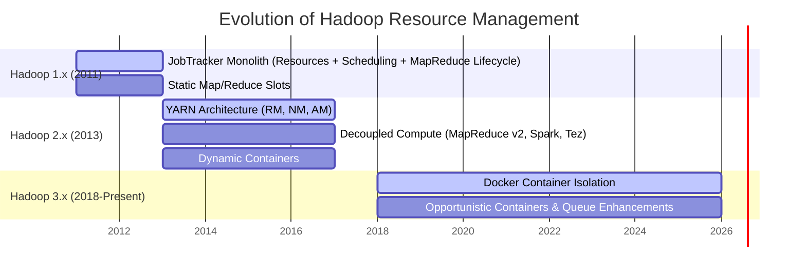
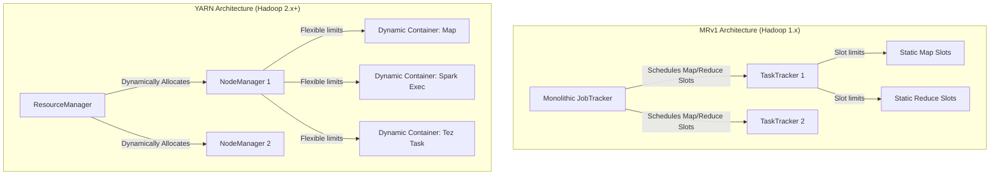
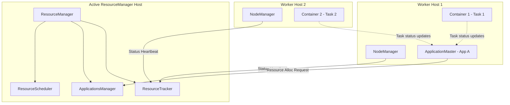
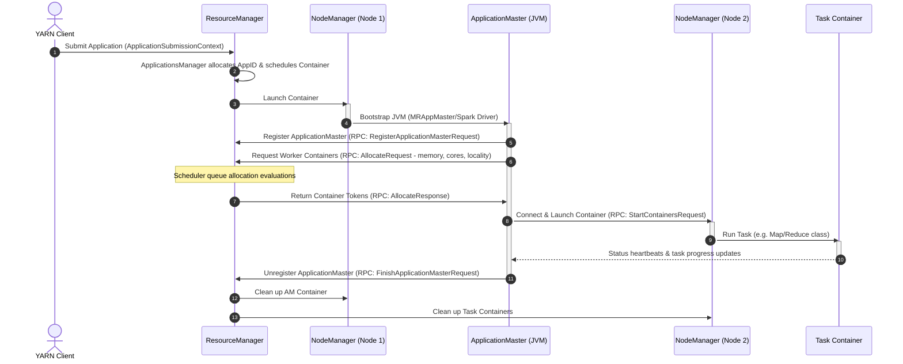
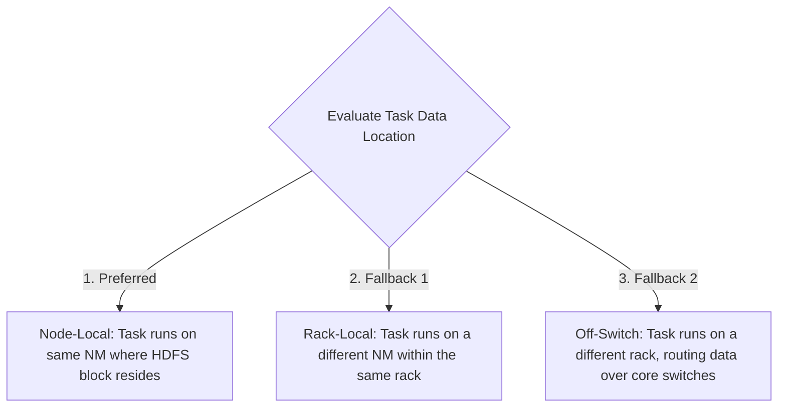
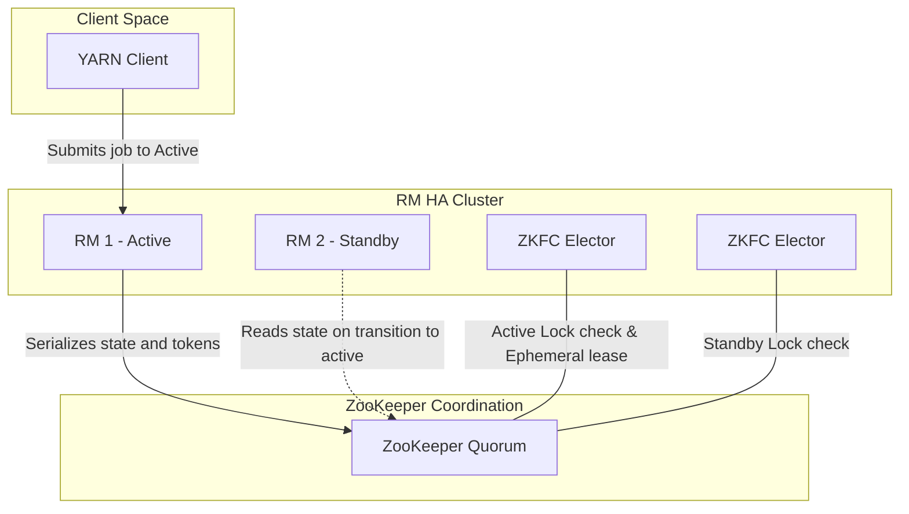
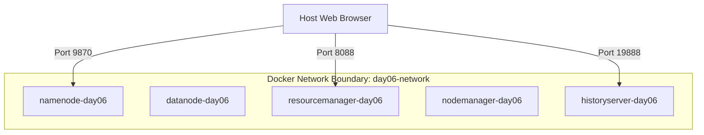
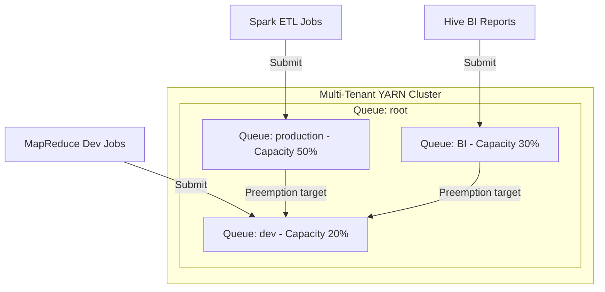

# Day 6: YARN Architecture (Yet Another Resource Negotiator)

Welcome to Day 6 of the **30 Days of Modern Hadoop Ecosystem** series. Today, we deep-dive into the control plane of modern distributed computing: **YARN (Yet Another Resource Negotiator)**. We will study YARN from first principles, tracing its evolution, component topology, internal RPC protocols, scheduling logic, security frameworks, and troubleshooting playbooks.

---

## 🏗️ Course Directory Structure
The files for this module are organized as follows:
* **[docker/docker-compose.yml](file:///d:/30_Days_of_Modern_Hadoop_Ecosystem/Day-06-YARN-Architecture/docker/docker-compose.yml)**: The multi-container local Hadoop YARN cluster configuration.
* **[docker/hadoop.env](file:///d:/30_Days_of_Modern_Hadoop_Ecosystem/Day-06-YARN-Architecture/docker/hadoop.env)**: System environment settings for cluster nodes.
* **[configs/yarn-site.xml](file:///d:/30_Days_of_Modern_Hadoop_Ecosystem/Day-06-YARN-Architecture/configs/yarn-site.xml)**: Production-ready XML configurations for scheduler queues, memory isolation, and heartbeats.
* **[configs/capacity-scheduler.xml](file:///d:/30_Days_of_Modern_Hadoop_Ecosystem/Day-06-YARN-Architecture/configs/capacity-scheduler.xml)**: Multi-tenant queue capacities and elasticity overrides.
* **[configs/mapred-site.xml](file:///d:/30_Days_of_Modern_Hadoop_Ecosystem/Day-06-YARN-Architecture/configs/mapred-site.xml)**: MapReduce parameters utilizing YARN.
* **[configs/core-site.xml](file:///d:/30_Days_of_Modern_Hadoop_Ecosystem/Day-06-YARN-Architecture/configs/core-site.xml)** & **[hdfs-site.xml](file:///d:/30_Days_of_Modern_Hadoop_Ecosystem/Day-06-YARN-Architecture/configs/hdfs-site.xml)**: Base file system configs.
* **[scripts/verify-rm.sh](file:///d:/30_Days_of_Modern_Hadoop_Ecosystem/Day-06-YARN-Architecture/scripts/verify-rm.sh)**: Diagnostics script for ResourceManager.
* **[scripts/verify-nm.sh](file:///d:/30_Days_of_Modern_Hadoop_Ecosystem/Day-06-YARN-Architecture/scripts/verify-nm.sh)**: Diagnostics script for NodeManager.
* **[scripts/verify-yarn.sh](file:///d:/30_Days_of_Modern_Hadoop_Ecosystem/Day-06-YARN-Architecture/scripts/verify-yarn.sh)**: CLI validation check.
* **[scripts/verify-containers.sh](file:///d:/30_Days_of_Modern_Hadoop_Ecosystem/Day-06-YARN-Architecture/scripts/verify-containers.sh)**: NodeManager REST container inspector.
* **[scripts/submit-sample-job.sh](file:///d:/30_Days_of_Modern_Hadoop_Ecosystem/Day-06-YARN-Architecture/scripts/submit-sample-job.sh)**: Auto-submits a MapReduce Pi job.
* **[labs/submit-yarn-application.md](file:///d:/30_Days_of_Modern_Hadoop_Ecosystem/Day-06-YARN-Architecture/labs/submit-yarn-application.md)**: Hands-on Lab guide.
* **[troubleshooting/troubleshooting-guide.md](file:///d:/30_Days_of_Modern_Hadoop_Ecosystem/Day-06-YARN-Architecture/troubleshooting/troubleshooting-guide.md)**: Production runbook for cluster outages.
* **[references/references-list.md](file:///d:/30_Days_of_Modern_Hadoop_Ecosystem/Day-06-YARN-Architecture/references/references-list.md)**: Curated deep reads and specs.

---

## SECTION 1 — INTRODUCTION

### The Evolution: MapReduce v1 to MapReduce v2 (YARN)
In Hadoop 1.x, the platform was tightly coupled to a single execution paradigm: MapReduce. Compute operations were managed by a monolithic coordinator called the **JobTracker**, and executed by **TaskTrackers** on worker nodes. As enterprise datasets scaled, this architecture hit a wall. In Hadoop 2.x, the community completely decoupled resource management from the processing engine, creating **YARN** (Yet Another Resource Negotiator) as a general-purpose, cluster-wide operating system.



### Separation of Storage and Compute
Decoupling storage (HDFS) and compute (YARN) allowed clusters to scale independently. NameNodes could focus entirely on metadata file mappings, while YARN ResourceManagers managed allocations across arbitrary runtimes. By serving as an generic middleware layer, YARN transformed Hadoop from a "MapReduce database" into a multi-engine analytics platform where Spark, Flink, Impala, Tez, and MapReduce share the same physical server hardware without interference.

---

## SECTION 2 — PROBLEM STATEMENT: LIMITATIONS OF HADOOP 1.x

Before YARN, the Hadoop 1.x execution model (MapReduce v1) suffered from structural limitations that restricted enterprise adoption:

### 1. Monolithic JobTracker Bottlenecks
The JobTracker was responsible for too many concerns:
* Managing cluster membership and processing TaskTracker heartbeats.
* Tracking available resource slots across the cluster.
* Formatting and submitting jobs, parsing input splits.
* Scheduling tasks on local nodes.
* Monitoring task execution, managing log outputs, and handling failures.
This monolithic structure caused JobTrackers to freeze or crash when clusters scaled past **4,000 nodes** or ran more than **40,000 concurrent tasks**.

### 2. Static Slot Allocation (Map/Reduce Slots)
TaskTrackers divided their resources into fixed pools of "Map Slots" and "Reduce Slots". 
* A Map task could only run in a Map slot.
* A Reduce task could only run in a Reduce slot.
This led to severe underutilization: a cluster could be completely idle with 0 map tasks running, but a reduce job would remain pending because all "Reduce Slots" were full, even though hundreds of "Map Slots" were sitting empty.



### 3. Single-Engine Platform Constraint
MRv1 was hardcoded to run only MapReduce. If a developer wanted to run a graphing algorithm (Giraph), an ad-hoc SQL engine (Impala), or a streaming engine (Spark Streaming), they had to build separate physical clusters. This led to massive data duplication, high cluster migration costs, and organizational silo overhead.

---

## SECTION 3 — YARN ARCHITECTURE DEEP DIVE

YARN introduces a master-slave control plane that separates resource allocation from execution tracking:



### 1. ResourceManager (RM)
The ResourceManager is the ultimate arbiter of all compute resources in the cluster. It contains two primary components:
* **ResourceScheduler (RS)**: A pure scheduler that allocates resources (Memory and CPU) to running applications based on configured queues, limits, and priorities. The Scheduler performs no job monitoring, state tracking, or restart operations; it simply assigns container leases.
* **ApplicationsManager (ASM)**: Responsible for accepting application submissions, negotiating the first container in the cluster to start the application-specific orchestrator (the **ApplicationMaster**), and managing the restart of the ApplicationMaster container on failure.
* **ResourceTracker (RT)**: The endpoint that handles NodeManager registration and processes periodic NodeManager heartbeats to maintain cluster capacity records.

### 2. NodeManager (NM)
The NodeManager is the agent running on each worker node. Its responsibilities include:
* Registering with the ResourceManager and reporting local memory, CPU, and disk capacity.
* Periodically sending status heartbeats (default every 1 second) to the ResourceManager.
* Launching and managing the lifecycle of **Containers** as requested by the ApplicationMaster.
* Monitoring container resource consumption (physical/virtual memory, CPU, disk) and terminating containers that exceed their leases.
* Handling log aggregation, sending logs to HDFS upon job completion.

### 3. ApplicationMaster (AM)
The ApplicationMaster is a framework-specific coordinator running inside Container #1 of an application. For example, a MapReduce job uses `MRAppMaster`, while Spark uses its own driver program. The AM's roles are:
* Registering itself with the ResourceManager's ApplicationsManager.
* Negotiating resource container allocations (Memory, CPU, Locality constraints) with the ResourceScheduler.
* Communicating with NodeManagers to launch allocated containers with specific command lines and local resources (JARs, archives).
* Monitoring task execution status, managing retries for failed tasks, and reporting job progress to the client.
* Unregistering with the ResourceManager upon application completion.

### 4. Containers
A YARN Container represents a logical collection of physical resources (e.g., 2GB RAM, 1 vCore) allocated on a specific NodeManager. 
* All application tasks (Mappers, Reducers, Spark Executors) run inside YARN containers.
* NodeManagers enforce container resource isolation using OS-level constructs, primarily **Linux Control Groups (CGroups)**.

---

## SECTION 4 — INTERNAL WORKING & LIFE OF AN APPLICATION

Understanding YARN requires tracing the lifecycle of an application from submission to completion:



### Phase 1: Application Submission Flow
1. The **YARN Client** requests a new Application ID from the ResourceManager.
2. The client uploads the application resources (JAR files, configs) to HDFS.
3. The client submits the job by sending an `ApplicationSubmissionContext` containing resource requirements for the ApplicationMaster.
4. The ResourceManager's **ApplicationsManager** accepts the submission, validates queue allocations, and schedules Container #1.
5. The ResourceManager issues a launch request to a selected **NodeManager** (e.g., Node 1).
6. Node 1 downloads the job assets from HDFS and spins up the **ApplicationMaster (AM)** JVM.

### Phase 2: Resource Negotiation
1. The AM registers with the ResourceManager via the `RegisterApplicationMasterRequest` RPC.
2. The AM evaluates the input splits (data blocks) and submits a series of resource requests (`AllocateRequest`) to the ResourceManager scheduler.
3. These requests specify:
   * **Resource Capability**: Required memory (MB) and vCores.
   * **Locality constraints**: Specific hostnames (Node-Local), racks (Rack-Local), or wildcard (`*` for Off-Switch).
   * **Priority**: Relative task execution priority.
4. The ResourceManager scheduler replies with an `AllocateResponse` containing container leases (tokens).

### Phase 3: Container Launch & Execution
1. The AM constructs a `ContainerLaunchContext` containing execution commands, environment variables, security tokens, and local resources.
2. The AM connects directly to the target **NodeManager** (e.g., Node 2) and calls `StartContainersRequest`.
3. Node 2's NodeManager localizes resources (downloads files to local disk), initializes directories, configures CGroups limits, and executes the task command.
4. The task container reports execution progress directly back to the AM.

### Phase 4: Teardown & Log Aggregation
1. Once all tasks complete, the AM sends a `FinishApplicationMasterRequest` to the ResourceManager.
2. The ResourceManager releases all container leases.
3. The NodeManagers terminate any remaining container processes and aggregate task container logs from local disks, uploading them to HDFS (`/var/log/hadoop-yarn/apps`) for centralized access.

---

## SECTION 5 — CORE CONCEPTS

Operating and configuring YARN requires understanding its core operational mechanisms:

### Resource Negotiation & The Dominant Resource Calculator (DRC)
By default, YARN schedules resources based only on Memory. If a task asks for 1GB RAM and 4 Cores, YARN only tracks the 1GB RAM against cluster limits. This can cause CPU starvation.
To solve this, production clusters enable the **Dominant Resource Calculator (DRC)**.
The DRC implements **Dominant Resource Fairness (DRF)**, evaluating allocation ratios across multiple resource types (Memory, CPU, GPU). If a cluster has 100GB RAM and 100 Cores, and Application A requests (10GB RAM, 1 Core) while Application B requests (1GB RAM, 10 Cores):
* Application A's dominant resource is Memory (10% of total cluster RAM vs 1% CPU).
* Application B's dominant resource is CPU (10% of total cluster CPU vs 1% RAM).
The DRC balances allocations by comparing these dominant percentages, preventing CPU-heavy tasks from starving memory-heavy ones.

### Locality Optimization
To minimize network congestion, YARN uses a "delay scheduling" algorithm to schedule tasks as close to the data as possible. Locality preferences are evaluated in three tiers:



If a node-local container is unavailable, YARN waits a brief period (e.g., 3000ms, configured via `yarn.scheduler.capacity.node-locality-delay-limit-nodes`) before falling back to rack-local or off-switch allocations.

### Heartbeats and Node Health Checks
YARN uses periodic heartbeats to maintain cluster state:
* **NodeManager to ResourceManager** (default `1000ms`): Reports running container status, CPU/RAM usage, and disk health. If no heartbeat is received within 10 minutes (`yarn.resourcemanager.nm.liveness-monitor.expiry-interval-ms`), the ResourceManager marks the node as `LOST` and schedules task restarts elsewhere.
* **ApplicationMaster to ResourceManager**: Keeps the application session alive and exchanges resource requests/allocations.

---

## SECTION 6 — PRODUCTION ENGINEERING & BEST PRACTICES

Operating YARN in enterprise environments requires careful tuning of scheduler queues, isolation policies, and High Availability.

### Capacity Scheduler vs. Fair Scheduler
YARN provides two primary production scheduling frameworks:

| Feature | Capacity Scheduler | Fair Scheduler |
| :--- | :--- | :--- |
| **Primary Goal** | Guaranteed resource allocation for organizations (queues) with maximum utilization of idle slots. | Equal resource sharing among active users/applications over time. |
| **Sizing Model** | Strict percentages allocated to hierarchical queues (e.g., Production gets 70%, Sandbox gets 30%). | Dynamic allocation calculation; share ratios adjust based on active app counts. |
| **Elasticity** | High. Queues can grow up to `maximum-capacity` if other queues are idle. | High. Unused resources are instantly shared among running jobs. |
| **Preemption** | Supported (Proportional Capacity Preemption Policy). | Supported (Fair Share Preemption). |

*Note: In Apache Hadoop 3.x, the Fair Scheduler is deprecated. The **Capacity Scheduler** is the standard, supporting both capacity-based allocation and fair-share allocation inside individual queues.*

### Queue Configuration Example
Our [capacity-scheduler.xml](file:///d:/30_Days_of_Modern_Hadoop_Ecosystem/Day-06-YARN-Architecture/configs/capacity-scheduler.xml) defines a hierarchical queue topology:
* `root.production`: Allocated **50%** of the cluster resources, allowed to expand to **100%** if the cluster is idle.
* `root.default`: Allocated **30%** of cluster resources, capped at **50%**.
* `root.sandbox`: Allocated **20%** of cluster resources, capped at **40%**.

### Resource Isolation (CGroups)
Without CGroups, a single Java task could spawn runaway threads or leak native memory, crashing the host NodeManager. Enabling Linux CGroups in `yarn-site.xml` guarantees resource isolation:
```xml
<property>
    <name>yarn.nodemanager.container-executor.class</name>
    <value>org.apache.hadoop.yarn.server.nodemanager.LinuxContainerExecutor</value>
</property>
<property>
    <name>yarn.nodemanager.linux-container-executor.group</name>
    <value>yarn</value>
</property>
<property>
    <name>yarn.nodemanager.linux-container-executor.resources-handler.class</name>
    <value>org.apache.hadoop.yarn.server.nodemanager.util.CgroupsLCEResourcesHandler</value>
</property>
```

### ResourceManager High Availability (HA)
To prevent the ResourceManager from being a Single Point of Failure (SPOF), production deployments use an Active/Standby pair.



* **ZKFC (ZooKeeper Failover Controller)**: An elector thread running inside the ResourceManager process that maintains an ephemeral lock in ZooKeeper (`/hadoop-ha/rm-store`).
* **Active RM**: Holds the lock and services client submissions.
* **Standby RM**: Monitors the ZooKeeper lock. If the Active RM loses its heartbeat or crashes, its ephemeral node in ZooKeeper expires. The Standby's ZKFC detects this, acquires the lock, and promotes its ResourceManager to Active.
* **ZKRMStateStore**: The Active RM serializes application metadata, delegation tokens, and security keys to ZooKeeper. When a failover occurs, the new Active RM reads this state from ZooKeeper and resumes processing without interrupting running jobs.

---

## SECTION 7 — HANDS-ON LAB: SUBMIT AND MONITOR A YARN APPLICATION

For a step-by-step walkthrough, see **[labs/submit-yarn-application.md](file:///d:/30_Days_of_Modern_Hadoop_Ecosystem/Day-06-YARN-Architecture/labs/submit-yarn-application.md)**.

### Running the Lab
1. **Spin up the cluster**:
   ```bash
   cd Day-06-YARN-Architecture/docker
   docker compose up -d
   ```
2. **Verify Cluster Health**:
   ```bash
   bash ../scripts/verify-rm.sh
   ```
3. **Submit the MapReduce Pi Calculation**:
   ```bash
   bash ../scripts/submit-sample-job.sh
   ```
   *Console Output:*
   ```text
   Submitting MapReduce Pi job (5 maps, 10 samples per map) to YARN...
   Number of Maps  = 5
   Samples per Map = 10
   Wrote input for Map #0
   Wrote input for Map #1
   ...
   Job Finished in 24.31 seconds
   Estimated value of Pi is 3.20000000000000000000
   [SUCCESS] MapReduce Job submitted and executed successfully!
   ```

---

## SECTION 8 — BUILD FROM SOURCE

Compiling Apache Hadoop YARN from source is necessary to apply custom patches or build native libraries.

### Apache Hadoop Source Structure
The Hadoop codebase is structured as a Maven multi-module project:
* `hadoop-yarn-project/`: Root directory for all YARN code.
  * `hadoop-yarn/hadoop-yarn-api/`: Interfaces and Protobuf schemas (`.proto`) defining client, RM, and NM IPC interfaces.
  * `hadoop-yarn/hadoop-yarn-common/`: Base utilities, event-handling frameworks, and client libraries.
  * `hadoop-yarn/hadoop-yarn-server/hadoop-yarn-server-resourcemanager/`: ResourceManager core scheduling, queue tracking, and HA electors.
  * `hadoop-yarn/hadoop-yarn-server/hadoop-yarn-server-nodemanager/`: NodeManager lifecycle, container monitoring, and log aggregation code.

### Compilation Workflow
To compile YARN with native libraries (like native ISA-L compression and container executors):

1. **Install Prerequisites**:
   * Java Development Kit (JDK 8 or 11 depending on version)
   * Apache Maven (3.6.0+)
   * Protocol Buffers compiler (protoc v2.5.0 or 3.7.1 depending on version)
   * CMake, GCC, and zlib headers (for native libraries)

2. **Run Maven Compilation Command**:
   ```bash
   mvn clean package -Pdist,native -DskipTests -Dtar
   ```
   * `-Pdist,native`: Activates profiles to build native C/C++ libraries and package the output as a tarball.
   * `-DskipTests`: Skips running unit tests to speed up compilation.

3. **Locate Compiled Tarball**:
   The output tarball will be generated under:
   `hadoop-dist/target/hadoop-3.X.X.tar.gz`

### Debugging ResourceManager Core
To debug the ResourceManager process, pass Java Debug Wire Protocol (JDWP) flags to suspend the JVM on startup and wait for a debugger connection:
```bash
export YARN_RESOURCEMANAGER_OPTS="-agentlib:jdwp=transport=dt_socket,server=y,suspend=y,address=5005"
yarn --daemon start resourcemanager
```

---

## SECTION 9 — DOCKER DEPLOYMENT

The local cluster environment is configured using Docker Compose.



* **Network**: The cluster runs on a custom bridge network `day06-network` to allow internal container hostname resolution (e.g. `resourcemanager:8032`).
* **Storage Mounts**: Named volumes are used to persist NameNode metadata (`namenode_data_day06`), DataNode blocks (`datanode_data_day06`), and JobHistory timelines (`historyserver_data_day06`).
* **Validation**:
  To verify container startup, run:
  ```bash
  docker compose -f docker/docker-compose.yml ps
  ```

---

## SECTION 10 — LOCAL CLUSTER DEPLOYMENT

For production environments, sizing and configuration depend on hardware capabilities:

### Hardware Sizing Guidelines
* **Master Nodes (ResourceManager, NameNode)**: Typically require high-frequency multi-core CPUs and fast memory to manage active cluster states and queue operations.
* **Worker Nodes (NodeManager, DataNode)**: Require high core counts and high memory capacities to run task containers.

### Resource Calculations Example
Suppose a worker node has **64GB RAM** and **16 CPU Cores**. We reserve 8GB RAM and 2 Cores for OS, system agents, and HDFS DataNode, leaving 56GB RAM and 14 Cores for YARN containers.
We configure these allocations in `yarn-site.xml`:
```xml
<property>
    <name>yarn.nodemanager.resource.memory-mb</name>
    <value>57344</value> <!-- 56 GB -->
</property>
<property>
    <name>yarn.nodemanager.resource.cpu-vcores</name>
    <value>14</value>
</property>
```

---

## SECTION 11 — VALIDATION

The validation scripts under `scripts/` automate cluster verification:

### 1. `verify-rm.sh`
* **Checks**: Verifies the `resourcemanager-day06` container state, confirms ports `8088` and `8032` are open, and queries `/ws/v1/cluster/metrics` to count active NodeManagers.
* **Exit Codes**: `0` = Healthy, `1` = Service Down, `2` = No registered nodes.

### 2. `verify-nm.sh`
* **Checks**: Verifies the `nodemanager-day06` container, confirms port `8042` is open, and queries `/ws/v1/node/info` to check memory allocations and node health status.

### 3. `verify-yarn.sh`
* **Checks**: Connects to the ResourceManager container and executes the YARN CLI tools `yarn node -list -all` and `yarn queue -status default`.

### 4. `verify-containers.sh`
* **Checks**: Displays active applications and queries the NodeManager's container list via the `/ws/v1/node/containers` REST endpoint.

---

## SECTION 12 — PRODUCTION TROUBLESHOOTING PLAYBOOK

Detailed troubleshooting steps are defined in **[troubleshooting/troubleshooting-guide.md](file:///d:/30_Days_of_Modern_Hadoop_Ecosystem/Day-06-YARN-Architecture/troubleshooting/troubleshooting-guide.md)**.

### Common Outages & Remediation Summary
* **ResourceManager Down**: Clear orphaned active locks in ZooKeeper and restart the ResourceManager daemon.
* **NodeManager Timeout**: Check for long JVM garbage collection pauses on the node, check network connection on port 8031, and restart the NodeManager.
* **Container Exit Code 137 (OOM)**: Container exceeded physical memory limits. Adjust Heap ratio (`-Xmx` should be $\le 80\%$ of container limit) or increase `mapreduce.map.memory.mb`.
* **Container Exit Code 143 (VMEM)**: Container exceeded virtual memory limits. Disable virtual memory checks in `yarn-site.xml`.

---

## SECTION 13 — REAL-WORLD CASE STUDY

### Multi-Tenant Hadoop Platform for Enterprise Analytics
Consider an enterprise Hadoop platform shared by three departments with different processing requirements:



1. **Production ETL (Department 1)**: Runs long-running Spark ETL jobs. Requires high resource guarantees and predictable execution.
2. **BI Reporting (Department 2)**: Runs interactive Hive-on-Tez SQL queries. Requires fast response times and low scheduling latency.
3. **Data Science Sandbox (Department 3)**: Runs ad-hoc Python/Spark machine learning tests. High query volumes with low predictability.

### Solution Design
* We configure a hierarchical queue structure under `root`: `root.production` (50% capacity), `root.bi` (30%), and `root.dev` (20%).
* We enable **Proportional Capacity Preemption**. If a high-priority production ETL job is submitted and the cluster is full, the scheduler can preempt (forcefully terminate) containers running in `root.dev` to reclaim resources, rather than waiting for dev tasks to finish.
* We configure different **User Limit Factors** to prevent a single user in the developer queue from consuming all the resources allocated to that queue.

---

## SECTION 14 — INTERVIEW QUESTIONS & ANSWERS

### Beginner Level (1-20)

#### Q1: What does YARN stand for?
**A**: YARN stands for **Yet Another Resource Negotiator**.

#### Q2: What was the primary limitation of Hadoop 1.x architectures?
**A**: Hadoop 1.x tightly coupled resource management and processing in a monolithic controller called the JobTracker, creating a major scalability bottleneck.

#### Q3: Which two daemons replaced the JobTracker in YARN?
**A**: The ResourceManager (handling resource scheduling) and the ApplicationMaster (handling task lifecycle management).

#### Q4: What is the primary role of the YARN ResourceManager?
**A**: The ResourceManager is the cluster-wide master that manages resource allocation across applications and monitors active NodeManagers.

#### Q5: What is a YARN container?
**A**: A logical unit of physical resources (memory, CPU, disk, network) allocated by the ResourceManager on a specific worker node.

#### Q6: What is the role of the NodeManager?
**A**: The NodeManager is a node-level daemon that registers with the ResourceManager, monitors local node resources, launches containers, and reports node health.

#### Q7: What is the ApplicationMaster?
**A**: A framework-specific orchestrator running in Container #1 of an application that requests worker containers from the ResourceManager and manages task execution.

#### Q8: Where does the ApplicationMaster run?
**A**: It runs inside a standard YARN container on a worker node, rather than on the master node.

#### Q9: How do NodeManagers enforce memory limits on containers?
**A**: By monitoring process memory usage on local disks, or by using Linux Control Groups (CGroups) to enforce hard resource limits at the OS level.

#### Q10: What is the dominant scheduling framework in YARN?
**A**: The **Capacity Scheduler** is the default scheduler in modern Hadoop distributions.

#### Q11: What is data locality in YARN?
**A**: The practice of scheduling compute tasks on the physical node (Node-Local) or rack (Rack-Local) where the target HDFS data blocks are stored.

#### Q12: How often do NodeManagers send heartbeats to the ResourceManager?
**A**: Typically every **1000 milliseconds** (1 second).

#### Q13: What happens if a NodeManager stops sending heartbeats?
**A**: If no heartbeat is received within the timeout limit (default 10 minutes), the ResourceManager marks the node as `LOST` and reschedules its running tasks on other nodes.

#### Q14: Which XML config file controls YARN parameters?
**A**: `yarn-site.xml`.

#### Q15: Which XML config file controls queue capacities?
**A**: `capacity-scheduler.xml`.

#### Q16: What is the purpose of the JobHistoryServer?
**A**: The JobHistoryServer archives application logs, counters, and execution histories so they can be viewed after the ApplicationMaster container is terminated.

#### Q17: What does the term "JVM preemption" mean in YARN?
**A**: The reclamation of resource allocations from lower-priority applications to satisfy requests from higher-priority queues.

#### Q18: What port is the default YARN ResourceManager Web UI?
**A**: Port **8088**.

#### Q19: What port is the default NodeManager Web UI?
**A**: Port **8042**.

#### Q20: What command checks the status of YARN nodes?
**A**: `yarn node -list -all`.

---

### Intermediate Level (21-40)

#### Q21: Explain the difference between ApplicationsManager (ASM) and ResourceManager Scheduler.
**A**: The ASM handles job submission validation, boots up the ApplicationMaster container, and manages AM restarts. The Scheduler is focused purely on allocating resources (Memory/CPU) based on queue capacities and limits, without tracking task execution states.

#### Q22: What is the Dominant Resource Calculator (DRC) and why is it used?
**A**: The DRC evaluates multiple resource types (Memory, CPU, GPU) for allocation scheduling using Dominant Resource Fairness (DRF), preventing CPU-heavy tasks from starving memory-heavy ones when only memory is tracked.

#### Q23: How does YARN manage dynamic resource allocation compared to MapReduce v1?
**A**: MapReduce v1 used fixed, static slots (Map/Reduce slots) that could not be shared. YARN dynamically allocates memory and CPU resources in flexible units (Containers), allowing different types of tasks to utilize the same resources.

#### Q24: What is the ResourceManager State Store?
**A**: A persistent storage backend (usually ZooKeeper or HDFS) where the Active ResourceManager saves application states, credentials, and tokens to enable recovery after a failover.

#### Q25: Explain how YARN High Availability works.
**A**: Active and Standby ResourceManagers run simultaneously. ZKFC (ZooKeeper Failover Controller) threads monitor active status using ephemeral locks in ZooKeeper. If the Active RM fails, the Standby RM detects the lock loss, promotes itself to Active, and restores the cluster state from the RMStateStore.

#### Q26: What is the role of the LinuxContainerExecutor?
**A**: The LinuxContainerExecutor runs containers under the Unix user account that submitted the job (rather than the `yarn` system user) and uses Linux CGroups to enforce hard memory and CPU limits.

#### Q27: How does YARN prevent virtual memory allocation failures in Docker containers?
**A**: Linux systems allocate virtual memory aggressively (e.g. via glibc malloc). If virtual memory checks are enabled, NodeManagers will terminate containers that exceed their virtual-to-physical memory ratio, even if physical memory usage is low. Disabling this check (`yarn.nodemanager.vmem-check-enabled=false`) avoids these issues in containerized environments.

#### Q28: How does YARN implement log aggregation?
**A**: While a job is running, containers write logs to the local disk of their worker node. When the application completes, the NodeManager daemon collects these logs, packages them into TFile formats, and uploads them to a central HDFS path (e.g., `/var/log/hadoop-yarn/apps`).

#### Q29: What is the purpose of Node Labels in YARN?
**A**: Node Labels allow you to tag worker nodes based on hardware capabilities (e.g., `GPU` for machine learning, `SSD` for high-throughput disk I/O) and configure queues to run only on nodes with matching labels.

#### Q30: What parameter sets the minimum memory allocation size for a container?
**A**: `yarn.scheduler.minimum-allocation-mb`.

#### Q31: What happens when a container process exits with code 137?
**A**: Exit code 137 indicates the container process was terminated by the OS Out-of-Memory (OOM) killer because it exceeded its allocated physical memory limits.

#### Q32: Explain the concept of preemption in the Capacity Scheduler.
**A**: If Queue A is configured for 30% capacity and is currently using 80% because the cluster was idle, and Queue B (configured for 70%) submits a job, the scheduler will trigger preemption to reclaim resources from Queue A and allocate them to Queue B.

#### Q33: How does delay scheduling optimize data locality?
**A**: If a node-local container is not immediately available, the scheduler waits for a configured number of scheduling opportunities (or a brief timeout) before falling back to rack-local or off-switch allocations, maximizing the chances of achieving data-local execution.

#### Q34: What is the role of ZooKeeper Failover Controller (ZKFC) in YARN?
**A**: ZKFC is an elector thread inside the ResourceManager that monitors the health of the local RM and participates in a ZooKeeper election to acquire the active lock.

#### Q35: What is the difference between client-mode and cluster-mode in Spark on YARN?
**A**: In `yarn-client` mode, the Spark Driver (which acts as the ApplicationMaster) runs on the client machine submitting the job. In `yarn-cluster` mode, the Spark Driver runs inside Container #1 on a NodeManager worker node in the cluster.

#### Q36: How does the NodeStatusUpdater work?
**A**: It is a NodeManager component that communicates node health metrics, active container statuses, and local disk usage back to the ResourceManager during heartbeat intervals.

#### Q37: What is the default port for the JobHistoryServer Web UI?
**A**: Port **19888**.

#### Q38: How can you check the logs of a running YARN application?
**A**: If the job is active, you must read the container logs directly from the NodeManager host at `/var/log/hadoop-yarn/containers`. Once the application completes and log aggregation runs, you can access logs via:
`yarn logs -applicationId <appId>`

#### Q39: What is the default liveness monitor expiry timeout for YARN NodeManagers?
**A**: 600,000 milliseconds (10 minutes).

#### Q40: What is the purpose of the `yarn.nodemanager.local-dirs` property?
**A**: It defines a comma-separated list of local disk directories where the NodeManager writes temporary task data and localizes jar files during container execution.

---

### Advanced Level (41-60)

#### Q41: Explain how the ResourceManager handles failover without interrupting running containers.
**A**: When a Standby ResourceManager transitions to Active, it reads the application metadata from the ZKRMStateStore. The new Active RM does not restart running containers; instead, it waits for the next NodeManager heartbeats, registers the container status reported by the NMs, and updates its scheduling state.

#### Q42: Deep dive into the container localization process.
**A**: Before launching a container, the NodeManager downloads required files (jars, configuration files, archives) from HDFS to local disk. These resources are categorized by visibility scope: `PUBLIC` (cached for all users), `PRIVATE` (cached only for the submitting user), or `APPLICATION` (cached only for this application instance).

#### Q43: How does YARN implement security for container execution?
**A**: YARN secures IPC and container execution using Kerberos authentication and Delegation Tokens. The ResourceManager issues a container token to the ApplicationMaster, which must present the token to the NodeManager to authenticate container start requests.

#### Q44: What are Opportunistic Containers?
**A**: Introduced in Hadoop 3.0, opportunistic containers run with lower priority than standard (guaranteed) containers. They can be dispatched to NodeManagers even if the ResourceManager scheduler is fully allocated. If guaranteed containers require those resources, opportunistic containers are killed or paused.

#### Q45: How do you configure and optimize the JVM Garbage Collection for a ResourceManager?
**A**: For large clusters, use the G1 garbage collector with configured pause targets:
`export YARN_RESOURCEMANAGER_OPTS="-XX:+UseG1GC -XX:MaxGCPauseMillis=200 -XX:InitiatingHeapOccupancyPercent=45 -Xms8g -Xmx8g"`
This reduces stop-the-world pauses that could cause ZooKeeper lease expiries and trigger accidental failovers.

#### Q46: How does the Dominant Resource Calculator solve resource request allocations for multi-tenant workloads?
**A**: The DRC calculates the dominant resource ratio (Memory, CPU, GPU) for each user request relative to total cluster capacity. The scheduler then balances allocations based on these dominant resource metrics to ensure fair share distribution across queues.

#### Q47: Why is it crucial to keep the `vmem-pmem-ratio` parameter tuned when utilizing virtual memory checks?
**A**: The `vmem-pmem-ratio` determines how much virtual memory a container can allocate relative to its physical memory limit (default 2.1). If java processes allocate large, unused virtual memory areas (e.g. during thread allocation), they will exceed this ratio and be terminated if virtual memory checks are enabled.

#### Q48: Explain the security model of the LinuxContainerExecutor.
**A**: The LinuxContainerExecutor uses a setuid executable (`container-executor`) owned by `root`. It initializes container directories, assigns user permissions, launches processes under the submitter's Unix account, and mounts CGroups paths.

#### Q49: What is the YARN Timeline Server?
**A**: The YARN Timeline Server stores and retrieves application execution history, lifecycle metrics, and performance data, providing an API to monitor application runs after completion.

#### Q50: How do you enable queue preemption in YARN?
**A**: In `yarn-site.xml`, enable the monitor monitor policy:
`yarn.resourcemanager.scheduler.monitor.enable=true`
and specify the default monitoring class:
`yarn.resourcemanager.scheduler.monitor.policies=org.apache.hadoop.yarn.server.resourcemanager.monitor.capacity.ProportionalCapacityPreemptionPolicy`

#### Q51: How does the Capacity Scheduler allocate resources within a queue hierarchy?
**A**: When a heartbeat is received, the scheduler traverses the queue tree from the root, sorting child queues based on resource utilization relative to configured capacity. It navigates down the tree to the leaf queue that is furthest below its allocation, selects the highest-priority application, and assigns the container resource.

#### Q52: What is the consequence of setting `yarn.scheduler.capacity.resource-calculator` to DefaultResourceCalculator?
**A**: The scheduler only evaluates memory requests when making scheduling decisions, ignoring CPU core requirements and potentially leading to CPU starvation.

#### Q53: Explain how YARN handles NodeManager disk failure.
**A**: The NodeManager periodically checks its local directories. If the number of healthy disks falls below the configured threshold (`yarn.nodemanager.disk-health-checker.min-healthy-disks`), the NM reports the disk failure to the ResourceManager in its next heartbeat, and the RM marks the node as `UNHEALTHY` to stop new container scheduling.

#### Q54: What are the key configuration files required to build a native container executor?
**A**: The C binary `container-executor` must be built from source and configured via `container-executor.cfg`. This file must be owned by `root`, have strict read-only permissions (`0400`), and reside in `/etc/` or a secure local path.

#### Q55: How does YARN manage dynamic queue configuration changes without restarting the ResourceManager?
**A**: Queue properties (capacities, user limits, state toggles) can be reloaded dynamically by updating `capacity-scheduler.xml` and running:
`yarn rmadmin -refreshQueues`

#### Q56: What are the parameters for configuring resource limits on individual queues?
**A**: `yarn.scheduler.capacity.<queue-path>.capacity` sets the base resource guarantee, and `yarn.scheduler.capacity.<queue-path>.maximum-capacity` configures the upper limit for elastic expansion.

#### Q57: How does YARN integrate with Docker?
**A**: YARN supports launching containers inside Docker images via the `DockerLinuxContainerExecutor`. The NodeManager maps HDFS resources into the container filesystem and runs the execution command inside the specified Docker image.

#### Q58: What is the role of the `RMApp` state machine?
**A**: It is an internal state machine in the ResourceManager that tracks the lifecycle of an application (from `NEW`, `SUBMITTED`, `ACCEPTED`, `RUNNING`, to `FINISHED`/`FAILED`/`KILLED`).

#### Q59: How do you identify performance bottlenecks in the ResourceManager scheduler?
**A**: Monitor JMX metrics under `Hadoop:service=ResourceManager,name=QueueMetrics` and analyze GC log timings to identify scheduling delays or CPU bottlenecks.

#### Q60: Explain the purpose of delegation tokens in YARN.
**A**: Delegation tokens allow containers running on worker nodes to authenticate with other cluster services (such as HDFS or HMS) on behalf of the user who submitted the job, without requiring keytab files to be distributed to worker hosts.

---

## SECTION 15 — KEY TAKEAWAYS

* **Decoupling storage and compute**: Decoupling compute resource management from the MapReduce execution engine transformed Hadoop into a general-purpose, multi-engine distributed computing platform.
* **Master-Slave Control Plane**: YARN separates resource arbitration (ResourceManager) from container management (NodeManager) and task monitoring (ApplicationMaster).
* **DRC for multi-tenancy**: Enabling the Dominant Resource Calculator (DRC) and configuring capacity queues prevents resource starvation in shared clusters.
* **Cgroup Isolation**: Production clusters must use Linux Control Groups (CGroups) to enforce hard container boundaries and prevent memory starvation.
* **Active/Standby HA**: Setting up ResourceManager HA with ZooKeeper electors and state stores ensures automated recovery and continuous operations.

---

## SECTION 16 — REFERENCES

1. **Vavilapalli, V. K., et al.** *Apache Hadoop YARN: Yet Another Resource Negotiator.* SoCC '13. [ACM Digital Library](https://dl.acm.org/doi/10.1145/2537816.2537821)
2. **Apache Hadoop YARN Documentation**: [Hadoop YARN Architecture](https://hadoop.apache.org/docs/stable/hadoop-project-dist/hadoop-yarn/hadoop-yarn-site/YARN.html)
3. **YARN capacity Scheduler Configuration Guide**: [Capacity Scheduler Guide](https://hadoop.apache.org/docs/stable/hadoop-project-dist/hadoop-yarn/hadoop-yarn-site/CapacityScheduler.html)
4. **Hadoop MapReduce next Generation JIRA Spec**: [JIRA MAPREDUCE-279](https://issues.apache.org/jira/browse/MAPREDUCE-279)
