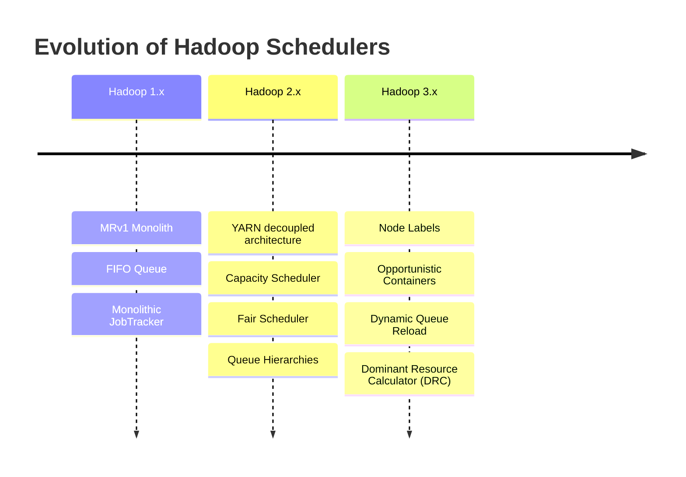
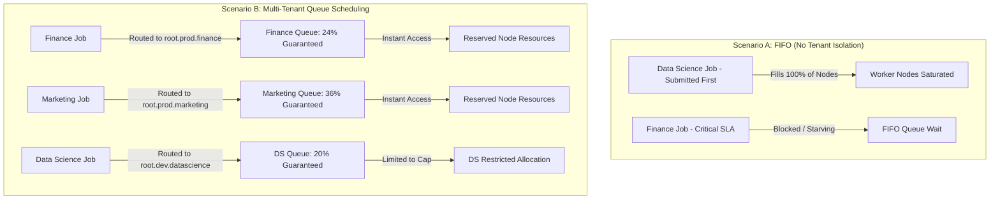
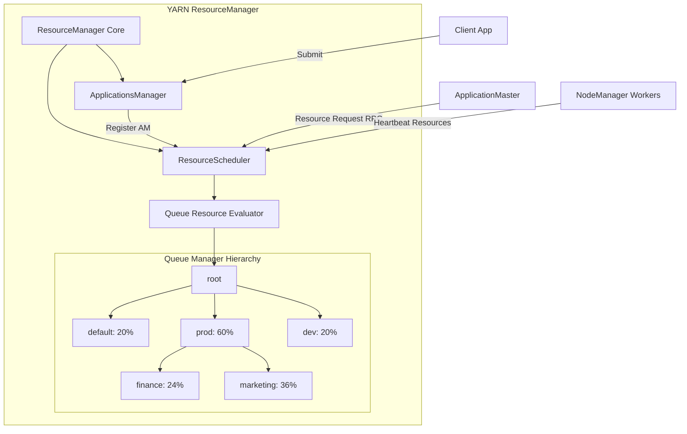
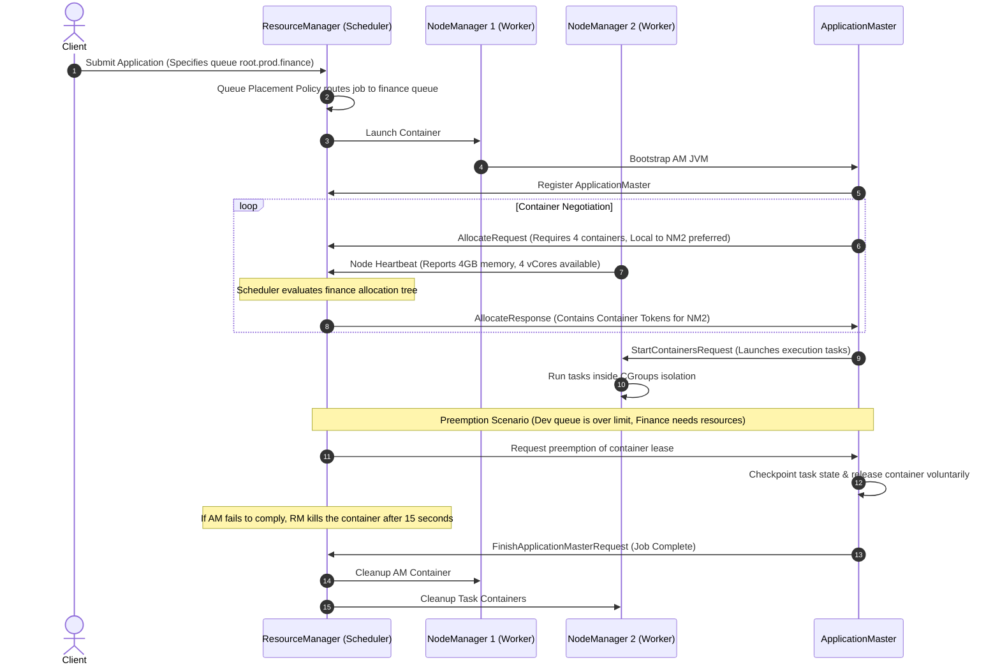
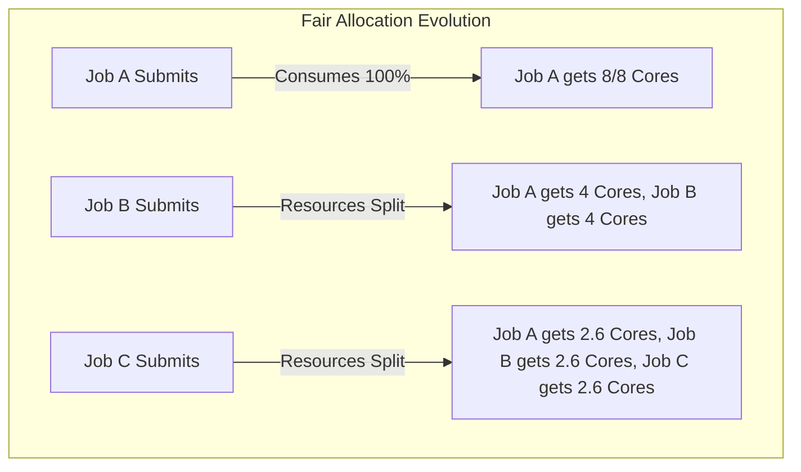
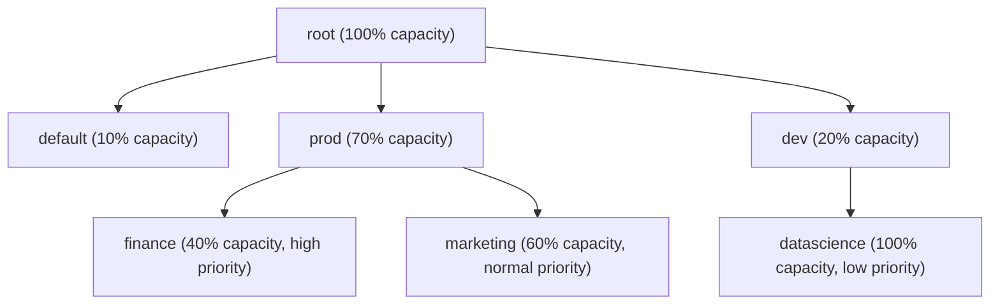
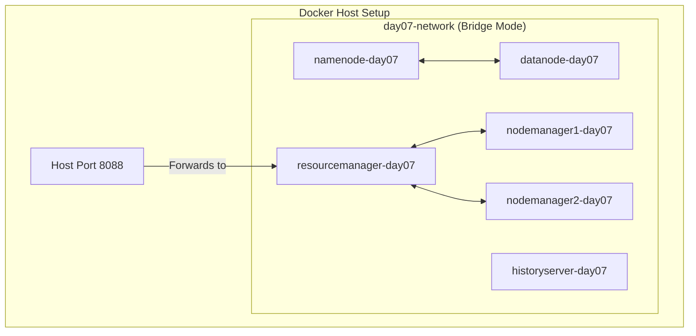
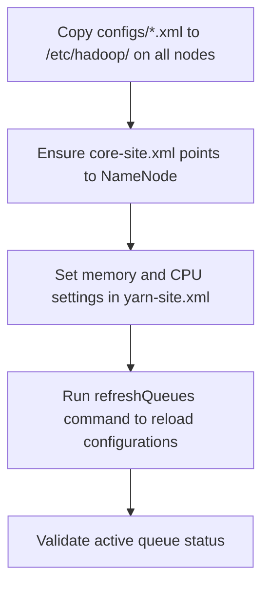
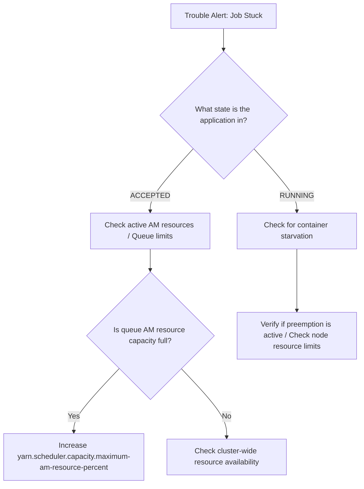
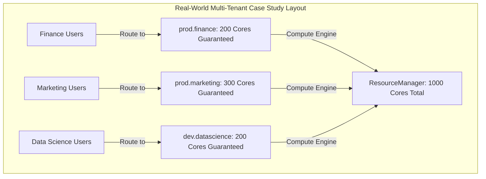

# Day 7: YARN Scheduling Policies & Multi-Tenancy Management

Welcome to Day 7 of the **30 Days of Modern Hadoop Ecosystem** series. Today, we focus on YARN Resource Scheduling and Multi-Tenancy. In a large-scale enterprise, a Hadoop cluster is rarely used by a single person or a single team. Instead, it is a shared infrastructure utilized by Finance, Marketing, Data Science, Data Engineering, and operations groups. Managing these competing workloads requires a robust resource allocation and scheduling framework.

This module covers the scheduling engines of Apache Hadoop YARN: **Capacity Scheduler** and **Fair Scheduler**. We will study their design, internal algorithms, preemption behaviors, node labeling systems, and troubleshooting practices.

---

## 🏗️ Course Directory Structure

All files for this module are organized as follows:
* **[configs/yarn-site.xml](file:///d:/30_Days_of_Modern_Hadoop_Ecosystem/Day-07-YARN-Scheduling/configs/yarn-site.xml)**: Core configurations enabling resource preemption, DRC, node label settings, and scheduler selection.
* **[configs/capacity-scheduler.xml](file:///d:/30_Days_of_Modern_Hadoop_Ecosystem/Day-07-YARN-Scheduling/configs/capacity-scheduler.xml)**: Production capacity queue setup defining a nested hierarchical structure for multi-tenant isolation.
* **[configs/fair-scheduler.xml](file:///d:/30_Days_of_Modern_Hadoop_Ecosystem/Day-07-YARN-Scheduling/configs/fair-scheduler.xml)**: Side-by-side comparative allocation rules showing FairScheduler weight configurations.
* **[configs/core-site.xml](file:///d:/30_Days_of_Modern_Hadoop_Ecosystem/Day-07-YARN-Scheduling/configs/core-site.xml)**, **[hdfs-site.xml](file:///d:/30_Days_of_Modern_Hadoop_Ecosystem/Day-07-YARN-Scheduling/configs/hdfs-site.xml)** & **[mapred-site.xml](file:///d:/30_Days_of_Modern_Hadoop_Ecosystem/Day-07-YARN-Scheduling/configs/mapred-site.xml)**: Standard support configurations.
* **[docker/docker-compose.yml](file:///d:/30_Days_of_Modern_Hadoop_Ecosystem/Day-07-YARN-Scheduling/docker/docker-compose.yml)**: The multi-node local cluster configuration composed of a NameNode, DataNode, ResourceManager, and two independent NodeManagers to demonstrate multi-node scheduling mechanics.
* **[docker/hadoop.env](file:///d:/30_Days_of_Modern_Hadoop_Ecosystem/Day-07-YARN-Scheduling/docker/hadoop.env)**: Environment environment variables.
* **[scripts/verify-capacity-scheduler.sh](file:///d:/30_Days_of_Modern_Hadoop_Ecosystem/Day-07-YARN-Scheduling/scripts/verify-capacity-scheduler.sh)**: Diagnostics checking if CapacityScheduler properties are active.
* **[scripts/verify-fair-scheduler.sh](file:///d:/30_Days_of_Modern_Hadoop_Ecosystem/Day-07-YARN-Scheduling/scripts/verify-fair-scheduler.sh)**: Validation checking for FairScheduler configuration structures.
* **[scripts/verify-queues.sh](file:///d:/30_Days_of_Modern_Hadoop_Ecosystem/Day-07-YARN-Scheduling/scripts/verify-queues.sh)**: CLI/API tree formatting representing real-time queue resource usage.
* **[scripts/verify-resource-allocation.sh](file:///d:/30_Days_of_Modern_Hadoop_Ecosystem/Day-07-YARN-Scheduling/scripts/verify-resource-allocation.sh)**: Evaluates memory/CPU usage across workers.
* **[scripts/submit-multi-tenant-demo.sh](file:///d:/30_Days_of_Modern_Hadoop_Ecosystem/Day-07-YARN-Scheduling/scripts/submit-multi-tenant-demo.sh)**: Orchestrates simultaneous background tasks to trigger queue contention.
* **[labs/multi-tenant-scheduling.md](file:///d:/30_Days_of_Modern_Hadoop_Ecosystem/Day-07-YARN-Scheduling/labs/multi-tenant-scheduling.md)**: Hands-on guide for testing the multi-tenant lab.
* **[troubleshooting/troubleshooting-guide.md](file:///d:/30_Days_of_Modern_Hadoop_Ecosystem/Day-07-YARN-Scheduling/troubleshooting/troubleshooting-guide.md)**: Remediation runbook for production outages.
* **[references/references-list.md](file:///d:/30_Days_of_Modern_Hadoop_Ecosystem/Day-07-YARN-Scheduling/references/references-list.md)**: Core references, specifications, and papers.

---

## SECTION 1 — INTRODUCTION

### Why Scheduling is Needed in Distributed Systems
In a distributed computing system like Hadoop, resources (RAM, CPU cores, network bandwidth, storage) are finite. When multiple applications submit tasks to the cluster concurrently, they compete for these resources. Without a scheduling mechanism, the cluster will experience resource contention, resulting in unstable applications, long queue wait times, and poor service quality.

A scheduler resolves this resource competition by enforcing policies that align resource allocation with organizational objectives. It ensures that critical business tasks receive guaranteed resources (SLAs) while non-critical research tasks consume idle capacity without starving other workloads.

### The Evolution of Hadoop Scheduling
Hadoop resource management has evolved through three distinct phases:

1. **Hadoop 1.x (MRv1 — FIFO Monolith)**:
   Resource scheduling was tied to the JobTracker. Schedulers were simple, operating on a First-In-First-Out (FIFO) queue model. This resulted in cluster lockups where a single heavy job blocked all subsequent submissions.

2. **Hadoop 2.x (YARN decoupled architecture)**:
   YARN introduced a split between resource scheduling and job lifecycle management. Schedulers became pluggable, leading to the development of the **Capacity Scheduler** and **Fair Scheduler** to handle multi-tenant production clusters.

3. **Hadoop 3.x (Modern resource partitions)**:
   Introduced opportunistic containers, dynamic queue configuration refreshes without restarts, and Node Labels to allow hardware partitioning within a shared cluster.



### FIFO vs. Capacity vs. Fair Scheduler
Here is a comparison of the three primary scheduling engines in YARN:

| Feature | FIFO Scheduler | Capacity Scheduler | Fair Scheduler |
| :--- | :--- | :--- | :--- |
| **Primary Goal** | Execution order simplicity | Guaranteed resource allocation for organizations | Equal resource division among applications |
| **Queue Support** | Single queue | Hierarchical nested queues | Hierarchical nested queues |
| **Elasticity** | None | High (elastic queue sharing) | High (fair share allocation) |
| **Dominant Resource (DRC)**| No | Yes (via configuration) | Yes (via DRF configuration) |
| **Default in Apache** | Yes (historical) | Yes (current default) | Pluggable alternative |
| **Preemption Support** | No | Yes (Proportional Preemption) | Yes (Fair Share/Min Share Preemption) |

---

## SECTION 2 — PROBLEM STATEMENT

### Real-World Multi-Tenant Challenges
Consider an enterprise Hadoop cluster shared by three departments:
* **Finance**: Runs critical SLA jobs (reconciliation) requiring guaranteed resources every hour.
* **Marketing**: Runs daily BI reporting workloads.
* **Data Science**: Runs speculative machine learning models that process massive datasets.

#### Without YARN scheduling (The FIFO Model):
If the Data Science team submits a training job requesting 100% of the cluster's resources, it will occupy all Task/NodeManager slots. When the Finance team submits their SLA-sensitive job minutes later, it is blocked. The Finance job waits until the entire Data Science run completes, causing an SLA breach.

#### With YARN scheduling (Hierarchical Capacities):
Each team is assigned a dedicated queue with a guaranteed capacity. When the Data Science team submits their heavy job, it is restricted to their allocated queue capacity (e.g., 20%). The remaining 80% remains available for Finance and Marketing. If the Finance queue is empty, the Data Science job can temporarily expand to consume the idle capacity (elasticity). However, as soon as a Finance job is submitted, the scheduler reclaims those resources via preemption, meeting the SLA without leaving resources idle.



---

## SECTION 3 — YARN SCHEDULING ARCHITECTURE

Inside the YARN ResourceManager, the resource allocation engine is managed by the pluggable `ResourceScheduler` component.



### Components of the Scheduling Control Plane
1. **ResourceManager (RM)**:
   * **ApplicationsManager (ASM)**: Accepts client jobs and launches their first container, the `ApplicationMaster`.
   * **ResourceScheduler (RS)**: A pure scheduler that allocates resource containers (Memory and CPU) based on queue allocations, priorities, and user limit configurations. It does not monitor application state or handle task restarts; it only manages allocation leases.
2. **Queue Hierarchy**:
   * **Parent Queues**: Organizational groupings that distribute resources to sub-queues (e.g., `root.prod`).
   * **Child/Leaf Queues**: Queues that accept direct application submissions (e.g., `root.prod.finance`).
3. **ApplicationMaster (AM)**:
   * Negotiates container leases with the `ResourceScheduler` by requesting resource tokens containing memory sizes, CPU vcores, and locality preferences (hostnames/racks).
4. **NodeManager (NM)**:
   * Worker hosts that send periodic heartbeats reporting available memory and CPU. The scheduler uses these heartbeats to match container leases with physical nodes.

---

## SECTION 4 — INTERNAL WORKING

Understanding YARN scheduling requires tracing the step-by-step lifecycles of job execution, resource negotiations, and preemption flows.



### Step 1: Job Submission and Queue Routing
When a client submits an application, YARN parses the `ApplicationSubmissionContext`. It inspects the target queue parameter (e.g., `-Dmapreduce.job.queuename=root.prod.finance`). The ResourceManager runs this request against its configured **Queue Placement Policies** to verify that the submitting user has submit privileges for the target queue.

### Step 2: ApplicationMaster Bootstrapping
Once the job is accepted, the ApplicationsManager schedules the ApplicationMaster container (Container #1) in the designated queue. The scheduler treats the ApplicationMaster like a regular container, waiting for a NodeManager to report available resource capacity that satisfies the AM's memory and CPU requirements. Once resources are found, RM tells that NodeManager to launch the ApplicationMaster.

### Step 3: Resource Request and Local Allocation Loop
Once running, the ApplicationMaster negotiates worker containers by sending periodic `AllocateRequest` RPC calls to the ResourceManager. Each request contains a list of resource requests (`ResourceRequest`), specifying:
* **Resource Capability**: Amount of memory (MB) and CPU cores (vCores).
* **Locality Preference**: Specific node hostnames, rack names, or wildcard `*` (any node).
* **Number of Containers**: Quantity of tasks to run.
* **Priority**: Relative priority of the requests.

### Step 4: Node Heartbeats and Container Matching
The ResourceManager scheduler allocates resources in response to worker heartbeats.
1. A NodeManager sends a heartbeat reporting its free memory and CPU cores.
2. The scheduler evaluates the queue hierarchy, sorting queues and leaf queues to determine which queue is furthest below its resource share.
3. Once a queue is selected, the scheduler evaluates the active applications in that queue based on submission time (FIFO) or fair share ratios.
4. The scheduler scans the selected application's resource requests. It attempts to match the request with the heartbeat node using a locality hierarchy:
   * **Node-Local**: The task runs on the node where its input HDFS block resides.
   * **Rack-Local**: The task runs on a node in the same network rack.
   * **Any**: The task runs anywhere in the cluster if local resources are unavailable.
5. If a match is found, the scheduler allocates a container token and returns it to the ApplicationMaster in the next `AllocateResponse`.

### Step 5: Preemption Mechanics
If a queue goes over its configured capacity (elasticity) and another queue subsequently needs those resources, the ResourceManager initiates **Preemption**:
1. The preemption monitor scans the queue allocations. It identifies queues that are running above their configured capacity while other queues are starving (operating below their guaranteed capacity).
2. The monitor selects specific containers to preempt, prioritizing younger containers or lower-priority tasks.
3. The ResourceManager sends a preemption request to the ApplicationMaster running the target containers, starting a grace period (e.g., 15 seconds).
4. The ApplicationMaster can checkpoint its work and release the containers voluntarily.
5. If the ApplicationMaster does not release the container before the grace period expires, the ResourceManager tells the NodeManager to terminate the container process.

---

## SECTION 5 — CORE CONCEPTS

To tune YARN in production, you must understand the underlying algorithms and configuration parameters of its schedulers.

### 1. Capacity Scheduler Mechanics
The Capacity Scheduler is designed for multi-tenant enterprise clusters. It guarantees resource allocations for specific departments or workloads while allowing the cluster to borrow idle resources from other queues.

#### Elasticity and Borrowing
If the Finance queue is allocated 40% of the cluster but is currently idle, other queues (e.g., Marketing or Dev) can expand to consume that capacity. When the Finance queue needs those resources again, the scheduler allocates new containers to Finance as soon as other jobs release their leases, or forces resource reclamation via preemption.

```
       Queue Elasticity Example: Cluster = 100 Cores

  [ Finance Queue: 40 Cores ]   [ Marketing Queue: 60 Cores ]
  (Underactive: Using 10 Cores)  (Active: Using 60 + 30 Borrowed Cores)
  
  |===========|===============x=============================|
  0          10              40                            100
             ^               ^
         Current Usage    Guaranteed Boundary
```

#### Dominant Resource Calculator (DRC)
By default, the YARN scheduler only considers memory (RAM) when allocating resources. This can lead to CPU starvation. The **Dominant Resource Calculator (DRC)** solves this by evaluating both memory and CPU allocations using **Dominant Resource Fairness (DRF)**.

#### Dominant Resource Fairness (DRF) Math
In a system with multiple resource types (e.g., CPU and RAM), DRF schedules tasks by identifying the dominant resource type for each user and equalizing those shares.

Let a cluster have:
* $C_{total} = 100 \text{ vCores}$
* $M_{total} = 1000 \text{ GB RAM}$

User A runs containers requesting:
* $c_a = 2 \text{ vCores}$
* $m_a = 40 \text{ GB RAM}$
The resource shares for User A are:
* $\text{CPU Share}_a = \frac{2}{100} = 2\%$
* $\text{Memory Share}_a = \frac{40}{1000} = 4\%$
The dominant resource for User A is **Memory** (4%).

User B runs containers requesting:
* $c_b = 10 \text{ vCores}$
* $m_b = 20 \text{ GB RAM}$
The resource shares for User B are:
* $\text{CPU Share}_b = \frac{10}{100} = 10\%$
* $\text{Memory Share}_b = \frac{20}{1000} = 2\%$
The dominant resource for User B is **CPU** (10%).

The scheduler adjusts allocation rates so that the dominant resource shares of both users are equalized as closely as possible.

### 2. Fair Scheduler Mechanics
The Fair Scheduler aims to allocate resources equally among all running applications.



#### Fair Share Policies
* **Fair Policy (Default)**: Resource allocation is based solely on memory.
* **Dominant Resource Fairness (DRF)**: Considers both memory and CPU allocations when balancing resource distribution.
* **FIFO Policy**: Queued applications run in submission order.

#### Resource Shares
* **Steady Fair Share**: The theoretical capacity allocated to a queue based on its configured weight.
* **Instantaneous Fair Share**: The real-time capacity allocated to a queue based only on the active, running jobs in the cluster.

### 3. User Limit Factor
This property (`yarn.scheduler.capacity.root.<queue>.user-limit-factor`) defines the maximum resource share a single user can consume in a queue. It is expressed as a multiple of the queue's guaranteed capacity. For example, if a queue's capacity is 20% and the `user-limit-factor` is set to `2`, a single user can consume up to 40% of the cluster's resources.

### 4. Node Labels
Node Labels allow you to partition a cluster by marking worker nodes with specific labels (e.g., `SSD`, `GPU`, `HIGH_MEM`). You can then associate YARN queues with these labels, ensuring that resource-intensive jobs run on hardware optimized for their workloads:
* **Exclusive Labels**: Containers are only scheduled on nodes that match the queue's configured label.
* **Non-Exclusive Labels**: Containers run on labeled nodes if available, but can fall back to regular nodes.

---

## SECTION 6 — PRODUCTION ENGINEERING

Tuning YARN queues for a production cluster requires balancing resource utilization, queue isolation, and service level agreements (SLAs).

### Queue Design Patterns
A common production pattern is to use a nested hierarchical queue structure under `root`:
* `root.default`: Catch-all queue for unassigned applications (allocated minimal capacity, e.g., 5-10%).
* `root.prod`: Parent queue for production workloads (allocated high capacity, e.g., 70%).
  * `prod.finance`: Guaranteed SLA tasks (priority routing).
  * `prod.marketing`: Batch analytics and BI reports.
* `root.dev`: Parent queue for developer workspaces (allocated moderate capacity, e.g., 20%).
  * `dev.datascience`: Speculative ML models (restricted maximum capacity).



### Production Scheduler Tuning Parameters
Here are key configuration options for `yarn-site.xml` and `capacity-scheduler.xml`:

#### 1. Dominant Resource Calculator
Enable DRC to schedule based on both memory and CPU cores:
```xml
<!-- File: capacity-scheduler.xml -->
<property>
  <name>yarn.scheduler.capacity.resource-calculator</name>
  <value>org.apache.hadoop.yarn.util.resource.DominantResourceCalculator</value>
</property>
```

#### 2. Resource Preemption
Enable preemption to reclaim resources from over-allocated queues:
```xml
<!-- File: yarn-site.xml -->
<property>
  <name>yarn.resourcemanager.scheduler.monitor.enable</name>
  <value>true</value>
</property>
<property>
  <name>yarn.resourcemanager.scheduler.monitor.policies</name>
  <value>org.apache.hadoop.yarn.server.resourcemanager.monitor.capacity.ProportionalCapacityPreemptionPolicy</value>
</property>
```

#### 3. Maximum Application Master Resource Percent
Defines the maximum percentage of queue resources that can be used to run ApplicationMasters. This prevents a queue from deadlocking when saturated with many small jobs:
```xml
<!-- File: capacity-scheduler.xml -->
<property>
  <name>yarn.scheduler.capacity.maximum-am-resource-percent</name>
  <value>0.30</value> <!-- Max 30% resource allocation to AMs -->
</property>
```

#### 4. Node Locality Delay
Configures how many scheduling opportunities YARN will skip before falling back to rack-local or off-switch container allocations. This improves node-locality:
```xml
<!-- File: capacity-scheduler.xml -->
<property>
  <name>yarn.scheduler.capacity.node-locality-delay</name>
  <value>40</value> <!-- Number of scheduling cycles to wait -->
</property>
```

### Scheduler Metrics to Monitor
Monitor the following metrics to track scheduler health:
* `AppsPending`: Number of applications waiting for container allocation. An increasing number indicates resource exhaustion or queue deadlocks.
* `AllocatedMB` / `AllocatedVCores`: The amount of memory and CPU cores currently allocated to running containers.
* `PendingMB` / `PendingVCores`: The amount of memory and CPU resources requested by active applications but not yet allocated.
* `NumActiveUsers`: Number of users currently running applications in a queue. Used to calculate user limit factors.

---

## SECTION 7 — HANDS-ON LAB

This hands-on lab demonstrates multi-tenant scheduling in YARN by deploying a multi-node cluster, configuring hierarchical queues, and running concurrent workloads.

For step-by-step commands and expected outputs, refer to the **[multi-tenant-scheduling.md](file:///d:/30_Days_of_Modern_Hadoop_Ecosystem/Day-07-YARN-Scheduling/labs/multi-tenant-scheduling.md)** lab guide.

### Lab Objectives
1. Deploy a multi-node YARN cluster using Docker Compose.
2. Verify active NodeManagers and resource capacity.
3. Analyze YARN queue configurations.
4. Run concurrent jobs in separate queues to observe resource sharing.
5. Trigger resource preemption and inspect ResourceManager logs.

---

## SECTION 8 — BUILD FROM SOURCE

To modify or debug the YARN scheduling engine, you need to understand where the scheduling code lives in the Apache Hadoop source tree.

### Scheduler Source Code Structure
Inside the Apache Hadoop source repository (`hadoop-yarn-project`), scheduler implementations reside under the following directory:

```text
hadoop-yarn-project/hadoop-yarn/hadoop-yarn-server/hadoop-yarn-server-resourcemanager/src/main/java/org/apache/hadoop/yarn/server/resourcemanager/scheduler/
```

Key Java classes to study:
* **[`CapacityScheduler.java`](https://github.com/apache/hadoop/blob/trunk/hadoop-yarn-project/hadoop-yarn/hadoop-yarn-server/hadoop-yarn-server-resourcemanager/src/main/java/org/apache/hadoop/yarn/server/resourcemanager/scheduler/capacity/CapacityScheduler.java)**: Implements capacity-based scheduling, queue sorting, allocation algorithms, and preemption triggers.
* **[`FairScheduler.java`](https://github.com/apache/hadoop/blob/trunk/hadoop-yarn-project/hadoop-yarn/hadoop-yarn-server/hadoop-yarn-server-resourcemanager/src/main/java/org/apache/hadoop/yarn/server/resourcemanager/scheduler/fair/FairScheduler.java)**: Implements fair allocation, queue weights, and dynamic queue placement rules.
* **[`DominantResourceCalculator.java`](https://github.com/apache/hadoop/blob/trunk/hadoop-yarn-project/hadoop-yarn/hadoop-yarn-common/src/main/java/org/apache/hadoop/yarn/util/resource/DominantResourceCalculator.java)**: Calculates resource allocations using Dominant Resource Fairness.

### Build and Compilation Process
To compile YARN from source:

1. **Install Build Prerequisites**:
   Ensure you have JDK 8, Apache Maven (3.3+), and Protocol Buffers (2.5.0) installed.

2. **Clone the Apache Hadoop Repository**:
   ```bash
   git clone https://github.com/apache/hadoop.git
   cd hadoop
   ```

3. **Compile the ResourceManager module**:
   Navigate to the ResourceManager project directory and run Maven:
   ```bash
   cd hadoop-yarn-project/hadoop-yarn/hadoop-yarn-server/hadoop-yarn-server-resourcemanager
   mvn clean package -DskipTests
   ```
   The compiled JAR will be located at:
   `target/hadoop-yarn-server-resourcemanager-*.jar`

### Debugging Scheduler Code
To attach a debugger to a running YARN ResourceManager:
1. Enable Java remote debugging options on the ResourceManager JVM. Add the following to your `yarn-env.sh`:
   ```bash
   export YARN_RESOURCEMANAGER_OPTS="-agentlib:jdwp=transport=dt_socket,server=y,suspend=n,address=5005"
   ```
2. Restart the ResourceManager service.
3. Attach your IDE debugger (e.g., IntelliJ or Eclipse) to port `5005` of the ResourceManager host.
4. Set breakpoints in `CapacityScheduler.java` or `DominantResourceCalculator.java` to trace scheduling decisions in real-time.

---

## SECTION 9 — DOCKER DEPLOYMENT

The multi-node YARN environment is defined in the **[docker-compose.yml](file:///d:/30_Days_of_Modern_Hadoop_Ecosystem/Day-07-YARN-Scheduling/docker/docker-compose.yml)** file.



### Key Configurations in the Docker Stack:
1. **Two NodeManagers**: Starts two containers, `nodemanager1-day07` and `nodemanager2-day07`, to simulate a multi-node cluster.
2. **Mounting Configurations**: Mounts `capacity-scheduler.xml`, `fair-scheduler.xml`, and `yarn-site.xml` from the host's `configs/` directory to `/etc/hadoop/` in each container.
3. **Port Exposures**:
   * ResourceManager Web UI: `http://localhost:8088`
   * NameNode Web UI: `http://localhost:9870`
   * NodeManager Web UIs: `http://localhost:8042` and `http://localhost:8043`

---

## SECTION 10 — LOCAL CLUSTER DEPLOYMENT

Deploying these configuration files on a bare-metal or VM-based local cluster requires following standard Hadoop administration steps.



### Step 1: Copy Configurations to All Nodes
Copy your XML files (`yarn-site.xml`, `capacity-scheduler.xml`, `fair-scheduler.xml`) to the Hadoop configuration directory (usually `/etc/hadoop/conf` or `/opt/hadoop/etc/hadoop`) on **all** ResourceManager and NodeManager nodes in the cluster.

### Step 2: Configure System Resources in `yarn-site.xml`
Ensure the physical resources allocated to each NodeManager match the node's hardware. For example, if a node has 64GB RAM and 16 CPU cores, allocate a subset to YARN (leaving enough resources for OS and datanode processes):
```xml
<property>
  <name>yarn.nodemanager.resource.memory-mb</name>
  <value>49152</value> <!-- Allocate 48GB to YARN -->
</property>
<property>
  <name>yarn.nodemanager.resource.cpu-vcores</name>
  <value>12</value> <!-- Allocate 12 CPU cores to YARN -->
</property>
```

### Step 3: Refresh Queue Configurations Without Restarting
You can modify queue capacities, maximum limits, and user factors, and apply the changes without restarting the ResourceManager. Run the following command as the `yarn` user:
```bash
yarn rmadmin -refreshQueues
```

### Step 4: Validate Cluster State
Verify that the new queue allocations are active by running:
```bash
yarn queue -status default
```

---

## SECTION 11 — VALIDATION

This module includes automated scripts to validate your scheduler configurations and workload behaviors.

### 1. `verify-capacity-scheduler.sh`
Verifies that the `CapacityScheduler` class is active in the ResourceManager and checks scheduler configurations.
```bash
./scripts/verify-capacity-scheduler.sh
```
**Expected Output**:
```text
=== Verifying Capacity Scheduler Active State ===
Querying Scheduler API endpoint: http://localhost:8088/ws/v1/cluster/scheduler
[OK] CapacityScheduler is active in YARN ResourceManager.

Checking Resource Calculator implementation...
[OK] DominantResourceCalculator (DRC) is enabled: org.apache.hadoop.yarn.util.resource.DominantResourceCalculator

Checking Preemption settings...
[OK] ResourceManager Preemption Monitor is ENABLED.

[SUCCESS] Capacity Scheduler configuration verified successfully.
```

### 2. `verify-queues.sh`
Queries the ResourceManager REST API and formats the response as a tree view showing the capacity and status of each queue.
```bash
./scripts/verify-queues.sh
```
**Expected Output**:
```text
=== YARN Queue Hierarchy and Allocation Analyzer ===
Active YARN Scheduler Queues (REST Data Analyzer):

Scheduler Type: capacityScheduler
├── Queue: default         | Configured Cap:  20.0% | Max:  50.0% | Used:   0.0% | State: RUNNING
├── Queue: prod            | Configured Cap:  60.0% | Max: 100.0% | Used:   0.0% | State: RUNNING
    ├── Queue: finance         | Configured Cap:  40.0% | Max:  80.0% | Used:   0.0% | State: RUNNING
    ├── Queue: marketing       | Configured Cap:  60.0% | Max: 100.0% | Used:   0.0% | State: RUNNING
├── Queue: dev             | Configured Cap:  20.0% | Max:  40.0% | Used:   0.0% | State: RUNNING
    ├── Queue: datascience     | Configured Cap: 100.0% | Max: 100.0% | Used:   0.0% | State: RUNNING
```

### 3. `submit-multi-tenant-demo.sh`
Submits multiple MapReduce jobs in parallel to the configured queues to simulate cluster contention.
```bash
./scripts/submit-multi-tenant-demo.sh
```

---

## SECTION 12 — PRODUCTION TROUBLESHOOTING PLAYBOOK

For detailed troubleshooting playbooks, refer to **[troubleshooting-guide.md](file:///d:/30_Days_of_Modern_Hadoop_Ecosystem/Day-07-YARN-Scheduling/troubleshooting/troubleshooting-guide.md)**.

### Summary of Common Production Troubleshooting Steps:



#### Diagnostic Commands Reference:
* **List running jobs**: `yarn application -list`
* **Check queue status**: `yarn queue -status <queue_name>`
* **Kill stuck application**: `yarn application -kill <application_id>`
* **Check Node status**: `yarn node -list -all`
* **Fetch application logs**: `yarn logs -applicationId <application_id>`

---

## SECTION 13 — REAL-WORLD CASE STUDY

### Case Study: Enterprise Multi-Tenant Hadoop Cluster
This case study explores the resource allocation strategy of a financial services firm running a 500-node Hadoop cluster shared by three primary teams:



#### 1. Finance Team (SLA Workloads)
* **Workloads**: Hourly financial transactions reconciliation.
* **SLA Requirement**: Strict timing constraints. Jobs must start within 2 minutes of submission and run with high throughput.
* **Queue configuration**: `root.prod.finance`
  * **Guaranteed Capacity**: 20%
  * **Maximum Capacity**: 80% (allows borrowing when available)
  * **Priority**: High

#### 2. Marketing Team (BI Reporting)
* **Workloads**: Daily aggregation reports and database queries.
* **SLA Requirement**: Run overnight. Jobs can tolerate brief delays but require high overall capacity.
* **Queue configuration**: `root.prod.marketing`
  * **Guaranteed Capacity**: 30%
  * **Maximum Capacity**: 100%
  * **Priority**: Normal

#### 3. Data Science Team (ML/Analytics Experiments)
* **Workloads**: Speculative model training and data exploration.
* **SLA Requirement**: Ad-hoc execution, no strict timeline. Speculative runs should not impact production workloads.
* **Queue configuration**: `root.dev.datascience`
  * **Guaranteed Capacity**: 20%
  * **Maximum Capacity**: 40% (restricted to prevent ad-hoc queries from saturating the cluster)
  * **Priority**: Low

#### Dynamic Resource Sharing in Action
* **Overnight (Marketing Peak)**:
  During the night, the Finance team is inactive, and the Data Science team is not submitting jobs. The Marketing team's queue elasticizes and consumes 100% of the cluster's resources to process overnight reports.
* **Morning (Finance Run)**:
  At 8:00 AM, the Finance team submits their transaction reconciliation job.
  * The ResourceManager detects that `root.prod.finance` is starving (current allocation is 0%, below the 20% guarantee).
  * The preemption policy triggers, reclaiming capacity from the Marketing team's queue.
  * Because preemption is enabled, Marketing tasks are preempted, and their containers are reallocated to the Finance job, allowing it to start within its SLA target of 2 minutes.

---

## SECTION 14 — INTERVIEW QUESTIONS

### 20 Beginner Questions & Answers

1. **What is the primary role of a YARN Scheduler?**
   * **Answer**: The YARN Scheduler (part of the ResourceManager) allocates resources (memory and CPU) to running applications based on configured queues, limits, and priorities.

2. **Name the three primary schedulers available in Apache Hadoop YARN.**
   * **Answer**: FIFO Scheduler, Capacity Scheduler, and Fair Scheduler.

3. **Which scheduler is configured by default in Apache Hadoop?**
   * **Answer**: The Capacity Scheduler.

4. **What is a FIFO Scheduler?**
   * **Answer**: A First-In-First-Out scheduler that executes applications in the order they are submitted, using a single queue.

5. **Why is the FIFO Scheduler rarely used in production multi-tenant environments?**
   * **Answer**: Because a single large job can consume all cluster resources, blocking all subsequent jobs until it completes.

6. **What is a queue in YARN?**
   * **Answer**: A logical partition of cluster resources used to group, isolate, and limit workloads submitted by different users or teams.

7. **What is a Leaf Queue?**
   * **Answer**: A queue at the bottom of the queue hierarchy that does not contain child queues. Applications can only be submitted directly to leaf queues.

8. **What does the term "Elasticity" mean in the context of the Capacity Scheduler?**
   * **Answer**: The ability of a queue to temporarily borrow unused capacity from other queues when those queues are idle.

9. **What is YARN Resource Preemption?**
   * **Answer**: The mechanism by which the ResourceManager reclaims resources from an over-allocated queue (which is borrowing capacity) to satisfy the guaranteed allocation of a starving queue.

10. **What is the difference between physical memory and virtual memory checks in YARN?**
    * **Answer**: Physical memory checks (`yarn.nodemanager.pmem-check-enabled`) monitor actual RAM usage, while virtual memory checks (`yarn.nodemanager.vmem-check-enabled`) monitor virtual memory addresses. Virtual memory checks are often disabled in Docker environments to prevent container initialization failures.

11. **How do you set a YARN application's target queue when submitting a MapReduce job?**
    * **Answer**: Set the `mapreduce.job.queuename` property (e.g., `yarn jar myjar.jar -Dmapreduce.job.queuename=root.prod.finance`).

12. **What YARN CLI command lists all active queues and their capacities?**
    * **Answer**: `yarn queue -all` or querying the ResourceManager REST API.

13. **What is the purpose of the `yarn.nodemanager.resource.memory-mb` configuration?**
    * **Answer**: It defines the total amount of physical memory (in MB) on a single NodeManager node that can be allocated to YARN containers.

14. **What is the purpose of the `yarn.nodemanager.resource.cpu-vcores` configuration?**
    * **Answer**: It defines the total number of virtual CPU cores on a single NodeManager node that can be allocated to YARN containers.

15. **What is the default resource configuration check interval for preemption?**
    * **Answer**: Controlled by `yarn.resourcemanager.monitor.capacity.preemption.monitoring_interval` (typically every 3000ms).

16. **Can you submit an application to a Parent Queue?**
    * **Answer**: No. Applications must be submitted to leaf queues.

17. **What happens if you submit a job to a queue that is configured but currently `STOPPED`?**
    * **Answer**: The submission will fail, and YARN will reject the application.

18. **What is the default minimum allocation of memory for a container in YARN?**
    * **Answer**: Typically 1024 MB (configured by `yarn.scheduler.minimum-allocation-mb`).

19. **What is the default maximum allocation of memory for a container in YARN?**
    * **Answer**: Typically 8192 MB (configured by `yarn.scheduler.maximum-allocation-mb`).

20. **How does YARN verify that a user has permission to submit jobs to a specific queue?**
    * **Answer**: By checking the Queue Access Control Lists (ACLs) configured in `capacity-scheduler.xml` (e.g., `yarn.scheduler.capacity.root.prod.acl_submit_applications`).

---

### 20 Intermediate Questions & Answers

21. **What is the Dominant Resource Calculator (DRC), and why is it important?**
    * **Answer**: The DRC is a resource calculation engine that evaluates both CPU and memory allocations (using the Dominant Resource Fairness algorithm) rather than memory alone. This prevents CPU-bound jobs from saturating CPU cores while memory allocations appear low.

22. **Explain the difference between `yarn.scheduler.capacity.root.<queue>.capacity` and `yarn.scheduler.capacity.root.<queue>.maximum-capacity`.**
    * **Answer**: `capacity` is the guaranteed minimum percentage of resources allocated to a queue. `maximum-capacity` is the absolute limit the queue can grow to by borrowing idle resources from other queues.

23. **What is the `user-limit-factor` configuration, and what does a value of `1.0` mean?**
    * **Answer**: It defines the multiple of guaranteed queue capacity a single user can consume. A value of `1.0` means a single user cannot use more than the queue's guaranteed minimum capacity, even if the queue is otherwise idle.

24. **How does the Fair Scheduler partition resources differently than the Capacity Scheduler?**
    * **Answer**: The Fair Scheduler divides resources equally among all active applications. The Capacity Scheduler divides resources among configured organizational queues, with applications scheduled in FIFO or priority order within those queues.

25. **What is the difference between "Steady Fair Share" and "Instantaneous Fair Share" in the Fair Scheduler?**
    * **Answer**: Steady Fair Share is the theoretical allocation a queue is entitled to based on its configured weight. Instantaneous Fair Share is the dynamic allocation based on the active workloads running in the cluster.

26. **What is the purpose of the `yarn.scheduler.capacity.maximum-am-resource-percent` parameter?**
    * **Answer**: It defines the maximum percentage of queue resources that can be used to run ApplicationMasters. This prevents a queue from deadlocking when saturated with many small jobs.

27. **What is a "Deadlock" scenario in a YARN queue?**
    * **Answer**: A scenario where all allocated containers in a queue are running ApplicationMasters, but no resources remain to run the worker tasks that those ApplicationMasters are trying to schedule.

28. **Explain the role of Node Labels in YARN resource management.**
    * **Answer**: Node Labels allow you to partition a cluster by marking worker nodes with specific labels (e.g., `SSD`, `GPU`). You can then associate YARN queues with these labels, directing workloads to nodes with matching hardware.

29. **What are the differences between Exclusive and Non-Exclusive Node Labels?**
    * **Answer**: Exclusive labels restrict labeled nodes to running tasks from queues configured with those labels. Non-exclusive labels allow idle resources on labeled nodes to be used by other queues if there is no demand from labeled queues.

30. **What CLI command reloads YARN scheduler configurations without restarting the ResourceManager?**
    * **Answer**: `yarn rmadmin -refreshQueues`.

31. **Explain the dynamic queue state transition from `RUNNING` to `STOPPED` and vice versa.**
    * **Answer**: Changing a queue's state to `STOPPED` prevents users from submitting new applications to it. Existing applications in the queue continue to run until they complete. Changing it back to `RUNNING` re-enables submissions.

32. **What is the default resource configuration behavior for preemption in the Fair Scheduler?**
    * **Answer**: Preemption is triggered based on timeouts: `minSharePreemptionTimeout` (if a queue remains below its minimum resource share) or `fairSharePreemptionTimeout` (if a queue remains below its fair share threshold).

33. **Explain how YARN Node Locality Delay works.**
    * **Answer**: It is the number of scheduling cycles the Capacity Scheduler will skip waiting for a node-local allocation before falling back to a rack-local or off-switch allocation.

34. **Can a parent queue have a configured capacity that is different from the sum of its children's capacities?**
    * **Answer**: No. In the Capacity Scheduler, the sum of the capacities of all child queues under a parent queue must equal 100%.

35. **What is the purpose of the `yarn.nodemanager.vmem-pmem-ratio` setting?**
    * **Answer**: It defines the ratio of virtual memory to physical memory allocations for containers. For example, if the ratio is `2.1` and a container is allocated 1GB RAM, it is allowed up to 2.1GB of virtual memory.

36. **What is the default scheduling policy for applications running within a Capacity Scheduler queue?**
    * **Answer**: FIFO (First-In-First-Out) based on application priority and submission time.

37. **How do you change the scheduling policy within a Capacity Scheduler queue to Fair Share?**
    * **Answer**: Set `yarn.scheduler.capacity.root.<queue_name>.ordering-policy` to `fair`.

38. **Explain what happens during the preemption grace period.**
    * **Answer**: The ResourceManager notifies the ApplicationMaster that some of its containers need to be reclaimed. The AM is given a grace period (e.g., 15 seconds) to checkpoint tasks, save state, and release the containers.

39. **What happens if an ApplicationMaster ignores a preemption request from the ResourceManager?**
    * **Answer**: Once the preemption grace period expires, the ResourceManager tells the NodeManager running the target containers to terminate their processes.

40. **How can you verify that preemption is working in a YARN cluster?**
    * **Answer**: By inspecting the ResourceManager log files for preemption events:
      `docker logs resourcemanager-day07 2>&1 | grep -i "preempt"`

---

### 20 Advanced Questions & Answers

41. **Explain the mathematical formulation of the Dominant Resource Fairness (DRF) algorithm as used by YARN.**
    * **Answer**: Let a cluster have $n$ resource types $R = \{r_1, r_2, \dots, r_m\}$ with capacities $C = \{C_1, C_2, \dots, C_m\}$.
      Let User $i$ require resources $U_i = \{u_{i,1}, u_{i,2}, \dots, u_{i,m}\}$ per task.
      The resource share for User $i$ for resource $j$ is $s_{i,j} = \frac{u_{i,j}}{C_j}$.
      The dominant resource for User $i$ is $s_i^* = \max_{j} s_{i,j}$, and the resource type that determines this share is the dominant resource.
      DRF maximizes the allocations of all users while equalizing their dominant shares:
      $$\max \min_{i} s_i^*$$
      This ensures fair allocation across varying resource types.

42. **Describe the deadlock scenario that occurs if `yarn.scheduler.capacity.maximum-am-resource-percent` is set to `1.0` (100%).**
    * **Answer**: If set to 1.0, the queue can allocate 100% of its resources to run ApplicationMaster containers. If many small jobs are submitted, every container in the queue will be occupied by an AM. Because no resources remain to run worker tasks, no job can make progress, resulting in a deadlock.

43. **How does YARN's preemption mechanism avoid thrashing (repeatedly preempting and restarting the same jobs)?**
    * **Answer**: YARN's `ProportionalCapacityPreemptionPolicy` calculates the exact resource deficit of starving queues. It selects containers to preempt based on age (targeting younger containers) and priority (targeting lower-priority jobs), and enforces cooling-off intervals between preemption rounds to allow reclaimed resources to be utilized.

44. **How do you configure dynamic queue routing based on user groups in the Capacity Scheduler?**
    * **Answer**: Use YARN's Queue Mapping configurations (`yarn.scheduler.capacity.queue-mappings`). For example:
      `u:%user:%user,g:%group:prod.%group`
      This configuration automatically routes users to queues named after their username or group name.

45. **What is the difference between resource allocation behavior in the Capacity Scheduler when using `DefaultResourceCalculator` vs `DominantResourceCalculator` under heavy CPU load?**
    * **Answer**:
      * `DefaultResourceCalculator`: Evaluates memory allocations only. If jobs are CPU-bound, they will continue to be scheduled as long as memory is available, resulting in high CPU context switching and poor performance.
      * `DominantResourceCalculator`: Evaluates both memory and CPU allocations. If CPU resources are exhausted, the scheduler will block further containers from launching, protecting the cluster from CPU saturation.

46. **How does the Capacity Scheduler handle localization delays, and how do they impact overall cluster performance?**
    * **Answer**: The scheduler waits for a node-local scheduling opportunity. If one is not found, it skips scheduling cycles (configured by `yarn.scheduler.capacity.node-locality-delay`) before falling back to rack-local or off-switch allocations. This balances task locality with resource utilization.

47. **How does the YARN scheduler prevent starvation of low-priority applications in a heavily loaded queue?**
    * **Answer**:
      * In Capacity Scheduler: Change the queue ordering policy from `fifo` to `fair`.
      * In Fair Scheduler: Use weights to guarantee that even the lowest-weight queues receive a minimum resource allocation.

48. **Describe the difference between memory calculations for physical memory (`pmem`) and virtual memory (`vmem`) checks in NodeManagers.**
    * **Answer**:
      * `pmem`: NodeManager monitors the resident set size (RSS) of the container process tree using `/proc/<pid>/stat`.
      * `vmem`: NodeManager monitors the virtual memory size (VSZ) of the process tree. Because the JVM reserves large virtual memory ranges upon startup, virtual memory checks can cause container initialization failures.

49. **Why is it recommended to set `yarn.nodemanager.vmem-check-enabled` to `false` when running YARN in Docker?**
    * **Answer**: Docker containers share the host kernel, and JVM memory allocations inside containers can report high virtual memory sizes that exceed the default YARN vmem limits. Disabling this check prevents container launch failures.

50. **How does the ResourceManager handle NodeManager failures from a scheduling perspective?**
    * **Answer**: When a NodeManager fails, the ResourceManager's `ResourceTracker` detects the missing heartbeat. The scheduler removes the node's resources from the cluster capacity pools and notifies active ApplicationMasters, allowing them to request new containers to replace those lost.

51. **Explain the differences between YARN's Capacity Scheduler and Kubernetes' Resource Scheduler.**
    * **Answer**:
      * YARN is optimized for big data analytics platforms. It uses hierarchical queues, elastic resource sharing, and queue preemption.
      * Kubernetes is optimized for microservices. It allocates resources using Pod requests and limits, uses taints and tolerations, and schedules workloads on a per-pod basis.

52. **How does the Fair Scheduler handle "Oversubscription" when user request counts exceed cluster capacity?**
    * **Answer**: The scheduler calculates the instantaneous fair share for each active application. It then scales down container allocations proportionally, ensuring that all applications receive a fair share of resources based on their queue weights.

53. **How does YARN handle container allocations on heterogenous clusters (e.g., nodes with different amounts of RAM or CPU)?**
    * **Answer**: NodeManagers report their resource capabilities during registration. The scheduler uses these reports to update the cluster resource capacity pools and schedules container leases based on these capacities.

55. **What is the performance impact of setting `yarn.resourcemanager.monitor.capacity.preemption.monitoring_interval` to a very low value (e.g., 500ms)?**
    * **Answer**: It increases CPU consumption on the ResourceManager due to the high frequency of queue evaluation scans. This can impact overall scheduler performance and slow down container allocations.

56. **Explain how YARN's Queue ACLs differ from HDFS ACLs.**
    * **Answer**:
      * Queue ACLs control scheduler operations, such as who can submit applications to a queue or administer applications in a queue.
      * HDFS ACLs control file system operations, such as who can read, write, or execute files and directories.

57. **Explain the impact of setting `yarn.scheduler.capacity.root.prod.user-limit-factor` to a value less than `1` (e.g., `0.5`).**
    * **Answer**: It restricts any single user from consuming more than 50% of the queue's guaranteed minimum capacity, even if the queue is idle and no other users are running workloads.

58. **How does the YARN scheduler manage "Opportunistic Containers"?**
    * **Answer**: Opportunistic containers run on worker nodes with low resource utilization. They have a lower priority than regular containers and can be preempted immediately if a regular container requires those resources.

59. **Explain the relationship between the `yarn.scheduler.minimum-allocation-mb` setting and JVM heap sizing.**
    * **Answer**: The container memory allocation defines the physical memory limit enforced by YARN. The JVM heap size configured for task processes (e.g., `-Xmx`) must be smaller than the container memory limit (e.g., 75-80%) to leave room for off-heap memory, preventing JVM processes from being killed by the NodeManager.

60. **How do you troubleshoot a YARN cluster where NodeManagers are regularly marked as `UNHEALTHY`?**
    * **Answer**: Check the NodeManager health check logs. Nodes are marked unhealthy if disk utilization exceeds limits (configured by `yarn.nodemanager.disk-health-checker.max-disk-utilization-per-disk-percentage`) or if health monitoring scripts detect failures.

61. **What is the difference between `yarn.resourcemanager.scheduler.client.thread-count` and general RPC thread configurations?**
    * **Answer**: It defines the number of threads dedicated to handling scheduler allocation requests from ApplicationMasters. Increasing this thread count can improve scheduling throughput on large clusters with many concurrent jobs.

---

## SECTION 15 — KEY TAKEAWAYS

* **Multi-Tenancy**: Effective queue design prevents resource contention and ensures that critical workloads meet their SLAs.
* **Preemption**: Enables resource elasticity by allowing queues to borrow capacity when available, while ensuring that resources can be reclaimed when needed.
* **Dominant Resource Fairness**: Evaluate both CPU and memory allocations (using DRC) to prevent CPU starvation on compute-heavy clusters.
* **Tuning**: Match container sizes with NodeManager hardware increments, and allocate enough off-heap memory to prevent JVM tasks from being killed.

---

## SECTION 16 — REFERENCES

* [Apache Hadoop YARN Scheduler Documentation](https://hadoop.apache.org/docs/stable/hadoop-yarn/hadoop-yarn-site/CapacityScheduler.html)
* [Dominant Resource Fairness Paper (NSDI 2011)](https://www.usenix.org/conference/nsdi11/dominant-resource-fairness-fair-allocation-multiple-resource-types)
* [Hadoop YARN Source Repository](https://github.com/apache/hadoop/tree/trunk/hadoop-yarn-project)
