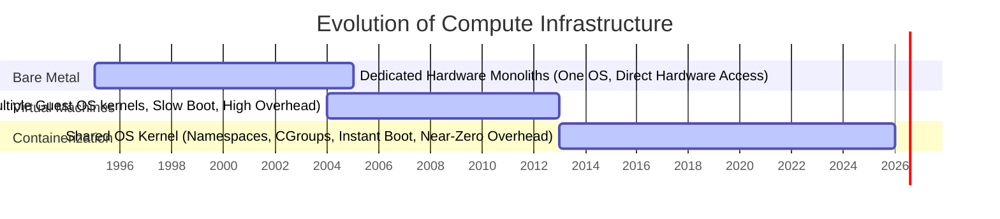
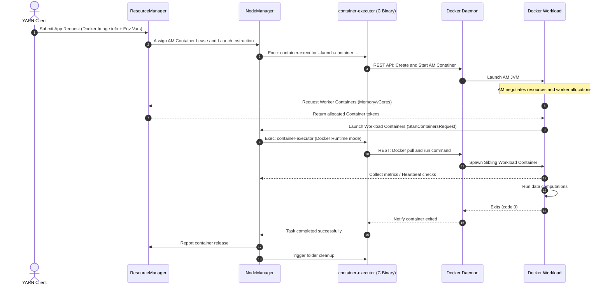
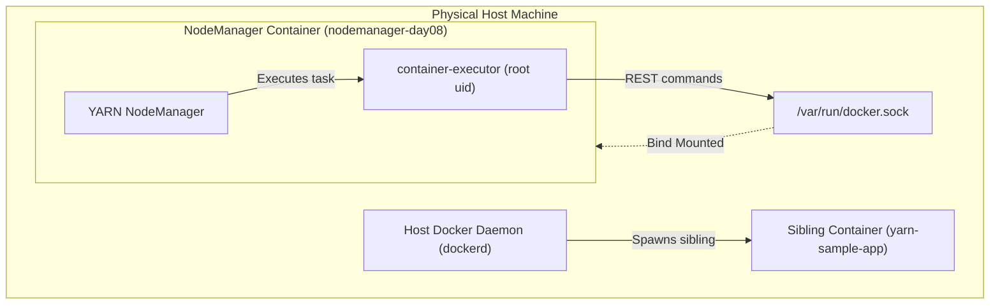
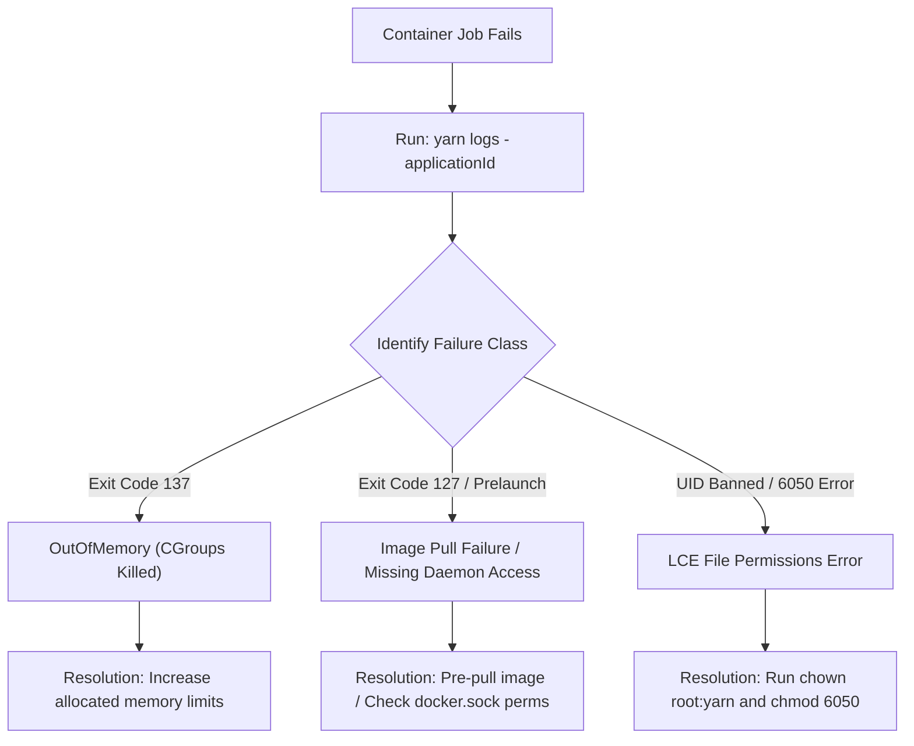
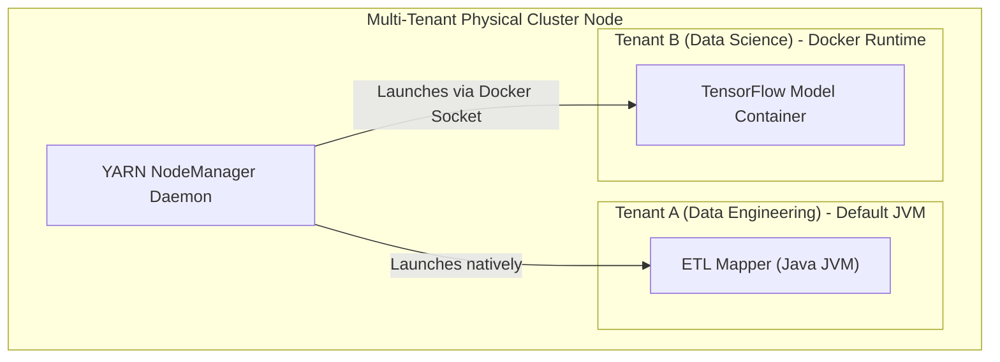

# Day 8: YARN + Containers (Docker on YARN)

Welcome to Day 8 of the **30 Days of Modern Hadoop Ecosystem** series. Today, we deep-dive into the modernization of YARN's runtime execution model: **YARN + Containers (Docker on YARN)**. We will study this technology from first principles, explaining how YARN evolved from simple process-forking JVMs into a production-grade distributed container orchestrator capable of running heterogeneous applications (Java, Python, Spark, C++) inside isolated Docker containers on the same shared cluster.

---

## 🏗️ Course Directory Structure

The files for this module are organized as follows:
*   **[docker/docker-compose.yml](file:///d:/30_Days_of_Modern_Hadoop_Ecosystem/Day-08-YARN-Containers-Docker/docker/docker-compose.yml)**: Multi-container local Hadoop cluster setting up a NodeManager with host Docker daemon socket access.
*   **[docker/hadoop.env](file:///d:/30_Days_of_Modern_Hadoop_Ecosystem/Day-08-YARN-Containers-Docker/docker/hadoop.env)**: Environment configuration overrides for local Hadoop containers.
*   **[configs/yarn-site.xml](file:///d:/30_Days_of_Modern_Hadoop_Ecosystem/Day-08-YARN-Containers-Docker/configs/yarn-site.xml)**: YARN site properties enabling the `LinuxContainerExecutor` and setting up Docker runtime paths, capabilities, networks, and mount scopes.
*   **[configs/container-executor.cfg](file:///d:/30_Days_of_Modern_Hadoop_Ecosystem/Day-08-YARN-Containers-Docker/configs/container-executor.cfg)**: Local configuration determining setuid restrictions, disallowed users, and Docker capability whitelists.
*   **[scripts/verify-docker-runtime.sh](file:///d:/30_Days_of_Modern_Hadoop_Ecosystem/Day-08-YARN-Containers-Docker/scripts/verify-docker-runtime.sh)**: Diagnostic script checking local Docker daemon connectivity, system socket paths, and privileges.
*   **[scripts/verify-yarn-container.sh](file:///d:/30_Days_of_Modern_Hadoop_Ecosystem/Day-08-YARN-Containers-Docker/scripts/verify-yarn-container.sh)**: Script inspecting `yarn-site.xml` parser parameters to guarantee correct LCE registration.
*   **[scripts/verify-resource-isolation.sh](file:///d:/30_Days_of_Modern_Hadoop_Ecosystem/Day-08-YARN-Containers-Docker/scripts/verify-resource-isolation.sh)**: Local verification of Linux Control Groups (CGroups) mount directories.
*   **[scripts/verify-docker-image.sh](file:///d:/30_Days_of_Modern_Hadoop_Ecosystem/Day-08-YARN-Containers-Docker/scripts/verify-docker-image.sh)**: Script validating local image builds and docker hub authentication connections.
*   **[scripts/run-docker-demo.sh](file:///d:/30_Days_of_Modern_Hadoop_Ecosystem/Day-08-YARN-Containers-Docker/scripts/run-docker-demo.sh)**: Orchestration script building the sample python-app container and invoking the YARN DistributedShell jar.
*   **[labs/submit-dockerized-yarn-app.md](file:///d:/30_Days_of_Modern_Hadoop_Ecosystem/Day-08-YARN-Containers-Docker/labs/submit-dockerized-yarn-app.md)**: Hands-on manual for executing your first dockerized YARN task.
*   **[examples/docker-app/Dockerfile](file:///d:/30_Days_of_Modern_Hadoop_Ecosystem/Day-08-YARN-Containers-Docker/examples/docker-app/Dockerfile)**: Dockerfile defining our test application containing python dependencies and monitoring hooks.
*   **[examples/docker-app/process.py](file:///d:/30_Days_of_Modern_Hadoop_Ecosystem/Day-08-YARN-Containers-Docker/examples/docker-app/process.py)**: Python script executing calculations, dumping variables, and reading local CGroups metrics files.
*   **[troubleshooting/troubleshooting-guide.md](file:///d:/30_Days_of_Modern_Hadoop_Ecosystem/Day-08-YARN-Containers-Docker/troubleshooting/troubleshooting-guide.md)**: Structured playbook identifying common failure models, commands, and resolutions.
*   **[references/references-list.md](file:///d:/30_Days_of_Modern_Hadoop_Ecosystem/Day-08-YARN-Containers-Docker/references/references-list.md)**: Collection of links to official guides and documentation resources.

---

## SECTION 1 — INTRODUCTION

### The Evolution of Application Deployment

To understand why YARN (Yet Another Resource Negotiator) adopted containerized execution, we must trace the history of hardware deployment methodologies. Over the last three decades, system architecture evolved through three major paradigms:



1.  **Bare Metal (Direct Hardware)**: Originally, enterprise software ran directly on physical servers. The operating system managed the hardware, and applications ran as OS processes.
    *   *Why it failed*: If a database and a web server ran on the same host, they shared the same system libraries. A dependency upgrade for one would break the other. Resource isolation was non-existent; a memory leak in one process crashed the entire machine. Hardware utilization was terribly low because servers were sized for peak load, leaving them idle 90% of the time.
2.  **Virtual Machines (Hypervisor-Based)**: Hypervisors (like VMware, KVM) introduced virtualization, dividing physical machines into multiple Virtual Machines (VMs). Each VM ran its own full Guest Operating System.
    *   *Why it was limited*: While VMs solved isolation, they brought massive performance and resource overhead. Running a Guest OS consumed gigabytes of RAM and substantial CPU just for kernel maintenance. VM boot times took minutes, making rapid elastic scaling impossible. For heavy distributed platforms like Hadoop, the hypervisor storage and network translation layers introduced unacceptable latency.
3.  **Containers (OS-Level Virtualization)**: Containerization decoupled virtualization from the hardware hypervisor by sharing the host machine's OS kernel. Containers utilize Linux kernel constructs—specifically **Namespaces** for isolation and **Control Groups (CGroups)** for resource limitations—to create isolated user environments.
    *   *Why it succeeded*: Containers boot in milliseconds, have near-zero virtualization overhead, and packages application code alongside all of its libraries, system configurations, and environment variables into a single, immutable unit (e.g., a Docker Image).

### Why YARN Adopted Container-Based Execution

Historically, YARN containers were not "containers" in the modern sense (like Docker). Instead, a classical YARN container was simply a **JVM process** spawned by the local NodeManager daemon on behalf of an ApplicationMaster. The NodeManager spawned a new Java process using `DefaultContainerExecutor` (which ran under the same Unix user as the NodeManager process itself).

As data science, machine learning, and mixed analytics pipelines grew, this JVM-only model encountered severe operational challenges:
*   **Dependency Conflicts**: Running a Python Spark job required python libraries to be pre-installed on *every single physical worker node*. If Team A needed Python 3.8 and Team B needed Python 3.10, they could not share the same cluster.
*   **Lack of Isolation**: Because processes ran natively on the worker OS, they could browse other directories, read sensitive configurations, or execute unauthorized operations.
*   **Hadoop Node Stability**: If a Java mapper process ran out of memory, it could trigger host kernel thrashing, bringing down the NodeManager itself.

To resolve these limits, Hadoop 3.x introduced deep support for the **Docker Container Runtime** inside YARN. Instead of launching a native OS process, YARN's `LinuxContainerExecutor` can delegate container launching to the host's Docker Engine, wrapping the task inside an isolated Docker container.

---

## SECTION 2 — PROBLEM STATEMENT

Before YARN integrated support for container runtimes, enterprises struggled with substantial infrastructure friction.

### The Challenges Before Docker-on-YARN

*   **Dependency Hell**: Big data workloads are no longer purely Java JAR files. Modern data pipelines run complex Python scripts (Pandas, TensorFlow), custom native C++ libraries, or specific versions of Scala. Managing these dependencies across a 1,000-node cluster was an operational nightmare. System administrators had to use orchestration tools (like Ansible or Chef) to ensure library parity across all worker nodes. A single corrupted node would fail random task attempts, skewing job runtimes.
*   **Environment Inconsistency**: Code that ran perfectly on a developer's laptop would fail when deployed on the cluster because of subtle differences in OS packages, environment variables, or library versions (e.g., glibc mismatches).
*   **Resource Contention and Leakage**: Native processes could bypass resource boundaries. While YARN monitored memory usage via the `/proc` directory and killed containers that exceeded their limit, this polling mechanism was reactive. In the seconds between polls, a rogue task could allocate gigabytes of RAM, triggering the host Linux OOM (Out Of Memory) killer, which would kill critical system processes (including the NodeManager daemon itself).
*   **Difficult Deployment & Rollback**: Deploying a new version of a processing framework required restarting services or rebuilding node disk images. Rolling back a broken framework version meant redeploying packages across the entire cluster, risking production downtime.

### Traditional YARN Deployment vs. Docker on YARN

To visualize the architectural differences, consider the structural layers below:

| Feature / Layer | Traditional YARN (Process-Forking JVM) | Docker on YARN |
| :--- | :--- | :--- |
| **Execution Sandbox** | Shared host OS workspace. | Isolated container namespace. |
| **Runtime Dependencies** | Shared globally on host worker nodes. | Packaged inside the Docker image. |
| **Resource Isolation** | Process-based monitoring (kill-on-poll). | Hardware-enforced kernel CGroups. |
| **Boot Velocity** | Slow (JVM bootstrap overhead). | Fast (Minimal container launch time). |
| **Multi-Tenancy** | Soft tenancy (shared libraries, potential conflicts). | Hard tenancy (fully isolated file systems and runtimes). |
| **Framework Flexibility** | Java / MapReduce centric. | Framework agnostic (Java, Python, C++, Go, R). |

---

## SECTION 3 — YARN + DOCKER ARCHITECTURE

Running Docker workloads on YARN requires coordinating both Hadoop control-plane daemons and OS-level virtualization runtimes.

### Component Architecture

```mermaid
graph TB
    subgraph "Master Control Plane"
        RM["ResourceManager (RM)"]
        Scheduler["Capacity/Fair Scheduler"]
        RM_ASM["ApplicationsManager"]
        RM --> Scheduler
        RM --> RM_ASM
    end

    subgraph "Worker Node (NodeManager Host)"
        NM["NodeManager Daemon (Java)"]
        LCE["LinuxContainerExecutor (C Binary)"]
        DCR["Docker Container Runtime"]
        DE["Docker Engine (dockerd)"]
        CG["Host CGroups Subsystem"]
        
        NM -->|1. Launch Task (RPC)| LCE
        LCE -->|2. Validate and Construct command| DCR
        DCR -->|3. Call socket api| DE
        DE -->|4. Launch Sibling Container| Container["Docker Container (Workload)"]
        LCE -.->|Assign limits| CG
        CG -.->|Enforce CPU/Memory| Container
    end

    RM_ASM -->|Coordinate AM Container| NM
```

The architecture consists of the following key layers:

1.  **ResourceManager (RM)**: The master orchestrator. It receives jobs from clients, determines resource allocation schedules, and allocates resource lease "tokens" (containers). It remains unaware of the Docker execution mechanics, focusing purely on memory/vCore allocation leases.
2.  **NodeManager (NM)**: The worker agent. It is a Java process running on each worker host. When instructed by an ApplicationMaster, it bootstraps the execution of containers. When Docker is enabled, it hands over the process startup to the `LinuxContainerExecutor`.
3.  **LinuxContainerExecutor (LCE)**: A secure, compiled native C binary (`container-executor`) shipped with Hadoop. It runs with **root permissions** via the **SetUID** bit. LCE is responsible for executing tasks under the credentials of the submitting user, configuring Unix directory structures securely, and setting up CGroups boundaries on the host.
4.  **Docker Container Runtime**: A native integration class inside the LCE framework. When YARN detects that the container request specifies a Docker image, LCE uses the Docker Container Runtime to translate YARN's execution parameters (environment variables, resource allocations, volumes) into standard Docker commands.
5.  **Docker Engine (dockerd)**: The system daemon managing local containers on the host. It receives requests from the Docker Container Runtime (via `/var/run/docker.sock`), pulls images from registries, mounts local files systems, and handles the container execution lifecycle.
6.  **ApplicationMaster (AM)**: The framework-specific coordinator (e.g. Spark Driver, MapReduce AppMaster). The AM negotiates container resource allocations from the RM and coordinates their execution with the NodeManagers.

---

## SECTION 4 — INTERNAL WORKING

Let us trace the complete lifecycle of a containerized application submission, execution, and cleanup step-by-step.



### Detailed Execution Phase Breakdown

#### Phase 1: Application Submission
1.  The client submits a YARN job request containing specific environment variables that indicate a Dockerized runtime:
    *   `YARN_CONTAINER_RUNTIME_TYPE` = `docker`
    *   `YARN_CONTAINER_RUNTIME_DOCKER_IMAGE` = `yarn-sample-app:latest`
2.  The ResourceManager accepts the request, verifies the target queue holds sufficient capacity, and allocates an ApplicationMaster (AM) container lease.

#### Phase 2: ApplicationMaster Setup
3.  The RM selects a NodeManager to host the AM. It communicates the container launch context.
4.  The selected NodeManager processes the request. Recognizing the Docker runtime parameters, it invokes the native `container-executor` binary, which reads `/etc/hadoop/container-executor.cfg` to confirm security bounds.
5.  `container-executor` contacts the local Docker daemon via the unix socket (`/var/run/docker.sock`) to pull the target image (if configured to pull, or if not cached locally).
6.  The Docker Engine starts the container, launching the AM JVM inside it.

#### Phase 3: Resource Negotiation
7.  The AM registers with the RM. It determines the number of tasks required and submits resource allocation requests (memory capacity, core requirements, data locality preferences).
8.  The RM scheduler processes the request and responds to the AM with resource container leases.

#### Phase 4: Container Launch & Execution
9.  The AM contacts the NodeManagers running on the assigned worker hosts, sending a `StartContainersRequest` which details the Docker execution instructions.
10. The NodeManager validates the security tokens and executes the native `container-executor` program.
11. `container-executor` writes out localized configuration files (tokens, environment definitions, JARs) into a secure directory on the host.
12. It mounts the localized host directories (e.g. log directories, cache directories) into the Docker container.
13. `container-executor` invokes the Docker CLI / Daemon API to launch the sibling Docker container:
    ```bash
    docker run --name=container_16723223849_0001_01_000002 \
      --user=yarn --net=hadoop-network \
      -v /var/log/hadoop-yarn/containers:/var/log/hadoop-yarn/containers \
      -v /var/lib/hadoop-yarn/cache:/var/lib/hadoop-yarn/cache \
      yarn-sample-app:latest python3 /app/process.py
    ```
14. The workload executes inside the Docker container.

#### Phase 5: Monitoring and Isolation
15. Linux CGroups enforce hardware restrictions:
    *   `cpu.shares` (or `cpu.cfs_quota_us`) limit CPU usage.
    *   `memory.limit_in_bytes` limits the maximum physical memory usage.
16. The NodeManager checks the container process status periodically.

#### Phase 6: Completion and Cleanup
17. The workload process exits. The Docker daemon catches the exit code.
18. `container-executor` reports the container completion back to the NodeManager Java daemon.
19. The NodeManager triggers log aggregation: it copies the container's stdout/stderr log files from the host path into HDFS.
20. The NodeManager commands the Docker daemon to remove the container (`docker rm`) and deletes the local staging directories.

---

## SECTION 5 — CORE CONCEPTS

To operate YARN with Docker runtimes, you must master the fundamental kernel-level mechanisms that make containerization possible.

### Detailed Concept Glossary

```
┌─────────────────────────────────────────────────────────────┐
│                   DOCKER RUNTIME ON YARN                    │
│                                                             │
│  ┌───────────────────────┐       ┌───────────────────────┐  │
│  │      NAMESPACES       │       │        CGROUPS        │  │
│  │ (Process Isolation)   │       │ (Resource Allocation) │  │
│  │                       │       │                       │  │
│  │ ─ PID: Hidden PIDs    │       │ ─ CPU: Shares/Quota   │  │
│  │ ─ NET: Separate IP    │       │ ─ MEM: Hard RAM Limit │  │
│  │ ─ MNT: Sandbox Files  │       │ ─ DISK: Read/Write IO │  │
│  └───────────────────────┘       └───────────────────────┘  │
└─────────────────────────────────────────────────────────────┘
```

#### Namespaces
Namespaces partition system resources at the kernel level. They provide a virtualization sandbox so that processes inside a container feel like they are running on a dedicated operating system.
*   **PID (Process ID) Namespace**: Hides host processes. The main container process is assigned PID 1. It cannot see or kill processes running on the host or in other containers.
*   **NET (Network) Namespace**: Virtualizes network interfaces. The container gets a private loopback adapter (`127.0.0.1`) and virtual ethernet interfaces (`eth0`) mapped to a Docker bridge, isolating it from host ports unless explicitly bound.
*   **MNT (Mount) Namespace**: Isolates file system mount points. The container sees a custom root file system (`/`) defined by its Docker image, preventing it from browsing the host's actual hard drives.
*   **IPC (Inter-Process Communication) Namespace**: Prevents container processes from using shared memory or message queues of the host system.
*   **USER Namespace**: Maps container user accounts to different host accounts. A process running as `root` inside the container can be mapped to a non-privileged user on the host, preventing host takeover.

#### Control Groups (CGroups)
While namespaces isolate *what* a process can see, CGroups limit *how much* physical hardware a process can consume.
*   **CPU Scheduling**:
    *   *Shares*: Relative CPU weight (e.g. `cpu.shares=1024` vs `512` shares). During CPU contention, the process with 1024 shares gets twice as much CPU time.
    *   *Quota/Period*: Hard CPU limit (e.g. `cpu.cfs_quota_us=200000` with `cpu.cfs_period_us=100000` limits the container to exactly 2 CPU cores, even if the host has 64 idle cores).
*   **Memory Limits**:
    *   *Hard Limit*: (`memory.limit_in_bytes`) The absolute maximum physical RAM the container can allocate. If exceeded, the OS kernel immediately triggers the Out-of-Memory (OOM) Killer, terminating the process (Exit code 137).
    *   *Soft Limit*: (`memory.soft_limit_in_bytes`) If the host runs low on memory, it pushes containers down to their soft limit before reclaiming memory.
*   **Block I/O (blkio)**: Sets limits on read/write input-output operations per second (IOPS) or throughput (MB/s) on host disks, preventing a single job from saturating the storage layer.

#### Container Lifecycle
*   **Created**: Image pulled, namespace structures established, but process not yet spawned.
*   **Running**: Main command execution active.
*   **Exited**: Main process finished. Exit code captured (0 for success, non-zero for failure).
*   **Removed**: System files and virtual network namespaces purged from host systems.

#### Volume Mounts
The translation layer mapping a directory on the host's hard drive to a directory inside the container's virtual root namespace.
*   *ReadOnly Mounts*: Allow containers to read cluster configuration files (e.g., `core-site.xml`) without the ability to modify or corrupt them.
*   *ReadWrite Mounts*: Used for caching temporary job partitions (shuffle files) and writing out execution logs.

#### Networking Models
*   **Bridge Network**: Default mode. The container gets a virtual IP address inside a private Docker subnet. Traffic to HDFS is routed via NAT (Network Address Translation).
*   **Host Network**: Bypasses network isolation. The container shares the host's IP and port spaces directly. Recommended for Spark executors to avoid NAT routing latency, though it introduces port collision risks.
*   **Overlay Network**: Creates a multi-host software-defined network spanning all cluster worker nodes. Useful for direct container-to-container communication across physical machines.

---

## SECTION 6 — PRODUCTION ENGINEERING

Running containerized workloads on enterprise clusters requires configuring strict security protocols, performance parameters, and storage management workflows.

### 🚀 Production Best Practices Checklist

- [ ] **Configure Private Container Registries**: Never pull production images from public Docker Hub. Setup an internal, secured registry (Harbor, Nexus, AWS ECR) to prevent network latency and dependency injection attacks.
- [ ] **Enforce Non-Root Image Policies**: Explicitly block containers from running as the `root` user inside `container-executor.cfg`. Images must be built to run under standard user IDs.
- [ ] **Minimize Image Sizes**: Keep production images under 1GB. Large images saturate network interfaces on NodeManagers during image pull steps. Use multi-stage builds and slim base images (e.g. `python:3.9-slim`).
- [ ] **Enable Host Sibling Binding for Socket**: Avoid Docker-in-Docker (DinD) architectures as they require privileged containers. Mount `/var/run/docker.sock` to the NodeManager to leverage sibling container execution.
- [ ] **Tune CGroups CPU Allocation**: Set `yarn.nodemanager.resource.cpu.control-enabled` to `true` to prevent individual workloads from starving system processes or other jobs.

### Configuration Tuning Reference

Add these key configurations to your `/etc/hadoop/yarn-site.xml` to tune Docker executions:

```xml
<!-- Enforce hard CPU quotas in CGroups -->
<property>
  <name>yarn.nodemanager.cpu-limits.vcores</name>
  <value>8</value>
</property>

<!-- Allowed registries for Docker images -->
<property>
  <name>yarn.nodemanager.runtime.linux.docker.allowed.registries</name>
  <value>myregistry.enterprise.corp,harbor.internal</value>
</property>

<!-- Image pull policy: pull only if missing from local cache -->
<property>
  <name>yarn.nodemanager.runtime.linux.docker.image-pull.policy</name>
  <value>if-not-present</value>
</property>
```

---

## SECTION 7 — HANDS-ON LAB

This section outlines how to execute a Dockerized Python calculation workload on a local Hadoop YARN cluster.

### Step-by-Step Execution Guide

#### Step 1: Start the Hadoop Cluster Environment
Navigate to the directory containing the compose file and launch the cluster containers:
```bash
cd Day-08-YARN-Containers-Docker/docker/
docker-compose up -d
```
Check that the nodes are initialized:
```bash
docker-compose ps
```

#### Step 2: Build the Target Docker Image
From the `Day-08-YARN-Containers-Docker` directory:
```bash
docker build -t yarn-sample-app:latest examples/docker-app/
```

#### Step 3: Run the Automatic Submission Script
Execute the demo script to verify system checks and submit the DistributedShell job:
```bash
bash scripts/run-docker-demo.sh
```

#### Step 4: Access the ResourceManager UI
Open a browser and navigate to: **[http://localhost:8088](http://localhost:8088)**. Search for application listings and inspect the execution history.

```
┌─────────────────────────────────────────────────────────────┐
│                  RESOURCEMANAGER DASHBOARD                  │
├─────────────────────────────────────────────────────────────┤
│  ID: app_16723223849_0001                                   │
│  Name: docker-yarn-demo                                    │
│  State: FINISHED                                            │
│  FinalStatus: SUCCEEDED                                     │
│  Containers: 1 / 1                                          │
└─────────────────────────────────────────────────────────────┘
```

#### Step 5: Read Log Output
Execute the log extraction tool:
```bash
docker exec -it resourcemanager-day08 yarn logs -applicationId $(docker exec -it resourcemanager-day08 yarn application -list -appStates FINISHED | grep "docker-yarn-demo" | awk '{print $1}')
```

---

## SECTION 8 — BUILD FROM SOURCE

To deploy the secure `LinuxContainerExecutor` in production, you must build Hadoop's native components from source. The Java code alone cannot perform setuid root operations.

### Native Compilation Flow

1.  **Install Compilation Toolchain**:
    On a clean Linux machine (CentOS/Ubuntu), install the required build dependencies:
    ```bash
    sudo apt-get update
    sudo apt-get install -y build-essential cmake maven build-essential zlib1g-dev libssl-dev
    ```
2.  **Download and Unpack Source Code**:
    ```bash
    wget https://archive.apache.org/dist/hadoop/common/hadoop-3.2.1/hadoop-3.2.1-src.tar.gz
    tar -xzf hadoop-3.2.1-src.tar.gz
    cd hadoop-3.2.1-src
    ```
3.  **Compile Native Binaries**:
    Run Maven to build only the native components, specifically targetting the container-executor modules:
    ```bash
    mvn clean package -Pdist,native -DskipTests -Dtar
    ```
4.  **Extract the Native Binary**:
    The compiled C binary will be located inside:
    `hadoop-yarn-project/hadoop-yarn/hadoop-yarn-server/hadoop-yarn-server-nodemanager/target/native/target/usr/local/bin/container-executor`
5.  **Install and Set Permissions**:
    Copy this binary to `/usr/bin/` on all your worker nodes and set secure ownership and permission flags:
    ```bash
    sudo cp container-executor /usr/bin/container-executor
    sudo chown root:yarn /usr/bin/container-executor
    sudo chmod 6050 /usr/bin/container-executor
    ```

---

## SECTION 9 — DOCKER DEPLOYMENT

For Day 8, we provide a complete multi-container Docker Compose simulation that lets you run YARN workloads containerized within sibling Docker containers on your local host.

### Docker Compose Architecture

Our environment maps the host's Docker engine into the worker NodeManager container using file mount bindings.



The NodeManager container runs as the `root` user to allow mounting the host's socket. When LCE receives the execution instruction, it issues API calls to `/var/run/docker.sock`. The host's Docker engine processes the request, spawning a sibling container that runs adjacent to the NodeManager container.

---

## SECTION 10 — LOCAL CLUSTER DEPLOYMENT

### Single-Node Configuration

For local development or testing, a single-node configuration runs all Hadoop daemons (NameNode, DataNode, ResourceManager, NodeManager) on the same machine.
*   The host's `/var/run/docker.sock` is mounted directly into the single NodeManager container.
*   Local image building (`yarn-sample-app:latest`) makes the image instantly accessible to the NodeManager without configuring registries.

### Multi-Node Production Configuration

In a multi-node bare-metal cluster, NodeManagers are deployed on separate physical servers.
1.  **Docker Installation**: Docker Engine must be installed natively on every worker machine.
2.  **Configuration Distribution**: The `yarn-site.xml` and `/etc/hadoop/container-executor.cfg` must be distributed to all workers.
3.  **Local User Provisioning**: The `yarn` system user must be added to the local `docker` group on each host:
    ```bash
    sudo usermod -aG docker yarn
    ```
4.  **Private Registry Setup**: An internal registry must be set up, and all worker hosts must be logged into this registry or authorized to pull from it.

---

## SECTION 11 — VALIDATION

To simplify validation of your Docker-on-YARN setup, we have created five specialized diagnostic scripts in the `scripts/` directory:

1.  **[verify-docker-runtime.sh](file:///d:/30_Days_of_Modern_Hadoop_Ecosystem/Day-08-YARN-Containers-Docker/scripts/verify-docker-runtime.sh)**: Checks if the Docker daemon is active on the host and validates socket connectivity.
2.  **[verify-yarn-container.sh](file:///d:/30_Days_of_Modern_Hadoop_Ecosystem/Day-08-YARN-Containers-Docker/scripts/verify-yarn-container.sh)**: Inspects the XML configuration tags in `yarn-site.xml` to ensure LCE is correctly enabled.
3.  **[verify-resource-isolation.sh](file:///d:/30_Days_of_Modern_Hadoop_Ecosystem/Day-08-YARN-Containers-Docker/scripts/verify-resource-isolation.sh)**: Validates that host CGroups controllers (CPU, Memory) are mounted and accessible.
4.  **[verify-docker-image.sh](file:///d:/30_Days_of_Modern_Hadoop_Ecosystem/Day-08-YARN-Containers-Docker/scripts/verify-docker-image.sh)**: Checks if the sample application image is cached locally.
5.  **[run-docker-demo.sh](file:///d:/30_Days_of_Modern_Hadoop_Ecosystem/Day-08-YARN-Containers-Docker/scripts/run-docker-demo.sh)**: Automatically builds the sample Docker container and submits the workload using the DistributedShell JAR.

---

## SECTION 12 — PRODUCTION TROUBLESHOOTING PLAYBOOK

For an exhaustive troubleshooting guide, please refer to the main **[Troubleshooting Playbook](file:///d:/30_Days_of_Modern_Hadoop_Ecosystem/Day-08-YARN-Containers-Docker/troubleshooting/troubleshooting-guide.md)**.



---

## SECTION 13 — REAL-WORLD CASE STUDY

### Enterprise Multi-Tenant Analytics Platform

#### The Context
An enterprise financial services company runs a multi-tenant Hadoop cluster shared by Data Engineering, Business Intelligence, and Machine Learning teams.
*   **Data Engineering** runs traditional Java MapReduce and Tez-based ETL jobs.
*   **Business Intelligence** runs interactive SQL queries via Spark SQL.
*   **Machine Learning** runs deep learning models using Python (TensorFlow, PyTorch) requiring specific versions of libraries (CUDA, NumPy).

#### The Solution: Docker-on-YARN Deployment
The company configured YARN to support both default JVM execution and Docker Container Runtimes.



*   **Tenant A (Data Engineering)** tasks are launched as standard JVM processes using the default runtime, avoiding image pull overhead.
*   **Tenant B (Data Science)** tasks are submitted with Docker configurations. YARN launches these tasks inside custom Docker containers packaged with TensorFlow and all required Python dependencies.
*   **Resource Isolation**: CPU quotas and memory boundaries are enforced using host Control Groups (CGroups), preventing data science workloads from impacting the execution of core ETL pipelines.

---

## SECTION 14 — INTERVIEW QUESTIONS

### 🟢 Beginner Level (20 Questions & Answers)

#### 1. What is YARN?
YARN (Yet Another Resource Negotiator) is the resource management and job scheduling layer of the Apache Hadoop ecosystem, decoupling resource allocation from the execution framework.

#### 2. What is a YARN container?
A logical lease of compute resources (Memory, CPU) allocated on a cluster node to run a specific task.

#### 3. What is Docker?
Docker is an open-source platform that automates the deployment of applications inside lightweight, portable software containers sharing the host OS kernel.

#### 4. How does Docker differ from a Virtual Machine (VM)?
Containers virtualize the operating system kernel and boot in milliseconds, whereas VMs virtualize the hardware layer and require a complete guest OS.

#### 5. Why would you want to run Docker containers on YARN?
To package custom runtime environments (dependencies, binaries, Python versions) without needing to install them globally on all worker nodes.

#### 6. What is the role of the NodeManager in YARN?
The NodeManager is the agent running on worker hosts, launching containers, monitoring local resource usage, and sending heartbeats to the ResourceManager.

#### 7. What is the ResourceManager?
The master service that manages resource allocation across the entire cluster.

#### 8. What is the ApplicationMaster?
A framework-specific process (e.g. MapReduce AppMaster, Spark Driver) running inside Container #1 that negotiates worker resources from the ResourceManager.

#### 9. What is the LinuxContainerExecutor (LCE)?
A native C program (`container-executor`) that enables secure execution of container processes under the credentials of the submitting user.

#### 10. Why is the LinuxContainerExecutor compiled from C instead of Java?
It needs the SetUID bit to execute commands as root for secure user impersonation, a capability not natively available to JVM processes.

#### 11. What is a SetUID bit?
A Linux file system permission bit that allows a user to run an executable with the permissions of the executable's owner (typically root).

#### 12. What does CGroups stand for?
Control Groups, a Linux kernel feature that limits, isolates, and measures resource usage (CPU, RAM, Disk I/O) for groups of processes.

#### 13. What is a Linux Namespace?
A kernel feature that partitions system resources (e.g. process IDs, network adapters) so that a group of processes see an isolated execution sandbox.

#### 14. What happens if a YARN container exceeds its physical memory limit?
The NodeManager or the host OS kernel OOM killer terminates the container, returning exit code 137.

#### 15. What YARN configuration property defines the container executor class?
`yarn.nodemanager.container-executor.class`

#### 16. What value should `yarn.nodemanager.container-executor.class` have to enable Docker support?
`org.apache.hadoop.yarn.server.nodemanager.LinuxContainerExecutor`

#### 17. How do you specify a Docker image when submitting a YARN job?
By setting the environment variable `YARN_CONTAINER_RUNTIME_DOCKER_IMAGE`.

#### 18. What is the default network mode for YARN Docker containers?
Bridge networking.

#### 19. Can you run default (JVM) and Dockerized workloads on the same YARN cluster?
Yes, by configuring `yarn.nodemanager.runtime.linux.allowed-runtimes` to `default,docker`.

#### 20. Where do NodeManagers retrieve Docker images from?
Either from the local host Docker image cache or by pulling them from a remote registry (like Docker Hub or a private registry).

---

### 🟡 Intermediate Level (20 Questions & Answers)

#### 21. Explain the role of `container-executor.cfg`.
It is a local security configuration file owned by root that restricts permissions for the native `container-executor` binary, defining allowed users, directories, and Docker capabilities.

#### 22. Why must `container-executor.cfg` be owned by root and have permissions `0400`?
To prevent non-root users from modifying the configuration and executing arbitrary root commands via the SetUID binary.

#### 23. What is the difference between `cpu.shares` and `cpu.cfs_quota_us` in CGroups?
`cpu.shares` defines relative CPU priority during contention, whereas `cpu.cfs_quota_us` sets a hard CPU limit regardless of whether the system is idle.

#### 24. Explain how YARN launches a Docker container.
The NodeManager hands launch arguments to `container-executor`. This binary validates parameters against security policies and calls the Docker daemon socket to spawn the container.

#### 25. How do you mount local directories inside a YARN Docker container?
By configuring `docker.allowed.rw-mounts` in `container-executor.cfg` and passing the mount directories using the appropriate YARN parameters.

#### 26. What security risk does the Docker daemon socket pose to NodeManager hosts?
Since `/var/run/docker.sock` grants full control over the Docker daemon, any user who can write to this socket can escalate privileges to root.

#### 27. How does the YARN client verify that the ResourceManager is active and ready?
By sending RPC heartbeats to the ResourceManager's ApplicationsManager port (default `8032`) and querying cluster state via REST.

#### 28. What is the purpose of `yarn.nodemanager.resource.cpu.control-enabled`?
It enables CGroups-based CPU isolation on worker nodes to prevent single tasks from saturating host processors.

#### 29. How does YARN manage Docker image cleanups on worker hosts?
YARN itself does not automatically delete unused Docker images; administrators must run cleanup cron jobs or configure Docker engine image garbage collection.

#### 30. What happens if the Docker daemon crashes on a worker host?
NodeManager tasks requiring the Docker runtime fail immediately. The NodeManager remains active but reports container launch errors back to the ResourceManager.

#### 31. Explain the `if-not-present` image pull policy.
The NodeManager will run the container immediately if the image is already cached locally. If missing, it pulls the image from the registry.

#### 32. Can a YARN Docker container mount the host's `/proc` directory?
No, mounting host directories is restricted by default for security, though read-only mounts of specific runtime directories can be whitelisted.

#### 33. What is the purpose of the `min.user.id` property in `container-executor.cfg`?
It prevents execution of containers as system-level users (typically those with UIDs below 1000, like `bin` or `daemon`) to protect host security.

#### 34. Explain the difference between bridge and host networking in Docker-on-YARN.
Bridge mode isolates container ports behind NAT, whereas Host mode exposes container network interfaces directly on the host's IP address.

#### 35. Why is host networking preferred for high-throughput Spark applications on YARN?
It avoids the performance overhead and port translation latency introduced by Docker's virtual bridge network interface.

#### 36. What is the purpose of `yarn.nodemanager.linux-container-executor.cgroups.hierarchy`?
It defines the path (e.g. `/hadoop-yarn`) under the cgroups mount point where YARN creates its sub-cgroups for container resource control.

#### 37. What happens if a NodeManager's host hard drive runs out of space due to cached Docker layers?
The NodeManager enters a `unhealthy` state and is excluded by the ResourceManager from receiving new container allocations.

#### 38. How does YARN collect logs from a containerized Docker process?
It binds local log paths (e.g., `/var/log/hadoop-yarn/containers`) into the container. The process writes stdout/stderr to these paths, and the NodeManager uploads them to HDFS on task completion.

#### 39. What is the consequence of allowing privileged container executions in YARN?
It allows container processes to run with full host privileges, bypassing isolation boundaries and creating root escalation vulnerabilities.

#### 40. Why must the `yarn` user be a member of the local `docker` group on worker hosts?
So that the NodeManager process can read and write to `/var/run/docker.sock` to control the local Docker daemon.

---

### 🔴 Advanced Level (20 Questions & Answers)

#### 41. How does YARN ensure secure multi-tenancy when running Docker containers?
Through the integration of:
1.  `LinuxContainerExecutor` (enforces native user execution).
2.  `container-executor.cfg` (restricts capabilities, networks, and directories).
3.  CGroups (enforces physical hardware isolation).
4.  Namespaces (isolates file systems and network spaces).

#### 42. Explain the execution sequence when `container-executor` launches a Docker container.
The JVM launches `container-executor` with the SetUID bit set. The binary switches its effective user ID to the user submitting the job, validates execution variables, checks the Docker command arguments against the configuration whitelist, and sends a secure request to the Docker socket.

#### 43. How does CGroups v2 affect YARN's resource isolation compared to CGroups v1?
CGroups v2 features a unified hierarchy model, simplifying resource limit configurations. However, YARN must be compiled with v2 support to leverage this consolidated controller structure.

#### 44. What is the role of `CgroupsLCEResourcesHandler`?
It is the Java handler class that calculates resource quotas and communicates them to the host's cgroups controller paths during container initialization.

#### 45. Explain how to configure Kerberos security with Docker-on-YARN.
You must enable Kerberos cluster-wide, set `yarn.nodemanager.container-executor.class` to use `LinuxContainerExecutor`, configure secure host permissions, and require authenticated user tokens to execute Docker container launches.

#### 46. What is a "dangling" image, and why is it common in clusters running Docker-on-YARN?
An image layer without an associated tag, often left behind when images with mutable tags (like `latest`) are pulled repeatedly on worker nodes.

#### 47. Why should you avoid using the `latest` tag for production Docker images on YARN?
It introduces environment drift, as different nodes may pull different versions of the image at different times, causing inconsistent run results.

#### 48. Explain the performance impact of Docker NAT on Spark shuffle phases.
Docker's default bridge network routes traffic through iptables NAT rules, introducing network latency and CPU overhead during intensive Spark shuffle phases.

#### 49. How do you resolve port conflicts when running multiple Spark containers in Host network mode?
YARN dynamically allocates unique execution ports to containers, which the application framework must read and bind to instead of using static ports.

#### 50. What is the function of the `docker.capabilities` whitelist?
It limits the Linux capabilities (e.g. `CAP_SYS_ADMIN`, `CAP_NET_ADMIN`) granted to the container, preventing processes from executing privileged system commands.

#### 51. Explain how to debug a `container-executor` binary execution crash.
Set `yarn.nodemanager.delete.debug-delay-sec` to a high value, examine the launch script generated by YARN, and run the command manually to inspect console outputs.

#### 52. What is the difference between physical memory checks and virtual memory checks in YARN?
Physical memory checks monitor actual RAM usage, while virtual memory checks monitor swap space. Virtual memory limits are calculated using a configurable ratio (default 2.1x of physical memory).

#### 53. How do you disable virtual memory checks to prevent premature container terminations?
Set `yarn.nodemanager.vmem-check-enabled` to `false` in `yarn-site.xml`.

#### 54. Explain the interaction between YARN local resources and Docker volumes.
YARN localizes files (JARs, archives) to host cache directories, which are then mounted as read-only volumes inside the Docker container's workspace.

#### 55. What is the security risk of configuring `docker.allowed.rw-mounts` to allow root path (`/`) mounts?
A compromised container could overwrite critical system files on the host, gaining control of the worker node.

#### 56. How does YARN handle container failures caused by host hardware OOM events?
The NodeManager detects the kernel kill event, marks the container as failed with status code 137, and notifies the ApplicationMaster to reschedule the task.

#### 57. Can you run GPU-isolated workloads inside Docker on YARN?
Yes, by configuring YARN's GPU resource plugin and mapping host GPU devices (e.g. `/dev/nvidia*`) to the Docker containers.

#### 58. What is the default lifecycle duration of localized resources in YARN?
They persist in the local cache directory until the disk usage exceeds the configured threshold, triggering NodeManager's cache cleanup routine.

#### 59. Explain the impact of CPU throttling on MapReduce tasks.
If hard CPU quotas are set, tasks exceeding their allocated limits are throttled by the kernel, increasing execution times but preventing resource starvation on the host.

#### 60. How does Docker-on-YARN simplify platform upgrades?
Upgrades to runtime frameworks (like Spark or Python) are packaged into new Docker images, allowing teams to upgrade independently without cluster restarts.

---

## SECTION 15 — KEY TAKEAWAYS

### Why Containers Matter
Integrating Docker with YARN allows organizations to run heterogeneous workloads on a shared cluster, decoupling application dependencies from host systems and ensuring consistent environments from development to production.

### Key Integration Mechanics
*   The **LinuxContainerExecutor** provides the secure foundation for user impersonation and resource control.
*   **Docker Container Runtime** translates YARN execution commands into native Docker requests.
*   **CGroups and Namespaces** enforce resource boundaries and isolation at the kernel level.

### Critical Production Practices
*   Secure the `container-executor` binary and configuration files with correct ownership and permissions.
*   Limit container capabilities and block root user access to maintain cluster security.
*   Avoid mutable image tags and use private registries to ensure environment consistency.

---

## SECTION 16 — REFERENCES

*   **[Apache Hadoop YARN Documentation](https://hadoop.apache.org/docs/stable/hadoop-yarn/hadoop-yarn-site/YARN.html)**
*   **[Docker Documentation & Best Practices](https://docs.docker.com/)**
*   **[Linux Kernel Control Groups (CGroups) Documentation](https://www.kernel.org/doc/Documentation/cgroup-v1/)**
*   **[Running Spark on YARN Guide](https://spark.apache.org/docs/latest/running-on-yarn.html)**
