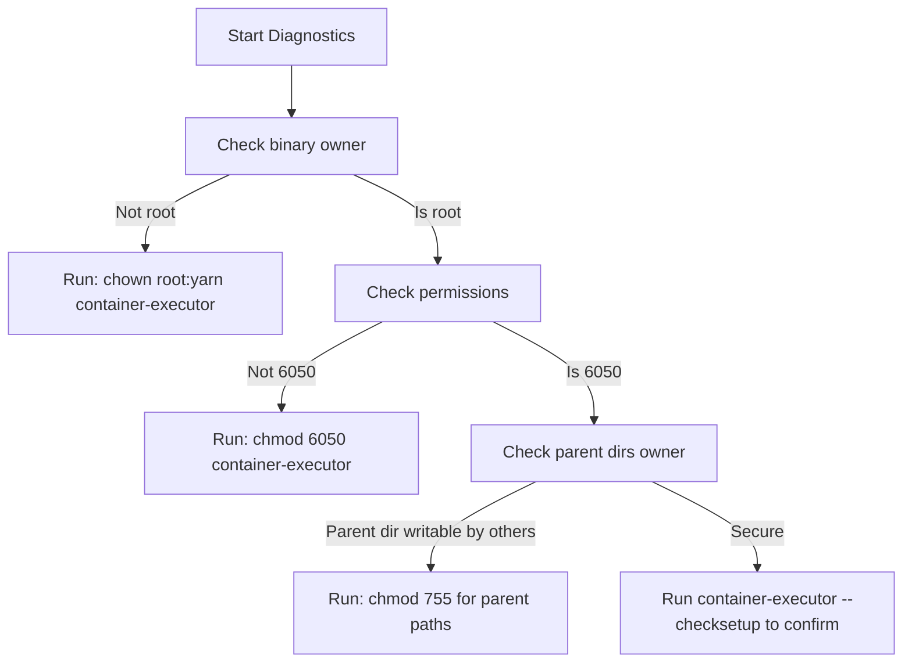

# YARN + Docker Production Troubleshooting Playbook

This document serves as an operational troubleshooting playbook for system administrators and platform reliability engineers running containerized workloads on Apache Hadoop YARN using the Docker Container Runtime.

---

## 🛠️ Diagnostics & Debugging Command Reference

Before diagnosing specific errors, use these commands on the affected **NodeManager** hosts to check the health of YARN container orchestrations:

```bash
# 1. Inspect NodeManager local log logs (default location)
tail -n 200 /var/log/hadoop-yarn/hadoop-yarn-nodemanager-*.log

# 2. Inspect docker engine logs (systemd-based machines)
journalctl -u docker -n 100 --no-pager

# 3. Test if the 'yarn' user can access the docker daemon
sudo -u yarn docker info

# 4. View container-executor configurations and permissions
ls -l /usr/bin/container-executor
cat /etc/hadoop/container-executor.cfg

# 5. Extract container-executor validation reports
/usr/bin/container-executor --checksetup
```

---

## 📋 Common Troubleshooting Scenarios

| Issue ID | Trouble Category | Symptoms | Root Cause | Resolution |
| :--- | :--- | :--- | :--- | :--- |
| **ERR-01** | **Docker Image Pull Failure** | YARN task fails immediately with status code `EXIT_PRELAUNCH_FAILURE`. NodeManager logs show `image not found` or `connection timed out`. | The NodeManager is unable to download the requested Docker image from the registry due to network blockages, DNS failure, or lack of credentials. | 1. Ensure the NodeManager host has internet connectivity or is configured with the proxy.<br>2. Pre-pull the image manually on all nodes: `docker pull <image>`<br>3. Verify the registry is added to `docker.allowed.registries` in `container-executor.cfg`. |
| **ERR-02** | **Container Launch Failed** | NodeManager log shows: `Container launch failed... exit code: 1` or `Docker container failed to start`. | Docker daemon socket is unreachable, or the Docker command arguments generated by YARN are unsupported by the local Docker Engine version. | 1. Verify Docker is running: `systemctl status docker`.<br>2. Confirm the Docker socket `/var/run/docker.sock` has permissions allowing the `yarn` group to read/write (e.g. `chmod 660`).<br>3. Review `yarn.nodemanager.runtime.linux.docker.capabilities` in `yarn-site.xml`. |
| **ERR-03** | **Permission Denied (Security)** | Launch log shows: `docker run: permission denied` or `Container-executor error: user banned`. | The user submitting the job is either blocked by `banned.users` or does not meet the `min.user.id` threshold inside `container-executor.cfg`. | 1. Double check the submitter's UID (`id -u <username>`). If it is below `1000`, adjust `min.user.id` or run using a standard system account.<br>2. Ensure the user is not listed under `banned.users` in `container-executor.cfg`. |
| **ERR-04** | **LinuxContainerExecutor Configuration Error** | NodeManager fails to start up, logging: `Invalid permissions on container-executor binary` or `setuid configuration error`. | The `container-executor` binary does not have setuid permissions, or its parent directories are not securely owned by root. | 1. Secure the binary: `chown root:yarn /usr/bin/container-executor`.<br>2. Set setuid bits: `chmod 6050 /usr/bin/container-executor`.<br>3. Verify all parent directories (`/`, `/usr`, `/usr/bin`) are owned by root and writable *only* by root. |
| **ERR-05** | **Resource Limit Exceeded (OOM)** | Container is terminated by NodeManager with exit status `137` (SIGKILL). YARN status shows `Container killed by NodeManager for exceeding memory limits`. | The workload requested a memory allocation smaller than what the application actually consumes, triggering CGroups OOM Killer or YARN's physical memory monitor. | 1. Allocate more memory via CLI: `-container_memory <higher_value>`.<br>2. Set `yarn.nodemanager.pmem-check-enabled` to `false` if you want to let CGroups soft-limits handle it instead of hard YARN killings.<br>3. Increase JVM heap buffer margins (`-Xmx`). |
| **ERR-06** | **Image Version Mismatch / Drift** | Applications yield inconsistent run results on different cluster hosts. | Some NodeManagers run outdated cached versions of the Docker image because the image was updated in the registry with the same tag (e.g. `latest`), but nodes didn't pull the update. | 1. Avoid using mutable tags like `latest` in production; use specific digests or semantic versions (e.g. `v1.2.3`).<br>2. Configure `yarn.nodemanager.runtime.linux.docker.image-pull.policy` to `always` in `yarn-site.xml`. |
| **ERR-07** | **Network Connectivity Issues** | Containerized tasks cannot connect to HDFS NameNode or YARN ResourceManager, throwing connection timeouts. | The Docker container network isolation prevents the container from resolving or routing to the host's physical network adapters. | 1. Configure the Docker network to `host` mode or ensure the bridge network is attached to the same overlay network as Hadoop.<br>2. Add NameNode hosts to `yarn.nodemanager.runtime.linux.docker.allowed-container-networks` and set the container default network to a bridge that routes correctly. |
| **ERR-08** | **Container Cleanup Failures** | Workers run out of disk space. Host shows dozens of orphaned Docker containers in `exited` state and dangling image layers. | YARN failed to garbage-collect dead Docker containers because of system crashes or misconfigured local cache directory cleanup schedules. | 1. Set up Docker image GC on the host: `docker system prune -f --filter "until=24h"`.<br>2. Enable YARN cleanups: Ensure `yarn.nodemanager.delete.debug-delay-sec` is not set too high (defaults to `0`).<br>3. Automate cron jobs executing `docker rm $(docker ps -a -q -f status=exited)` weekly. |

---

## 🔍 In-Depth Diagnostic Scenarios

### Detailed Walkthrough: Debugging container-executor permission errors

When configuring `LinuxContainerExecutor`, Hadoop is highly sensitive to folder permissions. If YARN NodeManager fails with:
`main : command-executor binary must be owned by root and have group owned by yarn`

Run the following diagnostics flow:



To repair all paths, execute:
```bash
# Secure the executor binary
sudo chown root:yarn /usr/bin/container-executor
sudo chmod 6050 /usr/bin/container-executor

# Secure the config file
sudo chown root:yarn /etc/hadoop/container-executor.cfg
sudo chmod 0400 /etc/hadoop/container-executor.cfg
```
