# 🚀 30 Days of Modern Hadoop Ecosystem — Day 9: Apache ZooKeeper Coordination

## 📌 Lesson Overview
Distributed systems lack a global clock or shared memory, making coordination one of the most fundamental challenges in modern software engineering. Without coordination, independent nodes in a cluster cannot safely agree on which node is the master, what the configuration is, or which servers are currently online. This module covers **Apache ZooKeeper**, the industry-standard distributed coordination service that underpins the Hadoop ecosystem, Apache Kafka, HBase, and other distributed platforms.

By the end of this module, you will understand the theoretical limits of distributed consensus, deep-dive into ZooKeeper's architecture and the **Zab (ZooKeeper Atomic Broadcast) protocol**, explore its internal state machines, deploy a 3-node containerized ensemble, configure automated diagnostic validation, and study real-world production playbooks and case studies.

---

# SECTION 1 — INTRODUCTION TO DISTRIBUTED COORDINATION

## 1. Why Distributed Coordination Exists
In a single-machine application, coordination is managed by the operating system using mutexes, semaphores, locks, and shared memory. However, in a distributed system (like HDFS, YARN, or HBase), processes run on separate physical servers connected by a network. Networks are unreliable: they drop packets, reorder messages, partition clusters, and introduce arbitrary delays. 

Distributed coordination is required to resolve:
1. **Group Membership:** Knowing which nodes are active and healthy.
2. **Leader Election:** Agreeing on a single "leader" or "primary" node to perform updates.
3. **Locking & Synchronization:** Ensuring only one node performs a critical write action at any time.
4. **Metadata & Configuration Management:** Propagating configuration changes to all nodes atomically.

## 2. Problems in Distributed Systems
Distributed coordination is uniquely difficult because of:
- **Asynchronous Networks:** There is no guarantee on how long a message takes to travel. A delayed message is indistinguishable from a crashed node.
- **Partial Failures:** Some nodes can fail while others continue running. A system must continue to make progress even under partial failure.
- **The Consensus Problem:** The theoretical impossibility of guaranteeing consensus in an asynchronous network if even a single node can crash (the Fischer-Lynch-Paterson or FLP Impossibility Result). 

To build practical systems, we must relax the asynchronous assumption or design protocols that sacrifice availability under partitions to guarantee consistency.

## 3. CAP Theorem Considerations
The CAP Theorem states that a distributed system can guarantee at most two of the following properties:
- **Consistency (C):** Every read receives the most recent write or an error.
- **Availability (A):** Every non-failing node returns a non-error response, without guaranteeing it contains the most recent write.
- **Partition Tolerance (P):** The system continues to operate despite an arbitrary number of messages being dropped or delayed by the network.

In any real-world network, partitions are inevitable. Thus, we must choose between **CP** (Consistency and Partition Tolerance) or **AP** (Availability and Partition Tolerance). 

**ZooKeeper is a CP system**. Under a network partition, ZooKeeper prioritizes consistency. If a partition divides the ZooKeeper cluster into two segments such that a majority quorum cannot be reached in one segment, that segment will stop responding to client requests. ZooKeeper guarantees that clients will never read stale or conflicting metadata from separate nodes that have diverged.

## 4. Evolution of ZooKeeper
Before ZooKeeper, every distributed system (like HDFS or HBase) had to write its own custom consensus protocol and group membership manager. These custom protocols were notoriously buggy, prone to race conditions, and difficult to test. 

In 2010, Yahoo! Research developed ZooKeeper, inspired by Google's proprietary **Chubby** lock service. ZooKeeper was designed not as a general-purpose lock manager, but as a generic, high-performance hierarchical coordination engine. It was subsequently open-sourced under the Apache Software Foundation and became the coordination backbone of the entire modern Hadoop ecosystem.

## 5. Where ZooKeeper Fits in the Hadoop Ecosystem
ZooKeeper is the coordination hub for several core big data services:
- **HDFS High Availability:** Tracks the state of the Active and Standby NameNodes. The ZooKeeper Failover Controller (ZKFC) uses ZooKeeper's ephemeral nodes to acquire the active lease lock and coordinate failovers.
- **YARN ResourceManager HA:** Coordinates the election of the active ResourceManager and maintains resource allocation states during switchovers.
- **Apache HBase:** Manages region assignments, tracks active RegionServers, coordinates Master node election, and tracks split-brain situations.
- **Apache Kafka (pre-KRaft):** Tracks broker registrations, manages controller elections, tracks partition leader assignments, and manages topic configurations.

### ZooKeeper Ensemble Architecture
The following diagram illustrates how clients interact with the ZooKeeper ensemble, showing the distinction between Leader, Follower, and Observer roles.

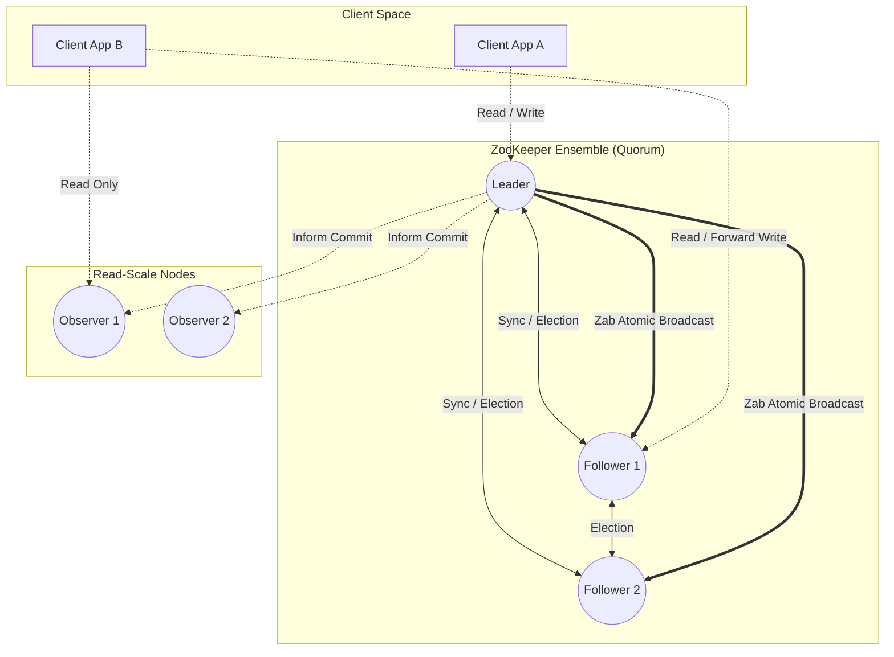

---

# SECTION 2 — THE PROBLEM STATEMENT

To appreciate why ZooKeeper is essential, we must examine the architectural failures that occur when clusters attempt coordination without a dedicated consensus layer.

## 1. Traditional Cluster Failures

### A. Multiple Masters & Split Brain
If a cluster network splits into two isolated zones due to a switch failure, both zones might elect their own Master. If both Masters begin modifying storage metadata simultaneously, they will permanently corrupt the shared filesystem. This state is known as **Split Brain**.

### B. Manual Failover Hazards
In early Hadoop clusters, failover was manual. A human operator had to log in, identify the failed master, verify it was dead, and manually promote the standby. This led to high Mean Time to Recovery (MTTR) and human errors (e.g., promoting a standby while the active master was still running, leading to split-brain).

### C. Static Configurations
Hardcoding server IP lists in client configurations makes scaling difficult. If a node is added or replaced, all client applications must be updated and restarted to discover the new node.

### D. Race Conditions in Distributed Locks
If multiple nodes try to acquire a shared resource without a centralized atomic lock service, timing anomalies can result in multiple nodes believing they hold the lock, leading to data corruption.

## 2. Before vs. After ZooKeeper Coordination

```mermaid
graph TD
    subgraph Before: Decoupled Coordination (Split-Brain Hazard)
        M1[Master A - Network Partitioned] -->|Writes Metadata| Storage1[(Shared Storage)]
        M2[Master B - Assumes Master Role] -->|Writes Metadata| Storage1
        Note over M1, M2: Both nodes believe they are Active primary. Storage corrupted!
    end

    subgraph After: ZooKeeper-Centric Coordination (Safe CP)
        ZK1[ZooKeeper Quorum]
        AM1[Master A - Active] <-->|Acquires Lock / Ephemeral Node| ZK1
        AM2[Master B - Standby] <-->|Watches Active Ephemeral Node| ZK1
        AM1 -->|Writes Metadata| Storage2[(Shared Storage)]
        AM2 -.->|Blocked from writes| Storage2
    end
```

By introducing a ZooKeeper ensemble:
1. **Strict Ephemeral Leases:** The active master creates an ephemeral znode. If the active master crashes or loses connection, its session expires, and ZooKeeper automatically deletes the ephemeral node.
2. **Watch Alerts:** The standby master monitors the ephemeral znode via a watch. When the node is deleted, ZooKeeper pushes a notification to the standby master, which instantly initiates failover.
3. **Fencing Mechanisms:** ZooKeeper prevents split-brain by ensuring only a single master can hold the primary lease at any time.

---

# SECTION 3 — ARCHITECTURE DEEP DIVE

Apache ZooKeeper is a replicated, hierarchical, tree-structured coordination service. It achieves high throughput by keeping its entire data tree in memory and replicating writes to disk for durability.

## 1. Core Architectural Components

### A. ZooKeeper Ensemble
A ZooKeeper cluster is called an **Ensemble**. To function correctly, the ensemble requires a **Quorum** of active nodes. A quorum is a strict majority of nodes.
$$\text{Quorum Size} = \lfloor N/2 \rfloor + 1$$
For this reason, ZooKeeper ensembles are always deployed with an **odd number of nodes** (3, 5, 7, etc.).

### B. Server Roles

| Role | Reads | Writes | Participates in Elections | Participates in Commits |
| :--- | :--- | :--- | :--- | :--- |
| **Leader** | Yes (local memory) | Yes (initiates broadcast) | Yes | Yes (evaluates quorum) |
| **Follower** | Yes (local memory) | Forwards to Leader | Yes | Yes (ACKs proposals) |
| **Observer** | Yes (local memory) | Forwards to Leader | No | No (informed of commits) |

*Note: Observers allow the cluster to scale read workloads without degrading write performance, since writes must wait for ACKs from a majority of voting nodes.*

### C. Client Connection State Machine
A client connects to a single ZooKeeper server via TCP. If the connection fails, the client library automatically handles reconnection to other servers in the ensemble.

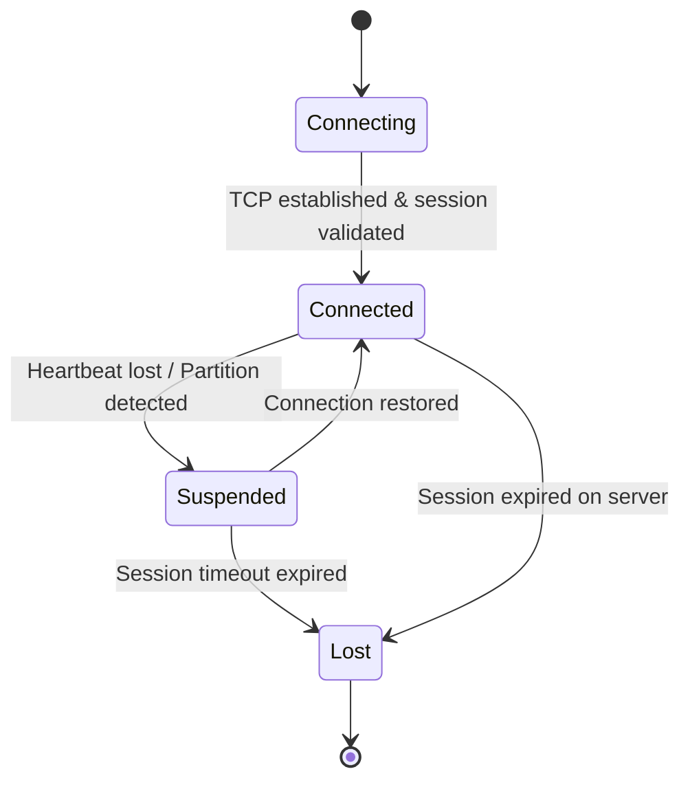

## 2. Three-Node Cluster Topology
This diagram describes the port configuration and physical connection topology of a standard 3-node ZooKeeper cluster.

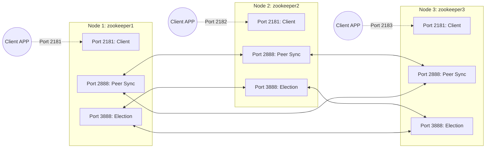

## 3. Client Request Flow
The following sequence details how client reads are processed locally, and how write operations are forwarded and synchronized across the ensemble.

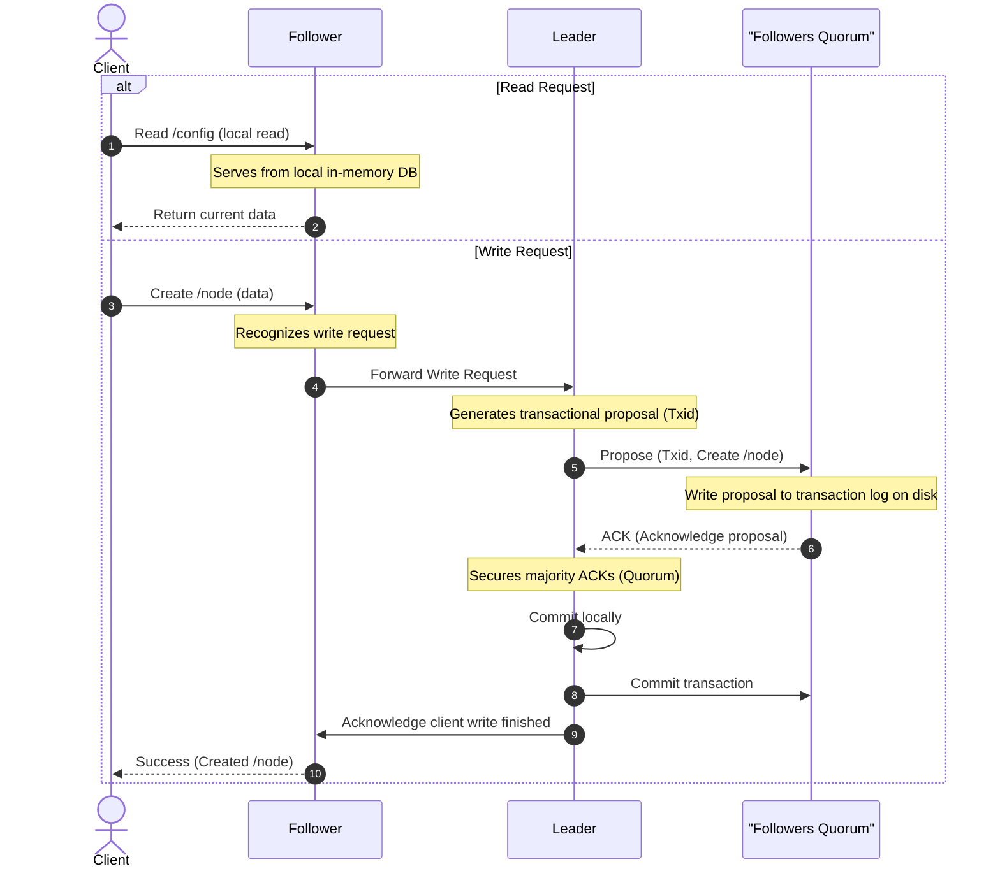

---

# SECTION 4 — INTERNAL WORKING & LOW-LEVEL MECHANICS

## 1. Client Connection & Session Establishment
When a client instantiates a connection, it negotiates a `sessionTimeout` with ZooKeeper.
1. The server generates a unique 64-bit **Session ID** and a secret password salt.
2. The server returns the Session ID and salt to the client.
3. If the client disconnects, it can reconnect to any node in the ensemble using this Session ID and password salt to recover its session and active watches.
4. Heartbeats (ping requests) are exchanged every `tickTime` interval. If no heartbeats arrive within the negotiated timeout, the server expires the session.

## 2. ZNode Creation & Transaction Log Serialization
Every write request (create, delete, set data) changes ZooKeeper's state and is processed as a transaction.
1. The Leader translates the write request into an idempotent command.
2. The Leader assigns it a monotonically increasing 64-bit Transaction ID called **Zxid**.
3. **Zxid Structure:** The high 32 bits represent the **Epoch** (incremented when a new leader is elected), and the low 32 bits represent the transaction sequence counter.
4. The transaction is serialized to a Write-Ahead Log (WAL) on disk before the memory state machine is modified.

```
       Zxid (64-bit Integer)
+-------------------------+-------------------------+
|    Epoch (32 bits)      |   Counter (32 bits)     |
|   e.g., Leader term 3   |  e.g., Transaction 145  |
+-------------------------+-------------------------+
```

## 3. Zab Protocol (ZooKeeper Atomic Broadcast)
The Zab protocol is designed specifically for primary-backup systems. Unlike general consensus protocols like Paxos, Zab ensures that all transactions are committed in the exact order they were proposed.

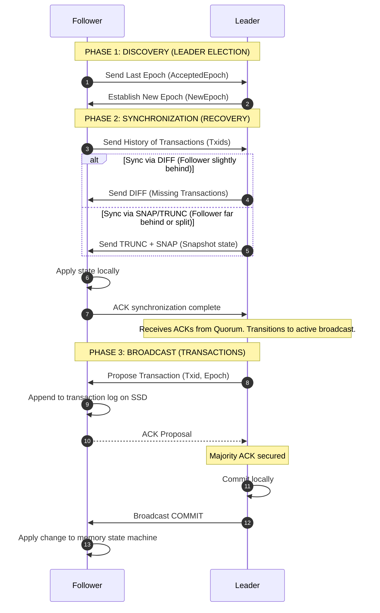

## 4. Leader Election Workflow
This diagram details the state comparisons and logical paths executed during the Fast Leader Election (FLE) process.

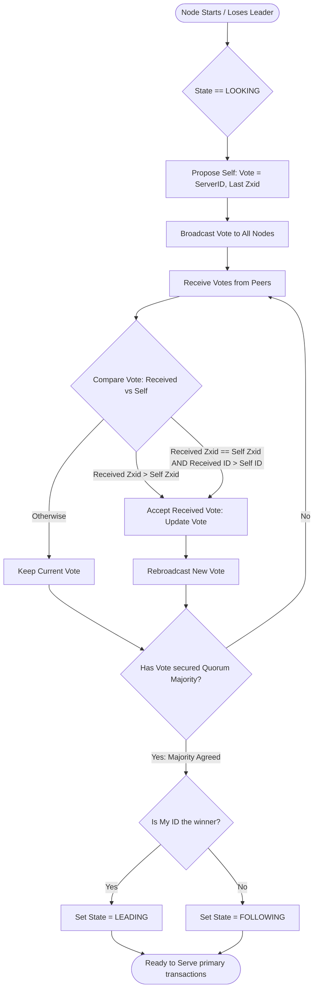

---

# SECTION 5 — CORE CONCEPTS

## 1. ZNode Types
ZooKeeper supports several ZNode types, depending on durability and behavior:

- **Persistent Nodes:** Exist until explicitly deleted. Suitable for static configuration metadata.
- **Ephemeral Nodes:** Tied to the client session. If the client session terminates or times out, ZooKeeper automatically deletes these nodes. *Important: Ephemeral nodes cannot have children.*
- **Sequential Nodes (Persistent/Ephemeral):** ZooKeeper appends a 10-digit, zero-padded, monotonically increasing counter to the name. Used for queueing, locks, and leader election.
- **Container Nodes:** Useful for recipes like locks. A container node is deleted by the server when its last child is deleted.
- **TTL Nodes:** Automatically deleted if they have no changes within a specified Time-To-Live.

### ZNode Hierarchy
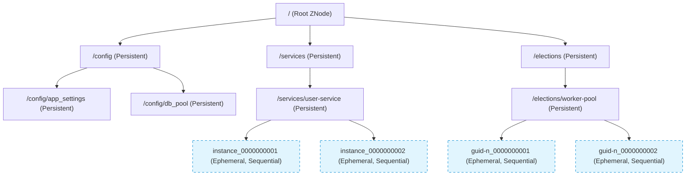

## 2. Watches (Event-Driven Architecture)
Watches allow clients to monitor znodes without polling.
- **One-Time Trigger:** A watch event is dispatched to the client exactly once. To receive subsequent updates, the client must register a new watch during a subsequent read.
- **Ordered Execution:** ZooKeeper guarantees that watch events are sent to clients *before* any new read command returns the updated data.
- **Watch Types:**
  - `DataWatch`: Watches for changes to a znode's data.
  - `ChildrenWatch`: Watches for changes to the list of children under a znode.

### Watch Notification Flow
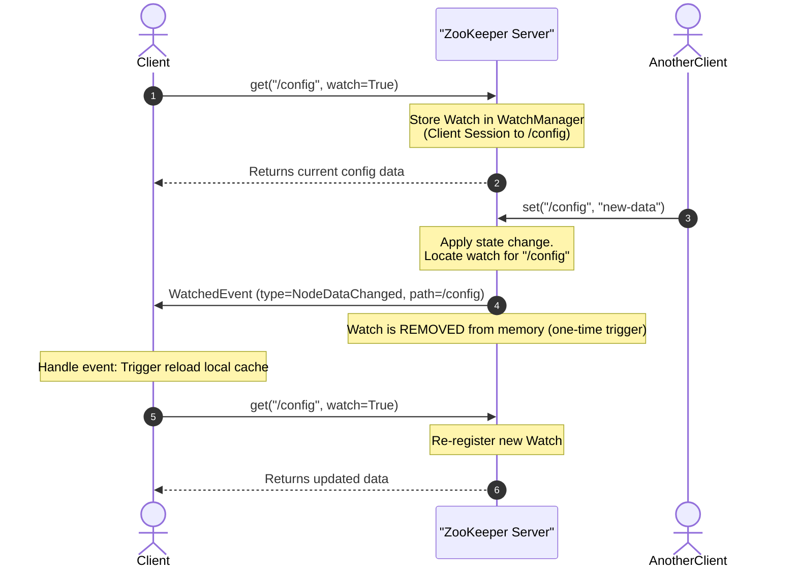

---

# SECTION 6 — PRODUCTION ENGINEERING & OPERATIONS

Operating ZooKeeper in high-throughput enterprise environments requires careful capacity planning, disk segregation, JVM optimization, and monitoring.

## 1. Ensemble Sizing Guidelines
Always deploy an odd number of voting nodes.

| Ensemble Size | Fault Tolerance (Crashes Allowed) | Quorum Majority Required | Notes |
| :--- | :--- | :--- | :--- |
| **1** | 0 | 1 | Testing only. No high availability. |
| **3** | 1 | 2 | Smallest resilient production setup. |
| **5** | 2 | 3 | **Highly Recommended**. Tolerates maintenance of 1 node while still allowing another node to fail. |
| **7** | 3 | 4 | Large clusters. Write latency increases due to larger quorum ACKs. |

## 2. Quorum Consensus Logic
This flowchart illustrates how ZooKeeper dynamically evaluates quorum majorities for cluster survival.

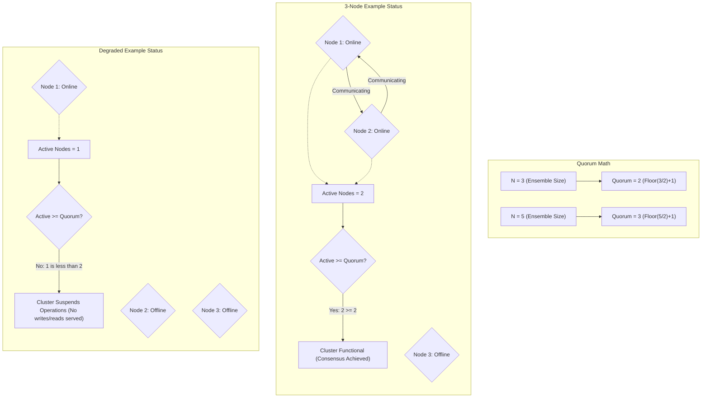

## 3. Disk Isolation for Performance (Critical)
ZooKeeper must block write requests until the transaction is written and flushed to disk (`fsync`). If the disk writing ZooKeeper logs is shared with other applications (like Hadoop datanodes or HBase logs), ZooKeeper latency will spike, leading to session timeouts.
> [!IMPORTANT]
> **Production Best Practice:** Separate `dataDir` (stores database snapshots) and `dataLogDir` (stores transaction logs) onto physical disks. `dataLogDir` should be hosted on high-performance dedicated SSDs.

## 4. JVM and Garbage Collection (GC) Optimization
Long GC pauses suspend ZooKeeper threads. If a GC pause exceeds the session timeout, followers will drop from the leader, and clients will lose their sessions.

### Recommended JVM Flags
```text
-Xms4g -Xmx4g
-XX:+UseG1GC
-XX:MaxGCPauseMillis=50
-XX:+ParallelRefProcEnabled
-XX:+AlwaysPreTouch
```
Avoid overallocating memory. If ZooKeeper memory exceeds the physical RAM, OS page swapping will degrade performance.

## 5. Monitoring & Telemetry (Key Metrics)

Monitor these metrics closely using Prometheus and Grafana:

| Metric Name | Type | Description | Alert Condition |
| :--- | :--- | :--- | :--- |
| `zk_avg_latency` | Gauge | Average request latency (ms) | $> 50$ ms |
| `zk_num_alive_connections` | Gauge | Active client connections | Near client count limits |
| `zk_outstanding_requests` | Gauge | Queued client requests | $> 100$ |
| `zk_open_file_descriptor_count` | Gauge | Used file descriptors | $> 80\%$ of limits |
| `zk_synced_followers` | Gauge | Active followers (Leader only) | $< \text{Ensemble Size} - 1$ |
| `zk_pending_syncs` | Gauge | Syncs waiting to be written | $> 10$ |

---

# SECTION 7 — HANDS-ON LAB: DEPLOY AND EXPLORE A 3-NODE CLUSTER

This lab builds a local 3-node ZooKeeper ensemble.

### Lab Files & Structure
Ensure you have created these files in your workspace under the directory structure:
- `/configs` : Contains configuration properties.
- `/docker` : Contains the deployment compose scripts.
- `/scripts` : Diagnostics and test files.

---

## Step 7.1 — Configuration Implementation

We define configurations for `zookeeper1`, `zookeeper2`, and `zookeeper3` mapping port ranges and properties.

`configs/zoo1.cfg`:
```properties
tickTime=2000
initLimit=10
syncLimit=5
dataDir=/data
dataLogDir=/datalog
clientPort=2181
admin.enableServer=true
admin.serverPort=8080
maxClientCnxns=60
autopurge.snapRetainCount=5
autopurge.purgeInterval=1
server.1=zookeeper1:2888:3888
server.2=zookeeper2:2888:3888
server.3=zookeeper3:2888:3888
metricsProvider.className=org.apache.zookeeper.metrics.prometheus.PrometheusMetricsProvider
metricsProvider.httpHost=0.0.0.0
metricsProvider.httpPort=7000
metricsProvider.exportJvmInfo=true
4lw.commands.whitelist=*
```
*(Nodes 2 and 3 use matching configurations with unique node paths).*

---

## Step 7.2 — Docker Infrastructure

We build a customized image adding netcat and iproute2.

`docker/Dockerfile`:
```dockerfile
FROM zookeeper:3.8.4
USER root
RUN apt-get update && apt-get install -y --no-install-recommends \
    netcat-openbsd iproute2 curl dnsutils procps && rm -rf /var/lib/apt/lists/*
USER zookeeper
EXPOSE 2181 2888 3888 8080 7000
```

`docker/docker-compose.yml`:
```yaml
version: '3.8'

services:
  zookeeper1:
    build: { context: ., dockerfile: Dockerfile }
    container_name: zookeeper1
    hostname: zookeeper1
    environment:
      ZOO_MY_ID: 1
      JVMFLAGS: "-Xmx512m -Xms512m -Dlogback.configurationFile=/conf/logback.xml"
      ZOO_4LW_COMMANDS_WHITELIST: "stat,ruok,conf,isrv,mntr,ruok,wchs"
    volumes:
      - ../configs/zoo1.cfg:/conf/zoo.cfg
      - ../configs/logback.xml:/conf/logback.xml
      - zk1_data:/data
      - zk1_datalog:/datalog
    ports:
      - "2181:2181"
      - "8081:8080"
      - "7001:7000"
    healthcheck:
      test: ["CMD-SHELL", "echo ruok | nc localhost 2181 | grep imok"]
      interval: 10s
      timeout: 5s
      retries: 5
    networks:
      zk-net: { ipv4_address: 172.20.0.13 }

  zookeeper2:
    build: { context: ., dockerfile: Dockerfile }
    container_name: zookeeper2
    hostname: zookeeper2
    environment:
      ZOO_MY_ID: 2
      JVMFLAGS: "-Xmx512m -Xms512m -Dlogback.configurationFile=/conf/logback.xml"
      ZOO_4LW_COMMANDS_WHITELIST: "stat,ruok,conf,isrv,mntr,ruok,wchs"
    volumes:
      - ../configs/zoo2.cfg:/conf/zoo.cfg
      - ../configs/logback.xml:/conf/logback.xml
      - zk2_data:/data
      - zk2_datalog:/datalog
    ports:
      - "2182:2181"
      - "8082:8080"
      - "7002:7000"
    healthcheck:
      test: ["CMD-SHELL", "echo ruok | nc localhost 2181 | grep imok"]
      interval: 10s
      timeout: 5s
      retries: 5
    networks:
      zk-net: { ipv4_address: 172.20.0.12 }

  zookeeper3:
    build: { context: ., dockerfile: Dockerfile }
    container_name: zookeeper3
    hostname: zookeeper3
    environment:
      ZOO_MY_ID: 3
      JVMFLAGS: "-Xmx512m -Xms512m -Dlogback.configurationFile=/conf/logback.xml"
      ZOO_4LW_COMMANDS_WHITELIST: "stat,ruok,conf,isrv,mntr,ruok,wchs"
    volumes:
      - ../configs/zoo3.cfg:/conf/zoo.cfg
      - ../configs/logback.xml:/conf/logback.xml
      - zk3_data:/data
      - zk3_datalog:/datalog
    ports:
      - "2183:2181"
      - "8083:8080"
      - "7003:7000"
    healthcheck:
      test: ["CMD-SHELL", "echo ruok | nc localhost 2181 | grep imok"]
      interval: 10s
      timeout: 5s
      retries: 5
    networks:
      zk-net: { ipv4_address: 172.20.0.13 }

networks:
  zk-net:
    name: zk-net
    driver: bridge
    ipam:
      config: [{ subnet: 172.20.0.0/16 }]

volumes:
  zk1_data:
  zk1_datalog:
  zk2_data:
  zk2_datalog:
  zk3_data:
  zk3_datalog:
```

---

## Step 7.3 — Cluster Launch & Quorum Check

1. **Start cluster:**
   ```bash
   ./scripts/start-cluster.sh
   ```
2. **Audit Quorum Mode:**
   ```bash
   ./scripts/verify-quorum.sh
   ```

---

## Step 7.4 — Failover Simulation

1. **Locate leader and stop container:**
   ```bash
   ./scripts/simulate-failure.sh
   ```

---

# SECTION 8 — BUILD FROM SOURCE

Building ZooKeeper from source is useful for compiling custom patches or analyzing components in a debugger.

## 1. Directory Structure of Apache ZooKeeper Source Code
```
zookeeper/
├── zookeeper-server/
│   ├── src/main/java/org/apache/zookeeper/
│   │   ├── server/               # State machine, snapshot, log utilities
│   │   │   ├── quorum/           # Zab protocol & Leader election implementation
│   │   │   │   ├── FastLeaderElection.java
│   │   │   │   ├── Leader.java
│   │   │   │   ├── Follower.java
│   │   │   │   └── QuorumPeer.java
│   │   │   └── ZooKeeperServer.java
│   │   └── ZooKeeper.java        # Main client API class
└── zookeeper-assembly/           # Build packaging scripts
```

## 2. Compiling ZooKeeper Source Code
ZooKeeper uses Maven as its build tool.

### Build workflow:
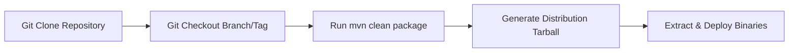

### Build Commands
Clone the repository:
```bash
git clone https://github.com/apache/zookeeper.git
cd zookeeper
git checkout release-3.8.4
```
Compile and skip testing:
```bash
mvn clean package -DskipTests
```
After compilation, the tarball is located at:
`zookeeper-assembly/target/apache-zookeeper-3.8.4-bin.tar.gz`

---

# SECTION 9 — DOCKER DEPLOYMENT GUIDE

## Docker Deployment Topology
The layout describes the file mappings, volumes, host port exports, and networking for the 3-node docker-compose cluster.

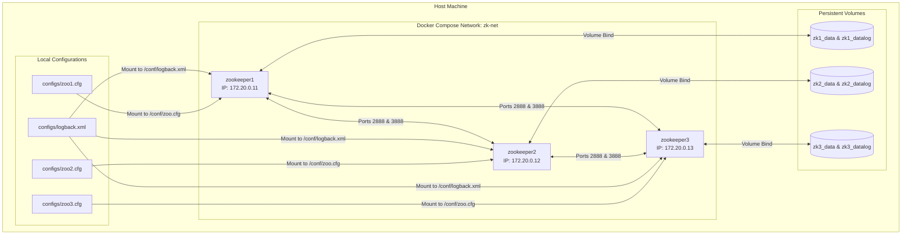

---

# SECTION 10 — LOCAL CLUSTER DEPLOYMENT

## 1. Single-Node Setup (Standalone)
For testing, ZooKeeper can run as a single instance.
`zoo.cfg` for standalone:
```properties
tickTime=2000
dataDir=/var/lib/zookeeper/data
clientPort=2181
```

## 2. Production 5-Node Ensemble Topology
For high-availability environments, a 5-node setup tolerates the loss of 2 nodes simultaneously.
```properties
server.1=zk-prod-1:2888:3888
server.2=zk-prod-2:2888:3888
server.3=zk-prod-3:2888:3888
server.4=zk-prod-4:2888:3888
server.5=zk-prod-5:2888:3888
```

---

# SECTION 11 — VALIDATION

The cluster must be audited using automated scripts. The `scripts/` folder provides the following tools:

## Validation Pipeline Flow
This diagram shows the sequential pipeline to validate the cluster execution status before and after client test suites.

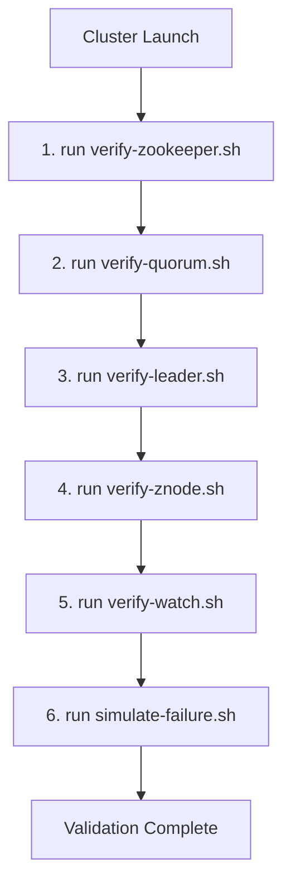

- **verify-zookeeper.sh:** Checks if the containers are active.
- **verify-quorum.sh:** Verifies leader/follower consensus.
- **verify-leader.sh:** Queries active leader.
- **verify-znode.sh:** Tests data writes, updates, and deletes.
- **verify-watch.sh:** Evaluates event notification dispatching.

---

# SECTION 12 — PRODUCTION TROUBLESHOOTING PLAYBOOK

For an operational reference, see the [troubleshooting/playbook.md](file:///d:/30_Days_of_Modern_Hadoop_Ecosystem/Day-09-ZooKeeper-Coordination/troubleshooting/playbook.md).

### Failure Recovery Workflow
This flowchart describes the system failover, election, and recovery sequence if a leader goes offline.

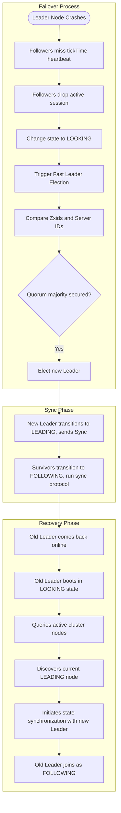

---

# SECTION 13 — REAL-WORLD CASE STUDIES

## 1. Apache Kafka + ZooKeeper
Historically, Kafka relied on ZooKeeper for broker coordination and partition consensus:

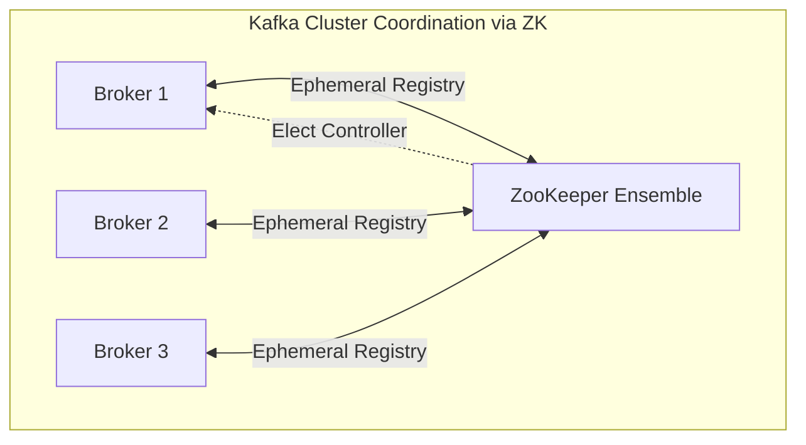

## 2. Hadoop HDFS High Availability
HDFS HA uses ZooKeeper to ensure that only one NameNode is active at any time.

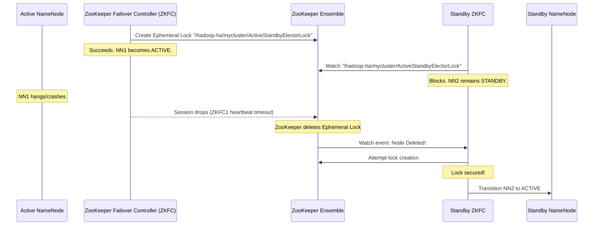

- **ZKFC (ZooKeeper Failover Controller):** A daemon running on both NameNode servers. It monitors the health of its local NameNode.
- **Lock Acquisition:** ZKFC attempts to create `/hadoop-ha/<cluster-id>/ActiveStandbyElectorLock`. The NameNode whose ZKFC creates this lock becomes the **Active NameNode**.
- **Fencing:** If ZKFC detects that the active NameNode has stalled, it deletes its lock. Before the standby NameNode can transition to active, it executes a **fencing command** (e.g., SSH fence, power port cycle) to ensure the former active node is completely dead, preventing split-brain.

---

# SECTION 14 — INTERVIEW QUESTIONS & ANSWERS

## Beginner Questions (1 - 20)

### 1. What is Apache ZooKeeper?
ZooKeeper is a centralized, replicated coordination service for distributed systems. It provides a simple, tree-structured filesystem interface (ZNodes) and exposes primitives like watches, ephemeral nodes, and sessions to build locks, service registries, and configuration managers.

### 2. Is ZooKeeper a database?
No. While it stores data in hierarchical nodes, it is designed strictly for coordinating metadata, not general-purpose storage. The maximum znode size is 1MB, and the entire namespace is loaded into memory to achieve sub-millisecond read latencies.

### 3. What is a ZNode?
A ZNode is a node in the hierarchical tree-like directory structure of ZooKeeper. Each ZNode can contain data (a byte array) and have children.

### 4. What is the difference between a Persistent node and an Ephemeral node?
A **Persistent node** remains in the ZooKeeper data tree until it is explicitly deleted by a client. An **Ephemeral node** is deleted automatically by the server if the client session that created it terminates or times out.

### 5. Why can't Ephemeral nodes have children?
To prevent complexity and memory leaks. Since ephemeral nodes are deleted when client sessions terminate, deleting a parent ephemeral node with many child znodes created by different sessions would create inconsistencies.

### 6. What is a ZNode Sequential counter?
A sequential node is a node where ZooKeeper appends a 10-digit counter suffix (e.g., `node_0000000001`) to the znode path during creation. The counter is unique and monotonically increasing under its parent node.

### 7. What is a Quorum in ZooKeeper?
A Quorum is the minimum number of active voting nodes required for the ZooKeeper cluster to function and commit writes. It is defined as a strict majority:
$$\text{Quorum} \ge \lfloor N/2 \rfloor + 1$$

### 8. Why does ZooKeeper require an odd number of nodes?
An odd number of nodes optimizes resource utilization. A 3-node cluster and a 4-node cluster both require a quorum of 2 nodes to make progress. A 3-node cluster can tolerate 1 failure, whereas a 4-node cluster also can only tolerate 1 failure. Thus, the 4th node adds no extra availability while increasing write latency.

### 9. Can a client write data to a Follower node?
Yes, a client can send a write request to a Follower. However, the Follower does not process the write. It forwards the request to the Leader, which translates the request into a proposal and broadcasts it to the ensemble.

### 10. What is a Watch in ZooKeeper?
A Watch is a one-time callback event handler that a client registers on a ZNode. When the ZNode changes (data update, child changes, deletion), ZooKeeper sends an asynchronous notification to the client.

### 11. What is the Zab protocol?
The Zab (ZooKeeper Atomic Broadcast) protocol is a consensus protocol designed specifically for primary-backup replication in ZooKeeper. It handles leader election, node synchronization, and atomic broadcast of state modifications.

### 12. Explain the difference between Paxos and Zab.
While Paxos is a general consensus protocol designed for state machine replication, Zab is designed specifically for primary-backup recovery. Zab enforces strict FIFO order of commits, ensuring that changes are committed in the exact order they were proposed by the leader.

### 13. What is a Zxid?
A Zxid (ZooKeeper Transaction ID) is a 64-bit integer assigned to every state change transaction. The high 32 bits represent the epoch (leader term), and the low 32 bits represent a monotonic counter.

### 14. What are the four-letter word commands?
They are short Netcat-compatible debugging commands (e.g., `ruok`, `stat`, `mntr`, `wchs`) exposed by ZooKeeper to retrieve service state, client connection counts, and watch details.

### 15. What does the "ruok" command return if ZooKeeper is running?
It returns the string `imok`.

### 16. What is a Session Timeout?
It is the maximum duration that a ZooKeeper server waits to receive a heartbeat from a connected client before closing its session and deleting all ephemeral znodes created by that client.

### 17. How is ZooKeeper secured?
ZooKeeper supports Access Control Lists (ACLs) on znodes, TLS encryption for client-to-server and peer-to-peer communication, and SASL (Kerberos) client authentication.

### 18. What is the role of an Observer?
Observers are non-voting nodes. They replicate ZooKeeper state and serve client read requests, but do not participate in leader elections or transaction commits, allowing the cluster to scale read throughput without slowing writes.

### 19. What is a Split Brain?
Split-brain occurs when a network partition divides a cluster, and nodes in both segments attempt to act as the primary master, causing divergent updates.

### 20. How does ZooKeeper prevent Split Brain?
ZooKeeper prevents split-brain using **Quorum majority requirements**. A leader cannot be elected or write to disk unless it can communicate with a majority of nodes. A network partition cannot contain two separate majorities.

---

## Intermediate Questions (21 - 40)

### 21. Describe the phases of the Zab Protocol.
1. **Discovery (Leader Election):** Nodes locate each other and elect a prospective leader based on the highest Zxid.
2. **Synchronization (Recovery):** The newly elected leader syncs its state database with followers using DIFF, TRUNC, or SNAP commands.
3. **Broadcast:** The leader accepts client write requests, broadcasts them as proposals, collects ACKs, and commits transactions.

### 22. How does Fast Leader Election (FLE) work?
All nodes boot in the `LOOKING` state. Each node proposes itself as leader, voting with its Server ID and last transaction ID (`Zxid`). Nodes broadcast their votes. Upon receiving a vote from a peer, a node compares it with its own. It updates its vote if the peer has a higher epoch, a higher Zxid, or a higher Server ID. Votes are rebroadcast. Once a vote receives a quorum majority, the winner becomes `Leader` and others become `Followers`.

### 23. What happens if a ZooKeeper node runs out of disk space?
If the disk holding the transaction logs becomes full, ZooKeeper cannot execute `fsync` to commit transactions. It will stop accepting writes and the node may shut down or enter an unresponsive state.

### 24. What are ZooKeeper ACLs?
ACLs control permissions on specific znodes. Unlike UNIX filesystems, ACLs are not recursive. Permissions include:
- `CREATE` (c): Allow creating child nodes.
- `READ` (r): Allow reading node data and listing children.
- `WRITE` (w): Allow writing node data.
- `DELETE` (d): Allow deleting child nodes.
- `ADMIN` (a): Allow changing permissions.

### 25. Explain the differences between ZooKeeper and Chubby.
- Chubby is Google's locking service, providing explicit lock handles, client caching, and a file system model. It is designed for low-frequency writes.
- ZooKeeper is a wait-free service. Rather than providing locking primitives, it provides basic primitives (ephemeral nodes, watches) so developers can write their own custom coordination recipes. ZooKeeper is optimized for high-frequency updates.

### 26. Why is separating `dataDir` and `dataLogDir` critical?
ZooKeeper writes transactions sequentially to the write-ahead log (`dataLogDir`) and calls `fsync` before committing. If the same disk is writing snapshots (`dataDir`) or handling log files of other applications, disk head seek contention will slow down write speeds, increasing ZooKeeper latencies.

### 27. What is a "stale read" in ZooKeeper, and how can it be prevented?
Since followers serve reads locally from their memory database, a follower that has not yet received a commit message from the leader might serve old data. To guarantee a strictly consistent read, a client should call `sync(path)` before running the read command.

### 28. What is the purpose of the `sync` command?
The `sync` command forces the ZooKeeper server serving the client to synchronize its memory state with the leader before processing subsequent requests, ensuring the client receives the most up-to-date data.

### 29. How does ZooKeeper handle session recovery during client reconnection?
When a client loses its connection, the client library attempts to reconnect to other servers in the ensemble. It sends the original Session ID and password salt. If it reconnects before the session timeout expires on the server, the session remains active and watches are re-registered.

### 30. What happens if a client reconnects *after* the session timeout has expired?
The server returns a `SessionExpiredException`. The client must instantiate a new ZooKeeper client object, generating a new session. Any ephemeral nodes associated with the old session are lost.

### 31. Explain the "one-time trigger" mechanism of watches.
When a watch is set on a znode, it is stored in the server's memory. When the znode changes, the server dispatches the watch event to the client and deletes the watch from its memory. The client must send a new read command to register a new watch.

### 32. What is the risk of having too many client watches?
Every watch consumes heap memory on the ZooKeeper server. If clients register millions of watches, the server JVM may suffer high memory consumption and frequent GC pauses, leading to instability.

### 33. How does Apache Curator simplify ZooKeeper application development?
Apache Curator handles connection loss retries, manages sessions, and provides high-level implementations (recipes) for distributed locks, leader latches, barriers, and cache watchers, shielding developers from low-level ZooKeeper API complexities.

### 34. What is a "Herd Effect" in distributed locking, and how does ZooKeeper mitigate it?
The Herd Effect occurs when a lock is released, and all waiting clients are notified simultaneously, causing a storm of client connections competing for the lock. ZooKeeper mitigates this by using ephemeral-sequential nodes. Clients register a watch *only* on the node immediately preceding theirs in the sequence list. Only one client is notified when a lock is released.

### 35. Explain the DIFF, TRUNC, and SNAP synchronization options.
- **DIFF:** Leader sends the differences (transactions) to a follower that is slightly behind.
- **TRUNC:** Leader instructs a follower to discard uncommitted transactions from a partitioned state.
- **SNAP:** Leader serializes its entire database state to send to a follower that is too far behind.

### 36. What is the role of the ZKFC in HDFS High Availability?
The ZooKeeper Failover Controller (ZKFC) is a daemon running alongside the NameNode. It monitors the NameNode's health and communicates with ZooKeeper to acquire the active election lock. If the local NameNode is healthy, it maintains the lock; if it fails, ZKFC drops the session to trigger failover.

### 37. Can you use ZooKeeper to store large binary configuration files?
No. ZooKeeper has a default limit of 1MB per node, but storing large files (e.g., >100KB) is not recommended. Large nodes increase memory consumption, slow down replication synchronization, and impact transaction logs.

### 38. How do Observer nodes scale read operations?
Observers do not vote on transactions or participate in elections. By deploying Observers, you can scale read throughput globally across data centers without increasing quorum size, which would otherwise slow down write response times.

### 39. What are the key metrics to monitor in a ZooKeeper cluster?
- Outstanding requests (`zk_outstanding_requests`)
- Latency (`zk_avg_latency`)
- Node state Mode (`zk_synced_followers` on Leader)
- Number of active client connections.

### 40. How does ZooKeeper ensure linearizable writes?
All write requests are forwarded to the Leader. The Leader serializes the requests and assigns each a sequential Transaction ID (`Zxid`). This sequence enforces a strict order of updates across the cluster.

---

## Advanced Questions (41 - 60)

### 41. Explain the formal safety guarantees of the Zab protocol.
Zab guarantees:
- **Agreement:** If a message is committed by one server, it will be committed by all servers in the quorum.
- **Integrity:** If a server commits a message, that message must have been proposed by the leader.
- **Total Order:** If server A commits message 1 before message 2, server B must also commit message 1 before message 2.
- **Causal Consistency (Prefix Property):** If a leader proposes message A before message B, every server must commit A before B.

### 42. How does Zab handle the recovery of transactions proposed by a crashed leader?
During the Discovery and Sync phases, the new leader collects the highest epoch and transaction history from followers. If a transaction was proposed by the old leader but not committed, the new leader determines if it was acknowledged by a quorum. If yes, it commits the transaction; if not, it truncates the transaction from the logs.

### 43. Detail the internal mechanics of how ZooKeeper handles a `NodeDataChanged` event.
When a write transaction commits on a path, the `WatchManager` on the primary server retrieves the list of watches registered on that path. It removes them from the registry and serializes a `WatchedEvent` packet, sending it over the TCP socket to the client. The client library parses the packet and executes the registered callback function in a dedicated event thread.

### 44. What is the impact of network packet loss on a ZooKeeper quorum?
Temporary packet loss causes connection timeouts. If the packet loss is between followers and the leader, followers may miss heartbeats, causing the leader to step down or followers to re-enter the `LOOKING` state. If packet loss is between client and server, the client will transition to the `SUSPENDED` state until it reconnects.

### 45. Explain how a distributed lock is implemented using ZooKeeper ephemeral-sequential nodes.
1. Create a parent path `/lock`.
2. Clients create an ephemeral-sequential node: `/lock/guid-lock-`.
3. Call `getChildren("/lock")` to retrieve all nodes.
4. If the client's node has the lowest sequence number, it holds the lock.
5. If not, the client registers a watch on the node with the sequence number immediately preceding theirs.
6. When the watched node is deleted, the client is notified and acquires the lock.

```
/lock
  ├── guid-lock-0000000001  <-- Holds Lock
  ├── guid-lock-0000000002  <-- Watches lock-0000000001
  └── guid-lock-0000000003  <-- Watches lock-0000000002
```

### 46. What happens if a network partition splits a 5-node cluster into 2 and 3 nodes?
- The 2-node partition cannot form a quorum (requires 3 votes). Nodes in this partition transition to `LOOKING` state or reject writes, serving stale reads only if configured to do so.
- The 3-node partition forms a quorum. It elects a leader and continues serving read and write requests.
- When the partition heals, the 2 nodes query the 3-node majority, truncate conflicting states, and sync via DIFF or SNAP.

### 47. Why are ZooKeeper transaction logs pre-allocated?
To minimize disk latency. ZooKeeper pre-allocates file space on disk (usually 64MB blocks filled with zeros) before writing transactions. This avoids OS-level file allocation overhead and metadata updates during high-throughput writes.

### 48. Describe how to perform a rolling upgrade of a ZooKeeper cluster.
1. Upgrade followers one at a time.
2. Stop the target follower container/process.
3. Update the binaries and configuration.
4. Start the follower and verify it syncs and joins the cluster (`Mode: follower`).
5. Repeat for all followers.
6. Trigger leader failover by stopping the leader. The leader will step down and a follower running the new version will be elected.
7. Upgrade the old leader node and restart it.

### 49. How does ZooKeeper prevent disk exhaustion from snapshots?
ZooKeeper creates periodically updated memory database snapshots. Without cleanup, these snapshots fill up the disk. ZooKeeper includes an auto-purge mechanism configured via `autopurge.snapRetainCount` and `autopurge.purgeInterval` in `zoo.cfg` to automatically delete old snapshots and transaction logs.

### 50. Explain the role of the `epoch` in leader election.
The `epoch` acts as a logical clock representing the leader term. It prevents split-brain by ensuring that messages from a partitioned former leader (using an old epoch) are ignored by followers that have moved to a newer epoch.

### 51. What is the difference between Leader Latch and Leader Election recipes in Curator?
- **Leader Latch:** Competes for leadership. Once acquired, the thread blocks. If connection is lost, leadership is released.
- **Leader Election:** Uses a listener pattern. The client joins the election, and a callback is executed when it becomes leader, allowing the thread to perform other tasks.

### 52. Why does ZooKeeper require G1GC garbage collection tuning?
G1GC splits the JVM heap into smaller regions, garbage collecting them incrementally to keep stop-the-world pauses below a target latency (e.g., 50ms). This prevents GC pauses from triggering session timeouts.

### 53. How do you recover from a corrupted transaction log?
1. Check the logs for the corrupt log file name.
2. Move the corrupt transaction log out of the data directory.
3. Start the node. It will sync the missing data from other active quorum nodes.

### 54. Can you run ZooKeeper across multiple data centers?
Yes, but it is not recommended for latency-sensitive setups. Write requests must wait for WAN round-trip ACKs to form a quorum majority. If network latency between data centers is high, write performance will drop.

### 55. What is the default maximum size of a ZNode, and how can it be changed?
The default limit is 1MB. It can be changed by setting the JVM system property `jute.maxbuffer` on both servers and clients. However, increasing this limit is not recommended.

### 56. What are dynamic reconfigurations in ZooKeeper 3.5+?
They allow administrators to change the cluster membership (adding/removing nodes) at runtime without restarting the entire ensemble.

### 57. Explain how HBase uses ZooKeeper to handle RegionServer failures.
RegionServers register as ephemeral nodes under `/hbase/rs`. If a RegionServer fails, its session expires. The HBase Master, which watches `/hbase/rs`, receives a notification, splits the failed RegionServer's WAL, and assigns its regions to other servers.

### 58. How do you configure a ZooKeeper cluster for Kerberos authentication?
Enable JAAS (Java Authentication and Authorization Service) configuration file on startup:
```text
-Djava.security.auth.login.config=/conf/jaas.conf
```
Configure `zoo.cfg` to enable SASL authentication provider:
```properties
authProvider.1=org.apache.zookeeper.server.auth.SASLAuthenticationProvider
requireClientAuthScheme=sasl
```

### 59. Explain the prefix property constraint in Zab.
The prefix property guarantees that if message $m$ is committed on leader $L$ in epoch $e$, and message $m'$ was proposed before $m$ in epoch $e$, then $m'$ must be committed before $m$ on all followers.

### 60. How does ZooKeeper support write durability?
ZooKeeper writes transactions sequentially to the transaction log, forces a disk sync (`fsync`), and replicates the write to a majority quorum before acknowledging completion to the client.

---

# SECTION 15 — KEY TAKEAWAYS

1. **Why ZooKeeper Exists:** Provides a reliable, consistent coordination layer for distributed systems, preventing split-brain and coordinating master failover.
2. **CP System:** Prioritizes Consistency and Partition Tolerance over Availability. Under network partition, ZooKeeper suspends degraded segments to prevent stale metadata writes.
3. **Consensus via Zab:** The Zab protocol replicates states in FIFO order via a designated primary leader, synchronizing history before broadcasting transactions.
4. **ZNode Types:** Ephemeral nodes track client connection states, while sequential nodes facilitate distributed locking and leader election.
5. **Disk Separation:** Separating the transaction log and snapshot directories onto physical disks is critical for maintaining low-latency writes.

---

# SECTION 16 — REFERENCES

1. **ZooKeeper USENIX ATC Paper:** [Hunt et al., 2010](https://www.usenix.org/legacy/event/atc10/tech/full_papers/Hunt.pdf)
2. **Zab Protocol Specification:** [Junqueira et al., 2011](https://ieeexplore.ieee.org/document/5958223)
3. **ZooKeeper Administrator Guide:** [Apache ZooKeeper Doc](https://zookeeper.apache.org/doc/current/zookeeperAdmin.html)
4. **Apache Curator Documentation:** [Apache Curator Recipes](https://curator.apache.org/)
5. **LinkedIn Scaling ZooKeeper Blog:** [LinkedIn Engineering](https://engineering.linkedin.com/blog/2016/10/scaling-zookeeper-in-production)
