# 🚀 30 Days of Modern Hadoop Ecosystem — Day 10: Apache Kafka Architecture

## 📌 Lesson Overview
In modern distributed systems, data is no longer static. It flows continuously from user clicks, database updates, sensor readings, and logs. Traditional batch architectures (like MapReduce and standard HDFS storage) are insufficient for real-time analysis. This module focuses on **Apache Kafka**, the industry-standard distributed event streaming platform.

By the end of this module, you will understand Kafka's fundamental architecture, the shift from traditional message queues to commit-log-based streaming, partition and replica mechanics, the internals of read/write paths under KRaft mode, production tuning strategies, disaster-recovery runbooks, and how to build Kafka from source.

---

# SECTION 1 — INTRODUCTION TO EVENT STREAMING & KAFKA

## 1. The Evolution of Messaging Systems
For decades, systems integrated using either batch transfers (files, database replication) or Remote Procedure Calls (RPC/REST). As system complexity scaled, these integration patterns broke down:
* **Batch Integration**: High latency (hourly/daily updates) made real-time reaction impossible.
* **RPC/REST Integration**: Tight coupling. If Service A needed to notify Services B, C, and D, Service A had to manage multiple HTTP connections, handle individual retry logic, and handle downstream failures.

To solve this, developers introduced **Message-Oriented Middleware (MOM)** (e.g., JMS, ActiveMQ, RabbitMQ). These systems introduced a central queue, decoupling services. However, traditional MOMs were designed for low-throughput enterprise application integration, keeping stateful track of message consumption per client inside the broker memory. This made them architectural bottlenecks.

Apache Kafka was developed at LinkedIn in 2010 to solve this scaling bottleneck, shifting the paradigm from transactional message queues to **distributed, immutable commit logs**.

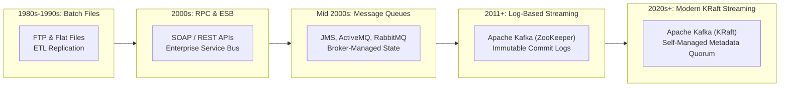

## 2. Why Apache Kafka Was Created
LinkedIn faced an explosion of system connections. They needed to ingest metrics, activity logs, database changelogs, and user tracking data, feeding them into analytics engines (Hadoop) and real-time dashboards. Traditional queues crumbled under this volume because they:
1. Kept message state in the broker, leading to high CPU and RAM overhead per message.
2. Deleted messages once consumed, preventing multiple consumers from reading the same history independently.
3. Lacked native partitioning and replication, making horizontal scaling difficult.

Kafka was designed from the ground up as a **distributed append-only log**. It treats the broker as a simple storage engine, shifting the burden of state management (which message has been read) to the client.

## 3. Traditional Message Queues vs. Apache Kafka
Understanding these differences is critical for distributed systems design:

| Architectural Property | Traditional Message Queues (RabbitMQ, ActiveMQ) | Apache Kafka |
| :--- | :--- | :--- |
| **Data Structure** | Transient Queue (First-In, First-Out memory buffer). | Replicated, Append-Only Disk Commit Log. |
| **State Management** | **Broker-centric**: The broker tracks which message has been delivered/acknowledged and deletes it. | **Client-centric**: The client tracks its read position (**offset**). The broker is stateless regarding client progress. |
| **Data Retention** | Deleted immediately after consumption. | Retained based on time or size limits (e.g., 7 days or 100GB), allowing replay. |
| **Consumption Style** | Point-to-Point (Queue) or Publish-Subscribe (Topic exchange copying messages). | Single Log source read independently by multiple consumers at their own pace. |
| **Throughput & Scale** | Low to moderate. Scale is limited by memory state. | Extremely high. Scales horizontally by partitioning the log across disks/nodes. |

## 4. Event Streaming Fundamentals
Event streaming is the practice of capturing data in real-time from event sources like databases, sensors, mobile devices, and cloud services in the form of streams of events. An **event** represents a fact—an immutable record of something that happened in the business domain (e.g., "User logged in", "Sensor read 22.4°C", "Payment approved"). 

An event stream is a continuous, ordered, replayable, and fault-tolerant sequence of these records.

## 5. Kafka's Role in a Modern Data Platform
In modern enterprise architectures, Kafka acts as the **central nervous system** (or Event Mesh). It sits between real-time event producers (microservices, web servers, databases via Change Data Capture) and downstream systems:
* **Batch Analytics**: Feeding data into HDFS, Amazon S3, or Google Cloud Storage for subsequent processing by Spark, Hive, or Snowflake.
* **Real-time Stream Processing**: Supplying low-latency event streams to processing engines like Apache Spark Structured Streaming, Apache Flink, or Kafka Streams.
* **Operational Databases**: Syncing search indexes (Elasticsearch), caches (Redis), or relational transactional databases.

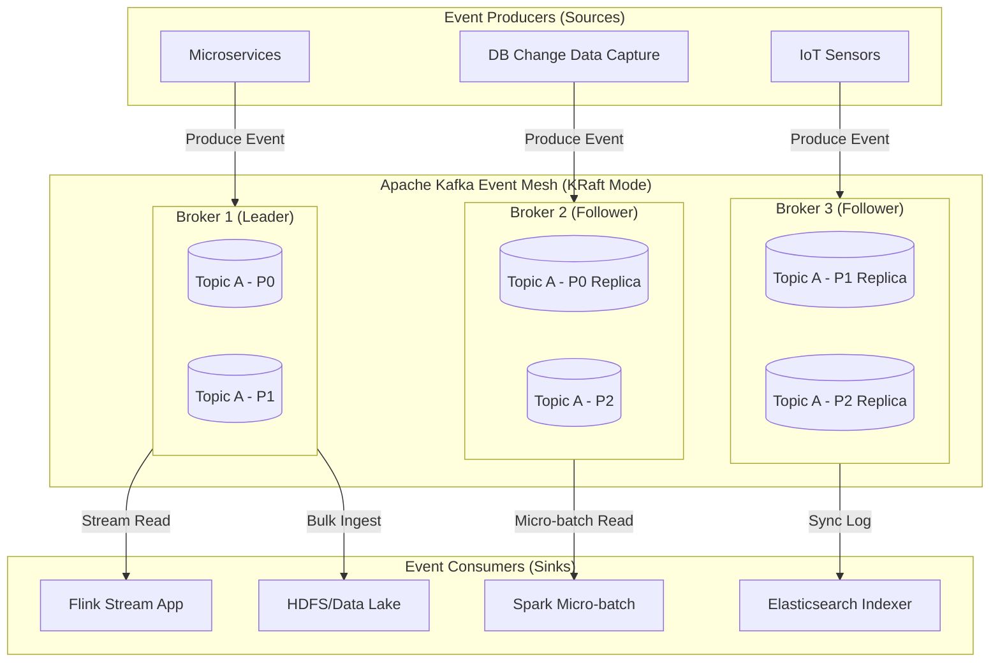

---

# SECTION 2 — THE PROBLEM STATEMENT

## 1. Tight Service Coupling & Point-to-Point Messaging
Before Kafka, as organizations grew, their integration topologies morphed into a "spaghetti architecture". If System $N$ needed to send metrics to System $M$, a custom connector, API endpoint, or queue was built. 
* Total connections scaled quadratically: $O(N^2)$ connections where $N$ is the number of systems.
* If a downstream system crashed, the upstream system's API buffer filled up, causing cascading failures.

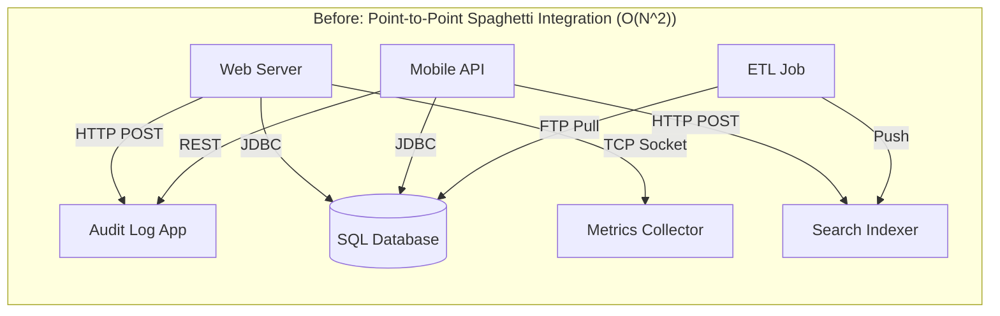

## 2. Scalability Limitations
Traditional queues utilize lock-heavy, transactional memory buffers to ensure messages are delivered exactly once and deleted. Under high concurrent workloads:
* Lock contention degrades message throughput.
* When memory buffers exceed capacity, performance degrades due to swap disk disk I/O.
* They cannot scale horizontally without clustering models that replicate the memory queues, adding synchronization overhead.

## 3. High Latency and Lack of Replay Capability
Once a message is acknowledged in a traditional queue, it is deleted. If an analytics service crashes for 2 hours, it cannot go back and re-read the messages processed during those 2 hours. If a new service is deployed, it cannot read historical messages to bootstrap its local database state.

## 4. The Solution: Log-Centric Architecture
Kafka decouples producers and consumers entirely using an **append-only commit log on disk**. Upstream applications write to the log, and downstream applications read from the log independently using their own offsets. The number of connections drops to $O(N)$.

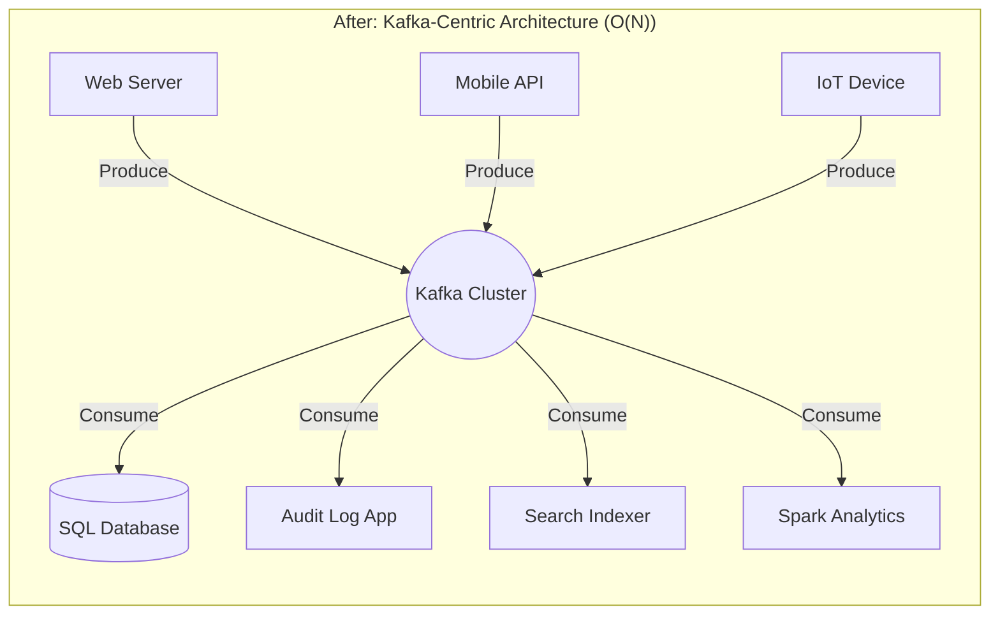

---

# SECTION 3 — KAFKA ARCHITECTURE DEEP DIVE

To understand Kafka's performance at scale, we must analyze its components.

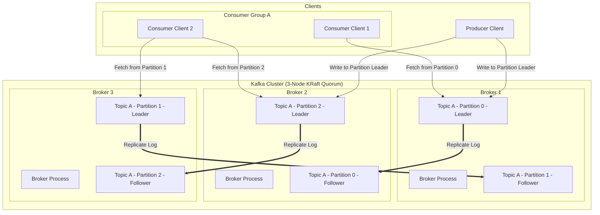

## 1. Core Architectural Components

### A. Kafka Cluster & Broker
* **Broker**: A single Kafka server. A broker receives messages from producers, writes them to its local disk commit log, and responds to fetch requests from consumers.
* **Cluster**: A group of brokers operating together to provide scalability, load balancing, and fault tolerance.

### B. Topics & Partitions
* **Topic**: A logical category or feed name to which messages are published (similar to a table in a database).
* **Partition**: Topics are divided into multiple **partitions**. A partition is a single, append-only, ordered sequence of messages. Each partition is mapped to a physical directory on the broker's disk. Partitions allow a topic to scale horizontally:
  $$\text{Topic Throughput} = \text{Partition Count} \times \text{Single-Partition Throughput}$$

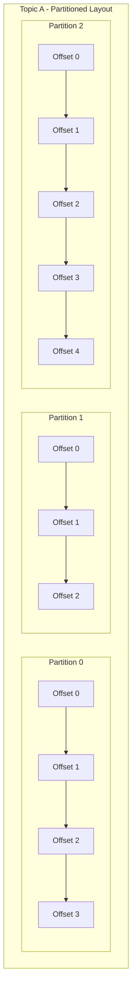

### C. Replicas: Leaders and Followers
To prevent data loss if a broker fails, partitions are replicated across multiple brokers. The number of replicas is defined by the **Replication Factor**.
* **Leader Replica**: Every partition has one broker acting as the leader. All read and write requests flow through the leader replica to guarantee consistency.
* **Follower Replica**: The remaining replicas of a partition. Followers do not handle client write requests; they sync data from the leader by acting as consumer processes.
* **In-Sync Replicas (ISR)**: The subset of follower replicas that are caught up with the leader's log. If a follower lags behind (due to network latency or CPU saturation) for a configured timeout (`replica.lag.time.max.ms`), it is dropped from the ISR.

### D. Producers & Consumers
* **Producer**: Client applications that publish events to Kafka topics. The producer selects which partition to write to based on a partitioner algorithm (e.g., round-robin or hashing a message key).
* **Consumer**: Client applications that read events from Kafka topics. 
* **Consumer Group**: A cooperative group of consumer instances reading from the same topic. Kafka guarantees that **each partition in a topic is consumed by only one member of a consumer group at any given time**. This enables concurrent processing without duplicate consumption.

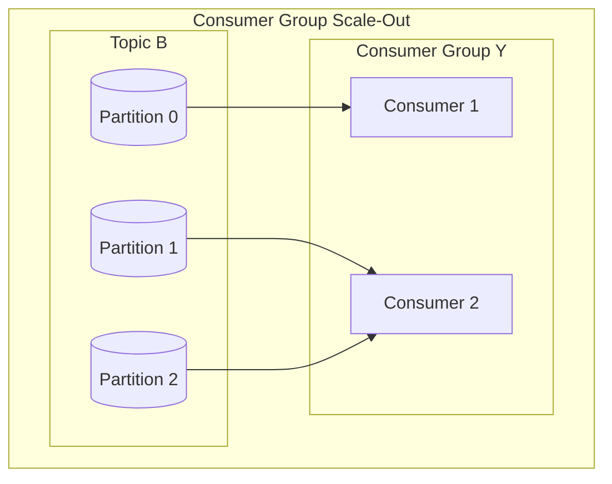

### E. KRaft Controller & Metadata Log
In modern Kafka (version 3.x+), the ZooKeeper dependency is replaced by **KRaft** (Kafka Raft Metadata mode).
* **Controller**: In a KRaft cluster, a subset of brokers are designated as controllers. They form a Raft consensus quorum to manage cluster metadata.
* **Active Controller**: One controller is elected as the active leader. It manages partition leader assignments, broker registrations, and configuration changes.
* **Metadata Log (`@metadata`)**: Metadata changes are written to an internal, replicated Kafka topic rather than ZooKeeper. This metadata is propagated to all brokers, allowing for faster controller failovers and supporting larger partition counts per cluster.

---

# SECTION 4 — INTERNAL WORKING & LIFE OF AN EVENT

## 1. Producer Request Flow & Partition Selection
When a producer writes a message, the following sequence occurs:

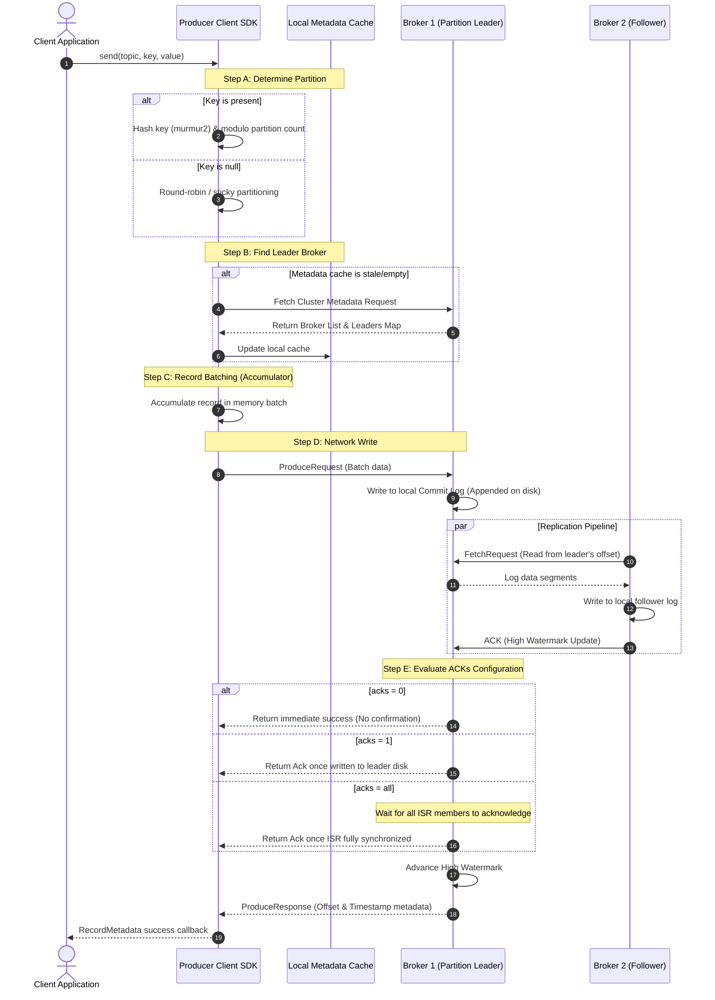

## 2. Topic & Partition Log Layout on Disk
On the broker filesystems, log segments are written inside the directory `<log.dirs>/<topic>-<partition_id>/`.
Each partition directory contains:
* `00000000000000000000.log`: The raw message payload commit log.
* `00000000000000000000.index`: A index mapping logical message offsets to absolute physical byte positions on disk.
* `00000000000000000000.timeindex`: A index mapping timestamps to offsets.
* `leader-epoch-checkpoint`: Records leadership terms to prevent data divergence during broker failovers.

```
/var/lib/kafka/data/logs/
├── my-topic-0/
│   ├── 00000000000000000000.log       <-- Actual data packets
│   ├── 00000000000000000000.index     <-- Byte-offset index mapping
│   ├── 00000000000000000000.timeindex <-- Timestamp index
│   └── leader-epoch-checkpoint        <-- Epoch terms log
```

## 3. Consumer Read Flow & Offset Commits

```mermaid
sequenceDiagram
    autonumber
    participant Cons as Consumer Client SDK
    participant Coordinator as Group Coordinator Broker
    participant Leader as Broker 1 (Partition Leader)

    Note over Cons, Coordinator: Step A: Membership & Rebalance
    Cons->>Coordinator: FindCoordinatorRequest
    Coordinator-->>Cons: Coordinator ID (Broker address)
    Cons->>Coordinator: JoinGroupRequest (Define Group Protocol)
    Coordinator-->>Cons: JoinGroupResponse (Assignments & Epoch)
    Cons->>Coordinator: SyncGroupRequest
    Coordinator-->>Cons: Confirmed Partition Assignments
    
    loop Heartbeat Loop (Background Thread)
        Cons->>Coordinator: HeartbeatRequest
        Coordinator-->>Cons: HeartbeatResponse (Keepalive OK)
    end

    Note over Cons, Leader: Step B: Data Fetching
    loop Fetch Loop (Foreground Thread)
        Cons->>Leader: FetchRequest (Topic, Partition, Offset)
        Note over Leader: Leader limits fetch to High Watermark (HWM)
        Leader-->>Cons: FetchResponse (Message batch, HWM)
        Cons->>Cons: Process records in consumer application
        
        Note over Cons, Coordinator: Step C: Commit Read Progress
        alt enable.auto.commit = true
            Note over Cons: Wait for auto.commit.interval.ms
            Cons->>Coordinator: OffsetCommitRequest (Topic, Partition, Offset)
        else Manual Commit
            Cons->>Coordinator: OffsetCommitRequest (Synchronous/Asynchronous)
        fi
        Coordinator-->>Cons: OffsetCommitResponse (ACK)
    end
```

---

# SECTION 5 — CORE CONCEPTS & DEEP DIVE

## 1. Event Streaming & Immutable Logs
In Kafka, the **log** is the source of truth. Unlike databases that mutate records in-place (SQL `UPDATE`), Kafka events are append-only. 
* Mutability creates race conditions. Immutability guarantees that history is readable by multiple systems without locking.
* Because data is written sequentially, write operations achieve high throughput, leveraging disk sequential access speeds.

## 2. Topic Partitions: Scale and Parallelism
A topic's partition count is the unit of scale. A topic with a single partition can only be read by one thread within a consumer group. If a topic has 10 partitions, up to 10 consumers in a group can read from it concurrently.

```
Topic: user-clicks (3 Partitions)
Partition 0:  [Offset 0] -> [Offset 1] -> [Offset 2]
Partition 1:  [Offset 0] -> [Offset 1]
Partition 2:  [Offset 0] -> [Offset 1] -> [Offset 2] -> [Offset 3]
```

## 3. Replication Factor & In-Sync Replicas (ISR)
* **Replication Factor (RF)**: The number of copies of a partition maintained across the cluster. A production default is `3`.
* **Min In-Sync Replicas (`min.insync.replicas`)**: The minimum number of replicas in the ISR that must acknowledge a write when a producer uses `acks=all` (or `acks=-1`). If the ISR count falls below this threshold, the broker returns a `NotEnoughReplicasException` to the producer, prioritizing durability over availability.

## 4. Offsets & Consumer Groups
* **Log End Offset (LEO)**: The offset of the next record to be written to a partition.
* **High Watermark (HWM)**: The highest offset replicated to all replicas in the ISR. Consumers can only read messages up to the HWM to prevent reading dirty or uncommitted logs.
* **Offset Commits**: Consumers store their commit positions in an internal topic named `__consumer_offsets`. This topic maintains the state of which message each consumer group has processed.

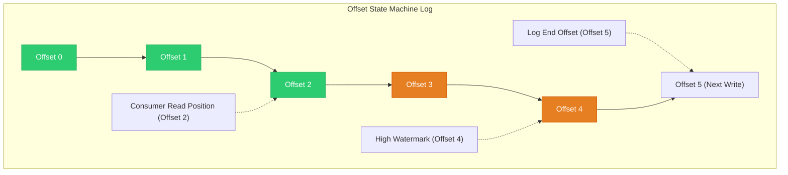

## 5. Durability & Ordering Guarantees
* **Durability**: Guaranteed by writing to disk and replicating across multiple independent brokers.
* **Ordering Guarantees**: Kafka guarantees strict message ordering **within a single partition**. Messages written to a partition are appended in sequence and read in that exact sequence. **There is no global ordering guarantee across multiple partitions within a topic.**

---

# SECTION 6 — PRODUCTION ENGINEERING & OPERATIONS

## 1. Cluster Sizing & Capacity Planning
Sizing a production Kafka cluster requires analyzing storage, network, and CPU bounds.

### A. Storage Calculation Formula
$$\text{Storage Needed} = \frac{\text{Daily Data Volume} \times \text{Retention Days} \times \text{Replication Factor}}{1 - \text{Disk Buffer Headroom}}$$
For example:
* Daily Ingest: $1 \text{ TB}$
* Retention: $7 \text{ Days}$
* Replication Factor: $3$
* Buffer Headroom: $20\%$ ($0.2$)
$$\text{Storage Needed} = \frac{1\text{ TB} \times 7 \times 3}{1 - 0.2} = \frac{21\text{ TB}}{0.8} = 26.25 \text{ TB}$$

### B. Network Bandwidth Calculation
Verify both inbound client traffic and internal replication traffic:
$$\text{Network Out (Brokers)} = \text{Ingress Rate} \times (\text{Replication Factor} - 1) + (\text{Ingress Rate} \times \text{Consumer Count})$$

## 2. Partition Strategy Guidelines
How many partitions should a topic have?
* Aim for at least 1 partition per consumer thread.
* **Rule of thumb**: A single partition handles ~10MB/sec write and ~20MB/sec read throughput. Set partition count based on:
  $$\text{Partitions} = \max\left(\frac{\text{Target Inbound Throughput}}{10\text{ MB/s}}, \frac{\text{Target Outbound Throughput}}{20\text{ MB/s}}\right)$$
* Keep total partition count per broker below 4,000 to prevent metadata resource overhead.

## 3. Rack Awareness
In cloud or multi-datacenter environments, configure `broker.rack` (e.g., `us-east-1a`, `us-east-1b`). Kafka distributes partition replicas across distinct racks, ensuring availability if an entire availability zone fails.

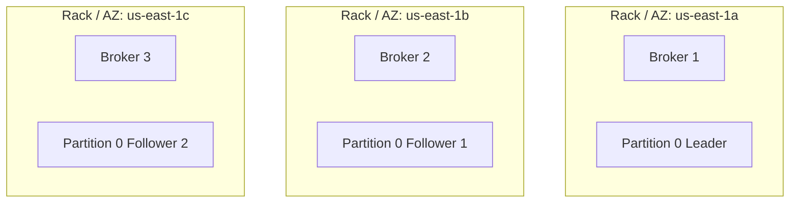

## 4. Security (SSL/SASL/ACLs)
* **Encryption (TLS/SSL)**: Encrypts data in transit between clients and brokers, and between brokers during replication.
* **Authentication**: Use SASL (SASL/GSSAPI for Kerberos, SASL/SCRAM, or SASL/PLAIN) or TLS Client Certificates to authenticate identities.
* **Authorization (ACLs)**: Fine-grained access control lists configuring which users can write, read, or describe specific topics and consumer groups.

## 5. Performance Tuning Configs

| Component | Configuration Parameter | Production Recommendation | Description |
| :--- | :--- | :--- | :--- |
| **Broker** | `num.io.threads` | Matches physical disk count | CPU threads handling disk I/O. |
| **Broker** | `num.network.threads` | Matches CPU core count | Threads processing network requests. |
| **Broker** | `log.flush.interval.messages` | Let OS manage (Default: Long) | Rely on replication for durability, and let OS flush dirty pages sequentially. |
| **Producer** | `compression.type` | `lz4` or `zstd` | Reduces network payload and storage footprint. |
| **Producer** | `linger.ms` | `20` | Delays sending messages to batch requests, improving throughput. |
| **Consumer** | `fetch.min.bytes` | `1024` | Minimum data returned by brokers; helps throttle small TCP reads. |

---

# SECTION 7 — HANDS-ON LAB: CREATE A KAFKA CLUSTER

This lab sets up a 3-broker KRaft Kafka cluster using Docker Compose.

## 1. Environment Topology
* Node 1: `kafka1-day10` (Client Port: `19092`, Controller Port: `9093`)
* Node 2: `kafka2-day10` (Client Port: `29092`, Controller Port: `9093`)
* Node 3: `kafka3-day10` (Client Port: `39092`, Controller Port: `9093`)

## 2. Docker Compose File
Save this configuration inside `docker/docker-compose.yml`:
```yaml
version: '3.8'
services:
  kafka1:
    image: confluentinc/cp-kafka:7.6.0
    container_name: kafka1-day10
    ports:
      - "19092:19092"
    environment:
      KAFKA_NODE_ID: 1
      KAFKA_PROCESS_ROLES: 'broker,controller'
      KAFKA_CONTROLLER_QUORUM_VOTERS: '1@kafka1-day10:9093,2@kafka2-day10:9093,3@kafka3-day10:9093'
      KAFKA_LISTENERS: 'PLAINTEXT://:9092,CONTROLLER://:9093,EXTERNAL://:19092'
      KAFKA_ADVERTISED_LISTENERS: 'PLAINTEXT://kafka1-day10:9092,EXTERNAL://localhost:19092'
      KAFKA_CONTROLLER_LISTENER_NAMES: 'CONTROLLER'
      KAFKA_LISTENER_SECURITY_PROTOCOL_MAP: 'PLAINTEXT:PLAINTEXT,CONTROLLER:PLAINTEXT,EXTERNAL:PLAINTEXT'
      KAFKA_INTER_BROKER_LISTENER_NAME: 'PLAINTEXT'
      KAFKA_OFFSETS_TOPIC_REPLICATION_FACTOR: 3
      CLUSTER_ID: '4L62ZDwCQIK-GGy4aG37wA'
    volumes:
      - kafka1-data:/var/lib/kafka/data
    networks:
      - day10-network
...
```
*(The complete file with all 3 services can be found in the [docker/](file:///d:/30_Days_of_Modern_Hadoop_Ecosystem/Day-10-Kafka-Architecture/docker/docker-compose.yml) folder).*

## 3. Commands & Expected Output

### Step A: Start the Cluster
```bash
docker compose -f docker/docker-compose.yml up -d
```

### Step B: Create a Topic
Create a replicated topic named `production-orders`:
```bash
docker exec -it kafka1-day10 kafka-topics.sh \
  --bootstrap-server localhost:9092 \
  --create \
  --topic production-orders \
  --partitions 3 \
  --replication-factor 3
```
**Expected Output:**
```text
Created topic production-orders.
```

### Step C: Describe the Topic
```bash
docker exec -it kafka1-day10 kafka-topics.sh \
  --bootstrap-server localhost:9092 \
  --describe \
  --topic production-orders
```
**Expected Output:**
```text
Topic: production-orders	TopicId: K-dZgP_7TSy-z_Qd9t0yAg	PartitionCount: 3	ReplicationFactor: 3	Configs: 
	Topic: production-orders	Partition: 0	Leader: 1	Replicas: 1,2,3	Isr: 1,2,3
	Topic: production-orders	Partition: 1	Leader: 2	Replicas: 2,3,1	Isr: 2,3,1
	Topic: production-orders	Partition: 2	Leader: 3	Replicas: 3,1,2	Isr: 3,1,2
```

### Step D: Write Messages (Produce)
Launch the console producer and write key-value lines:
```bash
docker exec -it kafka1-day10 kafka-console-producer.sh \
  --bootstrap-server localhost:9092 \
  --topic production-orders \
  --property parse.key=true \
  --property key.separator=:
```
Type these events, pressing Enter after each:
```text
id-101:{"item": "book", "qty": 1}
id-102:{"item": "laptop", "qty": 1}
id-101:{"item": "book", "qty": 2}
```
Press `Ctrl+D` to exit the producer.

### Step E: Read Messages (Consume)
Launch the console consumer to read messages from the beginning:
```bash
docker exec -it kafka1-day10 kafka-console-consumer.sh \
  --bootstrap-server localhost:9092 \
  --topic production-orders \
  --from-beginning \
  --property print.key=true \
  --property key.separator=" -> "
```
**Expected Output:**
```text
id-101 -> {"item": "book", "qty": 1}
id-101 -> {"item": "book", "qty": 2}
id-102 -> {"item": "laptop", "qty": 1}
```
*(Notice that order is guaranteed for key `id-101` because it is routed to the same partition, but messages from `id-102` may appear interleaved depending on partition routing).*

---

# SECTION 8 — BUILD KAFKA FROM SOURCE

Building Apache Kafka from source allows you to test custom patches or build optimized distributions.

## 1. Codebase Structure
Kafka is written in **Scala** (core engine, broker coordinating layers) and **Java** (clients, connect API, streams engine).
* `/core`: Scala engine classes handling request replication, KRaft consensus, and broker processes.
* `/clients`: Pure Java producer, consumer, and admin APIs.
* `/connect`: API framework for database integration (Connectors).
* `/streams`: Stream processing client library.

## 2. Compilation and Build Process
Kafka uses **Gradle** as its build automation tool.

### Prerequisites
* Java JDK 11 or 17.
* Internet access for downloading Gradle dependencies.

### Step-by-Step Compilation Commands
```bash
# Clone the official Apache repository
git clone https://github.com/apache/kafka.git
cd kafka

# Checkout stable version branch
git checkout 3.7.0

# Clean build and compile core packages, running tests (takes time)
./gradlew clean jar

# Build distribution release package (Creates a .tgz archive)
./gradlew releaseTarGz

# Find built distribution packages
ls -l core/build/distributions/
```
Common build flags:
* Skip tests: `./gradlew releaseTarGz -x test`
* Specific Scala version: `./gradlew -PscalaVersion=2.13 releaseTarGz`

---

# SECTION 9 — DOCKER DEPLOYMENT ANATOMY

In containerized deployments, managing state and networking is critical.

## 1. Network Bridging
Brokers need to talk to each other using internal container hostnames (`kafka1-day10`), while clients outside the Docker network connect via mapped host ports (e.g., `localhost:19092`). This requires configuring multiple listeners in the `KAFKA_LISTENERS` and `KAFKA_ADVERTISED_LISTENERS` parameters.

```yaml
# Internal listener for broker-to-broker traffic
PLAINTEXT://kafka1-day10:9092
# External listener for client traffic connecting to the host
EXTERNAL://localhost:19092
```

## 2. Volume Mounting
Kafka is disk-intensive. Storing commits logs in the container's root filesystem degrades performance. Always mount dedicated volumes or local disk folders to the container's internal log directory `/var/lib/kafka/data`.

## 3. Container Health Checks
Use `kafka-topics.sh` to check cluster availability. If a broker is down, Docker registers the health check failure and can trigger container restarts or fail alert sequences.
```yaml
healthcheck:
  test: ["CMD-SHELL", "kafka-topics.sh --bootstrap-server localhost:9092 --list || exit 1"]
  interval: 10s
  timeout: 5s
  retries: 5
```

---

# SECTION 10 — LOCAL CLUSTER DEPLOYMENT Topologies

Choose your local deployment topology based on your resource constraints and testing needs:

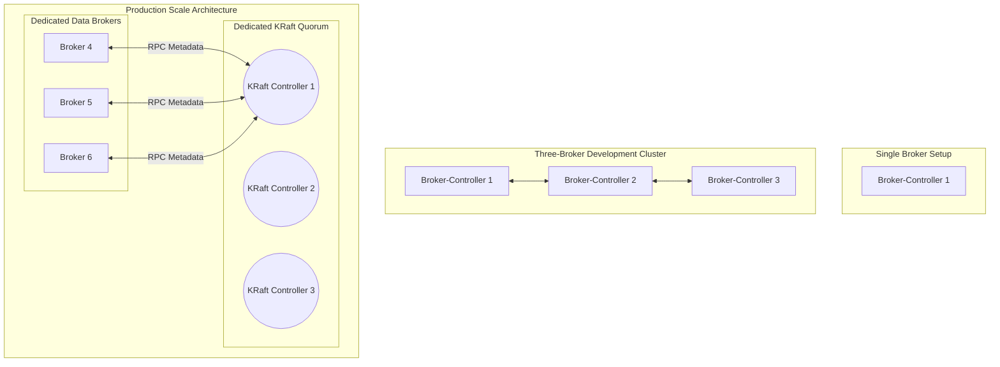

1. **Single-Node Kafka**:
   * Uses a combined process (broker and controller).
   * Good for local testing and lightweight development.
2. **Three-Broker Cluster (Lab Setup)**:
   * Uses 3 combined processes.
   * Good for HA testing, partition balancing validation, and simulating broker crashes locally.
3. **Multi-Node Production Deployment**:
   * Runs dedicated processes. Controllers do not host client topics or partition replicas; they focus entirely on metadata quorum replication.
   * Minimizes JVM garbage collection pauses on controllers, preventing false broker-down states.

---

# SECTION 11 — VALIDATION SCRIPTS MANUAL

We have provided validation scripts under `scripts/` to verify cluster health.

## 1. Script Registry & Runner Guide

### A. verify-brokers.sh
Validates that container daemons are running and queries KRaft consensus quorum metrics.
```bash
bash scripts/verify-brokers.sh
```

### B. verify-topics.sh
Queries the list of topics in the cluster and describes details for a target topic.
```bash
bash scripts/verify-topics.sh [topic_name]
```

### C. verify-partitions.sh
Checks the partition configuration, leadership mapping, and Log End Offsets (LEO) for a topic.
```bash
bash scripts/verify-partitions.sh [topic_name]
```

### D. verify-replication.sh
Scans the cluster for under-replicated or offline partitions and reports replica sync states.
```bash
bash scripts/verify-replication.sh
```

### E. produce-consume-demo.sh
Runs an automated end-to-end flow: creates a topic, writes 5 keyed events, consumes them using a consumer group, prints partition lag, and deletes the topic.
```bash
bash scripts/produce-consume-demo.sh
```

---

# SECTION 12 — PRODUCTION TROUBLESHOOTING PLAYBOOK

Use this table to diagnose and resolve common production anomalies.

| Incident Name | Symptoms | Root Cause | Resolution Command / Steps |
| :--- | :--- | :--- | :--- |
| **Broker Unavailable** | Connection time outs; `verify-brokers.sh` failures. | JVM Crash (OOM), physical disk failure, or port bind conflict. | 1. Check container states: `docker ps -a`<br>2. Read logs: `docker logs kafka1-day10`<br>3. Increase JVM Heap heap size (`KAFKA_HEAP_OPTS`). |
| **Under-Replicated Partitions** | Metric `UnderReplicatedPartitions > 0`. | Network partition between nodes; slow disk writes on follower brokers. | 1. Find lagging partitions: `kafka-topics.sh --describe --under-replicated-partitions`<br>2. Check follower network latency and disk I/O performance. |
| **High Consumer Lag** | Metric `records-lag-max` increases. | Consumers cannot keep up with producer throughput. | 1. Check lag: `kafka-consumer-groups.sh --describe --group <group>`<br>2. Add consumer instances to consumer group. |
| **Leader Election Issues** | Producer writes fail with `NotLeaderOrFollowerException`. | Controller cannot communicate with broker, or all partition replicas are offline. | 1. Check quorum status: `kafka-metadata-quorum.sh describe --status`<br>2. Recover crashed brokers. |
| **Disk Full** | Broker shuts down; write exceptions. | Retention configs are set too high or traffic has spiked. | 1. Reduce retention window: `kafka-configs.sh --alter --entity-type topics --entity-name <topic> --add-config retention.ms=86400000`<br>2. Run partition balance tools to move data. |

---

# SECTION 13 — CASE STUDY: ENTERPRISE-SCALE STREAMING

## 1. System Scale (Netflix/Uber Model)
High-throughput ingestion platforms process trillions of messages daily:
* **Ingress**: ~10 GB/sec inbound stream.
* **Topic Design**: Metrics are split by application domain. User event topics have 64 to 256 partitions to support high-parallelism consumers.
* **Partition Strategy**: Use keys (e.g., `user_id` or `device_uuid`) to ensure related events route to the same partition, guaranteeing ordered consumption.

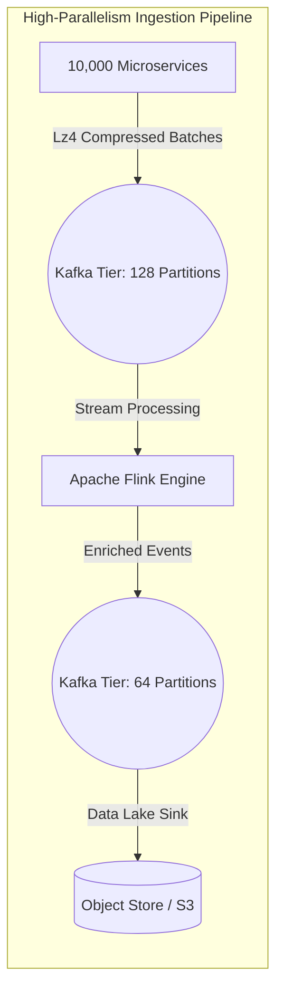

## 2. Key Operational Lessons
* **Avoid over-partitioning**: Having too many partitions (e.g., >20,000 per cluster) increases metadata overhead and can degrade performance during controller failovers.
* **Leverage Page Cache**: Kafka relies on the OS page cache for read operations. Ensure your brokers have sufficient RAM headroom to cache active log segments, minimizing physical disk reads.
* **Use Compression**: Compressing messages (using `lz4` or `zstd`) reduces both network traffic and disk storage requirements.

---

# SECTION 14 — INTERVIEW QUESTIONS & ANSWERS

## 🧠 Beginner Questions (20)

### 1. What is Apache Kafka?
**Answer**: Apache Kafka is a distributed event streaming platform designed to ingest, process, store, and integrate event streams at scale. It uses an append-only commit log structure.

### 2. How does Kafka differ from traditional message queues like RabbitMQ?
**Answer**: RabbitMQ deletes messages after they are consumed. Kafka retains messages on disk for a configured retention period, allowing multiple consumers to read the same data independently.

### 3. What is a Kafka Broker?
**Answer**: A broker is a single Kafka server that manages topic partitions, writes incoming messages to disk, and serves read requests from consumers.

### 4. What is a Topic in Kafka?
**Answer**: A topic is a logical feed or category name to which messages are published.

### 5. What is a Partition?
**Answer**: A partition is a subset of a topic's log. It is an ordered, append-only sequence of messages. Partitions allow topics to scale horizontally.

### 6. What is an Offset?
**Answer**: An offset is a unique sequential integer assigned to each message within a partition. It identifies the message's position in the log.

### 7. What is a Producer?
**Answer**: A producer is a client application that writes events to Kafka topics.

### 8. What is a Consumer?
**Answer**: A consumer is a client application that reads events from Kafka topics.

### 9. What is a Consumer Group?
**Answer**: A consumer group is a cooperative group of consumers that read from the same topic. Kafka distributes partitions across the members of the group to parallelize processing.

### 10. What is a Replica?
**Answer**: A replica is a copy of a partition maintained on a different broker to prevent data loss.

### 11. What are Leader and Follower replicas?
**Answer**: The leader replica handles all client read and write requests for a partition. Follower replicas sync data from the leader.

### 12. What does ISR stand for?
**Answer**: In-Sync Replicas. This is the list of replica brokers that are caught up with the partition leader's log.

### 13. What is the role of the KRaft Controller?
**Answer**: The active KRaft controller manages cluster metadata, monitors broker health, and coordinates partition leader elections.

### 14. Can a consumer group have more members than the number of topic partitions?
**Answer**: Yes, but the extra consumer instances will remain idle because Kafka assigns each partition to only one consumer in a group.

### 15. What happens if a consumer instance in a group crashes?
**Answer**: Kafka detects the failure via heartbeat timeouts and triggers a **rebalance**, reassigning the crashed consumer's partitions to the remaining members of the group.

### 16. What is the default retention period for Kafka logs?
**Answer**: The default log retention period is 7 days (`log.retention.hours=168`).

### 17. How does a producer choose which partition to write to if no key is provided?
**Answer**: Kafka uses a sticky partitioner algorithm (or round-robin) to batch records and distribute them across partitions.

### 18. What is the role of the `__consumer_offsets` topic?
**Answer**: It is an internal topic where Kafka stores the committed offsets (progress) of consumer groups.

### 19. What is KRaft mode?
**Answer**: KRaft is Kafka's built-in Raft consensus protocol. It manages cluster metadata directly within Kafka, removing the dependency on Apache ZooKeeper.

### 20. What port does Kafka default to for client connections?
**Answer**: Port `9092`.

---

## ⚡ Intermediate Questions (20)

### 21. What is the High Watermark (HWM) in a partition?
**Answer**: The High Watermark is the offset of the last message that has been successfully replicated to all replicas in the ISR. Consumers can only read messages up to the HWM.

### 22. Explain the `acks` configuration on producers.
**Answer**:
* `acks=0`: The producer returns success immediately without waiting for broker acknowledgement.
* `acks=1`: The producer waits for the partition leader to write the message to its disk before acknowledging.
* `acks=all` (or `-1`): The producer waits for all replicas in the ISR to write the message to disk, providing the highest durability.

### 23. What is the Log End Offset (LEO)?
**Answer**: The LEO is the offset of the next message to be written to a partition. It is always higher than or equal to the High Watermark.

### 24. How does Kafka achieve high write performance on standard hard drives?
**Answer**: Kafka leverages sequential disk access, which is faster than random disk I/O. It also uses the OS Page Cache and the `sendfile` system call to bypass user-space memory buffers (Zero-Copy).

### 25. Explain the importance of `min.insync.replicas`.
**Answer**: This property defines the minimum number of in-sync replicas required to acknowledge a write when a producer uses `acks=all`. If the ISR count falls below this value, write requests fail with a `NotEnoughReplicasException`.

### 26. What is an unclean leader election, and when should you enable it?
**Answer**: If the partition leader crashes and no in-sync replicas are online, enabling unclean leader election allows an out-of-sync follower to become the leader. This restores availability but can result in data loss.

### 27. What is Consumer Lag?
**Answer**: Consumer lag is the difference between the Log End Offset (latest produced message) and the consumer group's committed offset (latest processed message) for a partition.

### 28. What is a Rebalance, and what triggers it?
**Answer**: Rebalancing is the process of redistributing partition assignments among consumers in a group. It is triggered when:
* A consumer joins or leaves the group.
* The topic partition count changes.
* A consumer fails to send heartbeats within the configured timeout window.

### 29. How do you prevent message duplication in Kafka?
**Answer**: Enable idempotence on the producer (`enable.idempotence=true`). This assigns a unique producer ID and sequence number to each message batch, allowing the broker to detect and discard duplicates.

### 30. What is compaction (Log Compaction) in Kafka?
**Answer**: Log compaction is a retention policy where Kafka retains only the latest value for each message key in a partition, deleting older updates. This is useful for restoring state tables.

### 31. What are the key differences between Kafka's ZooKeeper mode and KRaft mode?
**Answer**:
* **ZooKeeper mode**: Metadata is stored externally in ZooKeeper. Brokers poll ZooKeeper, and a broker failure requires ZooKeeper to orchestrate updates.
* **KRaft mode**: Metadata is stored internally in a metadata log managed by a Raft quorum of controllers. This supports larger partition scales and provides faster failovers.

### 32. What is the role of the Group Coordinator broker?
**Answer**: The Group Coordinator is the broker responsible for managing consumer group heartbeats, tracking offsets, and orchestrating rebalances for a set of consumer groups.

### 33. What is a Sticky Partitioner?
**Answer**: A producer partitioner that groups records destined for the same partition into a single batch before sending them, improving throughput and reducing CPU utilization compared to round-robin partitioners.

### 34. What configuration controls how long a broker waits for replica sync before removing it from the ISR?
**Answer**: The broker configuration `replica.lag.time.max.ms` (default is 30,000ms).

### 35. Explain "Zero-Copy" transfer.
**Answer**: Zero-Copy allows the OS to transfer data from the page cache directly to the network socket, bypassing the application heap. This reduces context switching and CPU overhead.

### 36. Why should you avoid storing large files in Kafka messages?
**Answer**: Large messages increase memory footprint, degrade the efficiency of the OS page cache, and can cause memory issues on brokers and clients. Keep message sizes below 1MB.

### 37. What is a Rebalance Storm?
**Answer**: A situation where continuous consumer group rebalances prevent consumers from processing data, often caused by garbage collection pauses or consumer threads taking longer to process a batch than `max.poll.interval.ms`.

### 38. How can you scale a Kafka topic's write capacity?
**Answer**: Increase the number of partitions for the topic and distribute the partitions across additional brokers.

### 39. What is a Transaction in Kafka?
**Answer**: Transactions allow producers to write messages to multiple partitions atomically (all succeed or all fail). This is critical for exact-once processing pipelines.

### 40. What is the default partition hashing algorithm?
**Answer**: The `murmur2` hashing algorithm.

---

## 🚀 Advanced Questions (20)

### 41. Explain the Zab consensus protocol vs. the KRaft consensus protocol.
**Answer**: ZooKeeper uses the Zab protocol for consensus. KRaft uses Raft consensus. KRaft integrates the Raft metadata log directly into Kafka's transport layers, avoiding the serialization overhead of writing to ZooKeeper.

### 42. Explain the leader epoch mechanism and how it prevents log truncation issues.
**Answer**: The leader epoch is an integer incremented every time a new leader is elected. It is recorded in the `leader-epoch-checkpoint` file. When a replica recovers, it queries the leader to find the end offset for its current epoch, preventing data divergence during failovers.

### 43. Explain how KIP-392 (Fetching from Closest Replica) optimizes network performance.
**Answer**: In multi-AZ cloud deployments, fetching data from the partition leader across zones incurs data transfer costs. KIP-392 allows consumers to fetch records from the closest in-sync follower within the same availability zone, reducing cross-AZ network costs.

### 44. What happens when the Page Cache is saturated, and how does it affect broker throughput?
**Answer**: If page cache usage exceeds physical RAM limits, the OS must swap dirty pages to disk, causing disk read blocks. This stalls network threads, increases request latency, and degrades throughput.

### 45. How does Kafka prevent split-brain in KRaft mode?
**Answer**: Raft consensus requires a strict majority of controller votes to elect a leader. If a network partition divides the controllers, only the segment with a majority quorum can elect a leader, preventing split-brain.

### 46. What is the impact of setting `max.in.flight.requests.per.connection` to greater than 1 without idempotency?
**Answer**: If an in-flight request fails and is retried while a subsequent request succeeds, messages can be written out of order. Enabling idempotence prevents this ordering issue.

### 47. Explain the internal architecture of the Kafka Producer's `RecordAccumulator`.
**Answer**: The `RecordAccumulator` buffers records in memory by topic-partition. It allocates memory blocks in pools to minimize JVM garbage collection overhead. Once a buffer pool batch is full or `linger.ms` is reached, the sender thread sends the batch to the broker.

### 48. How would you design a Kafka cluster architecture to ingest 1 million messages per second?
**Answer**: 
* Configure at least 3 dedicated KRaft controllers.
* Deploy at least 5 data brokers with NVMe SSD storage.
* Set topic partition counts to at least 32 or 64.
* Enable compression (`lz4` or `zstd`) on producers.
* Configure `linger.ms=20` and `batch.size=65536`.

### 49. How does Log Compaction clean up tombstone records?
**Answer**: A tombstone is a message with a key and a null value, indicating deletion. During log compaction, Kafka retains the tombstone for a configured period (`delete.retention.ms`) to allow consumers to read the deletion status, after which the cleaner thread removes it.

### 50. Explain how the controller metadata log (`@metadata`) is replicated.
**Answer**: The `@metadata` topic is replicated among the KRaft controllers using Raft replication protocols. The active controller processes metadata changes (e.g. partition updates) and appends them to its local log. The follower controllers fetch and apply these changes.

### 51. Explain how to debug a broker that is stuck in a boot loop during disk initialization.
**Answer**: Check the logs for corrupted index files. If index files are corrupted, deleting the `.index` files in the partition directory and restarting the broker will trigger Kafka to rebuild the indexes from the `.log` segment files.

### 52. What JMX metrics are most critical to monitor for cluster health?
**Answer**:
* `UnderReplicatedPartitions` (should be 0)
* `OfflinePartitionsCount` (should be 0)
* `ActiveControllerCount` (should sum to 1 across the cluster)
* `UnderMinIsrPartitionCount` (should be 0)
* `RequestHandlerAvgIdlePercent` (should be high)

### 53. How do you implement consumer group offset migration between two separate Kafka clusters?
**Answer**: Mirror the topic data using MirrorMaker or Confluent Replicator. Export consumer group offsets from the source cluster, map the offsets to the target cluster's offsets, and commit them using the AdminClient API.

### 54. Explain the difference between `log.flush.interval.messages` and the OS virtual memory writeback flush.
**Answer**: `log.flush.interval.messages` forces an explicit fsync to disk after a set number of messages. By default, Kafka relies on the OS page cache writeback thread (`pdflush` or `dirty_writeback_centisecs`) to flush pages asynchronously, maximizing performance.

### 55. What is the Cooperative Sticky Assignor protocol?
**Answer**: This assignment protocol allows consumer groups to rebalance incrementally. Only the partitions being reassigned are paused; unaffected consumers continue processing data, reducing rebalance downtime.

### 56. What configuration prevents a broker from accepting connection requests when its disk is full?
**Answer**: Config `log.dir.fallback.to.temp.on.failure` or monitoring disk usage dynamically using sidecar agents and altering broker configurations to shut down gracefully.

### 57. Under what conditions will `acks=all` still result in data loss?
**Answer**: If `min.insync.replicas=1` and the leader is the only in-sync replica. If the leader receives the write and crashes before followers can fetch, the write is lost.

### 58. How do you recover from a corrupted `@metadata` KRaft bootstrap directory?
**Answer**: Regenerate the cluster metadata log directory by formatting the log directories using a new or existing cluster UUID (`kafka-storage.sh format`) or restoring the metadata directory from backups.

### 59. Explain the performance impacts of enabling SSL client authentication (mTLS).
**Answer**: mTLS adds CPU overhead for encryption/decryption on the broker's network threads. To mitigate this, enable SSL session caching and configure SSL hardware acceleration.

### 60. How does Kafka coordinate partition reassignment when scaling a cluster?
**Answer**: The administrator submits a reassignment JSON to the active controller. The controller initiates replication on the new brokers. Once the new brokers are caught up and added to the ISR, the controller switches the partition leader to the new brokers and removes the old replicas.

---

# SECTION 15 — KEY TAKEAWAYS

* **Immutability scales**: Treating the broker as an append-only log allows multiple consumers to read the same data at their own pace without locking.
* **Decouple state from the server**: Storing consumer offsets on the client (and committing them to `__consumer_offsets`) keeps brokers stateless and performant.
* **Design around partition counts**: The partition count is the unit of parallelism. Plan your partition counts based on downstream consumer throughput needs.
* **Keep replication high**: Use a replication factor of 3 and `min.insync.replicas=2` for production deployments.
* **Avoid over-partitioning**: Keep partitions per broker below 4,000 to prevent metadata resource overhead.

---

# SECTION 16 — REFERENCES

* **Official Kafka Docs**: [https://kafka.apache.org](https://kafka.apache.org)
* **KIP-500 Details**: [Confluent KRaft Guide](https://www.confluent.io/blog/kraft-kafka-without-zookeeper/)
* **Netflix Engineering**: [Kafka HA Architecture](https://netflixtechblog.com)
* **Uber Engineering**: [Ingestion Pipelines](https://www.uber.com/blog)
