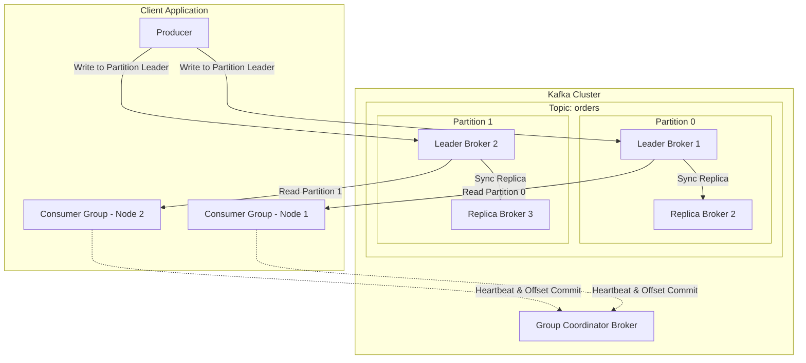
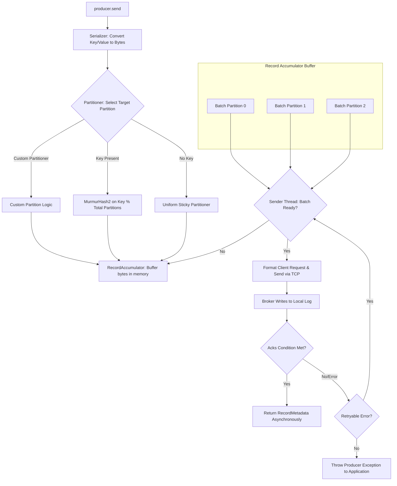
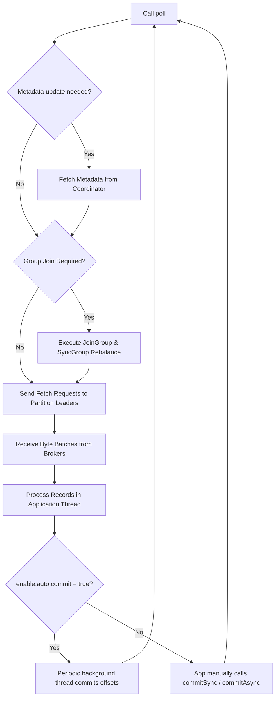
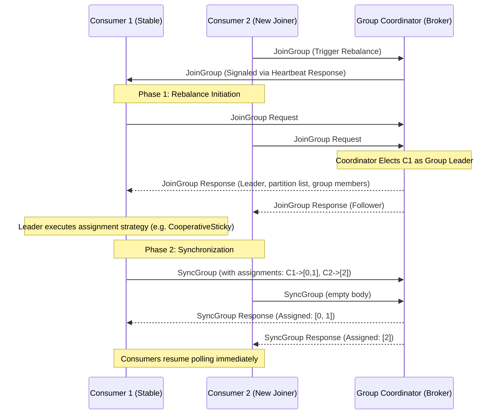
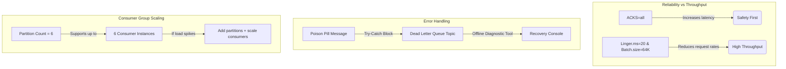
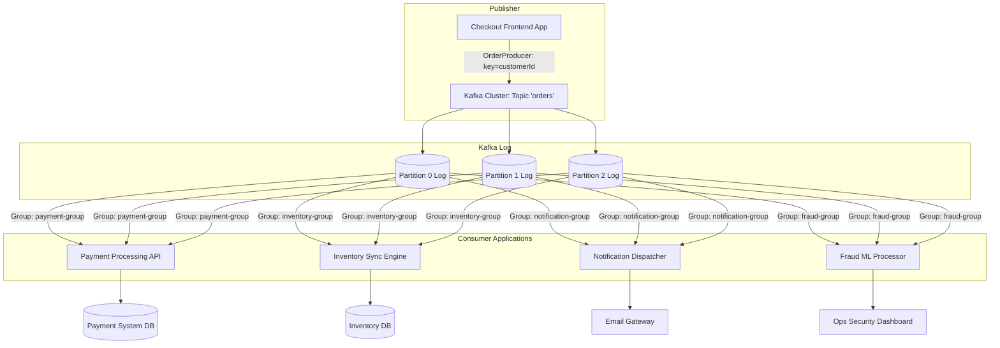

# Day 11: Kafka Producers, Consumers & Rebalance Protocols

Welcome to Day 11 of the **30 Days of Modern Hadoop Ecosystem** series. Today, we transition into the core operational layer of real-time event streaming: **Producers, Consumers, Consumer Groups, Offsets, and Rebalance Protocols**.

Kafka is not merely a broker that stores bytes; it is a distributed, commit-log-based, real-time message stream engine designed for horizontal scaling, fault tolerance, and high-throughput ingestion. For any data engineer or architect, understanding how producer records travel from client buffers to broker storage, and how consumer groups dynamically coordinate partition ownership, is the foundation of building robust, production-grade streaming pipelines.

---

## Table of Contents
1.  [SECTION 1: Introduction to Event-Driven Systems & Client APIs](#section-1-introduction)
2.  [SECTION 2: Problem Statement: Life Before Kafka](#section-2-problem-statement)
3.  [SECTION 3: Architecture Deep Dive](#section-3-architecture-deep-dive)
4.  [SECTION 4: Internal Mechanics & Workflows](#section-4-internal-mechanics)
5.  [SECTION 5: Core Concepts & Configuration Mechanics](#section-5-core-concepts)
6.  [SECTION 6: Production Engineering & Performance Tuning](#section-6-production-engineering)
7.  [SECTION 7: Hands-On Lab: Build a Complete Pipeline](#section-7-hands-on-lab)
8.  [SECTION 8: Build from Source: Code Deep Dive](#section-8-build-from-source)
9.  [SECTION 9: Docker Deployment Guide](#section-9-docker-deployment)
10. [SECTION 10: Local Cluster Deployment](#section-10-local-cluster-deployment)
11. [SECTION 11: Verification & Validation](#section-11-validation)
12. [SECTION 12: Production Troubleshooting Playbook](#section-12-troubleshooting-playbook)
13. [SECTION 13: Real-World Case Study: E-Commerce](#section-13-case-study)
14. [SECTION 14: Comprehensive Interview Prep (60 Q&As)](#section-14-interview-prep)
15. [SECTION 15: Key Takeaways](#section-15-key-takeaways)
16. [SECTION 16: References & Deep Reads](#section-16-references)

---

<a name="section-1-introduction"></a>
## SECTION 1: Introduction to Event-Driven Systems & Client APIs

### Why Event-Driven Systems Need Producers and Consumers
In traditional computing paradigms, systems were modeled around state storage: a database holds the current snapshot of truth, and applications make synchronous requests to read or modify that state. However, in modern enterprises, "truth" is not merely a static snapshot—it is a continuous stream of events representing things that happened (e.g., *user clicked*, *payment processed*, *sensor temp updated*).

An **Event-Driven Architecture (EDA)** decouples systems by allowing applications to publish facts (events) asynchronously to a distributed log without caring who consumes them. This requires two primary abstractions:
1.  **Producers (Publishers)**: Clients responsible for converting application objects into structured bytes, partitioning them, and writing them to the broker logs.
2.  **Consumers (Subscribers)**: Clients that poll the broker logs, process the records, and advance offset trackers.

### Evolution from Synchronous Communication to Event Streaming
In request-response models (e.g., REST over HTTP/1.1 or gRPC), services communicate point-to-point. If Service A needs data from Service B, it sends a request and blocks until a response is returned. 

```mermaid
sequenceDiagram
    participant User
    participant ServiceA as Order Service
    participant ServiceB as Payment Service
    participant ServiceC as Inventory Service

    User->>ServiceA: Submit Order (HTTP POST)
    activate ServiceA
    ServiceA->>ServiceB: Validate Payment (Blocking RPC)
    activate ServiceB
    ServiceB-->>ServiceA: Success Response
    deallocate ServiceB
    ServiceA->>ServiceC: Deduct Stock (Blocking RPC)
    activate ServiceC
    ServiceC-->>ServiceA: Success Response
    deallocate ServiceC
    ServiceA-->>User: Order Confirmed
    deallocate ServiceA
```

If Service C slows down, Service A's connection pool fills up, causing a cascade failure back to the User.

Conversely, in an event-streaming architecture, Service A publishes an `OrderCreated` event to Apache Kafka and immediately responds to the user. Service B (Payment) and Service C (Inventory) subscribe to the event stream independently, processing it at their own pace.

```mermaid
sequenceDiagram
    participant User
    participant ServiceA as Order Service
    participant Broker as Kafka Cluster
    participant ServiceB as Payment Service
    participant ServiceC as Inventory Service

    User->>ServiceA: Submit Order
    activate ServiceA
    ServiceA->>Broker: Publish "OrderCreated" (Async)
    ServiceA-->>User: Order Accepted (ID: 991)
    deallocate ServiceA

    Note over ServiceB, ServiceC: Consumers poll independently
    Broker->>ServiceB: Fetch "OrderCreated"
    Broker->>ServiceC: Fetch "OrderCreated"
    Note over ServiceB: Process Payment
    Note over ServiceC: Reserve Inventory
```

### Kafka's Publish-Subscribe Model
Unlike traditional message queues (like RabbitMQ or JMS) which delete messages once acknowledged, Kafka acts as an append-only immutable write-ahead commit log.
*   **Publishers** append records to the end of a partition log.
*   **Subscribers** maintain their own read index (offsets) to consume sequentially.
*   **Decoupled Scaling**: Since messages are persisted, multiple consumer applications can read the exact same stream at different times without interfering with each other's processing speed.

### Real-World Applications
1.  **E-Commerce Activity Streams**: Capturing checkout events, payments, shipping status, and recommendation logs.
2.  **Financial Transaction Ledgering**: Building audit logs where every debit and credit event is immutable.
3.  **IoT Telemetry Aggregation**: Ingesting high-cardinality sensor measurements.
4.  **Log Aggregation & Metrics Distribution**: Routing infrastructure logs to Elasticsearch, Splunk, and database nodes simultaneously.

---

<a name="section-2-problem-statement"></a>
## SECTION 2: Problem Statement: Life Before Kafka

Before the adoption of distributed commit logs like Kafka, enterprise messaging relied heavily on traditional broker systems (ActiveMQ, RabbitMQ) or direct REST communication. These patterns presented critical operational challenges:

### 1. Tight Coupling and Temporal Dependencies
Point-to-point service interaction meant Service A could only send data if Service B was healthy and listening. If Service B was offline for maintenance, Service A had to buffer messages locally (leading to memory leaks) or discard the requests (leading to data loss).

### 2. Lack of Replayability
Traditional queues delete messages immediately after consumer acknowledgement to free up resource queues. If a database crashed, or a bug was introduced into the consumer service code, it was impossible to "rewind" and re-process the messages from the past 24 hours. The state was permanently lost or required complex database restore mechanisms.

### 3. Cascading Failures & Retry Storms
If a downstream dependency slowed down, upstream callers would retry requests. This led to "retry storms" (thundering herd problem), completely overwhelming the lagging service and preventing it from recovering.

### 4. Poor Horizontal Scaling
Traditional brokers utilize heavy lock-based queue management to ensure that only one worker reads a message. As the number of connections and consumer threads scaled, locking contention on the broker's CPU skyrocketed, bounding the maximum throughput.

### Comparison Table: Request-Response vs. Kafka Event Streaming

| Vector | Traditional Request-Response (REST/gRPC) | Traditional Queue (RabbitMQ/JMS) | Kafka Event Streaming |
| :--- | :--- | :--- | :--- |
| **Coupling** | High (Temporal & Spatial) | Moderate (Spatial Decoupling) | Completely Decoupled |
| **Persistence** | Volatile (No queue persistence) | Transient (Deleted on ACK) | Persistent (Immutable log on disk) |
| **Replayability** | Zero | Zero | Infinite (Limited only by retention configuration) |
| **Scale Model** | Vertical scaling of callers | Point-to-point queue routing | Partition-based horizontal scaling |
| **Backpressure** | Manual (HTTP 429, circuit breakers) | Built-in (TCP block) | Built-in (Consumer controls pull rate) |

---

<a name="section-3-architecture-deep-dive"></a>
## SECTION 3: Architecture Deep Dive

Understanding Kafka clients requires examining how they interact with topic segments and partition metadata.



### Architectural Component Glossary

1.  **Producer**: A client application that packages data into a `ProducerRecord`, determines the target partition based on keys and metadata, and dispatches it.
2.  **Kafka Broker**: A server node that hosts partition logs, handles read/write requests, and participates in data replication.
3.  **Topic**: A logical category or stream name where events are published.
4.  **Partition**: The physical unit of scale in Kafka. A topic is divided into multiple partitions distributed across brokers. Each partition is an ordered, immutable sequence of records.
5.  **Consumer**: A client application that subscribes to one or more topics, reads records sequentially from partitions, and tracks progress.
6.  **Consumer Group**: A logical grouping of consumers working cooperatively to read a topic. Each partition of a topic is assigned to exactly one consumer instance within a group at any given time.
7.  **Offset**: A unique 64-bit integer monotonically assigned to each record in a partition. It acts as a logical bookmark.
8.  **Group Coordinator**: A specific Kafka broker designated to manage a consumer group's state machine, coordinates rebalances, and stores offset commits in the internal `__consumer_offsets` topic.
9.  **Partition Assignor**: Client-side logic executed by the consumer group leader that defines which consumer reads from which partition (e.g., Range, RoundRobin, Sticky, CooperativeSticky).
10. **Rebalance Protocol**: A state transition mechanism that coordinates membership changes within a consumer group to ensure all partitions remain allocated to active consumers.

---

<a name="section-4-internal-mechanics"></a>
## SECTION 4: Internal Mechanics & Workflows

To build production-grade architectures, we must unpack the exact flow of data through the clients.

### 1. Producer Internal Workflow
When you call `producer.send(record)`, the message goes through a complex, asynchronous pipeline before hitting the network socket.



#### Step-by-Step Producer Walkthrough:
*   **Serialization**: The key and value objects are converted to byte arrays using serializers (e.g., `StringSerializer`, `ByteArraySerializer`, or schema-based serializers like `KafkaAvroSerializer`).
*   **Partition Selection**:
    *   If a specific partition is declared in `ProducerRecord`, use it.
    *   If a key is present, apply `MurmurHash2(key) % partitionCount` to route the key consistently.
    *   If no key is present, Kafka's modern default partitioner uses a **Uniform Sticky Partitioner** that fills a batch for one partition before shifting to the next, optimizing network throughput.
*   **Record Accumulator**: Records are stored in memory pools mapped by topic-partition. Messages are grouped into **ProducerBatches** to limit network overhead.
*   **Sender Thread**: A background thread polls the Record Accumulator, converts the batches into socket requests, and dispatches them to the leader broker.

---

### 2. Consumer Poll Loop Workflow
Kafka consumers use a single-threaded pull model driven by the `poll(Duration)` loop.



#### Critical Consumer Internals:
*   **Polling Mechanics**: The `poll()` method must be invoked regularly. It is not just about retrieving data—it also sends heartbeats to the Group Coordinator. If you block the poll loop for too long (exceeding `max.poll.interval.ms`), the coordinator assumes the consumer has hung and kicks it out of the group.
*   **Fetching**: The consumer sends fetch requests directly to the leaders of its assigned partitions. It receives batches of records up to constraints defined by `max.partition.fetch.bytes` and `fetch.max.bytes`.

---

### 3. Rebalancing State Machine
A rebalance occurs when the group membership changes (e.g., a consumer crashes, a new consumer joins, a broker partition count increases). 

There are two primary styles of rebalancing:
1.  **Eager Rebalance (Stop-the-world)**: All consumers stop consuming, revoke their partition ownership, rejoin the group, and receive completely new assignments. This causes a complete ingestion pause.
2.  **Cooperative Sticky Rebalance**: Consumers do not revoke all partitions. Instead, the group leader determines which partitions need to shift. Only the moving partitions are revoked; active consumers continue processing unchanged partitions without interruption.



---

<a name="section-5-core-concepts"></a>
## SECTION 5: Core Concepts & Configuration Mechanics

Here, we break down vital concepts and configuration variables that dictate reliability and throughput in production.

### Producer Configurations & Semantics

#### 1. Message Delivery Guarantees (`acks`)
*   `acks=0`: The producer returns success immediately upon writing the message to the local socket, without waiting for broker acknowledgement. Highest throughput, highest risk of data loss.
*   `acks=1`: The producer waits for the partition leader to write the record to its local log. If the leader fails before replicas fetch the record, data is lost.
*   `acks=all` (or `-1`): The producer waits for the partition leader and all in-sync replicas (ISR) to acknowledge the write. This provides the strongest guarantee against data loss.

#### 2. Idempotent Producer (`enable.idempotence=true`)
When a network glitch occurs, a producer might resend a message because it did not receive the ACK. If the broker actually wrote the message first, this results in a duplicate.
*   **How it works**: The broker assigns a unique Producer ID (PID) to each client producer and maintains a Sequence Number for each partition write. If a duplicate Sequence Number arrives, the broker logs the ACK but discards the duplicate write, achieving zero duplicate messages.

```
Producer                     Broker (Partition Log)
   |                             |
   |-- Send (PID: 10, Seq: 1) -->| (Writes to disk)
   |<<-- ACK Lost (Timeout) -----|
   |                             |
   |-- Send (PID: 10, Seq: 1) -->| (Discards duplicate, sends ACK)
   |<<-- ACK Received -----------|
```

#### 3. Batching & Compression
*   `linger.ms`: Delay before sending a batch. Setting this to `20` allows messages to group, reducing total TCP packet requests.
*   `batch.size`: Max byte capacity of a batch. If this is exceeded, the producer sends the batch immediately even if `linger.ms` hasn't expired.
*   `compression.type`: Set to `zstd`, `lz4`, or `snappy` to compress batches before network routing. Zstd is highly recommended for text-based formats like JSON.

---

### Consumer Configurations & Semantics

#### 1. Offset Commit Strategies
*   **Automatic Commit (`enable.auto.commit=true`)**: The consumer automatically commits the latest offset returned by `poll()` at intervals defined by `auto.commit.interval.ms` (default 5000ms).
    *   *Risk*: If the consumer fetches 100 records, processes 20, and crashes, the auto-commit thread may have already committed offset 100. The remaining 80 records are lost (never processed).
*   **Manual Commit (`enable.auto.commit=false`)**: The application code decides exactly when to commit offsets.
    *   `commitSync()`: Blocks the processing thread until the coordinator acknowledges the commit. High durability, lower throughput.
    *   `commitAsync()`: Sends the commit request and continues polling immediately. Efficient, but if it fails, offset retries can cause race conditions.

#### 2. Partition Assignment Strategies
*   **Range Assignor**: Assigns a contiguous range of partitions of a topic to each consumer. Can lead to partition skew across multiple topics.
*   **Round Robin**: Alternates partitions across all available consumer instances. Ensures balanced assignment but can cause massive reshuffling during rebalances.
*   **Sticky Assignor**: Minimizes partition movement during rebalances while maintaining balanced loads.
*   **Cooperative Sticky**: The default for modern applications. Performs rebalancing incrementally without pausing active consumers on unchanged partitions.

---

<a name="section-6-production-engineering"></a>
## SECTION 6: Production Engineering & Performance Tuning

Designing enterprise-scale streaming requires balanced tuning across throughput, latency, and resilience.



### 1. Durability vs. Throughput Tuning Matrix

| Requirement | Parameter | Value | Why? |
| :--- | :--- | :--- | :--- |
| **Max Throughput** | `linger.ms` | `20` to `50` | Allows client accumulator to package larger batches. |
| | `batch.size` | `131072` (128KB) | Increases maximum storage envelope of a single batch. |
| | `compression.type` | `zstd` | Compresses batches to minimize network IO latency. |
| | `acks` | `1` | Fast acknowledgements from the partition leader. |
| **Max Durability** | `acks` | `all` | Guarantees full ISR synchronization before writing next record. |
| | `enable.idempotence` | `true` | Prevents duplicates during producer retries. |
| | `min.insync.replicas`| `2` | Configured on brokers; ensures writes fail if replicas crash. |
| | `enable.auto.commit` | `false` | Consumer controls offset tracking manually. |

### 2. Monitoring Consumer Lag
Consumer Lag is the latency gap between the latest message written to a partition (Log End Offset) and the latest offset processed by a consumer group (Committed Offset). 
*   **Key Indicator**: Lag is the single most important metric for streaming operations. Spikes in lag signify that the consumer service cannot keep pace with producer write velocities.
*   **Tooling**: Use Prometheus JMX Exporters to monitor `records-lag-max` or implement tools like **Burrow** or **Kafdrop** to track lag trends over time.

### 3. Designing Dead Letter Queues (DLQ)
When a consumer encounters a malformed payload (poison pill), crashing the app creates a loop of continuous rebalancing. Instead:
1.  Wrap the parsing logic in a `try-catch` block.
2.  In the `catch` block, publish the raw message to a dead-letter-queue topic (e.g., `orders-dlq`) with metadata headers explaining the failure.
3.  Commit the partition offset to ensure the main pipeline continues processing subsequent records.

---

<a name="section-7-hands-on-lab"></a>
## SECTION 7: Hands-On Lab: Build a Complete Pipeline

Let's execute a complete end-to-end hands-on lab using Docker and Java.

### Lab Topology
We deploy a 3-broker KRaft cluster and AKHQ UI on the host machine. We compile a Java Maven project containing our client codes, produce events, and inspect rebalances.

```mermaid
graph LR
    subgraph Host Engine
        JProd[Java OrderProducer] -->|Write localhost:19092| KB1[Broker 1]
        JCons[Java OrderConsumer] <--|Read localhost:29092| KB2[Broker 2]
        KB3[Broker 3]
        AKHQ[AKHQ Web UI] -->|Monitor| KB1
    end
```

### Detailed Execution Guide

#### Step 1: Start the Local Multi-Broker Cluster
First, launch the cluster defined in the `docker` directory:
```bash
docker-compose -f docker/docker-compose.yml up -d
```
Expected output:
```
Creating network "day11-network" with driver "bridge"
Creating volume "docker_kafka1-data" with default driver
Creating volume "docker_kafka2-data" with default driver
Creating volume "docker_kafka3-data" with default driver
Creating kafka1-day11 ... done
Creating kafka2-day11 ... done
Creating kafka3-day11 ... done
Creating akhq-day11   ... done
```

Wait 10 seconds for the health checks to pass. Check container health status:
```bash
docker ps --filter name=day11
```

#### Step 2: Compile the Client Libraries
Navigate to the `labs` directory and package the Java applications:
```bash
cd labs
mvn clean package
```
Verify the build generated the target artifact:
```bash
ls -lh target/day-11-kafka-clients-1.0-SNAPSHOT.jar
```

#### Step 3: Initialize the `orders` Topic
Run the verification script to create the `orders` topic with 3 partitions and a replication factor of 3:
```bash
../scripts/verify-producer.sh
```
*When prompted, choose option **3** (Skip interactive test). The script will check for the topic, create it, and output the partition metadata.*

Expected Output:
```
Topic: orders   TopicId: ... PartitionCount: 3   ReplicationFactor: 3    Configs: min.insync.replicas=2
    Topic: orders   Partition: 0    Leader: 1   Replicas: 1,2,3 Isr: 1,2,3
    Topic: orders   Partition: 1    Leader: 2   Replicas: 2,3,1 Isr: 2,3,1
    Topic: orders   Partition: 2    Leader: 3   Replicas: 3,1,2 Isr: 3,1,2
```

#### Step 4: Launch the Consumer Group Monitor
Open a new terminal session, navigate to the `scripts` folder, and start the rebalance monitor to view group membership states:
```bash
cd scripts
./verify-rebalancing.sh
```
Initially, you will see `INACTIVE/DEAD` because no consumer has registered.

#### Step 5: Start the First Consumer
In another terminal session, navigate to the `scripts` folder and run the consumer validation script:
```bash
cd scripts
./verify-consumer.sh
```
Select Option **2** (Run pre-packaged Java OrderConsumer).

Expected console logs:
```
[main] INFO com.hadoop.kafka.OrderConsumer - Initializing Kafka Order Consumer...
[main] INFO org.apache.kafka.clients.consumer.ConsumerConfig - ConsumerConfig values:
...
[main] INFO com.hadoop.kafka.OrderConsumer - REBALANCE COMPLETE: Partitions assigned to this consumer: [orders-0, orders-1, orders-2]
[main] INFO com.hadoop.kafka.OrderConsumer - Subscribed to topic: orders. Beginning poll loop...
```
Observe the Rebalance Monitor terminal. It will change state:
```
Timestamp                 | Group State  | Members Count | Coordinator
2026-07-02 18:00:00       | Stable       | 1            | kafka1-day11:9092
```

#### Step 6: Produce Message Load
In another terminal session, execute the producer script:
```bash
cd scripts
./verify-producer.sh
```
Select Option **2** (Run pre-packaged Java OrderProducer).

You will see logs detailing the partition assignment of produced events:
```
[main] INFO com.hadoop.kafka.OrderProducer - Kafka Producer successfully started.
[kafka-producer-network-thread | order-producer-service] INFO com.hadoop.kafka.OrderProducer - Delivered payload. Key: cust_3 -> Partition: 2 | Offset: 0 | Timestamp: 1720000000010
[kafka-producer-network-thread | order-producer-service] INFO com.hadoop.kafka.OrderProducer - Delivered payload. Key: cust_5 -> Partition: 1 | Offset: 0 | Timestamp: 1720000000510
```

Simultaneously, watch the consumer log console:
```
[main] INFO com.hadoop.kafka.OrderConsumer - Fetched 1 records in this poll batch.
[main] INFO com.hadoop.kafka.OrderConsumer - PROCESSED record - Key: cust_3 | Partition: 2 | Offset: 0 | Payload: OrderPayload{orderId='...', customerId='cust_3', amount=452.2}
[main] INFO com.hadoop.kafka.OrderConsumer - Initiating synchronous manual commit of offsets: {orders-2=OffsetAndMetadata{offset=1, metadata='Metadata: Processed order ...'}}
[main] INFO com.hadoop.kafka.OrderConsumer - Manual commit succeeded.
```

#### Step 7: Scale Up and Trigger a Rebalance
While the producer continues writing, open a new terminal session and launch a second consumer instance:
```bash
cd scripts
./verify-consumer.sh
```
Choose Option **2**.

Observe the log consoles:
*   **Consumer 1 Logs**:
    ```
    [main] WARN com.hadoop.kafka.OrderConsumer - REBALANCE TRIGGERED: Revoking partitions from this consumer: [orders-2]
    [main] INFO com.hadoop.kafka.OrderConsumer - Committing offsets before partition revocation...
    [main] INFO com.hadoop.kafka.OrderConsumer - REBALANCE COMPLETE: Partitions assigned to this consumer: [orders-0, orders-1]
    ```
*   **Consumer 2 Logs**:
    ```
    [main] INFO com.hadoop.kafka.OrderConsumer - REBALANCE COMPLETE: Partitions assigned to this consumer: [orders-2]
    ```
*   **Rebalance Monitor Logs**:
    Shows a brief transition into `CompletingRebalance` before returning to `Stable` with a member count of `2`.

#### Step 8: View the Offsets
Query the offsets of the partitions:
```bash
./verify-offsets.sh
```
Expected output shows the aggregate records written to each partition.

#### Step 9: Cleanup Environment
Stop the active clients using `CTRL+C` and teardown the docker cluster:
```bash
docker-compose -f ../docker/docker-compose.yml down -v
```

---

<a name="section-8-build-from-source"></a>
## SECTION 8: Build from Source: Code Deep Dive

Our hands-on pipeline relies on modern, clean client APIs implementing durability and control patterns.

### 1. Domain Payload Model (`OrderPayload.java`)
This class models our e-commerce event. It uses Jackson JSON mapping to serialize object states to text strings, which Kafka's `StringSerializer` translates to bytes.
*   *Key API*: [OrderPayload.java](file:///d:/30_Days_of_Modern_Hadoop_Ecosystem/Day-11-Kafka-Producers-Consumers/labs/src/main/java/com/hadoop/kafka/OrderPayload.java)

### 2. Idempotent Producer Implementation (`OrderProducer.java`)
This class configures a production-ready Kafka Producer.
*   *Key Configurations*:
    *   `enable.idempotence = true`: Ensures exactly-once delivery within the partition.
    *   `acks = all`: Guarantees durability across the ISR pool.
    *   `ProducerRecord<String, String>` is instantiated with `customerId` as the record key to guarantee order-level partition routing.
*   *Code Reference*: [OrderProducer.java](file:///d:/30_Days_of_Modern_Hadoop_Ecosystem/Day-11-Kafka-Producers-Consumers/labs/src/main/java/com/hadoop/kafka/OrderProducer.java)

### 3. Manual Commit Consumer Implementation (`OrderConsumer.java`)
This class coordinates partition subscriptions, implements rebalance listeners, and manually commits processed offsets.
*   *Key API Patterns*:
    *   `consumer.subscribe(topics, listener)`: Attaches a `ConsumerRebalanceListener` that intercept partition revocations to flush processed records and commit offsets before ownership changes.
    *   `consumer.wakeup()`: Wakes up the consumer from a blocking `poll()` call to allow a clean close of socket connections during JVM shutdown.
*   *Code Reference*: [OrderConsumer.java](file:///d:/30_Days_of_Modern_Hadoop_Ecosystem/Day-11-Kafka-Producers-Consumers/labs/src/main/java/com/hadoop/kafka/OrderConsumer.java)

---

<a name="section-9-docker-deployment"></a>
## SECTION 9: Docker Deployment Guide

The local multi-broker environment is configured under [docker-compose.yml](file:///d:/30_Days_of_Modern_Hadoop_Ecosystem/Day-11-Kafka-Producers-Consumers/docker/docker-compose.yml). 

### Network Topology Details
*   **Internal Network Listener (`PLAINTEXT://:9092`)**: Dedicated listener for intra-container networking (e.g., AKHQ to Kafka brokers).
*   **External Network Listener (`EXTERNAL://:19092`, `29092`, `39092`)**: Mapped to host ports, allowing client Java applications executing on the host OS to route directly to individual brokers.
*   **KRaft Mode Settings**:
    *   `KAFKA_PROCESS_ROLES: 'broker,controller'`: Tells the image that each container operates as both a message broker and a cluster metadata voting node.
    *   `KAFKA_CONTROLLER_QUORUM_VOTERS`: Configures voter nodes to avoid Zookeeper dependencies entirely.
    *   `CLUSTER_ID`: Static UUID that joins the three separate brokers into a single, unified cluster.

---

<a name="section-10-local-cluster-deployment"></a>
## SECTION 10: Local Cluster Deployment

Operating Kafka locally requires scaling partitions and testing multiple consumers to understand partition limits.

### Partitions as the Unit of Scalability
*   **Rule of Partitions**: A single partition can only be read by one consumer inside a specific consumer group at a time.
*   If you have a topic with **3 partitions**, and you start **4 consumers** in the same group:
    *   Consumer 1 -> reads Partition 0
    *   Consumer 2 -> reads Partition 1
    *   Consumer 3 -> reads Partition 2
    *   Consumer 4 -> remains **Idle** (receives no messages).
*   **How to Scale**: If your system load increases, you must first increase the partition count of the topic (e.g., to 6 partitions) before scaling your consumer container nodes to 6 to handle the parallel throughput.

---

<a name="section-11-validation"></a>
## SECTION 11: Verification & Validation

To validate the cluster's behavior, use the shell scripts located under the `scripts/` directory:

1.  **[verify-producer.sh](file:///d:/30_Days_of_Modern_Hadoop_Ecosystem/Day-11-Kafka-Producers-Consumers/scripts/verify-producer.sh)**: Automates topic creation validation and initiates either an interactive CLI console producer or triggers the compiled Java OrderProducer.
2.  **[verify-consumer.sh](file:///d:/30_Days_of_Modern_Hadoop_Ecosystem/Day-11-Kafka-Producers-Consumers/scripts/verify-consumer.sh)**: Connects a console client to fetch messages from the beginning of the commit log or executes the Java manual-commit consumer.
3.  **[verify-offsets.sh](file:///d:/30_Days_of_Modern_Hadoop_Ecosystem/Day-11-Kafka-Producers-Consumers/scripts/verify-offsets.sh)**: Queries the low-level offset shell of the active broker to display log start offsets, log end offsets, and calculated message volume per partition.
4.  **[verify-consumer-group.sh](file:///d:/30_Days_of_Modern_Hadoop_Ecosystem/Day-11-Kafka-Producers-Consumers/scripts/verify-consumer-group.sh)**: Runs `kafka-consumer-groups` commands to output group state, lag metrics, client hostnames, and partition ownership distributions.
5.  **[verify-rebalancing.sh](file:///d:/30_Days_of_Modern_Hadoop_Ecosystem/Day-11-Kafka-Producers-Consumers/scripts/verify-rebalancing.sh)**: Runs a continuous loop polling the group status API, visually reporting consumer group membership counts and state changes in real time.

---

<a name="section-12-troubleshooting-playbook"></a>
## SECTION 12: Production Troubleshooting Playbook

For comprehensive production troubleshooting scenarios, metrics, symptoms, and resolution plans, see the detailed playbook:
*   *Key Reference*: **[troubleshooting/playbook.md](file:///d:/30_Days_of_Modern_Hadoop_Ecosystem/Day-11-Kafka-Producers-Consumers/troubleshooting/playbook.md)**

### Diagnostics Cheatsheet:
*   **Force Group Describe**:
    ```bash
    kafka-consumer-groups.sh --bootstrap-server localhost:19092 --describe --group order-processing-group
    ```
*   **Manually Reset Offsets (e.g. rewind 1 hour to recover from bug)**:
    ```bash
    kafka-consumer-groups.sh --bootstrap-server localhost:19092 --group order-processing-group \
      --reset-offsets --to-offset earliest --topic orders --execute
    ```

---

<a name="section-13-case-study"></a>
## SECTION 13: Real-World Case Study: E-Commerce Event Pipeline

### The Challenge
An e-commerce platform needs to process high volumes of transaction orders. The orders event must feed multiple downstream business systems:
1.  **Inventory Service**: Deducts inventory counts (high priority, must process exactly once).
2.  **Payment Processor**: Charges credit cards (critical path, must process exactly once).
3.  **Notification Sender**: Sends receipt emails (medium priority, at-least-once delivery ok).
4.  **Fraud Detection**: Feeds real-time analysis algorithms (low latency requirement).
5.  **Data Warehouse/Analytics**: Batches events to parquet files in HDFS or S3 (batch focus).



### Implementing Consumer Groups for Decoupling
By using distinct **Consumer Groups** for each application, Kafka decouples these services:
*   **Separate Offsets**: Each group reads from partitions at its own rate. If the Notification Sender goes down for an hour, the Payment Processor continues processing orders without delay.
*   **Scale Independently**: The Payment group can run 3 instances (matching the 3 partitions) to maximize speed, while the Notification group runs 1 low-resource instance since latency is less critical.
*   **Ordering Guarantee**: By using `customerId` as the record key, all order updates (e.g., `CREATED` -> `PAID` -> `SHIPPED`) land in the exact same partition. Thus, the Payment Service always reads the `CREATED` state before processing the `PAID` state, avoiding out-of-order errors.

---

<a name="section-14-interview-prep"></a>
## SECTION 14: Comprehensive Interview Prep (60 Q&As)

---

### Beginner Questions (1 - 20)

#### 1. What is the role of a Producer in Apache Kafka?
A Producer is a client application that writes data records (events) to Kafka topics. Its primary responsibilities are converting application object payloads into byte arrays (via Serializers), selecting the appropriate target partition (using a Partitioner), batching messages in memory, and sending them to the leader broker of the partition.

#### 2. What is the role of a Consumer in Apache Kafka?
A Consumer is a client application that subscribes to one or more Kafka topics and reads events from the broker logs. Unlike push-based messaging systems, Kafka consumers use a pull model, fetching records from partitions at their own pace using a loop centered around the `poll()` method.

#### 3. What is a Kafka offset?
An offset is a unique, monotonically increasing 64-bit integer assigned sequentially to each record within a specific partition of a topic. Offsets serve as logical block numbers that identify a message's position within a partition log.

#### 4. What is a Consumer Group?
A Consumer Group is a group of consumers that cooperate to read a topic. Kafka coordinates partition assignments within a group so that each partition is consumed by exactly one consumer member of the group. This mechanism enables horizontal scaling of consumption.

#### 5. What happens if there are more consumers in a group than partitions in a topic?
Any consumer instances that exceed the number of partitions will remain idle and receive no messages. For example, if a topic has 3 partitions and a consumer group has 4 consumers, 3 consumers will each be assigned 1 partition, and the 4th consumer will remain idle.

#### 6. What is a rebalance in Kafka?
A rebalance is the process by which partition ownership is redistributed among the active members of a consumer group. It is coordinated by the Group Coordinator broker and triggered when group membership changes, partitions are added, or topics are modified.

#### 7. What are the two main ways to commit offsets?
The two main ways are **Automatic Commit** (`enable.auto.commit=true`), where offsets are committed in the background by a client thread at predefined intervals, and **Manual Commit** (`enable.auto.commit=false`), where the application code explicitly calls `commitSync()` or `commitAsync()`.

#### 8. What is the difference between `commitSync()` and `commitAsync()`?
`commitSync()` blocks the consumer thread until the broker responds to the offset commit request, retrying automatically on transient errors. `commitAsync()` does not block; it sends the request and continues polling immediately, but does not retry on failure to avoid overwriting newer offsets.

#### 9. Why does Kafka use a pull model for consumers instead of a push model?
A pull model prevents consumers from being overwhelmed by spikes in message volume. It allows the consumer to control the rate of ingestion based on its available memory, processing speed, and resource constraints, providing natural backpressure.

#### 10. What is a deserializer in a Kafka Consumer?
A deserializer is a client-side component that converts the raw byte arrays fetched from the Kafka broker back into application-level objects (e.g., Strings, JSON objects, Avro classes) before they are returned to the application.

#### 11. What is the default partition assignment strategy in modern Kafka clients?
Modern Kafka clients default to the cooperative sticky assignor (`org.apache.kafka.clients.consumer.CooperativeStickyAssignor`), which assigns partitions sticky-style and executes rebalances incrementally without a complete stop-the-world pause.

#### 12. What is a partition key?
A partition key is an optional value included in a `ProducerRecord`. It is used by the producer's partitioner to determine which partition of a topic the message should be written to, helping preserve ordering guarantees.

#### 13. What is the default partitioning behavior when a key is present?
When a key is present, the default partitioner uses a hashing algorithm (`MurmurHash2`) on the key's bytes to compute the target partition: `MurmurHash2(key) % partitionCount`. This guarantees that messages with the exact same key will always route to the same partition.

#### 14. What is the default partitioning behavior when no key is present?
In modern Kafka, when no key is present, the producer uses the **Uniform Sticky Partitioner**. It writes messages to a single partition until its batch size is filled or `linger.ms` is reached, then switches partitions. This optimizes batching and network efficiency.

#### 15. What are the three values for the producer configuration `acks`?
The values are `0` (no broker acknowledgement), `1` (waits only for the partition leader to write to disk), and `all` or `-1` (waits for the leader and all in-sync replicas to acknowledge the write).

#### 16. What is a poison pill in Kafka?
A poison pill is a message that cannot be processed or deserialized by a consumer (e.g., due to corrupt formatting or schema mismatch). When encountered, it causes the consumer loop to fail repeatedly, halting progress on that partition.

#### 17. How can you view the lag of a consumer group using the CLI?
By using the command:
`kafka-consumer-groups.sh --bootstrap-server <broker:port> --describe --group <group-name>`

#### 18. What is `auto.offset.reset` and what are its common options?
It defines consumer behavior when no committed offset exists for a group or if the offset is out of range. The common options are `earliest` (start from the beginning of the log) and `latest` (start from newly arriving messages).

#### 19. What is the purpose of `client.id` in producer/consumer configurations?
The `client.id` is a user-defined string sent to the broker in API requests. It is used to identify the source of requests in broker logs, metrics, JMX dashboards, and client quota policies.

#### 20. What is log retention in Kafka?
Log retention is the policy that determines how long messages are kept in Kafka before being deleted to free up disk space. Retention can be configured based on time (e.g., `log.retention.hours=168` for 7 days) or size (e.g., `log.retention.bytes`).

---

### Intermediate Questions (21 - 40)

#### 21. Explain the difference between eager and cooperative rebalancing.
Eager rebalancing uses a "stop-the-world" model where all consumers in a group stop processing, revoke all assigned partitions, and rejoin the group to get new assignments. Cooperative rebalancing updates assignments incrementally. Only the partitions that need to move are revoked; consumers assigned to unchanged partitions continue processing without pause.

#### 22. What is an Idempotent Producer, and how does it prevent duplicates?
An idempotent producer (`enable.idempotence=true`) prevents duplicate writes during network retries. The broker assigns each producer a Producer ID (PID) and tracks a sequence number for each message. If a retry sends a sequence number the broker has already written, the broker acknowledges the write but discards the duplicate.

#### 23. What are the configuration requirements to enable an Idempotent Producer?
In modern Kafka clients, idempotence is enabled by default. To configure it manually, you must set `enable.idempotence=true`, `acks=all`, `retries` to a value > 0, and `max.in.flight.requests.per.connection` to a value between 1 and 5.

#### 24. What is the role of the Group Coordinator in Kafka?
The Group Coordinator is a broker elected by Kafka to manage the state of a consumer group. It monitors heartbeats, triggers rebalances when members join or leave, coordinates partition assignments, and manages offset commits written to the `__consumer_offsets` topic.

#### 25. Explain what happens during a consumer crash from the Group Coordinator's perspective.
When a consumer crashes, it stops sending heartbeats to the Group Coordinator. Once the coordinator detects no heartbeat for longer than the `session.timeout.ms` window, it considers the consumer dead. The coordinator then initiates a rebalance to redistribute the dead consumer's partitions to remaining members.

#### 26. How do the configurations `linger.ms` and `batch.size` work together?
`linger.ms` is the maximum time a producer will wait to accumulate more messages in a batch before sending it. `batch.size` is the maximum byte capacity of a batch. The producer sends a batch immediately when either `batch.size` is reached (even before `linger.ms` expires) or `linger.ms` time is met.

#### 27. What is `max.poll.interval.ms` and why is it critical?
It defines the maximum time allowed between consecutive calls to `poll()` by a consumer before it is considered hung. If this threshold is exceeded, the consumer voluntarily leaves the consumer group, and the Group Coordinator triggers a rebalance.

#### 28. How does `session.timeout.ms` differ from `max.poll.interval.ms`?
`session.timeout.ms` is the timeout for broker-side heartbeat detection (managed by a background thread on the consumer). `max.poll.interval.ms` is the timeout for application processing progress (measured between calls to the main thread's `poll()`).

#### 29. What is a consumer offset lag, and why should we alert on it?
Consumer offset lag is the difference between the partition's highest message offset (Log End Offset) and the group's last committed offset. Alerting on lag is critical because it indicates that consumers are processing slower than producers are writing, which can lead to latency spikes in downstream systems.

#### 30. How does Kafka guarantee message ordering within a topic?
Kafka guarantees message ordering **only within a single partition**, not across the entire topic. To guarantee ordering, you must route ordered messages to the same partition using a consistent key and set `max.in.flight.requests.per.connection` to <= 5 on the producer (with idempotency enabled).

#### 31. What is the impact of setting `max.in.flight.requests.per.connection` > 1 without idempotency?
Without idempotency, setting this value > 1 can lead to message reordering. For example, if Batch 1 fails due to a transient error but Batch 2 succeeds on a parallel connection, Batch 1 will be retried and written after Batch 2, violating the order of transmission.

#### 32. What is the `__consumer_offsets` topic?
It is an internal, compacted topic where Kafka stores the offset commits for all consumer groups. The Group Coordinator reads this topic on startup to resume consumption from the last committed positions.

#### 33. What is a Dead Letter Queue (DLQ) in Kafka architectures, and when should you use one?
A DLQ is a topic used to store messages that fail processing (e.g., due to serialization errors or schema violations). Malformed messages are sent to the DLQ, allowing the consumer to commit the offset and continue processing subsequent messages without blocking the partition.

#### 34. What is the purpose of the `ConsumerRebalanceListener` interface?
It is a callback interface that allows applications to execute custom actions during partition rebalances. Its two primary methods are `onPartitionsRevoked()` (used to commit pending offsets before partitions are reassigned) and `onPartitionsAssigned()` (used to initialize state).

#### 35. Explain the `CommitFailedException` and how to resolve it.
This exception occurs when a consumer attempts to commit offsets but is no longer part of the group. This happens if the consumer took longer than `max.poll.interval.ms` to process a batch, causing the coordinator to trigger a rebalance. To resolve it, decrease `max.poll.records` or increase `max.poll.interval.ms`.

#### 36. How does Kafka handle compression?
The producer compresses batch byte arrays using the configured algorithm (`zstd`, `lz4`, `gzip`, or `snappy`). The compressed payload is sent over the network and stored compressed on the brokers. The consumer decompresses the batch after fetching it, saving CPU cycles on the broker.

#### 37. What is static group membership, and how does it prevent rebalances?
Static group membership (`group.instance.id`) allows a consumer instance to register a persistent identifier with the Group Coordinator. If the instance restarts within the `session.timeout.ms` window, the coordinator recognizes it and retains its partition assignments without triggering a rebalance.

#### 38. Can a consumer subscribe to multiple topics with different serialization formats?
Yes, a consumer can subscribe to multiple topics with different schemas or serialization formats. However, the configured deserializers must be generic enough to handle both (e.g., `ByteArrayDeserializer`), or the application code must inspect topic headers to select the correct parsing logic.

#### 39. What is a consumer partition assignment storm?
A partition assignment storm (or rebalance storm) is a condition where a consumer group repeatedly enters rebalancing. This often occurs when slow processing triggers `max.poll.interval.ms` timeouts, causing consumers to leave and rejoin the group in a continuous loop.

#### 40. Why does Kafka recommend the Zstd compression format over Gzip for JSON messages?
Zstd provides compression ratios comparable to Gzip but with significantly lower CPU overhead and faster compression speeds, making it ideal for high-throughput pipelines processing text-based payloads like JSON.

---

### Advanced Questions (41 - 60)

#### 41. Explain the internals of Kafka's Exactly-Once Semantics (EOS) for transactional pipelines.
Kafka achieves Exactly-Once Semantics across read-process-write loops by using a **Transactional Coordinator** and a transaction log topic (`__transaction_state`). The producer initiates a transaction, writes messages to user topics, and writes committed offset records to the `__consumer_offsets` topic under the same transaction ID. 

Once complete, the coordinator writes a commit marker to the partitions. Consumers configured with `isolation.level=read_committed` will only read messages associated with committed transactions.

```
Producer ---> [Transactional Coordinator] ---> Writes to __transaction_state
   |
   +---> Writes Order Record to 'orders' Partition
   +---> Writes Offset Commit to '__consumer_offsets' Partition
   |
   +---> Commit Transaction ---> [Coordinator] writes Commit Markers to logs
```

#### 42. How does the `CooperativeStickyAssignor` execute rebalances incrementally?
The cooperative rebalancer uses a two-phase process:
1.  **Phase 1**: Group members report their current assignments. The coordinator identifies which partitions need to move and revokes only those partitions. Active consumers continue processing their remaining partitions.
2.  **Phase 2**: The revoked partitions are reassigned to their new owners. This avoids the "stop-the-world" pause associated with eager rebalancing.

#### 43. What is the Record Accumulator, and how does it impact producer performance?
The Record Accumulator is an in-memory buffer on the producer that queues records for transmission. It groups messages into batches based on partition destinations. Adjusting the accumulator's size (`buffer.memory`) prevents application threads from blocking when the network cannot keep up with write volume.

#### 44. What happens when the producer's Record Accumulator runs out of memory?
When `buffer.memory` is exhausted, subsequent `send()` calls will block for up to `max.block.ms` (default 60,000ms). If the network thread cannot free memory within this window, the `send()` call throws a `TimeoutException`.

#### 45. How does client-side partitioning interact with broker-side partition lead balancing?
Client producers send writes directly to the broker that acts as the leader for the target partition. If partition leadership changes (e.g., during broker failure), the producer refreshes its metadata from the bootstrap servers to route subsequent writes to the new leader.

#### 46. What is the impact of consumer GC pause on `session.timeout.ms` and group stability?
If the consumer JVM undergoes a Full GC pause that exceeds `session.timeout.ms`, the background heartbeat thread will stop sending heartbeats. The Group Coordinator will assume the consumer is dead, kick it out of the group, and trigger a rebalance.

#### 47. Explain the risks and mitigation of consumer group offsets expiring.
Offsets for inactive consumer groups are retained for a configurable period (`offsets.retention.minutes`, default 7 days in modern clusters). If a consumer group remains stopped longer than this retention window, its offsets are deleted. When restarted, the group will fall back to `auto.offset.reset` settings, which can lead to data loss or duplicate processing. To mitigate this, ensure groups poll periodically or monitor offset retention settings.

#### 48. How do you implement a zero-downtime rolling update for a Kafka consumer group?
To achieve zero-downtime rolling updates:
1.  Configure consumers to use `CooperativeStickyAssignor` to minimize rebalance disruptions.
2.  Optionally, configure **Static Group Membership** (`group.instance.id`) so restarts within the heartbeat timeout window do not trigger rebalances.
3.  Deploy updates sequentially (one instance at a time), waiting for each node to stabilize before updating the next.

#### 49. How does Kafka ensure transaction isolation levels work on the consumer?
Kafka consumers support two isolation levels:
*   `read_uncommitted` (default): Returns all records, including aborted transactions.
*   `read_committed`: Filters out aborted transactions and ignores records from active, uncommitted transactions. The consumer stops fetching at the Last Stable Offset (LSO), which is the offset of the first active transaction in the partition.

#### 50. Explain the internal structure of the `__consumer_offsets` topic.
The `__consumer_offsets` topic uses log compaction to retain only the latest committed offset for each consumer group partition key. The key for this topic is a composite of `[Group_ID, Topic_Name, Partition_ID]`, and the value is the committed offset and metadata.

#### 51. What is the difference between client-side quotas and server-side quotas?
Server-side quotas are broker configurations that limit network bandwidth (MB/sec) or CPU utilization per client ID or user. When a quota is exceeded, the broker delays responding to client requests rather than throwing an error, throttling throughput to the configured limit.

#### 52. How does the producer's network buffer pool manage memory?
The producer allocates byte buffers from a reusable pool to avoid garbage collection overhead from constant allocation and deallocation. The size of the pool is configured by `buffer.memory`, and the size of each buffer within the pool matches `batch.size`.

#### 53. Under what conditions will `commitAsync()` fail silently, and how do you handle it?
`commitAsync()` does not retry failed offset commits because a retry could overwrite a newer commit from a subsequent poll. To monitor failures, register a `OffsetCommitCallback` with the method call to log errors and trigger alerts on persistent failures.

#### 54. Explain the relationship between partition count, replication factor, and ISR.
*   **Partition Count**: The unit of parallelism for reads and writes.
*   **Replication Factor**: The total number of copies of the partition log across the cluster.
*   **In-Sync Replicas (ISR)**: The subset of replicas that are actively caught up with the partition leader. Writes configured with `acks=all` require confirmation from all ISRs to succeed.

#### 55. What is replica lag, and how does the leader monitor replica health?
Replica lag is the gap between the replica's log offset and the leader's log offset. The leader monitors replica health using `replica.lag.time.max.ms`. If a replica fails to fetch data or request metadata within this window, the leader removes it from the ISR pool.

#### 56. What is the consequence of setting `min.insync.replicas=2` on a 3-replica topic if two brokers crash?
If two brokers crash, only one broker remains active, reducing the ISR pool to 1. If the producer is configured with `acks=all`, subsequent writes will fail with a `NotEnoughReplicasException` (or `NotEnoughReplicasAfterAppendException`) because the minimum requirement of 2 in-sync replicas cannot be met.

#### 57. How do you recover from a "poison pill" without modifying consumer application code?
To bypass a poison pill without code changes:
1.  Stop the consumer group.
2.  Use the command line to reset the group's offset to the index *after* the poison pill:
    ```bash
    kafka-consumer-groups.sh --bootstrap-server <broker:port> --group <group-id> \
      --reset-offsets --to-offset <target-offset> --topic <topic>:partition --execute
    ```
3.  Restart the consumer group.

#### 58. How do you troubleshoot high latency on an idempotent producer?
1.  Check for high retry rates in client metrics.
2.  Verify network utilization between the client and brokers.
3.  Check broker disk latency and garbage collection metrics.
4.  Tune batching configurations (`linger.ms` and `batch.size`) to optimize throughput and reduce the total number of network requests.

#### 59. How does Kafka's zero-copy read mechanism benefit the consumer?
On Linux, Kafka uses the `sendfile()` system call to transfer bytes directly from the OS page cache to the network socket, bypassing application-space buffers. This minimizes context switches and memory copies, allowing the broker to saturate network interfaces.

#### 60. How does the partition leader handle offset commits during log compaction?
Offset commits are stored in the `__consumer_offsets` topic as normal messages. Log compaction runs in the background, removing older offset entries for a key (group-topic-partition combination) and keeping only the most recent offset record to manage disk space.

---

<a name="section-15-key-takeaways"></a>
## SECTION 15: Key Takeaways

### Core Best Practices

> [!IMPORTANT]
> **Use Idempotent Producers**: Enforce `enable.idempotence=true` in production to prevent duplicates during retries and ensure message ordering within partitions.

> [!TIP]
> **Use Cooperative Rebalancing**: Use the cooperative sticky partition assignment strategy to minimize ingestion disruptions during rolling updates and scale-out events.

> [!WARNING]
> **Set `max.poll.interval.ms` carefully**: Ensure this value is high enough to process the maximum number of records returned by a single call to `poll()`, preventing unnecessary rebalances.

### Common Mistakes to Avoid
*   **Auto Commit in Multi-System Pipelines**: Do not use `enable.auto.commit=true` in pipelines that require at-least-once delivery guarantees.
*   **Excessive Partition Counts**: Do not create topics with excessive partition counts relative to your cluster size, as this can increase open file descriptor counts and recovery times.
*   **Blocking the Poll Thread**: Avoid performing heavy IO operations or blocking API calls directly inside the consumer's poll thread. Offload these tasks to an executor thread pool.

---

<a name="section-16-references"></a>
## SECTION 16: References & Deep Reads

*   [Apache Kafka Official Documentation](https://kafka.apache.org/)
*   [Confluent Developer Guides](https://developer.confluent.io/)
*   [Kafka Producer API JavaDocs](https://kafka.apache.org/37/javadoc/org/apache/kafka/clients/producer/KafkaProducer.html)
*   [Kafka Consumer API JavaDocs](https://kafka.apache.org/37/javadoc/org/apache/kafka/clients/consumer/KafkaConsumer.html)
*   [KIP-345: Static Membership in Consumer Groups](https://cwiki.apache.org/confluence/display/KAFKA/KIP-345%3A+Introduce+static+membership+on+consumer+groups)
*   [KIP-429: Incremental Cooperative Rebalancing](https://cwiki.apache.org/confluence/display/KAFKA/KIP-429%3A+Kafka+Consumer+Incremental+Cooperative+Rebalance)
