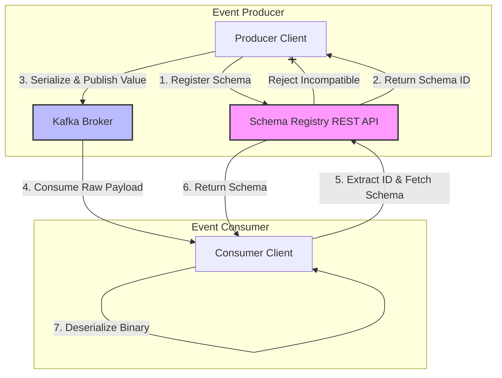
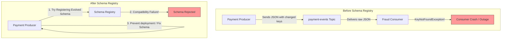
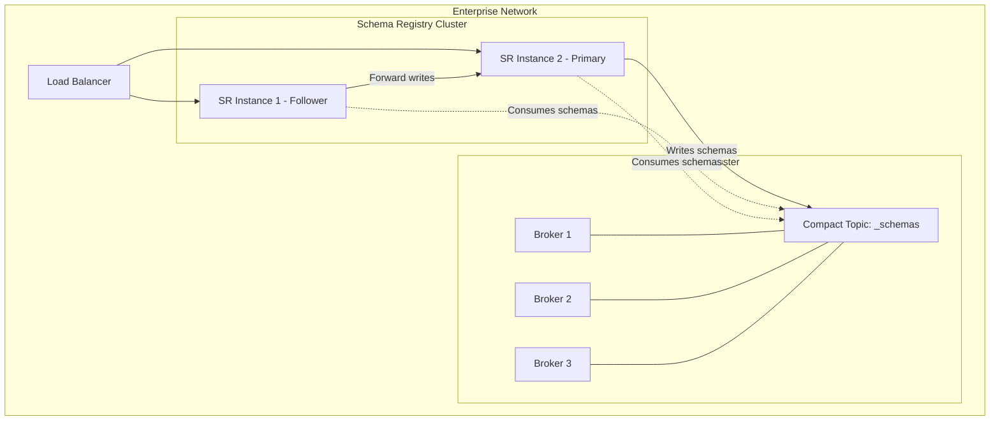
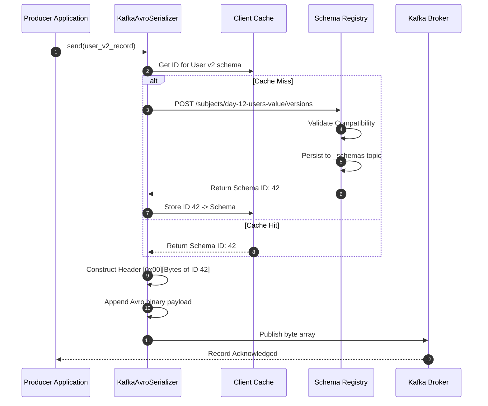
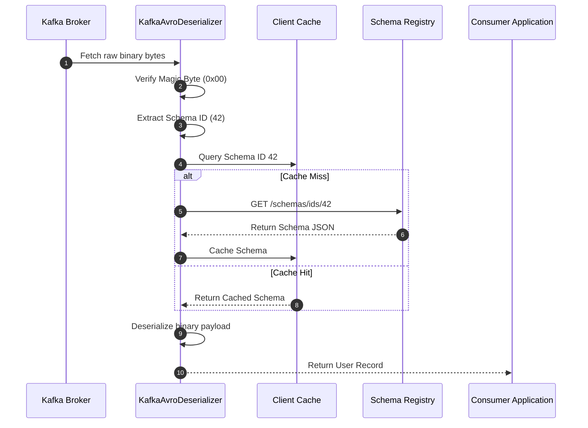
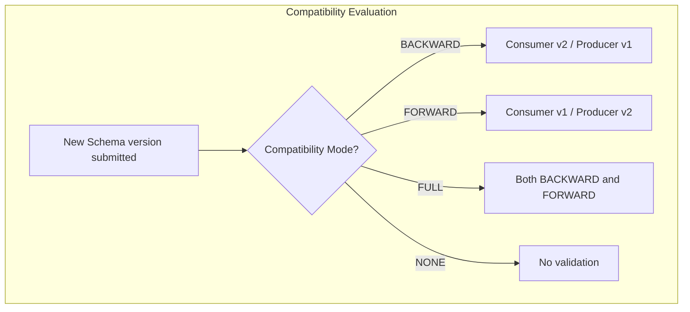
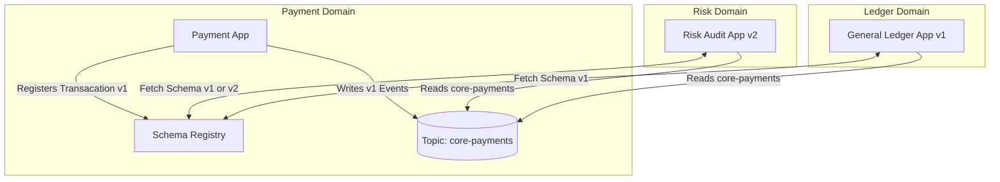

# Day 12 — Apache Kafka Schema Registry, Apache Avro & Schema Evolution
## Streaming Foundation: Designing, Operating, and Troubleshooting Contract-First Event-Driven Architectures

---

## 📌 Module Overview

In modern distributed systems, data is the lifeblood of business operations. When transitioning from monolithic architectures to event-driven architectures (EDA) powered by Apache Kafka, microservices begin communicating asynchronously by publishing and consuming events. However, without a strict mechanism to enforce structure, these architectures quickly devolve into a state of governance chaos—frequently referred to as the **"Schema-less Chaos"** or the **"Wild West of Event Streaming."**

This module provides a first-principles, production-grade dive into **Confluent Schema Registry**, **Apache Avro**, and the mechanics of **Schema Evolution**. By the end of this module, you will understand how to design resilient data contracts, configure Schema Registry for high availability, write schema-aware producers and consumers in both Python and Java, automate compatibility checks in CI/CD, and resolve real-world production outages using our troubleshooting playbook.

---

# SECTION 1 — INTRODUCTION

## 1.1 Why Schemas Matter in Distributed Systems
In a traditional database-centric application, the database schema serves as the single source of truth. If a developer wishes to modify a database column, they run a migration script. If the change breaks code, the compilation or transaction fails immediately.

In a decoupled event-driven system, there is no shared database. Instead, microservices communicate by sending messages across Kafka topics. In this model, the message structure itself is the API. If a producer service changes the structure of an event (e.g., renames a field from `user_id` to `userId`) without notifying downstream consumers, those consumers will fail to parse the event, leading to crashes, data loss, or silent data corruption.

A **Schema** is a formal declaration of the data structure. It represents a binding contract between producers and consumers. By enforcing schemas, organizations ensure:
1. **Semantic Clarity**: Everyone agrees on what fields exist, their types, and whether they are optional or required.
2. **Data Quality**: Invalid events are rejected at the edge before they enter the system.
3. **Decoupling**: Teams can evolve their applications independently if they adhere to schema evolution rules.

## 1.2 The Problems with Schema-less Messaging
Many early event-driven projects start by sending schema-less payloads, usually raw JSON or string-delimited values (CSV). While convenient initially, this approach introduces severe production risks:

- **Key Repetition Overhead**: JSON is a text-based format where every single message contains both the keys and the values. For example, in a message like `{"transactionId": "TX-1002", "amount": 99.99}`, the key strings `"transactionId"` and `"amount"` represent up to 70% of the total network and storage payload. Scale this to billions of events, and the infrastructure costs skyrocket.
- **No Type Safety**: A producer can accidentally write a string (`"ninety-nine"`) into a field that the consumer expects to be a double. The deserializer will crash at runtime.
- **Silent Data Corruption**: If a consumer does not crash but ignores unrecognized fields, critical information (like fraud scores or compliance indicators) may be dropped silently.
- **Upstream-Downstream Gridlock**: Whenever a schema change is needed, engineers must coordinate deployment. Consumers must be updated *before* producers write new formats, creating organizational dependency loops.

```
Timeline of Serialization Formats:

   [CSV / Delimited]   ──►   [XML / SOAP]        ──►   [JSON]               ──►   [Avro / Protobuf]
   - Flat, raw text          - Rich metadata            - Human readable           - Binary encoded
   - No structure            - High parsing overhead    - Keys repeated            - Schema decoupled
   - Brittle parsing         - Verbose tag syntax       - No strict contract       - High throughput
```

## 1.3 Comparative Analysis: JSON vs. Avro vs. Protobuf

| Feature | JSON | Apache Avro | Protocol Buffers (Protobuf) |
| :--- | :--- | :--- | :--- |
| **Serialization Type** | Text-based | Binary | Binary |
| **Schema Included?** | Yes (implicit in keys) | No (stored in registry) | No (compiled in client) |
| **Performance** | Slow (CPU-bound parsing) | Extremely Fast | Extremely Fast |
| **Payload Size** | Large | Extremely Small | Very Small |
| **Schema Evolution** | Native but unguided | Built-in rules | Field number mapping |
| **Code Generation** | Optional | Optional (Supports Generic) | Required (via protoc) |
| **Best Used For** | Web APIs, human inspection | Analytics pipelines, big data | gRPC, low-latency microservices |

## 1.4 What is Schema Registry?
**Confluent Schema Registry** is a lightweight, distributed HTTP service that provides a central repository for storing and managing schemas. It acts as a metadata service that sits alongside your Kafka brokers, enabling contract negotiation between producers and consumers.



---

# SECTION 2 — PROBLEM STATEMENT

## 2.1 The Crisis Before Schema Registry
To understand the value of Schema Registry, consider a typical fintech platform containing a Payment Gateway (Producer) and a Fraud Analysis Engine (Consumer). 

### Scenario A: Schema-less Chaos (JSON)
The Payment Gateway sends transaction events to a topic `payment-events`:
```json
{"tx_id": "TX-9901", "amount": 1500.0, "currency": "USD"}
```
One day, the gateway team updates their system to support multi-currency formatting, renaming `tx_id` to `transactionId` and splitting `amount` into `majorUnits` and `minorUnits`. They push the release.

Downstream, the Fraud Analysis Engine attempts to parse the payload. Since `tx_id` is missing, the code throws a `NullPointerException`. The consumer crashes, lag builds up, and fraud detection stops.



## 2.2 Schema-less vs. Schema-Managed Messaging
Without a schema validator, Kafka acts simply as a dumb pipe for bytes. It does not inspect payloads, allowing garbage data to contaminate downstream data lakes (HDFS, S3). 

With a schema manager:
- **Contract Enforcement**: Messages are validated on the client side before hitting the network.
- **Fail-Fast Mechanics**: The producer throws a local serialization error if a developer tries to push invalid data structures.
- **Governance At Scale**: Organizations can track who owns what data and how it is changing over time.

---

# SECTION 3 — ARCHITECTURE DEEP DIVE

## 3.1 Component Architecture
A production-grade Confluent Schema Registry deployment consists of several cooperative components.



### 1. Schema Registry Server
An HTTP server that exposes a RESTful interface for registering, retrieving, and checking schemas. Multiple Schema Registry instances run as a stateless cluster for high availability.

### 2. The `_schemas` Kafka Topic
Schema Registry uses Kafka itself as its storage engine. All registered schemas are stored in a special internal compacted topic named `_schemas` (configured with a single partition to guarantee absolute ordering of writes).

### 3. Primary/Replica Coordination
Within the Schema Registry cluster, a single node is elected as the **Primary (Leader)** via Kafka coordinator groups. All follower nodes function as read-only replicas. When a write request (registration) hits a follower node, it proxy-forwards the write to the Primary node. The Primary writes the schema to the `_schemas` topic. All nodes continuously tail this topic, caching the schemas locally in memory.

### 4. Schema Cache
To ensure sub-millisecond serialization speeds, Schema Registry nodes and client serializers cache schemas. The clients do not call the HTTP REST API for every message; they only make network calls on a cache miss (e.g., when encountering a new Schema ID).

---

# SECTION 4 — INTERNAL WORKING (THE WIRE PROTOCOL)

## 4.1 The Confluent Avro Wire Format
A key optimization of Confluent's implementation is that the Avro schema is **not** packaged inside the message payload. Instead, Confluent prepends a 5-byte header to the binary Avro payload.

```
Confluent Avro Wire Format:
┌───────────┬────────────────────────┬────────────────────────────────────────┐
│ Magic Byte│ Schema ID (Big Endian) │ Serialized Avro Binary Payload         │
│  (1 Byte) │       (4 Bytes)        │            (Variable Size)             │
├───────────┼────────────────────────┼────────────────────────────────────────┤
│   0x00    │   0x00 0x00 0x00 0x2A  │ 0x06 0x61 0x6C 0x69 0x63 0x65 ...      │
└───────────┴────────────────────────┴────────────────────────────────────────┘
```
- **Magic Byte (Byte 0)**: Always `0x00`. Signals to the deserializer that this payload follows the Confluent Schema Registry wire format.
- **Schema ID (Bytes 1–4)**: A 32-bit big-endian integer representing the unique identifier of the schema in the registry.
- **Avro Payload (Bytes 5+)**: The raw binary Avro data serialized according to the matching schema.

## 4.2 Sequence of Operations: Publishing and Consuming

### Producer Write Path
1. The application invokes `producer.send(record)`.
2. The serializer extracts the Avro schema from the record object.
3. The serializer checks its local cache. On a cache miss, it queries the Schema Registry via `POST /subjects/<subject-name>/versions`.
4. The Registry checks compatibility. If approved, it returns the Schema ID (e.g., ID `42`).
5. The serializer prepends `0x00` and the bytes of ID `42` to the binary Avro payload.
6. The compiled byte array is sent to the Kafka broker.



### Consumer Read Path
1. The consumer pulls raw bytes from Kafka.
2. The deserializer reads the first byte. It verifies it is `0x00`.
3. The deserializer extracts the next 4 bytes to read the Schema ID (ID `42`).
4. The deserializer checks its local memory cache. If ID `42` is not cached, it calls the Schema Registry via `GET /schemas/ids/42`.
5. The registry returns the Avro schema JSON.
6. The deserializer caches the schema and uses it to parse the binary payload into a typesafe object.
7. The deserializer returns the record to the consumer application.



---

# SECTION 5 — CORE CONCEPTS & SCHEMA EVOLUTION

## 5.1 Apache Avro Fundamentals
Apache Avro is a language-agnostic data serialization system. It defines data structures using JSON, but serializes data into a compact binary format. 

### Primitive Types
Avro supports standard primitives: `null`, `boolean`, `int` (32-bit), `long` (64-bit), `float`, `double`, `bytes`, and `string`.

### Complex Types
- **Records**: A collection of named fields.
- **Enums**: A set of fixed symbols.
- **Arrays**: A list of items of a specified type.
- **Unions**: Represented as JSON arrays, indicating the field can be one of multiple types. E.g., `["null", "string"]` is the standard way to declare an optional string field.

## 5.2 Subject Naming Strategies
A **Subject** is the scope under which schemas are versioned. There are three primary subject naming strategies:

1. **`TopicNameStrategy` (Default)**:
   - The subject name is derived from the topic. For topic `orders`, the value schema subject is `orders-value` and the key schema subject is `orders-key`.
   - *Implication*: Every event in a topic must share the same schema structure (single-event topics).
2. **`RecordNameStrategy`**:
   - The subject name is the fully qualified Avro record namespace and name. For example, `com.hadoop.schema.User`.
   - *Implication*: Allows multiple different event types to exist in the same Kafka topic.
3. **`TopicRecordNameStrategy`**:
   - Compiles the topic name and the record name. E.g., `orders-com.hadoop.schema.User`.
   - *Implication*: Restricts the logical events inside a topic to a controlled list of schema namespaces.

## 5.3 Schema Compatibility Modes
When a schema is updated, Schema Registry evaluates it against previous versions according to the configured compatibility mode.



### 1. BACKWARD (Default)
- **Rule**: Consumers running the *new* schema (v2) can read data written by producers running the *old* schema (v1).
- **Use Case**: Upgrade your consumer microservices first, then upgrade your producers.
- **Allowed Changes**: Deleting fields, adding optional fields (with defaults).

### 2. FORWARD
- **Rule**: Consumers running the *old* schema (v1) can read data written by producers running the *new* schema (v2).
- **Use Case**: Upgrade your producers first, then upgrade your consumers.
- **Allowed Changes**: Adding fields, deleting optional fields.

### 3. FULL
- **Rule**: Both backward and forward compatible. Old consumers read new data, and new consumers read old data.
- **Use Case**: High-velocity platforms where systems are upgraded in any order.
- **Allowed Changes**: Adding optional fields, deleting optional fields.

### 4. NONE
- **Rule**: No validation checks are run.
- **Use Case**: Development phases or prototyping.

### Transitive Compatibility
By default, Schema Registry only validates a new schema against the *latest* active version. If you enable **Transitive** modes (e.g., `BACKWARD_TRANSITIVE`), the registry checks the new schema against *all* previously registered versions of that subject, preventing changes that might break legacy consumers reading historical data.

---

# SECTION 6 — PRODUCTION ENGINEERING

## 6.1 Schema Governance & CI/CD Pipelines
In production enterprise architectures, developers should never allow application clients to auto-register schemas directly. Instead, schemas are managed as code in a git repository.

```
CI/CD Schema GitOps Flow:
[Developer PR] ──► [Linter check] ──► [Register Compatibility Check (API test)] ──► [Merge] ──► [Deploy/Publish via curl/Maven]
```
1. **Repository Structure**: Store schemas in a central Git repo sorted by subject.
2. **Linting**: Run JSON linter checks on pull requests.
3. **Compatibility Gates**: Integrate Confluent's Schema Registry Maven or Gradle plugin. The pipeline executes:
   ```bash
   mvn schema-registry:test-compatibility
   ```
   If the compatibility check fails, the PR build fails and the deployment is blocked.

## 6.2 High Availability and Load Balancing
- **Node Spanning**: Deploy a minimum of 3 Schema Registry nodes distributed across separate physical zones or Kubernetes nodes.
- **Load Balancing**: Front the instances with an NGINX or HAProxy load balancer. Configure active health checks on the `/subjects` endpoint.
- **Sticky Sessions**: Not required. Follower nodes will automatically proxy mutation queries to the active primary node.

## 6.3 Security Hardening
1. **Network Encryption**: Secure all client-to-registry communication using HTTPS (TLS 1.3).
2. **Authentication**: Enforce Basic Authentication or mutual TLS (mTLS) for authorization.
3. **Broker Authorization**: Protect the internal `_schemas` topic using Kafka Access Control Lists (ACLs). Only the Schema Registry service account must have `Write` and `Read` permissions on `_schemas`. No user application should access it directly.

## 6.4 Performance Tuning
- **Local Client Caching**: Set the cache capacity in Java serializers (`max.schemas.per.subject`) to a value larger than the total number of schema versions.
- **Heap Sizing**: Standardize the JVM garbage collection settings. Schema Registry is extremely memory-light. A 2GB heap (`-Xms2g -Xmx2g`) using the G1 garbage collector is sufficient to handle 10,000 requests per second.

---

# SECTION 7 — HANDS-ON LAB: REGISTER AND EVOLVE SCHEMAS

This lab guides you through starting a local environment, validating schema payloads, registering versions, producing/consuming data, and testing compatibility boundaries.

## 7.1 Setup the Cluster
Launch the Kafka, Schema Registry, and AKHQ Docker containers:
```bash
# Navigate to the Day 12 Docker folder
cd d:/30_Days_of_Modern_Hadoop_Ecosystem/Day-12-Kafka-Schema-Registry/docker

# Boot container services
docker-compose up -d
```
*Expected Output:*
```
[+] Running 4/4
 ⠿ Network day12-network            Created
 ⠿ Container kafka-day12            Healthy
 ⠿ Container schema-registry-day12  Healthy
 ⠿ Container akhq-day12             Started
```

Verify that the Schema Registry API is online:
```bash
curl -s http://localhost:8081/subjects
```
*Expected Output:*
```json
[]
```

---

## 7.2 Run Automated Comparison (JSON vs. Avro)
Run the script to see the actual size savings of Avro over JSON:
```bash
# Navigate to the scripts directory
cd ../scripts

# Execute comparison script
./verify-avro.sh
```
*Expected Output:*
```
=== Avro vs JSON Serialization Size Comparison ===
[*] Original Payload Record: {'id': 'usr_101', 'name': 'Alice Developer', 'email': 'alice.developer@enterprise.bank', 'timestamp': 1719999999000}

[1] JSON Format:
    - Payload: {"id": "usr_101", "name": "Alice Developer", "email": "alice.developer@enterprise.bank", "timestamp": 1719999999000}
    - Size:    110 bytes
[2] Avro Binary Format:
    - Payload: 0e7573725f3130311e416c69636520446576656c6f7065723e616c6963652e646576656c6f70657240656e74657270726973652e62616e6b80d0d8b79ca332
    - Size:    65 bytes

[✓] Space Savings:
    - Avro saved 45 bytes (40.91% reduction) compared to JSON!
```

---

## 7.3 Test Schema Evolution and Compatibility API
Now run the compatibility validation test script, which checks `user-v2-compatible.avsc` and `user-v2-incompatible.avsc` against the registry rules:
```bash
./verify-schema-compatibility.sh
```
*Expected Output:*
```
=== Schema Compatibility Verification Script ===
Checking if subject 'day-12-users-value' exists...
[!] Subject not found. Registering schemas/user-v1.avsc as version 1 first...
{"id":1}
[✓] Registered v1 schema.

[1] Testing compatibility of 'schemas/user-v2-compatible.avsc' against latest version...
Response from Registry: {"is_compatible":true}
[✓] SUCCESS: user-v2-compatible.avsc is COMPATIBLE.

[2] Testing compatibility of 'schemas/user-v2-incompatible.avsc' against latest version...
Response from Registry: {"is_compatible":false}
[✓] SUCCESS: Schema Registry correctly flagged user-v2-incompatible.avsc as INCOMPATIBLE!
```

---

## 7.4 Execute End-to-End Event Processing Flow
Run the master orchestration script to demonstrate the lifecycle of schema evolution (registering v1, producing v1 events, consuming them, updating to v2-compatible, producing v2 events, and blocking incompatible payloads):
```bash
./producer-consumer-demo.sh
```
*Expected Output:*
```
=== Schema-Aware Producer & Consumer Integration Demo ===
[*] Creating Python Virtual Environment (venv-day12)...
[*] Installing Python dependencies...
[*] Resetting compatibility level of 'day-12-users-value' to BACKWARD...

[1] Producing events with v1 schema...
=== Starting Schema-Aware Avro Producer ===
[*] Generating 3 test messages...
[*] Producing record: {'id': 'usr_101', 'name': 'User Name 1', 'email': 'user1@example.com', 'timestamp': 1783000000000}
[✓] Message delivered to partition 0 at offset 0
...

[2] Consuming events with client-side deserialization...
=== Starting Schema-Aware Avro Consumer ===
[*] Consumer active. Waiting for messages.
[✓] Event Decoded Successfully!
    - Payload:   {'id': 'usr_101', 'name': 'User Name 1', 'email': 'user1@example.com', 'timestamp': 1783000000000}
...

[3] Producing events with evolved compatible v2 schema...
=== Starting Schema-Aware Avro Producer ===
[*] Producing record: {'id': 'usr_101', 'name': 'User Name 1', 'email': 'user1@example.com', 'timestamp': 1783000000000, 'phoneNumber': '+1-555-0101', 'status': 'ACTIVE'}
[✓] Message delivered to partition 0 at offset 3
...

[4] Consuming all events from the beginning (v1 + v2)...
=== Starting Schema-Aware Avro Consumer ===
[✓] Event Decoded (v1 Record read by v2 consumer using default values):
    - Payload:   {'id': 'usr_101', 'name': 'User Name 1', 'email': 'user1@example.com', 'timestamp': 1783000000000, 'phoneNumber': None, 'status': 'ACTIVE'}
[✓] Event Decoded (v2 Record read by v2 consumer):
    - Payload:   {'id': 'usr_101', 'name': 'User Name 1', 'email': 'user1@example.com', 'timestamp': 1783000000000, 'phoneNumber': '+1-555-0101', 'status': 'ACTIVE'}

[5] Attempting to produce with INCOMPATIBLE schema...
[✓] SUCCESS: Schema Registry successfully BLOCKED the incompatible schema!
```

---

# SECTION 8 — BUILD FROM SOURCE

For engineering teams looking to customize Schema Registry behaviors or run custom plugins (e.g., policy constraints on names), building Schema Registry from source is required.

## 8.1 Repository Layout
The Confluent Schema Registry source code is a Maven multi-module Java project:
- `client/`: The Java client containing core serializing logic and Cache classes.
- `core/`: The core engine responsible for REST APIs and election mechanics.
- `maven-plugin/`: The GitOps companion validation tool.

## 8.2 Building the Project
To build from source:
1. Ensure Java JDK 11 and Apache Maven 3.8+ are installed.
2. Clone the official repository:
   ```bash
   git clone https://github.com/confluentinc/schema-registry.git
   cd schema-registry
   ```
3. Checkout the matching release tag:
   ```bash
   git checkout v7.6.0
   ```
4. Execute compile and packaging:
   ```bash
   mvn clean package -DskipTests
   ```
5. The runnable binaries will be output under `core/target/schema-registry-core-7.6.0-development/bin/schema-registry-start`.

---

# SECTION 9 — DOCKER DEPLOYMENT

The local cluster environment configuration details:

### `docker-compose.yml`
```yaml
version: '3.8'

services:
  kafka-day12:
    image: confluentinc/cp-kafka:7.6.0
    container_name: kafka-day12
    hostname: kafka-day12
    restart: unless-stopped
    ports:
      - "19092:19092"
    environment:
      KAFKA_NODE_ID: 1
      KAFKA_PROCESS_ROLES: 'broker,controller'
      KAFKA_CONTROLLER_QUORUM_VOTERS: '1@kafka-day12:9093'
      KAFKA_LISTENERS: 'PLAINTEXT://:9092,CONTROLLER://:9093,EXTERNAL://:19092'
      KAFKA_ADVERTISED_LISTENERS: 'PLAINTEXT://kafka-day12:9092,EXTERNAL://localhost:19092'
      KAFKA_CONTROLLER_LISTENER_NAMES: 'CONTROLLER'
      KAFKA_LISTENER_SECURITY_PROTOCOL_MAP: 'PLAINTEXT:PLAINTEXT,CONTROLLER:PLAINTEXT,EXTERNAL:PLAINTEXT'
      KAFKA_INTER_BROKER_LISTENER_NAME: 'PLAINTEXT'
      KAFKA_OFFSETS_TOPIC_REPLICATION_FACTOR: 1
      KAFKA_LOG_DIRS: '/var/lib/kafka/data'
      CLUSTER_ID: '6L62ZDwCQIK-GGy4aG37wB'
    healthcheck:
      test: ["CMD-SHELL", "kafka-topics.sh --bootstrap-server localhost:9092 --list || exit 1"]
      interval: 10s
      timeout: 5s
      retries: 5
    networks:
      - day12-network

  schema-registry-day12:
    image: confluentinc/cp-schema-registry:7.6.0
    container_name: schema-registry-day12
    hostname: schema-registry-day12
    restart: unless-stopped
    ports:
      - "8081:8081"
    environment:
      SCHEMA_REGISTRY_HOST_NAME: schema-registry-day12
      SCHEMA_REGISTRY_KAFKASTORE_BOOTSTRAP_SERVERS: 'kafka-day12:9092'
      SCHEMA_REGISTRY_LISTENERS: 'http://0.0.0.0:8081'
      SCHEMA_REGISTRY_COMPATIBILITY_LEVEL: 'backward'
    depends_on:
      kafka-day12:
        condition: service_healthy
    networks:
      - day12-network

networks:
  day12-network:
    name: day12-network
    driver: bridge
```

---

# SECTION 10 — LOCAL CLUSTER DEPLOYMENT

For bare-metal and VM installations (e.g. RedHat or Ubuntu clusters):

## 10.1 Single-Node VM Configuration
1. Install Schema Registry package via apt/yum:
   ```bash
   sudo apt-get install confluent-schema-registry
   ```
2. Modify `/etc/schema-registry/schema-registry.properties`:
   ```properties
   listeners=http://0.0.0.0:8081
   kafkastore.bootstrap.servers=PLAINTEXT://10.0.0.10:9092
   kafkastore.topic=_schemas
   debug=false
   ```
3. Start the systemd service daemon:
   ```bash
   sudo systemctl start confluent-schema-registry
   ```

## 10.2 Multi-Node VM Clustering (High Availability)
Configure 3 VMs with identical settings, pointing to the shared Kafka bootstrap nodes:
- SR VM 1 (IP `10.0.0.21`)
- SR VM 2 (IP `10.0.0.22`)
- SR VM 3 (IP `10.0.0.23`)

Ensure load balancing proxy (NGINX) distributes TCP or HTTP traffic evenly to the port `8081` on these VMs.

---

# SECTION 11 — VALIDATION SCRIPTS REFERENCE

The `scripts/` directory includes five testing utilities:
1. **`verify-schema-registry.sh`**: Probes API status endpoints.
2. **`verify-avro.sh`**: Shows relative size footprints of JSON vs Avro byte-arrays.
3. **`verify-schema-compatibility.sh`**: Executes schema validation API checks on the registry.
4. **`verify-schema-version.sh`**: Registers multiple schema versions and fetches metadata by ID.
5. **`producer-consumer-demo.sh`**: Runs end-to-end Python producer/consumer test.

---

# SECTION 12 — PRODUCTION TROUBLESHOOTING PLAYBOOK

Detailed diagnostic signals and mitigation operations:

### 12.1 Schema compatibility issues
- **Symptom**: Producer fails to start, logging: `SchemaRegistryException: Schema being registered is incompatible with an earlier schema`.
- **Root Cause**: An application release changes schemas dynamically without providing a fallback default value for added/deleted fields.
- **Resolution**:
  Run a debug print to check the active compatibility mode:
  ```bash
  curl -s http://localhost:8081/config/day-12-users-value
  ```
  If emergency override is needed to allow hotfix deployment:
  ```bash
  curl -X PUT -H "Content-Type: application/vnd.schemaregistry.v1+json" \
    --data '{"compatibility": "NONE"}' \
    http://localhost:8081/config/day-12-users-value
  ```

### 12.2 Registry Connection Timeouts
- **Symptom**: Client crashes with `ConnectException: Connection refused` or `SocketTimeoutException`.
- **Root Cause**: Local firewall blocking port `8081`, Schema Registry node crashed, or DNS routing issue.
- **Resolution**:
  Inspect service ports from the terminal:
  ```bash
  curl -I http://localhost:8081/subjects
  ```
  Look at the container logs to check for out-of-memory errors:
  ```bash
  docker logs schema-registry-day12 | tail -n 100
  ```

---

# SECTION 13 — REAL-WORLD CASE STUDY

## Case Study: Enterprise Banking Event Platform



### Context
A global tier-1 bank transitioned its settlement system to a microservice topology built on Kafka. The core topic `core-payments` was consumed by multiple distinct line-of-business domains (Risk auditing, Ledgers, Analytics, Fraud Detection).

### Challenges
- **No coordination deployment**: The Payment team needed to deploy schema modifications without coordinating with downstream consumption teams.
- **Strict Data Audit**: Regulatory compliance demanded that no invalid schemas enter Kafka.

### Solution
1. **Avro Format Enforce**: The platform team mandated Avro serialization and blocked all non-Avro data.
2. **Subject Strategy**: Standardized on `TopicRecordNameStrategy` to keep transaction contexts separated.
3. **Registry HA Layout**: Deployed 3 Schema Registry instances fronted by NGINX.
4. **CI/CD Integration**: Linked GitHub Actions with Schema Registry. Any pull request trying to modify schemas automatically triggered a compatibility test.
5. **Compatibility Mode**: Subject policy was locked to `FULL_TRANSITIVE`. This guaranteed that any ledger service reading data from 5 years ago could still compile messages today.

---

# SECTION 14 — INTERVIEW QUESTIONS (60 QUESTIONS & DETAILED ANSWERS)

## 📌 Beginner Questions (20)

### 1. What is Apache Avro?
Apache Avro is a data serialization framework that uses a JSON schema to define structures, compiling them down into high-performance, compact binary payloads.

### 2. Why are schemas required in distributed event streaming?
Schemas establish a binding api contract between decoupled components. They prevent consumers from breaking when producers modify payload models.

### 3. What is the Confluent Schema Registry?
It is a dedicated metadata HTTP service that stores version history of schemas, validating and mapping them to Kafka topics.

### 4. What is a "Subject" in Schema Registry?
A subject is a collection of schema versions associated with a Kafka topic (e.g. `topic-value` or `topic-key`).

### 5. What are the 5 bytes prepended to Confluent Avro messages?
Byte 0 is the Magic Byte (`0x00`). Bytes 1–4 are the 32-bit big-endian integer Schema ID.

### 6. Where does Schema Registry store its data?
It writes data to a compacted internal Kafka topic called `_schemas`.

### 7. What is backward compatibility?
A mode where consumers upgraded to the new schema can read data written under older schemas.

### 8. What is forward compatibility?
A mode where legacy consumers can read data generated by producers running newer schemas.

### 9. What does the "NONE" compatibility mode mean?
No compatibility validations are run when a new schema version is registered.

### 10. What is a schema cache?
A memory buffer on clients and servers that stores resolved schemas to avoid querying the network for every message.

### 11. Can a Kafka topic contain both key and value schemas?
Yes. Key schemas are stored under `<topic>-key` and value schemas under `<topic>-value`.

### 12. What happens if a producer writes a message with an incompatible schema?
The client serializer contacts Schema Registry, receives a `409 Conflict`, and aborts serialization locally, throwing a runtime exception.

### 13. What is JSON schema-less overhead?
Repetition of key strings in every message, leading to excessive bandwidth consumption.

### 14. What is a Magic Byte?
A validation marker (`0x00` in Confluent) signaling that the remaining payload begins with a 4-byte Schema ID.

### 15. How do you check registered subjects using curl?
`GET http://localhost:8081/subjects`

### 16. What is a Union in Avro?
A container indicating a field can hold one of multiple types (e.g. `["null", "string"]`).

### 17. Why is `_schemas` topic configured with 1 partition?
To enforce absolute linear ordering of schema writes and prevent version race conditions.

### 18. What is the default port of Schema Registry?
`8081`

### 19. Can Avro represent optional fields?
Yes, using a Union containing the `null` type and providing a default value of `null`.

### 20. What is the primary role of serializers and deserializers?
Serializers translate runtime code objects to wire bytes; deserializers recreate objects from wire bytes.

---

## 📌 Intermediate Questions (20)

### 21. Explain the difference between BACKWARD and BACKWARD_TRANSITIVE.
`BACKWARD` only compares the new schema against the latest version (v-next vs v-current). `BACKWARD_TRANSITIVE` checks the new schema against *all* past versions (v-next vs v1, v2, v3...).

### 22. What happens if the Schema Registry is offline at the moment a producer starts?
The producer will fail to boot on its first write, throwing a connection refused exception because it cannot fetch or register the schema ID.

### 23. What happens if the Schema Registry goes offline *after* the producer and consumer have been running for hours?
The clients will continue working uninterrupted because the schema-to-ID mapping is cached in the client memory.

### 24. How does leader election work in a Schema Registry cluster?
Nodes join a group using Kafka's group coordinator protocol. The coordinator elects a group leader (Primary) which coordinates writes to the `_schemas` topic.

### 25. Explain the `RecordNameStrategy` naming strategy.
Schemas are registered using the name of the Avro record itself (e.g., `com.bank.Transaction`) rather than the topic name. This allows a single topic to contain multiple event types.

### 26. When would you use `TopicRecordNameStrategy`?
When you want to structure your topic to contain a restricted, version-controlled set of distinct record types.

### 27. How does Schema Registry ensure that Schema IDs are globally unique?
The Primary node allocates sequential integer IDs from its local state, writing the assigned IDs to the `_schemas` topic to sync state cluster-wide.

### 28. What is the default compatibility level in Confluent Schema Registry?
`BACKWARD`

### 29. Can you change the compatibility level of a single subject without changing the global level?
Yes, by sending a `PUT /config/<subject>` request to override the default configuration for that specific subject.

### 30. Describe the Avro schema fingerprint.
An MD5 or SHA-256 hash of the normalized schema string, used to uniquely identify schema structures locally.

### 31. Explain the "Specific Reader" in Java Avro.
An option (`specific.avro.reader=true`) that instructs the deserializer to map binary payloads into generated class structures rather than generic dictionaries.

### 32. What is a `GenericRecord` in Apache Avro?
A generic map-like structure used to interact with Avro records when pre-compiled Java classes are not available.

### 33. How does Schema Registry handle authorization?
Via ACLs on the `_schemas` topic, Basic Authentication, or integration with external systems like LDAP or Apache Ranger.

### 34. What is the impact of setting compatibility to "NONE"?
You lose schema validation safety. Producers can write corrupted payloads, leading to downstream consumer failures.

### 35. Explain how compaction works on the `_schemas` topic.
Kafka retains only the latest record for each key. Since the key is the subject name and version, old schema definitions are preserved, but tombstoned entries are purged.

### 36. How do you delete a schema version?
`DELETE /subjects/<subject>/versions/<version>`. This performs a soft delete. Append `?permanent=true` for a hard delete.

### 37. What is the role of the Avro Maven plugin?
To automate class compilation, generating Java code files from `.avsc` schema definitions.

### 38. How does Schema Registry support Protobuf and JSON Schema?
By exposing registry endpoints configured to parse and validate Protobuf syntax (`.proto`) and JSON schemas (`.json`) alongside Avro.

### 39. Can two identical schemas have different Schema IDs?
No. If the exact same schema structure is registered under the same subject, Schema Registry returns the existing ID.

### 40. How do you handle schema caching in high-throughput environments?
Increase JVM memory and tune `max.schemas.per.subject` to prevent eviction-induced network overhead.

---

## 📌 Advanced Questions (20)

### 41. How does the follower node forward write requests to the Primary node?
Follower nodes use a configured REST client. When they receive a mutation request, they forward the HTTP request to the Primary's advertised host IP.

### 42. Explain the detailed mechanics of "Transitive" compatibility modes.
Transitive checks require that the new schema satisfies compatibility checks against all previously registered schemas in the subject. This is critical for data lakes containing historical files.

### 43. Why is `FULL_TRANSITIVE` the recommended configuration for multi-tenant data platforms?
It guarantees that any reader can read any message written at any point in the history of the event stream, regardless of deployment order.

### 44. What are the performance implications of using `RecordNameStrategy` at scale?
It increases client-side cache misses and memory footprints, as clients must cache schemas for many different record types instead of a single topic-level schema.

### 45. How does the Confluent Wire Format affect stream processing engines like Kafka Streams or Apache Flink?
These engines must be configured with Schema Registry-aware Serdes. Otherwise, they will treat the 5-byte header as payload data and crash during processing.

### 46. What happens if the `_schemas` topic partition size is set to greater than 1?
It breaks global ordering. Multiple nodes could assign the same Schema ID to different schemas concurrently, causing cluster-wide cache corruption.

### 47. Explain how to recover a Schema Registry cluster from a corrupted `_schemas` topic.
1. Stop all Schema Registry nodes.
2. Read the `_schemas` topic to identify the invalid record.
3. Rewrite the topic up to the corruption point, or manually write a tombstone record to erase the invalid entry.
4. Restart the Schema Registry nodes to rebuild their caches.

### 48. How do you migrate a Schema Registry cluster to a new Kafka cluster?
1. Configure Schema Registry nodes to read from the old Kafka cluster's `_schemas` topic.
2. Mirror the `_schemas` topic to the new Kafka cluster using MirrorMaker 2.
3. Update the Schema Registry config to point to the new cluster.
4. Restart the Schema Registry nodes.

### 49. How do you implement schema-based routing in Kafka?
Extract the Schema ID from the 5-byte header in a custom interceptor, query the registry to get the record name, and route the message to the appropriate topic.

### 50. Explain the schema validation mechanism on the broker side.
Confluent Server supports Broker-Side Schema Validation. The broker inspects the 5-byte header of incoming messages and rejects them if they do not match the topic's registered schemas.

### 51. What is the impact of Avro's "zig-zag" integer encoding on payload size?
It maps signed integers to unsigned integers using variable-length encoding, compressing small numbers into a single byte on the wire.

### 52. How does Schema Registry handle circular dependencies in schemas?
By utilizing reference mappings in the registry payload, allowing a schema to reference another registered schema by its subject and version.

### 53. How do you configure mutual TLS (mTLS) for Schema Registry?
1. Enable SSL on the listeners.
2. Configure truststores and keystores on both the client and server.
3. Set `client.auth=need` in the Schema Registry properties.

### 54. Explain the differences between Schema Registry's logical types and primitive types.
Logical types add semantic meaning to primitive types (e.g., mapping a `long` primitive to a `timestamp-millis` logical type) without altering the binary encoding.

### 55. What is the purpose of the `/compatibility/subjects/{subject}/versions/{version}` endpoint?
It allows CI/CD pipelines to test compatibility of a proposed schema draft before merging it into production.

### 56. What is split-brain in Schema Registry and how do you prevent it?
Split-brain occurs when multiple nodes believe they are the Primary writer. It is prevented by relying on Kafka's group coordinator protocol to elect a single Primary.

### 57. Can you register a schema that contains references to other schemas?
Yes, using the `references` block in the schema definition payload, which specifies the name, subject, and version of the referenced schema.

### 58. Explain the difference between schema compatibility and schema validation.
Compatibility defines the rules for schema evolution (e.g., BACKWARD). Validation is the process of checking a payload against a schema at runtime.

### 59. How does the Java `KafkaAvroSerializer` handle schema registration internally?
It hashes the schema string, checks its local cache, and if missing, executes a POST request to register the schema and retrieve the Schema ID.

### 60. How do you configure Schema Registry to store schemas in an external database instead of Kafka?
Schema Registry is designed to use Kafka as its storage engine. Storing schemas in an external database is not supported in standard production deployments.

---

# SECTION 15 — KEY TAKEAWAYS & BEST PRACTICES

1. **Contract-First Development**: Design schemas before writing code. Treat schemas as APIs.
2. **Never Use NONE**: Enforce `BACKWARD` or `FULL` compatibility rules on all topics.
3. **Automate CI/CD Checks**: Run compatibility tests on every pull request using the Schema Registry Maven plugin.
4. **Use Default Values**: Always provide a default value when adding new fields to ensure backward compatibility.
5. **Secure the Registry**: Enforce mTLS, HTTPS, and restrict access to the internal `_schemas` topic using Kafka ACLs.

---

# SECTION 16 — REFERENCES & DEEP READS

- [Confluent Schema Registry Documentation](https://docs.confluent.io/platform/current/schema-registry/index.html)
- [Apache Avro Specification](https://avro.apache.org/docs/current/spec.html)
- [Kafka Definitive Guide (O'Reilly)](https://www.oreilly.com/library/view/kafka-the-definitive/9781492043072/)
- [Confluent Blog: Schema Evolution and Compatibility](https://www.confluent.io/blog/schema-registry-kafka-stream-processing-platform-developer-guide/)
