# Day 13 — End-to-End Ingestion Pipelines with Kafka and Object Storage
## Streaming Foundation: Designing, Operating, and Troubleshooting High-Throughput, Resilient Data Ingestion Pipelines in Modern Enterprise Data Platforms

---

## 📌 Module Overview

In modern data architecture, the boundary between real-time action and historical analysis has dissolved. Organizations no longer build batch systems and streaming systems in isolation; instead, they build **unified event-driven data platforms** where every operational click, transaction, and sensor reading is treated as a continuous stream of events. 

At the center of this transformation lies **Data Ingestion**—the architectural layer responsible for capturing data from high-velocity source systems, transporting it reliably across networks, and landing it in storage systems (such as HDFS or S3-compatible object storage) for downstream computation.

This module provides a first-principles, production-grade guide to designing, deploying, and operating **End-to-End Data Ingestion Pipelines** using **Apache Kafka** and S3-compatible storage (like **MinIO**). By the end of this module, you will understand:
- The fundamental mechanisms governing data transport and ingestion.
- The mechanics of client-side batching, retries, and network socket management.
- Exactly-once vs. At-least-once durability semantics.
- How to write schema-conforming producers and buffering consumers in Python.
- How to troubleshoot ingestion degradation, network partitions, and consumer lag.
- How to deploy and manage these systems using Docker Compose.

---

# SECTION 1 — INTRODUCTION

## 1.1 Why Data Ingestion is Required
In an enterprise environment, data is created in a highly distributed, fragmented manner across thousands of endpoints. Web servers produce access logs, mobile applications emit clickstreams, microservices generate database transaction logs, and IoT devices publish telemetry packets. 

Without a dedicated, formal **Data Ingestion Layer**, this information remains locked inside isolated operational silos. Data ingestion is the bridging mechanism that:
1.  **Decouples Producers from Consumers**: Ingests data once, enabling multiple downstream analytics engines (Spark, Trino, Flink) to consume it without overloading the source applications.
2.  **Harmonizes Data Formats**: Normalizes raw, unstructured transport envelopes into structured, compressed, and queryable formats (such as Apache Parquet or ORC) suitable for analytics.
3.  **Guarantees Durability**: Acts as a buffer to survive transient failures of downstream storage systems or downstream consumers, preventing data loss at the source.

## 1.2 Evolution of Enterprise Data Pipelines
Historically, enterprise data movement occurred through periodic batches. Applications wrote transaction records directly to relational databases (OLTP). Overnight, a centralized Extractor-Transformer-Loader (ETL) agent would scrape the OLTP tables, perform heavy transformations, and write the static bulk outputs into a data warehouse (OLAP).

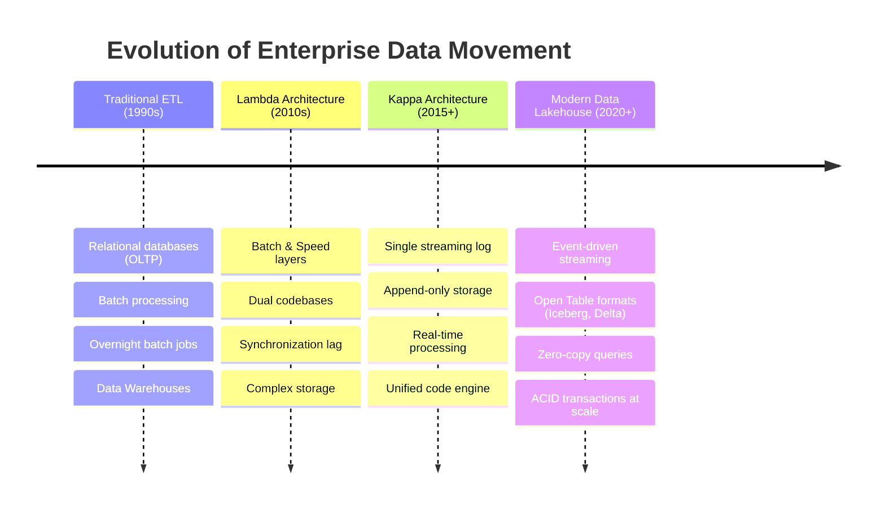

This model broke down under three pressures:
-   **Scale**: Databases could not handle the concurrent read IO required by both operational users and bulk ETL queries.
-   **Latency**: Business decisions required insights in minutes or seconds, not 24-hour intervals.
-   **Variety**: Semi-structured and unstructured data (JSON payloads, sensor records) did not fit easily into rigid relational schemas before landing.

## 1.3 Traditional ETL vs. Event Streaming

| Architectural Dimension | Traditional ETL | Event Streaming (Kafka-centric) |
| :--- | :--- | :--- |
| **Execution Trigger** | Scheduled timer (e.g., every night at 2:00 AM) | Event-driven (triggered immediately by record creation) |
| **Data Access Pattern** | Pull-based database scraping (JDBC/ODBC) | Push-based log append with continuous consumer polling |
| **Coupling** | High (ETL queries directly hit operational databases) | Low (Producers publish to log; consumers read independently) |
| **Data Processing Latency** | Hours to Days | Milliseconds to Seconds |
| **Data Storage State** | Transient files, written then cleared | Persistent, durable commit logs with configurable retention |

## 1.4 Batch vs. Real-time Ingestion
Modern ingestion pipelines operate along a spectrum between pure batch and low-latency real-time:

1.  **Batch Ingestion**: Data is collected, buffered locally or in staging areas, and written to target storage in larger chunks (e.g., hourly or daily). This optimizes for **throughput** and **storage efficiency** (as writing large, contiguous Parquet files reduces storage metadata overhead and improves compression ratios).
2.  **Real-Time (Streaming) Ingestion**: Events are processed and written to storage as soon as they are produced. This prioritizes **latency** but risks creating a **"Small Files Problem"** in the data lake, where millions of kilobyte-sized files exhaust file system namenode metadata space and degrade query engine performance.
3.  **Micro-Batch Ingestion**: The industry-standard middle ground. Events are ingested in real-time but buffered in memory for short intervals (e.g., 10 seconds to 5 minutes, or up to a specific size limit) before being committed to storage. This preserves latency requirements while generating optimal file sizes.

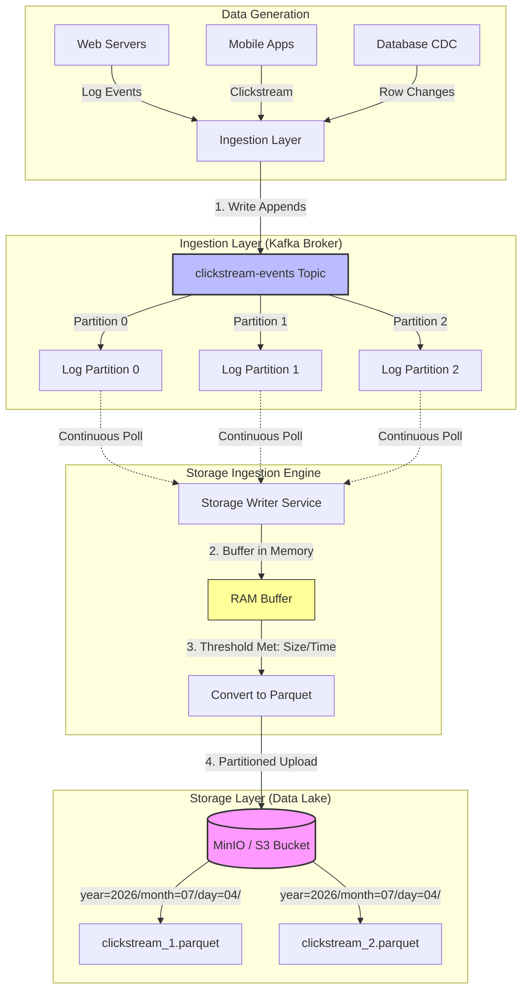

---

# SECTION 2 — PROBLEM STATEMENT

## 2.1 The Crisis of Point-to-Point Architectures
Before the adoption of modern centralized message queues like Apache Kafka, enterprise systems relied on direct point-to-point connections. Each application compiled and formatted its internal data, then pushed it directly to whatever target storage or downstream database needed it.

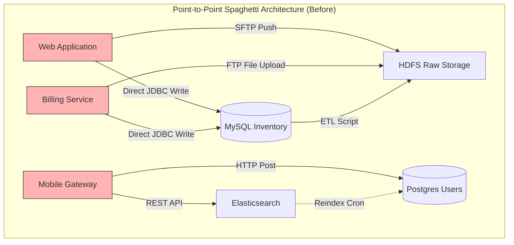

This model suffers from six major failure modes at scale:

1.  **Tight Architectural Coupling**: Every system must know the network endpoint, credentials, and API schema of every target. If the target system schema changes or its port changes, all upstream applications break.
2.  **Data Loss during Outages**: If the target storage system (e.g., HDFS or an S3 endpoint) goes down for maintenance, the producing applications cannot write. They must either block execution (crashing the user interface) or drop the events.
3.  **Connection Exhaustion**: Target databases quickly exhaust their maximum connection pools because hundreds of operational application threads are connecting directly to run data writes.
4.  **Operational Complexity**: Scaling the infrastructure requires a geometric increase in connection pipelines ($N(N-1)/2$ integrations). Maintaining these bespoke scripts becomes a full-time operational nightmare.
5.  **Write Amplification and Latency**: Applications must write the same event to multiple destinations (e.g., to Elasticsearch for search, and to HDFS for analytics). This multiplies network traffic and increases client response times.
6.  **Lack of Backpressure Management**: Target systems can easily be overwhelmed by traffic spikes (e.g., Black Friday shopping events). Relational databases and target file systems do not have native queues to push back against client traffic; they simply run out of memory or disk I/O bandwidth and crash.

## 2.2 The Solution: Event-Driven Ingestion Pipelines
A modern event-driven ingestion architecture decouples data production from consumption by placing a distributed, durable write-ahead log (Apache Kafka) at the center.

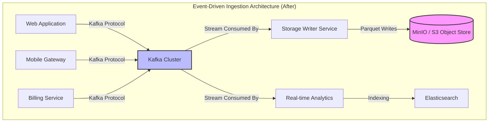

By transitioning to this architecture, organizations resolve point-to-point limitations:
-   **Durability and Replayability**: Kafka persists events to disk, replicate them across brokers, and allows clients to read them at their own pace. If storage goes down, Kafka buffers the data. Once storage recovers, consumption resumes where it left off, with no data lost.
-   **Backpressure Relief**: The consumer (Storage Writer) pulls data from Kafka. It decides when and how much data to read. Under heavy load, the consumer does not crash; instead, its log offset lag increases temporary while it continues to process records at its maximum safe execution speed.
-   **Single Write Target**: Producing applications write each event exactly once to a designated Kafka topic, reducing network egress and CPU serialization costs on the client side.

---

# SECTION 3 — ARCHITECTURE DEEP DIVE

An end-to-end ingestion pipeline contains several cooperative, highly optimized components. Let us examine the technical layout of each layer:

```
+-----------------------------------------------------------------------------------+
|                            ENTERPRISE APPLICATION LAYER                           |
|  +---------------------+   +---------------------+   +---------------------+      |
|  |     Web Producer    |   |   Mobile Producer   |   |   Server Log Agent  |      |
|  +----------+----------+   +----------+----------+   +----------+----------+      |
+-------------|-------------------------|-------------------------|-----------------+
              | (Kafka Client Library: TCP Socket Connection)     |
              +-------------------------+-------------------------+
                                        |
                                        v
+-----------------------------------------------------------------------------------+
|                               KAFKA INGESTION LAYER                               |
|   +---------------------------------------------------------------------------+   |
|   |                           KAFKA BROKER CLUSTER                            |   |
|   |   +--------------------+  +--------------------+  +--------------------+  |   |
|   |   |      Broker 1      |  |      Broker 2      |  |      Broker 3      |  |   |
|   |   |  [Part 0: Leader]  |  |  [Part 1: Leader]  |  |  [Part 2: Leader]  |  |   |
|   |   |  [Part 1: Follower]|  |  [Part 2: Follower]|  |  [Part 0: Follower]|  |   |
|   |   +--------------------+  +--------------------+  +--------------------+  |   |
|   +-------------------------------------+-------------------------------------+   |
+-----------------------------------------|-----------------------------------------+
                                          |
                                          | (Poll TCP Stream)
                                          v
+-----------------------------------------------------------------------------------+
|                              STORAGE WRITER CONSUMER                              |
|   +---------------------------------------------------------------------------+   |
|   |   Consumer Thread (confluent-kafka client)                                |   |
|   |   - Buffers records in memory                                             |   |
|   |   - Triggers partition flush on limit (1000 events) or timeout (10s)      |   |
|   |   - Serializes data to Arrow Table -> Parquet Format                      |   |
|   |   - Manual Offset Commit *after* storage write confirmation               |   |
|   +-------------------------------------+-------------------------------------+   |
+-----------------------------------------|-----------------------------------------+
                                          |
                                          | (Multipart S3 API Uploads)
                                          v
+-----------------------------------------------------------------------------------+
|                                 STORAGE DIRECTORY                                 |
|   +---------------------------------------------------------------------------+   |
|   |                        MINIO / S3 OBJECT DATA LAKE                        |   |
|   |                                                                           |   |
|   |   clickstream-lake/                                                       |   |
|   |     ├── year=2026/                                                        |   |
|   |     │     └── month=07/                                                   |   |
|   |     │           └── day=04/                                               |   |
|   |     │                 └── hour=16/                                        |   |
|   |     │                       ├── clickstream_1688469_2a3f9d4b.parquet      |   |
|   |     │                       └── clickstream_1688470_8f9c2d1e.parquet      |   |
|   +---------------------------------------------------------------------------+   |
+-----------------------------------------------------------------------------------+
```

Let us review each component's inner mechanics:

### 1. The Producer Application
The producer application utilizes a Kafka client library (e.g., `librdkafka` via Python wrapper) to push structured records. Rather than sending events one-by-one across the network, the producer client pools them in a local memory buffer called the **Record Accumulator**. It batches messages directed to the same partition, compressing them and dispatching them asynchronously via a dedicated background sender thread.

### 2. The Kafka Broker
The Kafka Broker is a JVM-based server that appends messages to an immutable disk-backed log file. In a production cluster:
-   **Topics** are logical categories for data.
-   **Partitions** are the physical units of scalability. A topic is split into multiple partitions, distributed across different brokers in the cluster.
-   **Replication** ensures high availability. One broker acts as the **Leader** for a partition, handling all client reads and writes. Other brokers act as **Followers**, replicating the data over the network.
-   **Commit Log**: Data is stored as sequential segments on disk. An **Index file** maps message offsets to physical file positions, enabling $O(1)$ random lookups.

### 3. The Storage Writer Consumer
The consumer is an autonomous client group that pulls events from Kafka. It tracks its position in the partition log via an integer identifier called the **Offset**. To avoid the "Small Files Problem," the consumer maintains an in-memory batch. Only when a buffer criteria is satisfied does it serialize the records to Parquet and write them to the storage layer.

### 4. The Storage Layer (MinIO / S3)
A cloud-native, S3-compatible object store (like MinIO) serves as the raw landing zone (Bronze Layer) of the Data Lake. Files are stored as objects keyed by their directory prefix. Using date-based directory names (e.g., `year=YYYY/month=MM/day=DD/`) enables query engines to use **Partition Pruning**, skipping entire directories of files during execution to drastically improve query performance.

---

# SECTION 4 — INTERNAL WORKING & LIFE OF AN EVENT

To understand how high throughput and exact durability are preserved, we must map the precise step-by-step lifecycles of event data as it transitions from generation to persistent storage.

## 4.1 Event Generation & Serialization
1.  **Event Creation**: An application process generates a data object (e.g., user click event).
2.  **Payload Structuring**: The object is parsed into a structured document (JSON dictionary, Avro object, or Protobuf message).
3.  **Key Assignment**: A partition key is assigned (e.g., `user_id`). This key guarantees that all events for a given user land in the exact same Kafka partition, ensuring strict chronologic ordering.
4.  **Client-Side Serialization**: The schema is translated into raw bytes.

## 4.2 Producer Workflow (Under the Hood)
When the application calls `producer.produce()`, the client library runs the following sequence:

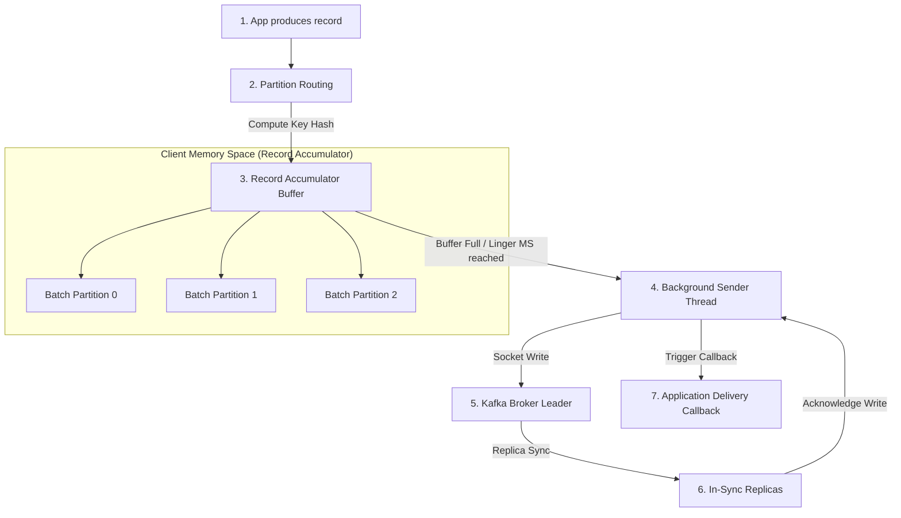

1.  **Partitioning**: The library evaluates the record key. If a key exists, the client hashes it (e.g., MurmurHash2) and modulo-divides it by the partition count to locate the target partition. If no key is set, the client uses a round-robin or sticky partitioner algorithm.
2.  **Memory Buffering**: The record is placed inside the **Record Accumulator**'s partition memory queue.
3.  **Sender Dispatch**: Once a batch reaches `batch.size` (e.g., 64KB) or the `linger.ms` timer expires (e.g., 20ms), the background client sender thread retrieves the batch, applies compression (Snappy/Gzip/Zstd), and performs a non-blocking TCP socket write to the broker host.
4.  **Ack Pipeline**: The producer waits for broker response. With `acks=all`, the partition leader will not send a success token until all In-Sync Replicas (ISR) have appended the write to their local logs.

## 4.3 Storage Write Flow
The Consumer Storage Writer handles persistence:

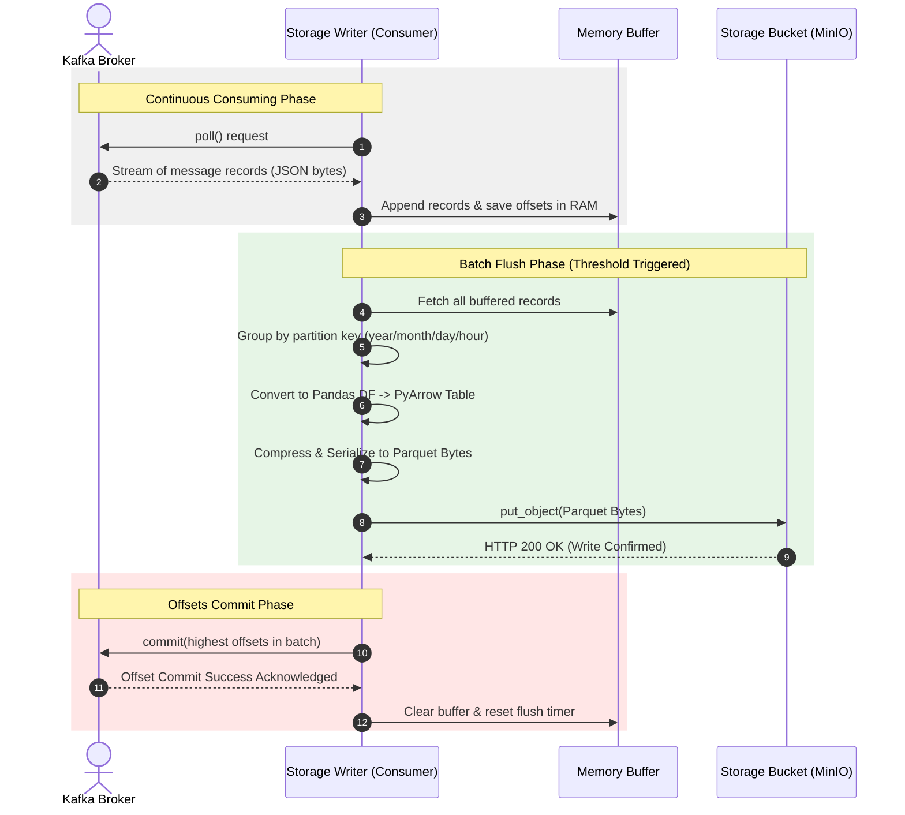

Let's dissect steps 5–10:
-   **Buffering**: The consumer loop polls Kafka, parses the JSON string, and appends the dictionary along with its metadata (Topic, Partition, Offset) to a local list.
-   **Partition Parsing**: When flushes trigger, the records are sorted into buckets based on their log creation times.
-   **Format Conversion**: For each bucket, the list of records is parsed by Pandas. Pandas constructs a schema-typed structure, which PyArrow serializes into a Snappy-compressed binary Parquet byte stream.
-   **Storage Upload**: The S3 Client writes the byte stream. This operation is synchronous.
-   **Commit Handshake**: Once the upload finishes, the consumer calls `commit()` with the highest offsets from the written batch. The broker updates its system offset topics (`__consumer_offsets`).

---

# SECTION 5 — CORE CONCEPTS

To build and operate ingestion systems, we must master the primary terminologies and architectural tradeoffs:

### Data Ingestion vs. Integration
-   **Data Ingestion** focuses strictly on the efficient, reliable transport of raw data from sources into a landing zone. Minimal transformations (e.g., format parsing, envelope metadata additions) are applied to maximize speed and minimize CPU consumption.
-   **Data Integration** (or Transformation) occurs downstream (e.g., using Spark, dbt). It merges disparate data sources, resolves schemas, runs business logic, and outputs curated datasets.

### Event Streaming vs. Message Queuing
-   **Traditional Message Queues** (ActiveMQ, RabbitMQ) delete messages once a consumer acknowledges them. This prevents re-reading data and limits scaling options for multiple target systems.
-   **Event Streams** (Kafka) are structured as append-only logs. Messages are persistent and read-only. Multiple consumers can read the same stream independently at different offsets, and events can be replayed repeatedly.

### Durability vs. Latency Tradeoff
Ingestion architectures present a slider between write speed and data safety:
-   **High Durability (`acks=all`)**: Ensures no data loss by waiting for full replication, but increases network round-trip latency on writes.
-   **High Performance / Low Latency (`acks=1` or `acks=0`)**: The producer writes to the broker leader memory and returns immediately. If the leader broker node crashes before flushing to disk or replicating, data is lost.

### Backpressure
Backpressure is an architectural feedback mechanism that prevents a system from being overwhelmed by incoming data. If the storage layer experiences slow disk writes, the Storage Writer consumer slows down its execution rate. Because the consumer pulls data, it simply increases the interval between its `poll()` calls. This transmits backpressure naturally up to Kafka. Kafka holds the backlog on disk, insulating both the consumer and the source database from crashing.

```mermaid
graph TD
    subgraph Push_System["Push System (No Backpressure - Overwhelming)"]
        P_Src[Producer Application] -->|Push high volume| C_Dest[Downstream Target]
        C_Dest -->|Out of memory/Disk I/O saturated| Crash[Crash / Outage]
    end
    
    subgraph Pull_System["Pull System (Controlled Backpressure)"]
        K_Broker[Kafka Log Storage]
        C_Writer[Consumer Storage Writer]
        S3_Lake[(MinIO / S3 Storage)]
        
        K_Broker -->|Buffer spikes| K_Broker
        C_Writer -->|1. poll at current processing limit| K_Broker
        S3_Lake -->|2. Slower writing| C_Writer
        C_Writer -.->|3. Delays next poll request| K_Broker
    end
    style Crash fill:#ff9999,stroke:#333
```

---

# SECTION 6 — PRODUCTION ENGINEERING

Operating an ingestion pipeline at scale (handling terabytes of logs daily) requires specific optimization strategies:

## 6.1 Horizontal Scaling and Partition Strategy
A Kafka topic scales by adding partitions. To scale consumption, we add consumer instances to the consumer group.
-   **One Partition per Consumer**: Within a consumer group, a single partition can only be assigned to a single consumer instance. If you have 3 partitions, you can scale to at most 3 concurrent consumers. Adding a 4th consumer will result in that instance remaining idle.
-   **Partition Calculation Formula**:
    $$\text{Partitions} = \max\left( \frac{\text{Target Egress Throughput}}{\text{Single Consumer Throughput}}, \frac{\text{Target Ingress Throughput}}{\text{Single Producer Throughput}} \right)$$
    In production, always over-provision partitions (e.g., 30 partitions) to accommodate future consumer scaling.

## 6.2 High Availability & Durability Configurations
To guarantee zero data loss, use the following client/broker parameters:
-   `enable.idempotence=true`: Prevents duplicate messages caused by transient network retries.
-   `acks=all`: Broker guarantees the log is synced to all active replicas before returning success.
-   `min.insync.replicas=2` (with replication factor of 3): Requires at least 2 brokers to acknowledge a write. If 2 brokers crash, the topic becomes read-only, preventing write loss.

## 6.3 Storage Optimization & Partition Pruning
Downstream query engines (Trino, Hive, Spark) read data lake partitions dynamically. 
-   **Partition Key Format**: Format paths as Hive-compatible structures: `s3://clickstream-lake/year=YYYY/month=MM/day=DD/hour=HH/`.
-   **File Size Sizing**: Target a parquet file size of **128MB to 512MB**. Files under 10MB cause metadata thrashing. Adjust the consumer's `buffer.size.records` and `buffer.timeout.seconds` parameters to balance landing latency against target file size.

## 6.4 Pipeline Observability
We monitor the health of our ingestion pipeline using three primary pillars:

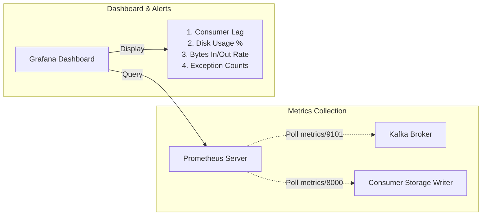

1.  **Consumer Lag**: The difference between the highest offset in the partition broker log and the current offset processed by the consumer group. If lag increases continuously, the consumer is under-provisioned and needs scaling.
2.  **Broker Disk Capacity**: A full disk triggers broker write locks. Monitor `UnderReplicatedPartitions` and `OfflinePartitionsCount`.
3.  **Active Connections & Error Rates**: Track TCP connections, request latency, and client retry counts to detect network degradation.

---

# SECTION 7 — HANDS-ON LAB

## 7.1 Objective
Build, deploy, run, and validate a complete End-to-End Data Ingestion Pipeline. 
We will launch Kafka (KRaft mode) and MinIO in Docker containers. Then, we will configure a Python Producer to write clickstream data, run a Storage Writer consumer to buffer and write Parquet objects to MinIO, and execute validation scripts to verify data integrity.

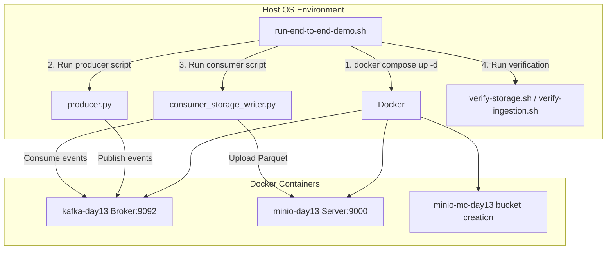

## 7.2 Prerequisites
Ensure your local host machine has:
-   **Docker** and **Docker Compose** installed.
-   **Python 3.8+** installed along with `pip` package manager.
-   **Bash** shell environment.

## 7.3 Step-by-Step Implementation

### Step 1: Deploy Infrastructure via Docker Compose
Navigate to the module directory and deploy the stack:

```bash
# Move to the day-13 module directory
cd Day-13-End-to-End-Ingestion

# Start containers in detached mode
docker compose -f docker/docker-compose.yml up -d
```

**Expected Console Output:**
```
[+] Running 4/4
 ✔ Network docker_default            Created                                                            0.0s
 ✔ Container kafka-day13             Started                                                            0.5s
 ✔ Container minio-day13             Started                                                            0.5s
 ✔ Container minio-mc-day13          Started                                                            0.9s
```

Verify that the containers are healthy. Wait approximately 10 seconds and check:

```bash
docker ps --filter "name=-day13"
```

**Expected Output:**
```
CONTAINER ID   IMAGE                                     COMMAND                  CREATED          STATUS                    PORTS                                                           NAMES
4d3e2c1b0a9f   confluentinc/cp-kafka:7.4.0               "/etc/confluent/dock…"   12 seconds ago   Up 10 seconds (healthy)   0.0.0.0:9092->9092/tcp, 0.0.0.0:9101->9101/tcp                  kafka-day13
8f7e6d5c4b3a   minio/minio:RELEASE.2023-09-04T19-57-37Z  "/usr/bin/docker-ent…"   12 seconds ago   Up 11 seconds (healthy)   0.0.0.0:9000->9000/tcp, 0.0.0.0:9001->9001/tcp                  minio-day13
```

---

### Step 2: Create target Kafka Topic
Create the `clickstream-events` topic with 3 partitions and a replication factor of 1:

```bash
docker exec kafka-day13 kafka-topics.sh \
    --bootstrap-server localhost:9092 \
    --create \
    --topic clickstream-events \
    --partitions 3 \
    --replication-factor 1 \
    --config min.insync.replicas=1
```

**Expected Output:**
```
Created topic clickstream-events.
```

---

### Step 3: Run Producer application
Generate clickstream events. We will execute the producer client, telling it to publish 2000 events to the topic:

```bash
# Verify Python environment dependencies are installed
pip install -r producer/requirements.txt --quiet

# Execute clickstream event generator
python3 producer/producer.py --topic clickstream-events --count 2000 --delay 0.001
```

**Expected Output:**
```
=== Starting Clickstream Producer ===
[*] Loading config:  configs/producer_config.json
[*] Target Topic:    clickstream-events
[*] Total Events:    2000
[*] Emission Delay:  0.001s
[✓] Queued 100/2000 events to topic: clickstream-events
[✓] Queued 200/2000 events to topic: clickstream-events
...
[✓] Queued 2000/2000 events to topic: clickstream-events
[*] Flushing producer queue (waiting for broker acknowledgements)...
[✓] All messages successfully delivered!

=== Execution Summary ===
[*] Total events queued and sent: 2000
[*] Elapsed time: 2.85 seconds
[*] Throughput:   701.75 events/sec
```

---

### Step 4: Run Storage Writer Consumer
Launch the storage consumer to process the messages in Kafka, write them to MinIO, and commit offsets. We run this script locally:

```bash
python3 storage/consumer_storage_writer.py --topic clickstream-events
```

**Expected Output:**
```
[*] Initializing connection to MinIO/S3 endpoint: http://localhost:9000
[✓] Successfully verified connection to storage bucket: clickstream-lake
[*] Initializing Kafka Consumer group: clickstream-storage-writer-group
[✓] Subscribed to topic: clickstream-events

=== Clickstream Consumer & Storage Writer Running ===
[*] Press Ctrl+C to stop gracefully.
[*] Buffer size limit (1000 >= 1000) reached.
[*] Flushing buffer of 1000 records to storage...
    -> Uploading 334 records to year=2026/month=07/day=04/hour=16/clickstream_1688470_2a3f9d4b.parquet...
    -> Uploading 333 records to year=2026/month=07/day=04/hour=16/clickstream_1688470_8f9c2d1e.parquet...
    -> Uploading 333 records to year=2026/month=07/day=04/hour=16/clickstream_1688470_6b7c8d9e.parquet...
[*] Committing offsets to Kafka: [((topic: clickstream-events, partition: 0), offset: 334), ((topic: clickstream-events, partition: 1), offset: 333), ((topic: clickstream-events, partition: 2), offset: 333)]
[✓] Offsets committed successfully.
[✓] Buffer flush cycle complete.

[*] Buffer size limit (1000 >= 1000) reached.
[*] Flushing buffer of 1000 records to storage...
    ...
[✓] Buffer flush cycle complete.

# Since we generated 2000 events, 2 batches of 1000 records are written immediately.
# Stop the consumer gracefully by pressing Ctrl+C.
# The remaining records (if any) or cleanup processes will trigger on exit.
^C
[-] Shutdown signal (2) received. Initiating graceful shutdown...
[*] Closing Kafka Consumer...
[✓] Shutdown complete.
```

---

### Step 5: Validate Data Ingestion
Run the verification script to inspect our landing files inside the MinIO bucket:

```bash
bash scripts/verify-storage.sh
```

**Expected Output:**
```
=== [Verification: Storage Layer (MinIO)] ===
[*] Connecting to MinIO at http://localhost:9000...
[✓] Found 6 objects in bucket "clickstream-lake":

Partition / Object Key                                                 | Size (Bytes)
-------------------------------------------------------------------------------------
year=2026/month=07/day=04/hour=16/clickstream_1688470_2a3f9d4b.parquet |       14,352
year=2026/month=07/day=04/hour=16/clickstream_1688470_8f9c2d1e.parquet |       14,298
year=2026/month=07/day=04/hour=16/clickstream_1688470_6b7c8d9e.parquet |       14,312
...
-------------------------------------------------------------------------------------
Total Storage Size: 85,920 bytes
```

Now execute the end-to-end data integrity validation script to check row counts and schemas:

```bash
bash scripts/verify-ingestion.sh
```

**Expected Output:**
```
=== [Verification: End-to-End Data Validation] ===
[*] Reading and validating 6 Parquet files from storage...
[✓] Succesfully read 2000 records.
[✓] Schema contains all required fields.

[*] Ingested Parquet Schema:
event_id: string
timestamp_ms: int64
user_id: string
event_type: string
page_url: string
ip_address: string
device: string
user_agent: string

[*] Record breakdown by event_type:
view                412
click               405
purchase            398
add_to_cart         395
remove_from_cart    390

[*] Sample Data Record (First 3 entries):
                               event_id   timestamp_ms      user_id event_type             page_url      ip_address        device
0  4f3e2d1c-b0a9-9f8e-7d6c-5b4a3f2e1d0c  1719878400000  usr-83492       view                /home   74.125.19.147   mobile-ios
1  9f8e7d6c-5b4a-3f2e-1d0c-4f3e2d1c_b0a  1719878400210  usr-19403      click            /products  198.252.206.16  desktop-chr
2  3f2e1d0c-4f3e-2d1c-b0a9-9f8e7d6c_5b4  1719878400450  usr-57291   purchase  /order-confirmation   64.233.160.10   tablet-safar

[✓] End-to-end data integrity validation PASSED.
```

---

### Step 6: Automated Orchestration Script (One-Click Run)
To run the entire workflow (Setup, Run, Validate) with one command, execute our unified test runner script:

```bash
bash scripts/run-end-to-end-demo.sh
```

---

### Step 7: Clean Up Environment
To tear down the containers and release local volume spaces:

```bash
docker compose -f docker/docker-compose.yml down -v
```

**Expected Output:**
```
[✓] Running 4/4
 ⠿ Container minio-mc-day13          Removed                                                            0.1s
 ⠿ Container kafka-day13             Removed                                                            1.2s
 ⠿ Container minio-day13             Removed                                                            0.8s
 ⠿ Network docker_default            Removed                                                            0.1s
 ⠿ Volume docker_minio_data          Removed                                                            0.0s
```

---

# SECTION 8 — BUILD FROM SOURCE

When deploying Kafka client applications into production, compiling packages from source is often required to resolve OS architecture compatibility issues (such as ARM64 M-series chips or corporate Enterprise Linux environments).

## 8.1 Python client Native Library Dependency (`librdkafka`)
The `confluent-kafka` client is not a pure Python library. Instead, it acts as a C-wrapper around **`librdkafka`**—a highly optimized C-library implementing the Apache Kafka wire protocol. 

When you run `pip install confluent-kafka`, pip attempts to download a pre-built binary wheel. If a pre-built wheel is not available for your OS version, pip attempts to compile `librdkafka` from source.

### Compilation Dependencies:
To successfully compile `librdkafka` from source, the host OS requires:
-   **C Compiler**: `gcc` or `clang`
-   **Build Utilities**: `make` or `cmake`
-   **Compression Libraries Headers**: `zlib1g-dev`, `libzstd-dev`, `libssl-dev` (for SASL/SSL support).

### Source Build Sequence:
```bash
# 1. Clone librdkafka source repository
git clone https://github.com/confluentinc/librdkafka.git
cd librdkafka

# 2. Configure build, enabling compression and SSL security flags
./configure --enable-ssl --enable-gssapi --enable-zstd

# 3. Compile the C source files
make -j$(nproc)

# 4. Install native library to standard system paths (/usr/local/lib)
sudo make install
sudo ldconfig
```

### Linking with Python:
Once `librdkafka` is compiled and installed on the host OS, install the python package mapping:
```bash
# Force pip to build confluent-kafka without pre-compiled wheels
pip install --no-binary :all: confluent-kafka
```

---

# SECTION 9 — DOCKER DEPLOYMENT

## 9.1 Anatomy of `docker-compose.yml`
Our Docker setup configures three services to represent a local cluster:

1.  **`kafka`**: Runs cp-kafka 7.4.0. We configure it in **KRaft** mode (using the properties `KAFKA_PROCESS_ROLES` and `KAFKA_CONTROLLER_QUORUM_VOTERS`). This eliminates dependencies on ZooKeeper, aligning with modern Kafka standard deployments.
2.  **`minio`**: Serves S3-compatible endpoints at port 9000. Data is bound to a persistent volume `minio_data`.
3.  **`create-bucket`**: A transient setup utility. It waits for MinIO to pass its health check, configures the MinIO client (`mc`), sets up the `clickstream-lake` bucket, and shuts down immediately with an exit code of `0`.

## 9.2 Health Check Implementations
Health checks prevent services from launching until their dependencies are ready:

-   **Kafka Health Check**: Runs `kafka-topics.sh --list` inside the container. If the broker is not ready to return a list of topics, the container remains in status `starting`, delaying downstream containers.
-   **MinIO Health Check**: Executes `curl -f http://localhost:9000/minio/health/live`. This ensures the REST API is actively listening before the bucket creation command is fired.

---

# SECTION 10 — LOCAL CLUSTER DEPLOYMENT

For testing production scenarios (like partition rebalancing or broker failover), a single broker is insufficient. We run a local multi-node cluster topology.

## 10.1 Multi-Node Compose Architecture
A multi-node compose file deploys 3 Kafka brokers coordinated via KRaft.

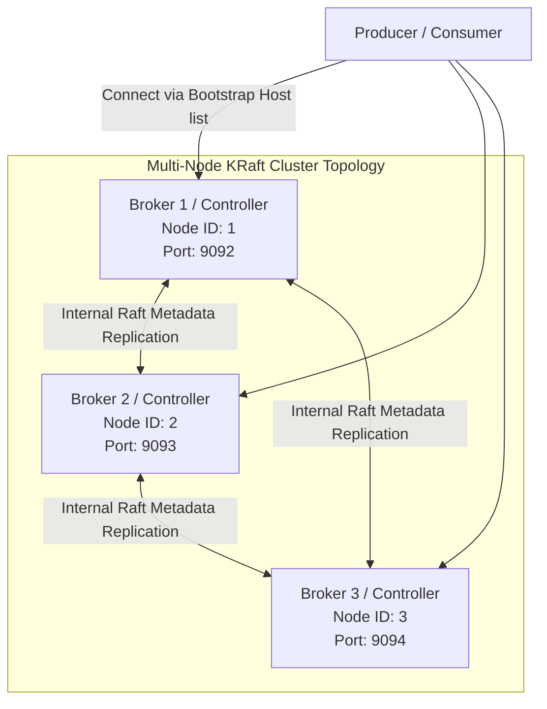

To configure this topology, we assign unique `KAFKA_NODE_ID` values to each broker and list all controller hosts in `KAFKA_CONTROLLER_QUORUM_VOTERS`:

```yaml
# Broker 1
KAFKA_NODE_ID: 1
KAFKA_PROCESS_ROLES: 'broker,controller'
KAFKA_CONTROLLER_QUORUM_VOTERS: '1@kafka1:29093,2@kafka2:29093,3@kafka3:29093'
KAFKA_LISTENERS: 'PLAINTEXT://0.0.0.0:29092,CONTROLLER://0.0.0.0:29093'

# Broker 2
KAFKA_NODE_ID: 2
KAFKA_PROCESS_ROLES: 'broker,controller'
KAFKA_CONTROLLER_QUORUM_VOTERS: '1@kafka1:29093,2@kafka2:29093,3@kafka3:29093'
KAFKA_LISTENERS: 'PLAINTEXT://0.0.0.0:29092,CONTROLLER://0.0.0.0:29093'

# Broker 3
KAFKA_NODE_ID: 3
KAFKA_PROCESS_ROLES: 'broker,controller'
KAFKA_CONTROLLER_QUORUM_VOTERS: '1@kafka1:29093,2@kafka2:29093,3@kafka3:29093'
KAFKA_LISTENERS: 'PLAINTEXT://0.0.0.0:29092,CONTROLLER://0.0.0.0:29093'
```

Under this layout, the brokers run an internal Raft voting cycle. If Broker 1 (the active metadata leader) crashes, Broker 2 and Broker 3 automatically detect the failure, vote, and elect a new controller within milliseconds, maintaining cluster availability with zero service interruption.

---

# SECTION 11 — VALIDATION & AUTOMATION SCRIPTS

The `scripts/` directory contains validation scripts:

1.  **`verify-producer.sh`**:
    -   *Logic*: Performs a dependency sanity check, parses `producer_config.json`, extracts target addresses, and opens a raw socket connection to test connectivity.
2.  **`verify-kafka-topic.sh`**:
    -   *Logic*: Performs `docker exec` calls, running standard Kafka tools (`kafka-topics.sh` and `GetOffsetShell`) to verify that partitions are balanced and that offset segments are accumulating messages.
3.  **`verify-storage.sh`**:
    -   *Logic*: Integrates with the storage layer using `boto3`. Lists files in `clickstream-lake` recursively and outputs a partition table listing file path keys and individual byte sizes.
4.  **`verify-ingestion.sh`**:
    -   *Logic*: Download-and-inspect validation. Pulls target Parquet files into memory, validates schemas using `pyarrow.parquet.ParquetFile`, aggregates row counts, and logs descriptive data samples to verify data integrity.

---

# SECTION 12 — PRODUCTION TROUBLESHOOTING PLAYBOOK

When managing real-time data ingestion pipelines, production failures must be identified and resolved quickly. Use the following playbook for diagnosis and recovery:

| Issue | Symptoms | Root Cause | Resolution |
| :--- | :--- | :--- | :--- |
| **1. Broker Disk Saturated** | Producer throws `TopicAuthorizationException` or writes block; Broker throws logs showing `KafkaStorageException` or disk read-only. | Free disk space on a broker fell below `log.cleaner.backoff.ms` or OS write limits. | 1. Increase disk volume size.<br>2. Alter topic retention settings to force log segments cleanups:<br>`kafka-configs.sh --bootstrap-server localhost:9092 --entity-type topics --entity-name clickstream-events --alter --add-config retention.ms=86400000` (1 day). |
| **2. High Consumer Lag** | Real-time analytics dashboards show delayed charts; `kafka-consumer-groups.sh` output shows `LAG` values growing in the millions. | Processing time of the Storage Writer is higher than incoming producer message velocity (e.g., MinIO write latency increased). | 1. Scale out consumer group instances (up to partition count).<br>2. Increase consumer batch performance by raising `max.poll.records` or adjusting buffer flush settings. |
| **3. Broker Partition Imbalance** | One broker experiences high CPU and network IO while others are idle. | A poorly designed message key (e.g. constant string or null keys) routed all messages to the same partition. | 1. Implement high-cardinality routing keys (e.g. `user_id` instead of a static value).<br>2. Run `kafka-reassign-partitions.sh` to redistribute partition leaders across brokers. |
| **4. Duplicate Events in Storage** | Downstream analytics engines count duplicate rows for the same `event_id` in Parquet outputs. | Network partition caused producer to resend batches due to dropped acknowledgments (At-least-once retry behavior). | 1. Ensure `enable.idempotence=true` is enabled in producer configuration.<br>2. Build deduplication steps in downstream query engines using unique `event_id` deduplication on read. |
| **5. Producer Unable to Publish** | Producer errors show: `Local: Queue full` or `Broker: Not enough in-sync replicas`. | 1. Local sender thread is blocked due to network issues.<br>2. Number of active brokers in ISR is less than `min.insync.replicas`. | 1. Verify broker node statuses by describing topic ISR details.<br>2. Adjust `min.insync.replicas` or fix crashed broker replicas to join ISR. |
| **6. Broker Connection Timed Out** | Clients log `Disconnecting from node due to timeout` or connection handshake failures. | Local IP routing mismatches or incorrect listener configurations (`advertised.listeners` set to internal docker IPs instead of host mapping). | Ensure `advertised.listeners` exposes the external hostname/IP (e.g. `localhost:9092`) to external clients, while preserving internal configurations (e.g. `kafka:29092`) for Docker networks. |

## 12.1 Practical Troubleshooting Commands
When debugging, execute these shell diagnostic commands directly:

### 1. Identify active consumer lag across partitions:
```bash
docker exec -it kafka-day13 kafka-consumer-groups.sh \
    --bootstrap-server localhost:9092 \
    --describe --group clickstream-storage-writer-group
```

### 2. View broker log directory details:
```bash
docker exec -it kafka-day13 kafka-log-dirs.sh \
    --bootstrap-server localhost:9092 \
    --describe --topic-list clickstream-events
```

### 3. Check topic replication status and ISR details:
```bash
docker exec -it kafka-day13 kafka-topics.sh \
    --bootstrap-server localhost:9092 \
    --describe --topic clickstream-events
```

---

# SECTION 13 — REAL-WORLD CASE STUDY: ENTERPRISE RETAIL DATA PLATFORM

## 13.1 Scenario
An international e-commerce giant faces massive traffic spikes during seasonal sales events (e.g., Black Friday). Their legacy systems (which wrote clicks and payment events directly to transactional databases) frequently crashed due to database lock escalation and write starvation.

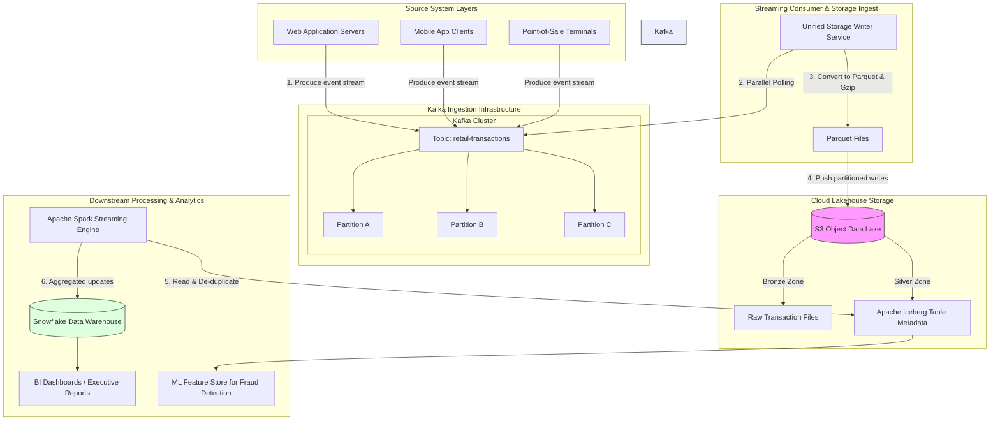

## 13.2 Solution Architecture
To handle this traffic, the platform was redesigned around a decoupled event-driven model:

1.  **Ingestion Buffer**: Kafka brokers receive transaction events from web app servers, mobile clients, and POS terminals. High-throughput topics are provisioned with **64 partitions**, allowing parallel processing.
2.  **Durable Writes**: A fleet of Dockerized Storage Writer instances runs in an auto-scaling cluster (ECS/Kubernetes). These instances pull data in batches, serialize it into Parquet format, and upload it to an S3 Data Lake bucket.
3.  **ACID Lakehouse Integration**: The data is registered as an **Apache Iceberg** table. Apache Iceberg provides ACID transactions on top of object storage. This ensures that downstream query engines (like Spark and Trino) do not read partially written files, preventing dirty reads.
4.  **Deduplication & Enrichment**: Downstream Spark jobs read the Apache Iceberg Bronze layer, perform exactly-once deduplication using transaction IDs, join the records with product metadata, and output refined datasets into Silver/Gold layers for machine learning fraud detection and BI dashboards.

This architecture scales horizontally. During peak sales traffic, the S3 upload latency remains constant, and Kafka absorbs traffic spikes. The consumer instances process the backlog continuously, preventing database write exhaustion.

---

# SECTION 14 — INTERVIEW QUESTIONS

## 14.1 Beginner Level (20 Questions & Answers)

#### Q1: What is data ingestion?
**Answer:** Data Ingestion is the process of collecting, importing, and loading raw data from external sources (databases, APIs, logs, clickstreams) into a centralized storage system (like HDFS or S3 object store) for processing and analysis.

#### Q2: What is the difference between batch and streaming ingestion?
**Answer:** Batch ingestion imports data in large chunks at scheduled intervals (e.g., hourly or daily). Streaming ingestion imports events in real-time as they are created, processing them continuously with minimal latency.

#### Q3: Why is Apache Kafka used as an ingestion layer instead of writing directly to storage?
**Answer:** Kafka acts as a high-performance buffer. It decouples producers from consumers, provides backpressure management, replicates data for durability, and prevents target system overload or data loss during downstream outages.

#### Q4: What is a Kafka Topic?
**Answer:** A Kafka Topic is a logical category or feed name to which messages are published. It is an append-only, log-structured stream of records.

#### Q5: What is a Kafka Partition?
**Answer:** A partition is a physical log file within a topic. Topics are divided into partitions to distribute data across multiple brokers, enabling horizontal scalability and parallel consumption.

#### Q6: Why do we write data to storage in Parquet format instead of CSV or JSON?
**Answer:** Parquet is a columnar storage format. It provides high compression ratios, supports partition pruning, and allows query engines to read only the columns required for a query, drastically reducing network and disk I/O costs.

#### Q7: What is the role of the producer client's "Record Accumulator"?
**Answer:** The Record Accumulator buffers messages in client memory. This allows the client to package records destined for the same partition into batches, improving network efficiency and increasing write throughput.

#### Q8: What does a Kafka consumer offset represent?
**Answer:** An offset is a sequential integer that uniquely identifies each message within a partition. It tracks the consumer's current position in the log, allowing it to resume consumption from the correct record after a restart.

#### Q9: What is Consumer Lag?
**Answer:** Consumer lag is the difference between the highest offset produced to a partition and the current offset processed by the consumer. It indicates how far behind the consumer is relative to the producer.

#### Q10: What is a Consumer Group?
**Answer:** A consumer group is a collection of consumers that cooperate to consume data from one or more topics. Each partition in the topic is assigned to exactly one consumer in the group, enabling parallel processing.

#### Q11: What is Zookeeper's role in traditional Kafka?
**Answer:** Zookeeper manages cluster metadata, coordinates election of partition leaders, tracks broker health, and stores configurations. (Note: Modern Kafka uses KRaft mode, replacing ZooKeeper).

#### Q12: What is KRaft mode?
**Answer:** KRaft (Kafka Raft Metadata Mode) is Kafka's built-in consensus protocol that manages metadata directly inside Kafka brokers, eliminating the need for an external Zookeeper cluster.

#### Q13: What does the "acks=all" configuration mean?
**Answer:** `acks=all` (or `acks=-1`) requires the partition leader broker to wait for acknowledgments from all In-Sync Replicas (ISR) before returning a success token to the producer, guaranteeing zero data loss.

#### Q14: What is MinIO?
**Answer:** MinIO is an open-source, high-performance object storage server compatible with the Amazon S3 cloud storage API. It is commonly used to build local or private cloud data lakes.

#### Q15: What is the "Small Files Problem"?
**Answer:** The Small Files Problem occurs when streaming ingestion writes millions of small files (e.g. less than 1MB) to storage. This exhausts name node memory (in HDFS) and degrades query performance due to excessive metadata overhead.

#### Q16: What is a Poison Pill in message consumption?
**Answer:** A poison pill is a corrupted or malformed message that causes the consumer to throw exceptions repeatedly, halting consumption for the partition.

#### Q17: What is a Dead Letter Queue (DLQ)?
**Answer:** A DLQ is a dedicated Kafka topic where consumers route malformed or corrupted messages (poison pills) that fail parsing, allowing the main pipeline to continue processing.

#### Q18: What is an In-Sync Replica (ISR)?
**Answer:** An ISR is a broker replica that is caught up with the leader broker's log within a configured time window (`replica.lag.time.max.ms`).

#### Q19: What is a message key in Kafka?
**Answer:** A message key is a metadata field associated with a message payload. It is used by the producer client to route the message to a specific partition (guaranteeing ordering for that key).

#### Q20: What is the difference between pull-based and push-based consumption?
**Answer:** Push-based consumers receive messages as fast as the broker pushes them (risking resource exhaustion). Pull-based consumers query the broker for data only when they have capacity to process it, managing backpressure natively.

---

## 14.2 Intermediate Level (20 Questions & Answers)

#### Q21: Explain how client-side partition routing works.
**Answer:** When producing a record, the client library uses a partitioner. If a key is provided, the partitioner hashes it (typically using MurmurHash2) and applies a modulo operation: `Partition = Hash(Key) % Partition Count`. This guarantees that all records with the exact same key always land in the same partition.

#### Q22: What happens when a consumer node inside a consumer group crashes?
**Answer:** When a consumer crashes, it stops sending heartbeats to the broker coordinator. After `session.timeout.ms` expires, the coordinator triggers a **Rebalance**. The partitions assigned to the crashed consumer are reassigned to the remaining active consumers in the group.

#### Q23: Why should we disable auto-commit (`enable.auto.commit=false`) in storage ingestion?
**Answer:** Auto-commit periodically commits offsets asynchronously. If the consumer commits offsets but crashes before successfully writing the buffered records to storage, those records are lost. Disabling auto-commit allows the application to commit offsets manually *only* after writing to storage, ensuring **at-least-once** delivery.

#### Q24: How does a compacted topic work in Kafka?
**Answer:** A compacted topic retains only the latest value for each message key. Kafka's background cleaner thread periodically garbage-collects older segments, keeping only the most recent update. This is useful for storing config states or database snapshots (CDC).

#### Q25: How do `linger.ms` and `batch.size` interact on the Kafka Producer?
**Answer:** `batch.size` sets the maximum byte threshold for a batch. `linger.ms` sets the maximum time a producer will wait to accumulate messages before sending a batch. The producer sends a batch whenever either threshold is met first.

#### Q26: Explain the difference between At-Least-Once, At-Most-Once, and Exactly-Once processing.
**Answer:** 
-   **At-Most-Once**: Messages are committed before processing. If a crash occurs, messages may be lost but are never processed twice.
-   **At-Least-Once**: Messages are committed after processing. If a crash occurs, messages may be processed twice but are never lost.
-   **Exactly-Once**: Data is processed exactly once using transaction protocols, ensuring no duplicates and no loss.

#### Q27: How does Kafka partition replication work under the hood?
**Answer:** The leader broker receives all writes. Follower brokers periodically send fetch requests to the leader to replicate the log segments. The leader tracks which followers are active. If a follower lags behind for too long, it is removed from the In-Sync Replicas (ISR) pool.

#### Q28: How do you handle schemas in a streaming pipeline?
**Answer:** Use Confluent Schema Registry. Producers register schemas (Avro/Protobuf) under a subject. Messages are serialized with a 5-byte header containing the unique Schema ID. Consumers query the Registry to fetch the schema and deserialize the binary payload.

#### Q29: What is the purpose of the `min.insync.replicas` configuration?
**Answer:** `min.insync.replicas` defines the minimum number of replicas that must acknowledge a write when `acks=all` is configured. If the number of active replicas in the ISR falls below this value, the broker rejects write requests, protecting data durability.

#### Q30: What is the difference between internal and external listeners in Kafka Docker configurations?
**Answer:** In Docker, containers communicate on an internal network (e.g. broker container to broker container at `kafka:29092`). External applications running on the host OS connect to the exposed container ports (e.g. `localhost:9092`). Kafka requires configured listener maps to route traffic correctly based on the incoming connection port.

#### Q31: How do you compute optimal partition numbers for a high-volume topic?
**Answer:** Calculate throughput requirements: `Partitions = max(Ingress Throughput / Producer Rate, Egress Throughput / Consumer Rate)`. For example, if ingress is 100MB/s and a single producer handles 10MB/s, you need at least 10 partitions. If consumer egress is 5MB/s, you need 20 partitions.

#### Q32: What is the "Sticky Partitioner" algorithm?
**Answer:** When producing messages without keys, the Sticky Partitioner groups records into a single batch for a partition until the batch is full or `linger.ms` is reached, then switches to another partition. This reduces network roundtrips and improves throughput compared to pure round-robin partitioning.

#### Q33: How does PyArrow partition writing work?
**Answer:** PyArrow's dataset writer writes tables directly into nested directories based on partition columns (e.g. `year`, `month`, `day`). It automatically creates directories and writes records matching the directory's schema to the appropriate path.

#### Q34: What is log compaction retention policy?
**Answer:** It is a broker cleanup configuration (`cleanup.policy=compact`) that ensures Kafka retains at least the last known value for each key within a log partition.

#### Q35: How does the consumer handle a rebalance during processing?
**Answer:** During a rebalance, the consumer coordinator revokes partition assignments. To prevent duplicate writes, the consumer should use a **RebalanceListener** callback to flush its current memory buffer and commit offsets before partitions are reassigned.

#### Q36: What is a segmented commit log in Kafka storage?
**Answer:** A partition log is split into physical files called segments (e.g. 1GB files). The broker writes sequentially to the active segment. Once full, the segment is closed, and a new active segment is created. This allows easy deletion of old data.

#### Q37: How do you handle schema evolution?
**Answer:** Use Schema Registry compatibility modes (Backward, Forward, Full). For example, under **Backward Compatibility**, you can delete fields or add optional fields, ensuring that new consumers can read older messages.

#### Q38: What are the advantages of Snappy compression in Kafka?
**Answer:** Snappy compression provides a good balance between CPU usage and compression ratio. It compresses data quickly with minimal CPU overhead, making it ideal for high-throughput messaging pipelines.

#### Q39: What is the difference between `max.poll.interval.ms` and `session.timeout.ms`?
**Answer:** 
-   `session.timeout.ms`: The time the broker waits for heartbeat signals before assuming the consumer has crashed.
-   `max.poll.interval.ms`: The maximum time allowed between subsequent calls to `poll()`. If processing a batch takes longer than this limit, the consumer leaves the group, triggering a rebalance.

#### Q40: What are the risks of using `retries=0` in a producer configuration?
**Answer:** If network hiccups occur, the producer will not retry sending the message, resulting in data loss. In production, always set `retries` to a high value (or use default `2147483647`) and enable idempotence to guarantee durability.

---

## 14.3 Advanced Level (20 Questions & Answers)

#### Q41: Explain how Kafka achieves sub-millisecond write performance despite persisting all messages to disk.
**Answer:** Kafka achieves high write performance using three primary techniques:
1.  **Sequential I/O**: Kafka appends writes to the end of log files. Sequential disk writes are significantly faster than random writes, matching the throughput of sequential network writes.
2.  **Page Cache Centric Design**: Kafka writes data directly to the OS Page Cache in RAM. The OS flushes this cache to disk in the background, minimizing disk write latency.
3.  **Zero-Copy Transfer (sendfile)**: When consuming, Kafka bypasses the JVM user space. The broker uses the kernel `sendfile` API to transfer bytes directly from the page cache to the network socket, avoiding memory copying overhead.

#### Q42: Describe the transaction protocol in Kafka that supports Exactly-Once Semantics (EOS).
**Answer:** Kafka's EOS uses a **Transactional Coordinator** and a transaction log (`__transaction_state`). 
1.  The producer registers its `transactional.id` with the coordinator to get a unique epoch number.
2.  When producing, the producer writes messages as "uncommitted" records.
3.  When committing, the producer sends a commit request to the coordinator. The coordinator writes a commit marker to the transaction log, then writes commit markers to the target partition logs.
4.  Consumers configured with `isolation.level=read_committed` skip messages without a corresponding commit marker.

#### Q43: How does the consumer coordinator detect Zombie Consumers?
**Answer:** A zombie consumer is an instance that is active but has been excluded from the consumer group (e.g., due to a long GC pause). Kafka uses **Epoch Numbers** (or Group Instance IDs) to handle this. When a rebalance occurs, the coordinator increments the group epoch. If a zombie consumer tries to commit offsets with an outdated epoch, the broker rejects the request with a `CommitFailedException`.

#### Q44: How would you configure a pipeline to ingest 1,000,000 events/sec while maintaining partition ordering?
**Answer:** 
-   **Broker Setup**: Provision at least 30 partitions for the topic.
-   **Producer Configuration**: Set `acks=all`, `enable.idempotence=true`, `linger.ms=50`, and `batch.size=131072` (128KB) to maximize batching.
-   **Partitioner**: Route events using high-cardinality partition keys (like `user_id`).
-   **Compression**: Use `compression.type=zstd` to reduce network payload sizes.
-   **Consumer Group**: Deploy 30 consumer instances (one per partition) running in a distributed container cluster.

#### Q45: What is the "Split-Brain" problem in KRaft metadata clusters, and how is it prevented?
**Answer:** The split-brain problem occurs when a network partition divides a cluster, and both halves elect a leader broker, leading to conflicting writes. KRaft prevents this using a Raft consensus protocol. A controller leader can only be elected if it receives votes from a strict majority of quorum controllers: `Majority = floor(N/2) + 1`. This ensures that only one partition can form a majority and elect a leader.

#### Q46: Explain the difference between `commitSync()` and `commitAsync()` on Kafka consumers, including how they handle retries.
**Answer:** 
-   `commitSync()` blocks execution until the broker acknowledges the offset commit. It automatically retries on transient errors, but increases processing latency.
-   `commitAsync()` sends the commit request and continues processing. It is non-blocking and does not retry to prevent out-of-order commits (e.g., retrying an older offset write after a newer one has succeeded).

#### Q47: How does Apache Iceberg prevent data corruption from concurrent writers in an object storage data lake?
**Answer:** Apache Iceberg uses **Optimistic Concurrency Control (OCC)**. Iceberg manages state using metadata files instead of directory structures. When a transaction commits, the writer creates a new metadata snapshot pointing to the updated files. It then attempts to update the current pointer file atomically. If another writer committed a change in the meantime, the current writer fails the commit, reads the new state, and retries.

#### Q48: How would you design a deduplication pipeline for S3 writes that handles late-arriving events?
**Answer:** 
-   **Ingestion**: The consumer writes raw events to partitioned paths based on receipt time.
-   **Deduplication**: Run a downstream Spark Streaming or structured job using **Watermarking** and stateful processing.
-   ```python
    df.withWatermark("event_time", "2 hours") \
      .dropDuplicates(["event_id", "event_time"])
    ```
    This window tracks unique event IDs within a 2-hour buffer, dropping duplicates while purging old state.

#### Q49: What is the significance of the Magic Byte in the Confluent Avro Wire Format?
**Answer:** The first byte of the serialized payload is set to `0x00`. This magic byte signals to confluent deserializers that the payload is serialized using the Confluent Schema Registry format. If missing, the consumer throws a serialization exception, preventing interpretation of raw bytes as Avro payloads.

#### Q50: How does tiered storage in Apache Kafka benefit ingestion pipelines?
**Answer:** Tiered Storage separates **Compute** from **Storage** in Kafka. Kafka brokers retain the active log segment on local SSDs for low-latency reads. Once segments are closed, Kafka uploads them to cost-effective object storage (S3/GCS) in the background. This allows organizations to retain historical streams in Kafka without scaling expensive local disk arrays.

#### Q51: How do you configure SSL/TLS client authentication for Kafka clients?
**Answer:** Configure the client properties:
```ini
security.protocol=SSL
ssl.truststore.location=/var/private/ssl/kafka.client.truststore.jks
ssl.truststore.password=truststore_secret
ssl.keystore.location=/var/private/ssl/kafka.client.keystore.jks
ssl.keystore.password=keystore_secret
ssl.key.password=key_secret
```
This forces mutual authentication (mTLS) between the client socket and the broker.

#### Q52: What is the cause of `CommitFailedException` and how do you resolve it?
**Answer:** `CommitFailedException` occurs when a consumer takes longer than `max.poll.interval.ms` to process a batch of messages. The coordinator assumes the consumer has hung, removes it from the group, and reassigns its partitions. When the consumer tries to commit its offsets, the broker rejects the request. 
-   *Resolution*: Decrease `max.poll.records`, optimize consumer processing speed, or increase `max.poll.interval.ms`.

#### Q53: Explain the role of the Coordinator Node in Kafka.
**Answer:** One of the Kafka brokers acts as the Group Coordinator for a consumer group. Consumers send join-group requests to this coordinator. The coordinator manages consumer membership, coordinates partition rebalances, and stores group offset commits.

#### Q54: What happens if a consumer partition assignment rebalances while the Storage Writer has messages in its buffer?
**Answer:** If a rebalance occurs, the revoked partitions are assigned to other consumers. If the storage writer continues writing its buffer, it will write duplicate files to storage. To prevent this, the consumer must implement a **ConsumerRebalanceListener** to flush its buffer and commit offsets during a rebalance *before* partition ownership changes.

#### Q55: How does the JVM Garbage Collector affect Kafka brokers and ingestion latency?
**Answer:** Long GC pauses (stop-the-world pauses) block broker execution. If a leader broker experiences a pause longer than `zookeeper.connection.timeout.ms` (or KRaft heartbeat limit), it is declared offline, triggering partition leadership re-election. To minimize this, configure Kafka JVMs with garbage collectors optimized for low latency (e.g., G1GC or ZGC) and allocate appropriate heap sizes (typically 4GB to 8GB, keeping system page cache free).

#### Q56: How do you design a system to replay events from 30 days ago to reconstruct a data warehouse state?
**Answer:** 
1.  Configure the Kafka topic with a retention policy of at least 30 days (`retention.ms=2592000000`).
2.  Deploy a new consumer group.
3.  Reset the offsets for the consumer group to the target timestamp:
    ```bash
    kafka-consumer-groups.sh --bootstrap-server localhost:9092 --group analytics-replay --reset-offsets --to-datetime 2026-06-04T00:00:00.000 --execute --topic clickstream-events
    ```
4.  Launch the consumer group to process the replayed events.

#### Q57: Why is it bad practice to run Kafka brokers with `auto.create.topics.enable=true` in production?
**Answer:** If enabled, any client typo in a topic name (e.g. `clikstream-events`) will automatically create a new topic with default partition configurations (typically 1 partition, 1 replica). This bypasses governance rules, limits throughput, and degrades partition balance.

#### Q58: How does Kafka log cleaner handle tombstone messages in compacted topics?
**Answer:** A tombstone is a message with a key and a null value. It signals that the key should be deleted. The log cleaner retains the tombstone message across compaction cycles for a configured duration (`delete.retention.ms`) to allow offline consumers to read the deletion event before purging it from the disk.

#### Q59: Explain the impact of the `max.in.flight.requests.per.connection` configuration.
**Answer:** This setting defines the maximum number of unacknowledged socket requests the producer client can send to a broker before blocking. 
-   If set greater than 1 without idempotence, retries can cause messages to be written out of order if the first request fails but the second succeeds. 
-   Setting it to 1 preserves order but limits producer throughput. With `enable.idempotence=true`, you can set this up to 5 while maintaining strict ordering guarantees.

#### Q60: How does `min.insync.replicas` affect broker availability?
**Answer:** If `min.insync.replicas=2` on a topic with a replication factor of 3, the topic can tolerate 1 broker failure while remaining writeable. If 2 brokers fail, writes are rejected, but the topic remains readable. Setting this value too high balances durability against write availability.

---

# SECTION 15 — KEY TAKEAWAYS

When designing end-to-end data ingestion pipelines:

1.  **Prefer Batching Over Latency**: Maximize throughput by optimizing `linger.ms` and `batch.size` on the producer, and using micro-batching buffers on the storage consumer to write larger, query-efficient Parquet files.
2.  **Decouple Storage Commits from Offset Commits**: To guarantee At-least-once ingestion safety, only commit offsets to Kafka after the storage upload is confirmed.
3.  **Choose Appropriate Message Keys**: Ensure high-cardinality partition keys to balance traffic across partitions and prevent broker CPU and disk bottlenecks.
4.  **Avoid Auto-Topic Creation**: Manually provision topics with partitions and replication factors optimized for production throughput and high availability.
5.  **Monitor Consumer Lag**: Establish dashboards tracking consumer group lags. Continuous lag growth is the primary indicator that your ingestion pipeline is falling behind.

---

# SECTION 16 — REFERENCES

*   **Apache Kafka Core Protocol**: [Kafka Documentation](https://kafka.apache.org/documentation/)
*   **Confluent Client Architecture**: [Confluent Client Performance Guidelines](https://docs.confluent.io/platform/current/clients/index.html)
*   **Parquet Columnar Format**: [Apache Parquet Specs](https://parquet.apache.org/)
*   **MinIO Object Storage**: [MinIO S3 Server Guide](https://min.io/docs/minio/linux/index.html)
*   **Engineering Blogs**:
    -   *Netflix Tech Blog*: [Evolution of Data Ingestion at Netflix](https://netflixtechblog.com/)
    -   *Uber Engineering*: [Reliable Big Data Ingestion at Scale](https://www.uber.com/en-IN/blog/engineering/)
    -   *LinkedIn Engineering*: [Designing Kafka's Log Pipelines](https://engineering.linkedin.com/)
