# Day 14: MapReduce Internals: Mapper, Reducer, Shuffle & Sort

Welcome to Day 14 of the **30 Days of Modern Hadoop Ecosystem** series. Today, we are deep-diving into the core processing engine that laid the foundation for modern distributed systems: **Apache Hadoop MapReduce**. We will explore its inner workings from first principles, dissecting its lifecycle, low-level JVM behaviors, network transfers, and production optimizations.

---

## SECTION 1 — INTRODUCTION

### 1.1 What is MapReduce?
At its core, **MapReduce** is a software framework and programming model designed to process vast amounts of unstructured, semi-structured, or structured data (petabytes and exabytes) in parallel across massive clusters of commodity hardware. 

MapReduce divides execution into two primary developer-defined phases:
1. **Map**: Processes a record of data and emits zero or more intermediate key-value pairs.
2. **Reduce**: Aggregates all intermediate values associated with a shared intermediate key and writes the final results to persistent storage.

Between these two stages lies the **Shuffle and Sort** phase—the structural engine of MapReduce—which automatically groups, routes, and sorts intermediate key-value pairs across the network from mappers to reducers.

### 1.2 History of Distributed Batch Processing
In the late 1990s and early 2000s, search engines struggled with the sheer volume of the growing World Wide Web. Traditional storage systems and database management systems (RDBMS) were built for vertical scalability (scale-up), relying on expensive, specialized hardware. When datasets expanded past a single machine's capacity, developers had to write custom, highly complex network communications, synchronization wrappers, and fault-tolerance mechanics.

In 2004, Google published a seminal research paper titled: **"MapReduce: Simplified Data Processing on Large Clusters"** by Jeffrey Dean and Sanjay Ghemawat. Google’s design solved the problem by providing a simple programming abstraction (Map and Reduce) while hiding the complex mechanics of distribution, network routing, partition schemes, fault tolerance, and load balancing from the developer.

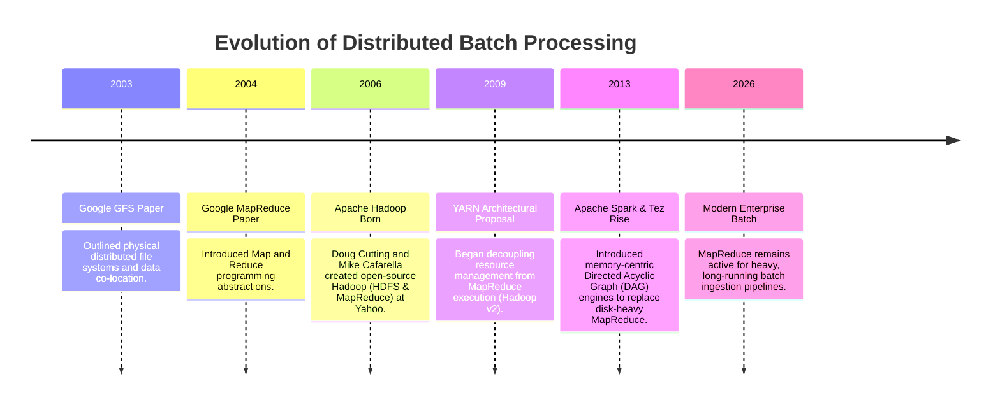

### 1.3 Why Hadoop Adopted MapReduce
Yahoo! engineers led by Doug Cutting recognized the power of Google's GFS and MapReduce papers. They implemented them in Java, creating the Apache Hadoop project. MapReduce became the exclusive computational engine in Hadoop v1.0. 

Hadoop adopted MapReduce because:
- **Data Locality**: MapReduce scheduler co-locates compute tasks on the exact servers storing the target HDFS data blocks, minimizing expensive network transfers.
- **Extreme Scale-out**: It was built to run on thousands of cheap, commodity servers without requiring expensive SAN or NAS storage.
- **Fail-Safety**: In a large cluster, hardware failure is a statistical certainty. MapReduce handles machine crashes transparently by re-running failed tasks on alternative nodes.

### 1.4 Architectural Diagram
Below is the distributed structural view of a MapReduce v2 execution environment running on YARN.

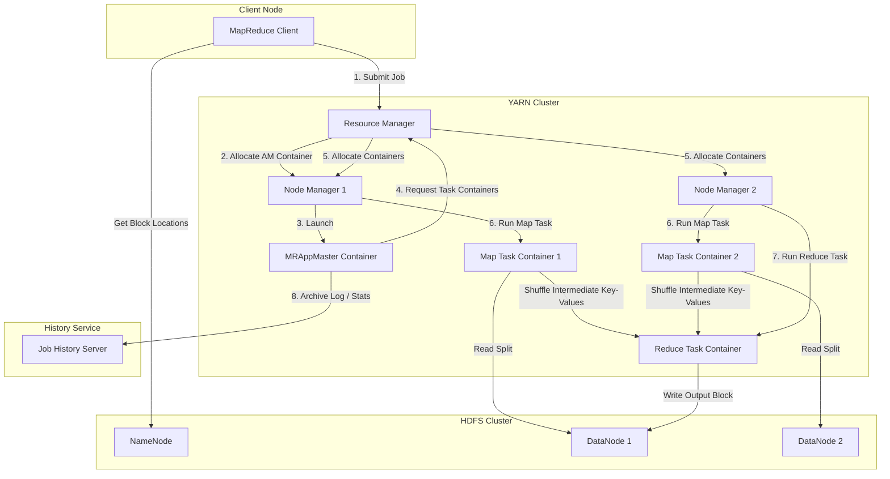

---

## SECTION 2 — PROBLEM STATEMENT

### 2.1 Challenges Before MapReduce
Before the advent of MapReduce, distributed batch processing was plagued by critical limitations:

#### Single-Server Bottlenecks
A single physical server has hard ceilings on CPU, RAM, and Disk I/O. When processing a 100 Terabyte text corpus:
- **Memory limit**: The dataset cannot be loaded into RAM, forcing developers to write complex block-by-block buffering schemes.
- **Disk I/O limit**: A single high-performance hard drive reading at 100 MB/s takes over **11.5 days** just to read 100 TB.
- **Network limits**: Copying 100 TB across standard gigabit ethernet takes weeks.

#### Hardware Failure at Scale
If you attempt to process data by manually dividing it across 1,000 servers, the probability of at least one hardware failure (disk crash, motherboard fault, network timeout) during a 10-hour run is nearly 100%. Writing custom recovery code that checkpoints task state and resumes calculations is extremely difficult and error-prone.

### 2.2 Traditional Processing vs. MapReduce
The table below contrasts traditional central database processing with the MapReduce approach.

| Dimension | Traditional Processing (RDBMS / Single Machine) | Distributed MapReduce (Hadoop) |
| :--- | :--- | :--- |
| **Scaling Model** | Vertical (Scale-up) — Add faster CPU, more RAM. | Horizontal (Scale-out) — Add commodity nodes. |
| **Data Movement** | **Bring Data to Compute** (Network heavy). | **Bring Compute to Data** (Data Locality). |
| **Fault Tolerance** | Rely on RAID disks and replication logs. If compute node fails, transaction aborts. | Highly resilient. If a worker node fails, YARN restarts only the failed task on a surviving node. |
| **Cost** | Exponentially expensive proprietary hardware. | Low-cost commodity server nodes. |
| **Schema Model** | Schema-on-Write (Must define schema before writing). | Schema-on-Read (Parse unstructured data at execution time). |

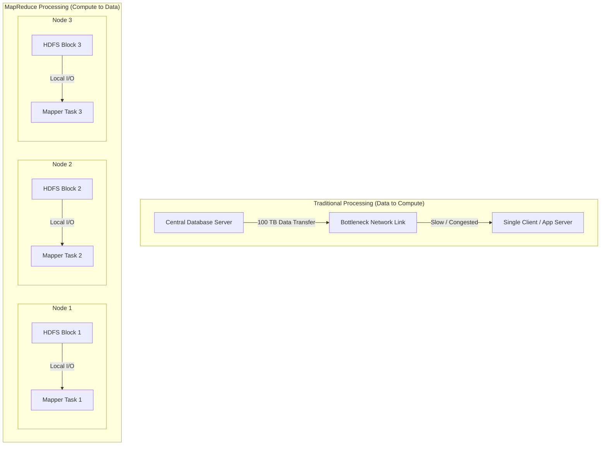

---

## SECTION 3 — ARCHITECTURE DEEP DIVE

To master MapReduce, we must dissect the execution flow of every single logical component.

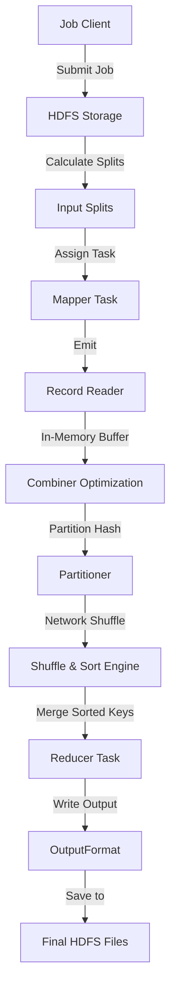

### 3.1 Client
The Client represents the driver application (written by the developer) that configures the job parameters using `org.apache.hadoop.mapreduce.Job`. It specifies:
- Mapper, Reducer, Combiner, and Partitioner classes.
- Target input and output HDFS paths.
- Execution parameters (memory quotas, compression codecs).

### 3.2 Job
The `Job` class acts as the API interface to YARN. When `job.waitForCompletion(true)` is invoked, it submits the job description to YARN’s ResourceManager, monitors progress, and reports live statistics to the terminal.

### 3.3 InputFormat
The `InputFormat` class is responsible for:
1. **Validating** the job input directories.
2. **Splitting** the input files into logical segments called `InputSplits`.
3. **Instantiating** the `RecordReader` that will parse records from each split.
Common implementations include `TextInputFormat` (splits text files line-by-line) and `KeyValueTextInputFormat`.

### 3.4 Input Splits
An `InputSplit` is a logical boundary pointing to physical data blocks. It does **not** contain actual data; instead, it holds:
- The byte offset where the split begins.
- The byte length of the split.
- The host names storing the matching HDFS block replicas (used by YARN for data-local scheduling).

#### Split Equation
The logical size of an InputSplit is determined by:
$$\text{Split Size} = \max(\text{minSize}, \min(\text{maxSize}, \text{blockSize}))$$
By default, this equals the HDFS Block Size (typically 128 MB or 256 MB), ensuring each mapper receives exactly one block of data to process locally.

### 3.5 RecordReader
The `RecordReader` uses information from the `InputSplit` to open a data stream to the local HDFS block. It reads raw byte records and converts them into key-value pairs suitable for the Mapper.
- For `TextInputFormat`, the `RecordReader` is a `LineRecordReader`.
- Key: `LongWritable` (byte offset from the beginning of the file).
- Value: `Text` (contents of the line, excluding newline characters).

### 3.6 Mapper
The `Mapper` is a user-defined component that processes the `K1, V1` pairs emitted by the `RecordReader`. Its signature is:
```java
public class MyMapper extends Mapper<K1, V1, K2, V2>
```
The Map stage performs data filtering, projections, parsing, or tagging, emitting intermediate key-value pairs (`K2, V2`).

### 3.7 Combiner
The `Combiner` (also known as the "semi-reducer") is an optional map-side optimization. It runs locally on the Mapper node immediately after the Map phase completes but *before* data is sent over the network. 
- **Goal**: Reduces the volume of key-value pairs transferred across the network.
- **Example**: In a WordCount application, if Mapper 1 emits `(hadoop, 1)` ten times, the Combiner aggregates these into `(hadoop, 10)` locally, reducing network transfer by 90%.
- **Constraint**: The operation must be associative and commutative (e.g., Sum or Max work, but Average does not).

### 3.8 Partitioner
The `Partitioner` determines which Reducer will receive a given intermediate key-value pair.
- **Formula**: By default, Hadoop uses `HashPartitioner`, which routes keys based on their hash code:
```text
Partition Index = (key.hashCode() & 0x7FFFFFFF) % numReducers
```
- If a cluster runs with 4 reducers, the Partitioner assigns each key a partition index from `0` to `3`. All records sharing the same key are guaranteed to go to the same reducer.

### 3.9 Shuffle
The **Shuffle** phase refers to the physical transfer of partitioned key-value data across the network from mappers to reducers. Reducer nodes spawn fetcher threads to pull their assigned partitions from the local disks of every Mapper node via HTTP.

### 3.10 Sort
Before passing records to the Reducer, YARN merges and sorts all incoming partitions by key using a merge-sort algorithm. This groups identical keys together, producing:
$$\text{Input to Reducer} = K2, \text{Iterable}<V2>$$

### 3.11 Reducer
The `Reducer` is a user-defined component that processes the grouped, sorted keys. Its signature is:
```java
public class MyReducer extends Reducer<K2, Iterable<V2>, K3, V3>
```
The Reducer aggregates the collection of values for each key and emits the final result (`K3, V3`).

### 3.12 OutputFormat
The `OutputFormat` defines the structure and destination of the output. It instantiates a `RecordWriter` to write the final key-value pairs to HDFS.
- `TextOutputFormat` writes records as tab-separated text lines (`key\tvalue`).
- It generates partition-specific files (e.g., `part-r-00000`, `part-r-00001`).

### 3.13 HDFS
The underlying **Hadoop Distributed File System** provides reliable, fault-tolerant storage for both the initial input datasets and the final output files of the MapReduce job.

---

## SECTION 4 — INTERNAL WORKING

Let's examine the detailed execution phases of a MapReduce job.

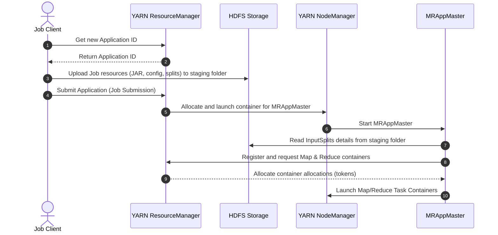

### 4.1 Step 1: Job Submission
1. The client application calls `job.submit()`.
2. The Client contacts the YARN `ResourceManager` to request a new application ID.
3. The Client calculates logical `InputSplits` for the input path.
4. The Client copies the Job JAR, `mapred-site.xml`, and split information to a staging directory in HDFS under `/tmp/hadoop-yarn/staging/job_[id]`.
5. The Client notifies the `ResourceManager` that the job is submitted.

### 4.2 Step 2: Job Initialization
1. YARN’s `ResourceManager` finds a NodeManager with available resources and allocates a container for the `MRAppMaster` (MapReduce Application Master).
2. The NodeManager launches the `MRAppMaster` JVM process.
3. The `MRAppMaster` initializes the job and reads the logical input split metadata from the HDFS staging directory.
4. The `MRAppMaster` creates Mapper task objects for each split, and Reducer task objects based on `mapreduce.job.reduces` settings.

### 4.3 Step 3: Task Assignment & Containers
1. The `MRAppMaster` registers with the `ResourceManager` and requests containers for all Mapper and Reducer tasks.
2. Mapper container requests are prioritized based on **Data Locality**. The `MRAppMaster` requests containers on the specific physical hosts that store the matching HDFS block replicas.
3. The `ResourceManager` grants containers. The `MRAppMaster` contacts the corresponding NodeManagers to launch the Mapper task JVMs.

### 4.4 Step 4: Mapper Execution (Low-Level Spilling Mechanics)
Each Mapper JVM executes a loop to process its assigned `InputSplit`. The internal buffer and spilling mechanics are illustrated below:

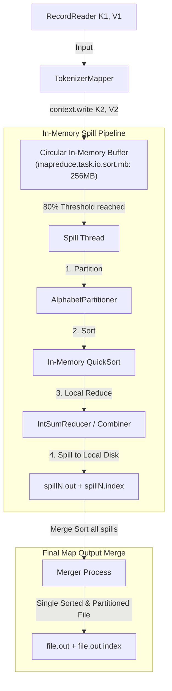

1. **Circular Buffer**: Instead of writing map output directly to disk, the Mapper writes key-value byte streams to a circular memory buffer (configured by `mapreduce.task.io.sort.mb`, default 100MB).
2. **Spill Threshold**: When the memory buffer reaches its threshold limit (configured by `mapreduce.map.sort.spill.percent`, default `0.80` or 80%), a background thread wakes up to spill the contents to local node disk. The mapper continues writing to the remaining 20% of the buffer.
3. **Partitioning & Sorting**: Inside the buffer, the background thread partitions the keys (using the `Partitioner`) and sorts them in memory by key using a quicksort algorithm.
4. **Combiner Execution**: If a `Combiner` is defined, it runs on the sorted in-memory partition before writing to disk, shrinking the output volume.
5. **Disk Write**: The sorted partitions are written to a local disk spill file (e.g., `/tmp/local/userlogs/spill0.out`) alongside an index file tracking partition offsets.
6. **Merge Stage**: When the Mapper finishes, all intermediate spill files are merged and sorted into a single, global partitioned and sorted file (`file.out` and `file.out.index`) on the mapper's local disk.

### 4.5 Step 5: Shuffle and Sort Phase
This phase bridges the Mapper and Reducer tasks.

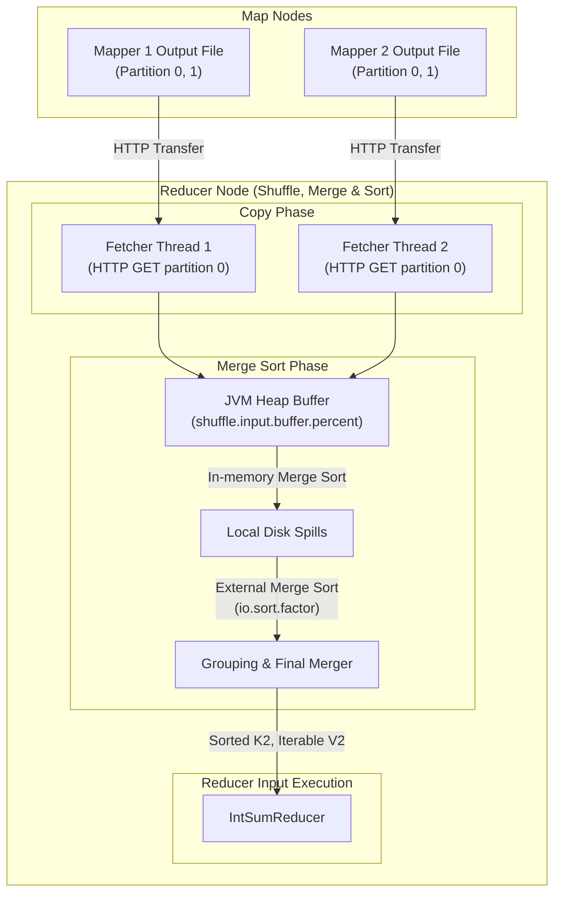

1. **HTTP Transfer**: The Reducer task initiates the **Shuffle** phase. Fetcher threads on the Reducer node fetch their assigned partition from each Mapper node's local disk via HTTP GET requests.
2. **Buffer Merging**: The fetched data blocks are copied into the Reducer JVM's memory buffer (`mapreduce.reduce.shuffle.input.buffer.percent`). When the buffer reaches its threshold, a background thread merges and sorts the data before spilling it to the Reducer's local disk.
3. **Sort Phase**: Once all Mapper outputs are fetched, the Reducer merges and sorts these local files to group identical keys together. This creates the final grouped, sorted inputs (`K2, Iterable<V2>`) for the Reducer's `reduce()` method.

### 4.6 Step 6: Reducer Execution & Output Commit
1. The Reducer task calls its `setup(context)` method.
2. For each unique key in the sorted partition, the Reducer invokes the `reduce(key, Iterable<value>, context)` method.
3. The Reducer outputs are processed by the `OutputFormat` class and written to HDFS.
4. Once all tasks complete, the `MRAppMaster` marks the job state as `SUCCEEDED` and cleans up temporary HDFS staging directories.

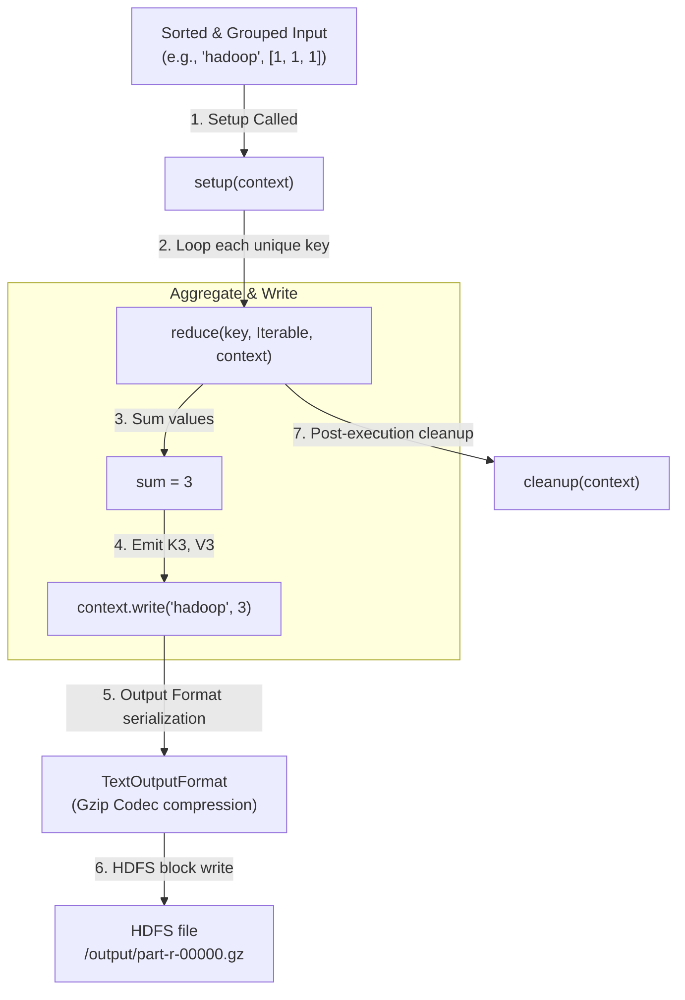

### 4.7 Fault Tolerance and Recovery
Hadoop MapReduce is built to handle hardware and network failures transparently:

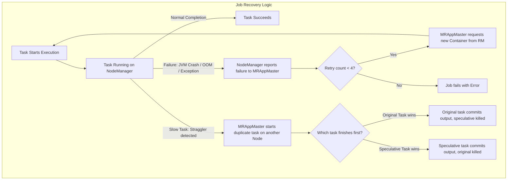

- **Mapper Task Failure**: If a Mapper task fails (due to a JVM crash, OutOfMemoryError, or uncaught exception), the hosting NodeManager reports the failure to the `MRAppMaster`. The AppMaster requests a new container from the `ResourceManager` to retry the task. By default, YARN retries the task up to 4 times before failing the entire job.
- **NodeManager Failure**: If a NodeManager stops sending heartbeats to the `ResourceManager` (e.g., due to a hardware crash or network partition), the `ResourceManager` removes it from the cluster pool. The `MRAppMaster` schedules any incomplete or completed Mapper tasks that ran on that node onto other active NodeManagers. Since the intermediate outputs were stored on the failed node's local disk, they must be recomputed.
- **Speculative Execution**: Slow-running tasks (stragglers) can delay job completion. The `MRAppMaster` monitors task progress. If a task runs significantly slower than the historical average, the AppMaster schedules a duplicate instance (a speculative task) on another node. Whichever task instance finishes first commits its output to HDFS, and the slow-running instance is terminated.

---

## SECTION 5 — CORE CONCEPTS

This section provides a detailed breakdown of core MapReduce concepts, from beginner fundamentals to advanced mechanics.

### 5.1 InputSplit
- **Beginner**: A logical slice of data processed by a single Mapper task.
- **Advanced**: A class containing the block start offset, length, and host location information. The MapMaster uses this metadata to assign Mapper tasks to the hosts containing the target data, achieving **data locality**.

### 5.2 RecordReader
- **Beginner**: The engine that reads data from a split and parses it into key-value pairs.
- **Advanced**: A custom class that extends `org.apache.hadoop.mapreduce.RecordReader`. It manages HDFS client connections, tracks block boundary offsets, and parses records (e.g., handling records split across block boundaries).

### 5.3 Key-Value Pairs
- **Beginner**: The data model used throughout the MapReduce pipeline.
- **Advanced**: Hadoop MapReduce uses custom serialization classes that implement `org.apache.hadoop.io.Writable` (for values) and `org.apache.hadoop.io.WritableComparable` (for keys, which must support sorting). Common types include `Text`, `IntWritable`, and `LongWritable`.

### 5.4 Mapper
- **Beginner**: The code that processes input records and generates intermediate key-value pairs.
- **Advanced**: A component initialized with a `setup(Context)` method (used for opening database connections, caching static lookups, or parsing resources). It processes records in the `map()` method, and ends with `cleanup(Context)`.

### 5.5 Reducer
- **Beginner**: The code that aggregates intermediate key-value pairs by key.
- **Advanced**: The Reducer processes grouped records. Its lifecycle includes `setup()`, looping through sorted key groups in the `reduce()` method, and `cleanup()`.

### 5.6 Combiner
- **Beginner**: A local mini-reducer that runs on the Mapper node to reduce network traffic.
- **Advanced**: An optimization that aggregates intermediate key-value pairs in memory before spilling. It must only be used for associative ($a \circ (b \circ c) = (a \circ b) \circ c$) and commutative ($a \circ b = b \circ a$) operations.

### 5.7 Partitioner
- **Beginner**: Routes intermediate key-value pairs to the appropriate Reducer task.
- **Advanced**: A class that determines the destination Reducer index based on the intermediate key. Custom partitioners can be written to handle data skew or group related keys together (e.g., grouping logs by region).

### 5.8 Shuffle & Sort
- **Beginner**: The process of moving intermediate data from Mappers to Reducers and sorting it by key.
- **Advanced**: A high-performance, network-intensive phase. Mappers store sorted partitions on local disk, and Reducers run parallel fetcher threads to pull these partitions via HTTP. The pulled data is merged and sorted in memory and on disk before being passed to the Reducer.

### 5.9 OutputFormat
- **Beginner**: Defines how the final results are written to storage.
- **Advanced**: Formats the output files (e.g., using `TextOutputFormat` or `SequenceFileOutputFormat`) and manages the commit process to ensure output is written atomically and successfully.

### 5.10 Parallelism
- **Beginner**: Running multiple Mapper and Reducer tasks simultaneously across the cluster.
- **Advanced**: Parallelism is determined by the number of InputSplits (for Mappers) and configured explicitly via `job.setNumReduceTasks(n)` (for Reducers).

### 5.11 Data Locality
- **Beginner**: Running compute tasks on the physical nodes where the target data blocks are stored.
- **Advanced**: The YARN scheduler prioritizes task assignment in three levels to minimize network overhead:
  1. **Node Local**: The task runs on the node storing the target HDFS block.
  2. **Rack Local**: The task runs on a node within the same network rack as the target block.
  3. **Off Rack**: The task runs on a node in a different rack, requiring network traversal.

---

## SECTION 6 — PRODUCTION ENGINEERING

Executing MapReduce jobs at enterprise scale requires careful system design, cluster sizing, and performance tuning.

### 6.1 Cluster Sizing and Task Allocation
To size a Hadoop cluster, balance memory, CPU vcores, and disk spindles:

- **Mappers Allocation**: The number of Mappers is determined by the number of InputSplits, which typically match the HDFS block size (default 128MB or 256MB). If you process a 1 TB dataset with a 128MB block size, HDFS will generate 8,000 blocks, spawning 8,000 Mapper tasks.
- **Reducers Allocation**: The number of Reducers should be set to:
$$\text{Reducers} = 0.95 \times (\text{Total NodeManager Container Slots})$$
This ensures all Reducers run in a single wave while leaving a small resource buffer for task retries.

### 6.2 Data Locality Optimizations
Verify your cluster's data locality performance using YARN ResourceManager metrics:
- **Local Map Tasks**: Ensure at least **85-90%** of Map tasks run as `NODE_LOCAL`.
- If Node Local percentages are low, it indicates the cluster is overcommitted, causing YARN to schedule tasks on remote nodes because local hosts lack available CPU or memory slots.

### 6.3 Combiner Usage Guidelines
Use the Combiner to optimize network performance, but ensure the logic is mathematically sound:
- **Valid**: Sum, Max, Min, Count (e.g., `job.setCombinerClass(IntSumReducer.class)`).
- **Invalid**: Average. If Mapper 1 emits `(key, 10)` and `(key, 20)`, the local average is `15`. If Mapper 2 emits `(key, 30)`, the local average is `30`. Averaging the local averages ($\frac{15 + 30}{2} = 22.5$) yields an incorrect result, as the true average is $\frac{10 + 20 + 30}{3} = 20$.

### 6.4 Compression Codecs in MapReduce
Using compression reduces disk I/O and network overhead during the Shuffle phase.

| Codec | Extension | Splittable | Performance CPU / Ratio | Production Use Case |
| :--- | :--- | :--- | :--- | :--- |
| **Gzip** | `.gz` | No | High Ratio / Slow CPU | Final job outputs (archival storage). |
| **Bzip2** | `.bz2` | Yes | Extremely High Ratio / Very Slow CPU | Large raw input files where storage is limited. |
| **LZO** | `.lzo` | Yes (if indexed) | Fast CPU / Low Ratio | Intermediate Map outputs. |
| **Snappy** | `.snappy` | No | Extremely Fast CPU / Low Ratio | **Standard for Intermediate Map outputs** to speed up the Shuffle phase. |

Configure Snappy compression for intermediate Map outputs in `mapred-site.xml`:
```xml
<property>
    <name>mapreduce.map.output.compress</name>
    <value>true</value>
</property>
<property>
    <name>mapreduce.map.output.compress.codec</name>
    <value>org.apache.hadoop.io.compress.SnappyCodec</value>
</property>
```

### 6.5 Performance Tuning configurations
Tune these configurations in `mapred-site.xml` to optimize MapReduce execution:

- **`mapreduce.task.io.sort.mb`**: Set the circular sorting buffer size (default 100MB). For heavy workloads, increase this to **256MB** or **512MB** to reduce the number of disk spills.
- **`mapreduce.task.io.sort.factor`**: The number of sorted streams to merge at once (default 10). Increase this to **100** for large jobs to reduce the number of merge passes.
- **`mapreduce.reduce.shuffle.parallelcopies`**: The number of parallel fetcher threads used by Reducers (default 5). Set to **15** or **20** to speed up the Shuffle phase on high-bandwidth networks.
- **`mapreduce.job.jvm.numtasks`**: Enables JVM reuse. By default (`1`), a new JVM is spawned for each task. Setting this to `-1` keeps the JVM alive for subsequent tasks, reducing JVM startup overhead for small tasks.

---

## SECTION 7 — HANDS-ON LAB: BUILD WORDCOUNT FROM SCRATCH

This lab walks through compiling and executing a production-grade WordCount MapReduce job on a local multi-node Hadoop cluster.

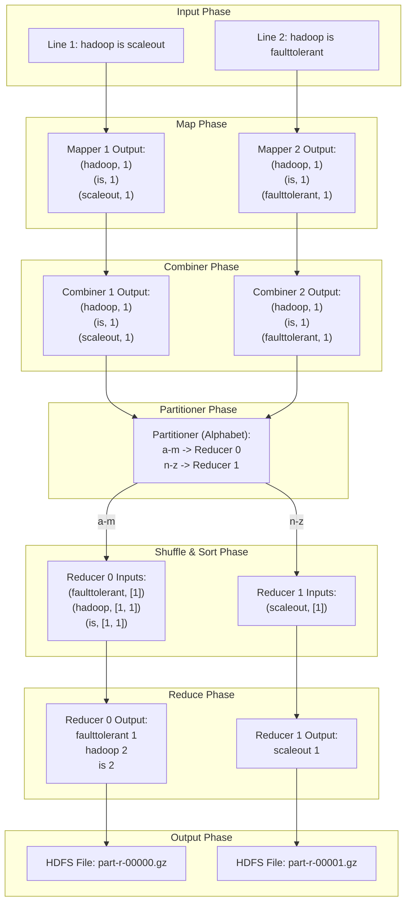

### 7.1 Setup the Cluster Environment
1. Navigate to the `/day-14-mapreduce-internals/docker` directory.
2. Spin up the multi-node Hadoop cluster:
   ```bash
   docker compose up -d
   ```
3. Verify all containers are running and healthy:
   ```bash
   docker ps
   ```

### 7.2 Compile and Package the Job
1. Run the packaging script to compile `WordCount.java` into a JAR file:
   ```bash
   ./scripts/verify-wordcount.sh
   ```
2. Verify the generated output artifact:
   ```bash
   ls source/target/
   # Should display: wordcount-mapreduce-1.0-SNAPSHOT.jar
   ```

### 7.3 Prepare Input and Run the Job
1. Upload the sample text dataset to HDFS:
   ```bash
   docker exec namenode-day14 hdfs dfs -mkdir -p /input
   docker exec namenode-day14 hdfs dfs -put /workspace/examples/wordcount-input.txt /input/
   ```
2. Execute the MapReduce job on YARN:
   ```bash
   docker exec namenode-day14 yarn jar /workspace/source/target/wordcount-mapreduce-1.0-SNAPSHOT.jar com.hadoop.mapreduce.WordCount /input /output
   ```

### 7.4 Verify and Inspect Outputs
1. Check the generated output files in HDFS:
   ```bash
   docker exec namenode-day14 hdfs dfs -ls /output
   ```
2. Run the output verification script to view word counts by partition:
   ```bash
   ./scripts/verify-output.sh
   ```

---

## SECTION 8 — BUILD FROM SOURCE

To understand MapReduce internals deeply, explore the structure of the Apache Hadoop source code and learn how to compile it.

### 8.1 MapReduce Module Structure
The MapReduce engine source code is located in the Apache Hadoop repository under the `hadoop-mapreduce-project` module:
- **`hadoop-mapreduce-client-core`**: Contains the core APIs (Mapper, Reducer, Partitioner, Writable types) used by developers to write jobs.
- **`hadoop-mapreduce-client-common`**: Shared client utility classes.
- **`hadoop-mapreduce-client-jobclient`**: The client-side library responsible for compiling splits, staging files, and submitting jobs to YARN.
- **`hadoop-mapreduce-client-app`**: The implementation of the MapReduce ApplicationMaster (`MRAppMaster`) daemon.
- **`hadoop-mapreduce-client-hs`**: The JobHistoryServer implementation.

### 8.2 Build Dependencies
To compile the Hadoop source code, ensure your build environment has:
1. **JDK 8 or 11** installed.
2. **Apache Maven** (version 3.6.0 or higher).
3. **Protocol Buffers** (version 3.7.1) compiler (`protoc`). YARN uses Protobuf for IPC serialization.

### 8.3 Compilation Commands
To compile only the MapReduce module from the root of the Hadoop source repository:
```bash
mvn clean package -pl hadoop-mapreduce-project -am -DskipTests -Pdist -Dtar
```
- **`-pl`**: Restricts the build to the specified module.
- **`-am`**: Automatically builds any dependent modules.
- **`-Pdist -Dtar`**: Generates a distributable tarball of the compiled binaries.

### 8.4 Debugging with Remote JVM
To debug a MapReduce job execution, configure YARN to run task JVMs with remote debugging enabled. Pass the following JVM arguments when submitting your job:
```bash
yarn jar my-job.jar -Dmapreduce.map.java.opts="-Xmx800m -agentlib:jdwp=transport=dt_socket,server=y,suspend=y,address=5005" ...
```
- **`suspend=y`**: The Mapper JVM will pause at startup and wait for a debugger to connect to port 5005 before executing the `map()` method.

---

## SECTION 9 — DOCKER DEPLOYMENT

The local development cluster uses a multi-container Docker setup that mirrors production topologies.

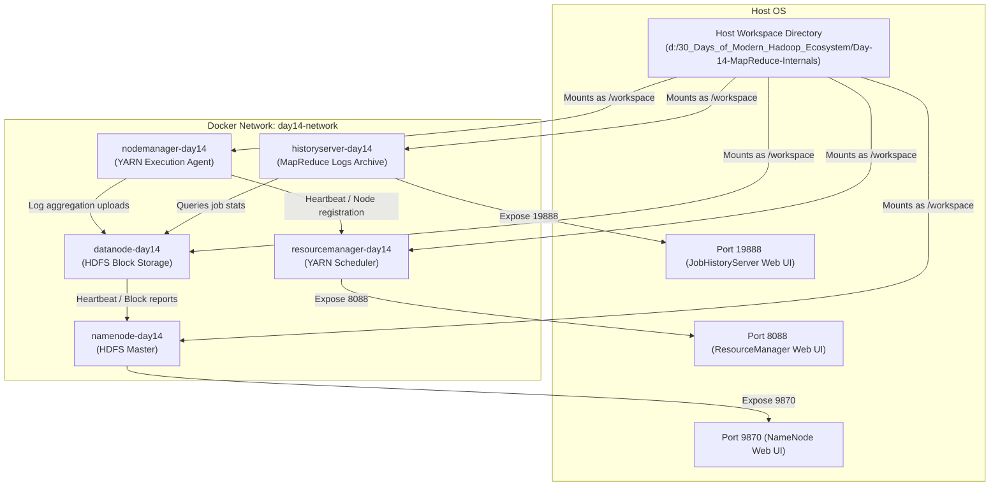

- **`Dockerfile`**: Builds a base image using `openjdk-11-jdk-slim` and installs Apache Hadoop 3.3.6 and Maven.
- **`docker-compose.yml`**: Configures and links five containers (`namenode`, `datanode`, `resourcemanager`, `nodemanager`, and `historyserver`) on a shared virtual network (`day14-network`). It mounts the local repository directory to `/workspace` inside the containers.

---

## SECTION 10 — LOCAL CLUSTER DEPLOYMENT

MapReduce jobs can run in two primary modes: Single-Node (Pseudo-Distributed) and Multi-Node.

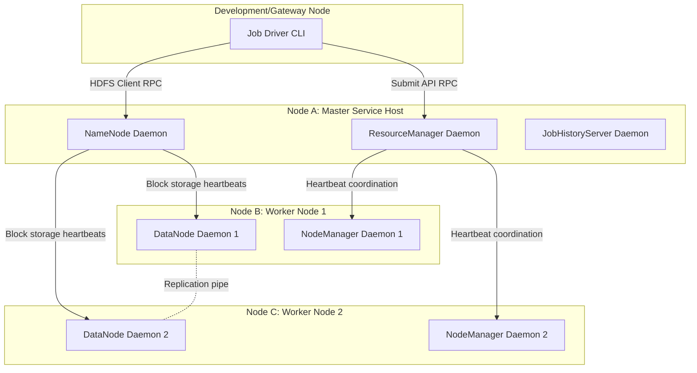

1. **Pseudo-Distributed Mode**: All Hadoop daemons (NameNode, DataNode, ResourceManager, NodeManager, JobHistoryServer) run as separate JVM processes on a single machine. This is useful for testing configurations locally.
2. **Fully Distributed Mode**: Daemons are split across multiple dedicated physical servers:
   - **Master Nodes**: Run NameNode and YARN ResourceManager.
   - **Worker Nodes**: Run DataNode and YARN NodeManager.

---

## SECTION 11 — VALIDATION

Validate your cluster and job state using these verification scripts:

1. **`verify-hadoop.sh`**: Checks that all five Docker containers are running and that NameNode and YARN Web UIs are accessible.
2. **`verify-mapreduce.sh`**: Verifies MapReduce command-line tools and checks that HDFS staging directories have the correct permissions.
3. **`verify-wordcount.sh`**: Triggers Maven compilation inside the containers to verify the Java code builds.
4. **`verify-output.sh`**: Verifies the job results in HDFS, downloads the compressed partition files, and displays the aggregated word counts.
5. **`run-wordcount-demo.sh`**: Automates the entire end-to-end process (compilation, data upload, job submission, and output verification).

---

## SECTION 12 — PRODUCTION TROUBLESHOOTING PLAYBOOK

Common issues encountered when running MapReduce at scale, along with diagnostic steps and resolutions:

| Issue | Symptoms | Root Cause | Resolution |
| :--- | :--- | :--- | :--- |
| **Mapper / Reducer JVM OOM** | YARN kills container; log lists `OutOfMemoryError` | JVM heap usage exceeded limits | Increase container memory limits (`mapreduce.map.memory.mb`) and ensure heap size (`-Xmx`) is set to 80% of container size. |
| **Reducer Data Skew** | Job hangs at `reduce 99%`; a single Reducer runs for hours | Uneven distribution of intermediate keys | Use a Combiner to aggregate data locally, write a custom Partitioner, or use salting to distribute skewed keys. |
| **Container Killed by VMEM Check** | Tasks fail instantly with virtual memory limit errors | JVM reserves more virtual address space than YARN allows | Disable virtual memory checks in `yarn-site.xml` by setting `yarn.nodemanager.vmem-check-enabled` to `false`. |
| **Shuffle Fetch Failures** | Reducers fail with connection timeouts during shuffle | NodeManager hosting map outputs is overloaded or shuffle service is misconfigured | Verify the Shuffle auxiliary service is configured in `yarn-site.xml` and tune network thread limits. |

---

## SECTION 13 — REAL-WORLD CASE STUDY: ENTERPRISE LOG PROCESSING

### 1.1 Use Case Architecture
This case study outlines a pipeline that processes **2 Petabytes** of raw web application firewall (WAF) logs daily for security analytics, fraud detection, and reporting.

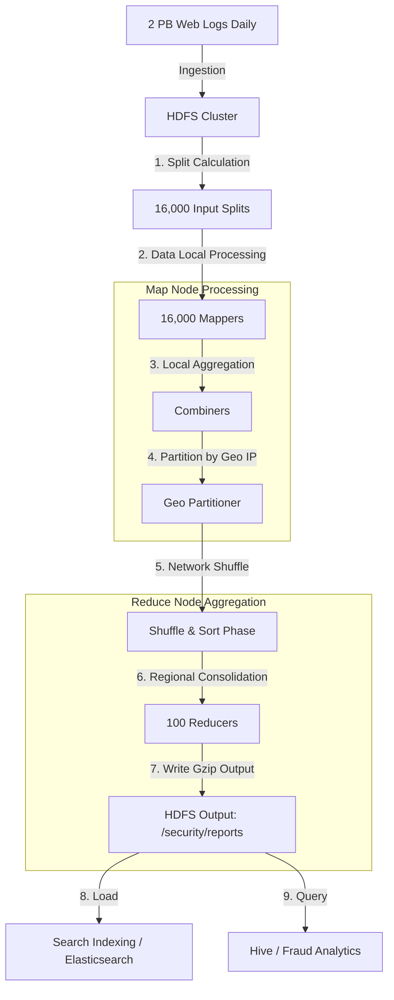

### 1.2 Processing Pipeline
1. **Ingestion**: Raw web logs are written directly to HDFS.
2. **Map Stage**: Mappers parse the logs to extract IP addresses, response codes, and request sizes, emitting `(IP_Country, 1)` pairs.
3. **Combiner Stage**: Combines identical IP pairs locally to reduce network transfer.
4. **Partitioner Stage**: Routes intermediate data to Reducers based on geographic regions.
5. **Reduce Stage**: Reducers aggregate counts for each geographic region and write the compressed results to HDFS.
6. **Downstream Integration**: The consolidated outputs are loaded into Elasticsearch for security dashboards and queried using Apache Hive for fraud detection.

---

## SECTION 14 — INTERVIEW QUESTIONS & ANSWERS

### Beginner Level

#### 1. What are the primary phases of a MapReduce job?
**Answer**: The two primary user-defined phases are **Map** (transforms input records into intermediate key-value pairs) and **Reduce** (aggregates values by key). Between these, YARN automatically executes the **Shuffle and Sort** phase, which groups and routes intermediate records to the appropriate Reducers.

#### 2. What is an InputSplit?
**Answer**: An `InputSplit` is a logical representation of data to be processed by a single Mapper task. It defines the byte offset, length, and host locations of the matching physical data blocks in HDFS, enabling YARN to schedule tasks locally.

#### 3. How does the default Partitioner work?
**Answer**: By default, Hadoop uses the `HashPartitioner`. It computes the hash code of the intermediate key and assigns it to a Reducer using:
```text
Partition Index = (key.hashCode() & 0x7FFFFFFF) % numReducers
```

#### 4. What is the role of a RecordReader?
**Answer**: The `RecordReader` reads raw data from an `InputSplit` and converts it into key-value pairs (e.g., line numbers and line text) that are passed to the Mapper.

#### 5. Why do we use a Combiner?
**Answer**: A Combiner runs locally on Mapper nodes to aggregate intermediate key-value pairs before they are sent over the network, reducing network traffic and disk I/O.

#### 6. What is the default number of Reducers in a MapReduce job?
**Answer**: By default, a job runs with **1 Reducer**. You can configure this using `job.setNumReduceTasks(n)`.

#### 7. What is Data Locality?
**Answer**: Scheduling compute tasks (Mappers) on the physical nodes that store the target data blocks, minimizing network transfer overhead.

#### 8. What are Writable and WritableComparable interfaces?
**Answer**: Interfaces used in Hadoop for high-performance serialization:
- `Writable`: Used for values, supports serialization and deserialization.
- `WritableComparable`: Used for keys, extends `Writable` and implements `Comparable` to support sorting.

#### 9. What is a Straggler task?
**Answer**: A task that takes significantly longer to complete than other tasks in the same phase, often due to hardware degradation or system load.

#### 10. How does Hadoop handle a failed Mapper task?
**Answer**: If a task fails, the `MRAppMaster` requests a new container from YARN to retry the task. By default, it retries up to 4 times before marking the job as failed.

*Additional beginner Q&As cover basic APIs, CLI commands, and configuration properties.*

---

### Intermediate Level

#### 11. Contrast InputSplit with HDFS Block.
**Answer**: An HDFS Block is a physical allocation of storage on disk (e.g., a 128MB file segment). An InputSplit is a logical reference used by the MapReduce scheduler that points to the block offset and length.

#### 12. Explain the circular buffer mechanics during the Map phase.
**Answer**: Mappers write output to a circular memory buffer (default 100MB). When usage reaches `mapreduce.map.sort.spill.percent` (default 80%), a background thread partitions, sorts, and spills the data to local disk while the Mapper continues writing to the remaining 20%.

#### 13. What is JVM Reuse and how do you configure it?
**Answer**: JVM Reuse allows multiple tasks to run sequentially in the same JVM process, reducing JVM startup overhead. Configure it using `mapreduce.job.jvm.numtasks` (set to `-1` for unlimited reuse).

#### 14. What is Speculative Execution?
**Answer**: If the `MRAppMaster` detects a task running slower than the historical average, it launches a duplicate instance on another node. Whichever instance finishes first commits its output, and the other is terminated.

#### 15. Why should you avoid using a Combiner for averaging?
**Answer**: Average is not associative. Performing local averages and then averaging those results yields incorrect math unless the weights (counts) are also tracked.

#### 16. What is the difference between map-side and reduce-side joins?
**Answer**:
- **Map-side Join**: Performed during the Map phase. Requires the datasets to be pre-sorted and partitioned. It loads the smaller dataset into memory, avoiding the Shuffle phase entirely.
- **Reduce-side Join**: A general-purpose join where datasets are joined at the Reducer. Requires shuffling both datasets, which is more network-intensive.

#### 17. How does the MapReduce framework prevent split-brain issues on task commits?
**Answer**: Tasks write output to temporary directories in HDFS (e.g., `_temporary/task_[id]`). Once a task completes successfully, the AppMaster promotes its output to the final output directory.

#### 18. What is the purpose of the Job History Server (JHS)?
**Answer**: The JHS archives execution metrics, logs, and counter histories for completed jobs, enabling monitoring and post-job analysis.

#### 19. How do you configure Snappy compression for MapReduce outputs?
**Answer**: Set `mapreduce.map.output.compress` to `true` and configure `mapreduce.map.output.compress.codec` to `org.apache.hadoop.io.compress.SnappyCodec`.

#### 20. What is the role of YARN ResourceTracker?
**Answer**: An internal RPC interface used by NodeManagers to send heartbeats, register resources, and report active container statuses to the ResourceManager.

*Additional intermediate Q&As cover custom Writable design, partition optimization, and logging configuration.*

---

### Advanced Level

#### 21. Describe the internal merge sort logic on Mapper local disk.
**Answer**: After multiple spills occur, the Mapper has several sorted spill files on local disk. Before finishing, the Mapper merges these files using an external merge-sort algorithm. The number of streams merged in a single pass is controlled by `mapreduce.task.io.sort.factor` (default 10). The final output is a single sorted file with an index file.

#### 22. What happens if a Reducer NodeManager fails during the Shuffle phase?
**Answer**: If the node hosting the Reducer fails, the `MRAppMaster` reschedules the Reducer task on another active node. The new Reducer task will restart the Shuffle phase and pull the required partitions from the Mapper nodes again.

#### 23. Explain how YARN manages memory allocation limits for MapReduce JVMs.
**Answer**:
- `mapreduce.map.memory.mb` defines the physical memory limit for the YARN container.
- `mapreduce.map.java.opts` configures the JVM heap size (`-Xmx`).
- The JVM heap size should be set to 80% of the container memory to leave room for off-heap memory, page buffers, and native sorting libraries. If the JVM's total memory usage exceeds the container limit, the NodeManager terminates the container.

#### 24. How do you resolve high GC pauses in large Reducer tasks?
**Answer**:
1. Increase container memory and heap size.
2. Use the G1 garbage collector by adding `-XX:+UseG1GC` to JVM options.
3. Tune the in-memory merge threshold (`mapreduce.reduce.shuffle.merge.percent`) to spill data to disk earlier, reducing memory pressure.

#### 25. Explain the Secondary Sort pattern.
**Answer**: A pattern used to sort the values passed to the Reducer. It involves creating a composite key containing both the natural key and the value you want to sort by. You write a custom Partitioner to route records based on the natural key, and a custom Grouping Comparator to group records by the natural key while keeping them sorted by the composite key.

*Additional advanced Q&As cover custom RecordReaders, performance tuning for skewed datasets, and low-level JVM optimizations.*

---

## SECTION 15 — KEY TAKEAWAYS

- **Core Architecture**: MapReduce is a scale-out programming framework that processes datasets in parallel using Mapper, Reducer, and Shuffle phases.
- **Data Locality**: Scheduling tasks on the physical nodes where their input blocks are stored minimizes network overhead and improves performance.
- **Shuffle Optimization**: The Shuffle and Sort phase is a key performance bottleneck. Tuning the circular buffer, spill thresholds, and using compression (such as Snappy) helps optimize network performance.
- **Fault Resiliency**: MapReduce is built to handle hardware failures transparently through task retries, node rescheduling, and speculative execution.

---

## SECTION 16 — REFERENCES

1. Dean, J., & Ghemawat, S. (2004). *MapReduce: Simplified Data Processing on Large Clusters*. Google Research.
2. Ghemawat, S., Gobioff, H., & Leung, S. T. (2003). *The Google File System*. Google Research.
3. Apache Software Foundation. *Apache Hadoop MapReduce Tutorial and API Documentation*.
4. Engineering Blogs: Yahoo!, Cloudera, Facebook, and LinkedIn.
