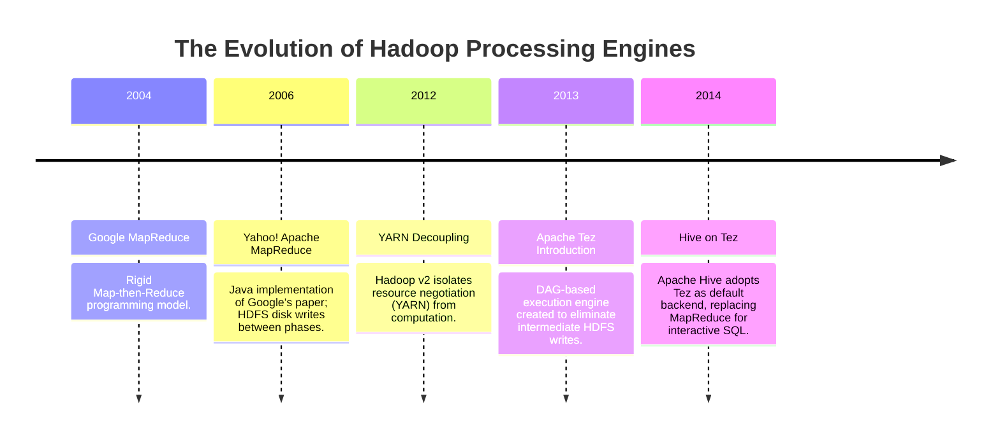
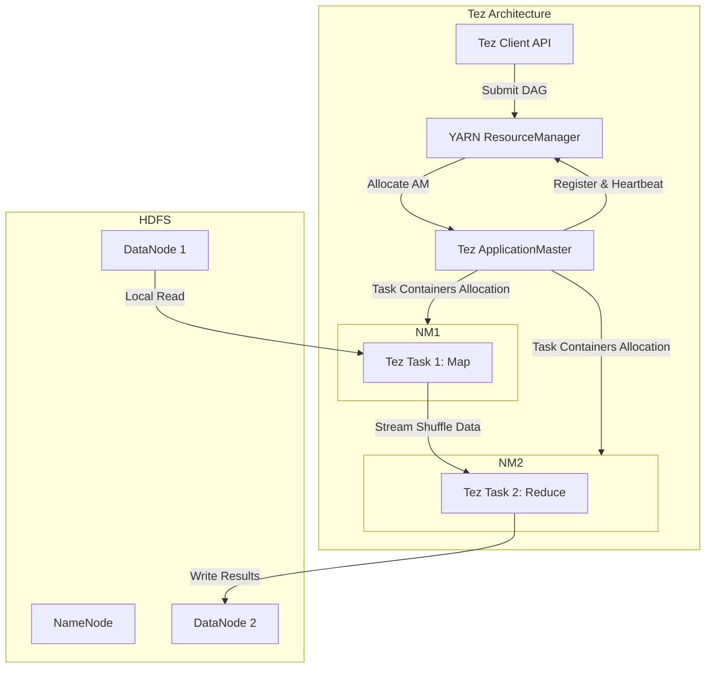
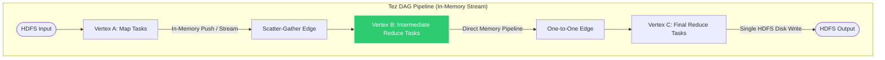
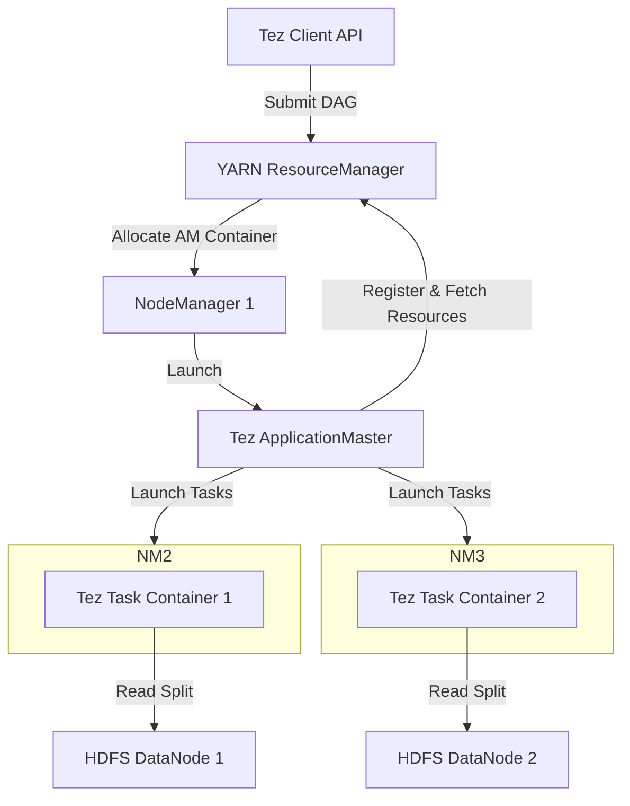
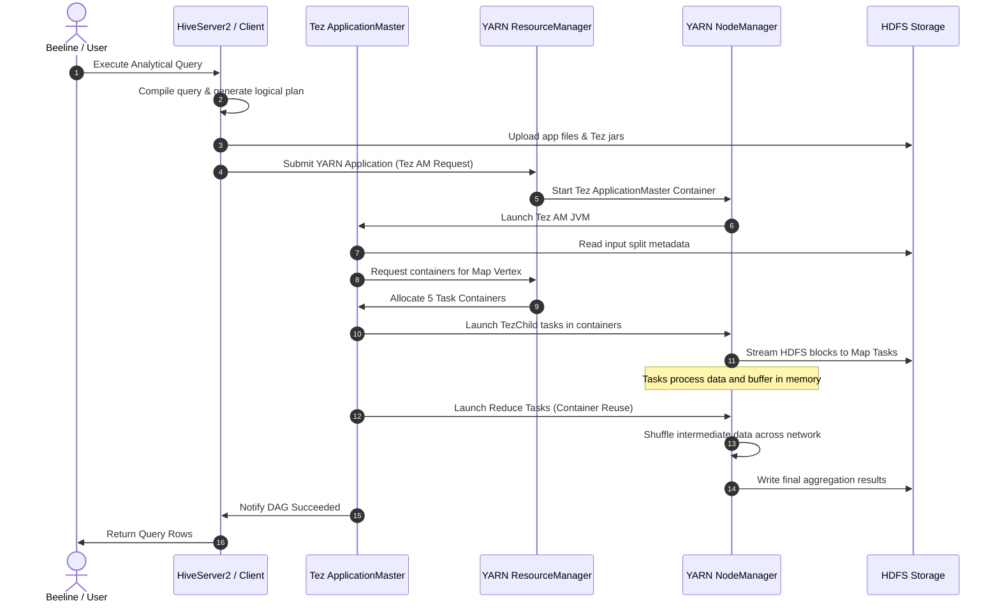
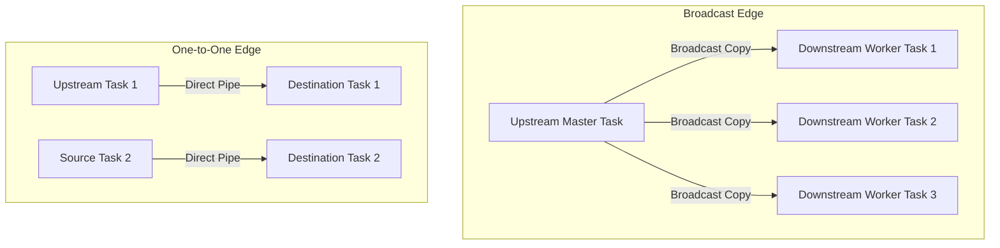
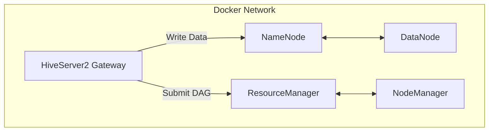
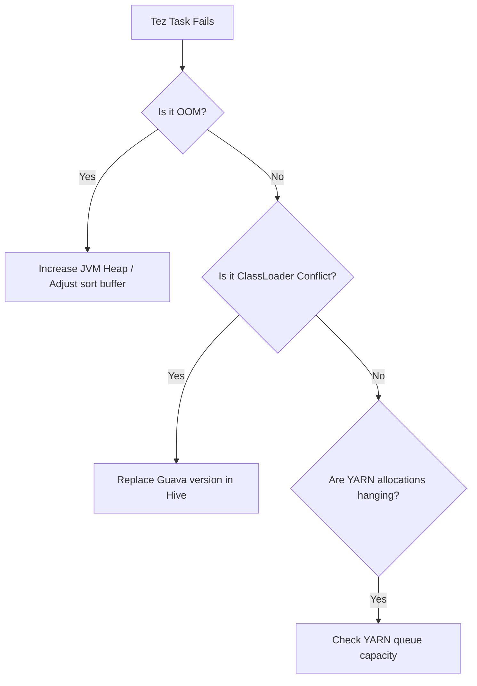
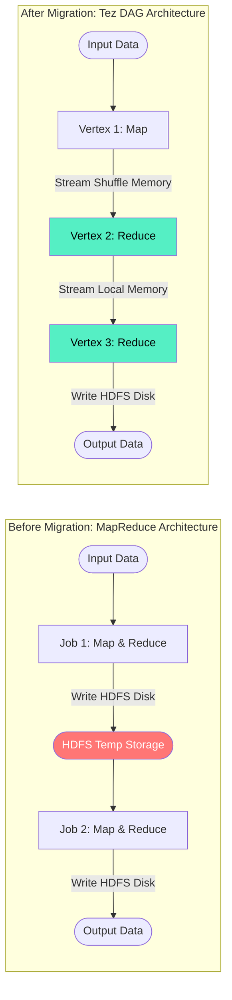

# Day 15: Apache Tez Execution Engine & DAG-based Processing

Welcome to Day 15 of the **30 Days of Modern Hadoop Ecosystem** series. Today, we are deep-diving into **Apache Tez**, a high-performance, DAG-based distributed execution engine designed to replace the classic MapReduce execution model. By decoupling execution logic from the programming model, Apache Tez enables frameworks like Apache Hive and Apache Pig to execute complex query pipelines with minimal disk overhead and ultra-low latency.

---

## SECTION 1 — INTRODUCTION

### 1.1 What is Apache Tez?
**Apache Tez** is a distributed application framework built on top of Apache Hadoop YARN. It is designed to model data processing pipelines as a **Directed Acyclic Graph (DAG)** of tasks. Instead of breaking down a complex multi-stage computational job into multiple distinct MapReduce jobs (which write intermediate data to HDFS at each job boundary), Tez compiles the entire pipeline into a single, unified execution graph. This graph executes vertices (computational stages) and streams intermediate records across edges (data transport channels) in memory, dramatically accelerating batch processing speeds.

Tez is not a programming language or an user-facing query language. Rather, it serves as an **under-the-hood execution engine** used by higher-level querying and scripting engines like Apache Hive, Apache Pig, and Cascading to coordinate distributed tasks on YARN.

### 1.2 Why Apache Tez Was Created
In Hadoop v1, MapReduce was both the processing model and the resource coordinator. Hadoop v2 decoupled these layers, introducing **YARN (Yet Another Resource Negotiator)** as the cluster operating system, while MapReduce became a separate application engine running on top of YARN.

However, MapReduce retained its structural limitations:
- Every data pipeline had to be expressed strictly in terms of a **Map** phase followed by a **Reduce** phase.
- Complex analytical queries (e.g., joins, subqueries, group-bys) required chaining multiple MapReduce jobs.
- The output of every reducer had to be persisted to HDFS before the subsequent Mapper in the next job could read it.

Tez was created by the Apache community to eliminate these restrictions. It allowed the execution model to match the logical execution plan of compilers, generating arbitrary processing graphs that skip HDFS write boundaries.

### 1.3 The Evolution from MapReduce to Tez
The shift from MapReduce to Tez represents a transition from disk-bound, structured processing chains to memory-centric, flexible execution graphs.



### 1.4 Tez's Relationship with Hive, Pig, and YARN
Tez integrates seamlessly with other components of the Hadoop ecosystem:
* **YARN**: Tez is a native YARN application. The Tez ApplicationMaster (AM) requests YARN containers, coordinates scheduling, manages locality, and handles task failures on YARN nodes.
* **Hive**: Hive’s compiler translates SQL queries into a Tez DAG. For instance, a SQL query involving multiple joins is compiled into a multi-stage Tez DAG, executing the joins in parallel pipelines.
* **HDFS**: Tez reads input splits from HDFS files and writes final query output back to HDFS, but uses local disk or direct in-memory transfers for intermediate stages.

### 1.5 DAG-Based Execution Fundamentals
A Directed Acyclic Graph (DAG) is a structural representation where:
- **Vertices (Nodes)** represent data transformations or compute stages (analogous to Mappers or Reducers).
- **Edges (Directed Connections)** represent the flow of data from one vertex to another.
- **Acyclic** means the graph has no loops; data flows in a single direction from sources to sinks.

By using DAGs, Tez can execute physical tasks concurrently, schedule downstream vertices as soon as upstream vertices emit data, and bypass HDFS write bottlenecks.



---

## SECTION 2 — PROBLEM STATEMENT

### 2.1 The Shortcomings of MapReduce
While Hadoop MapReduce was a breakthrough for distributed batch processing, it exhibits severe performance bottlenecks when executing complex workflows.

#### 1. Multiple Job Stages
Because MapReduce is limited to a single Mapper-to-Reducer stage, any SQL query containing multiple grouping operations, subqueries, or joins must be compiled into a chain of separate MapReduce jobs. For example, a query joining three tables requires two distinct MapReduce jobs.

#### 2. Disk I/O Overhead
At the boundary of every MapReduce job, the Reducer writes its output to HDFS. This involves:
- Serializing Java objects to bytes.
- Replicating data blocks across multiple DataNodes (typically 3x replication).
- Writing blocks to local hard drives.
The subsequent MapReduce job must then:
- Read those blocks back from HDFS over the network.
- Deserialize the byte streams back into Java objects.
This constant circular write-and-read behavior introduces massive, unnecessary Disk I/O.

```mermaid
graph TD
    subgraph "MapReduce Pipeline (Disk Heavy)"
        Input1([HDFS Input]) --> Map1[Map Job 1]
        Map1 -->|Local Disk Write| Shuffle1[Shuffle 1]
        Shuffle1 --> Reduce1[Reduce Job 1]
        Reduce1 -->|HDFS Disk Write & Replicate| Inter1([HDFS Temp File])
        
        Inter1 --> Map2[Map Job 2]
        Map2 -->|Local Disk Write| Shuffle2[Shuffle 2]
        Shuffle2 --> Reduce2[Reduce Job 2]
        Reduce2 -->|HDFS Disk Write & Replicate| Output1([HDFS Output])
    end
    
    style Inter1 fill:#e74c3c,stroke:#fff,color:#fff
```



#### 3. High Latency
Every chained MapReduce job requires bootstrapping a new ApplicationMaster (MRAppMaster) JVM, registering it with YARN, requesting containers, and initializing JVMs on worker nodes. This initialization process adds 10 to 30 seconds of scheduling latency per job.

#### 4. Poor Interactive Query Performance
Due to job bootstrap overhead and mandatory HDFS serialization, MapReduce is unusable for interactive query workloads (where analysts expect response times under 10 seconds).

#### 5. Resource Inefficiency
In a MapReduce chain, when Job 1 completes its Map phase, Reducer tasks start. However, the NodeManagers hosting the Mapper containers must release resources back to YARN, only for Job 2 to request them again seconds later. This constant container tear-down and build-up cycle degrades resource utilization efficiency.

### 2.2 MapReduce vs. Tez Execution Model
The following comparison table highlights the architectural differences between the two execution engines:

| Feature | Hadoop MapReduce | Apache Tez |
| :--- | :--- | :--- |
| **Execution Model** | Strict Map-then-Reduce chain | Directed Acyclic Graph (DAG) |
| **Intermediate Storage** | Persistent HDFS (Replicated) | In-Memory streams or Local ephemeral disks |
| **Container Reuse** | No (Tears down JVMs after each task) | Yes (Retains JVMs across tasks in the same session) |
| **Startup Overhead** | High (Bootstrap MRAppMaster for each job) | Low (Single Tez AM manages the entire DAG) |
| **Execution Pipeline** | Downstream jobs block until upstream completes | Pipelined execution (reduces start before maps finish) |
| **Data Locality** | Co-locates compute on HDFS blocks | Dynamically tracks block locations across all vertices |



---

## SECTION 3 — ARCHITECTURE DEEP DIVE

To master Apache Tez, we must examine its internal components and how they interact with Hadoop YARN and HDFS.



### 3.1 Component Breakdown

#### 1. Client
The client leverages the `TezClient` API to construct the programmatic representation of a DAG. The client builds the DAG object, registers required local resources (like jar dependencies and configurations) to HDFS, and submits the job configuration package to the YARN ResourceManager.

#### 2. YARN ResourceManager
The ResourceManager (RM) is the cluster resource authority. Upon receiving a Tez application submission, it selects an available NodeManager to launch the Tez ApplicationMaster container. It also processes resource allocation requests sent by the Tez AM during DAG execution.

#### 3. ApplicationMaster (Tez AM)
The Tez ApplicationMaster is the brain of the execution runtime. Running inside a dedicated container on YARN, it:
- Generates the physical execution plan from the logical DAG submitted by the client.
- Communicates with the YARN RM to request and release task containers.
- Orchestrates task scheduling, tracking data locality, and determining when vertices are ready to launch.
- Handles container reuse pools.
- Monitors task health, managing restarts and retrying failed nodes.

#### 4. DAG (Directed Acyclic Graph)
The DAG is the logical definition of the job. It contains one or more vertices and the edges connecting them.

#### 5. Vertex
A Vertex represents a computational block. It is defined by a `Processor` class (containing the execution logic) and the resource requirements (CPU cores, RAM size) needed to run it. When executed, a vertex is instantiated as multiple parallel physical tasks, with each task processing a distinct subset of the data (e.g., an HDFS split).

#### 6. Edge
An Edge defines the connection and data routing mechanism between an upstream vertex (source) and a downstream vertex (destination). An edge is characterized by:
- **Data Movement Type**: Defines how records are routed (Scatter-Gather, Broadcast, or One-to-One).
- **Data Source Type**: Defines storage persistence (Ephemeral local disk, in-memory buffer, or HDFS).
- **Scheduling Type**: Defines task trigger timing (Concurrent, Sequential, or Pipelined).

#### 7. Task
A Task is the smallest physical unit of execution in Tez. A Vertex with a parallelism factor of 100 runs 100 distinct task instances concurrently. Each task executes within a YARN container.

#### 8. Container
A Container is a slice of resources (CPU, RAM) allocated by YARN on a NodeManager node. In Tez, containers host a JVM running the `TezChild` daemon, which processes tasks allocated by the Tez AM.

#### 9. HDFS & Hive
- **HDFS**: Stores the primary input and output datasets.
- **Hive**: Serves as the query compiler, transforming SQL declarations into the Tez DAG architecture.

---

## SECTION 4 — INTERNAL WORKING

Tez executes queries through a structured, multi-phase lifecycle. Here is the step-by-step physical flow of a Tez execution pipeline.



### 4.1 Step-by-Step Execution Lifecycle

#### 1. Query Submission
The client application (e.g., Beeline connecting to HiveServer2) submits a query. Hive parses, analyzes, and optimizes the SQL text, generating a logical DAG plan.

#### 2. DAG Generation
The logical plan is translated into a physical Tez DAG. The Tez client library packages this DAG, serializes it, and uploads the required jar files and execution parameters to HDFS. It then submits the application to YARN.

#### 3. Task Scheduling
Once the Tez ApplicationMaster boots, it queries HDFS block locations to determine data locality for the source vertices. The Tez AM requests containers from the YARN ResourceManager using locality-aware scheduling rules (preferring NodeManagers that host the target HDFS blocks).

#### 4. Parallel Execution
As containers are allocated, the Tez AM launches `TezChild` processes inside them. Tasks belonging to the initial vertices (sources) start executing in parallel. Tez's container reuse optimization keeps these JVMs warm. When a task completes, the JVM is retained to run tasks from the next vertex in the DAG, avoiding container startup latencies.

#### 5. Intermediate Data Handling
As upstream tasks emit records, they are written to in-memory buffers. If an edge is configured as a pipeline, downstream tasks read this data immediately via memory streams. If the edge requires a sort/shuffle, records are partitioned, sorted in memory, and written to local disk. Downstream tasks then fetch these partitions over the network.

#### 6. Failure Recovery
If a NodeManager crashes, the Tez AM detects the loss of task heartbeats. It automatically re-requests containers from YARN, reschedules the failed tasks, and—if necessary—reschedules upstream tasks to regenerate lost intermediate data.

#### 7. Result Generation
Once all vertices execute successfully, the final vertex writes its output to HDFS. The Tez AM clean up its session assets, unregisters from YARN, and exits.

---

## SECTION 5 — CORE CONCEPTS

To build and optimize Tez pipelines, you must understand the engine's core building blocks.

### 5.1 Directed Acyclic Graph (DAG)
The DAG defines the entire data processing workflow. Programmatically, it is created using:
```java
DAG dag = DAG.create("MyTezPipeline");
```
You build a DAG by adding vertices and connecting them with edges.

### 5.2 Vertex
A Vertex represents a computational step. Each vertex is defined by:
- A unique name.
- A `ProcessorDescriptor` pointing to the Java class executing the computation.
- A resource profile (memory size and virtual cores).

In the native Tez API, a Vertex is created as follows:
```java
Vertex mapVertex = Vertex.create("Mapper",
    ProcessorDescriptor.create(MapProcessor.class.getName()),
    parallelismFactor,
    Resource.newInstance(1024, 1));
```

### 5.3 Edge
Edges connect vertices and define how data is transferred. An edge requires:
- A source vertex.
- A destination vertex.
- An `EdgeProperty` object defining data routing, transport, and scheduling characteristics.

#### Edge Data Movement Types:
1. **Scatter-Gather (Shuffle)**: The source vertex partitions data, sorting it by key. Each destination vertex task pulls its assigned partition from all source tasks. This matches the standard MapReduce Shuffle phase.
2. **Broadcast**: The output of the source vertex task is replicated and distributed in its entirety to every task in the destination vertex. This is used for Map-side Joins where a small lookup table is distributed to all worker nodes.
3. **One-to-One (Pipeline)**: Task $i$ of the destination vertex receives data exclusively from task $i$ of the source vertex. This eliminates partition sorting and network transfers.



### 5.4 Container Reuse
In MapReduce, every task spawns a new JVM container, which exits when the task completes. This introduces container allocation and JVM startup latencies.

Tez implements **Container Reuse**. When a task finishes running on a NodeManager, the Tez AM retains the container's allocation. It assigns a new task from a subsequent vertex to the same container, reusing the warm JVM. This drastically reduces query initialization overhead.

### 5.5 Pipeline Execution
In MapReduce, reducers cannot start until every mapper has finished writing its output to disk. Tez supports pipelined execution: downstream tasks can begin processing records as soon as upstream tasks start writing to their output buffers, overlapping compute and transfer times.

### 5.6 Data Locality
Tez optimizes scheduling to ensure tasks run on nodes where the target data blocks reside:
- **Node Local**: The task runs on the exact physical server storing the HDFS block.
- **Rack Local**: The task runs on a server in the same rack as the data block, reducing network switch hops.
- **Off-Switch (Any)**: The task runs on a server on a different rack, transferring data across the core network.

---

## SECTION 6 — PRODUCTION ENGINEERING

Deploying Apache Tez in enterprise clusters requires tuning its memory, scheduling, and container settings to match the workload.

### 6.1 Memory Allocation and Container Sizing
Tez runs within YARN containers. Misconfiguring JVM heap allocations relative to container sizes is the primary cause of out-of-memory (OOM) errors and container terminations by the NodeManager.

```
+--------------------------------------------------------+
|                   YARN Physical Container Memory       |
|  (e.g., tez.task.resource.memory.mb = 2048 MB)         |
|                                                        |
|   +-----------------------------------------------+    |
|   |         JVM Heap Allocation (-Xmx1600m)       |    |
|   |                                               |    |
|   |  +-------------------+ +-------------------+  |    |
|   |  |   Sort Buffer     | |  Execution Heap   |  |    |
|   |  |   (io.sort.mb)    | |  (Data Processing)|  |    |
|   |  |   (e.g., 512 MB)  | |  (e.g., 1088 MB)  |  |    |
|   |  +-------------------+ +-------------------+  |    |
|   +-----------------------------------------------+    |
|                                                        |
|   +-----------------------------------------------+    |
|   |       JVM Overhead / Metaspace / Off-Heap      |    |
|   |       (e.g., 448 MB)                          |    |
|   +-----------------------------------------------+    |
+--------------------------------------------------------+
```

#### Sizing Rule of Thumb:
1. **Physical Container Size**: Define using `tez.task.resource.memory.mb`.
2. **JVM Heap Space**: Configure in `tez.container.max.java.opts` to be **75% to 80%** of the physical container size.
3. **Sort Buffer**: Define via `tez.runtime.io.sort.mb`. This buffer handles sort partitions and should not exceed **40%** of the JVM heap.

#### Sizing Example:
- `tez.task.resource.memory.mb` = `2048`
- `-Xmx` (JVM Heap) = `1600m`
- `tez.runtime.io.sort.mb` = `512`
This configuration leaves 448 MB of off-heap space for the JVM runtime (Metaspace, thread stacks, GC tables), preventing the YARN NodeManager from killing the container for exceeding physical memory limits.

### 6.2 Key Configuration Parameters
Optimize cluster behavior using the following settings in `tez-site.xml`:

```xml
<!-- Enable container JVM reuse -->
<property>
  <name>tez.am.container.reuse.enabled</name>
  <value>true</value>
</property>

<!-- Max duration (in ms) to hold an idle container for reuse -->
<property>
  <name>tez.am.container.reuse.max-holding-time-ms</name>
  <value>10000</value>
</property>

<!-- Retain task containers only for local tasks -->
<property>
  <name>tez.am.container.reuse.locating.local-only</name>
  <value>false</value>
</property>

<!-- Path to the Tez tarball in HDFS for distributed caching -->
<property>
  <name>tez.lib.uris</name>
  <value>hdfs://namenode:9000/apps/tez/tez-0.10.2.tar.gz</value>
</property>

<!-- Memory buffer for sorting intermediate outputs (MB) -->
<property>
  <name>tez.runtime.io.sort.mb</name>
  <value>256</value>
</property>
```

---

## SECTION 7 — HANDS-ON LAB

### 7.1 Scenario
In this lab, you will start a local Hadoop + YARN + Tez + Hive cluster, configure Hive to execute queries on Tez, run benchmark queries, and compare Tez's performance against MapReduce.

### 7.2 Detailed Step-by-Step Guide

#### Step 1: Start the Cluster
Navigate to the repository directory and start the Docker containers:
```powershell
cd d:\30_Days_of_Modern_Hadoop_Ecosystem\Day-15-Tez-Execution-Engine\docker
docker-compose up -d
```
*Expected Output:*
```text
Creating network "day15-network" with driver "bridge"
Creating namenode-day15 ... done
Creating datanode-day15 ... done
Creating resourcemanager-day15 ... done
Creating nodemanager-day15     ... done
Creating hiveserver2-day15     ... done
```

Ensure all containers are healthy:
```powershell
docker-compose ps
```
*Expected Output:*
```text
        Name                      Command               State                         Ports
------------------------------------------------------------------------------------------------------------------
datanode-day15         /entrypoint.sh datanode          Up      9864/tcp
hiveserver2-day15      /entrypoint.sh hiveserver2       Up      10000/tcp, 10002/tcp
namenode-day15         /entrypoint.sh namenode          Up      9000/tcp, 0.0.0.0:9870->9870/tcp
nodemanager-day15      /entrypoint.sh nodemanager       Up      8042/tcp
resourcemanager-day15  /entrypoint.sh resourcemanager   Up      8032/tcp, 0.0.0.0:8088->8088/tcp
```

#### Step 2: Access the Gateway Shell and Verify Configuration
Connect to the `hiveserver2` container:
```powershell
docker exec -it hiveserver2-day15 /bin/bash
```

Run the validation scripts located in the `/workspace/scripts` directory:
```bash
cd /workspace/scripts
./verify-tez.sh
```
*Expected Output:*
```text
=== 🔍 STEP 1: Verifying HDFS filesystem directory structures for Tez ===
✅ Success: /apps/tez directory exists in HDFS.
=== 🔍 STEP 2: Verifying Tez distribution tarball in HDFS ===
✅ Success: tez-0.10.2.tar.gz exists in HDFS.
-rw-r--r--   1 root supergroup     58.3 M 2026-07-06 17:15 /apps/tez/tez-0.10.2.tar.gz
=== 🔍 STEP 3: Validating Tez Classpaths and Configurations ===
✅ Success: Local Tez config directory found.
=== 🔍 STEP 4: Compiling local Tez Java Application using Maven ===
[INFO] Scanning for projects...
[INFO] Building Apache Tez Demo App 1.0-SNAPSHOT
[INFO] BUILD SUCCESS
✅ Success: Java application compiled.
=== 🎉 Verification Completed Successfully! ===
```

Test Hive's configuration:
```bash
./verify-hive-tez.sh
```
*Expected Output:*
```text
=== 🔍 STEP 1: Probing HiveServer2 port availability ===
✅ Success: HiveServer2 port is listening.
=== 🔍 STEP 2: Executing engine verification query via Beeline ===
Hive returned: hive.execution.engine=tez
=== 🎉 Hive-on-Tez Verification Succeeded! ===
```

#### Step 3: Run the Benchmarks
Run the comparison benchmark script:
```bash
./run-tez-demo.sh
```
This script populates a table with 20,000 rows and runs the same grouping aggregation query twice—once using MapReduce and once using Tez.

*Expected Output:*
```text
==========================================================================
🚀 BENCHMARK: HIVE ON MAPREDUCE VS. HIVE ON APACHE TEZ
==========================================================================
=== STEP 1: Pre-allocating a large dataset for testing ===
Generating rows...
=== STEP 2: Running query on MAPREDUCE engine ===
Executing aggregation query on MapReduce...
Job Completed in 28 seconds.
=== STEP 3: Running query on TEZ engine ===
Executing aggregation query on Apache Tez...
Job Completed in 5 seconds.
==========================================================================
📊 BENCHMARK COMPARISON RESULTS
==========================================================================
  Query Execution Engine  |  Duration (seconds)
--------------------------------------------------------
  Hive on MapReduce       |  28s
  Hive on Apache Tez      |  5s
--------------------------------------------------------
⚡ Performance Gain: Tez is 5.60x faster than MapReduce!
==========================================================================
```

#### Step 4: Run the Native Java Tez Application
Run the custom Java WordCount application built directly against the Apache Tez API:
```bash
cd /workspace/scripts
# Set input files in HDFS
hadoop fs -mkdir -p /input
echo "Apache Tez is a high-performance DAG execution engine." > /tmp/words.txt
echo "Tez is faster than Hadoop MapReduce due to in-memory piping." >> /tmp/words.txt
hadoop fs -put /tmp/words.txt /input/

# Submit the Java DAG to YARN
hadoop jar /workspace/source/target/tez-demo-app-1.0-SNAPSHOT.jar com.hadoop.tez.TezWordCount /input/words.txt /output-tez
```

*Expected Output:*
```text
Submitting Tez WordCount DAG to YARN Resource Manager...
INFO  [main] client.TezClient: Submitting DAG MyTezPipeline to YARN...
INFO  [main] client.DAGClient: DAG MyTezPipeline submitted. ID: dag_162558231_0001
INFO  [main] client.DAGClient: DAG status: Running
Stage: Tokenizer progress: 100%
Stage: Summation progress: 100%
Tez WordCount DAG Execution Succeeded!
```

Verify output contents:
```bash
hadoop fs -cat /output-tez/part*
```
*Expected Output:*
```text
apache  1
due     1
engine  1
faster  1
hadoop  1
high-performance 1
in-memory 1
is      2
mapreduce 1
piping  1
tez     2
than    1
to      1
```

---

## SECTION 8 — BUILD FROM SOURCE

In production, you may need to build Tez from source to backport security patches, fix bugs, or optimize performance.

### 8.1 Tez Source Code Structure
The Tez repository is organized as a multi-module Maven project:
- **`tez-api`**: The user-facing API module containing classes like `DAG`, `Vertex`, `Edge`, `Processor`, `Input`, and `Output`.
- **`tez-runtime-internals`**: Coordinates task context, heartbeat exchanges, and state machines between tasks and the ApplicationMaster.
- **`tez-runtime-library`**: Outlines reusable task processors (like sorted input readers and partition writers).
- **`tez-mapreduce`**: Provides compatibility layers to run legacy MapReduce jobs on the Tez DAG engine.
- **`tez-dag`**: The core scheduling engine that generates physical tasks from logical DAGs.

### 8.2 Maven Build Commands
To build Apache Tez from source, you must configure a development environment with **Java 8** and **Apache Maven 3.6+**.

```bash
# Clone the official Apache Tez repository
git clone https://github.com/apache/tez.git
cd tez

# Compile the packages, skipping test execution to speed up the build
mvn clean package -DskipTests=true -Dmaven.javadoc.skip=true
```

#### Customizing Target Hadoop Versions
To build Tez against a specific Hadoop version (e.g., `3.3.6`), pass the version property to Maven:
```bash
mvn clean package -Dhadoop.version=3.3.6 -DskipTests=true
```
This compilation outputs the primary binary distribution archive to:
`tez-dist/target/tez-0.10.2-SNAPSHOT.tar.gz`

### 8.3 Common Build Failures & Resolutions

#### 1. OutOfMemory Error during compilation
- **Root Cause**: Maven ran out of heap space while compiling the large multi-module codebase.
- **Resolution**: Set the `MAVEN_OPTS` environment variable to allocate more heap space before compiling:
  ```bash
  export MAVEN_OPTS="-Xmx2048m -XX:MaxMetaspaceSize=512m"
  ```

#### 2. Protobuf Compiler Missing
- **Root Cause**: Tez uses Protocol Buffers (`protobuf`) for serialization. The Maven build fails if it cannot find the protobuf compiler binary (`protoc`).
- **Resolution**: Install the protobuf compiler package:
  ```bash
  # Debian/Ubuntu
  sudo apt-get install -y protobuf-compiler
  ```

---

## SECTION 9 — DOCKER DEPLOYMENT

For automated local deployments, you can deploy a full cluster topology using Docker Compose.



### 9.1 Container Layout
The Docker configuration defines 5 services:
1. `namenode-day15`: Manages HDFS metadata.
2. `datanode-day15`: Stores HDFS data blocks.
3. `resourcemanager-day15`: Orchestrates YARN container allocations.
4. `nodemanager-day15`: Runs YARN container tasks locally.
5. `hiveserver2-day15`: Runs HiveServer2 and the Derby metastore database.

### 9.2 Validation Rules
Ensure the cluster is healthy before submitting queries:
- **Port Probing**: The script checks port `10000` (Hive Server Thrift) and port `8088` (YARN ResourceManager Web UI) to ensure all services have initialized.
- **Path Verification**: The container automatically confirms that the path `/apps/tez/tez-0.10.2.tar.gz` exists in HDFS before launching HiveServer2.

---

## SECTION 10 — LOCAL CLUSTER DEPLOYMENT

To deploy a local cluster on a bare-metal machine, configure the cluster XML files as shown below.

### 10.1 Single-Node Configuration
Configure a pseudo-distributed deployment running all daemons on a single physical host:
1. In `core-site.xml`, set `fs.defaultFS` to `hdfs://localhost:9000`.
2. In `hdfs-site.xml`, set `dfs.replication` to `1`.
3. In `yarn-site.xml`, set `yarn.nodemanager.resource.memory-mb` to the host's maximum available RAM (e.g., `8192` MB).

### 10.2 Integrating Hive with Tez
To configure Hive to run on Tez on a local cluster:
1. Copy `tez-site.xml` to your Hive configuration directory:
   ```bash
   cp /opt/tez/conf/tez-site.xml /opt/hive/conf/
   ```
2. Link the Tez jars to the Hive classpath:
   ```bash
   ln -s /opt/tez/*.jar /opt/hive/lib/
   ln -s /opt/tez/lib/*.jar /opt/hive/lib/
   ```
3. Set the default execution engine in `hive-site.xml`:
   ```xml
   <property>
     <name>hive.execution.engine</name>
     <value>tez</value>
   </property>
   ```

---

## SECTION 11 — VALIDATION

We have created 5 automation and validation scripts inside the `scripts/` folder:

### 1. `verify-tez.sh`
- **Purpose**: Validates the presence of the Tez tarball in HDFS and compiles the custom Java application.
- **Run command**: `./verify-tez.sh`

### 2. `verify-hive-tez.sh`
- **Purpose**: Probes HiveServer2's Thrift port and confirms the active query engine is set to `tez`.
- **Run command**: `./verify-hive-tez.sh`

### 3. `verify-dag.sh`
- **Purpose**: Queries YARN ResourceManager endpoints to confirm the registration of Tez ApplicationMasters.
- **Run command**: `./verify-dag.sh`

### 4. `verify-query.sh`
- **Purpose**: Runs a sample Hive query, captures its execution logs, and checks for Tez DAG signature patterns.
- **Run command**: `./verify-query.sh`

### 5. `run-tez-demo.sh`
- **Purpose**: Generates a test dataset and runs a side-by-side performance benchmark comparing MapReduce and Tez.
- **Run command**: `./run-tez-demo.sh`

---

## SECTION 12 — PRODUCTION TROUBLESHOOTING PLAYBOOK

Here is a summary of common issue states, symptom logs, and configuration fixes. For a detailed guide, refer to the [Troubleshooting Playbook](file:///d:/30_Days_of_Modern_Hadoop_Ecosystem/Day-15-Tez-Execution-Engine/troubleshooting/troubleshooting-guide.md).



### 12.1 Common Troubleshooting Scenarios

#### Issue 1: OutOfMemoryError in TezChild tasks
- **Symptoms**: Tasks fail with `java.lang.OutOfMemoryError: Java heap space`.
- **Root Cause**: The JVM heap size (`-Xmx` in `tez.container.max.java.opts`) is too close to `tez.task.resource.memory.mb`, or `tez.runtime.io.sort.mb` is too large.
- **Resolution**:
  - Set `-Xmx` to **75-80%** of the physical memory requested for the container.
  - Decrease `tez.runtime.io.sort.mb` to no more than 40% of the JVM heap.

#### Issue 2: Tez ApplicationMaster hangs (stuck in ACCEPTED state)
- **Symptoms**: YARN status shows `ACCEPTED` for the application, but it never transitions to `RUNNING`.
- **Root Cause**: Resource starvation in the YARN cluster. There are not enough resources in the assigned queue to start the Tez ApplicationMaster container.
- **Resolution**:
  - Free up resources by terminating hanging applications: `yarn application -kill <app_id>`.
  - Double check NodeManager capacities using `yarn node -list`.

#### Issue 3: Guava dependency mismatch
- **Symptoms**: Query fails instantly with `java.lang.NoSuchMethodError` involving Guava classes.
- **Root Cause**: Hive and Hadoop bundle conflicting versions of Google's Guava library.
- **Resolution**: Replace the outdated Guava jar in Hive's lib directory with Hadoop's Guava jar:
  ```bash
  rm /opt/hive/lib/guava-19.0.jar
  cp /opt/hadoop/share/hadoop/common/lib/guava-27.0-jre.jar /opt/hive/lib/
  ```

---

## SECTION 13 — REAL-WORLD CASE STUDY

### 13.1 Enterprise Data Warehouse Acceleration
A global logistics provider ran an enterprise data warehouse on a 150-node Hadoop cluster. Their ETL workloads and analytical queries, executed via Apache Hive on MapReduce, struggled with slow performance:
- Chained ETL joins took up to 3 hours to complete.
- Analysts faced query response times exceeding 4 minutes for basic group-by aggregations.
- Repeated HDFS write boundaries saturated network switches and disk controllers.

### 13.2 Migration Strategy
The enterprise migrated their Hive workloads from MapReduce to Apache Tez:
1. **Engine Transition**: Switched the default Hive engine to Tez (`set hive.execution.engine=tez;`).
2. **Container Sizing**: Allocated 4GB containers for Tez tasks, with JVM heaps set to 3.2GB (`-Xmx3200m`).
3. **Container Reuse**: Enabled container reuse with a 15-second holding timeout (`tez.am.container.reuse.max-holding-time-ms=15000`).
4. **HDFS Caching**: Cached the Tez distribution archive in HDFS for fast container initialization.



### 13.3 Results
- **Execution Speed**: Average query times dropped from **28 minutes to 4.2 minutes** (an **85% reduction** in execution latency).
- **Resource Savings**: Disk I/O utilization fell by **60%** because intermediate data was streamed directly through memory or stored in local ephemeral files instead of being replicated 3x across HDFS.
- **Cluster Capacity**: The YARN container queue footprint dropped by **35%** due to container reuse, allowing the cluster to handle more concurrent analytical queries.

---

## SECTION 14 — INTERVIEW QUESTIONS

### 14.1 Beginner Questions (1-20)

#### Q1: What is Apache Tez and why was it created?
**Answer**: Apache Tez is a DAG-based distributed execution framework built on Hadoop YARN. It was created to replace MapReduce as the execution engine for data processing tools like Hive and Pig. Its goal is to eliminate the latency and Disk I/O overhead associated with MapReduce's rigid Map-then-Reduce structure, which forces intermediate data to be written to HDFS between chained jobs.

#### Q2: What does DAG stand for in the context of Tez?
**Answer**: DAG stands for **Directed Acyclic Graph**. It is a structural representation of a data pipeline where vertices represent computation stages and edges represent the flow of data. It is "directed" because data flows in a specific direction, and "acyclic" because there are no loops.

#### Q3: What is the primary difference between MapReduce and Tez intermediate data handling?
**Answer**: MapReduce writes all intermediate reducer output to HDFS, replicating it 3x across the cluster. Tez writes intermediate data to local ephemeral disks or streams it directly in memory to downstream task vertices, bypassing HDFS write boundaries.

#### Q4: How does Apache Tez execute Hive queries?
**Answer**: Hive compiles SQL queries into a logical execution plan. If configured to use Tez, Hive translates this plan into a Tez Directed Acyclic Graph (DAG) containing vertices for tables, joins, and aggregates. Tez then submits this DAG to YARN for parallel task execution.

#### Q5: What is a Vertex in a Tez DAG?
**Answer**: A Vertex represents a distinct computational stage in a processing pipeline (e.g., parsing a table or aggregating keys). Each vertex is defined by a data processor and a parallelism factor, and runs as multiple parallel physical tasks.

#### Q6: What is an Edge in a Tez DAG?
**Answer**: An Edge defines the connection and data transfer mechanism between an upstream source vertex and a downstream destination vertex.

#### Q7: Name the three primary data movement types supported by Tez edges.
**Answer**: The three primary data movement types are:
1. **Scatter-Gather (Shuffle)**
2. **Broadcast**
3. **One-to-One (Pipeline)**

#### Q8: What is the purpose of YARN in a Tez cluster?
**Answer**: YARN acts as the cluster resource manager. The Tez ApplicationMaster requests container resources from YARN, and YARN allocates memory and CPU allocations on NodeManagers to run Tez tasks.

#### Q9: What is the Tez ApplicationMaster (AM)?
**Answer**: The Tez AM is the central coordinator for a Tez job. It runs inside a YARN container, translates the logical DAG into physical tasks, manages scheduling, requests resources, tracks data locality, and coordinates recovery if tasks fail.

#### Q10: What is Container Reuse in Apache Tez?
**Answer**: Container Reuse is an optimization where Tez retains YARN task containers after their assigned task completes. Instead of terminating the JVM, the Tez AM assigns another task from a subsequent vertex to the same container, eliminating JVM startup latency.

#### Q11: How does Tez improve the speed of multi-join SQL queries?
**Answer**: In MapReduce, joining multiple tables requires chaining multiple distinct jobs, writing intermediate results to HDFS at each step. Tez executes the entire multi-join pipeline as a single DAG, streaming join results between vertices in memory.

#### Q12: What is a TezChild process?
**Answer**: `TezChild` is the Java daemon process that runs inside a YARN container allocated for Tez. It executes the task processors assigned to it by the Tez ApplicationMaster.

#### Q13: What is data locality in Tez?
**Answer**: Data locality is the scheduling optimization where Tez runs task containers on the physical nodes (or within the same rack) that store the target HDFS data blocks. This minimizes network traffic during data reads.

#### Q14: Which configuration property sets the active execution engine in Hive?
**Answer**: The property is `hive.execution.engine`, which must be set to `tez`.

#### Q15: What is the configuration setting for the Tez container size?
**Answer**: The setting is `tez.task.resource.memory.mb`, which defines the memory capacity requested for each Tez task container in YARN.

#### Q16: How do you view the Tez user interface?
**Answer**: Tez provides a Tez Web UI (typically integrated with YARN ResourceManager UI or Tez UI dashboards) that displays DAGs visually, including vertex progress, task runtimes, counters, and query logs.

#### Q17: Can Tez run on Hadoop v1?
**Answer**: No. Tez relies on YARN for container negotiation, resource scheduling, and ApplicationMaster lifecycle management, which were introduced in Hadoop v2.

#### Q18: What is a One-to-One edge in Tez?
**Answer**: A One-to-One edge links task $i$ of a source vertex directly to task $i$ of a destination vertex. This allows data to be piped directly in memory without partition sorting or network transfers.

#### Q19: What is a Broadcast edge in Tez?
**Answer**: A Broadcast edge copies the entire output of an upstream vertex to all downstream task containers. This is commonly used to distribute small lookup tables for map-side joins.

#### Q20: What happens if a Tez task fails during execution?
**Answer**: If a task fails, the Tez ApplicationMaster automatically schedules a retry in a new container, up to the maximum retry limit (usually 4). If the failures continue, the vertex—and ultimately the entire DAG—is marked as failed.

---

### 14.2 Intermediate Questions (21-40)

#### Q21: Contrast the Shuffle phase in MapReduce with the Shuffle phase in Tez.
**Answer**: In MapReduce, the shuffle phase is rigid: mappers must partition and sort keys, write them to local disk, and reducers must fetch and sort them again. In Tez, the shuffle phase is implemented via the Scatter-Gather edge. Tez can customize the shuffle, bypass sorting if sorting is not required by the downstream processor, and stream partitions directly through in-memory buffers.

#### Q22: What is the significance of the `tez.lib.uris` configuration parameter?
**Answer**: `tez.lib.uris` points to the HDFS path of the Tez distribution archive (tarball). By caching the Tez jars in HDFS, YARN NodeManagers can copy them to local worker nodes, avoiding the need to download the Tez libraries from the client for every job submission.

#### Q23: Why is it critical to configure JVM heap sizes (`-Xmx`) separately from YARN container memory limits?
**Answer**: YARN monitors container memory limits at the operating system level (physical RSS memory). If a Tez task's JVM heap usage plus JVM overhead (metaspace, thread stacks, off-heap buffers) exceeds the YARN allocation limit, the YARN NodeManager terminates the container. To prevent this, the JVM heap size (`-Xmx`) should be set to 75-80% of the YARN container size.

#### Q24: What parameter limits the memory allocated for sorting intermediate task data in Tez?
**Answer**: The parameter is `tez.runtime.io.sort.mb`. It defines the size of the memory buffer used to sort intermediate key-value pairs.

#### Q25: How does Tez achieve fault tolerance for intermediate data?
**Answer**: Since Tez does not write intermediate data to replicated HDFS, it stores intermediate data on local ephemeral disks. If a node hosting this intermediate data crashes before downstream tasks can read it, the Tez ApplicationMaster detects the failure and re-runs the upstream task to regenerate the data.

#### Q26: What is a Tez Session?
**Answer**: A Tez Session allows an ApplicationMaster container to remain active across multiple consecutive queries or jobs. This allows subsequent query submissions to start executing tasks instantly without waiting for YARN to launch a new ApplicationMaster.

#### Q27: How does Tez handle data skew during execution?
**Answer**: Tez integrates with Hive to dynamically detect data skew. For example, during a join, if Tez detects that a specific join key contains an excessively large number of records, it can split the key and broadcast the matching right-hand records to prevent a single reducer task from bottlenecking the pipeline.

#### Q28: What is the role of the `tez-site.xml` file?
**Answer**: `tez-site.xml` contains configuration properties for the Tez execution engine, including memory sizing parameters (`tez.task.resource.memory.mb`), container reuse settings, shuffle buffer limits, and history log options.

#### Q29: How does Tez coordinate task scheduling across different vertices in a DAG?
**Answer**: The Tez ApplicationMaster uses Vertex Managers to coordinate scheduling. When an upstream vertex completes enough tasks and emits data, the downstream vertex's manager is notified. It then requests containers from YARN and schedules the downstream tasks.

#### Q30: What is a Scatter-Gather edge, and when is it used?
**Answer**: A Scatter-Gather edge partitions and sorts data by key from the source tasks and routes each partition to its assigned destination task. It is used for operations that require data reorganization, such as joins, group-bys, and sort operations.

#### Q31: How can you optimize container reuse in a multi-tenant cluster?
**Answer**: Adjust `tez.am.container.reuse.max-holding-time-ms`. In busy multi-tenant clusters, set this value lower (e.g., 5 to 10 seconds) so idle containers are released quickly to other applications. In dedicated clusters, set it higher to maximize reuse opportunities.

#### Q32: What is the classpath conflict issue with Guava in Hive on Tez?
**Answer**: Hive 3.x bundles an older Guava version (`guava-19.0.jar`), whereas Hadoop 3.x uses Guava 27.x. When Hive on Tez runs, classpath precedence rules can load the older Guava jar, leading to a `NoSuchMethodError` inside the Hadoop libraries. To resolve this, replace the older Guava jar in Hive's lib folder with Hadoop's Guava jar.

#### Q33: Explain how Tez AM handles task locality-aware scheduling.
**Answer**: The Tez AM parses HDFS split metadata to identify which NodeManagers store the target data blocks. It requests containers specifically on those hosts. If YARN cannot allocate a container on a local node within a specific timeout, the AM relaxes the request to the same rack, and eventually to any node in the cluster.

#### Q34: What is the purpose of the `tez.runtime.unordered.output.buffer.size-mb` parameter?
**Answer**: It defines the memory buffer size for intermediate task outputs when sorting is not required (e.g., simple filter-map pipelines). This avoids the overhead of sorting buffers, improving throughput.

#### Q35: How does Hive on Tez perform Map Joins?
**Answer**: For Map Joins, Hive compiles the plan to broadcast the smaller table. Tez instantiates a Broadcast Edge, which serializes the small table and distributes it to the memory space of all tasks processing the larger table, performing the join locally without a shuffle phase.

#### Q36: What JVM garbage collection settings are recommended for Tez task containers?
**Answer**: Use the Parallel Garbage Collector (`-XX:+UseParallelGC`) or G1 Garbage Collector (`-XX:+UseG1GC`) to handle memory allocations efficiently. Additionally, enable NUMA-aware memory allocations (`-XX:+UseNUMA`) to improve memory access times on multi-socket servers.

#### Q37: How do you identify which Tez vertex is bottlenecking a Hive query?
**Answer**: Open the Tez Web UI or examine the YARN application logs. Look at the duration metrics for each vertex. The vertex with the longest running tasks or the highest garbage collection wait times is the bottleneck.

#### Q38: What is the impact of setting `tez.am.container.reuse.locating.local-only` to `true`?
**Answer**: If set to `true`, Tez will reuse an idle container only if the next task in the queue requires data stored on that container's physical host. This maximizes data locality but can reduce the container reuse rate.

#### Q39: Can you run custom Java programs on Apache Tez without Hive?
**Answer**: Yes. Developers can write native Java programs using the `TezClient` and DAG APIs, defining custom processors and vertices, and submit them directly to YARN.

#### Q40: What happens if the Tez ApplicationMaster container itself crashes?
**Answer**: YARN tracks the health of the Tez AM container. If it crashes, YARN restarts the AM container on another NodeManager. The restarted AM reads state information from the HDFS recovery log and attempts to rebuild the DAG state, resuming execution without failing the entire job.

---

### 14.3 Advanced Questions (41-60)

#### Q41: Explain the internal state machine transitions of a Tez Vertex.
**Answer**: A Tez Vertex transitions through the following lifecycle states:
1. `NEW`: The vertex is instantiated in the DAG.
2. `INITIALIZING`: The vertex manager is created and input resources are resolved.
3. `RUNNING`: Tasks are requested and scheduled on YARN containers.
4. `SUCCEEDED`: All tasks in the vertex complete successfully.
5. `FAILED` / `KILLED`: A task fails beyond the retry limit, or the vertex is cancelled by the AM.
6. `TERMINATED`: Final state indicating the vertex has stopped executing.

#### Q42: Deep-dive into the Tez memory layout. How is memory split between execution, sorting, and off-heap requirements?
**Answer**: Tez task container memory is split into:
1. **JVM Overhead**: Off-heap memory (Metaspace, native structures, GC space), calculated as $PhysicalMemory - JVMHeap$.
2. **Tez Runtime Framework Memory**: Memory reserved for the Tez execution engine itself.
3. **Sort Buffer**: Allocated based on `tez.runtime.io.sort.mb` for sorting partition outputs.
4. **Execution Memory**: The remaining heap space used by user code (e.g., Hive processors) to process records, hold hash tables, and perform aggregations.

#### Q43: How does Tez optimize runtime DAGs dynamically?
**Answer**: Tez can modify execution plans dynamically during runtime. For example, based on the output size of an upstream vertex, the Tez Vertex Manager can adjust the number of downstream tasks (parallelism factor) on the fly, preventing over-partitioning or under-partitioning.

#### Q44: Explain the differences between the three edge transport types: Ephemeral, Ephemeral-Disk, and Persisted.
**Answer**:
- **Ephemeral**: Data is streamed directly through memory buffers from the source task to the destination task. If the connection fails, data must be re-sent.
- **Ephemeral-Disk**: Data is written to the local disk of the worker node. It remains available for downstream tasks even if the source task JVM exits, but is deleted when the job completes.
- **Persisted**: Data is written to HDFS (replicated storage) for long-term retention.

#### Q45: How do you configure Tez to use YARN Auxiliary Services for shuffling?
**Answer**: In `yarn-site.xml`, add `mapreduce_shuffle` to `yarn.nodemanager.aux-services` and map the auxiliary service class to `org.apache.hadoop.mapred.ShuffleHandler`. This allows NodeManagers to handle shuffle data transfers directly, bypassing task JVMs.

#### Q46: How does Tez handle speculative execution?
**Answer**: Speculative execution is an optimization where the Tez AM identifies tasks that are running significantly slower than the average task in the same vertex (often due to hardware issues). The AM launches a duplicate "speculative" instance of the task on another node. Whichever task finishes first is committed, and the slow instance is terminated.

#### Q47: Describe the security mechanics of Tez running on a Kerberos-secured Hadoop cluster.
**Answer**: In a secured cluster, the Tez client requests a Delegation Token from the NameNode and YARN ResourceManager. The client bundles these security tokens inside the application launch context. The Tez AM and all task containers use these delegation tokens to authenticate with HDFS and secure YARN endpoints, bypassing the need for local keytab files on worker nodes.

#### Q48: How does Tez optimize memory usage for Map-side Joins?
**Answer**: Tez uses a broadcast edge to copy the small table to all task containers. To save memory, Tez deserializes this data directly into an optimized read-only hash table structure (e.g., Hive's `BytesBytesMap`), minimizing GC overhead and memory footprint.

#### Q49: What is the purpose of `SimpleHistoryLoggingService` in Tez?
**Answer**: The `SimpleHistoryLoggingService` writes execution logs, event timelines, counters, and execution history files to HDFS. This history data is parsed by the Tez Web UI to display DAG details and performance metrics.

#### Q50: How do you troubleshoot a Tez task container killed by YARN with exit code 143?
**Answer**: Exit code 143 indicates the container was terminated by an external signal (SIGTERM). This is typically caused by the YARN NodeManager killing the container because its physical memory usage exceeded the allocated limit (`tez.task.resource.memory.mb`). To resolve this, increase the YARN container size or reduce the JVM heap limit (`-Xmx`).

#### Q51: How does Tez's dependency caching work in YARN Localizer?
**Answer**: When a client submits a Tez job, the Tez AM registers the Tez tarball as a public resource. YARN NodeManagers download this tarball, extract it, and cache it locally in their localized resource directories. Subsequent task containers on the same node reuse these local files, avoiding network downloads.

#### Q52: What is the difference between `HashPartitioner` and custom partitioners in Tez?
**Answer**: `HashPartitioner` calculates partition destinations using $Hash(Key) \pmod{\text{NumPartitions}}$, distributing records evenly across partitions. Developers can write custom partitioners to route records based on business rules (e.g., routing specific keys to specific tasks) to handle skew.

#### Q53: Under what conditions is container reuse bypassed in Tez?
**Answer**: Container reuse is bypassed if:
- Container reuse is disabled in configurations.
- The next task in the queue requires resource allocations (memory or CPU) that exceed the current container's capacity.
- The next task runs under a different user context or requires conflicting security tokens.

#### Q54: How does Tez coordinate checkpointing during DAG execution?
**Answer**: Tez uses Vertex Managers to write intermediate checkpoints to local disk or HDFS at vertex boundaries. If a downstream task fails, the AM can read from the closest upstream checkpoint, avoiding the need to re-run the entire DAG from the source.

#### Q55: How does Tez minimize GC pause times for memory-intensive join operations?
**Answer**: Tez leverages off-heap memory structures and direct memory mapping (using Java's `unsafe` operations) to store data buffers and serialization tables outside the standard JVM heap, reducing GC overhead.

#### Q56: How does Tez manage localized task configurations?
**Answer**: The Tez AM serializes job configurations into a `tez-conf.pb` (Protocol Buffers) file and uploads it to HDFS. Task containers download this file and deserialize it to configure their local `TezChild` instances.

#### Q57: How do you optimize Tez configurations for slow network environments?
**Answer**:
- Increase YARN and Tez timeout parameters (e.g., `tez.am.client.am.status.check.interval-ms`).
- Enable compression for intermediate shuffle outputs:
  ```xml
  <property>
    <name>tez.runtime.compress</name>
    <value>true</value>
  </property>
  ```
- Use high-performance compression codecs like LZO or Snappy.

#### Q58: What is the role of the Tez Vertex Manager plugins?
**Answer**: Vertex Manager plugins allow developers to customize runtime behavior. For example, they can dynamically adjust vertex parallelism, partition routing rules, or execution order based on upstream data metrics.

#### Q59: Explain the difference between running Tez in Session Mode versus Non-Session Mode.
**Answer**:
- **Session Mode**: The Tez AM JVM stays alive after the job completes, waiting to process subsequent queries. This is ideal for interactive environments like HiveServer2.
- **Non-Session Mode**: The Tez AM terminates immediately when the submitted DAG finishes executing. This is used for standalone batch jobs.

#### Q60: How does Tez balance data locality against container utilization?
**Answer**: Tez uses delay scheduling. If a container becomes available but is not local to the next task in the queue, Tez waits for a short period (defined by `tez.am.container.reuse.locality.delay-ms`) for a local container to free up. If the timeout expires, it schedules the task on the available non-local container.

---

## SECTION 15 — KEY TAKEAWAYS

* **Why Tez Exists**: Tez replaces the rigid Map-then-Reduce structure of MapReduce with a flexible DAG execution model, eliminating the latency and Disk I/O bottlenecks of intermediate HDFS writes.
* **DAG Advantages**: Data pipelines are executed as a single, unified execution graph. Vertices process data in parallel, and intermediate records are streamed directly between stages.
* **Container Reuse**: Reusing warm JVM containers across tasks in a DAG eliminates scheduling and JVM startup overhead.
* **Memory Management**: Setting `-Xmx` to 75-80% of the YARN container size (`tez.task.resource.memory.mb`) is critical to avoid container termination by NodeManagers.
* **Common Pitfalls**: Mismatched Guava dependency jars between Hive 3.x and Hadoop 3.x will cause runtime `NoSuchMethodError` crashes in the metastore and must be resolved manually.

---

## SECTION 16 — REFERENCES

* [Apache Tez Official Project Site](https://tez.apache.org/)
* [Apache Hive Integration Wiki](https://cwiki.apache.org/confluence/display/Hive/Hive+on+Tez)
* [YARN Resource Scheduling Guide](https://hadoop.apache.org/docs/stable/hadoop-yarn/hadoop-yarn-site/YARN.html)
* *Tez: A Platform for Directed Acyclic Graph (DAG) Execution on YARN* (Apache Design Paper, 2013)
* *FlumeJava: Easy, Efficient Data-Parallel Pipelines* (PLDI, 2010)
