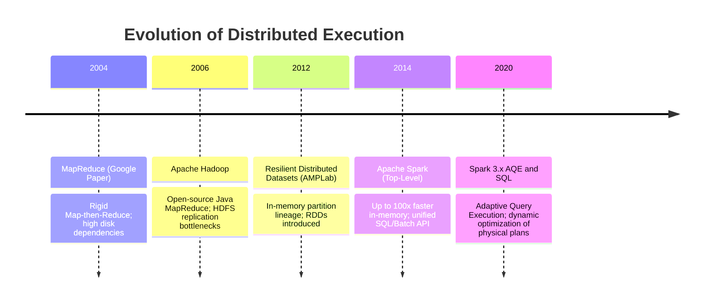
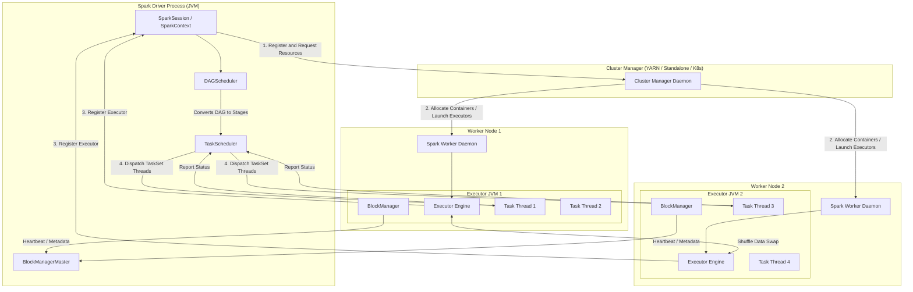
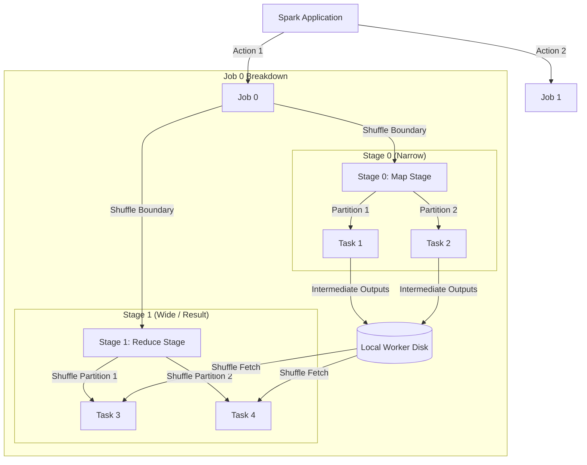
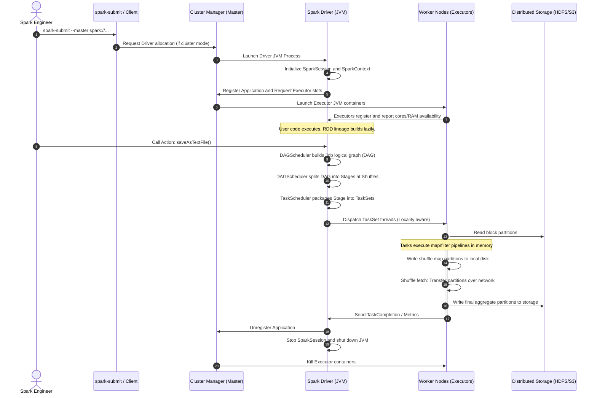
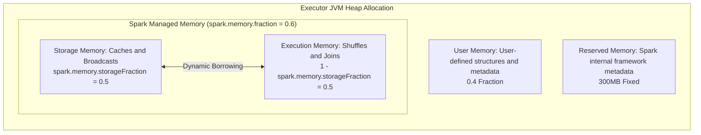
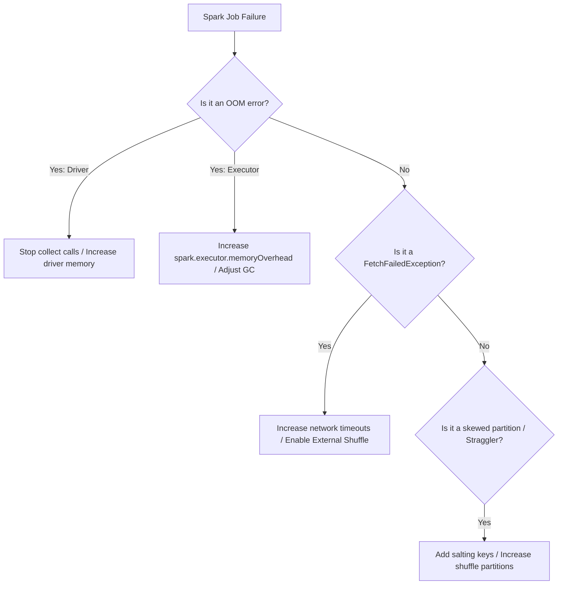

# Day 16: Apache Spark Core Architecture, RDDs & Tasks

Welcome to Day 16 of the **30 Days of Modern Hadoop Ecosystem** series. Today, we are deep-diving into **Apache Spark Core**, the foundational engine of the Spark ecosystem. We will cover the execution lifecycle, driver/executor process boundaries, memory partitioning under the Unified Memory Manager, scheduling graphs (DAGs), shuffle dynamics, and production tuning practices.

---

## SECTION 1 — INTRODUCTION

### 1.1 What is Spark Core?
**Apache Spark Core** is the primary execution engine of the Apache Spark platform. It provides the base API for distributed data processing, task scheduling, memory management, fault recovery, and interaction with cluster storage. At its heart, Spark Core provides the **Resilient Distributed Dataset (RDD)** abstraction—a read-only collection of partitioned records that can be processed in parallel across cluster nodes.

Spark Core is designed to be general-purpose, supporting batch computation, interactive queries, streaming analytics, and machine learning pipelines within a single cluster resource context.

### 1.2 History and Evolution
* **2009**: Spark was started as a research project at UC Berkeley’s AMPLab by Matei Zaharia.
* **2010**: Open-sourced under a BSD license.
* **2013**: Donated to the Apache Software Foundation, transitioning to the Apache 2.0 license.
* **2014**: Became an Apache Top-Level Project. In November 2014, Spark set a world record in sorting 100TB of data (3x faster than MapReduce, using 1/10th of the machines).
* **2016**: Spark 2.0 launched, introducing the SparkSession, unified Datasets/DataFrames APIs, and Structured Streaming.
* **2020**: Spark 3.0 launched, integrating Adaptive Query Execution (AQE), dynamic partition pruning, and enhanced Kubernetes integration.
* **2024+**: Spark 3.5.x and 4.0 evolution, focusing on remote execution (Spark Connect), advanced GPU scheduling, and vectorization.

### 1.3 Why Spark Replaced Many MapReduce Workloads
The transition from MapReduce to Spark represents a paradigm shift from disk-bound batch cycles to memory-centric acyclic computations:

| Feature | Hadoop MapReduce | Apache Spark |
| :--- | :--- | :--- |
| **Execution Model** | Strict Map-then-Reduce | Directed Acyclic Graph (DAG) |
| **Intermediate Storage** | Persistent HDFS (Network & Disk I/O) | In-Memory (Dynamic partition caching) |
| **Speed** | Slow due to barrier disk writes | Up to 100x faster in-memory, 10x faster on disk |
| **APIs** | Low-level Java Map/Reduce classes | Rich APIs in Java, Scala, Python, R, and SQL |
| **Workload Scope** | Batch only | Batch, Stream, SQL, Graph, and Machine Learning |



### 1.4 Where Spark Fits in the Hadoop Ecosystem
Spark is storage-agnostic. While it does not include a proprietary distributed file system, it fits seamlessly into the Hadoop ecosystem by:
* **Resource Orchestration**: Running on top of **YARN** alongside MapReduce and Tez.
* **Storage Access**: Reading and writing data blocks directly in **HDFS**, **HBase**, or object stores like Amazon S3 and Google Cloud Storage.
* **Security & Governance**: Integrating with **Kerberos**, **Apache Ranger**, and **Apache Atlas** for centralized access policies and lineage tracking.
* **Data Interchange**: Leveraging existing Hive Metastore catalogs (HMS) to read structured tables.

---

## SECTION 2 — PROBLEM STATEMENT

### 2.1 The Limitations of MapReduce
While MapReduce enabled large-scale data storage and batch computation, it was not built for iterative algorithms or interactive exploration:
1. **Mandatory Disk Persistence**: At the boundary of every MapReduce job, data must be written to HDFS (involving network replication, serialization, and disk syncs). 
2. **Iterative Algorithm Slowdown**: Machine learning (e.g., K-Means, Logistic Regression) and graph analysis require running identical processing passes over the same data repeatedly. MapReduce forces each pass to be a new job reading files back from disk, making iterative workloads slow.
3. **Rigid Two-Stage Programming Model**: Expressing operations like multi-stage joins or filters requires chain-scheduling separate jobs, adding scheduling delays (JVM spin-ups) at each boundary.

### 2.2 Why an In-Memory Distributed Engine Was Needed
To unlock low-latency query loops and fast ML computations, the industry needed an engine that could:
* Keep datasets warm in distributed RAM across executor slots.
* Track **how** data was computed (Lineage) rather than copying the data itself to replicated disks.
* Compile complex pipelines into unified execution graphs to skip physical data writes between intermediate steps.

### 2.3 Performance Bottlenecks Spark Solves
* **Disk I/O Bottleneck**: By caching RDD partitions in-memory, subsequent read stages access RAM rather than local disks.
* **Serialization Overhead**: Spark implements Kryo Serialization and off-heap memory storage (Tungsten project) to reduce garbage collection (GC) and bytecode serialization times.
* **Network Shuffle Bottleneck**: Spark optimizes shuffles by building map-side sort consolidations and supporting Adaptive Query Execution to reduce partition skew.

---

## SECTION 3 — ARCHITECTURE DEEP DIVE

Spark uses a Master-Worker controller pattern. A central control node (Driver) coordinates parallel workers (Executors) running on the cluster.



### 3.1 Driver Architecture
The **Driver** is the process that hosts the `main()` method of your Spark application. It is the control hub of the run:
* **SparkSession / SparkContext**: The entrypoint that negotiates resource requests and cluster bindings.
* **DAG Scheduler**: Translates high-level code transformations into physical execution stages of tasks.
* **Task Scheduler**: Dispatches physical tasks (TaskSets) to Executor worker slots, manages locality-aware scheduling, and handles retries when tasks fail.
* **Metadata Store**: Coordinates file block allocations, tracking location status of cached partitions via the `BlockManagerMaster`.

### 3.2 Executor Architecture
An **Executor** is a worker JVM process launched on a cluster NodeManager or Worker host:
* Hosts the CPU slot thread pool that runs tasks in parallel.
* Stores and manages the partition caches (Rams/Disks) via the local `BlockManager`.
* Provides memory pools for calculations (joins/sorts) and dynamic buffers for networking.
* Reports status, metrics, and heartbeats back to the Driver.

### 3.3 Cluster Manager Interaction
The Driver coordinates resource allocations via the **Cluster Manager**:
* **Standalone**: A native Spark daemon manager (Master/Worker) included with Spark.
* **YARN**: The Hadoop resource coordinator (ResourceManager/NodeManager). The Driver can run inside YARN (cluster mode) or externally (client mode).
* **Kubernetes (K8s)**: Orchestrates Executors as pods running on container nodes.

### 3.4 Job, Stage, and Task Hierarchy
Spark organizes computational work in a hierarchical structure:



* **Job**: Triggered when an **Action** (e.g. `save()`, `collect()`, `count()`) is evaluated. Each action corresponds to exactly one Spark Job.
* **Stage**: A Job is divided into Stages based on **Wide Transformation** (Shuffle) boundaries. A shuffle boundary forces an execution pipeline to wait until upstream map tasks finish writing files.
* **Task**: The smallest physical execution thread. A Task runs on a single executor core against a single partition of data. If a Stage has 100 partitions, Spark runs 100 tasks in that Stage.

### 3.5 Partitioning
A **Partition** is a logical chunk of a distributed dataset. Spark processes data by routing one task per partition:
* **HDFS Block Alignments**: By default, when reading files from HDFS, Spark creates one partition per HDFS block (typically 128MB).
* **Sizing Guideline**: Too few partitions limit parallelism (cores remain idle). Too many partitions cause scheduling overhead. A general rule is **2-4 partitions per allocated CPU core** in the cluster.

---

## SECTION 4 — INTERNAL WORKING

Let's trace a submitted Spark Application step-by-step from startup to final cleanup:



### 4.1 Step-by-Step Execution Mechanics
1. **Application Submission**: The client CLI (`spark-submit`) packages the code and submits it to the Cluster Manager.
2. **Driver Initialization**: The Driver launches and instantiates the `SparkSession`. It compiles the code and builds the logical execution plan.
3. **Resource Allocation**: The Driver requests executor resources. The Cluster Manager allocates slots on worker nodes and launches executor JVMs.
4. **Executor Registration**: Executors connect back to the Driver, declaring their ports, cores, and memory capacity.
5. **DAG Compilation**: When an action is called, the `DAGScheduler` compiles the RDD lineage into physical Stages.
6. **Task Scheduling**: The `TaskScheduler` groups tasks into `TaskSets` based on stage order. Tasks are sent to executors based on data locality:
   * *PROCESS_LOCAL* (Data in Driver/Executor JVM)
   * *NODE_LOCAL* (Data on the local HDFS node)
   * *RACK_LOCAL* (Data on the local rack switch)
   * *ANY* (Data must be read over the network)
7. **Task Execution**: Executor cores run the task bytecode, caching blocks or writing shuffle files to local directories.
8. **Shuffle Fetch**: Downstream tasks fetch partition outputs from the upstream worker nodes over the network.
9. **Aggregation & Collection**: Final task outputs are written to HDFS/S3, or returned to the Driver.
10. **Cleanup**: The Driver calls `stop()`, releases executor containers, and exits.

---

## SECTION 5 — CORE CONCEPTS

To build fast Spark jobs, we must understand the core concepts using the flow: **WHY → HOW → PRODUCTION → TROUBLESHOOTING**.

### 5.1 Lazy Evaluation
* **WHY**: If Spark executed every transformation immediately (like procedural code), it would write intermediate states to memory or disk. By executing lazily, Spark records the transformations as an execution plan (lineage DAG) and optimizes it (e.g., merging filters, skipping data reads) before running tasks.
* **HOW**: Transformations (e.g., `map`, `filter`, `join`) return a new RDD without reading files or processing records. Only Actions (e.g., `count`, `collect`, `saveAsTextFile`) trigger physical computation.
* **PRODUCTION**: Combine multiple filters and projections together. The optimizer compiles them into a single-pass loop, avoiding repeated dataset scans.
* **TROUBLESHOOTING**: Debugging lazy code can be confusing because errors (like `FileNotFoundException` or parser errors) do not occur where the RDD is defined, but rather where the first Action is triggered. Check stack traces at the Action call site.

### 5.2 RDD Lineage & Fault Tolerance
* **WHY**: Replicating distributed datasets across nodes for fault tolerance is slow and network-heavy. Spark solves this by tracking the logical graph of transformations (Lineage) that created an RDD. If a node crashes and a partition is lost, Spark re-runs the lineage path to rebuild only that specific partition.
* **HOW**: Every RDD stores a pointer to its parent dependency (`dependencies()`) and the metadata mapping of how it was created.
* **PRODUCTION**: Lineage graphs can grow very large in recursive algorithms (e.g., graphs, iterative loops). Use `.checkpoint()` to truncate the lineage graph and write intermediate states to HDFS for safe recovery.
* **TROUBLESHOOTING**: A very long lineage graph can trigger JVM stack overflow errors (`StackOverflowError`) during optimization. Break the lineage using `.checkpoint()` or persist the data.

### 5.3 Narrow vs. Wide Transformations
* **WHY**: Performance is determined by network shuffles. Spark classifies transformations to understand when records must be shuffled across network boundaries.
* **HOW**:
  * **Narrow Transformations**: Each partition of the parent RDD is used by at most one partition of the child RDD (e.g., `map()`, `filter()`, `flatMap()`). No network shuffle is required.
  * **Wide Transformations**: Multiple child partitions depend on data from multiple parent partitions (e.g., `groupByKey()`, `reduceByKey()`, `join()`). Spark must run a Shuffle phase, writing data to disk and transferring partitions over the network.

```
NARROW TRANSFORMATION (No Shuffle)          WIDE TRANSFORMATION (Requires Shuffle)
    [Parent RDD]      [Child RDD]               [Parent RDD]      [Child RDD]
    +----------+      +----------+              +----------+      +----------+
    | Part 0   | ===> | Part 0   |              | Part 0   | ---\/--| Part 0   |
    +----------+      +----------+              +----------+   /\ +----------+
    | Part 1   | ===> | Part 1   |              | Part 1   | -/  \| Part 1   |
    +----------+      +----------+              +----------+      +----------+
```

* **PRODUCTION**: Prefer `reduceByKey` over `groupByKey`. `reduceByKey` aggregates records locally on the map side before shuffling, reducing network traffic.
* **TROUBLESHOOTING**: Wide transformations are the primary source of `FetchFailedException` errors. Monitor your network metrics and disk performance during wide stages.

### 5.4 Caching and Persistence
* **WHY**: If you access the same RDD multiple times without caching it, Spark will re-run the entire lineage from the source file for every action.
* **HOW**: Use `rdd.cache()` (aliases `persist(StorageLevel.MEMORY_ONLY)`) or `rdd.persist(level)`.
  * `MEMORY_ONLY`: Stores deserialized Java objects in JVM memory. Fast, but uses more RAM.
  * `MEMORY_AND_DISK`: Caches partitions in memory. If partitions exceed RAM, writes remaining parts to local disk.
  * `MEMORY_ONLY_SER`: Stores serialized Java objects (bytes). Saves memory space, but adds CPU serialization overhead.
* **PRODUCTION**: Cache clean, filtered datasets that are used repeatedly in downstream calculations. Unpersist them when finished using `rdd.unpersist()`.
* **TROUBLESHOOTING**: Caching raw datasets can lead to OutOfMemory errors. If you see high memory usage, switch to `MEMORY_AND_DISK_SER`.

---

## SECTION 6 — PRODUCTION ENGINEERING

### 6.1 Executor Sizing
To size your executors in a production cluster (e.g., YARN), follow these guidelines:
1. **Never allocate 1 Core per Executor**: This misses out on multithreaded sharing of broadcast variables and memory blocks.
2. **Never allocate more than 5 Cores per Executor**: JVMs with more than 5 cores suffer from long garbage collection (GC) pauses.
3. **Overhead Allocation**: Leave room for native memory overhead (e.g., off-heap memory, thread tables). Set `spark.executor.memoryOverhead` to `max(384MB, 10% of executor memory)`.

#### Sizing Example:
A physical cluster node has 16 Cores and 64GB RAM:
* Allocate 3 executors per node.
* Each executor gets **5 cores** (1 core left for the OS and YARN NodeManager).
* Memory allocation per executor = $64\text{GB} / 3 \approx 20\text{GB}$ RAM.
* Set YARN container memory request to 20GB, configuration: `spark.executor.memory=18g` and `spark.executor.memoryOverhead=2g`.

### 6.2 Unified Memory Layout
Under the Unified Memory Manager, the executor JVM heap is split dynamically:



1. **Reserved Memory**: Fixed at **300MB**. Holds Spark internal objects and trackers.
2. **User Memory**: Accounted as $(JVMHeap - 300\text{MB}) \times (1 - spark.memory.fraction)$. Used for custom hash tables, metadata, and user-defined class objects.
3. **Spark Memory**: $(JVMHeap - 300\text{MB}) \times spark.memory.fraction$. Split into:
   * **Storage Memory**: Stores cached RDD partitions and broadcast structures.
   * **Execution Memory**: Stores shuffle buffers, sort tables, and join records.
   * *Dynamic Borrowing*: If Storage Memory is empty, Execution Memory can borrow all of it, and vice versa. If Storage borrows Execution space and Execution needs it back, Storage blocks are evicted from RAM and written to disk.

### 6.3 Serialization Tuning
* **Java Serialization**: The default. It is slow and creates large serialized objects.
* **Kryo Serialization**: Up to **10x faster** and more compact than Java serialization. Enable it in your configuration:
  ```properties
  spark.serializer                 org.apache.spark.serializer.KryoSerializer
  spark.kryoserializer.buffer.max  128m
  ```

---

## SECTION 7 — HANDS-ON LAB

In this lab, you will start a multi-node Standalone Spark cluster using Docker Compose, compile a Java Spark application using Maven, and submit a job using `spark-submit`.

### Prerequisites
* Docker installed and running on your host system.
* Maven installed locally (if compiling outside the container).

### 7.1 Detailed Step-by-Step Guide

#### Step 1: Start the Cluster
Navigate to the repository directory and start the Docker containers:
```powershell
cd d:\30_Days_of_Modern_Hadoop_Ecosystem\Day-16-Spark-Core-Architecture\docker
docker-compose up -d
```
Verify that all services are online:
```powershell
docker-compose ps
```

#### Step 2: Connect to Spark Client and Run Verification Scripts
Connect to the client container:
```powershell
docker exec -it spark-client-day16 /bin/bash
```
Run the automated verification scripts inside the client container:
```bash
cd /workspace/scripts
./verify-spark-cluster.sh
./verify-driver.sh
./verify-executors.sh
```

#### Step 3: Compile and Submit the Spark Job
Run the script to compile the application and execute the Spark job:
```bash
./run-spark-demo.sh
```
This script will build the Maven code, upload a text file to HDFS, and submit it to the cluster Master at `spark://spark-master:7077`.

#### Step 4: Verify the output files
Verify that the output partitions are created in HDFS:
```bash
hadoop fs -cat hdfs://namenode:9000/output-spark/part-* | head -n 30
```
Verify that the DAG listener generated event logs in HDFS:
```bash
./verify-dag.sh
```

---

## SECTION 8 — BUILD FROM SOURCE

Building Spark from source allows you to customize the Scala version, add proprietary cloud connectors, or backport security patches.

### 8.1 Spark Source Directory Structure
The Apache Spark repository is organized as a multi-module project:
* **`core/`**: The core execution engine (scheduler, block manager, RDD APIs).
* **`sql/`**: Spark SQL Catalyst optimizer, DataFrames API, and metastore integrations.
* **`streaming/`**: Legacy Spark DStreams streaming engine.
* **`mllib/`**: Spark ML machine learning libraries.
* **`assembly/`**: Packages all modules together into a unified distribution archive.

### 8.2 Building Spark with Maven
To build Spark, you need **Java 8/11/17** and **Apache Maven 3.8+** installed. Use the built-in packaging script:
```bash
# Clone Spark code
git clone https://github.com/apache/spark.git
cd spark

# Build a standalone distribution package with Hadoop 3 support
./dev/make-distribution.sh --name custom-spark-dist --tgz -Phadoop-3 -Phadoop-cloud -DskipTests
```
*   `-Phadoop-3`: Compiles client bindings for Hadoop 3.x.
*   `-Phadoop-cloud`: Adds connectors for Amazon S3 (s3a) and Google Cloud Storage (gcs).
*   `-DskipTests`: Skips test suites to speed up compilation.

The build output will be located at:
`spark-3.5.1-bin-custom-spark-dist.tgz`

---

## SECTION 9 — DOCKER DEPLOYMENT
Refer to the [Dockerfile](file:///d:/30_Days_of_Modern_Hadoop_Ecosystem/Day-16-Spark-Core-Architecture/docker/Dockerfile) and [docker-compose.yml](file:///d:/30_Days_of_Modern_Hadoop_Ecosystem/Day-16-Spark-Core-Architecture/docker/docker-compose.yml) in the `docker/` folder. The environment configures:
1. **Master node**: `spark-master-day16` (Host Web UI port `8080`)
2. **Worker nodes**: `spark-worker-1-day16` and `spark-worker-2-day16` (Web UI ports `8081` and `8082`)
3. **History Server**: `spark-history-day16` (Host Web UI port `18080`)
4. **HDFS Storage**: `namenode-day16` and `datanode-day16` (Web UI port `9870`)

---

## SECTION 10 — LOCAL CLUSTER DEPLOYMENT

### 10.1 Standalone Mode Setup
To launch a Spark standalone cluster on a bare-metal machine:
1. In `conf/spark-env.sh`, define the master host:
   ```bash
   export SPARK_MASTER_HOST='my-master-node'
   ```
2. Start the Master daemon:
   ```bash
   ./sbin/start-master.sh
   ```
3. Start the Worker daemons on the worker nodes:
   ```bash
   ./sbin/start-worker.sh spark://my-master-node:7077
   ```

---

## SECTION 11 — VALIDATION

We have created 5 automation and validation scripts inside the `scripts/` folder:

1. **`verify-spark-cluster.sh`** ([link](file:///d:/30_Days_of_Modern_Hadoop_Ecosystem/Day-16-Spark-Core-Architecture/scripts/verify-spark-cluster.sh)): Probes port `7077` (RPC) and port `8080` (Web UI) to verify the Master node.
2. **`verify-driver.sh`** ([link](file:///d:/30_Days_of_Modern_Hadoop_Ecosystem/Day-16-Spark-Core-Architecture/scripts/verify-driver.sh)): Validates the `spark-submit` tool and checks system write permissions.
3. **`verify-executors.sh`** ([link](file:///d:/30_Days_of_Modern_Hadoop_Ecosystem/Day-16-Spark-Core-Architecture/scripts/verify-executors.sh)): Queries the Master JSON API to count active registered workers and cores.
4. **`verify-dag.sh`** ([link](file:///d:/30_Days_of_Modern_Hadoop_Ecosystem/Day-16-Spark-Core-Architecture/scripts/verify-dag.sh)): Parses the generated Spark event logs on HDFS to confirm DAG creation.
5. **`run-spark-demo.sh`** ([link](file:///d:/30_Days_of_Modern_Hadoop_Ecosystem/Day-16-Spark-Core-Architecture/scripts/run-spark-demo.sh)): Compiles the Maven project, initializes test data in HDFS, and submits the job.

---

## SECTION 12 — PRODUCTION TROUBLESHOOTING PLAYBOOK

Here is a summary of common production issues. For a detailed guide, refer to the [Troubleshooting Playbook](file:///d:/30_Days_of_Modern_Hadoop_Ecosystem/Day-16-Spark-Core-Architecture/troubleshooting/troubleshooting-guide.md).



### Common Resolution Commands:
*   **Increase Network Timeout Limits**:
    ```properties
    spark.network.timeout   800s
    ```
*   **Set JVM GC Options**:
    ```properties
    spark.executor.extraJavaOptions   -XX:+UseG1GC -XX:MaxGCPauseMillis=100
    ```

---

## SECTION 13 — REAL-WORLD CASE STUDIES

### 13.1 Netflix: Large-Scale ETL & Personalization
* **Workload**: Netflix processes trillions of events daily to power its recommendation engine and analytics pipelines.
* **Why Spark Core**: Legacy MapReduce jobs were too slow to process iterative machine learning passes over user streaming history.
* **Architecture**: Netflix migrated its core batch pipelines to Spark on Amazon EMR. They cache frequently accessed lookup tables in-memory and write final recommender models directly to distributed object stores. This reduced processing windows from 20 hours to under 4 hours.

### 13.2 Uber: Real-time and Batch Analytics
* **Workload**: Calculating ride fares, driver matches, and telemetry analysis at scale.
* **Why Spark Core**: Uber requires dynamic, locality-aware scheduling to process streaming data and historical logs side-by-side.
* **Architecture**: Uber runs Spark on large YARN clusters. They use dynamic allocation (`spark.dynamicAllocation.enabled=true`) to automatically scale executor counts during peak demand times and release container resources back to YARN when idle.

---

## SECTION 14 — INTERVIEW QUESTIONS

### 14.1 Beginner Questions (1-20)

#### Q1: What is Apache Spark Core?
**Answer**: Apache Spark Core is the underlying execution engine of the Spark platform. It manages task scheduling, memory management, fault recovery, and provides the programmatic API for Resilient Distributed Datasets (RDDs).

#### Q2: What is an RDD?
**Answer**: RDD stands for **Resilient Distributed Dataset**. It is a read-only, partitioned collection of records that can be processed in parallel across cluster nodes. It is "resilient" because it tracks its lineage for fault recovery, and "distributed" because its partitions are spread across cluster memory.

#### Q3: What is the difference between transformations and actions in Spark?
**Answer**: Transformations are lazy operations (e.g., `map()`, `filter()`, `join()`) that define a new RDD without modifying the data. Actions are eager operations (e.g., `count()`, `collect()`, `saveAsTextFile()`) that trigger the execution of the DAG logical plan to compute and return results.

#### Q4: Why is Spark faster than Hadoop MapReduce?
**Answer**: Spark keeps intermediate data in-memory (RAM) instead of writing it to HDFS between processing steps. It also compiles operations into an optimized Directed Acyclic Graph (DAG), reducing disk writes and network serialization overhead.

#### Q5: What is the Spark Driver?
**Answer**: The Driver is the JVM process that hosts the `main()` method of your Spark application. It runs the `SparkSession`, creates the execution DAG, and schedules tasks via the `TaskScheduler`.

#### Q6: What is a Spark Executor?
**Answer**: An Executor is a worker JVM process launched on a cluster node. It runs the tasks dispatched by the Driver and stores cached partition blocks in local memory or disk storage.

#### Q7: What is the difference between client mode and cluster mode in spark-submit?
**Answer**: In client mode, the Driver process runs locally on the machine that submitted the job. In cluster mode, the Cluster Manager launches the Driver process inside a worker node container (e.g., a YARN ApplicationMaster).

#### Q8: What does DAG stand for in Spark?
**Answer**: DAG stands for **Directed Acyclic Graph**. It is a sequence of transformations applied to the data, where each RDD points to its parent dependency. It is directed (flows one way) and acyclic (contains no loops).

#### Q9: What is the DAG Scheduler?
**Answer**: The `DAGScheduler` is a component of the Driver that translates the logical RDD lineage plan into physical execution stages. It identifies shuffle boundaries and creates `TaskSets` for each stage.

#### Q10: What is the Task Scheduler?
**Answer**: The `TaskScheduler` is a component of the Driver that dispatches the tasks within a `TaskSet` to executor slots across the cluster. It manages task locality and schedules retries for failed tasks.

#### Q11: What is a Partition in Spark?
**Answer**: A partition is a logical slice of the data. Spark distributes partitions across the cluster nodes, processing each partition in a separate thread (Task).

#### Q12: How does Spark achieve fault tolerance for RDDs?
**Answer**: Spark does not replicate RDD data. Instead, it tracks the logical transformations that created the RDD (Lineage). If a node fails and a partition is lost, Spark re-runs the lineage path to recompute only that partition.

#### Q13: What is Lazy Evaluation?
**Answer**: Lazy evaluation means Spark does not compute transformations immediately. It only records the transformations in the lineage graph. Computation is deferred until an Action is explicitly called.

#### Q14: What is a Stage in Spark?
**Answer**: A Stage is a collection of tasks that perform the same operations on different partitions of the data. Spark splits jobs into stages at shuffle boundaries (Wide Transformations).

#### Q15: What is a Task in Spark?
**Answer**: A Task is the smallest unit of execution in Spark. It runs on a single executor thread and processes a single partition of an RDD.

#### Q16: What is a Shuffle in Spark?
**Answer**: A Shuffle is the process of redistributing data across partitions. It is triggered by wide transformations (e.g., `reduceByKey()`, `join()`) and involves writing data to disk and transferring it over the network.

#### Q17: What is the difference between `map` and `flatMap`?
**Answer**: `map` transforms each element in an RDD into exactly one element in the child RDD. `flatMap` transforms each element into zero, one, or more elements, flattening the result collection.

#### Q18: What is a narrow transformation?
**Answer**: A narrow transformation is an operation where each partition of the parent RDD is used by at most one partition of the child RDD (e.g., `map()`, `filter()`). It does not require a network shuffle.

#### Q19: What is a wide transformation?
**Answer**: A wide transformation is an operation where multiple child partitions depend on data from multiple parent partitions (e.g., `reduceByKey()`, `join()`). It requires a network shuffle to group keys together.

#### Q20: How do you configure Spark to log events for the History Server?
**Answer**: Set the property `spark.eventLog.enabled` to `true` and configure the storage directory using `spark.eventLog.dir`.

---

### 14.2 Intermediate Questions (21-40)

#### Q21: What is the Unified Memory Manager in Spark?
**Answer**: Introduced in Spark 1.6, the Unified Memory Manager dynamically splits executor heap space between Storage Memory (caches and broadcast variables) and Execution Memory (shuffle buffers, sorts, and joins). Storage and Execution can borrow memory from each other dynamically depending on cluster utilization.

#### Q22: What is the difference between `cache()` and `persist()`?
**Answer**: `cache()` is a shorthand alias for `persist(StorageLevel.MEMORY_ONLY)`. `persist()` allows you to customize the storage level (e.g., `MEMORY_AND_DISK`, `MEMORY_ONLY_SER`, `DISK_ONLY`) to control memory and CPU usage.

#### Q23: Why should you avoid `groupByKey` and use `reduceByKey` instead?
**Answer**: `reduceByKey` performs map-side aggregations (combining matching keys locally on each executor before transferring data). `groupByKey` shuffles all records over the network to the reducers before grouping, causing network and disk congestion.

#### Q24: What is data locality in Spark scheduling?
**Answer**: Data locality is the optimization where the Driver schedules tasks on the executors that are closest to the target data blocks. The priority levels are `PROCESS_LOCAL`, `NODE_LOCAL`, `RACK_LOCAL`, and `ANY`.

#### Q25: How does Spark handle garbage collection (GC) overhead?
**Answer**: High GC overhead is typically caused by caching deserialized Java objects. Spark mitigates this by supporting serialized storage levels (`MEMORY_ONLY_SER`), enabling off-heap memory storage, and recommending the G1 garbage collector.

#### Q26: What is Kryo serialization and how does it compare to Java serialization?
**Answer**: Kryo serialization is an optimized serialization library. It is significantly faster and creates up to 10x smaller serialized byte objects than default Java serialization, reducing network transfer times.

#### Q27: What is the purpose of `coalesce()` and `repartition()`?
**Answer**: `repartition()` reshuffles all data across the network to increase or decrease the partition count. `coalesce()` decreases the partition count without running a full network shuffle by merging adjacent partitions on local worker nodes.

#### Q28: What is Dynamic Allocation in Spark?
**Answer**: Dynamic allocation allows Spark to dynamically scale the number of executors based on workload demand. It requests new executors when tasks are pending and releases idle executors when workload decreases.

#### Q29: What is the Spark History Server?
**Answer**: The History Server is a web service that reconstructs the Spark UI for completed applications using the event log files saved by the Driver.

#### Q30: How do you configure Spark executor sizing?
**Answer**: Sizing is determined by cores and memory settings. Recommend allocating **3 to 5 CPU cores** per executor to balance multi-threading against GC pauses, and set memory memory limits along with a 10% memory overhead.

#### Q31: What is a Broadcast Variable?
**Answer**: A broadcast variable is a read-only variable cached on each worker node rather than sent as copy tasks. It is used to distribute small lookup tables to executors for local map-side joins.

#### Q32: What is an Accumulator?
**Answer**: An Accumulator is a write-only shared variable that can only be added to using associative operations. It is used to implement counters or sum metrics across parallel tasks.

#### Q33: Explain how Spark handles partition recovery after node failures.
**Answer**: If a worker node hosting cached partitions crashes, the Driver's DAG Scheduler identifies the missing partitions, traces their lineage, and creates tasks to rebuild only the lost data.

#### Q34: What is the purpose of the Spark External Shuffle Service?
**Answer**: The External Shuffle Service runs as a separate daemon on worker nodes. It serves shuffle files to downstream tasks even if the executor JVM that generated the files has finished or crashed.

#### Q35: What is the default partition count for shuffles in Spark SQL?
**Answer**: The default is `200` partitions, configured by `spark.sql.shuffle.partitions`.

#### Q36: What is Adaptive Query Execution (AQE)?
**Answer**: AQE is a query optimizer in Spark SQL. It dynamically optimizes the physical plan during runtime based on intermediate metrics (e.g., coalescing shuffle partitions, converting sort-merge joins to broadcast joins).

#### Q37: How do you check the execution plan of a DataFrame?
**Answer**: Use the `.explain()` method on the DataFrame (or `.explain(true)` to see physical, logical, and optimized plans).

#### Q38: What is the difference between `join` and `broadcast join`?
**Answer**: A standard join shuffles both datasets across the network by key. A broadcast join copies the small dataset to all executor nodes, performing the join locally without a network shuffle.

#### Q39: What is a lineage graph?
**Answer**: A lineage graph is the logical execution plan of transformations that Spark compiles to build an RDD. It forms a Directed Acyclic Graph (DAG).

#### Q40: What happens if you submit a job with too few partitions?
**Answer**: Too few partitions limit parallelism (some executor CPU slots remain idle), increase memory usage per task, and can trigger OutOfMemory errors on large datasets.

---

### 14.3 Advanced Questions (41-60)

#### Q41: Explain the state transitions of a task in the TaskScheduler.
**Answer**: A task transitions through the following states:
1. `LAUNCHING`: The task bytecode is serialized and sent to the executor.
2. `RUNNING`: The task thread is actively executing on the executor JVM.
3. `FINISHED`: The task completed successfully and returned results.
4. `FAILED`: The task failed due to an exception (retried up to 4 times).
5. `KILLED`: The task was cancelled by the driver (e.g., speculative execution).

#### Q42: Deep-dive into how Spark performs a Shuffle.
**Answer**: A shuffle is split into:
*   **Shuffle Write**: Upstream tasks sort and partition their output records by key, writing them to local block files indexed by a partition lookup file.
*   **Shuffle Read**: Downstream tasks query the Driver for block locations and fetch their assigned partitions from the upstream worker nodes over the network.

#### Q43: How do you troubleshoot a `FetchFailedException`?
**Answer**: A `FetchFailedException` occurs when a downstream task fails to retrieve shuffle files from an upstream executor. Check if:
1. The upstream executor crashed due to an OutOfMemory error.
2. Network timeouts occurred (increase `spark.network.timeout`).
3. Local disk space on the worker was exhausted.

#### Q44: What is speculative execution in Spark?
**Answer**: Speculative execution is an optimization where the Driver detects tasks that are running significantly slower than the average task in the same Stage. The Driver launches a duplicate instance of the task on another worker. Whichever task finishes first is committed, and the slow task is killed.

#### Q45: How does the G1 Garbage Collector improve Spark performance?
**Answer**: The G1 garbage collector splits the JVM heap into regions, collecting regions concurrently. This reduces GC pause times compared to ParallelGC, preventing heartbeat timeouts and executor lost errors.

#### Q46: What is Project Tungsten?
**Answer**: Project Tungsten is a Spark optimization engine. It bypasses JVM object overhead by storing data in raw byte structures (off-heap memory), implements whole-stage code generation, and optimizes CPU cache access.

#### Q47: Explain the difference between `persist()` storage levels: MEMORY_ONLY, MEMORY_ONLY_SER, and MEMORY_AND_DISK.
**Answer**:
*   `MEMORY_ONLY`: Caches RDD as deserialized Java objects. Fast, but uses high memory space.
*   `MEMORY_ONLY_SER`: Caches serialized Java byte arrays. Reduces memory space, but adds CPU serialization overhead.
*   `MEMORY_AND_DISK`: Caches in RAM; writes excess partitions to local disk instead of recomputing them.

#### Q48: How do you diagnose and resolve data skew in Spark?
**Answer**: 
*   **Diagnose**: In the Spark UI, inspect task execution times. If a few tasks run significantly longer than others and process a much larger number of records, you have data skew.
*   **Resolve**: Salt the join key by appending a random suffix, filter out null/empty keys, or use broadcast joins.

#### Q49: What is checkpointing and how is it different from persisting?
**Answer**: `persist()` stores intermediate data but keeps the RDD lineage graph intact. `checkpoint()` writes the data to reliable storage (e.g. HDFS) and completely removes the lineage graph, preventing stack overflow errors.

#### Q50: How does Spark coordinate metadata writes with the BlockManager?
**Answer**: Executors report their partition block status to the `BlockManagerMaster` running on the Driver. When a task needs to read a block, it queries the Driver's BlockManagerMaster to look up the physical location of the block.

#### Q51: How do you build Spark Connect applications?
**Answer**: Spark Connect introduces a thin client API. Instead of running your driver process directly inside the Spark session, the client connects to a remote Spark cluster via gRPC.

#### Q52: What is the impact of setting `spark.memory.storageFraction` to a high value?
**Answer**: A high storage fraction allocates more memory for RDD caches. This leaves less memory for shuffle execution, potentially forcing shuffles to spill to local disk and slowing down jobs.

#### Q53: Under what conditions is container reuse bypassed in YARN?
**Answer**: Spark does not run container reuse directly like Tez. It implements Executor allocation reuse. Executors stay alive across job boundaries for the duration of the application.

#### Q54: How does Spark secure data in transit?
**Answer**: Spark supports SASL encryption for block transfers, SSL/TLS for HTTP web interfaces, and Kerberos delegation tokens for HDFS/YARN authentication.

#### Q55: What is the difference between `.coalesce()` and `.repartition()` performance-wise?
**Answer**: `.repartition()` runs a full network shuffle to distribute partitions. `.coalesce()` avoids network shuffles by merging local partitions, making it significantly faster for down-partitioning.

#### Q56: How do you troubleshoot a Spark job that is stuck in the `ACCEPTED` state on YARN?
**Answer**: `ACCEPTED` indicates the application has been submitted, but YARN cannot allocate resources to start the Driver/ApplicationMaster container. Free up queue resources, check YARN allocations, or check if the requested resource size exceeds YARN limits.

#### Q57: How does Spark handle schemas in DataFrame operations?
**Answer**: DataFrames are built on the Dataset API with structured schemas. Spark SQL parses the schema, builds an abstract syntax tree (AST), and compiles it using Catalyst into optimized Java bytecode.

#### Q58: Explain the role of JVM off-heap memory in Spark execution.
**Answer**: Spark uses off-heap memory (`spark.memory.offHeap.size`) to run Java `Unsafe` operations. This stores data arrays directly as bytes, bypassing JVM garbage collection and reducing object serialization overhead.

#### Q59: How does Spark manage class loading conflicts?
**Answer**: Set `spark.driver.userClassPathFirst` or `spark.executor.userClassPathFirst` to `true` to prioritize application dependencies over Spark's default classpath dependencies.

#### Q60: How does Spark handle speculative tasks on secured clusters?
**Answer**: The Driver tracks delegation tokens. When launching speculative tasks, it transmits the active security context, ensuring duplicate tasks have the correct credentials to access HDFS blocks.

---

## SECTION 15 — KEY TAKEAWAYS

*   **In-Memory Architecture**: Spark's core benefit is keeping intermediate datasets warm in RAM, bypassing the disk write bottlenecks of MapReduce.
*   **DAG Execution**: The DAG Scheduler compiles logical plans into stages split at shuffle boundaries (Wide Transformations), optimizing pipelines before executing tasks.
*   **Locality-Aware Scheduling**: Spark schedules tasks as close to the HDFS blocks as possible (`PROCESS_LOCAL`, `NODE_LOCAL`), reducing network switch hops.
*   **Memory Management**: Balance storage (caching) and execution (shuffles/joins) memory fractions to prevent executor JVMs from spilling to disk or crashing.
*   **Troubleshooting**: Use the Spark UI to identify data skew (long straggler tasks) and GC pauses, and tune configurations using Kryo serialization and G1GC.

---

## SECTION 16 — REFERENCES

*   [Official Apache Spark Documentation](https://spark.apache.org/)
*   [Spark Core Programming Guide](https://spark.apache.org/docs/latest/rdd-programming-guide.html)
*   *Resilient Distributed Datasets: A Fault-Tolerant Abstraction for In-Memory Cluster Computing* (Matei Zaharia et al., 2012)
*   *Spark: Cluster Computing with Working Sets* (Matei Zaharia et al., 2010)
*   [Databricks Engineering Blog](https://www.databricks.com/blog)
