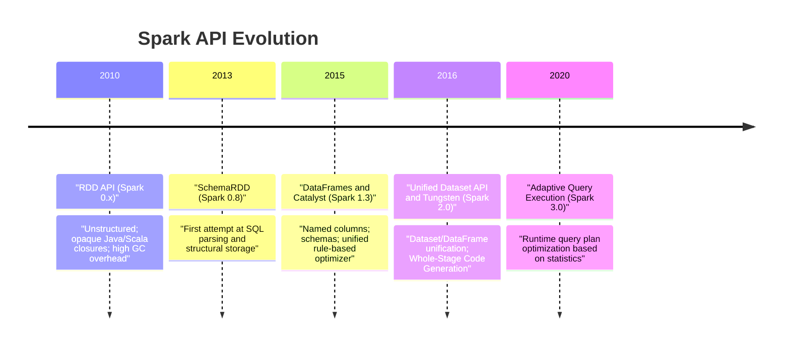
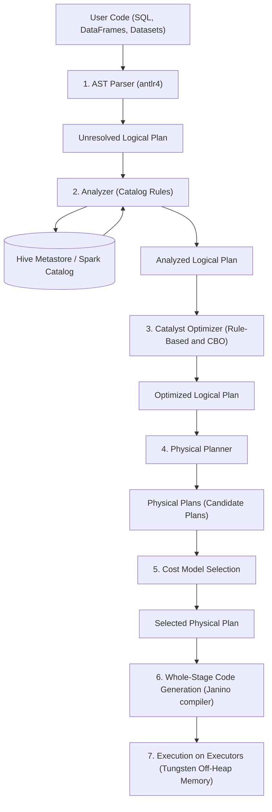
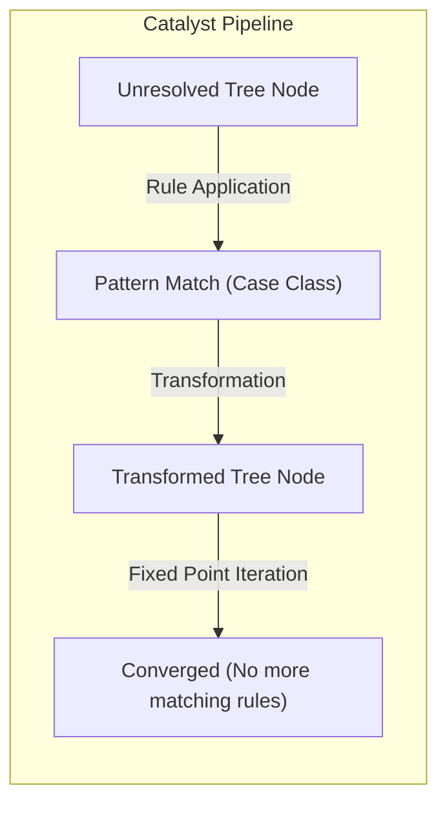
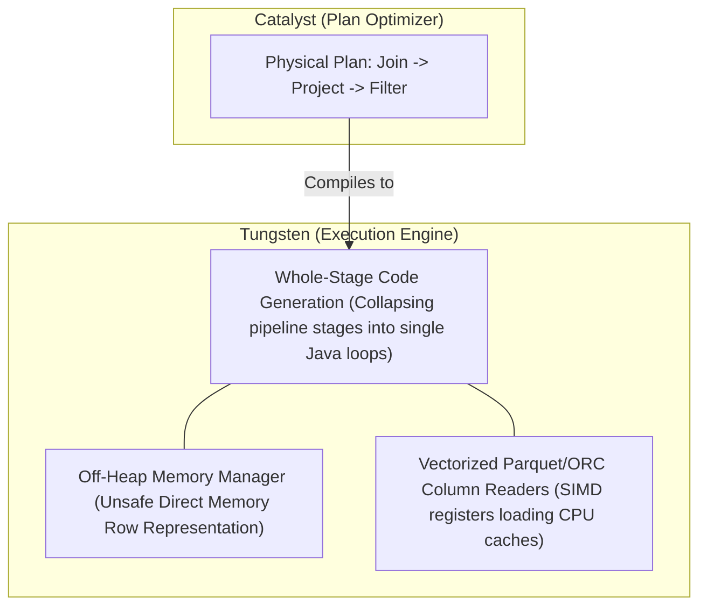
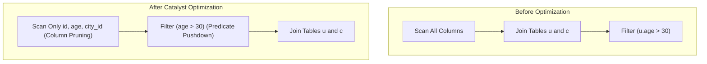
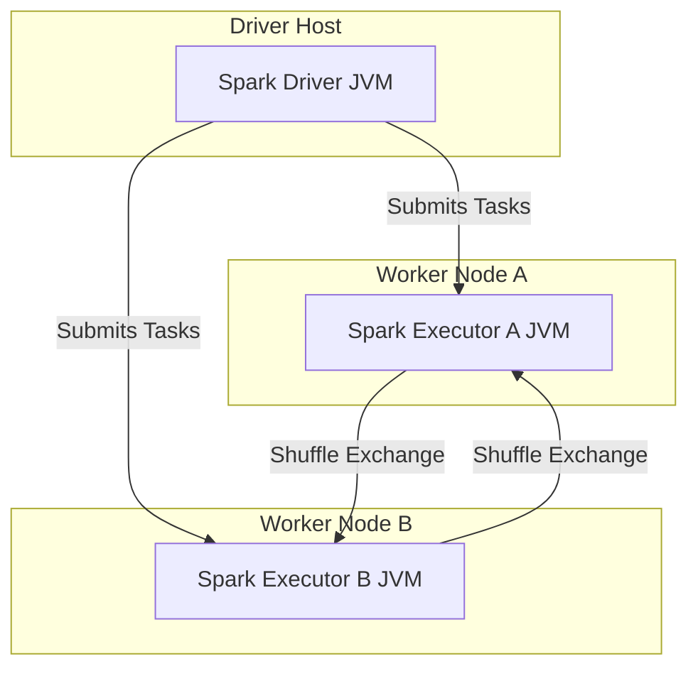

# Day 17: Spark SQL, Catalyst Optimizer & Project Tungsten

Welcome to Day 17 of the **30 Days of Modern Hadoop Ecosystem** series. Today, we are deep-diving into **Spark SQL**, the structured data processing engine of Apache Spark, and its compilation pipelines: the **Catalyst Optimizer** and **Project Tungsten**. We will cover how Spark processes SQL queries from string representation to optimized distributed JVM bytecode executing at hardware limits.

---

## 1. Introduction

### What is Spark SQL?
**Spark SQL** is an Apache Spark module for structured data processing. Unlike the basic Spark RDD API, the interfaces provided by Spark SQL give Spark more information about the structure of both the data and the computation being performed. Internally, Spark SQL uses this extra information to perform extra optimizations.

### Why Spark SQL was Introduced
In early Spark versions, data processing relied on **Resilient Distributed Datasets (RDDs)**. RDDs are highly flexible but suffer from major performance and design drawbacks:
* **Opacity of Logic**: An RDD represents data as arbitrary Java/Python objects and computations as opaque lambda functions (e.g., `.map(lambda x: x[0])`). The Spark engine cannot inspect, reorder, or optimize these functions because it does not know what they do.
* **Serialization Overhead**: Running Python RDD jobs requires constant serialization and deserialization of data between JVM executors and Python worker processes, creating huge CPU bottlenecks.
* **GC Pressure**: Storing JVM objects directly on the heap leads to massive Garbage Collection (GC) pauses as data sizes scale.

### Evolution from RDDs to DataFrames
Spark SQL introduced the **Dataset** and **DataFrame** APIs to solve these issues:
1. **Schema Awareness**: Data is stored in structured tables with defined data types (schemas).
2. **Declarative Queries**: Users specify *what* data they want to compute, rather than *how* to compute it.
3. **Catalyst Optimizer**: A query planner that compiles SQL statements and DataFrame operations into optimized physical DAG execution plans.
4. **Project Tungsten**: A physical execution backend that bypasses standard JVM object creation, managing raw memory off-heap and compiling SQL queries into native JVM bytecode using Whole-Stage Code Generation.



### Where Spark SQL Fits in the Spark Ecosystem
Spark SQL serves as the foundational core for other high-level libraries in the Spark ecosystem:
* **Spark MLlib**: Structured data features are fed directly into ML pipelines via DataFrames.
* **Structured Streaming**: Continuous streams are represented as unbounded tables, running on the same Catalyst engine.
* **Third-Party Connectors**: Data sources (Delta Lake, Iceberg, Apache Hudi, Hive Metastore, Postgres, Elasticsearch) hook directly into Spark SQL's Catalyst planner via the DataSource V2 API.

---

## 2. Problem Statement

### Challenges of Processing Massive Datasets Using Traditional SQL Engines
Traditional single-node SQL databases (like MySQL or PostgreSQL) rely on shared-disk or single-host memory models. They optimize queries assuming low latency between execution threads and storage blocks. In distributed massive data contexts:
1. **Network Bandwidth Bottleneck**: Shuffling gigabytes of data across nodes for joins is extremely expensive. A poor plan can cause cluster network interfaces to saturated.
2. **Lack of Dynamic Stats**: Static query optimizers make decisions based on stale or missing metadata, leading to incorrect join strategies when data changes during runtime execution.
3. **Data Skew**: OOM errors occur when partition values are unevenly distributed across the cluster, overloading individual worker slots.

### Why Distributed SQL Optimization is Difficult
In a distributed environment, query planners must solve a multi-dimensional optimization problem:
* **Data Locality**: Minimizing network shuffles by pushing computations to where the blocks reside.
* **Partition Alignment**: Aligning partitions on join keys to prevent all-to-all partition routing.
* **Heterogeneous Hardware**: Orchestrating tasks on varying cluster topologies.
* **Dynamic Sizing**: Determining whether to broadcast a table or perform a partition sort-merge join when intermediate table sizes are unknown.

### Why Query Optimization is Essential at Scale
Without automated optimization, simple queries can easily trigger cluster-wide failures. For example, joining a 100-row config table with a 10-billion-row transactions table might run a massive Sort-Merge Join (shuffling terabytes of data) instead of broadcasting the 100-row table to all executors (zero shuffle). A 10x to 1000x execution speedup is common when query planners optimize layouts before starting tasks.

---

## 3. Architecture Deep Dive

### Spark SQL Execution Lifecycle
The Catalyst Optimizer compiles user-written SQL or DataFrame code into a physical execution DAG. The following diagram details the sequence:



### Catalyst Optimization Pipeline
Catalyst is written in Scala and relies heavily on **Pattern Matching** on Abstract Syntax Trees (ASTs). Every tree node represents an operation (e.g., `Filter`, `Join`, `Project`). Rules are applied recursively to transform these trees.



### Interaction Between Catalyst and Project Tungsten
While Catalyst designs the mathematical roadmap (logical to physical plans), Project Tungsten manages raw CPU and memory execution.



---

## 4. Internal Working

The Spark SQL execution flow follows seven detailed internal steps:

```
[SQL String] ──① Parser──> [Unresolved Logical Plan] ──② Analyzer (Catalog)──> [Analyzed Logical Plan]
                                                                                      │
[Selected Physical Plan] <──⑤ CBO ── [Physical Plans] <──④ Query Planner ──③ Optimizer Rules
         │
  ⑥ Janino Codegen
         │
[Java Bytecode] ──⑦ Executor JVMs ──> [Tungsten Memory Rows] ──> [Result Aggregation]
```

### Step 1: SQL Parsing
- **Action**: The SQL query string or DataFrame DSL is parsed using an ANTLR4-generated lexer/parser.
- **Output**: An Abstract Syntax Tree (AST) representing the query as an **Unresolved Logical Plan**.
- **State**: The plan contains syntax verification but semantic objects (table names, column names) are unresolved.

### Step 2: Logical Plan Creation & Analysis
- **Action**: The Analyzer resolves relations and attributes by checking them against the **Catalog** (e.g., Hive Metastore, Iceberg Catalog).
- **Checks**: Verifies table existence, column names, compatibility of joined columns, and resolves schemas.
- **Output**: An **Analyzed Logical Plan**.

### Step 3: Rule-Based Optimization
- **Action**: Catalyst applies a set of optimization rules (represented as Scala pattern matches) to the Analyzed Logical Plan.
- **Key Rules**:
  - *Predicate Pushdown*: Pushing filter operations down closer to the data source.
  - *Column Pruning*: Selecting only required columns from the files.
  - *Constant Folding*: Evaluating static math expressions at compile time.
  - *Null Propagation*: Eliminating unreachable code blocks.
- **Output**: An **Optimized Logical Plan**.

### Step 4: Cost-Based Optimization (CBO)
- **Action**: If enabled, CBO compares candidate physical plans using statistical metadata (e.g., table sizes, row counts, histograms) collected in the catalog.
- **Decisions**: Reorders joins to minimize intermediate sizes, and picks join types (e.g., Broadcast Hash vs. Sort-Merge).

### Step 5: Physical Plan Generation
- **Action**: The Query Planner maps the Optimized Logical Plan into one or more candidate Physical Plans using physical operators (e.g., `BroadcastHashJoinExec` instead of a abstract `Join` node).
- **Selection**: A cost model selects the most efficient physical plan.

### Step 6: Whole-Stage Code Generation
- **Action**: The physical plan is compiled into optimized Java bytecode using Janino, an embedded fast Java compiler.
- **Tungsten Pipeline**: Instead of passing tuples between virtual operators, Tungsten generates a single monolithic function containing nested loops that runs directly over raw off-heap memory.

### Step 7: Execution on Executors & Aggregation
- **Action**: The compiled JVM bytecode is distributed to the executor JVM threads.
- **Memory**: Executors process binary data directly in Tungsten off-heap page slots.
- **Aggregation**: Shuffled results are merged in memory on the driver or parent executor nodes.

---

## 5. Core Concepts

Here, we break down each core concept of Spark SQL using the requested **WHY → HOW → INTERNALS → PRODUCTION → TROUBLESHOOTING** framework.

---

### Concept 1: Spark SQL & DataFrames
* **WHY**: Opaque RDD processing was slow, prone to garbage collection overhead, and difficult to optimize because Spark did not know the schema or semantics of the data.
* **HOW**: DataFrames provide a declarative DSL and SQL query compiler over structured rows.
  ```python
  # DataFrame API
  df = spark.read.parquet("/data/users").filter(col("age") > 21).select("name")
  # SQL API
  df = spark.sql("SELECT name FROM users WHERE age > 21")
  ```
* **INTERNALS**: DataFrames are wrapper APIs over Logical Plans. They translate DSL methods (`.select()`, `.filter()`) into tree nodes within the Catalyst AST.
* **PRODUCTION**: Always use DataFrames/SQL instead of RDDs for standard ETL pipelines. This allows Spark to automatically apply optimization rules.
* **TROUBLESHOOTING**: Avoid converting DataFrames back and forth to RDDs (`df.rdd`), as this breaks Catalyst execution limits, bypasses Tungsten memory management, and triggers JVM object serialization.

---

### Concept 2: The Catalyst Optimizer Rules (Predicate Pushdown, Column Pruning, Constant Folding)
* **WHY**: Users write queries that are logical but not optimized for hardware limits (e.g., filtering *after* joining tables, reading all columns when only two are needed).
* **HOW**: Catalyst runs a loop applying transformations to the query tree until it reaches a "fixed point" (where the tree stops changing).
* **INTERNALS**:
  * **Predicate Pushdown**: Moves filters down the plan to minimize partition reads.
    $$\text{Filter}(u.age > 30) \rightarrow \text{Scan}(users, \text{Filter}(age > 30))$$
  * **Column Pruning**: Discards unused columns.
    $$\text{Scan}(users[id, name, age]) \rightarrow \text{Project}(users[id, age])$$
  * **Constant Folding**: Evaluates static values.
    $$1 + 1 \rightarrow 2$$
* **PRODUCTION**: Parquet, ORC, and Delta Lake formats support partition pruning and column statistics natively. Store data in columnar formats to take advantage of Catalyst's pushdown capabilities.
* **TROUBLESHOOTING**: If predicate pushdown is not working (shown as missing `PushedFilters` in `.explain(true)`), make sure you aren't wrapping filter columns in opaque user-defined functions (UDFs). For example, write `col("age") > 30` instead of `my_udf(col("age"))`.



---

### Concept 3: Join Reordering & Cost-Based Optimization (CBO)
* **WHY**: Multi-table joins (e.g., joining 5 tables) can execute in many different orders. An incorrect join order (e.g., joining two large tables first instead of joining small tables first) can cause queries to fail.
* **HOW**: Enable Spark CBO to estimate plan costs using table size and data distribution statistics:
  ```properties
  spark.sql.cbo.enabled   true
  spark.sql.cbo.joinReorder.enabled   true
  ```
* **INTERNALS**: Catalyst compares different join order permutations (e.g., $(A \times B) \times C$ vs $A \times (B \times C)$) and uses database statistics to choose the order that minimizes intermediate table sizes.
* **PRODUCTION**: Run statistic gathering commands on your production tables regularly:
  ```sql
  ANALYZE TABLE users COMPUTE STATISTICS FOR ALL COLUMNS;
  ```
* **TROUBLESHOOTING**: If CBO is enabled but join reordering is not happening, check if column statistics are missing. Run `DESCRIBE EXTENDED users` to verify if statistics are populated.

---

### Concept 4: Adaptive Query Execution (AQE)
* **WHY**: Static plans are built on static table estimates. However, intermediate stages (like aggregations or filters) can change data sizes unpredictably.
* **HOW**: AQE is enabled by default in Spark 3.0+. It splits the physical plan into stages separated by shuffles. Once a stage finishes, Spark uses the actual runtime statistics to optimize the remaining stages.
* **INTERNALS**:
  * **Coalescing Shuffle Partitions**: Reduces the number of shuffle partitions if the output data is small, avoiding task scheduling overhead.
  * **Join Strategy Switching**: Changes a Sort-Merge Join to a Broadcast Hash Join if runtime statistics show the data is smaller than the broadcast threshold.
  * **Skew Join Optimization**: Identifies skewed partitions at runtime and splits them into smaller tasks to prevent stragglers.
* **PRODUCTION**: Ensure AQE is enabled on all cluster workloads:
  ```properties
  spark.sql.adaptive.enabled   true
  spark.sql.adaptive.coalescePartitions.enabled   true
  ```
* **TROUBLESHOOTING**: If AQE is not resolving skew issues, check if the skewed partitions are too small to trigger the skew detection thresholds. Adjust `spark.sql.adaptive.skewJoin.skewedPartitionThresholdInBytes` to a lower value (e.g., 64MB).

---

### Concept 5: Project Tungsten
* **WHY**: JVM objects have high memory overhead (e.g., a 4-byte integer wraps in a 16-byte object header) and trigger frequent, expensive garbage collection pauses when processing terabytes of data.
* **HOW**: Project Tungsten manages memory off-heap using raw binary layouts, bypassing Java object creation entirely.
* **INTERNALS**:
  * **Off-Heap Page Allocator**: Manages memory allocations directly using operating system pointers (`sun.misc.Unsafe`).
  * **Tungsten Binary Format**: Structures records as contiguous byte arrays. Columns are accessed using byte offsets, avoiding object serialization overhead.
* **PRODUCTION**: Enable off-heap memory allocation in your cluster configurations:
  ```properties
  spark.memory.offHeap.enabled   true
  spark.memory.offHeap.size      512m
  ```
* **TROUBLESHOOTING**: If you see executor memory crashes or OOMs when using off-heap configurations, ensure your container memory configurations account for off-heap space:
  $$\text{Container Memory Limit} \ge \text{spark.executor.memory} + \text{spark.memory.offHeap.size} + \text{spark.executor.memoryOverhead}$$

---

### Concept 6: Whole-Stage Code Generation
* **WHY**: Volcano-style query execution engines process tuples one-by-one through multiple nested function calls (e.g., `next()` calls between filter, project, and join operators), which wastes CPU cycles and fills registers with instruction overhead.
* **HOW**: Spark SQL compiles execution plan paths into single Java functions that run over data arrays.
* **INTERNALS**: Spark generates Java source code at runtime using the Janino compiler, flattening operator boundaries:
  ```java
  // Concept representation of Whole-Stage Codegen generated loop
  while (rows.hasNext()) {
      Row r = rows.next();
      if (r.getInt(1) > 30) { // Filter
          int result = r.getInt(0) * 10; // Project
          output.append(result);
      }
  }
  ```
* **PRODUCTION**: Ensure codegen is enabled (default is true):
  ```properties
  spark.sql.codegen.wholeStage   true
  ```
* **TROUBLESHOOTING**: Check the physical plan in the Spark Web UI. Shaded light-blue boxes (labeled `*` next to operator names) indicate that Whole-Stage Code Generation is active for that part of the query.

---

## 6. Production Engineering

### Join Optimization Strategies

| Join Strategy | Spark Operator | Shuffle Required? | Sort Required? | Use Case |
| :--- | :--- | :--- | :--- | :--- |
| **Broadcast Hash Join (BHJ)** | `BroadcastHashJoinExec` | No (Broadcasts small table) | No | One table is small (e.g., <10MB). Best performance. |
| **Sort-Merge Join (SMJ)** | `SortMergeJoinExec` | Yes (Hash partition shuffle) | Yes | Large-to-large table joins. Scalable, stable. |
| **Shuffle Hash Join (SHJ)** | `ShuffledHashJoinExec` | Yes (Hash partition shuffle) | No | Large-to-medium tables where sorting is expensive. |

```properties
# Tune Broadcast Join Threshold (Default 10MB)
spark.sql.autoBroadcastJoinThreshold   10485760
```

### Partition Pruning
- **Static Partition Pruning**: The query filter contains partition columns directly. Spark only scans files in matching partition directories.
- **Dynamic Partition Pruning (DPP)**: Applied in star-schema queries (joining a large fact table with a filtered dimension table). Spark injects the list of matching keys resolved from the dimension query into the fact table scanner at runtime to skip reading unnecessary partitions.

### Bucketing
Pre-sorting and partitioning tables by key (e.g., `user_id`) avoids expensive shuffles and sorts when joining or aggregating these tables later:
```python
df.write.bucketBy(10, "user_id").sortBy("user_id").saveAsTable("bucketed_users")
```

### Memory Tuning Settings
* `spark.sql.shuffle.partitions`: Sets the number of partitions to use when shuffling data for joins or aggregations. The default is 200, which is too high for small local jobs (creates scheduling overhead) and too low for multi-terabyte production jobs (results in large partitions that can crash executors).
* `spark.sql.adaptive.coalescePartitions.enabled`: Set to `true` to allow AQE to automatically merge small shuffle partitions at runtime.

---

## 7. Hands-On Lab

Refer to [lab-guide.md](file:///d:/30_Days_of_Modern_Hadoop_Ecosystem/Day-17-Spark-SQL-Catalyst/labs/lab-guide.md) for full step-by-step instructions.

### Core Commands Summary:

1. **Submit PySpark demo**:
   ```bash
   python3 /workspace/source/SparkSqlDemo.py
   ```
2. **Inspect Spark SQL plans using the Python CLI**:
   ```python
   # Start PySpark Shell
   pyspark
   ```
   ```python
   # Inside PySpark shell:
   df = spark.sql("SELECT 1+1")
   df.explain(True)
   ```
3. **Execute SQL queries directly**:
   ```bash
   /opt/spark/bin/spark-sql --master spark://spark-master:7077 \
     -e "SELECT city_name, count(*) FROM cities GROUP BY city_name"
   ```

---

## 8. Build From Source

### Official Repository
Apache Spark source code is hosted on GitHub: [https://github.com/apache/spark](https://github.com/apache/spark)

### SQL Module Directory Structure
```text
spark/
├── sql/
│   ├── catalyst/         # Core rules, parser, analyzer, physical planner APIs
│   ├── core/             # Execution framework, codegen backend, catalog services
│   ├── hive/             # Hive Metastore interfaces and execution capabilities
│   └── hive-thriftserver # JDBC/ODBC Thrift interfaces
```

### Compilation Prerequisites
Ensure the host machine has JDK 8 or 11 and Maven (3.8.x+) installed.

### Compilation Command
Compile Spark with support for Hadoop 3 and Hive integration using Maven:
```bash
./build/mvn -Pyarn -Phive -Phive-thriftserver -DskipTests clean package
```
For faster compilation during development, compile only the SQL module:
```bash
./build/mvn -pl sql/core -am -DskipTests clean package
```

### Common Build Failures
* **JVM OutOfMemoryError**: The compiler ran out of memory. Increase Maven memory limits:
  ```bash
  export MAVEN_OPTS="-Xmx2g -XX:ReservedCodeCacheSize=512m"
  ```
* **Dependency Resolution Failures**: Build with `-Pyarn` or verify your maven settings to ensure correct proxy permissions.

---

## 9. Docker Deployment

The Day 17 cluster environment is defined by three files:
* **Dockerfile**: [Dockerfile](file:///d:/30_Days_of_Modern_Hadoop_Ecosystem/Day-17-Spark-SQL-Catalyst/docker/Dockerfile)
* **docker-compose.yml**: [docker-compose.yml](file:///d:/30_Days_of_Modern_Hadoop_Ecosystem/Day-17-Spark-SQL-Catalyst/docker/docker-compose.yml)
* **bootstrap.sh**: [bootstrap.sh](file:///d:/30_Days_of_Modern_Hadoop_Ecosystem/Day-17-Spark-SQL-Catalyst/docker/bootstrap.sh)

To launch the environment:
```bash
cd /workspace/Day-17-Spark-SQL-Catalyst/docker
docker-compose up -d
```

---

## 10. Local Cluster Deployment

### Single-Node Spark Deployment
You can run a local Spark session on a single node by setting the master URL to `local[*]`. Spark will run the driver and executors in the same JVM, utilizing all available CPU cores:
```python
from pyspark.sql import SparkSession
spark = SparkSession.builder.master("local[*]").getOrCreate()
```

### Multi-Node Cluster Configuration
In a production deployment, Spark runs in a distributed cluster managed by a resource manager like YARN, Kubernetes, or Spark Standalone. The driver communicates with worker nodes to allocate executors and execute tasks in parallel:



---

## 11. Validation

Execute the validation suite inside the client container to verify Spark SQL:
```bash
cd /workspace/scripts
./verify-spark-sql.sh
./verify-catalyst.sh
./verify-aqe.sh
./verify-query-plan.sh
```

### Expected Output Summary
```text
=== 🔍 STEP 1: Probing Spark Standalone Master UI ===
✅ Success: Spark Standalone Master UI is online.
=== 🔍 STEP 2: Running a Test Query with Spark SQL CLI ===
...
✅ Success: Spark SQL engine executed the test query successfully.
=== 🎉 Spark SQL Engine Verified Successfully! ===
```

---

## 12. Production Troubleshooting Playbook

Refer to [troubleshooting-guide.md](file:///d:/30_Days_of_Modern_Hadoop_Ecosystem/Day-17-Spark-SQL-Catalyst/troubleshooting/troubleshooting-guide.md) for detailed recovery plans.

### Troubleshooting Cheat Sheet:
* **OutOfMemoryError: Java heap space**: Disable broadcast joins or increase executor memory limits.
* **Straggler Tasks**: Verify if data skew is present, and enable AQE skew join optimizations.
* **Slow Parquet Scans**: Verify that filter predicates are being pushed down to the file scan level by checking the query's physical plan.

---

## 13. Real-World Case Studies

### Case Study 1: Netflix Data Warehousing
- **Use Case**: Ad-hoc analytics and interactive reporting across petabyte-scale data lakes.
- **Why Spark SQL**: Netflix migrated from MapReduce/Hive to Spark SQL to decrease query latencies.
- **How**: They leverage Spark SQL with Iceberg tables to implement partition pruning and column statistics, enabling fast query planning on data lakes.

### Case Study 2: Uber Interactive Analytics
- **Use Case**: Real-time marketplace analysis and processing millions of GPS event coordinates.
- **Why Spark SQL**: Uber requires sub-minute latency queries over streaming Hudi tables.
- **How**: They use Spark SQL with Project Tungsten off-heap allocations, bypassing garbage collection pauses to achieve low query latencies.

---

## 14. Interview Questions

### Q1: What is the difference between an Unresolved Logical Plan and an Analyzed Logical Plan?
**Answer**:
An *Unresolved Logical Plan* is created directly from query parsing (AST). It contains syntactically valid operations but does not know if table and column names exist, or what their data types are.
An *Analyzed Logical Plan* is generated after the Analyzer runs. The Analyzer checks table and column names against the **Catalog**, resolving column locations and data types.

### Q2: How does Broadcast Hash Join work, and why does it improve performance?
**Answer**:
A Broadcast Hash Join (BHJ) copies the small table to the memory of all executor nodes, bypassing the expensive shuffle phase. During execution, Spark builds a hash table in memory from the small dataset and scans the large dataset, performing joins locally in each partition thread.

### Q3: What is Whole-Stage Code Generation?
**Answer**:
Whole-Stage Code Generation collapses the physical query execution plan into a single Java function at runtime, removing virtual function call overhead (Volcano Iterator model) and compiling the operations into optimized bytecode.

---

## 15. Key Takeaways
* **Spark SQL** provides structure to data, enabling optimization opportunities that are not possible with RDDs.
* The **Catalyst Optimizer** translates queries into optimized physical execution plans by applying rules recursively.
* **Project Tungsten** manages memory off-heap, bypassing JVM garbage collection and compiling queries to native JVM bytecode.
* **Adaptive Query Execution (AQE)** optimizes query plans at runtime based on intermediate execution statistics.

---

## 16. References
* [Apache Spark SQL Documentation](https://spark.apache.org/docs/latest/sql-programming-guide.html)
* [Spark GitHub Repository](https://github.com/apache/spark)
* [Spark SQL Catalyst Design Whitepaper](https://people.csail.mit.edu/matei/papers/2015/sigmod_spark_sql.pdf)
* [Project Tungsten Technical Blog](https://www.databricks.com/blog/2015/04/28/introducing-project-tungsten.html)
