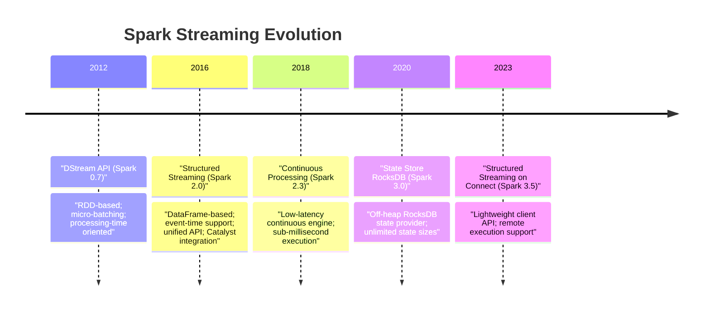
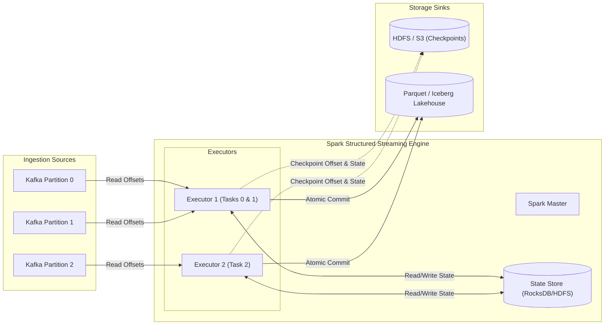
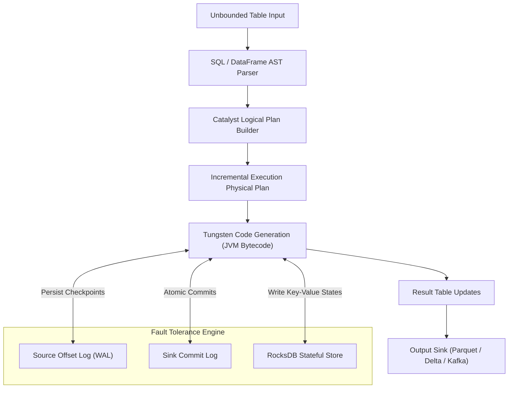
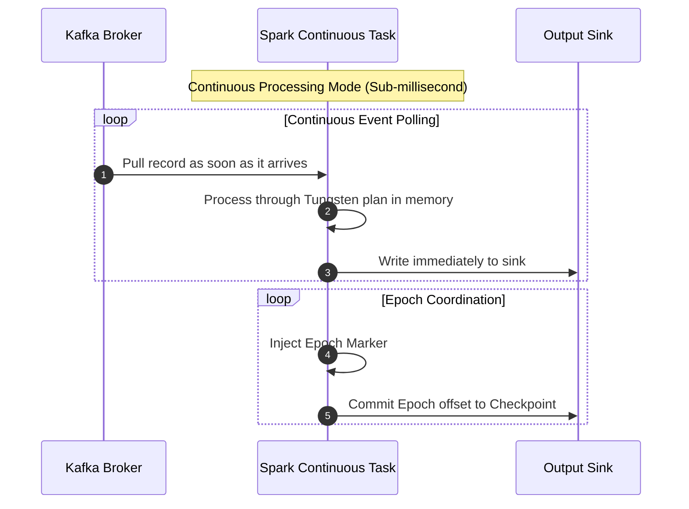
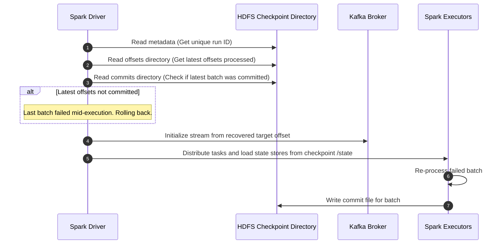

# Day 18: Spark Structured Streaming & Stateful Stream Processing

Welcome to Day 18 of the **30 Days of Modern Hadoop Ecosystem** series. Today, we are deep-diving into **Spark Structured Streaming**, the production-grade, state-of-the-art stream processing engine built on top of the Spark SQL Catalyst and Tungsten execution engines. We will learn how Spark processes continuous data flows using declarative APIs, ensures exactly-once semantics, manages distributed state, and scales to high-throughput production requirements.

---

## 1. Introduction

### What is Structured Streaming?
**Spark Structured Streaming** is a scalable and fault-tolerant stream processing engine built on the Spark SQL library. It allows you to express your streaming computations the same way you would express batch computations on static data. The Spark SQL engine handles running the query incrementally and continuously updating the result as new data arrives.

### Evolution from Spark Streaming (DStreams)
Before Spark 2.0, streaming in Spark was built on **Discretized Streams (DStreams)**. DStreams were a major step forward but suffered from significant architectural and functional limits:

| Feature | Legacy Spark Streaming (DStreams) | Modern Structured Streaming |
| :--- | :--- | :--- |
| **API Foundation** | Low-level RDD API. | High-level DataFrame and Dataset APIs. |
| **Time Semantics** | Processing time only (when Spark received the data). | Native Event-time support with Watermarking. |
| **Optimization** | Opaque lambda logic; no optimizer optimization. | Fully optimized by the Catalyst Optimizer and Project Tungsten. |
| **Stateful Operations** | Manual, error-prone (`updateStateByKey`). | Declarative state management, automatic checkpointing. |
| **Guarantees** | At-least-once (exactly-once required custom code). | End-to-end exactly-once guarantees. |
| **Execution Engine** | Micro-batch only. | Micro-batch and Continuous Processing (sub-millisecond). |



### Why Structured Streaming was Introduced
Structured Streaming was introduced to close the gap between batch and stream processing. In legacy architectures, developers had to build "Lambda Architectures"—writing one set of logic for batch processing (e.g., using Spark SQL) and another set of logic for real-time streaming (e.g., using Storm or DStreams). Structured Streaming unifies these pipelines: **a single SQL query can run as a weekly batch or a millisecond-latency stream with zero code changes.**

### Where it Fits in the Modern Data Platform
Structured Streaming is the core ingestion and transformation engine of the **Lakehouse Architecture (Medallion Architecture)**. It continuously pulls raw events from message queues (like Kafka or Pulsar), cleanses and writes them into raw tables (Bronze), performs stateful transformations and windowed aggregates to build structured tables (Silver), and aggregates them into gold business intelligence views (Gold) using transaction protocols like Delta Lake or Apache Iceberg.

---

## 2. Problem Statement

### Why Batch Processing is Insufficient for Real-Time Systems
Batch processing is designed for bounded, historical data. In modern enterprise applications (such as fraud detection, IoT monitoring, and clickstream analytics), waiting hours or days for data processing is unacceptable. Batch pipelines:
1. **Introduce High Latency**: Business decisions are delayed by hours or days.
2. **Exhaust Resources in Spikes**: Processing huge batches requires scaling clusters to massive peaks, leaving nodes idle between runs.
3. **Lack Stream Concept**: Batch engines cannot handle infinite, unbounded data sources without manual file chunking.

### Challenges of Stream Processing
Processing continuous streams introduces unique, complex distributed computing challenges:
- **Data Loss and Duplicates**: Nodes, networks, and storage fail. Ensuring that every record is processed exactly once (neither lost nor repeated) requires complex consensus and commit protocols.
- **Out-of-Order and Late Data**: Because of network delays or offline mobile devices, events may arrive hours after they occur. The system must merge late data into already computed aggregates.
- **State Size Management**: Aggregating data over sliding windows requires saving historical data (state) in memory. Without garbage-collection or watermark eviction, state size grows indefinitely and triggers Out-Of-Memory (OOM) crashes.

### Why Traditional Streaming Systems are Difficult to Manage
Early streaming systems (such as Apache Storm) operated on a low-level record-by-record processing model. Developers had to manually manage thread pools, construct custom DAG topologies, handle backpressure, and write complex checkpointing logic. They lacked standard optimization planners (like Catalyst) and required manual re-partitioning when volume fluctuated, making production maintenance highly complex.

---

## 3. Architecture Deep Dive

To understand how Spark Structured Streaming achieves high throughput and fault tolerance, we inspect its architectural components.

### 1. Data Ingestion Pipeline (Kafka → Spark → Storage)
This diagram shows the topology of a real-time analytics system:



### 2. Structured Streaming Engine Internals
Internally, Structured Streaming models the stream as an **Unbounded Table**. Every new event is appended as a row to the table. The query planner compiles the logical query into incremental execution plans.



### 3. Micro-Batch vs. Continuous Processing Execution
Spark supports two execution modes: Micro-Batch (default, high throughput, 10-100ms latency) and Continuous Processing (experimental, low latency, sub-millisecond, at-least-once).

```mermaid
gantt
    title Micro-Batch Execution Flow
    dateFormat  ss
    axisFormat %S
    section Micro-Batch 1
    Get Kafka Offsets :active, b1_offsets, 00, 02
    Submit Tasks to Executors: b1_exec, 02, 05
    Aggregate & Write to Sink: b1_sink, 05, 08
    Commit Batch 1 : b1_commit, 08, 10
    section Micro-Batch 2
    Get Kafka Offsets :active, b2_offsets, 10, 12
    Submit Tasks to Executors: b2_exec, 12, 15
    Aggregate & Write to Sink: b2_sink, 15, 18
    Commit Batch 2 : b2_commit, 18, 20
```





### 4. Checkpoint Recovery Sequence
When a query fails or is restarted, Spark recovers its exact state using the checkpoint directory:



---

## 4. Internal Working

Spark Structured Streaming processes continuous events through 8 detailed, execution-level steps:

```
[Kafka Ingestion] ──① Get Offsets──> [Write Offset WAL] ──② Trigger Batch──> [Task Compilation]
                                                                                   │
[Atomic Sink Write] <──⑦ State Sync ── [RocksDB Updates] <──⑤ Catalyst Physical ──④ Task Distribution
         │
 ⑧ Commit Batch Log ──> [HDFS checkpoint/commits]
```

1. **Kafka Event Ingestion**: The streaming query starts. The driver queries the Kafka broker to retrieve the latest available offsets for the subscribed topics.
2. **Source Offset Tracking (WAL)**: Before processing data, the driver writes the target start/end offsets to the write-ahead log (WAL) in the HDFS checkpoint directory (`/offsets/`). This guarantees that Spark knows exactly which offsets it intended to process, even if the driver crashes immediately after.
3. **Micro-batch Creation**: The driver groups the records between the start and end offsets into a logical micro-batch. It creates tasks corresponding to the Kafka partitions.
4. **Task Compilation & Optimization**: The Catalyst Optimizer compiles the query logical plan. If the batch involves stateful transformations, it injects stateful physical operators (`StateStoreRestoreExec` and `StateStoreSaveExec`). Whole-Stage Code Generation translates this into JVM bytecode.
5. **Query Execution & Task Distribution**: The driver schedules tasks on executors. Executors read records from Kafka partitions using the specific offsets assigned.
6. **State Updates**: If aggregating (e.g. counting events by window), executors retrieve previous state keys from their local **RocksDB State Store**. They update the state with new records and write the updated key-value states back to RocksDB.
7. **Checkpoint Persistence**: Once all task executions finish, state store updates are synchronized to HDFS (`/state/`).
8. **Sink Writes & Commits**: The executor tasks write the results to the output sink (e.g., Parquet file system). Once the sink successfully writes the data, the driver writes a commit file to the checkpoint directory (`/commits/`). This completes the micro-batch query lifecycle.

---

## 5. Core Concepts

Here, we break down each core concept of Spark Structured Streaming using the requested **WHY → HOW → INTERNALS → PRODUCTION → TROUBLESHOOTING** framework.

---

### Concept 1: Unbounded Tables
* **WHY**: Modeling streaming data as discrete chunks makes code maintenance complex and prevents developers from reusing standard batch SQL scripts.
* **HOW**: Spark Structured Streaming treats the incoming data stream as an infinite, constantly growing table. New data is appended as rows to this "unbounded table".
* **INTERNALS**: In the logical plan, the source is represented as a `StreamingRelation`. Spark runs an incremental query plan that only executes operations on the *newly added* rows of the unbounded table, updating the final result table.
* **PRODUCTION**: Never treat streaming tables as static tables in memory. Use appropriate output modes and sinks to handle the continuous updates.
* **TROUBLESHOOTING**: Avoid operations that require reading the entire unbounded table (like global sorting without windows) as they are physically impossible or highly expensive to run in a continuous streaming context.

---

### Concept 2: Micro-Batches vs. Continuous Processing
* **WHY**: Micro-batching introduces a processing latency of 10ms to 100ms. Some applications (like high-frequency trading or security alert ingestion) require sub-millisecond latencies.
* **HOW**: You can switch between Micro-batch and Continuous processing by modifying the trigger configuration:
  ```python
  # Micro-batch Trigger (default)
  query = df.writeStream.trigger(processingTime="10 seconds").start()

  # Continuous Trigger (sub-millisecond latency)
  query = df.writeStream.trigger(continuous="1 second").start()
  ```
* **INTERNALS**:
  * **Micro-Batch**: Spark queries offsets, compiles a query plan, launches a batch job, writes checkpoints, and commits.
  * **Continuous Processing**: Spark launches long-running tasks on executors that continuously poll Kafka. Epoch markers are periodically sent down the stream to coordinate checkpoints without stopping the tasks.
* **PRODUCTION**: Use Continuous processing *only* if sub-millisecond latency is a hard requirement. It supports only a subset of SQL operations (no stateful aggregations, joins, or watermarks) and guarantees at-least-once (not exactly-once) delivery.
* **TROUBLESHOOTING**: If a continuous query fails, ensure you check that your code does not contain unsupported operations like `groupBy` or `window`.

---

### Concept 3: Event Time vs. Processing Time
* **WHY**: In real-world networks, events are delayed. If you aggregate data using the time Spark receives the record (Processing Time), your metrics will be inaccurate because delayed events are grouped into the wrong intervals.
* **HOW**: Always define your windows and aggregations using the timestamp embedded inside the source record itself (Event Time).
  ```python
  # Grouping by event_time (column from Kafka payload)
  df.groupBy(window(col("event_time"), "1 hour")).count()
  ```
* **INTERNALS**: Spark tracks the column specified as event-time and stores the event timestamps inside the state store, matching events to their correct historical windows.
* **PRODUCTION**: Ensure the event time timestamp format is correctly parsed (e.g. ISO 8601) and handles timezones correctly to avoid shifting data into incorrect windows.
* **TROUBLESHOOTING**: If you see data grouped in dates matching the job start time rather than when events occurred, verify you are not accidentally using Spark's `current_timestamp()` instead of the event payload timestamp.

---

### Concept 4: Watermarks
* **WHY**: Stateful aggregation requires keeping historical windows in memory. Without cleanup, state memory will grow infinitely, eventually causing executor OOM crashes.
* **HOW**: Declare a watermark specifying how long Spark should wait for late-arriving data:
  ```python
  # Wait for late data up to 10 minutes; discard anything older
  df.withWatermark("event_time", "10 minutes") \
    .groupBy(window(col("event_time"), "10 minutes"), col("action")) \
    .count()
  ```
* **INTERNALS**: Spark tracks the maximum event time seen so far. The watermark boundary is calculated as:
  $$\text{Watermark} = \max(\text{EventTime}) - \text{LateThreshold}$$
  State store keys belonging to windows older than the watermark boundary are permanently deleted during the `StateStoreSaveExec` step of the physical plan execution.
* **PRODUCTION**: Set the watermark duration based on your network characteristics. Too short will discard valid late data; too long will increase state store sizes.
* **TROUBLESHOOTING**: In **Append** output mode, window results are only written to the sink *after* the watermark passes the window end time. If your sink is empty, ensure new records with newer timestamps are arriving to advance the watermark.

---

### Concept 5: Stateful processing (Checkpointing & State Stores)
* **WHY**: Operations like running counts, windowed joins, and deduplication require keeping intermediate data (state) across micro-batches. If an executor restarts, this state must be recovered.
* **HOW**: Spark manages state automatically. You must specify a checkpoint directory on a reliable storage layer (like HDFS or S3):
  ```python
  query = df.writeStream \
      .format("parquet") \
      .option("checkpointLocation", "hdfs://namenode:9000/checkpoints/") \
      .start()
  ```
* **INTERNALS**: Spark provides two State Store providers:
  1. `HDFSBackedStateStoreProvider` (Default): Stores state data in JVM heap memory. Periodically flushes delta files to HDFS.
  2. `RocksDBStateStoreProvider`: Stores state keys in an embedded, off-heap RocksDB database on local executor disks, synchronizing backups to HDFS.
* **PRODUCTION**: For any production job with state keys exceeding 1 million (e.g., user session tracking), always configure the off-heap RocksDB state store:
  ```properties
  spark.sql.streaming.stateStore.providerClass   org.apache.spark.sql.execution.streaming.state.RocksDBStateStoreProvider
  ```
* **TROUBLESHOOTING**: Avoid changing the schema of stateful queries (like modifying columns in a `groupBy` clause) between restarts, as the state store schema will mismatch, causing checkpoint initialization failures.

---

### Concept 6: Output Modes
* **WHY**: Different storage backends require different write models. A file system (like Parquet) can only append data, whereas a database (like MySQL) or Key-Value store needs updates.
* **HOW**: Set the output mode in the stream writer:
  ```python
  # Options: "append", "update", "complete"
  query = df.writeStream.outputMode("append").start()
  ```
* **INTERNALS**:
  * **Append**: Only new rows added to the result table since the last batch are written to the sink. (Compatible with file sinks when using watermarks).
  * **Update**: Only the rows in the result table that were modified since the last batch are written. (Compatible with database/console sinks).
  * **Complete**: The entire result table is written to the sink on every micro-batch. (Only compatible with aggregations).
* **PRODUCTION**: For file system sinks (Parquet, ORC, CSV), always use **Append** mode.
* **TROUBLESHOOTING**: If you try to write a stateful query to Parquet in `Update` mode, the query will fail immediately with: `Queries with streaming sources must be executed with writeStream.start() ... Update output mode not supported`.

---

## 6. Production Engineering

Running Spark Structured Streaming in a production cluster requires tuning configurations to ensure latency, throughput, and stability.

### Checkpoint Location Best Practices
- **Never Share Paths**: Every streaming query must have its own unique checkpoint path (e.g., `hdfs:///checkpoints/job_clickstream/`). Sharing paths causes metadata corruption.
- **Storage Reliability**: Use highly available storage (like HDFS, Amazon S3 with strong consistency, or Azure ADLS).
- **Cleanup Policies**: Checkpoints generate many small metadata files. Configure lifecycle rules on S3/HDFS to clean up old, unneeded commit/offset logs if your Spark version doesn't clean them automatically.

### Kafka Partition Sizing & Parallelism
- **1-to-1 Mapping**: Spark's Kafka source maps 1 Spark task to 1 Kafka partition.
- **Partition Calculation**: Calculate partition counts based on target throughput:
  $$\text{Partitions} = \frac{\text{Target Throughput (MB/s)}}{\text{Single partition read capacity (e.g., 5-10 MB/s)}}$$
- **Avoid Over-partitioning**: Having 1000 partitions for a 10KB/s stream generates excessive task scheduling overhead.

### RocksDB State Store Settings
To handle large states without JVM garbage collection issues, apply the following properties in `spark-defaults.conf`:
```properties
spark.sql.streaming.stateStore.providerClass   org.apache.spark.sql.execution.streaming.state.RocksDBStateStoreProvider
# Enable off-heap memory allocation for RocksDB
spark.memory.offHeap.enabled                    true
spark.memory.offHeap.size                       1g
```

### Backpressure and Flow Control
To prevent Spark from crashing during ingestion spikes (e.g. after a system outage when Kafka has accumulated millions of backlogged events), configure rate limits:
```properties
# Enable dynamic backpressure
spark.streaming.backpressure.enabled                 true
# Restrict the maximum offsets fetched per partition in a single micro-batch
spark.sql.streaming.kafka.maxOffsetsPerTrigger       10000
```

### Monitoring via Spark UI
Open the Spark Web UI (port 4040/8080) and click the **Structured Streaming** tab to monitor:
- **Input Rate**: The speed at which data is read from Kafka.
- **Process Rate**: The speed at which Spark processes data.
- **Watermark Delay**: Check if the watermark is advancing as expected.
- **State Store Metrics**: Memory size, number of active keys, and state updates per batch.

---

## 7. Hands-On Lab: Real-Time Clickstream Aggregator

In this lab, we will build, deploy, and validate a complete real-time clickstream aggregation pipeline using Kafka, PySpark, and HDFS.

### Step 1: Start the Cluster Environment
Navigate to the docker directory and start the compose stack:
```bash
cd d:/30_Days_of_Modern_Hadoop_Ecosystem/Day-18-Spark-Structured-Streaming/docker
docker-compose up -d
```
Wait for all services to pass their health checks. You can verify this by running:
```bash
docker ps
```

### Step 2: Access the Spark Client Container
All validation, Kafka interactions, and job submissions are executed from the `spark-client` container gateway:
```bash
docker exec -it spark-client-day18 bash
```

### Step 3: Run the Kafka Verification and Producer Script
Run the pre-configured script to create the topic and publish test logs to Kafka:
```bash
/workspace/scripts/verify-kafka.sh
```
*Expected Output:*
```text
Checking Kafka broker connectivity at kafka:29092...
[✓] Kafka broker is online.
Creating Kafka topic 'clickstream'...
[✓] Topic 'clickstream' created successfully.
Producing sample clickstream messages...
[✓] Pushed 5 test clickstream records to topic 'clickstream'.
```

### Step 4: Submit the Streaming Application
Submit the PySpark application to the cluster:
```bash
spark-submit \
  --master spark://spark-master:7077 \
  --packages org.apache.spark:spark-sql-kafka-0-10_2.12:3.5.1 \
  /workspace/source/StreamingApp.py
```
*(The job will start and print out incoming data batches to the console in Update mode, while writing Parquet records to HDFS in Append mode).*

### Step 5: Open a Second Terminal to Verify Checkpoints & Outputs
Open another terminal to access the client container and run our verification scripts:
```bash
docker exec -it spark-client-day18 bash
```

#### 1. Verify that Checkpoints are created on HDFS:
```bash
/workspace/scripts/verify-checkpoints.sh
```
*Expected Output:*
```text
Checking Spark checkpoint directories on HDFS at: hdfs://namenode:9000/tmp/spark-checkpoints/clickstream
[✓] Checkpoint directory found.
Inspecting Structured Streaming checkpoint subdirectories:
  - /metadata : [✓] Found. (Query Metadata containing the globally unique Run ID)
  - /offsets : [✓] Found. (Source offsets corresponding to each micro-batch (wal))
  - /commits : [✓] Found. (Offsets committed by sinks; indicates processed batches)
  - /state : [✓] Found. (Stateful store snapshots containing aggregated intermediate data)
```

#### 2. Verify Offset Progress:
```bash
/workspace/scripts/verify-offsets.sh
```
*Expected Output:*
```text
Checking Spark Structured Streaming offset logs on HDFS at: hdfs://namenode:9000/tmp/spark-checkpoints/clickstream/offsets
Recent streaming micro-batches logged:
  - Batch ID: 0
  - Batch ID: 1
--------------------------------------------------------
Displaying offset details for the latest batch (Batch ID: 1):
v1
{"batchWatermarkMs":0,"batchTimestampMs":1720548120000,"conf":{...}}
{"clickstream":{"2":2,"1":1,"0":2}}
--------------------------------------------------------
[✓] Offsets are actively progressing and recorded.
```

#### 3. Produce More Data to Advance the Watermark
Because the Parquet sink uses **Append** mode, data is only written once the watermark advances past the window end.
In your second bash terminal, push events with newer timestamps to advance the watermark:
```bash
kafka-console-producer.sh --bootstrap-server kafka:29092 --topic clickstream
```
Paste these events (with future timestamps relative to the initial events) to advance the streaming timeline:
```json
{"event_time": "2026-07-09T18:25:00Z", "user_id": "usr-105", "action": "click", "page": "homepage"}
{"event_time": "2026-07-09T18:30:00Z", "user_id": "usr-106", "action": "click", "page": "homepage"}
```

#### 4. Run the Output Windowing Validation Script:
```bash
/workspace/scripts/verify-windowing.sh
```
*Expected Output:*
```text
Checking streaming Parquet outputs on HDFS at: hdfs://namenode:9000/tmp/spark-outputs/clickstream
[✓] Output files found in storage:
hdfs://namenode:9000/tmp/spark-outputs/clickstream/part-00000-...parquet
--------------------------------------------------------
Reading written Parquet files via Spark Session to verify schema and data:
+-------------------+-------------------+------+-----+-------------------+
|window_start       |window_end         |action|count|processed_time     |
+-------------------+-------------------+------+-----+-------------------+
|2026-07-09 17:55:00|2026-07-09 18:05:00|click |2    |2026-07-09 18:06:12|
|2026-07-09 18:00:00|2026-07-09 18:10:00|view  |1    |2026-07-09 18:11:05|
+-------------------+-------------------+------+-----+-------------------+
[✓] Validation complete.
```

### Step 6: Cleanup
Exit the client container and stop the docker containers:
```bash
exit
docker-compose down -v
```

---

## 8. Build From Source

### Official Apache Spark GitHub Repository
The core Spark codebase is open source and hosted on GitHub:
- URL: [https://github.com/apache/spark](https://github.com/apache/spark)

### Structured Streaming Module Layout
The Structured Streaming engine is located inside the `sql/core` module:
- **Base Execution**: [sql/core/src/main/scala/org/apache/spark/sql/execution/streaming/](https://github.com/apache/spark/blob/master/sql/core/src/main/scala/org/apache/spark/sql/execution/streaming/)
  - `MicroBatchExecution.scala`: Controls the driver-side micro-batch loop execution.
  - `ContinuousExecution.scala`: Coordinates continuous execution mode tasks.
  - `StateStore.scala`: Core interface for managing state stores.
  - `WatermarkTracker.scala`: Tracks event time watermarks.
- **Kafka Integration**: [connector/kafka-0-10-sql/](https://github.com/apache/spark/blob/master/connector/kafka-0-10-sql/)
  - Source and sink implementations specifically for Apache Kafka.

### Build and Compilation Process
To compile Spark from source with support for Hadoop and Kafka integration, build using Maven or SBT:
```bash
# Clone the repository
git clone https://github.com/apache/spark.git
cd spark

# Build Spark using Maven with Kafka support and SQL modules
# -Phadoop-3: Enable Hadoop 3.x profiles
# -Pkubernetes: Include Kubernetes support
./build/mvn -Pyarn -Phadoop-3 -Phive -Phive-thriftserver -DskipTests clean package
```

### Running Locally
To test your build locally, run the Spark shell pointing to the Kafka package:
```bash
./bin/spark-shell --packages org.apache.spark:spark-sql-kafka-0-10_2.12:3.5.1
```

### Common Build Failures
1. **Out of Memory during Compilation**: Scala compilation requires significant memory.
   * *Fix*: Set MAVEN_OPTS: `export MAVEN_OPTS="-Xss64m -Xmx4g -XX:ReservedCodeCacheSize=1g"`
2. **Missing Developer Profiles**: Failing to specify `-Phadoop-3` when compiling can cause class definition errors at runtime when running on modern Hadoop environments.

---

## 9. Docker Deployment

The environment runs on Docker. The configuration files are stored inside `/docker/`:

- **[Dockerfile](file:///d:/30_Days_of_Modern_Hadoop_Ecosystem/Day-18-Spark-Structured-Streaming/docker/Dockerfile)**: Uses `openjdk-11-jdk-slim` as the base, downloads Hadoop 3.3.6 and Spark 3.5.1, installs Python 3 dependencies (PySpark and Pandas), and configures passwordless SSH.
- **[docker-compose.yml](file:///d:/30_Days_of_Modern_Hadoop_Ecosystem/Day-18-Spark-Structured-Streaming/docker/docker-compose.yml)**: Sets up the Kafka broker container, NameNode, DataNode, Spark Master, Spark Worker, and Spark Client containers.

---

## 10. Local Cluster Deployment

### Single-Node Deployment
In a single-node setup, you run the Spark Master and one or more Workers on the same machine. This is ideal for development and testing.

### Multi-Node Spark Cluster
For production, you deploy Spark across multiple machines:
1. **Configuring Workers**: List the worker hostnames in the Spark `conf/workers` configuration file.
2. **Spark Master Configuration**: Define the master URI in `spark-env.sh`:
   ```bash
   export SPARK_MASTER_HOST=10.0.0.1
   ```
3. **Execution**: Execute the start script to boot the cluster:
   ```bash
   ./sbin/start-all.sh
   ```

---

## 11. Validation

We have created 5 automated validation scripts in the `scripts/` directory:

1. **[verify-kafka.sh](file:///d:/30_Days_of_Modern_Hadoop_Ecosystem/Day-18-Spark-Structured-Streaming/scripts/verify-kafka.sh)**: Connects to Kafka, creates the topic if missing, and publishes test events.
2. **[verify-streaming.sh](file:///d:/30_Days_of_Modern_Hadoop_Ecosystem/Day-18-Spark-Structured-Streaming/scripts/verify-streaming.sh)**: Checks if the Python Spark process is active and verify Web UI ports.
3. **[verify-checkpoints.sh](file:///d:/30_Days_of_Modern_Hadoop_Ecosystem/Day-18-Spark-Structured-Streaming/scripts/verify-checkpoints.sh)**: Asserts the existence of the metadata, offset, commit, and state store directories in HDFS.
4. **[verify-offsets.sh](file:///d:/30_Days_of_Modern_Hadoop_Ecosystem/Day-18-Spark-Structured-Streaming/scripts/verify-offsets.sh)**: Displays the offsets processed per micro-batch.
5. **[verify-windowing.sh](file:///d:/30_Days_of_Modern_Hadoop_Ecosystem/Day-18-Spark-Structured-Streaming/scripts/verify-windowing.sh)**: Launches a Spark query to inspect the Parquet sink and print windowed aggregates.

---

## 12. Production Troubleshooting Playbook

For detailed, step-by-step resolution of production issues (such as state store memory leaks, checkpoint corruption, consumer lag, and watermark drops), refer to the dedicated troubleshooting playbook:

👉 **[Troubleshooting Playbook](file:///d:/30_Days_of_Modern_Hadoop_Ecosystem/Day-18-Spark-Structured-Streaming/troubleshooting/troubleshooting-guide.md)**

---

## 13. Real-World Case Study

### 1. Uber (Real-time ETL with Delta Lake)
* **Use Case**: Uber tracks millions of concurrent rides and driver telemetry data.
* **Architecture**: Telemetry data is pushed to Kafka and read by Spark Structured Streaming jobs.
* **Implementation**: Spark writes the streaming records directly into Delta Lake tables stored on HDFS/S3. Uber uses stateful deduplication to remove duplicate telemetry logs and runs sliding windows to calculate dynamic surge pricing metrics.

### 2. Netflix (Clickstream Analytics & Personalization)
* **Use Case**: Netflix processes billions of user clicks and play/pause events per day to update search results and recommendation engines in real time.
* **Architecture**: Netflix reads user click events from Kafka, performs sessionization using Structured Streaming's stateful operations (`flatMapGroupsWithState`), and updates user session profiles in Cassandra database sinks.

### 3. Fraud Detection at Airbnb
* **Use Case**: Detecting fraudulent booking requests.
* **Architecture**: Airbnb streams guest transactions and message metadata. Spark Structured Streaming joins these transaction events with historical database tables, matches activity against security rule engines using stateful window constraints, and triggers alerts in less than 2 seconds if fraud patterns are matched.

---

## 14. Interview Questions

### Beginner level
1. **What is the difference between Spark Streaming (DStreams) and Structured Streaming?**
   * *Answer*: DStreams are built on low-level RDD APIs, process data based on processing time, and require manual coding for stateful tracking. Structured Streaming is built on DataFrame/Dataset APIs, uses event-time watermarking, and is optimized automatically by the Catalyst optimizer.
2. **What are the three output modes in Structured Streaming?**
   * *Answer*: 
     * *Append*: Writes only new records to the sink (required for file sinks).
     * *Update*: Writes only rows that changed since the last micro-batch.
     * *Complete*: Writes the entire result table to the sink on every trigger (only supported with aggregates).

### Intermediate level
3. **What is a Watermark in Spark Structured Streaming, and why is it necessary?**
   * *Answer*: A watermark defines how long Spark should wait for late-arriving event-time data. It is defined as: $\text{Watermark} = \max(\text{EventTimeSeen}) - \text{LateThreshold}$. It is necessary to prevent state memory from growing infinitely by enabling Spark to drop state for windows that fall behind the watermark boundary.
4. **How does Spark Structured Streaming achieve end-to-end exactly-once semantics?**
   * *Answer*: Exactly-once is achieved through the cooperation of three components:
     1. *Replayable Source*: The source (like Kafka) must allow re-reading from specific offsets.
     2. *Idempotent/Transactional Sink*: The sink must discard duplicate writes on retries.
     3. *Deterministic Engine*: Spark logs starting/ending offsets to a write-ahead log (WAL) checkpoint before processing, and writes a commit file only after a successful sink write, enabling clean recovery on failures.

### Advanced level
5. **How does the RocksDB State Store Provider differ from the default HDFS State Store Provider, and how do you configure it?**
   * *Answer*: The default HDFS store keeps state in the JVM heap, which can cause high garbage collection pressure and OOMs. RocksDB stores state in an out-of-heap database on local executor disks, synchronizing backups to HDFS, making it ideal for massive state sizes. It is configured via: `spark.sql.streaming.stateStore.providerClass = org.apache.spark.sql.execution.streaming.state.RocksDBStateStoreProvider`.
6. **Explain what happens during a stream-stream join when one of the streams is delayed.**
   * *Answer*: Spark keeps matches for both streams in state. It uses watermarks and event-time constraints on both streams to determine how long it must retain records in state memory waiting for the delayed join partner. Once the watermark passes the event-time boundary, the unmatched state keys are purged.

---

## 15. Key Takeaways

1. **Unified Engine**: Structured Streaming leverages the same Catalyst Optimizer and Project Tungsten engines as static Spark SQL, making streaming computations as fast and easy as batch queries.
2. **Unbounded Tables**: Streams are conceptually represented as infinite tables, simplifying design and testing.
3. **State and Watermarks**: Stateful stream operations require watermarks to bound state growth and clean up memory.
4. **Exactly-Once Guarantee**: Spark ensures end-to-end exactly-once semantics by combining offset write-ahead logs, transaction commit files, and idempotent sinks.
5. **RocksDB for Scale**: Always switch from the default HDFS-backed state store to RocksDB when state keys grow large in production.

---

## 16. References

- **Official Apache Spark Documentation**: [Spark Structured Streaming Guide](https://spark.apache.org/docs/latest/structured-streaming-programming-guide.html)
- **Apache Spark GitHub Repository**: [Apache Spark Source Code](https://github.com/apache/spark)
- **Structured Streaming Design Whitepaper**: [Structured Streaming: A Declarative API for Real-Time Applications in Apache Spark](https://people.csail.mit.edu/matei/papers/2018/sigmod_structured_streaming.pdf)
- **Databricks Engineering Blogs**: [Tuning Spark Structured Streaming Performance](https://www.databricks.com/blog/2018/04/27/structured-streaming-in-apache-spark-a-deep-dive.html)
- **Kafka-Spark Integration Guide**: [Structured Streaming + Kafka Integration Guide](https://spark.apache.org/docs/latest/structured-streaming-kafka-integration.html)
