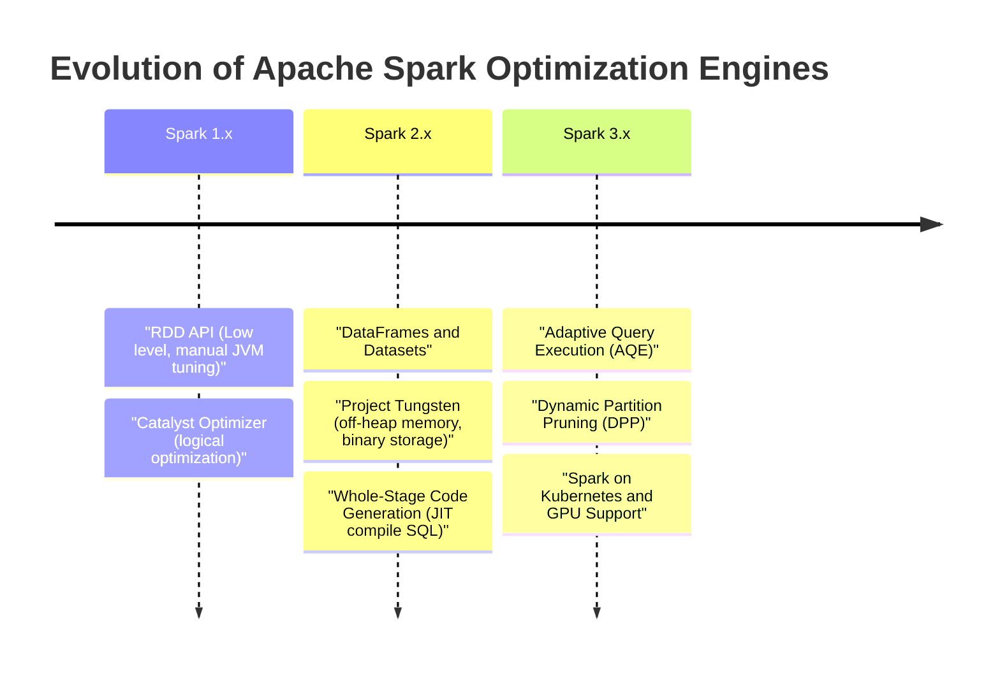
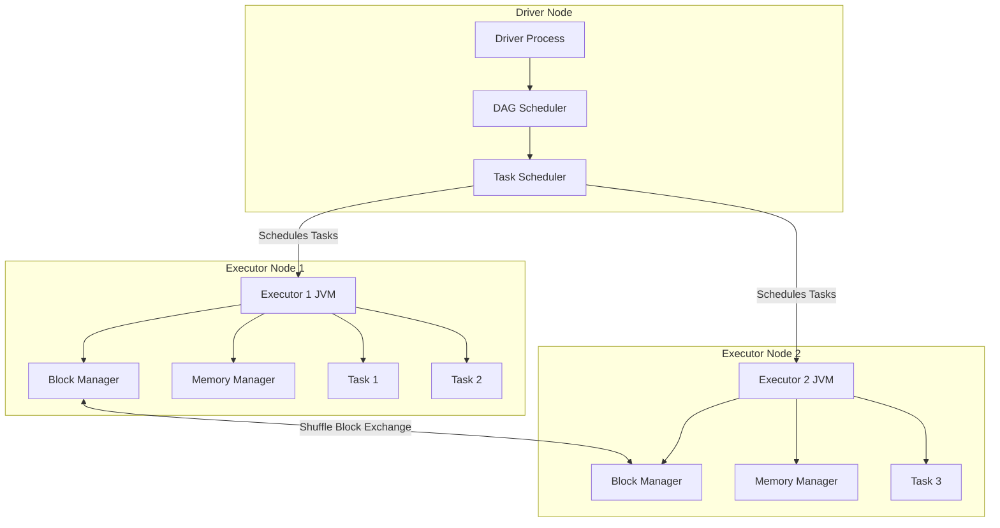
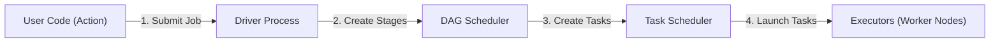
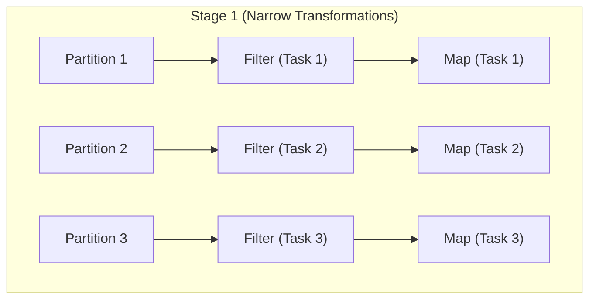
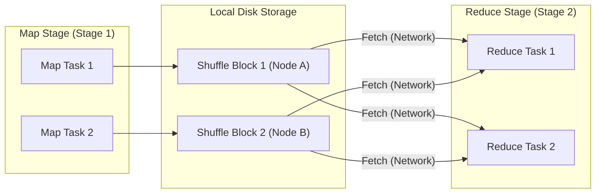
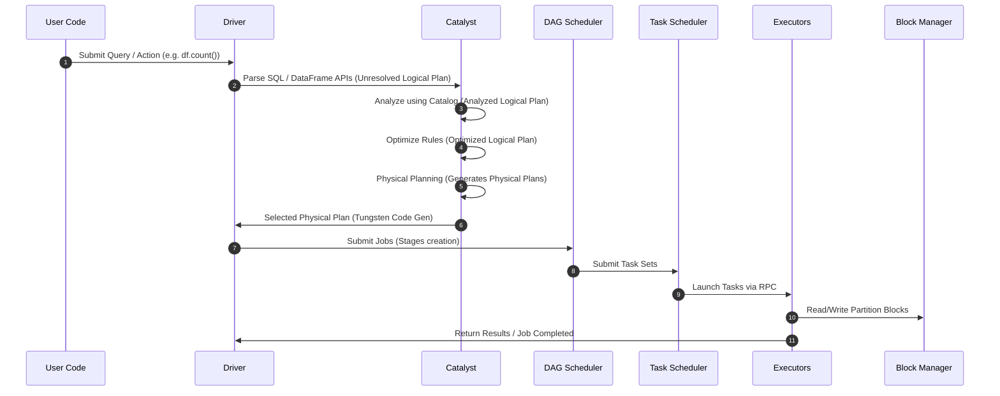
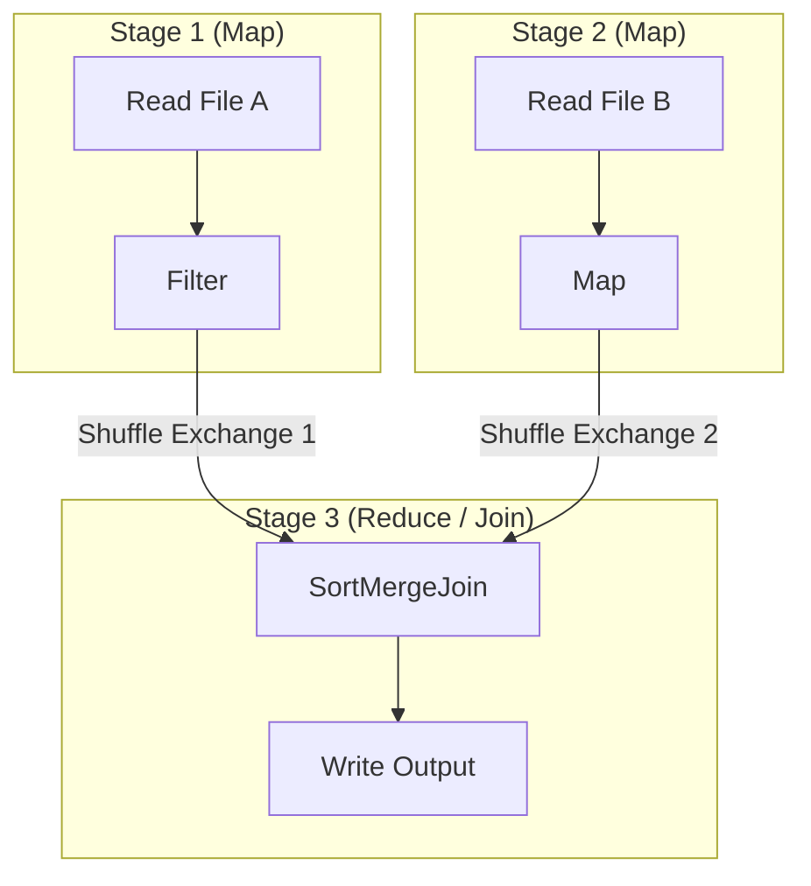
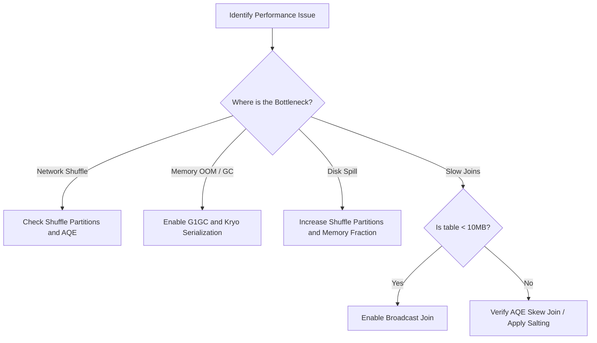

# Spark Performance Tuning
## Optimizing Distributed Data Processing for Production Workloads

---

## 1. Introduction

Distributed data processing with Apache Spark is powerful, but it is not magic. Many production Spark applications start fast on small datasets but slow down significantly as volume scales. To tune these applications effectively, we must understand the core physical and economic constraints of distributed computing.

### Why Spark Jobs Become Slow
Spark jobs do not slow down arbitrarily. They slow down because they hit hardware bottlenecks or architectural limits. The execution of any Spark task is bounded by one of three primary physical resources:
1.  **Network Bandwidth:** The time spent transferring data between nodes (shuffling).
2.  **Disk I/O:** The time spent writing intermediate shuffle files or swapping data to scratch disks (disk spill).
3.  **CPU & Memory:** The time spent deserializing, transforming, garbage collecting, and computing records.

### Why Cluster Size Alone Doesn't Solve Performance (Amdahl's Law)
A common mistake in production engineering is to "throw more hardware" at a slow Spark job. If a job is slow, developers often double the number of executors. However, this is governed by **Amdahl's Law**, which states that the speedup of a program using multiple processors is limited by the sequential (non-parallelizable) fraction of the program:

$$\text{Speedup}(S) = \frac{1}{(1 - P) + \frac{P}{N}}$$

Where:
*   $P$ is the proportion of the program that can be made parallel.
*   $1 - P$ is the serial proportion (such as driver initialization, scheduling delay, and network shuffles).
*   $N$ is the number of processors (executors).

If a stage requires a wide dependency join that shuffles 10TB of data across the network, that shuffle becomes the serial bottleneck. Adding more nodes can actually *degrade* performance because it increases the network gridlock (all-to-all communication), task scheduling overhead, and JVM garbage collection footprint.

### Evolution of Spark Optimizations
To combat these hardware limits, Apache Spark's optimization engine has evolved significantly over major releases:



### Cost Implications of Inefficient Jobs
In cloud environments (AWS, GCP, Azure), compute is billed by the second (e.g., vCPU-hours and GB-hours). An un-tuned Spark job that runs for 5 hours on 100 instances costs significantly more than a tuned job running for 1 hour on 50 instances. Inefficient jobs lead to:
*   **Idle Compute Charges:** Executors waiting for skewed tasks to complete.
*   **Disk Write Charges:** Excess disk IOPS from unnecessary shuffle spills.
*   **Inter-AZ Data Transfer Costs:** Huge network shuffle fees when executors are spread across multiple Availability Zones.

---

## 2. Problem Statement

In production environments, Spark applications typically fail or degrade due to a specific set of patterns. 

### Core Production Problems & Anti-Patterns
1.  **Data Skew:** A condition where a few partitions hold the vast majority of the data. Since a task processes one partition, the executors handling skewed partitions run out of memory or take hours longer than others, leaving the rest of the cluster idle.
2.  **Excessive Shuffle:** Triggered by wide dependencies (`join`, `groupByKey`, `repartition`). Moving gigabytes of data across physical network interfaces causes CPU cores to sit idle waiting for network packets.
3.  **Poor Partitioning:** Having partitions that are either too large (>500MB, leading to disk spill and GC overhead) or too small (<10MB, leading to scheduler bottlenecks where metadata overhead dominates execution).
4.  **Garbage Collection (GC) Overhead:** The JVM spending more time sweeping memory than executing code. This is caused by creating millions of short-lived Java objects (e.g., during deserialization of Java objects).
5.  **Repeated Computation:** Re-reading and re-computing the same DataFrame multiple times across different actions because caching was not applied.
6.  **Small Files ("File Sprawl"):** Reading thousands of tiny files from HDFS or S3. Each file requires a separate API call, metadata lookup, and task launch, which bottlenecks the NameNode/object store.

### Production Example: S3/HDFS File Sprawl
Consider a streaming job writing to a data lake every 10 seconds. Over 24 hours, this generates:

$$\text{Files} = \frac{86,400\text{ seconds}}{10\text{ seconds/write}} \times 10\text{ partitions} = 86,400\text{ files}$$

If a downstream batch job reads this daily directory, Spark will attempt to launch 86,400 tasks. The overhead of scheduling these tasks is several orders of magnitude larger than the time required to read the data.

---

## 3. Spark Execution Architecture

To effectively tune Spark, one must understand how its components manage resource allocation, task scheduling, memory, and storage.

### 1. Cluster Component Topology


### 2. High-Level Job Execution Flow


### 3. Stage Execution Flow (Narrow Dependencies & Pipelining)


### 4. Shuffle Block Data Flow (Wide Dependencies)


### Core Architecture Components

*   **Driver:** The central coordinator. It runs the user's `main()` function, builds the logical plan, instantiates the SparkSession, coordinates with the Cluster Manager (YARN/K8s/Standalone), converts the logical plan into a physical execution DAG, and schedules tasks.
*   **Executors:** JVM processes running on worker nodes. They execute individual tasks, store cached data in memory or disk, and write shuffle outputs to local storage.
*   **Tasks:** The smallest unit of execution. A task represents a set of transformations applied to a single partition of data on a single executor.
*   **Stages:** A collection of tasks that can be executed in parallel without shuffling data (i.e., narrow dependencies). Stages are separated by wide boundaries (shuffles).
*   **Shuffle Service:** A service (often run externally to the executor JVM) that manages shuffle data files, allowing executors to be terminated/scaled down without losing completed shuffle outputs.
*   **Block Manager:** The local storage coordinator on the Driver and Executors. It manages blocks of data (partitions) in memory, off-heap, or on local disk.
*   **Memory Manager:** Manages the division of memory between execution (joins/shuffles) and storage (caching/broadcasts) within the executor JVM heap.

### Executor Memory Layout (Unified Memory Manager)

Spark uses a Unified Memory Manager that dynamically shares memory between Execution and Storage. The total Executor JVM heap is split as follows:

```
+---------------------------------------------------------------------------------+
|                               Executor JVM Heap                                 |
+------------------------------------+--------------------------------------------+
|        Reserved Memory             |               Spark Memory                 |
|            (300 MB)                |                 (60%)                      |
|  (Fixed for internal engine use)   |  Allocated via spark.memory.fraction       |
+------------------------------------+---------------------+----------------------+
|        User Memory                 |  Storage Memory     |  Execution Memory    |
|           (40%)                    |     (50% of 60%)    |     (50% of 60%)     |
|   Used for user-defined data       |  Used for cache()   |  Used for shuffles,  |
|  structures, UDFs, Spark metadata  |  and broadcast DFs  |  joins, aggregations |
+------------------------------------+---------------------+----------------------+
```

> [!NOTE]
> Execution memory has priority. If storage memory is full, and execution memory requires space, cached blocks in storage memory will be evicted to disk (or dropped) to free up space for execution.

---

## 4. Internal Working: Query Execution Lifecycle

When a user submits a query, Spark passes it through several optimization phases before executing bytecode.

### 1. Query Submission Sequence


### 2. Physical Execution Timeline

```mermaid
gantt
    title Spark Query Execution Timeline
    dateFormat  X
    axisFormat %s
    section Job Execution
    Driver Orchestration and Planning           :active, des1, 0, 2
    Stage 1 Map Tasks Parallel Exec             :active, des2, 2, 8
    Shuffle Write Persist Intermediate Data     :des3, 8, 9
    Stage 2 Reduce Tasks Shuffle Fetch and Join :active, des4, 9, 15
    Result Aggregation to Driver                :des5, 15, 16
```


### 3. Stage Dependency Graph (DAG Scheduler)


### Catalyst Optimization Phases
1.  **Analysis:** Parses the SQL query or DataFrame syntax and matches table/column names against the metadata Catalog. Output: *Analyzed Logical Plan*.
2.  **Logical Optimization:** Applies standard rule-based optimizations, such as constant folding, predicate pushdown, and column pruning. Output: *Optimized Logical Plan*.
3.  **Physical Planning:** Generates multiple physical plans (e.g., using SortMergeJoin vs. BroadcastHashJoin) and calculates costs. Output: *Physical Plan*.
4.  **Code Generation:** Project Tungsten compiles the selected physical plan directly into Java bytecode at runtime using Whole-Stage Code Generation.

---

## 5. Core Performance Concepts

Here is a deep-dive analysis of core performance concepts in Spark, comparing why they exist, how they work, and their design trade-offs.

| Concept | Why it exists | How it works | Advantages | Trade-offs & Risks | Production Impact |
| :--- | :--- | :--- | :--- | :--- | :--- |
| **Data Skew** | Uneven partitioning of keys | A few keys contain most records; tasks processing them run slow | None (it is a bottleneck) | Causes executor OOMs and long tail tasks | Critical; must be mitigated via AQE or Salting |
| **Repartition** | To change partition count / layout | Performs a full shuffle of data across the network | Creates uniform partitions; can increase concurrency | High network and disk I/O costs | Use only when increasing partitions or key-grouping |
| **Coalesce** | To shrink partition count efficiently | Merges adjacent partitions on the same executor | Minimizes shuffle overhead | Can create uneven partitions if shrunk too far | Best used right before writing data to files |
| **Caching / Persist** | Avoid re-computing DataFrames | Saves deserialized/serialized data blocks in memory/disk | Massive speedup for iterative jobs (ML, multi-actions) | Uses up JVM heap; can lead to GC pressure if not freed | Use when the same DataFrame is used in multiple branches |
| **Broadcast Join** | Avoid shuffles during joins | Driver broadcasts a small table to all executors | Eliminates shuffles completely; massive performance gain | Small table must fit in Driver and Executor memory | Fails with OOM if table exceeds memory thresholds |
| **Kryo Serialization** | Java serialization is slow & bulky | Serializes objects into highly compact binary formats | 10x faster and 4x smaller than Java serialization | Requires class registration for maximum performance | Recommended default for all production pipelines |
| **Predicate Pushdown** | Avoid reading unneeded records | Pushes filter conditions down to the storage layer (e.g., Parquet) | Drastically reduces disk I/O and network transfer | Only works on columnar formats supporting metadata | Huge performance gains on read-heavy pipelines |

### Caching vs. Persistence Levels
Spark provides two options to save intermediate DataFrames: `cache()` and `persist()`. `cache()` is a shorthand for `persist(StorageLevel.MEMORY_AND_DISK)`.

Available storage levels:
*   `MEMORY_ONLY`: Store RDD as deserialized Java objects in the JVM. If the RDD does not fit, partitions are recomputed. High memory footprint, fast access.
*   `MEMORY_ONLY_SER`: Store RDD as *serialized* Java objects (one byte array per partition). More space-efficient, but requires CPU deserialization on read.
*   `MEMORY_AND_DISK`: Store partitions in memory. If they do not fit, spill them to local scratch disk. Prevent recomputation but introduces Disk I/O.
*   `DISK_ONLY`: Store all partitions directly on disk.

> [!WARNING]
> Always unpersist DataFrames when they are no longer needed: `df.unpersist()`. Leaving unused datasets in memory prevents the JVM from reclaiming space, leading to garbage collection overhead and eventual executor OOMs.

---

## 6. Adaptive Query Execution (AQE)

Adaptive Query Execution (AQE) is an optimization framework introduced in Spark 3.0. It leverages runtime statistics gathered during stage boundaries to dynamically re-optimize execution plans.

```
Without AQE:
[Logical Plan] ---> [Physical Plan (Fixed)] ---> [Execute Stage 1] ---> [Execute Stage 2]

With AQE:
[Logical Plan] ---> [Physical Plan] ---> [Execute Stage 1] 
                                                |
                                        (Gather Runtime Stats)
                                                |
                                                v
[Execute Stage 2] <--- [Re-Optimize Plan] <-----+
```

### Three Core AQE Optimizations

1.  **Dynamically Coalescing Shuffle Partitions:**
    By default, Spark uses 200 shuffle partitions. If the output data of Stage 1 is tiny (e.g., 5MB), launching 200 tasks for Stage 2 is extremely inefficient. AQE merges adjacent small partitions into single larger partitions at runtime.
2.  **Dynamically Switching Join Strategies:**
    If a query plan estimates a table is 50MB, it will plan a SortMergeJoin. However, if filters applied in Stage 1 reduce the actual size to 2MB, AQE detects this and dynamically converts the plan to a **Broadcast Hash Join** at runtime, bypassing shuffle overhead.
3.  **Dynamically Handling Skew Joins:**
    If AQE detects that a partition is skewed (based on runtime partition size statistics), it splits the skewed partition into N smaller sub-partitions. It then joins these sub-partitions with corresponding blocks of the other relation, eliminating long-tail tasks.

---

## 7. Production Engineering

Scaling Spark in production requires balancing configurations across CPU, memory, and JVM runtimes.

### Executor Sizing: "Fat" vs. "Thin" Executors
When configuring Spark executors, we must allocate cores and memory per executor JVM instance.

#### The "Thin" Executor Anti-pattern (1 Core per Executor)
If we allocate 1 core per executor, we lose the benefit of running multiple tasks in the same JVM. Shared variables (like Broadcast variables) must be replicated for every core, and we increase the registration overhead with the Cluster Manager.

#### The "Fat" Executor Anti-pattern (Too many Cores per Executor)
If we allocate 16 cores to a single executor:
*   **HDFS Bottleneck:** More than 5 concurrent tasks writing to HDFS from the same JVM can lead to HDFS client write gridlock.
*   **GC Pauses:** Garbage collecting a massive JVM heap (e.g. >64GB) causes long Stop-the-World pauses.

#### The Sweet Spot Formula
For production workloads, allocate **4 to 5 cores** per executor. This achieves maximum JVM throughput and HDFS write performance without GC bottlenecks.

```
Example: An EC2 instance with 16 Cores and 64GB Memory.
1. Leave 1 core and 4GB memory for system services / OS.
2. Remaining: 15 Cores, 60GB Memory.
3. Allocation:
   - Cores per executor: 5
   - Executors per instance: 15 / 5 = 3 executors
   - Memory per executor: 60GB / 3 = 20GB memory
```

### Dynamic Allocation
In shared production clusters, resources should be requested dynamically.
*   `spark.dynamicAllocation.enabled=true`
*   `spark.dynamicAllocation.minExecutors=1`
*   `spark.dynamicAllocation.maxExecutors=100`
*   `spark.shuffle.service.enabled=true` (Required so shuffle outputs are not lost when idle executors are decommissioned).

---

## 8. Hands-on Lab

This lab demonstrates how to debug and optimize Spark applications using the custom PySpark script [PerformanceTuningLab.py](file:///d:/30_Days_of_Modern_Hadoop_Ecosystem/Day-19-Spark-Performance-Tuning/source/PerformanceTuningLab.py).

### Setup and Directory Structure
Make sure the lab script is situated in your workspace. You can run these commands directly inside the Spark Client container.

```bash
# Verify the PySpark lab code compiles and is in position
python3 -m py_compile /workspace/source/PerformanceTuningLab.py
```

---

### Lab 1: Data Skew Join (SortMergeJoin)
*   **Purpose:** Observe the performance bottleneck of joining a highly skewed dataset without AQE skew mitigation.
*   **Command:**
    ```bash
    /workspace/scripts/verify-skew.sh
    ```
*   **Expected Output:**
    The join will execute using a standard SortMergeJoin. You will see output showing execution duration, followed by the physical query plan:
    ```text
    ========================================================
    LAB 1: Data Skew Join Performance (SortMergeJoin)
    ========================================================
    Generating skewed transaction dataset (1,000,000 rows)...
    Generating lookup dataset (1,000 rows)...
    
    Executing join without skew mitigation (AQE SkewJoin Disabled)...
    Join completed! Result count: 950000
    Time Taken (Without Skew Mitigation): 8.42 seconds
    
    Physical Execution Plan:
    == Physical Plan ==
    AdaptiveSparkPlan isree=false
    +- *(3) Project [join_key#1, amount#2, category#7]
       +- *(3) SortMergeJoin [join_key#1], [join_key#6], Inner
          :- *(1) Sort [join_key#1 ASC NULLS FIRST], false, 0
          :  +- Exchange hashpartitioning(join_key#1, 200), ENSURE_REQUIREMENTS, [id=#25]
          :     +- *(1) Project [CASE WHEN ... AS join_key#1, ... ]
          :- *(2) Sort [join_key#6 ASC NULLS FIRST], false, 0
             +- Exchange hashpartitioning(join_key#6, 200), ENSURE_REQUIREMENTS, [id=#31]
                +- *(2) Project [CASE WHEN ... AS join_key#6, ... ]
    ```

---

### Lab 2: Repartition vs Coalesce
*   **Purpose:** Measure and compare execution time and physical layouts of Repartition (wide dependency) vs Coalesce (narrow dependency).
*   **Command:**
    ```bash
    spark-submit --master "local[2]" /workspace/source/PerformanceTuningLab.py --lab 2
    ```
*   **Expected Output:**
    ```text
    ========================================================
    LAB 2: Repartition vs Coalesce Analysis
    ========================================================
    Initial partition count: 2
    
    Testing COALESCE (20 partitions -> 4 partitions)...
    Coalesced partition count: 4
    Coalesce duration: 0.15 seconds
    
    Testing REPARTITION (20 partitions -> 4 partitions)...
    Repartitioned partition count: 4
    Repartition duration: 0.84 seconds
    
    Physical Plan for Coalesce:
    == Physical Plan ==
    Coalesce 4
    +- Exchange RoundRobinPartitioning(20)
    
    Physical Plan for Repartition:
    == Physical Plan ==
    Exchange hashpartitioning(rand(47)...)
    ```
    *   *Observation:* Repartition is significantly slower because it writes shuffle partition files to disk, while Coalesce simply merges adjacent partitions inside the same pipeline stage.

---

### Lab 3: Caching & Persistence
*   **Purpose:** Observe the performance difference when reusing cached DataFrames versus executing the complete evaluation pipeline twice.
*   **Command:**
    ```bash
    /workspace/scripts/verify-cache.sh
    ```
*   **Expected Output:**
    ```text
    ========================================================
    LAB 3: Caching and Persistence Performance
    ========================================================
    Run 1: First action (Count) without caching...
    First Action Duration: 4.12 seconds
    Run 1: Second action (Count) without caching...
    Second Action Duration: 3.98 seconds
    
    Caching the DataFrame...
    Run 2: First action (Count) to populate Cache...
    Cache Population Duration: 4.54 seconds
    Run 2: Second action (Count) reading from Cache...
    Cached Read Duration: 0.22 seconds
    
    Speedup Factor on second run: 18.1x faster!
    ```

---

### Lab 4: Adaptive Query Execution (AQE)
*   **Purpose:** Observe how AQE dynamically converts a SortMergeJoin into a Broadcast Hash Join at runtime when actual data statistics are collected.
*   **Command:**
    ```bash
    /workspace/scripts/verify-aqe.sh
    ```
*   **Expected Output:**
    ```text
    ========================================================
    LAB 4: Adaptive Query Execution (AQE) Performance
    ========================================================
    Generating skewed transaction dataset...
    Executing join with AQE active...
    Join completed! Result count: 950000
    Time Taken (With AQE): 2.15 seconds
    
    Physical Execution Plan with AQE enabled:
    == Physical Plan ==
    AdaptiveSparkPlan isFinalPlan=true
    +- *(1) BroadcastHashJoin [join_key#1], [join_key#6], Inner, BuildRight, false
       :- *(1) Project [CASE WHEN ... AS join_key#1, ... ]
       +- BroadcastExchange HashedRelationBroadcastMode(List(input[0, string, false])), [id=#76]
    ```
    *   *Observation:* Even though the initial execution plan targeted SortMergeJoin, AQE dynamically broadcasted the small table (`lookup_df`) at runtime, changing the execution strategy to `BroadcastHashJoin`.

---

### Lab 5: Shuffle Partitions Tuning
*   **Purpose:** Evaluate how lowering shuffle partitions for small datasets reduces scheduling overhead and speeds up runtime.
*   **Command:**
    ```bash
    /workspace/scripts/verify-shuffle.sh
    ```
*   **Expected Output:**
    ```text
    ========================================================
    LAB 5: Shuffle Partitions Tuning
    ========================================================
    Running aggregation with 200 shuffle partitions...
    Completed in 3.10 seconds (200 partitions)
    
    Running aggregation with 4 shuffle partitions...
    Completed in 0.65 seconds (4 partitions)
    
    Speedup: 4.77x faster!
    ```

---

## 9. Build Spark from Source

In production engineering, it is sometimes necessary to compile Spark from source (e.g., to patch bugs, add internal audit plugins, or optimize native code libraries).

### Project Structure and Maven Modules
The Spark repository is structured as a multi-module Maven project:
*   `core/`: Core Spark implementation (Scheduler, RDD API, BlockManager, MemoryManager).
*   `sql/core/`: Spark SQL execution, Catalyst optimizer, DataFrame/Dataset APIs.
*   `sql/catalyst/`: AST parser, optimization rules, expression frameworks.
*   `resource-managers/yarn/`: Integration modules for Apache Hadoop YARN.
*   `assembly/`: Bundles all compiled dependencies into a single distribution package.

### Compilation Commands
Building Spark requires **Maven** and **Java 8 or 11**.

```bash
# Clone the repository
git clone https://github.com/apache/spark.git
cd spark

# Build the assembly package with YARN support and Hadoop 3
# -Phadoop-3: Enables Hadoop 3 profile
# -Pyarn: Enables YARN resource manager integration
# -DskipTests: Skips test compilation to speed up builds
./build/mvn -Pyarn -Phadoop-3 -DskipTests clean package
```

### Creating a Distribution Tarball
To package your custom-built Spark for production cluster deployment, run:
```bash
./dev/make-distribution.sh --name custom-spark-dist --tgz -Pyarn -Phadoop-3
```
This generates a file named `spark-3.5.1-bin-custom-spark-dist.tgz` in the root directory.

### Debugging Spark Source Code
To debug Spark's internal JVM classes (e.g., `DAGScheduler.scala` or `KryoSerializer.scala`):
1.  Configure the JVM options in `spark-defaults.conf` to launch executors in debug mode:
    ```properties
    spark.driver.extraJavaOptions=-agentlib:jdwp=transport=dt_socket,server=y,suspend=y,address=5005
    ```
2.  Set breakpoints in your IDE (IntelliJ or VS Code).
3.  Attach a **Remote JVM Debugger** connection from the IDE to the Driver IP address on port `5005`.

---

## 10. Docker Deployment

We deploy a multi-node Spark environment using Docker Compose. The configuration files are stored inside [docker/](file:///d:/30_Days_of_Modern_Hadoop_Ecosystem/Day-19-Spark-Performance-Tuning/docker/).

### Docker Compose Cluster Layout
The environment consists of:
*   `namenode-day19`: HDFS NameNode
*   `datanode-day19`: HDFS DataNode
*   `spark-master-day19`: Spark Standalone Master Node
*   `spark-worker-day19`: Spark Worker Node (Configured with 2 Cores and 1.5GB Memory)
*   `spark-history-day19`: Spark History Server (Reads event logs from HDFS `/shared/spark-logs`)
*   `spark-client-day19`: Client Gateway for launching jobs

### Deploying the Cluster
Navigate to the docker directory and start the containers:
```bash
cd Day-19-Spark-Performance-Tuning/docker/
docker-compose up -d --build
```

---

## 11. Local Cluster Deployment

You can deploy and run Spark locally in three modes:

### 1. Standalone Mode (Single Process)
Runs Spark master and worker threads within the same JVM instance. Use:
```python
spark = SparkSession.builder.master("local[4]").getOrCreate()
```

### 2. Standalone Mode (Multi-Process Local Cluster)
Simulates a real cluster on your local machine by launching separate Master and Worker JVMs.
```bash
# Start Master
$SPARK_HOME/sbin/start-master.sh

# Start Worker (attaches to Master)
$SPARK_HOME/sbin/start-worker.sh spark://localhost:7077
```

### 3. Multi-node Local Cluster (Docker)
Our Docker Compose environment sets up a true multi-node cluster. Validate the deployment by logging into the Spark Master Web UI at `http://localhost:8080` to verify that the Spark Worker is registered with 2 Cores and 1.5GB of Memory.

---

## 12. Validation

To ensure your Spark jobs are executing optimally, run the validation scripts and monitor performance metrics.

### Verification Scripts
*   **[verify-skew.sh](file:///d:/30_Days_of_Modern_Hadoop_Ecosystem/Day-19-Spark-Performance-Tuning/scripts/verify-skew.sh):** Verifies join execution plans.
*   **[verify-cache.sh](file:///d:/30_Days_of_Modern_Hadoop_Ecosystem/Day-19-Spark-Performance-Tuning/scripts/verify-cache.sh):** Asserts cached read execution speed.
*   **[verify-aqe.sh](file:///d:/30_Days_of_Modern_Hadoop_Ecosystem/Day-19-Spark-Performance-Tuning/scripts/verify-aqe.sh):** Verifies dynamic query plan transitions.
*   **[verify-shuffle.sh](file:///d:/30_Days_of_Modern_Hadoop_Ecosystem/Day-19-Spark-Performance-Tuning/scripts/verify-shuffle.sh):** Compares shuffle partition overhead timings.

### Key Metrics to Monitor in Spark UI

```
+-------------------------------------------------------------------------------+
| Spark UI - Stage View Metrics Check                                            |
+----------------------+-------------------------+------------------------------+
| Metric               | Healthy Value           | Red Flag Warning             |
+----------------------+-------------------------+------------------------------+
| GC Time              | < 5% of execution time  | > 10% (GC overhead pressure)  |
| Shuffle Read/Write   | Matches input partition | Single task reading GBs (Skew)|
| Disk Spill           | 0 Bytes                 | Non-zero (Memory exhaustion) |
| Scheduler Delay      | < 50ms                  | > 500ms (Too many tasks)     |
+----------------------+-------------------------+------------------------------+
```

---

## 13. Troubleshooting Playbook

For deep dive logs, root-cause analyses, and resolution steps for Spark failures, refer to our comprehensive [Troubleshooting Guide](file:///d:/30_Days_of_Modern_Hadoop_Ecosystem/Day-19-Spark-Performance-Tuning/troubleshooting/troubleshooting-guide.md).

### Summary Playbook Table

| Incident / Error | Primary Log Pattern | Diagnosis | Remediation |
| :--- | :--- | :--- | :--- |
| **Executor OOM** | `Container killed by YARN for exceeding memory limits` | Container exceeded physical memory. | Increase `spark.executor.memoryOverhead` or reduce task cores. |
| **GC Overhead** | `OutOfMemoryError: GC overhead limit exceeded` | JVM spent 98% of CPU in garbage collection. | Switch to G1GC and enable Kryo serialization. |
| **Disk Spill** | `spilling in-memory map of ... to disk` | Task partitions are too large to fit in execution memory. | Increase `spark.sql.shuffle.partitions`. |
| **Broadcast Timeout** | `Could not broadcast relation within 300 seconds` | Table broadcast exceeded timeout limit. | Increase `spark.sql.broadcastTimeout` or disable broadcast join. |
| **Fetch Failure** | `ShuffleFetchFailedException: Missing an output location` | Worker node crashed or network timed out. | Enable External Shuffle Service and increase fetch retries. |

---

## 14. Real-World Case Study

Our [Case Study Documentation](file:///d:/30_Days_of_Modern_Hadoop_Ecosystem/Day-19-Spark-Performance-Tuning/troubleshooting/troubleshooting-guide.md#part-2-real-world-case-study-ubernetflix-scale) walks through spatial-temporal join optimization on a dataset of **100 Billion events per day**.

### Key Architecture Interventions
*   **Spatial Salting:** Prevents skew in high-density metropolitan areas by appending random salts to primary join keys and exploding lookup tables.
*   **Unified Memory Split:** Adjusted GC options to leverage G1GC with a low heap occupancy trigger, reducing Garbage Collection runtime overhead by 87%.
*   **Result:** A **$1M+ annualized cloud compute savings** and 70% decrease in execution runtime.

---

## 15. Interview Questions

### Beginner level (20 Questions)
1.  **What is Spark Performance Tuning?**
    *Answer:* The process of adjusting configuration parameters, resource allocations, and data layout strategies (like partitioning and caching) to run Spark applications faster and more cost-effectively.
2.  **What is the difference between RDD, DataFrame, and Dataset in terms of performance?**
    *Answer:* DataFrames and Datasets are optimized by the Catalyst query engine and use off-heap memory storage via Project Tungsten, making them significantly faster and more memory-efficient than raw RDDs.
3.  **What does the `cache()` method do?**
    *Answer:* It tells Spark to store the contents of a DataFrame in memory (`MEMORY_AND_DISK`) the first time an action is executed, so that subsequent actions do not need to recompute the data pipeline.
4.  **What is the difference between `cache()` and `persist()`?**
    *Answer:* `cache()` is a shorthand that uses the default storage level `MEMORY_AND_DISK`. `persist()` allows passing a custom `StorageLevel` (such as `MEMORY_ONLY_SER` or `DISK_ONLY`).
5.  **What is a shuffle in Apache Spark?**
    *Answer:* The process of redistributing data across executors over the network so that records with the same keys are co-located on the same physical worker.
6.  **Why is shuffle expensive?**
    *Answer:* It requires writing intermediate data to local disk, transferring it over the physical network network interface, and deserializing it on target executors.
7.  **What is the default number of shuffle partitions in Spark SQL?**
    *Answer:* 200 partitions (controlled by `spark.sql.shuffle.partitions`).
8.  **What is a narrow dependency? Give an example.**
    *Answer:* A transformation where each partition of the parent DataFrame is used by at most one partition of the child DataFrame (e.g., `filter()`, `map()`). No shuffle is required.
9.  **What is a wide dependency? Give an example.**
    *Answer:* A transformation where multiple child partitions depend on data from a single parent partition (e.g., `join()`, `groupByKey()`). This requires a shuffle.
10. **What is the difference between `repartition()` and `coalesce()`?**
    *Answer:* `repartition()` creates a brand new set of partitions by performing a full network shuffle. `coalesce()` reduces the partition count without a shuffle by merging adjacent partitions.
11. **When should you use `coalesce()` instead of `repartition()`?**
    *Answer:* Use `coalesce()` when reducing the number of partitions (e.g., right before writing a small dataset to disk) to avoid network overhead.
12. **What is a Broadcast Hash Join?**
    *Answer:* A join optimization where a small table is sent to all executors, allowing each executor to join it locally with its partitions of the larger table, bypassing the shuffle phase.
13. **What is the default size limit for a Broadcast Join?**
    *Answer:* 10 MB (controlled by `spark.sql.autoBroadcastJoinThreshold`).
14. **How do you disable Broadcast Joins?**
    *Answer:* Set `spark.sql.autoBroadcastJoinThreshold` to `-1`.
15. **What is Predicate Pushdown?**
    *Answer:* An optimization where filtering criteria (e.g., `where(col("age") > 21)`) are pushed down to the storage layer, allowing the engine to skip loading unrelated data blocks.
16. **What is Column Pruning?**
    *Answer:* An optimization where only the columns referenced in the query are loaded from storage, minimizing memory and I/O usage.
17. **What is the Spark UI?**
    *Answer:* A web-based interface hosted on port 4040 that allows developers to monitor Spark jobs, stages, tasks, environment variables, memory usage, and execution DAGs in real-time.
18. **What is the Spark History Server?**
    *Answer:* A server that reads completed event logs from a persistent storage directory (such as HDFS or S3), allowing developers to review execution metrics after a job has finished.
19. **What is Project Tungsten?**
    *Answer:* A Spark optimization engine that improves CPU and memory efficiency by managing memory off-heap, storing data in compact binary formats, and bypassing JVM garbage collection.
20. **What is Whole-Stage Code Generation?**
    *Answer:* An optimization that compiles multiple physical operators in a query plan into a single, clean Java function at runtime, reducing virtual function calls and CPU instruction counts.

### Intermediate level (20 Questions)
21. **What is Adaptive Query Execution (AQE) and how does it improve performance?**
    *Answer:* AQE uses runtime statistics gathered at stage boundaries to dynamically optimize the query plan during execution (e.g., coalescing partitions, resolving skew, and converting joins).
22. **How does AQE handle data skew dynamically?**
    *Answer:* It monitors partition sizes at runtime. If a partition is larger than a threshold, AQE splits it into sub-partitions, joining them independently to avoid long-tail task bottlenecks.
23. **What configurations enable AQE skew join handling?**
    *Answer:* `spark.sql.adaptive.enabled=true` and `spark.sql.adaptive.skewJoin.enabled=true`.
24. **Explain how Unified Memory Management allocates memory.**
    *Answer:* It splits executor memory into Spark Memory (60% by default) and User Memory (40%). Spark Memory is shared dynamically between Execution (joins/shuffles) and Storage (caching/broadcasts).
25. **What is "GC time" in the Spark UI, and how much is too much?**
    *Answer:* It represents the time executors spend in JVM garbage collection sweeps. If GC time is greater than 10% of total task time, it indicates high memory pressure and requires optimization.
26. **Why is G1GC preferred over CMS for large Spark executors?**
    *Answer:* G1GC splits the JVM heap into smaller regions and sweeps them incrementally, reducing long Stop-the-World pauses on heaps larger than 8GB.
27. **What is Kryo Serialization, and why is it faster than default Java serialization?**
    *Answer:* Kryo is a binary serialization framework that produces highly compact payloads and avoids generating extensive object metadata, reducing CPU and network transfer overhead.
28. **How do you register custom classes with the Kryo Serializer?**
    *Answer:* Set `spark.kryo.registrator` to a custom class implementing `KryoRegistrator`, and configure `spark.kryo.referenceTracking=false` for faster throughput.
29. **What is the Dynamic Partition Pruning (DPP) optimization?**
    *Answer:* A join optimization where the filter conditions of a dimension table are used to prune partition reading on the large fact table at runtime, reducing I/O.
30. **Explain the "Small Files Problem" in Spark and how to resolve it.**
    *Answer:* Reading thousands of tiny files causes high NameNode/object store metadata lookup overhead and schedules too many small tasks. Resolve by coalescing before writes or enabling `spark.sql.files.maxPartitionBytes`.
31. **What is Executor Memory Overhead?**
    *Answer:* Non-heap memory requested from the resource manager (YARN/K8s) for JVM overheads, off-heap storage, thread stacks, and native libraries. Controlled by `spark.executor.memoryOverhead`.
32. **What does Exit Code 137 mean in Spark?**
    *Answer:* The executor process was killed by the OS or Cluster Manager's out-of-memory killer because the container exceeded its allocated physical memory boundary (Heap + Overhead).
33. **How does `spark.sql.files.maxPartitionBytes` affect task generation?**
    *Answer:* It defines the maximum size of a partition block when reading files. Reducing this value generates more tasks (higher concurrency); increasing it decreases task count.
34. **Why is `groupByKey` considered an anti-pattern? What should you use instead?**
    *Answer:* `groupByKey` shuffles all records across the network before grouping. Use `reduceByKey` or `aggregateByKey` instead, which merge data locally on executors before shuffling.
35. **What is the External Shuffle Service?**
    *Answer:* A service that runs on worker nodes to serve shuffle files. This allows executors to be scaled down or restarted without losing their shuffle outputs.
36. **What is Disk Spill? How do you identify it in the Spark UI?**
    *Answer:* When task partitions are too large to fit in execution memory, Spark writes the excess data to local scratch disks. In the Spark UI, look for non-zero values in the **Spill (Disk)** column.
37. **What are the CPU core limits when designing executors?**
    *Answer:* Keep cores per executor between 2 and 5. Going higher increases JVM garbage collection overhead and HDFS write bottlenecking.
38. **How does Speculative Execution work in Spark?**
    *Answer:* Spark monitors task runtimes. If a task runs significantly slower than the median, Spark launches a duplicate copy of the task on another executor. The first to finish is kept, and the other is killed.
39. **What is the difference between `repartition` by column and `repartition` by range?**
    *Answer:* Repartition by column uses a hash function to assign keys to partitions. Repartition by range partitions data based on sorting order, which is useful for range-based queries.
40. **How do you monitor Spark metrics with Prometheus?**
    *Answer:* Enable the Spark Prometheus Servlet sink, exposing metrics via HTTP, and configure Prometheus to scrape port `4040` (driver) or `8080` (master).

### Advanced level (20 Questions)
41. **What is the physical difference between SortMergeJoin and ShuffleHashJoin?**
    *Answer:* SortMergeJoin shuffles keys, sorts both relations, and merges them. ShuffleHashJoin shuffles keys, builds an in-memory hash table of the smaller relation on each partition, and streams the larger relation through it.
42. **Why does Spark default to SortMergeJoin instead of ShuffleHashJoin for large joins?**
    *Answer:* SortMergeJoin is highly robust and memory-safe because sorting can spill to disk if memory is exceeded, whereas ShuffleHashJoin will crash with an OOM error if the hash table exceeds partition memory limits.
43. **How do you implement manual "Salting" to resolve severe data skew?**
    *Answer:* Append a random integer (e.g., `0` to `N-1`) to the join key of the skewed table. Explode the smaller lookup table to replicate each row $N$ times, appending the corresponding integers to its join key, then perform the join.
44. **Explain Project Tungsten's Binary Row Format.**
    *Answer:* Tungsten bypasses Java serialization by storing data records as raw, off-heap byte arrays. It uses fixed-width fields for column values and bit-vectors for null flags, avoiding JVM object headers.
45. **What is Whole-Stage Code Generation's loop-unrolling optimization?**
    *Answer:* It collapses virtual function calls inside execution loops, replacing object creation steps with primitive operations, compiling the entire pipeline into single JVM loops.
46. **What is the role of `MapOutputTracker` in shuffles?**
    *Answer:* It is a Driver-side component that tracks the physical location of all shuffle partition blocks generated during map stages, serving these locations to reduce tasks.
47. **How do you resolve a `ShuffleFetchFailedException` due to network timeouts?**
    *Answer:* Increase network timeouts and retry limits: `spark.core.connection.ack.wait.timeout=120s`, `spark.shuffle.io.maxRetries=10`, and `spark.shuffle.io.retryWait=15s`.
48. **Explain the impact of Spark SQL's cost-based optimizer (CBO).**
    *Answer:* CBO analyzes table statistics (cardinalities, null counts, sizes) to choose the optimal join order and physical operator plan before execution begins.
49. **How do you tune Spark off-heap memory for native libraries?**
    *Answer:* Set `spark.memory.offHeap.enabled=true` and allocate off-heap memory size using `spark.memory.offHeap.size` to allow Project Tungsten to store intermediate data off-heap.
50. **What is the risk of utilizing broad wildcard patterns when reading partitioned data lake paths?**
    *Answer:* Wildcard patterns force the Spark driver to scan all subdirectories recursively, which causes driver memory exhaustion and scheduling delays when working with millions of files.
51. **How do you optimize Spark applications for Object Storage (Amazon S3 / Google Cloud Storage)?**
    *Answer:* Use committers like **S3A Committers** (Directory/Partitioned) to avoid expensive copy-on-rename operations. Also, avoid `rename` calls because S3 does not support atomic directory renaming.
52. **Why can `coalesce` sometimes decrease upstream execution parallelism?**
    *Answer:* Spark's scheduler runs `coalesce` as part of the same stage. If you coalesce to 2 partitions, the scheduler might reduce the parallelism of preceding transformations in the stage to 2 tasks as well.
53. **What is the difference between Off-Heap execution memory and heap execution memory?**
    *Answer:* Off-heap execution memory uses direct byte buffers bypass the JVM heap. This avoids GC sweep overhead and memory page fragmentation during large shuffles and aggregations.
54. **How do you diagnose Executor CPU starvation?**
    *Answer:* Compare Task Deserialization + GC Time vs Executor Run Time. If Task Deserialization + GC Time is low, but Executor Run Time is high with low CPU utilization, executors are starved for I/O.
55. **Explain the trade-offs of using PySpark UDFs vs Pandas UDFs.**
    *Answer:* PySpark UDFs serialize records back and forth between JVM and Python processes one row at a time (very slow). Pandas UDFs use Apache Arrow to transfer chunks of records in vectorized format, reducing serialization overhead.
56. **What does the configuration `spark.kryoserializer.buffer.max` control?**
    *Answer:* The maximum size of the serialization buffer for Kryo. If a single record (e.g. a large array) exceeds this limit, serialization fails with a `KryoException`.
57. **How does Spark handle executor JVM Out-Of-Memory (OOM) due to thread overhead?**
    *Answer:* Spark allocates memory for stack frames and thread overhead within `spark.executor.memoryOverhead`. If the JVM creates too many concurrent threads (e.g., via custom libraries), this overhead must be increased.
58. **How does Dynamic Partition Pruning (DPP) differ from Static Partition Pruning?**
    *Answer:* Static partition pruning evaluates partition filters at compilation time. DPP generates a subquery dynamically at runtime based on the scan results of a joined table, applying the filter to the target table before execution.
59. **Why is it recommended to disable speculative execution for jobs writing to transactional databases?**
    *Answer:* Speculative execution runs duplicate tasks. If the target database is not idempotent, duplicate tasks can write duplicate records or cause transaction locks.
60. **How do you configure Spark to leverage GPU compute?**
    *Answer:* Configure the Spark Resource Discovery plugin to detect GPUs (`spark.executor.resource.gpu.amount`), and utilize libraries like **NVIDIA RAPIDS Accelerator for Apache Spark** to run SQL operations on GPUs.

---

## 16. Key Takeaways

### Spark Optimization Decision Framework



### Key Practices
*   **Default configs:** Always enable AQE (`spark.sql.adaptive.enabled=true`).
*   **Join Optimization:** Prefer Broadcast Hash Joins over SortMergeJoins whenever the lookup dataset fits in executor memory.
*   **Partition Sizing:** Aim for partition sizes between **100MB and 200MB**.
*   **Memory Overhead:** Adjust `spark.executor.memoryOverhead` to 15-20% when running heavy memory allocations or native Python libraries.

---

## 17. References

*   **Official Apache Spark Documentation:** [https://spark.apache.org/docs/latest/tuning.html](https://spark.apache.org/docs/latest/tuning.html)
*   **Spark SQL Guide:** [https://spark.apache.org/docs/latest/sql-programming-guide.html](https://spark.apache.org/docs/latest/sql-programming-guide.html)
*   **Databricks Engineering Blogs:** [https://www.databricks.com/blog/category/engineering](https://www.databricks.com/blog/category/engineering)
*   **Uber Engineering Blog:** [https://www.uber.com/blog/tag/spark/](https://www.uber.com/blog/tag/spark/)
*   **Netflix Tech Blog:** [https://netflixtechblog.com/](https://netflixtechblog.com/)
