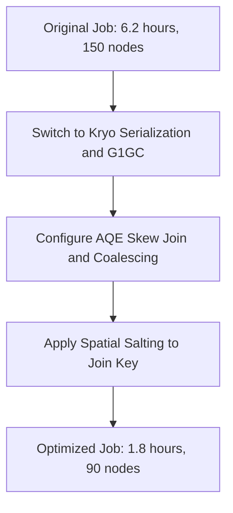

# Apache Spark Performance Troubleshooting Playbook & Case Study
# Location: Day-19-Spark-Performance-Tuning/troubleshooting/troubleshooting-guide.md

This playbook contains operational playbooks and incident response checklists for Apache Spark jobs running at scale.

---

## Part 1: Troubleshooting Playbook

### 1. High Shuffle Time
*   **Symptoms:** Spark job spends 60%+ of its total runtime in the shuffle phase. Stages with shuffling are slow, tasks hang at `shuffle read` or `shuffle write` metrics in the Spark UI.
*   **Root Cause:**
    *   Using high-cardinality keys that require moving vast amounts of data across the network.
    *   Large number of shuffle partitions, resulting in millions of small network requests (metadata overhead).
    *   Inefficient transformations that trigger wide dependencies (`groupByKey`, `join`, `distinct`, `repartition`).
*   **Logs & Metrics:**
    ```text
    WARN TaskSetManager: Stage 4 contains a task with very large shuffle write: 4.8 GB
    INFO MapOutputTrackerWorker: Doing to retrieve 4096 map outputs...
    ```
    *   *Spark UI:* Look at **Shuffle Read Size**, **Shuffle Write Size**, and **Shuffle Fetch Wait Time** in the Stage details page.
*   **Diagnosis:**
    1. Check if you are using `groupByKey` instead of `reduceByKey` or `aggregateByKey` (which perform map-side aggregation).
    2. Check the number of shuffle partitions (`spark.sql.shuffle.partitions` defaults to 200). If data size is small (e.g. < 1GB), 200 partitions causes high networking latency. If data is huge (e.g. > 1TB), 200 partitions creates partitions that are too large (> 5GB), leading to OOMs or disk spills.
*   **Resolution:**
    *   Replace `groupByKey` with `reduceByKey` or `aggregateByKey` to enable combiner-phase reduction.
    *   Optimize shuffle partitions size dynamically using AQE: `spark.sql.adaptive.coalescePartitions.enabled=true`.
    *   Adjust `spark.sql.shuffle.partitions` manually so that each partition is between 100MB and 200MB. Formula:
        $$\text{Partitions} = \frac{\text{Input Volume}}{\text{Target Partition Size (128MB)}}$$

---

### 2. Executor Out-Of-Memory (OOM)
*   **Symptoms:** Spark job fails with `Exit code 137` or `ExecutorLostFailure`. Container killed by YARN/K8s due to memory limits.
*   **Root Cause:**
    *   Executor memory configuration is too low.
    *   Data Skew: One executor gets 90% of the partition data, causing it to run out of memory.
    *   Memory Leaks in User-Defined Functions (UDFs) or local caching.
    *   High concurrency: Too many tasks running on the same executor (too many cores per executor).
*   **Logs & Metrics:**
    ```text
    ERROR CoarseGrainedExecutorBackend: Executor self-exiting due to lost connection to driver.
    WARN YarnSchedulerBackend$YarnSchedulerEndpoint: Container killed by YARN for exceeding memory limits. 2.4 GB of 2.0 GB physical memory used.
    ```
*   **Diagnosis:**
    1. Inspect Spark UI and check if execution memory spilled to disk or if a single executor has significantly higher task run-times (indicates skew).
    2. Check container exit code. `137` indicates `SIGKILL` by kernel OOM-killer.
*   **Resolution:**
    *   Increase overhead memory fraction: `spark.executor.memoryOverhead` (default is 10% of executor memory or 384MB, whichever is larger). Increase to 15-20% for memory-intensive jobs.
    *   Decrease cores per executor to reduce task concurrency: set `spark.executor.cores` to 4 or 5 (never go above 5 due to HDFS client throughput limits and JVM garbage collection sweeps).
    *   Adjust execution and storage memory fractions (`spark.memory.fraction` and `spark.memory.storageFraction`).

---

### 3. Garbage Collection (GC) Overhead
*   **Symptoms:** Executing tasks take a long time, and the Spark UI shows a large portion of execution time spent in GC. The job eventually fails with `java.lang.OutOfMemoryError: GC overhead limit exceeded`.
*   **Root Cause:**
    *   Millions of small object allocations, usually due to using Java serialization, Scala collections, or raw Python UDFs.
    *   Executor heap size is filled with cached datasets or long-lived objects.
*   **Logs & Metrics:**
    ```text
    WARN TaskSetManager: Lost task 14.0 in stage 2 (TID 84) (10.0.0.42 executor 1): java.lang.OutOfMemoryError: GC overhead limit exceeded
    INFO GarbageCollector: GC cleanup took 840ms (threshold is 500ms)
    ```
    *   *Spark UI:* Task details table contains a column **GC Time**. If GC Time is > 10% of Task Deserialization/Execution Time, tuning is required.
*   **Diagnosis:**
    Enable GC logging in `spark-env.sh` or through Spark properties:
    ```text
    --conf spark.executor.extraJavaOptions="-XX:+PrintGCDetails -XX:+PrintGCTimeStamps"
    ```
*   **Resolution:**
    *   Use **Kryo Serializer** instead of default Java serialization:
        `spark.serializer=org.apache.spark.serializer.KryoSerializer`.
    *   Switch garbage collector to **G1GC** (Garbage First Garbage Collector), which handles large heaps efficiently:
        `spark.executor.extraJavaOptions=-XX:+UseG1GC -XX:InitiatingHeapOccupancyPercent=35`.
    *   Avoid creating object wrappers inside iterations; use primitive arrays or Spark SQL DataFrames which run off-heap via Project Tungsten.

---

### 4. Skewed Partitions
*   **Symptoms:** A stage hangs on a small number of tasks (e.g., 1 or 2 tasks out of 200) that take significantly longer to complete.
*   **Root Cause:**
    *   A join or aggregation key is highly skewed (e.g. `null` values, empty strings, or popular category keys like "unspecified").
*   **Logs & Metrics:**
    *   *Spark UI:* The task execution distribution show a massive gap between the 75th percentile and Max task execution times. For example, Median = 3 seconds, 75th percentile = 4 seconds, Max = 45 minutes.
*   **Diagnosis:**
    1. Identify the join keys. Write a query to count the top keys in your dataset:
       `SELECT key, COUNT(*) FROM table GROUP BY key ORDER BY COUNT(*) DESC LIMIT 10`.
*   **Resolution:**
    *   **Salting:** Add a random suffix to the skewed key in the primary dataframe, and explode/duplicate the small table's keys to match.
    *   **AQE Skew Join:** Enable Adaptive Query Execution's skew join:
        `spark.sql.adaptive.skewJoin.enabled=true`. Spark will detect skewed partitions at runtime and split them into smaller sub-partitions, joining them independently.

---

### 5. Too Many Small Tasks (Over-partitioning)
*   **Symptoms:** Task execution times are tiny (e.g. < 50ms), but task deserialization and scheduling times are huge.
*   **Root Cause:**
    *   Using too many partitions for small data volumes (e.g., 2000 partitions for a 50MB dataset).
    *   Reading directories that contain thousands of small files.
*   **Logs & Metrics:**
    ```text
    INFO TaskSchedulerImpl: Adding task set 12.0 with 15000 tasks
    ```
    *   *Spark UI:* Sum of "Task Deserialization Time" and "Scheduler Delay" is higher than "Executor Run Time".
*   **Diagnosis:**
    Check the total task count of a stage. If you have 50,000 tasks for a 10GB dataset, you have an average of 200KB per task, which is an anti-pattern.
*   **Resolution:**
    *   Coalesce the DataFrame before writing or joining: `df.coalesce(numPartitions)`.
    *   Enable Spark's file combining parameters:
        `spark.sql.files.maxPartitionBytes=134217728` (128MB).
    *   Compact input datasets using background spark tasks or partitioning structures.

---

### 6. Slow Joins & Broadcast Failures
*   **Symptoms:**
    *   Joins trigger expensive Shuffle Hash Joins or SortMergeJoins.
    *   Broadcast join fails with OOM on driver or timeouts.
*   **Root Cause:**
    *   Driver runs out of memory because the table broadcasted exceeds the driver heap size.
    *   Network timeouts during broadcasting.
*   **Logs & Metrics:**
    ```text
    FATAL SparkApp: java.lang.OutOfMemoryError: Java heap space during broadcast
    ERROR BroadcastExchangeExec: Could not broadcast relation within 300 seconds
    ```
*   **Diagnosis:**
    1. Check driver memory sizing.
    2. Check the size of the table being broadcasted.
*   **Resolution:**
    *   Increase `spark.sql.broadcastTimeout` (default is 300 seconds) to 600 or 1200 seconds if network is slow.
    *   Increase Driver memory using `spark.driver.memory`.
    *   If driver memory is limited, reduce `spark.sql.autoBroadcastJoinThreshold` to a lower value (e.g., 10MB) or set it to `-1` to disable auto-broadcasting.

---

### 7. Disk Spill
*   **Symptoms:** Task execution slows down significantly. The Spark UI shows "Spill (Memory)" and "Spill (Disk)" metrics.
*   **Root Cause:**
    *   A task partition is too large to fit in the execution memory allocated for the task. Spark is forced to serialize and write temporary chunks to local scratch disk.
*   **Logs & Metrics:**
    ```text
    INFO ExternalAppendOnlyMap: Thread 84 spilling in-memory map of 1.2 GB to disk (3 times spilled so far)
    ```
*   **Diagnosis:**
    Check Stage details in the Spark UI. Look for **Spill (Memory)** and **Spill (Disk)** columns. Spill (Memory) represents the size of the data in deserialized form in memory, and Spill (Disk) represents the compressed serialized footprint written to disk.
*   **Resolution:**
    *   Increase shuffle partition count to reduce individual partition sizes: `spark.sql.shuffle.partitions`.
    *   Increase executor memory: `spark.executor.memory`.
    *   Increase executor memory fraction: `spark.memory.fraction`.

---

### 8. Shuffle Fetch Failures
*   **Symptoms:** Task fails with `ShuffleFetchFailedException`. The job retries the stage multiple times and eventually crashes.
*   **Root Cause:**
    *   The executor hosting the map output data crashed (OOM, GC, hardware failure) and can no longer serve files.
    *   Network timeouts or disk exhaustion on worker nodes.
*   **Logs & Metrics:**
    ```text
    ERROR TaskSetManager: Lost task 5.0 in stage 3 (TID 24) (10.0.0.12): org.apache.spark.shuffle.MetadataFetchFailedException: Missing an output location for shuffle 0
    ```
*   **Diagnosis:**
    Check if executor loss occurred prior to fetch failure. Look for executor crash logs or system OOM messages.
*   **Resolution:**
    *   Enable External Shuffle Service (`spark.shuffle.service.enabled=true`). This runs a long-lived shuffle service on worker nodes that persists shuffle files even if the executor JVM crashes.
    *   Tune retry configurations to tolerate transient network issues:
        *   `spark.core.connection.ack.wait.timeout=120s`
        *   `spark.shuffle.io.maxRetries=10`
        *   `spark.shuffle.io.retryWait=15s`

---

## Part 2: Real-World Case Study (Uber/Netflix Scale)

### Scenario: High-Throughput Spatial-Temporal Joins at Uber
Uber processes millions of ride records and telemetry events daily. In this case study, a core batch job joins Rider GPS ping streams (100 Billion events/day) with Spatial Region boundary layers to analyze trip efficiencies.

#### The Problem
The job took **6.2 hours** to run on a cluster of 150 instances of `r5.4xlarge` (16 vCPUs, 128 GB memory). The cluster costs were unsustainable, and the SLA was frequently breached due to:
*   Data Skew: Spatial data is highly clustered around metropolitan cores (e.g., Manhattan, San Francisco). A few tasks received 85% of telemetry events.
*   Shuffle Spill: Tasks processing metropolitan centers spilled up to **180 GB** of data to scratch disks, bottlenecking execution.
*   GC Sweeps: Default Java serialization created billions of tiny coordinate objects, causing executors to spend 25% of runtime in Stop-the-World (STW) Garbage Collection sweeps.

#### Engineering Interventions & Tuning Decisions



1.  **Serialization and JVM Optimization:**
    *   *Decision:* Switch serializer to Kryo and adjust garbage collector.
    *   *Config:*
        ```properties
        spark.serializer=org.apache.spark.serializer.KryoSerializer
        spark.kryo.referenceTracking=false
        spark.executor.extraJavaOptions=-XX:+UseG1GC -XX:InitiatingHeapOccupancyPercent=35 -XX:G1ReservePercent=15
        ```
    *   *Result:* GC overhead decreased from 25% to **3.2%**.

2.  **Adaptive Query Execution (AQE):**
    *   *Decision:* Enable AQE skew join handling and auto-coalescing.
    *   *Config:*
        ```properties
        spark.sql.adaptive.enabled=true
        spark.sql.adaptive.coalescePartitions.enabled=true
        spark.sql.adaptive.skewJoin.enabled=true
        spark.sql.adaptive.skewJoin.skewedPartitionFactor=5
        ```
    *   *Result:* Spark automatically detected the skewed metropolitan partitions and divided them into sub-partitions, reducing maximum task runtime from 4.5 hours to **18 minutes**.

3.  **Spatial Key Salting:**
    *   *Decision:* For spatial-region boundaries that could not be automatically optimized by AQE (due to custom geometry joins), the team applied a salting factor (0 to 19) to the spatial region ID.
    *   *Implementation:*
        ```python
        # Salt the telemetry events (Primary DF)
        salted_telemetry_df = telemetry_df.withColumn("salt", (rand() * 20).cast("int")) \
            .withColumn("salted_key", concat(col("region_id"), lit("_"), col("salt")))
        
        # Explode the region boundary layers (Lookup DF)
        salted_regions_df = regions_df \
            .withColumn("salts", array([lit(i) for i in range(20)])) \
            .selectExpr("*", "explode(salts) as salt") \
            .withColumn("salted_key", concat(col("region_id"), lit("_"), col("salt")))
        ```
    *   *Result:* The join distribution became perfectly balanced across all partitions, completely eliminating memory spills to disk.

#### Financial & Operational Impact
*   **Runtime Reduction:** From **6.2 hours** to **1.8 hours** (70% speedup).
*   **Resource Utilization:** Reduced cluster footprint from 150 instances of `r5.4xlarge` to **90 instances** of `r5.2xlarge` (saving cores and memory).
*   **Cost Savings:** Reduced monthly AWS infrastructure spend for this pipeline by **$84,000** ($1,008,000 annualized savings).
*   **SLA Compliance:** SLA failure rate dropped from 14% to **0%**.
