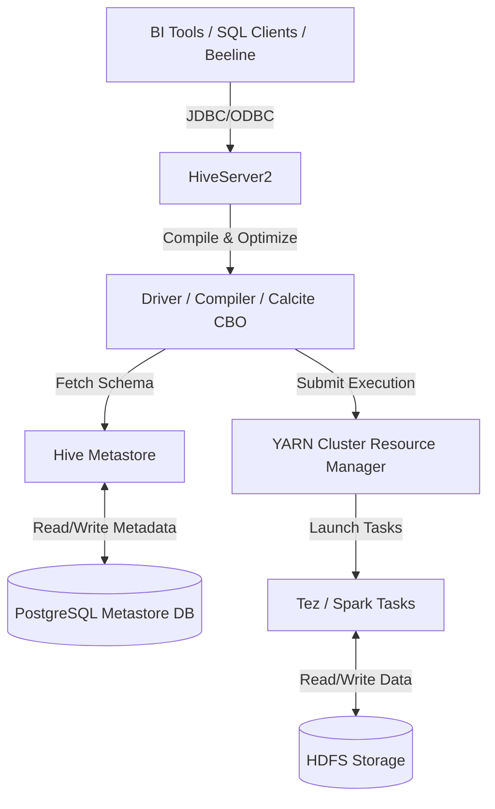
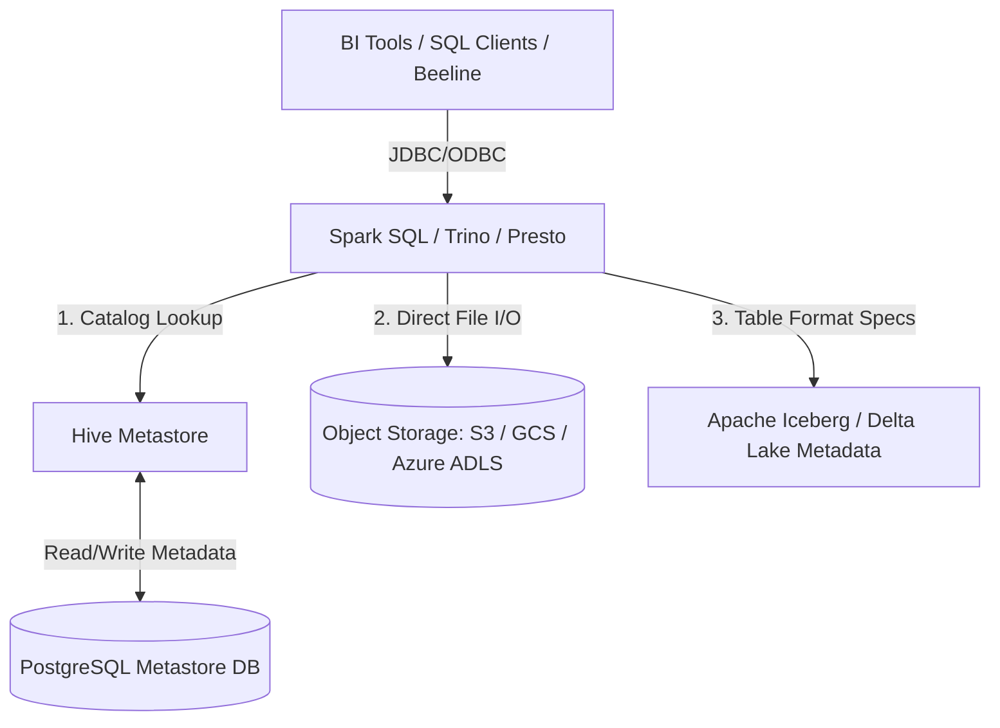
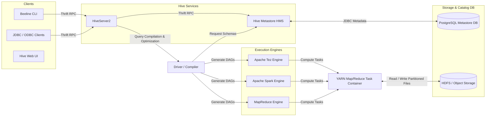
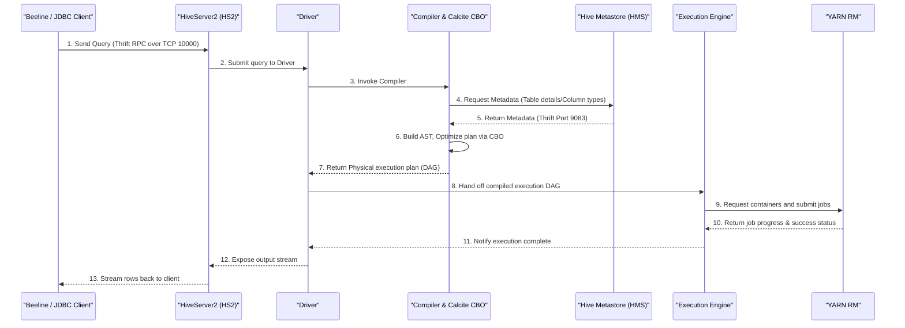
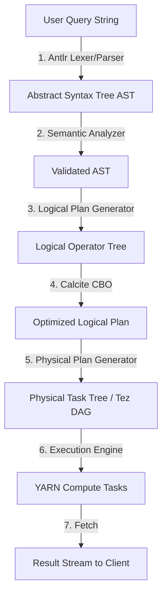
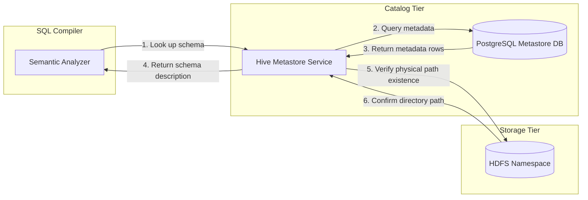
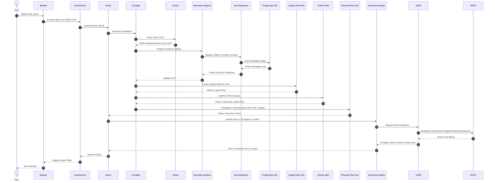
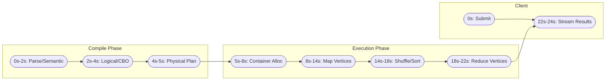
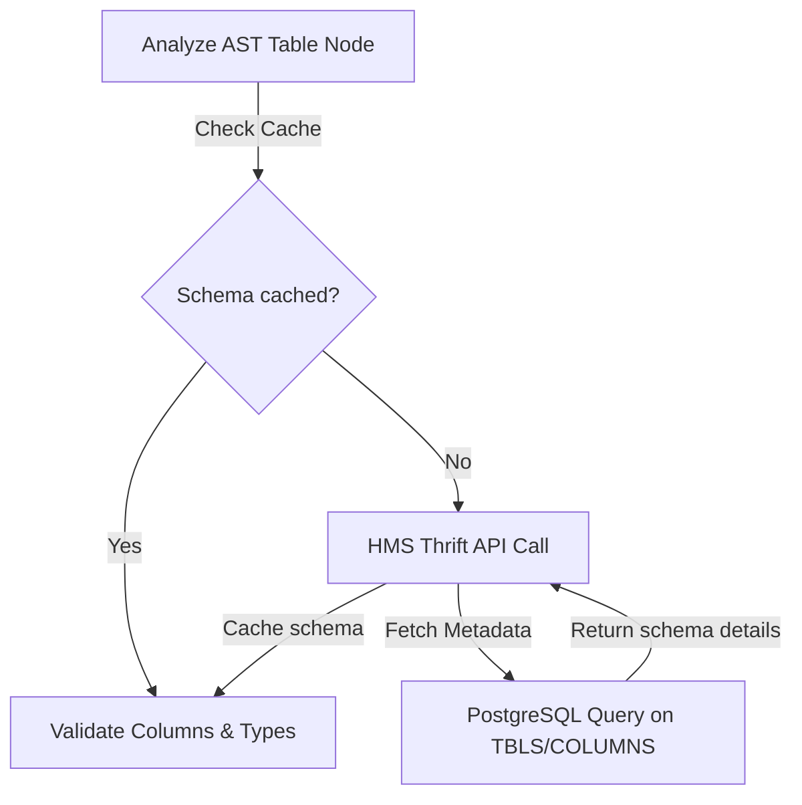
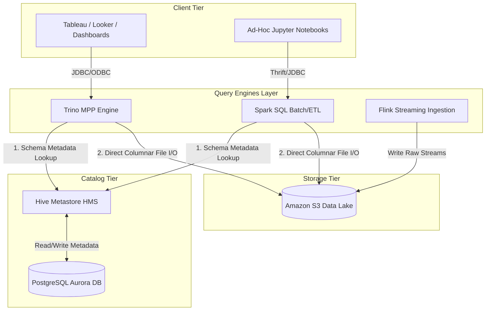

# Apache Hive Architecture
### Subtitle: SQL Interface for Distributed Data Warehousing

Apache Hive is a distributed data warehousing and analytics system built on top of Apache Hadoop. It provides data summarization, ad-hoc querying, and analysis of massive datasets stored in Hadoop-compatible file systems (such as HDFS or cloud object storage like Amazon S3, Google Cloud Storage, and Azure Blob). By offering a SQL-like interface called **HiveQL (Hive Query Language)**, Hive abstractly translates declarative SQL queries into physical execution plans that run on distributed processing frameworks like Apache Tez, Apache Spark, or MapReduce.

---

## 1. Introduction

### What Apache Hive Is
Apache Hive is a metadata catalog, query compiler, and optimization engine that allows users to write SQL queries to read, write, and manage petabytes of data residing in distributed storage. Hive is not a database in the traditional OLTP (Online Transaction Processing) sense; it does not store data in its own proprietary storage format, nor does it have its own dedicated storage or compute resources. Instead, it overlays structure on existing files in HDFS or cloud storage, managing schema definitions independently from the execution engine.

### Why Hive Was Created: The History at Facebook
In the mid-2000s, Facebook's data footprint grew exponentially due to rapid user acquisition. The company adopted Apache Hadoop (HDFS and MapReduce) to store and process this massive volume of raw log data. However, Hadoop presented major operational challenges:
* **The Java Barrier**: Writing analytical queries required writing complex Java MapReduce programs. This limited data accessibility to software engineers who understood MapReduce internals, blocking business analysts, data scientists, and product managers.
* **Boilerplate and Code Duplication**: Creating simple filters, joins, or aggregations required hundreds of lines of Java code, leading to slow development cycles and bug-prone duplicate code.

To address these hurdles, **Joydeep Sen Sarma** and **Ashish Thusoo** created Apache Hive at Facebook in 2007. The goal was to provide a declarative SQL interface that democratized access to Hadoop's distributed files. Hive automatically generated MapReduce jobs from declarative SQL commands, allowing analysts to write queries in seconds that previously took days to implement in Java.

### The Evolution: MapReduce to Tez and Spark
Initially, Hive compiled all SQL queries into Java MapReduce jobs. While this worked for long-running batch ETL, MapReduce had severe limitations:
1. **High Disk and Network I/O**: MapReduce writes intermediate output (the shuffle phase) to local disks and reads it back, causing significant latency.
2. **High JVM Startup Latency**: Spawning JVM containers for every map and reduce task added massive overhead.

To modernise, the architecture evolved to support DAG (Directed Acyclic Graph) execution engines:
* **Apache Tez (Day 15)**: Instead of rigid Map-then-Reduce phases, Tez models physical plans as complex DAGs. It keeps intermediate shuffle data in memory or pipes it directly between stages, eliminating unnecessary HDFS writes and JVM restarts.
* **Apache Spark (Days 16–19)**: Spark runs execution stages in-memory using its Resilient Distributed Dataset (RDD) abstraction, offering near real-time query speeds for interactive SQL workloads.

#### Hive's Position in the Classic Hadoop Stack


#### Hive Metastore (HMS) in the Modern Lakehouse Stack


### Hive's Role in the Modern Hadoop Ecosystem
In modern lakehouse and Hadoop architectures, Hive's role has shifted from being the primary compute engine to serving as the central **Metadata and Catalog standard**:
* **The Semantic Layer**: It defines the database, tables, columns, partition schemes, and data locations.
* **The Hive Metastore (HMS)**: HMS has become the industry-standard metadata repository. Even when companies replace Hive's compute engine with Trino, Presto, or Spark SQL, they still use HMS as the central catalog to locate and parse files on HDFS/S3.

---

## 2. Problem Statement

### Life Before Hive: The MapReduce Complexity
To understand why Hive is revolutionary, consider a standard data analysis task: calculating the total purchase amount by region from a raw transaction file.

#### The Java MapReduce Solution
An engineer would have to write:
1. A **Mapper** class to parse transaction strings, extract the region and purchase amount, and serialize them as key-value pairs (`Text` and `DoubleWritable`).
2. A **Reducer** class to sum the values for each region key.
3. A **Driver** class to configure YARN job settings, define Input/Output formats, specify Jar paths, and handle distributed cache files.

```java
// Mapper Class
public static class SalesMapper extends Mapper<LongWritable, Text, Text, DoubleWritable> {
    private Text region = new Text();
    private DoubleWritable amount = new DoubleWritable();
    
    public void map(LongWritable key, Text value, Context context) throws IOException, InterruptedException {
        String[] tokens = value.toString().split(",");
        if (tokens.length >= 3) {
            region.set(tokens[1]); // Region
            amount.set(Double.parseDouble(tokens[2])); // Sales Amount
            context.write(region, amount);
        }
    }
}

// Reducer Class
public static class SalesReducer extends Reducer<Text, DoubleWritable, Text, DoubleWritable> {
    private DoubleWritable result = new DoubleWritable();
    
    public void reduce(Text key, Iterable<DoubleWritable> values, Context context) throws IOException, InterruptedException {
        double sum = 0;
        for (DoubleWritable val : values) {
            sum += val.get();
        }
        result.set(sum);
        context.write(key, result);
    }
}
```

This required compiling the code, bundling it into a JAR file, uploading it to a gateway machine, and submitting it using the `hadoop jar` command. If the schema changed (e.g., a column was added or repositioned), the Java code had to be rewritten, recompiled, and redeployed.

#### The Hive Solution
With Apache Hive, the same operation is reduced to a standard SQL statement:
```sql
SELECT region, SUM(amount) FROM transactions GROUP BY region;
```

Hive reads the schema definition from its database, finds the file paths in HDFS, parses the text files using its defined Serialization/Deserialization (SerDe) library, and automatically compiles this SQL statement into a Tez DAG containing mapper and reducer operators.

---

## 3. Architecture Deep Dive

The architecture of Apache Hive is modular, separating the client connection interface, the query compilation and optimization engine, the metadata repository, and the physical execution engines.



### Component Breakdown

#### 1. Hive CLI / Beeline
* **Hive CLI (Deprecated)**: An older shell that executed SQL commands by directly initializing a local Hive driver instance. It bypassed security controls and directly read/wrote to HDFS and the Metastore DB.
* **Beeline**: The modern, secure command-line shell. It is built on the **SQLLine** CLI framework and connects to a remote HiveServer2 instance using JDBC. Beeline does not access storage directly; it relies entirely on HS2 for security authentication and execution.

#### 2. JDBC/ODBC Drivers
These drivers establish connections between external clients (such as BI tools like Tableau, Looker, or Python DB-API clients) and HiveServer2. The driver packages SQL queries into **Thrift RPC** calls.

#### 3. HiveServer2 (HS2)
HS2 is the gateway service that manages multiple client connections. It is a multi-threaded service using Thrift RPC protocols. HS2 is responsible for:
* **Session Management**: Authenticating users (via Kerberos, LDAP, or Custom PAM) and tracking session configurations.
* **Concurrency**: Managing multiple queries running in parallel from different users.
* **Security & Auditing**: Enforcing column-level, row-level, and table-level access privileges (often delegated to security plugins like Apache Ranger).

#### 4. Driver
The Driver controls the lifecycle of a query from reception to result retrieval. It instantiates the **Session State** and coordinates:
* **Compiler**: Calling the compiler to analyze the query.
* **Optimizer**: Initiating the optimizer to rewrite the execution flow.
* **Executor**: Submitting the compiled task DAG to YARN.

#### 5. Compiler
The Compiler parses the HiveQL query string and converts it into a machine-readable physical plan. It performs syntactic validation, semantic analysis against the Metastore schema, and generates a Directed Acyclic Graph (DAG) of execution tasks.

#### 6. Optimizer
Hive uses two optimization phases:
* **Rule-Based Optimizer (RBO)**: Re-orders joins, pushes down filter predicates (`WHERE` clauses) closer to the scan phase, and prunes unused partitions using static rules.
* **Cost-Based Optimizer (CBO)**: Built using **Apache Calcite**, the CBO evaluates multiple physical execution paths, calculates the computational cost of each (based on row count, data sizes, and histograms stored in the Metastore), and chooses the most efficient plan.

#### 7. Execution Engine
The execution engine translates the optimized physical plan into execution units and submits them to YARN. Hive supports multiple execution engines:
* **Tez**: The default, highly optimized engine. It schedules tasks in a complex, multi-stage DAG, maximizing in-memory caching.
* **Spark**: Runs HiveQL queries by translating them to Spark jobs.
* **MapReduce (Deprecated)**: Executed by launching MR JARs on YARN.

#### 8. Hive Metastore (HMS)
The Hive Metastore (HMS) is the catalog service. It exposes a Thrift API that stores metadata definitions: table names, columns, data types, physical file formats, and directory structures. HMS provides metadata to query engines (Hive, Spark, Trino, Impala) to let them know *how* to parse the raw data files stored in HDFS.

#### 9. Metastore Database
A relational database (RDBMS) that stores the physical metadata schemas. Popular choices are PostgreSQL, MySQL, Oracle, or Microsoft SQL Server. It does *not* contain the actual user data; it only stores structural metadata (e.g., column definitions, table properties, and file paths).

#### 10. Storage Layer
The storage tier where the actual data blocks are stored. Usually **HDFS** in bare-metal architectures, or **Object Storage** (Amazon S3, Google Cloud Storage, Azure ADLS) in cloud-native platforms.

---

### Component Interaction Diagram


### Query Lifecycle Diagram


### Metadata Flow Diagram


---

## 4. Internal Working

### Step-by-Step Query Execution Phases

When a user submits a query via Beeline, the SQL transitions through several internal execution stages before returning results.



#### Phase 1: Parsing
The Driver sends the raw query string to the **Parser**. Using **Antlr** (a parser generator), the Parser conducts lexical analysis to verify that the query follows HiveQL syntax rules. It outputs an **Abstract Syntax Tree (AST)** where nodes represent SQL operators (e.g., `TOK_SELECT`, `TOK_WHERE`, `TOK_FROM`).

#### Phase 2: Semantic Analysis
The AST is passed to the **Semantic Analyzer**. This stage validates the schema requirements of the query:
1. It queries the **Hive Metastore** (HMS) to check if the tables and columns referenced in the query exist.
2. It verifies data types to ensure type compatibility (e.g., confirming that you are not adding a string to an integer without casting).
3. It resolves views, expansions, and database aliases.

#### Phase 3: Logical Plan Generation
The compiler translates the validated AST into a **Logical Plan** (represented as a tree of relational algebra operators). Each operator represents a data transformation:
* `TableScanOperator` (Scans files from storage)
* `FilterOperator` (Filters records)
* `SelectOperator` (Projects columns)
* `JoinOperator` (Joins two streams)
* `FileSinkOperator` (Writes results)

#### Phase 4: Optimization (Calcite CBO)
The logical plan is fed into the **Calcite Cost-Based Optimizer**. Calcite performs semantic transformations:
* **Join Reordering**: Re-ordering joins based on historical table sizes to process the smallest datasets first.
* **Predicate Pushdown**: Moving the filter operations (`FilterOperator`) down the execution plan so they are applied directly during `TableScan`, minimizing the amount of data transferred over the network.
* **Partition Pruning**: Reading the partition directory structure from HMS and removing unneeded partition directories from the file scanning queue.

#### Phase 5: Physical Plan Generation
The optimized logical plan is translated into a **Physical Plan** consisting of tasks organized in a dependency tree. For a Tez engine, this means dividing the relational operators into Map and Reduce tasks and building a Tez DAG. For instance, a `GroupByOperator` is split into a local aggregation task (Map stage) and a global aggregation task (Reduce stage).

#### Phase 6: Query Execution
The Driver receives the physical task tree from the compiler. The Execution Engine sends the task DAG to the YARN Resource Manager. YARN schedules and runs the map and reduce tasks across Tez/Spark containers on the cluster. The tasks read block segments from HDFS, perform processing, and write final outputs to a temporary directory in HDFS.

#### Phase 7: Result Fetching
The Driver reads the output files from HDFS and streams the rows back to HiveServer2. HS2 formats the output according to the user's connection protocol and streams it back to Beeline, which displays the results in the console.

---

### Query Execution Timeline


### Metadata Lookup Flow


---

## 5. Core Concepts & Metadata Management

### 1. The Hive Metastore (HMS) Architecture
The Hive Metastore stores the schemas of all databases and tables defined in Hive. It supports three connection models:

| Metastore Mode | Architecture Description | Pros | Cons |
| :--- | :--- | :--- | :--- |
| **Embedded (Local Derby)** | The Metastore service and the RDBMS (Derby) run inside the same Java process as the Hive CLI client. | Easy to set up; no configuration required. | Only one user session can connect at a time; data is lost if the directory is deleted. |
| **Local Metastore** | The Metastore service runs inside the client process, but connects to an external RDBMS (e.g., PostgreSQL/MySQL) over JDBC. | Allows multiple sessions. | Each client needs DB connection credentials; changes in DB schema require updating all clients. |
| **Remote Metastore (Production Standard)** | The Metastore runs as a standalone server (`HiveMetaStore`). Clients connect to it using Thrift RPC (`thrift://host:9083`). HMS connects to PostgreSQL. | Secure; isolates DB credentials; scales horizontally. | Additional service to deploy, monitor, and load-balance. |

> [!TIP]
> **Production Standard**: Always use **Remote Metastore** in production. It isolates your metadata database from arbitrary client connections and enables easy scaling of client applications (like Spark or Trino) without sharing database passwords.

### 2. Databases & Table Namespaces
A database is a logical namespace grouping related tables. In HDFS, databases map directly to parent directories:
* Default Database Path: `/user/hive/warehouse/`
* Custom Database `sales_db` Path: `/user/hive/warehouse/sales_db.db/`

### 3. Managed vs. External Tables
Understanding the lifecycle difference between Managed (Internal) and External tables is critical for production safety:

| Feature | Managed Tables (Internal) | External Tables |
| :--- | :--- | :--- |
| **Storage Management** | Hive manages both data files and metadata. | Hive only manages metadata; data files are managed externally. |
| **Default Location** | `/user/hive/warehouse/dbname.db/tablename/` | Any user-specified directory in HDFS/S3/GCS. |
| **DROP Semantics** | Deletes **both** the schema metadata and the HDFS data files. | Deletes **only** the schema metadata. The HDFS data files remain intact. |
| **Best For** | Temporary tables, ETL staging tables, and ACID transactional tables. | Raw incoming logs, data shared with other engines (Spark, Trino). |

```
Managed Table Drop:
[DROP TABLE managed_table] ──> Deletes METADATA (HMS) AND Deletes DATA (HDFS)

External Table Drop:
[DROP TABLE external_table] ──> Deletes METADATA (HMS) BUT Preserves DATA (HDFS)
```

> [!CAUTION]
> **Common Mistake**: Dropping a managed table thinking it behaves like an external table. This will permanently delete your HDFS data! Always declare shared raw datasets as `EXTERNAL`.

### 4. Partitions
Partitions split a table into physical subdirectories based on the values of one or more columns (e.g., date, region, department).

```
hdfs://namenode:9000/user/hive/warehouse/sales/
  ├── country=US/
  │   ├── state=NY/
  │   │   └── data_0001.orc
  │   └── state=CA/
  │       └── data_0002.orc
  └── country=CA/
      └── state=ON/
          └── data_0003.orc
```

* **Why it exists**: It prevents full-table scans. If you query `WHERE country='US' AND state='NY'`, the TableScan operator scans *only* that specific subdirectory, reducing read overhead.
* **Static vs. Dynamic Partitioning**:
  * **Static**: You must explicitly declare the partition values in the insert query:
    ```sql
    INSERT INTO sales PARTITION(country='US', state='NY') SELECT id, amount FROM staging_sales;
    ```
  * **Dynamic**: Hive automatically determines the partition subdirectories based on the values of the last columns in the select statement:
    ```sql
    INSERT INTO sales PARTITION(country, state) SELECT id, amount, country, state FROM staging_sales;
    ```

> [!IMPORTANT]
> **Partition Limits (The Small Files Problem)**: Allowing unconstrained dynamic partitioning can lead to the creation of thousands of partition directories, each containing only a few kilobytes. This exhausts memory on the HDFS NameNode and causes JVM overhead. Always limit dynamic partitions using `hive.exec.max.dynamic.partitions`.

### 5. Bucketing
Bucketing (Clustering) divides table files into fixed segments based on a hash function of a specific column.

```
Hash(UserID) % NumberOfBuckets (e.g., 4) ──> bucket_0, bucket_1, bucket_2, bucket_3
```

* **Why it exists**:
  * **Map-Side Joins**: If two tables are bucketed on the same join key and have matching or multiple bucket counts, Hive can execute a **Sort-Merge Bucket (SMB) Join**. This joins the tables partition-by-partition in memory, avoiding a cluster-wide shuffle.
  * **Sampling**: It allows quick, randomized sampling of records (e.g., `TABLESAMPLE (BUCKET 1 OUT OF 4 ON userid)`).
* **Difference from Partitioning**: Partitioning creates subdirectories based on column values; bucketing splits data into a fixed number of physical files within those directories.

### 6. SerDe (Serializer/Deserializer)
A SerDe is a plugin interface that allows Hive to read data from a file and write it back:
* **Deserializer**: Translates raw data records (e.g., JSON strings, CSV lines) into Java objects that Hive can process.
* **Serializer**: Translates Hive's internal Java row objects back into the target format for storage.

```
Raw File (HDFS) ──[Deserializer]──> Java Row Object (Hive) ──[Serializer]──> Raw File (HDFS)
```

### 7. File Formats Comparison
Choosing the right file format is the most important decision for production performance:

| File Format | Type | Compression | Splitable? | Best For |
| :--- | :--- | :--- | :--- | :--- |
| **TextFile** | Row-oriented | Poor | Yes (if uncompressed or using splitable codecs like LZO/BZIP2) | Ad-hoc exports, loading raw logs, debugging |
| **Avro** | Row-oriented | Excellent | Yes | Raw data ingestion landing zones; handles complex, evolving schemas |
| **Parquet** | Columnar | High | Yes | Analytical queries, Spark SQL integration, nested structures |
| **ORC** | Columnar | Very High | Yes | Heavy read workloads, transactional ACID tables, vectorized execution |

---

## 6. Production Engineering

### 1. Scaling HiveServer2 and High Availability (HA)
In production, a single HiveServer2 instance can become a bottleneck or a single point of failure (SPOF). To scale:
1. **Horizontal Scaling**: Deploy multiple active-active HiveServer2 instances.
2. **ZooKeeper Service Discovery**: Configure HS2 to register itself in Apache ZooKeeper under a specific namespace (`/hiveserver2`).
3. **Dynamic Routing**: JDBC clients connect using a ZooKeeper connection string. ZooKeeper automatically routes the client to an available HS2 instance.

```
JDBC URL: jdbc:hive2://zk1:2181,zk2:2181,zk3:2181/;serviceDiscoveryMode=zooKeeper;zooKeeperNamespace=hiveserver2
```

### 2. Metastore High Availability (HMS HA)
To prevent the Hive Metastore from failing:
* Run multiple instances of the HMS thrift service (`HiveMetaStore`) on different physical servers.
* Configure client-side failover in the `hive-site.xml` of client gateways:
  ```xml
  <property>
    <name>hive.metastore.uris</name>
    <value>thrift://hms1:9083,thrift://hms2:9083</value>
  </property>
  ```
  The JDBC client will try connecting to `hms1`. If it is down, it fails over to `hms2`.
* Configure the underlying Metastore Database (PostgreSQL/MySQL) in a High Availability setup (Active-Passive with replication).

### 3. Performance Tuning Checklist
* **Vectorized Query Execution**: Processes data in batches of 1024 rows instead of row-by-row, leveraging CPU cache optimizations:
  ```xml
  <property>
    <name>hive.vectorized.execution.enabled</name>
    <value>true</value>
  </property>
  ```
* **Cost-Based Optimizer (CBO)**: Enable the Calcite optimizer and auto-gather metrics:
  ```xml
  <property>
    <name>hive.cbo.enable</name>
    <value>true</value>
  </property>
  <property>
    <name>hive.stats.autogather</name>
    <value>true</value>
  </property>
  ```
* **Map Join Optimization**: Automatically converts standard shufflable joins into Map Joins if the size of the smaller table is below a threshold, eliminating the reducer shuffle step:
  ```xml
  <property>
    <name>hive.auto.convert.join</name>
    <value>true</value>
  </property>
  <property>
    <name>hive.auto.convert.join.noconditionaltask.size</name>
    <value>26214400</value> <!-- 25 MB -->
  </property>
  ```

* **Memory and JVM Tuning**:
  In a production environment, configure HiveServer2 with the G1 Garbage Collector to avoid long "Stop-the-World" pauses when processing large metadata sets:
  ```bash
  export HADOOP_OPTS="$HADOOP_OPTS -Xms8g -Xmx8g -XX:+UseG1GC -XX:InitiatingHeapOccupancyPercent=35 -XX:G1ReservePercent=15"
  ```

### 4. ORC vs. Parquet Comparison
While both are columnar formats, they differ in execution mechanics and design target areas:

| Feature | ORC (Optimized Row Columnar) | Parquet |
| :--- | :--- | :--- |
| **Origin** | Created for Apache Hive (Hortonworks). | Created for Apache Avro/Thrift/Protocol Buffers (Cloudera/Twitter). |
| **Index Types** | Row index, Stripe index, File statistics (Min/Max). | Column index, Page header statistics (Min/Max). |
| **ACID support** | Native support for Hive ACID transactions. | Does not support Hive ACID natively. |
| **Platform Compatibility** | Highly optimized for Hive and Tez. | Universally supported across Spark, Trino, Impala, and Flink. |

### 5. Security: Kerberos and Ranger
* **Authentication (Kerberos)**: Prevents unauthorized users from spoofing usernames over JDBC. HS2, HMS, and HDFS require valid Kerberos tickets to interact. HS2 uses Kerberos delegation tokens to access HDFS blocks under the caller's identity.
* **Authorization (Apache Ranger)**: Provides a central UI to define access policies. For example, you can allow a `data_analyst` group to select data from `orders`, but mask the `credit_card` column and restrict access to rows where `country = 'US'`.

### 6. Monitoring and Observability
* **JMX Metrics**: Expose HiveServer2 and HMS metrics via JMX. Monitor connection pool health (`NumActiveConnections`, `NumIdleConnections`) and active query durations.
* **Log Directory**: Monitor `/var/log/hive/hiveserver2.log` and `/var/log/hive/hive-metastore.log` for JDBC exceptions, database connection timeouts, and JVM resource limits.

### 7. Production Best Practices
1. **Never run queries without partition filters** on partitioned tables.
2. **Limit maximum dynamic partitions** to avoid the small files problem.
3. **Use ORC/Parquet** instead of TextFile for analytical queries.
4. **Tune table statistics regularly** using `ANALYZE TABLE` so Calcite CBO can choose optimal join orders.
5. **Isolate the Metastore DB** from direct application queries; always go through HMS.
6. **Set `hive.server2.enable.doAs` to `false`** if you want HiveServer2 to execute HDFS commands under the `hive` system user identity, simplifying permission management.
7. **Scale HS2 horizontally** behind ZooKeeper for active-active high availability.
8. **Combine small files** at the end of execution stages (`hive.merge.tezfiles=true`).
9. **Tune G1GC parameters** to prevent JVM pauses on large query sessions.
10. **Implement Ranger Column Masking** to secure PII data instead of creating duplicate tables/views.

---

## 7. Hands-On Lab

This lab guides you through starting a local containerized Hive environment, initializing the metastore, loading datasets, running queries, and analyzing physical execution plans.

### Lab 1: Deploy Hive and HDFS Cluster
Start the cluster using Docker Compose:
```bash
cd Day-20-Hive-Architecture-HMS/docker
docker compose build
docker compose up -d
```
Verify that all containers (`postgres-metastore-db-day20`, `namenode-day20`, `datanode-day20`, `hive-metastore-day20`, `hiveserver2-day20`) are running and healthy:
```bash
docker compose ps
```

### Lab 2: Initialize Database and Hive Tables
1. Open a bash session inside the HiveServer2 container:
   ```bash
   docker compose exec hiveserver2 bash
   ```
2. Launch the Beeline client:
   ```bash
   beeline -u "jdbc:hive2://localhost:10000" -n hive -p hive
   ```
3. Create a new database for the lab:
   ```sql
   CREATE DATABASE IF NOT EXISTS lab_db;
   USE lab_db;
   ```

### Lab 3: Create Databases
Create a custom database specifying a target directory in HDFS:
```sql
CREATE DATABASE IF NOT EXISTS lab_sales_db 
COMMENT 'Database for Sales Department' 
LOCATION '/user/hive/warehouse/sales_custom.db';
```
Verify its creation and configuration in the metastore:
```sql
DESCRIBE DATABASE EXTENDED lab_sales_db;
```

### Lab 4: Create Managed and External Tables
Run the following SQL to create a managed ORC table and an external text table:
```sql
USE lab_db;

-- Managed Table
CREATE TABLE IF NOT EXISTS managed_sales (
    sale_id INT,
    region STRING,
    amount DOUBLE
) 
STORED AS ORC;

-- External Table
CREATE EXTERNAL TABLE IF NOT EXISTS external_customers (
    customer_id INT,
    name STRING,
    country STRING
) 
ROW FORMAT DELIMITED 
FIELDS TERMINATED BY ',' 
STORED AS TEXTFILE 
LOCATION '/tmp/lab_customers';
```

### Lab 5: Load Sample Data
1. **Load data into the Managed table** using standard INSERT statements (which compiles to a write job):
   ```sql
   INSERT INTO managed_sales VALUES 
   (1, 'North', 1500.50),
   (2, 'South', 800.20),
   (3, 'North', 2300.00),
   (4, 'West', 1250.75);
   ```

2. **Load data into the External table** by placing a CSV file in HDFS.
   Exit Beeline (`!q`) and run these shell commands:
   ```bash
   # Create a CSV file
   mkdir -p /tmp/data
   cat <<EOF > /tmp/data/customers.csv
   101,John Doe,US
   102,Jane Smith,CA
   103,Pierre Dupont,FR
   104,Yuki Tanaka,JP
   EOF

   # Upload the CSV file to the HDFS directory mapped to the external table
   hadoop fs -mkdir -p /tmp/lab_customers
   hadoop fs -put -f /tmp/data/customers.csv /tmp/lab_customers/
   ```

3. Re-enter Beeline and verify the data is visible:
   ```bash
   beeline -u "jdbc:hive2://localhost:10000" -n hive -p hive -e "SELECT * FROM lab_db.external_customers;"
   ```

### Lab 6: Run Analytical SQL Queries
Execute an aggregation query joining the managed sales table and external customer table:
```sql
USE lab_db;

SELECT 
    c.country, 
    COUNT(s.sale_id) AS transaction_count, 
    SUM(s.amount) AS total_revenue
FROM managed_sales s
JOIN external_customers c ON (s.sale_id = c.customer_id - 100)
GROUP BY c.country;
```

### Lab 7: Inspect Execution Plans
Prepend `EXPLAIN` to your query to view the logical operators and execution stages generated by Hive:
```sql
EXPLAIN 
SELECT region, SUM(amount) 
FROM managed_sales 
GROUP BY region;
```
Expected execution plan output segments to analyze:
```
STAGE DEPENDENCIES:
  Stage-1 is a root stage
  Stage-0 depends on Stage-1

STAGE PLANS:
  Stage-1 
    Tez
      Vertices:
        Map 1 
            TableScan
              alias: managed_sales
              Statistics: Num rows: 4 Data size: 736 Basic stats: COMPLETE Column stats: NONE
            Select Operator
              expressions: region (type: string), amount (type: double)
              outputColumnNames: _col0, _col1
            Group By Operator
              aggregations: sum(_col1)
              keys: _col0 (type: string)
              mode: hash
              outputColumnNames: _col0, _col1
            Reduce Output Operator
              key expressions: _col0 (type: string)
              sort order: +
              Map-reduce partitioner: org.apache.hadoop.hive.ql.io.DefaultHivePartitioner
              value expressions: _col1 (type: double)
        Reducer 2 
            Group By Operator
              aggregations: sum(_col0)
              keys: KEY._col0 (type: string)
              mode: mergepartial
              outputColumnNames: _col0, _col1
            File Sink Operator
              directory: hdfs://namenode:9000/tmp/hive/hive_...
              format: org.apache.hadoop.hive.ql.io.HiveIgnoreKeyTextOutputFormat
```

---

## 8. Build From Source

Building Hive from source allows developers to apply custom patches, update internal dependencies, or compile for specific environments.

### Official GitHub Repository
* Repository URL: [https://github.com/apache/hive](https://github.com/apache/hive)
* Official Stable Branch: `branch-3.1` or releases like `release-3.1.3`.

### Source Tree Structure
* `common/`: Shared utility classes and system-wide configurations.
* `serde/`: Implementations of built-in SerDes (Avro, ORC, Parquet, JSON).
* `metastore/`: Source code for the standalone Metastore service and database schemas.
* `ql/`: Query Processor and compiler engine (contains parser, planner, optimizer, and physical engine translators).
* `service/`: HiveServer2 implementation, Thrift connection handlers, and session managers.
* `jdbc/`: Hive JDBC driver class implementations.

### Maven Build Lifecycle Command
Compile and build the binary distribution, skipping unit tests:
```bash
mvn clean package -Pdist -DskipTests -Dmaven.javadoc.skip=true
```

### Compilation Troubleshooting
* **Java Version Out of Range**: Apache Hive 3 compiles using Java 8. Building it with Java 11 or later can lead to compilation errors in the compiler module due to deprecated annotation APIs. Use `export JAVA_HOME=/path/to/jdk-8`.
* **Out of Memory (OOM) Errors**: Increase Maven's memory allocation before building:
      ```bash
      export MAVEN_OPTS="-Xmx2048m -XX:MaxMetaspaceSize=512m"
      ```

---

## 9. Docker Deployment

The containerized setup uses a custom Dockerfile to install Hadoop and Hive components on a single base layer, while Docker Compose sets up the network and services.

### Dockerfile
Path: [docker/Dockerfile](file:///d:/30_Days_of_Modern_Hadoop_Ecosystem/Day-20-Hive-Architecture-HMS/docker/Dockerfile)
```dockerfile
FROM eclipse-temurin:11-jdk

# Install system dependencies
RUN apt-get update && apt-get install -y --no-install-recommends \
    curl \
    tar \
    procps \
    netcat-openbsd \
    postgresql-client \
    openssh-server \
    openssh-client \
    rsync \
    && rm -rf /var/lib/apt/lists/*

# Set Version Variables
ENV HADOOP_VERSION=3.3.6
ENV HIVE_VERSION=3.1.3

# Set Home Environments
ENV HADOOP_HOME=/opt/hadoop
ENV HIVE_HOME=/opt/hive
ENV JAVA_HOME=/opt/java/openjdk

# Add components to PATH
ENV PATH=$PATH:$HADOOP_HOME/bin:$HADOOP_HOME/sbin:$HIVE_HOME/bin

# 1. Download and Install Hadoop
RUN echo "Downloading Apache Hadoop $HADOOP_VERSION..." && \
    curl -sSL https://archive.apache.org/dist/hadoop/common/hadoop-$HADOOP_VERSION/hadoop-$HADOOP_VERSION.tar.gz | tar -xz -C /opt && \
    mv /opt/hadoop-$HADOOP_VERSION $HADOOP_HOME

# 2. Download and Install Hive
RUN echo "Downloading Apache Hive $HIVE_VERSION..." && \
    curl -sSL https://archive.apache.org/dist/hive/hive-$HIVE_VERSION/apache-hive-$HIVE_VERSION-bin.tar.gz | tar -xz -C /opt && \
    mv /opt/apache-hive-$HIVE_VERSION-bin $HIVE_HOME

# 3. Resolve Hive-Hadoop Guava Conflict (CRITICAL production step)
# Hive 3.1.3 ships with Guava 19.0. Hadoop 3.3.6 ships with Guava 29.0-jre.
# Having Guava 19.0 in Hive's classpath causes a NoSuchMethodError when communicating with Hadoop.
RUN rm -f $HIVE_HOME/lib/guava-19.0.jar && \
    cp $HADOOP_HOME/share/hadoop/common/lib/guava-29.0-jre.jar $HIVE_HOME/lib/

# 4. Download and Install PostgreSQL JDBC Driver (Required for Metastore DB)
RUN echo "Downloading PostgreSQL JDBC Driver..." && \
    curl -sSL https://jdbc.postgresql.org/download/postgresql-42.6.0.jar -o $HIVE_HOME/lib/postgresql-42.6.0.jar

# 5. Create directories for data storage and logging
RUN mkdir -p /hadoop/dfs/name /hadoop/dfs/data /hadoop/dfs/tmp /var/log/hive /workspace

# Setup passwordless SSH for Hadoop admin scripts
RUN ssh-keygen -t rsa -P '' -f ~/.ssh/id_rsa && \
    cat ~/.ssh/id_rsa.pub >> ~/.ssh/authorized_keys && \
    chmod 0600 ~/.ssh/authorized_keys

# Copy Bootstrap script
COPY bootstrap.sh /entrypoint.sh
RUN chmod +x /entrypoint.sh

# Expose Cluster Ports
EXPOSE 9870 9000 9864 9083 10000 10002

WORKDIR /workspace

ENTRYPOINT ["/entrypoint.sh"]
CMD ["hiveserver2"]
```

### Docker Compose
Path: [docker/docker-compose.yml](file:///d:/30_Days_of_Modern_Hadoop_Ecosystem/Day-20-Hive-Architecture-HMS/docker/docker-compose.yml)
```yaml
version: '3.8'

services:
  # 1. METASTORE DATABASE (PostgreSQL backend)
  postgres-metastore-db:
    image: postgres:15-alpine
    container_name: postgres-metastore-db-day20
    restart: unless-stopped
    ports:
      - "5432:5432"
    environment:
      POSTGRES_DB: metastore_db
      POSTGRES_USER: hive
      POSTGRES_PASSWORD: hive
    volumes:
      - postgres_data_day20:/var/lib/postgresql/data
    healthcheck:
      test: ["CMD-SHELL", "pg_isready -U hive -d metastore_db"]
      interval: 5s
      timeout: 5s
      retries: 5
    networks:
      - day20-network

  # 2. HDFS NAMENODE
  namenode:
    build:
      context: .
      dockerfile: Dockerfile
    container_name: namenode-day20
    restart: unless-stopped
    ports:
      - "9870:9870"  # HDFS Namenode Web UI
      - "9000:9000"  # HDFS Namenode RPC Port
    environment:
      - HADOOP_CONF_DIR=/opt/hadoop/etc/hadoop
    volumes:
      - namenode_data_day20:/hadoop/dfs/name
      - ../:/workspace
    command: ["namenode"]
    healthcheck:
      test: ["CMD", "curl", "-f", "http://localhost:9870/"]
      interval: 10s
      timeout: 5s
      retries: 5
    networks:
      - day20-network

  # 3. HDFS DATANODE
  datanode:
    build:
      context: .
      dockerfile: Dockerfile
    container_name: datanode-day20
    restart: unless-stopped
    ports:
      - "9864:9864"  # HDFS Datanode Web UI
    depends_on:
      namenode:
        condition: service_healthy
    environment:
      - HADOOP_CONF_DIR=/opt/hadoop/etc/hadoop
    volumes:
      - datanode_data_day20:/hadoop/dfs/data
      - ../:/workspace
    command: ["datanode"]
    healthcheck:
      test: ["CMD", "curl", "-f", "http://localhost:9864/"]
      interval: 10s
      timeout: 5s
      retries: 5
    networks:
      - day20-network

  # 4. HIVE METASTORE SERVER (HMS)
  hive-metastore:
    build:
      context: .
      dockerfile: Dockerfile
    container_name: hive-metastore-day20
    restart: unless-stopped
    ports:
      - "9083:9083"  # HMS Thrift Port
    depends_on:
      postgres-metastore-db:
        condition: service_healthy
      namenode:
        condition: service_healthy
    environment:
      - HADOOP_CONF_DIR=/opt/hadoop/etc/hadoop
      - HIVE_CONF_DIR=/opt/hive/conf
    volumes:
      - ../:/workspace
    command: ["metastore"]
    healthcheck:
      test: ["CMD-SHELL", "nc -z localhost 9083"]
      interval: 10s
      timeout: 5s
      retries: 5
    networks:
      - day20-network

  # 5. HIVESERVER2 (HS2)
  hiveserver2:
    build:
      context: .
      dockerfile: Dockerfile
    container_name: hiveserver2-day20
    restart: unless-stopped
    ports:
      - "10000:10000"  # HS2 Thrift JDBC Port
      - "10002:10002"  # HS2 Web UI Port
    depends_on:
      hive-metastore:
        condition: service_healthy
    environment:
      - HADOOP_CONF_DIR=/opt/hadoop/etc/hadoop
      - HIVE_CONF_DIR=/opt/hive/conf
    volumes:
      - ../:/workspace
    command: ["hiveserver2"]
    healthcheck:
      test: ["CMD-SHELL", "nc -z localhost 10000"]
      interval: 10s
      timeout: 5s
      retries: 5
    networks:
      - day20-network

networks:
  day20-network:
    name: day20-network
    driver: bridge

volumes:
  postgres_data_day20:
  namenode_data_day20:
  datanode_data_day20:
```

### Startup Instructions
1. Run `docker compose up -d` inside the docker directory.
2. Wait for `namenode` and `postgres` health checks to pass.
3. The `bootstrap.sh` entrypoint will format the Namenode (if empty), spin up HDFS directories, check the Postgres schema with `schematool`, initialize it if empty, and launch the HMS and HS2 daemons.

---

## 10. Local Cluster Deployment

For staging or production bare-metal clusters, follow these manual deployment guidelines:

```
[Client App] ──> [HiveServer2 Instance (Port 10000)]
                        │
                        ├──> [HDFS NameNode (Port 9000)]
                        │
                        └──> [Hive Metastore (Port 9083)] ──> [PostgreSQL DB]
```

### 1. Configure hive-site.xml
Copy the template `hive-default.xml` to `hive-site.xml` and update these properties:
```xml
<!-- PostgreSQL DB Backend -->
<property>
  <name>javax.jdo.option.ConnectionURL</name>
  <value>jdbc:postgresql://postgres-primary.internal:5432/metastore_db</value>
</property>
<property>
  <name>javax.jdo.option.ConnectionDriverName</name>
  <value>org.postgresql.Driver</value>
</property>
<property>
  <name>javax.jdo.option.ConnectionUserName</name>
  <value>hive</value>
</property>
<property>
  <name>javax.jdo.option.ConnectionPassword</name>
  <value>secure_password</value>
</property>

<!-- Remote Metastore URIs -->
<property>
  <name>hive.metastore.uris</name>
  <value>thrift://hms-1.internal:9083,thrift://hms-2.internal:9083</value>
</property>
```

### 2. Copy Configuration Files
Copy `hive-site.xml`, `core-site.xml`, and `hdfs-site.xml` to all nodes running HiveServer2, Hive Metastore, or Spark clients.

### 3. Initialize the Relational Schema
Run the schema tool from the primary Metastore host:
```bash
$HIVE_HOME/bin/schematool -dbType postgres -initSchema
```

### 4. Start Standalone Daemon Services
Start Hive Metastore in the background on the metastore hosts:
```bash
nohup hive --service metastore > /var/log/hive/hive-metastore.log 2>&1 &
```
Start HiveServer2 in the background on gateway hosts:
```bash
nohup hive --service hiveserver2 > /var/log/hive/hiveserver2.log 2>&1 &
```

### 5. Configure Spark SQL to share HMS
To allow Apache Spark SQL queries to read Hive tables, copy your `hive-site.xml` and the PostgreSQL JDBC driver jar into Spark's config and library folders:
```bash
cp /opt/hive/conf/hive-site.xml /opt/spark/conf/
cp /opt/hive/lib/postgresql-42.6.0.jar /opt/spark/jars/
```
In your Spark Application initialization code, enable Hive Support:
```python
from pyspark.sql import SparkSession

spark = SparkSession.builder \
    .appName("Spark-Hive-Integration") \
    .config("spark.sql.warehouse.dir", "/user/hive/warehouse") \
    .enableHiveSupport() \
    .getOrCreate()
```

---

## 11. Validation

Validation scripts are provided inside the `scripts/` folder to verify the health of each service.

### Master Script: `verify-hive.sh`
Path: [scripts/verify-hive.sh](file:///d:/30_Days_of_Modern_Hadoop_Ecosystem/Day-20-Hive-Architecture-HMS/scripts/verify-hive.sh)
```bash
#!/bin/bash
# Day 20: Apache Hive & Metastore Master Verification Script
set -e

SCRIPT_DIR="$(cd "$(dirname "${BASH_SOURCE[0]}")" && pwd)"

echo "========================================================================="
echo "🐝 Starting Apache Hive & Metastore (HMS) Integration Tests"
echo "========================================================================="

# 1. Run Metastore verification
echo ""
echo "🔄 [Test 1/3] Verifying Hive Metastore Service (HMS)..."
"$SCRIPT_DIR/verify-metastore.sh" hive-metastore

# 2. Run HiveServer2 verification
echo ""
echo "🔄 [Test 2/3] Verifying HiveServer2 (HS2) JDBC Connectivity..."
"$SCRIPT_DIR/verify-hiveserver2.sh" localhost

# 3. Run Table Operations verification
echo ""
echo "🔄 [Test 3/3] Verifying Table Operations (DDL, DML, Managed/External)..."
"$SCRIPT_DIR/verify-tables.sh" localhost

echo ""
echo "========================================================================="
echo "🎉 SUCCESS: All Apache Hive verification stages completed successfully!"
echo "========================================================================="
```

### Metastore Prober: `verify-metastore.sh`
Path: [scripts/verify-metastore.sh](file:///d:/30_Days_of_Modern_Hadoop_Ecosystem/Day-20-Hive-Architecture-HMS/scripts/verify-metastore.sh)
```bash
#!/bin/bash
# Day 20: Apache Hive Metastore Verification Script
set -e

HMS_HOST=${1:-"hive-metastore"}
HMS_PORT=9083

echo "=== 🔍 STEP 1: Probing Hive Metastore thrift port ($HMS_HOST:$HMS_PORT) ==="
if nc -z "$HMS_HOST" "$HMS_PORT"; then
  echo "✅ Success: Hive Metastore is listening on port $HMS_PORT."
else
  echo "❌ Error: Hive Metastore is offline or unreachable on $HMS_HOST:$HMS_PORT."
  exit 1
fi

echo "=== 🔍 STEP 2: Verifying PostgreSQL Schema status ==="
if /opt/hive/bin/schematool -dbType postgres -info > /dev/null 2>&1; then
  echo "✅ Success: Hive Metastore schema is active and validated in PostgreSQL."
else
  echo "❌ Error: Hive Metastore database connection failed or schema is uninitialized."
  exit 1
fi

echo "=== 🎉 Hive Metastore Service (HMS) Verification Passed! ==="
```

### HS2 Prober: `verify-hiveserver2.sh`
Path: [scripts/verify-hiveserver2.sh](file:///d:/30_Days_of_Modern_Hadoop_Ecosystem/Day-20-Hive-Architecture-HMS/scripts/verify-hiveserver2.sh)
```bash
#!/bin/bash
# Day 20: HiveServer2 (HS2) Verification Script
set -e

HS2_HOST=${1:-"localhost"}
HS2_PORT=10000

echo "=== 🔍 STEP 1: Probing HiveServer2 JDBC thrift port ($HS2_HOST:$HS2_PORT) ==="
if nc -z "$HS2_HOST" "$HS2_PORT"; then
  echo "✅ Success: HiveServer2 is listening on port $HS2_PORT."
else
  echo "❌ Error: HiveServer2 is offline or unreachable on $HS2_HOST:$HS2_PORT."
  exit 1
fi

echo "=== 🔍 STEP 2: Running a basic query via Beeline client ==="
if /opt/hive/bin/beeline -u "jdbc:hive2://$HS2_HOST:$HS2_PORT" -n hive -p hive -e "SELECT 'HiveServer2 Connection OK' AS status;" > /tmp/beeline_test.log 2>&1; then
  echo "✅ Success: Successfully connected to HiveServer2 and executed SQL query."
  cat /tmp/beeline_test.log | grep -A 2 -B 2 "status" || cat /tmp/beeline_test.log
else
  echo "❌ Error: Beeline connection to HiveServer2 failed."
  cat /tmp/beeline_test.log
  exit 1
fi

echo "=== 🎉 HiveServer2 (HS2) Connection Verification Passed! ==="
```

### Table Operations Script: `verify-tables.sh`
Path: [scripts/verify-tables.sh](file:///d:/30_Days_of_Modern_Hadoop_Ecosystem/Day-20-Hive-Architecture-HMS/scripts/verify-tables.sh)
```bash
#!/bin/bash
# Day 20: Hive Managed and External Table Verification Script
set -e

HS2_HOST=${1:-"localhost"}
HS2_PORT=10000

echo "=== 🔍 STEP 1: Creating Local CSV data for External Table testing ==="
mkdir -p /tmp/hive_test_data
cat <<EOF > /tmp/hive_test_data/logs.csv
101,INFO,System initialized successfully
102,WARNING,Connection pool size reached 80%
103,ERROR,NullPointerException in execution flow
104,INFO,Cleanup task completed
EOF

echo "=== 🔍 STEP 2: uploading CSV to HDFS location ==="
/opt/hadoop/bin/hadoop fs -mkdir -p /tmp/verify_logs
/opt/hadoop/bin/hadoop fs -put -f /tmp/hive_test_data/logs.csv /tmp/verify_logs/
echo "✅ Success: Uploaded CSV to HDFS /tmp/verify_logs/logs.csv."

echo "=== 🔍 STEP 3: Initializing Database & Tables (Managed & External) ==="
/opt/hive/bin/beeline -u "jdbc:hive2://$HS2_HOST:$HS2_PORT" -n hive -p hive -e "
CREATE DATABASE IF NOT EXISTS verify_db;
USE verify_db;

-- Managed Table (ORC format)
CREATE TABLE IF NOT EXISTS managed_users (
    id INT,
    name STRING
) STORED AS ORC;

-- External Table (Text CSV format)
CREATE EXTERNAL TABLE IF NOT EXISTS external_logs (
    log_id INT,
    log_level STRING,
    message STRING
) 
ROW FORMAT DELIMITED 
FIELDS TERMINATED BY ',' 
STORED AS TEXTFILE 
LOCATION '/tmp/verify_logs';
"
echo "✅ Success: Tables created."

echo "=== 🔍 STEP 4: Inserting records into Managed Table ==="
/opt/hive/bin/beeline -u "jdbc:hive2://$HS2_HOST:$HS2_PORT" -n hive -p hive -e "
USE verify_db;
INSERT INTO managed_users VALUES 
(1, 'Alice'),
(2, 'Bob'),
(3, 'Charlie');
"
echo "✅ Success: Data inserted."

echo "=== 🔍 STEP 5: Verifying HDFS storage locations ==="
echo "📁 Managed Table Warehouse Path:"
/opt/hadoop/bin/hadoop fs -ls /user/hive/warehouse/verify_db.db/managed_users/
echo "📁 External Table Path:"
/opt/hadoop/bin/hadoop fs -ls /tmp/verify_logs/

echo "=== 🔍 STEP 6: Running analytical queries ==="
echo "📊 Managed Table Row Count (Aggregation):"
/opt/hive/bin/beeline -u "jdbc:hive2://$HS2_HOST:$HS2_PORT" -n hive -p hive -e "
USE verify_db;
SELECT COUNT(*) AS total_users FROM managed_users;
"

echo "📊 External Table Filtering (Only ERROR logs):"
/opt/hive/bin/beeline -u "jdbc:hive2://$HS2_HOST:$HS2_PORT" -n hive -p hive -e "
USE verify_db;
SELECT * FROM external_logs WHERE log_level = 'ERROR';
"

echo "=== 🔍 STEP 7: Testing DROP behavior (Managed vs External metadata) ==="
/opt/hive/bin/beeline -u "jdbc:hive2://$HS2_HOST:$HS2_PORT" -n hive -p hive -e "
USE verify_db;
DROP TABLE managed_users;
DROP TABLE external_logs;
DROP DATABASE verify_db;
"

echo "🔍 Checking HDFS paths after dropping tables..."
echo "📁 Checking Managed Table storage (Should be deleted):"
if /opt/hadoop/bin/hadoop fs -test -e /user/hive/warehouse/verify_db.db/managed_users/; then
  echo "❌ Error: Managed table directory still exists after DROP."
  exit 1
else
  echo "✅ Success: Managed table HDFS directory was deleted automatically."
fi

echo "📁 Checking External Table storage (Should still exist):"
if /opt/hadoop/bin/hadoop fs -test -f /tmp/verify_logs/logs.csv; then
  echo "✅ Success: External table HDFS data was preserved."
else
  echo "❌ Error: External table HDFS directory was deleted."
  exit 1
fi

# Cleanup HDFS test file and local files
/opt/hadoop/bin/hadoop fs -rm -r -f /tmp/verify_logs
rm -rf /tmp/hive_test_data

echo "=== 🎉 Table Operations & DDL Verification Passed! ==="
```

---

## 12. Production Troubleshooting Playbook

| Scenario | Symptoms | Root Cause | Logs to Inspect | Resolution |
| :--- | :--- | :--- | :--- | :--- |
| **1. Metastore connection failure** | HS2 fails to start; displaying: `MetaException: Could not connect to metastore with URI thrift://hive-metastore:9083` | HMS service is offline, crashed, or firewall blocks port `9083`. | `/var/log/hive/hive-metastore.log` on HMS server. | 1. Run `ps aux \| grep HiveMetaStore`. <br>2. Probes port connectivity: `nc -zv hive-metastore 9083`. <br>3. Restart HMS daemon. |
| **2. HS2 startup issues** | Beeline throws JDBC timeout. HS2 JVM stops immediately with exit code 1. | Conflict between Hive and Hadoop Guava jar versions, or TCP port `10000` is bound by another service. | `/var/log/hive/hiveserver2.log`. | 1. Replace older Guava JAR in Hive `/lib` with Hadoop's version. <br>2. Verify port binding: `netstat -plnt \| grep 10000`. |
| **3. Missing partitions** | HDFS partition subdirectories exist, but Hive queries return 0 results. | Files were uploaded directly to HDFS (bypassing HMS) without metadata catalog registration. | Query planner execution logs in Beeline. | Run: <br>`MSCK REPAIR TABLE table_name;` to synchronize filesystem and HMS catalog. |
| **4. Slow queries** | Query hangs at 99% execution for a long time. | Join or aggregation keys are heavily concentrated in a single key value (data skew), overloading one reducer container. | YARN Resource Manager UI or Tez DAG execution metrics. | 1. Enable skew join flag: `SET hive.optimize.skewjoin = true;`. <br>2. Run `ANALYZE TABLE` to gather statistics. |
| **5. Memory problems** | HS2 crashes with `java.lang.OutOfMemoryError: Java heap space`. | Large result sets are buffered in memory, or too many parallel sessions are open. | HS2 console dump / GC log. | 1. Increase JVM heap in `hive-env.sh` (`-Xmx16g`). <br>2. Configure GC to use G1: `-XX:+UseG1GC`. |
| **6. Authentication failures** | JDBC connection rejected with `GSSException: No valid credentials provided`. | Kerberos client ticket is expired or principal mapping in JDBC string is wrong. | KDC log or secure auditing log `/var/log/secure`. | 1. Run `kinit` to refresh ticket. <br>2. Verify principal parameters in connection string. |
| **7. Catalog inconsistencies** | Storage capacity runs out, but dropping Hive tables does not reclaim space. | External tables dropped (retaining files), or orphan files in warehouse due to manual HDFS edits. | PostgreSQL HMS tables (`TBLS`, `SDS`). | Cross-reference storage paths in Postgres DB with HDFS paths; perform manual HDFS delete. |

---

## 13. Real-World Case Study: Netflix-Style Lakehouse

Netflix runs a modern cloud-based data platform. They transitioned from HDFS storage to **Amazon S3** as their main data lake, using engines like **Apache Spark** (for ETL/large batch queries), **Trino** (for interactive dashboards), and **Flink** (for streaming analytics). However, the central architecture remains anchored by the **Hive Metastore (HMS)**.



### Ingestion Workflow
1. **Raw Log Processing**: Clickstream logs are pushed by Apache Kafka into Amazon S3 as raw JSON objects.
2. **ETL Processing**: Spark SQL processes these logs hourly, converting them to compressed Parquet format.
3. **HMS Registration**: Spark communicates with HMS using the thrift port `9083` to update the partition pointers, registering the new S3 directories (e.g., `s3://netflix-data-lake/logs/year=2026/month=07/day=11/`).
4. **BI Querying**: Business intelligence dashboards query Trino. Trino retrieves the S3 partition paths from the HMS, then reads the Parquet data directly from S3, bypassing Hive compute engines.

### Key Production Considerations
* **Amazon RDS / Aurora Backend**: Deploying PostgreSQL backend in Multi-AZ clusters ensures the metadata is always accessible.
* **HMS Cache Tuning**: Enabling metadata caching on the Trino/Spark side minimizes repeated Thrift calls to the HMS database, protecting it from database connection exhaustion.
* **Iceberg Metadata Pointer**: For Iceberg tables, the HMS does not store individual partition locations; it only stores a pointer to the current **Iceberg metadata JSON file** on S3. This reduces Metastore database queries, allowing the architecture to scale to millions of partitions.

---

## 14. Comprehensive Interview Questions

### Beginner Level (20 Questions)

1. **What is Apache Hive?**
   * *Answer*: Apache Hive is a data warehousing system built on top of Hadoop. It provides a SQL-like interface (HiveQL) to query and manage massive datasets stored in HDFS or cloud object storage.

2. **Is Apache Hive a relational database?**
   * *Answer*: No. Hive is a query engine and metadata catalog. It does not store data in its own proprietary storage format, nor does it support low-latency transactions (like OLTP databases) or real-time indexes.

3. **What is the Hive Metastore (HMS)?**
   * *Answer*: HMS is the central catalog service in Hive. It stores structural metadata (table schemas, database names, column types, and file locations) in an external relational database (like PostgreSQL).

4. **What is the difference between Managed and External tables?**
   * *Answer*: Deleting a Managed table deletes both the metadata (schema) and the actual data files in HDFS. Deleting an External table only deletes the metadata, preserving the data files on HDFS.

5. **What is Beeline and why is it preferred over Hive CLI?**
   * *Answer*: Beeline is a lightweight JDBC client used to execute SQL queries. It is preferred because it connects securely to a remote HiveServer2 instance, whereas the deprecated Hive CLI runs as a heavy local process with direct access to HDFS.

6. **How does Hive partition a table?**
   * *Answer*: Hive partitions a table by creating physical subdirectories on HDFS for each unique value of the partition column (e.g., `/user/hive/warehouse/table/year=2026/`).

7. **What is a SerDe in Hive?**
   * *Answer*: A SerDe (Serializer/Deserializer) is a component that tells Hive how to translate raw file formats (like CSV, JSON, or ORC) into Java Row objects, and vice versa.

8. **What is the default execution engine in Hive 3.x?**
   * *Answer*: Apache Tez. It replaced MapReduce because it processes queries as optimized DAGs, minimizing disk and network writes.

9. **Explain why partition pruning is important.**
   * *Answer*: Partition pruning limits file scans. By filtering on partition columns in the `WHERE` clause, Hive only reads data from the corresponding subdirectories, reducing query execution times.

10. **What is the default HDFS warehouse location for Hive?**
    * *Answer*: `/user/hive/warehouse/`

11. **How do you show the create statement of an existing table?**
    * *Answer*: `SHOW CREATE TABLE table_name;`

12. **What is the purpose of the `MSCK REPAIR TABLE` command?**
    * *Answer*: It scans the table's HDFS directory for new partition folders added directly to the filesystem and registers them in the Hive Metastore catalog.

13. **Can Hive query data formats other than text files?**
    * *Answer*: Yes, Hive supports Parquet, ORC, Avro, RCFile, and custom formats using specific SerDe libraries.

14. **What is a dynamic partition in Hive?**
    * *Answer*: A dynamic partition allows Hive to automatically create partition directories based on the values of the columns selected during an insert operation.

15. **What are the basic data types supported by Hive?**
    * *Answer*: Primitive types: `TINYINT`, `SMALLINT`, `INT`, `BIGINT`, `BOOLEAN`, `FLOAT`, `DOUBLE`, `STRING`, `VARCHAR`, `CHAR`, `TIMESTAMP`, `DATE`, `BINARY`.

16. **What are the complex data types supported by Hive?**
    * *Answer*: `ARRAY` (ordered collection), `MAP` (key-value pairs), `STRUCT` (named fields), and `UNIONTYPE`.

17. **What is the role of Apache YARN in Hive query execution?**
    * *Answer*: YARN allocates compute containers (CPU and memory resources) across the cluster to run the Map, Reduce, or Tez tasks generated by the Hive query.

18. **Why does Hive compile queries?**
    * *Answer*: Because distributed storage cannot interpret SQL directly. Hive compiles SQL into execution plans containing tasks that processing engines can run.

19. **How do you list all databases in Hive?**
    * *Answer*: `SHOW DATABASES;`

20. **What database is used by default for the embedded Hive Metastore?**
    * *Answer*: Apache Derby database.

---

### Intermediate Level (20 Questions)

21. **What is Bucketing, and how is it different from Partitioning?**
    * *Answer*: Partitioning creates directories based on column values. Bucketing splits data into a fixed number of files within those directories by applying a hash function to a column.

22. **What is the Sort-Merge Bucket (SMB) Join?**
    * *Answer*: An optimized join execution plan where both tables are partitioned, bucketed on the join key, and sorted. Hive joins the buckets locally in memory without shuffling data over the network.

23. **What is the Cost-Based Optimizer (CBO) in Hive?**
    * *Answer*: CBO is an optimization phase powered by Apache Calcite. It uses table statistics (row counts, histograms) to find the most efficient execution plan, such as determining the optimal join order.

24. **How do you enable Vectorization in Hive and why does it help?**
    * *Answer*: Set `hive.vectorized.execution.enabled = true`. Vectorization allows Hive to process batches of 1024 rows in a single operation, reducing loop overhead and CPU cache misses.

25. **Explain the difference between Parquet and ORC.**
    * *Answer*: Both are columnar formats. Parquet is designed for cross-platform compatibility (Spark, Trino, Impala), while ORC is highly optimized for Hive, offering better compression and supporting ACID transactions.

26. **What is the Hive transaction manager (ACID)?**
    * *Answer*: A component that enables ACID transactions (support for `INSERT`, `UPDATE`, `DELETE`) by tracking changes in delta files and using a database lock manager (`DbTxnManager`).

27. **What are delta files in Hive ACID?**
    * *Answer*: For write operations, Hive writes the changes to small delta directories instead of modifying the main data files. A background process (Compactor) merges these delta files periodically.

28. **How does Hive prevent the "small files problem" during query execution?**
    * *Answer*: Hive can merge small files at the end of a query. Set `hive.merge.tezfiles = true` or `hive.merge.mapfiles = true` to combine small partition files.

29. **What is a Map-Side Join?**
    * *Answer*: If one table is small enough to fit in memory, Hive broadcasts it to all mapper tasks. The join is performed locally in the map phase, bypassing the shuffle and reduce stages.

30. **What is the function of the `schematool` command?**
    * *Answer*: The `schematool` initializes, upgrades, and validates the Metastore database schema (e.g., PostgreSQL or MySQL).

31. **Explain the role of Apache Calcite in Hive.**
    * *Answer*: Apache Calcite is the framework that powers Hive's Cost-Based Optimizer. It parses logical query trees, applies algebraic optimizations, and evaluates plans to select the cheapest option.

32. **What are Table Statistics and how do you gather them?**
    * *Answer*: Statistics are metadata details like row count and file size. You gather them using the `ANALYZE TABLE table_name COMPUTE STATISTICS` command.

33. **What is HiveServer2 Web UI and what port does it use?**
    * *Answer*: A web interface that shows active sessions, running queries, and execution history. It runs on port `10002` by default.

34. **How does Hive handle Schema Evolution?**
    * *Answer*: Using formats like Avro, ORC, or Parquet, Hive can read older files even if columns have been added or reordered. It maps older records to the new schema during deserialization.

35. **What is the difference between `ORDER BY` and `SORT BY` in Hive?**
    * *Answer*: `ORDER BY` guarantees global sorting by routing all records through a single reducer (which can bottleneck large datasets). `SORT BY` sorts data locally within each reducer, which is faster but does not guarantee global order.

36. **What is `DISTRIBUTE BY` and `CLUSTER BY`?**
    * *Answer*: `DISTRIBUTE BY` controls how rows are distributed among reducers based on a column's hash. `CLUSTER BY` is a shortcut for using `DISTRIBUTE BY` and `SORT BY` on the same column.

37. **What is a UDF, UDAF, and UDTF?**
    * *Answer*:
      * **UDF (User-Defined Function)**: Processes one row and outputs one value (e.g., uppercase).
      * **UDAF (User-Defined Aggregation Function)**: Processes multiple rows and outputs one value (e.g., sum).
      * **UDTF (User-Defined Table-generating Function)**: Processes one row and outputs multiple rows (e.g., explode).

38. **How does Hive support LDAP authentication?**
    * *Answer*: Configure `hive.server2.authentication = LDAP` and specify the LDAP server URL and domain details in `hive-site.xml`. HS2 validates client credentials against the LDAP directory during login.

39. **Explain the structure of the RDBMS table schema inside PostgreSQL for HMS.**
    * *Answer*: The database contains tables like `TBLS` (table metadata), `COLUMNS_V2` (column schema definitions), `SDS` (storage descriptor details), `PARTITIONS` (partition paths), and `DBS` (database namespaces).

40. **How do you set session-level configurations in Hive?**
    * *Answer*: Use the `SET key=value;` statement. For example, `SET hive.execution.engine=tez;`.

---

### Advanced Level (20 Questions)

41. **Explain the compilation details of an AST to a Physical Tez DAG.**
    * *Answer*: The compiler translates the AST into a logical operator tree. Calcite optimizes this tree, and the physical compiler groups operators into execution vertices (Map/Reduce stages). Edges are defined based on partition or shuffle requirements, creating a physical Tez DAG.

42. **How does ZooKeeper enable Active-Active HiveServer2 High Availability?**
    * *Answer*: Each HS2 instance registers a ZooKeeper ephemeral node under `/hiveserver2`. Clients query ZooKeeper to get a list of active HS2 instances, and the JDBC driver load-balances connections across them.

43. **Detail the write pathway of a transaction commit in a Hive ACID table.**
    * *Answer*: When a transaction commits, Hive writes data to a `delta_` directory. It registers the transaction ID in the Metastore DB transaction tables. The compactor merges these delta files into a `base_` directory in the background.

44. **What is the difference between Minor and Major Compaction in Hive ACID?**
    * *Answer*: Minor Compaction merges multiple existing `delta_` directories into a single new `delta_` directory. Major Compaction merges all `delta_` directories and the current `base_` directory into a single new `base_` directory, removing deleted or updated rows.

45. **How does the Tez Shared Object Registry improve join performance?**
    * *Answer*: It allows containers to cache read-only hash tables (from small broadcast tables) in memory. Multiple tasks running within the same JVM container can share this registry, avoiding redundant deserialization.

46. **What is Catalog Drift and how do you resolve inconsistencies between the Metastore and storage?**
    * *Answer*: Catalog drift occurs when files are deleted or moved on HDFS without updating the Metastore. It is resolved by running cleanup audits, using `MSCK REPAIR TABLE`, or running scripts that cross-reference PostgreSQL HMS records with HDFS directories.

47. **How does Kerberos delegation work when a user queries Hive Server 2?**
    * *Answer*: The user authenticates with HS2 using Kerberos. HS2 requests a delegation token from the NameNode on behalf of the user, allowing HS2 to securely read and write HDFS files under the user's identity.

48. **How does Hive server2 run-as (impersonation) configure file access on HDFS?**
    * *Answer*: If `hive.server2.enable.doAs = true`, HS2 accesses HDFS files using the identity of the client user. If set to `false`, HS2 accesses HDFS using the `hive` system user identity.

49. **Explain the Sort-Merge-Bucket Map Join (SMB) requirements.**
    * *Answer*:
      1. Both tables must be bucketed on the join columns.
      2. The number of buckets in one table must be equal to or a multiple of the number of buckets in the other table.
      3. The data within the buckets must be sorted by the join key.

50. **How does Apache Ranger integrate with Hive to provide row-level filtering?**
    * *Answer*: Ranger intercepts the query compilation phase. It modifies the logical plan by appending filter conditions directly to the `TableScanOperator` (e.g., adding `AND department = 'Sales'`), restricting row access before execution.

51. **Why does GC tuning matter for HiveServer2, and which garbage collector is recommended?**
    * *Answer*: HS2 processes large metadata structures and queries, which can lead to high JVM garbage collection pauses. The **G1 Garbage Collector** (`-XX:+UseG1GC`) is recommended because it manages heap memory in regions and keeps pause times low.

52. **How does Hive integrate with Apache Atlas for Data Governance?**
    * *Answer*: Hive has an Atlas hook (`AtlasHook`) that intercepts DDL operations. When tables are created, modified, or dropped, the hook reports the schema changes and query paths to Atlas, building a data lineage graph.

53. **What is LLAP (Live Long and Process) in Hive?**
    * *Answer*: LLAP is an execution model that runs persistent daemons on cluster nodes. It caches column data in memory and coordinates task execution, bypassing container startup latencies.

54. **How do you troubleshoot a thread leak in HiveServer2?**
    * *Answer*: Take thread dumps using `jstack <pid>` over time. Look for thread names like `HiveServer2-Handler` to see if connection pools are failing to close idle client connections.

55. **Explain the impact of the Guava JAR version conflict between Hadoop 3 and Hive 3.**
    * *Answer*: Hive 3.1.3 ships with an older Guava JAR (v19), while Hadoop 3.3.x uses Guava v29. If not resolved, class loaders pull in the older version, causing a `java.lang.NoSuchMethodError` when Hive makes API calls to HDFS.

56. **What is Cost-Based Optimizer Join Reordering and how does Calcite calculate it?**
    * *Answer*: Calcite calculates the Cartesian product options of multi-way joins. It uses column cardinality statistics and histograms to estimate the output row counts of each option, selecting the plan that minimizes intermediate shuffle rows.

57. **How do you monitor Hive Metastore DB connection pool health?**
    * *Answer*: Monitor the Hikari or BoneCP pool metrics using JMX. Check `NumActiveConnections`, `NumIdleConnections`, and query wait times to identify pool exhaustion.

58. **Explain the performance trade-offs of storing table statistics in HMS database vs computing dynamically.**
    * *Answer*: Storing statistics in HMS allows the optimizer to retrieve them instantly. Computing them dynamically during compile time requires scanning HDFS directories, which slows down compilation.

59. **Why is dynamic partition pruning (DPP) critical in star-schema joins?**
    * *Answer*: DPP allows Hive to prune partitions of a large fact table at runtime using filter values retrieved from a joined dimension table, reducing data scans.

60. **How do you implement row-level locks in Hive?**
    * *Answer*: Row-level locking is supported on ACID tables. Hive uses the lock manager in the Metastore DB to acquire shared locks (`S`) for reads and exclusive locks (`X`) for writes, coordinating access across transactions.

---

## 15. Key Takeaways

* **Decoupled Architecture**: Apache Hive separates storage (HDFS/S3), compute execution (Tez/Spark/YARN), and metadata (HMS/PostgreSQL), allowing each tier to scale independently.
* **The Catalog Standard**: The Hive Metastore (HMS) has evolved into the industry-standard schema catalog for modern data lakehouses, serving multiple engines like Trino, Spark, and Presto.
* **Query Compilation Flow**: Queries are parsed into an Abstract Syntax Tree (AST), checked for semantic validity against HMS schema metadata, optimized by Apache Calcite CBO, and translated into a physical execution DAG.
* **File Format Optimization**: Using columnar file formats like ORC or Parquet combined with compression codecs (Snappy, Zlib) is essential for efficient reading and writing in production.
* **Operational Troubleshooting**: Most production issues stem from JVM memory exhaustion (OOM), missing partitions, network bottlenecks, or configuration conflicts like the Hive-Hadoop Guava jar clash.

---

## 16. References

* **Apache Hive Design Docs**: [https://cwiki.apache.org/confluence/display/Hive/DesignDocs](https://cwiki.apache.org/confluence/display/Hive/DesignDocs)
* **Facebook Engineering Blog (Hive Genesis)**: [https://engineering.fb.com/2009/04/27/developer-tools/hive-a-petabyte-scale-data-warehouse-using-hadoop/](https://engineering.fb.com/2009/04/27/developer-tools/hive-a-petabyte-scale-data-warehouse-using-hadoop/)
* **Apache Calcite Optimizer**: [https://calcite.apache.org/](https://calcite.apache.org/)
* **Apache Tez Project**: [https://tez.apache.org/](https://tez.apache.org/)
* **"Hive - A Warehousing Solution Over a Map-Reduce Framework"** (Thusoo et al., VLDB 2009 research paper).
