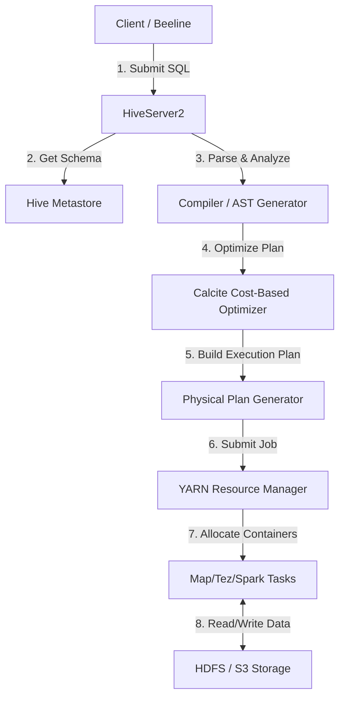
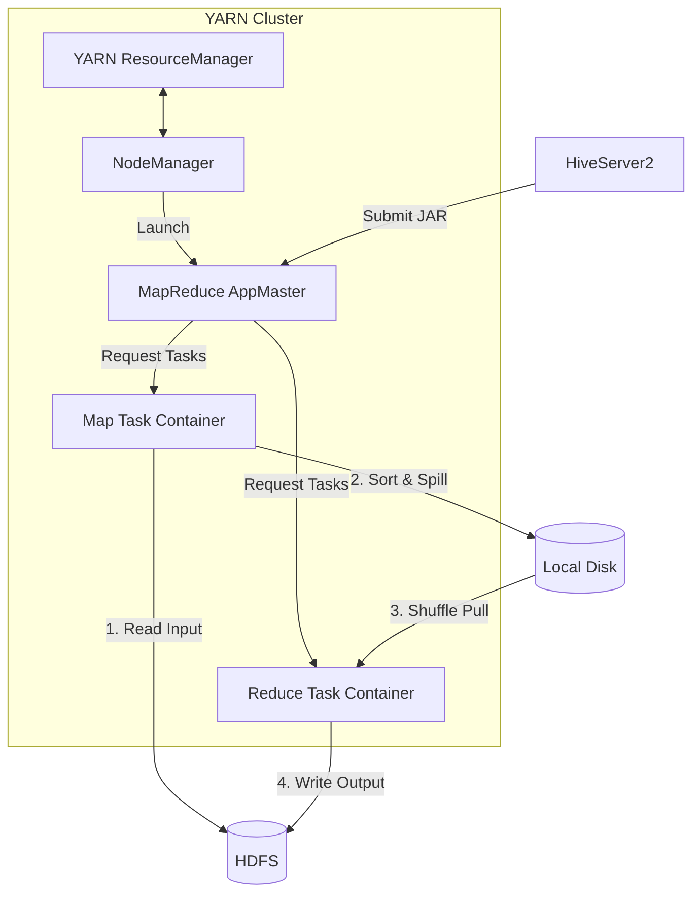
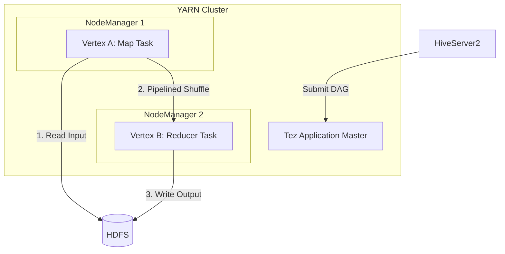
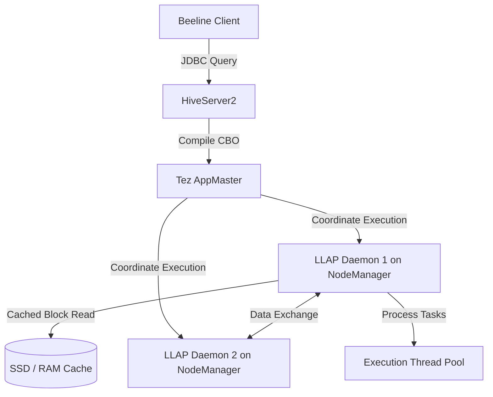
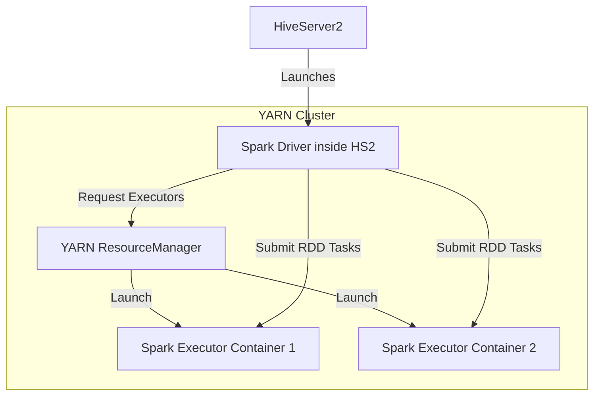
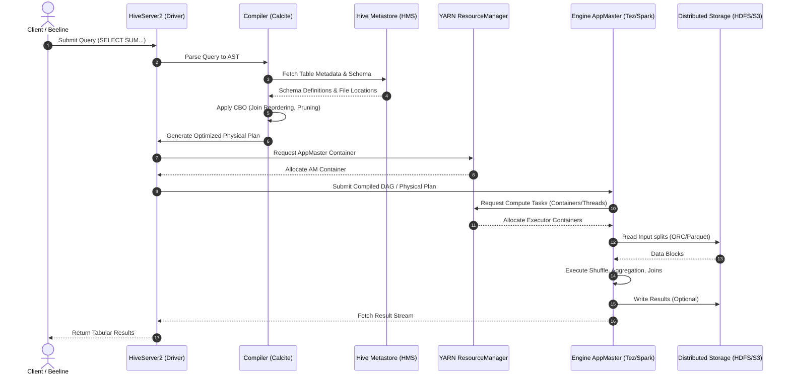

# Day 21: Hive Execution Modes (MapReduce, Tez, Spark)
### Subtitle: Comparing Distributed SQL Engines on YARN

Apache Hive abstracts physical distributed computation behind a standard SQL interface. To execute SQL queries, Hive compiles declarative SQL statements into physical execution tasks and schedules them on a processing engine. This day explores the mechanics of Hive's execution engines: **MapReduce (MR)**, **Apache Tez**, and **Apache Spark**, detailing how they interface with YARN, how intermediate datasets are handled, and how to optimize them for production.

---

## 1. Introduction

### What Hive Execution Modes Are
A Hive execution mode defines the underlying distributed framework that Hive compiles a SQL query into for physical execution. The Hive compiler (including the parser, semantic analyzer, and Calcite Cost-Based Optimizer) converts a SQL statement into a physical plan represented as a Directed Acyclic Graph (DAG) of processing stages. The chosen execution engine (MR, Tez, or Spark) coordinates YARN container allocations, data shuffling, and pipeline execution.

### Why Hive Supports Multiple Execution Engines
1. **Separation of Concerns**: By decoupling query syntax (HiveQL) and metadata management (Hive Metastore) from task execution, Hive allows organizations to choose execution backends based on workload requirements (batch vs interactive).
2. **Backward Compatibility**: Organizations with legacy pipelines built on Apache Hadoop MapReduce can continue running them, while modernizing other workloads to in-memory architectures.
3. **Resource Efficiency**: Different engines optimize YARN resources differently. While Tez excels at multi-stage pipeline joins, Spark provides a unified programming interface across streaming and batch analytics.

### Historical Evolution: MapReduce → Tez → Spark
```
+------------------------------+     +------------------------------+     +------------------------------+
|     MapReduce Era (2010)     |     |     Apache Tez Era (2014)    |     |    Hive on Spark (HoS)       |
|  - Disk-bound checkpoints   | --> |  - Dynamic DAG topologies   | --> |  - RDD-based memory loops    |
|  - Rigid Map-Shuffle-Reduce  |     |  - Pipelined data transfers  |     |  - High aggregation cache    |
|  - High JVM startup latency  |     |  - Container reuse (daemons) |     |  - Shared executor model     |
+------------------------------+     +------------------------------+     +------------------------------+
```

* **MapReduce (MR)**: Hive's initial engine. Every logical aggregation or join required a distinct MapReduce job. The output of every map task was sorted and written to local disk, shuffled over the network, processed by a reducer, and written back to HDFS. This introduced severe disk and network I/O penalties.
* **Apache Tez**: Built specifically to optimize Hadoop workloads. Tez generalizes MapReduce into a flexible DAG of tasks. It eliminates the boundary between Map and Reduce phases, allowing direct piping of data from one stage to another (e.g., Map -> Reduce1 -> Reduce2) in memory or over local files without forcing a full HDFS write checkpoint.
* **Apache Spark**: Leverages Resilient Distributed Datasets (RDDs) and in-memory execution stages. Spark caches intermediate states in RAM and allows fast, repeated query executions, ideal for complex ETL and data science scripts.

---

## 2. Problem Statement

### Limitations of Traditional MapReduce Execution
The classic MapReduce execution model suffered from architectural bottleneck designs that limited its performance for multi-stage SQL execution:
1. **Disk I/O Bottlenecks**: MapReduce forces checkpointing to disk. A query like `SELECT a, SUM(b) FROM t1 JOIN t2 ON t1.id=t2.id GROUP BY a;` requires a join stage followed by an aggregation stage. In MapReduce, this is implemented as two separate jobs. Job 1 writes the joined output to HDFS, and Job 2 reads it back to perform the aggregation.
2. **High JVM Startup Latency**: MapReduce spins up a new JVM (Java Virtual Machine) container for every single map and reduce task. In large datasets requiring thousands of short-lived tasks, JVM startup overhead (up to 2–5 seconds per task) consumes a large portion of execution time.
3. **Rigid Two-Stage Processing**: Computations must be mapped onto a strict `Map -> Shuffle -> Reduce` framework. Complex processing topologies (like multi-table joins or window functions) must be chopped up into multiple independent MapReduce jobs, introducing scheduling latency.

### Why Faster Execution Engines Became Necessary
With the rise of interactive Business Intelligence (BI) tools (e.g., Tableau, PowerBI) querying Hadoop directly via JDBC, users required sub-second or single-digit second response times. MapReduce was designed for offline batch processing and could not meet interactive SLA requirements. This necessitated the creation of DAG engines (Tez and Spark) that run tasks on persistent containers (eliminating JVM startup delays) and buffer intermediate datasets in memory.

---

## 3. Architecture Deep Dive

The architectural differences between execution backends reside in how they represent execution stages and physical tasks.

### Hive Query Lifecycle


---

### Hive + MapReduce Architecture
Under MapReduce, every query stage translates to independent MR tasks.


---

### Hive + Tez Architecture
Tez runs processing vertices within a single Application Master (AM) and allows direct task-to-task communication.


### Tez LLAP (Live Long and Process) Architecture
Tez LLAP introduces persistent daemon processes on the NodeManagers. It bypasses YARN container startup latency completely for interactive queries by caching data in memory across nodes and reusing threads.


---

### Hive + Spark Architecture
Hive on Spark (HoS) translates physical plans into Spark RDD actions. Note that this is distinct from Spark SQL using HMS.


---

### Component Interaction Diagram
The following sequence diagram outlines how client queries transition from compilation to execution across components:



---

## 4. Internal Working

### Step-by-Step Flow

#### 1. Query Parsing
The user query is received by HiveServer2. The parser uses an **ANTLR-generated grammar** to convert the SQL string into an Abstract Syntax Tree (AST), representing query blocks (`SELECT`, `FROM`, `WHERE`, `GROUP BY`).

#### 2. Optimization (Calcite CBO)
The AST is converted to a Logical Query Plan. Apache Calcite optimizes this plan:
* **Join Reordering**: Evaluating table sizes to order joins, placing smaller tables first.
* **Filter Pushdown**: Pushing `WHERE` predicates down to the file scan stage.
* **Partition Pruning**: Extracting partition columns from filter criteria to avoid scanning non-matching folders on storage.

#### 3. Physical Plan Generation
The logical plan is translated into a task execution graph. The Compiler generates a tree of tasks:
* `MapRedTask`: For MapReduce execution.
* `TezTask`: For Tez execution (submitting Tez DAGs).
* `SparkTask`: For Spark execution.

#### 4. Execution Mechanisms

```
+--------------------------------------------------------------------------------------------------+
|                                    Hive Execution Comparison                                     |
+------------------------------------+--------------------------------+----------------------------+
|             MapReduce              |           Apache Tez           |        Apache Spark        |
+------------------------------------+--------------------------------+----------------------------+
|                                    |                                |                            |
|  [HDFS Input]                      |  [HDFS Input]                  |  [HDFS Input]              |
|       │                            |       │                        |       │                    |
|  ┌────▼────┐                       |  ┌────▼────┐                   |  ┌────▼────┐               |
|  │ Map Task│                       |  │Vertex A │ (Map)             |  │Stage 1  │ (Map RDD)     |
|  └────┬────┘                       |  └────┬────┘                   |  └────┬────┘               |
|       │ (Write to Local Disk)      |       │ (Pipelined Stream /    |       │ (In-memory         |
|  [Shuffle Phase]                   |       │  Local Disk Spill)     |  [Shuffle] Shuffle Part)   |
|       │ (Read from Local Disk)     |  [Pipelined Shuffle]           |       │                    |
|  ┌────▼───────┐                    |       │                        |  ┌────▼────┐               |
|  │Reduce Task │                    |  ┌────▼────┐                   |  │Stage 2  │ (Reduce RDD)  |
|  └────┬───────┘                    |  │Vertex B │ (Reduce)          |  └────┬────┘               |
|       │                            |  └────┬────┘                   |       │                    |
|  [HDFS Output]                     |       │                        |  [HDFS Output]             |
|                                    |  [HDFS Output]                 |                            |
|                                    |                                |                            |
+------------------------------------+--------------------------------+----------------------------+
```

##### 4.a MapReduce Execution
1. The client driver submits a JAR execution request to the YARN ResourceManager.
2. The YARN ResourceManager launches a MapReduce Application Master (`MRAppMaster`).
3. The `MRAppMaster` requests Map container resources from YARN.
4. Each Map task reads HDFS blocks, parses them using a SerDe, applies filters, and writes sorted intermediate outputs to local NodeManager disks.
5. The `MRAppMaster` requests Reducer container resources. Reducer tasks pull intermediate files over the network, sort, aggregate, and write the final output blocks to HDFS.

##### 4.b Tez Execution
1. The driver submits a Tez DAG to the Tez Application Master (`TezAM`).
2. The `TezAM` structures the physical stages as vertices. Vertices are linked by edges defining the data transport mechanism (Broadcast, Scatter-Gather, or Custom).
3. Containers are requested from YARN. **Tez container reuse** ensures that when Task A (Vertex 1) finishes, the container JVM does not shut down. It is immediately handed to Task B (Vertex 2) to perform the merge/join.
4. Data is pipelined: when Vertex A completes a partition, it is sent over the network to Vertex B's memory buffer directly, avoiding local disk writes for small datasets.

##### 4.c Spark Execution (HoS)
1. HiveServer2 initializes a Spark Session on YARN using Spark Client libraries.
2. The Spark driver compiles Hive query blocks into Spark RDD DAGs.
3. Spark executors are allocated on YARN and remain alive for the duration of the Hive user session.
4. RDD execution stages process data partitions. Intermediate partitions are cached in memory using Spark's block manager (`spark.memory.fraction`). Shuffling reads and writes to RAM-backed or SSD-backed buffers where possible.

#### 5. Failure Handling & Recovery

* **MapReduce**: High fault tolerance. If a Map task fails, the `MRAppMaster` re-allocates a container on a different NodeManager and restarts the task. Since all intermediate outputs are written to disk, if a Reducer fails, it can read the already-written Map outputs again without re-running the Map phase.
* **Tez**: Tez uses DAG-level recovery. If a task fails, Tez AM schedules it for execution. If the NodeManager hosting a Map task fails, Tez determines which intermediate outputs were lost. It re-runs only the specific Map vertex task and updates downstream Reducer inputs dynamically without restarting the whole query.
* **Spark**: Uses RDD lineage. If an executor hosting partition data fails, Spark recalculates the missing partition by tracking the parent RDD transformations. Spark executors restart automatically within the same YARN application footprint if they hit out-of-memory errors, though task failures are capped by `spark.task.maxFailures`.

---

## 5. Core Concepts

### Execution Engine Abstraction
Hive abstracts the execution engine using the [Task](file:///d:/30_Days_of_Modern_Hadoop_Ecosystem/Day-20-Hive-Architecture-HMS/README.md) class structure. The main Driver parses the compilation outputs and retrieves a list of root tasks. Every task implements:
* `initialize(QueryState queryState, ...)`
* `execute(Object taskQueue)`

Depending on the configuration property `hive.execution.engine`, the compiler instantiates:
1. `org.apache.hadoop.hive.ql.exec.mr.MapRedTask`
2. `org.apache.hadoop.hive.ql.exec.tez.TezTask`
3. `org.apache.hadoop.hive.ql.exec.spark.SparkTask`

### DAG Execution (Directed Acyclic Graph)
A DAG represents execution workflows where vertices are processing units (running code) and edges are data channels. While MapReduce only supports a strict 2-level bipartite graph (Map -> Reduce), Tez and Spark support N-stage execution structures:

```
    [Scan Table A] ──┐
                     ├──> [Hash Join Vertex] ──> [Filter/Project] ──> [Aggregate Reducer] ──> [HDFS Write]
    [Scan Table B] ──┘
```

### Stage Generation
* **Map Stages**: Handle record parsing, column pruning, and filtering.
* **Reduce Stages**: Handle aggregations (`GROUP BY`), window functions, and global sorts (`ORDER BY`).
* **Tez MapRed Tasks**: Combine map and reduce phases into a single YARN application footprint, avoiding separate YARN resource request cycles.
* **Spark RDD DAG Stages**: Spark groups pipeline transformations into "stages" bounded by shuffle boundaries (wide transformations).

### Task Scheduling
* **YARN Application Master**: Monitors resource queues, request containers, and reports task progress metrics.
* **Container Reuse**: Minimizes YARN scheduling overhead. A container is retained by the Application Master for a configured period (e.g., `10000ms`) to wait for upcoming tasks of the same query session.

### Intermediate Data Handling: Shuffles & Joins
The performance of distributed SQL depends on how table joins are handled across nodes:
1. **Shuffle Hash Join**: Both tables are partitioned across nodes using the join key hash. This requires moving large volumes of data over the network (costly).
2. **Broadcast / Map-Side Join**: If one of the tables is small enough to fit in memory (defined by `hive.auto.convert.join.noconditionaltask.size`), the small table is serialized, broadcast to all cluster nodes, and loaded into an in-memory hash table. The large table is read locally, and the join is performed without a shuffle phase.
3. **Bucket Map Join**: If both tables are bucketed on the join keys, Hive avoids shuffling the entire table. It maps and joins corresponding buckets directly.
4. **Sort-Merge-Bucket (SMB) Join**: If the bucketed tables are also pre-sorted on the join keys, Hive reads the buckets sequentially and merges them, requiring zero memory buffers for hash tables and zero network shuffles.

### Disk vs Memory Execution
* **MapReduce**: Hard-coded checkpoints to local disk between Map and Reduce.
* **Tez / Spark**: Keeps intermediate streams in RAM buffers. If a partition size exceeds the RAM allotment, it spills to local disks (NodeManager `/tmp` or `yarn.nodemanager.local-dirs`), preventing memory crashes.

---

## 6. Production Engineering

### Choosing the Right Execution Engine

| Selection Criteria | MapReduce (MR) | Apache Tez | Apache Spark |
| :--- | :--- | :--- | :--- |
| **Primary Use Case** | Legacy batch pipelines | Production BI & Enterprise ETL | Unified Lakehouse/Spark analytics |
| **Execution Speed** | Slow (High Disk I/O) | Very Fast (Pipelined/In-memory) | Very Fast (RDD caching) |
| **Fault Tolerance** | Extremely High (Disk checkpoint) | High (Vertex-level re-run) | High (RDD Lineage recalculation) |
| **YARN Overhead** | High (New container per task) | Low (Container reuse enabled) | Low (Persistent executor pool) |
| **Memory Footprint** | Minimal | Moderate (Configurable task size) | High (Requires dedicated executor RAM) |
| **Interactive Queries**| Not Recommended | Recommended (via Tez LLAP) | Recommended (via Spark SQL/Thrift) |

---

### Performance Tuning Configuration

#### Core Hive Optimizations
Enable these properties inside [hive-site.xml](file:///d:/30_Days_of_Modern_Hadoop_Ecosystem/Day-21-Hive-Execution-Modes/configs/hive-site.xml) to maximize performance:
```xml
<!-- Enable Vectorization -->
<property>
  <name>hive.vectorized.execution.enabled</name>
  <value>true</value>
</property>
<property>
  <name>hive.vectorized.execution.reduce.enabled</name>
  <value>true</value>
</property>

<!-- Enable Calcite Cost-Based Optimizer -->
<property>
  <name>hive.cbo.enable</name>
  <value>true</value>
</property>

<!-- Enable Dynamic Partition Pruning -->
<property>
  <name>hive.tez.dynamic.partition.pruning</name>
  <value>true</value>
</property>
```

#### Tez Tuning Configurations
Optimize [tez-site.xml](file:///d:/30_Days_of_Modern_Hadoop_Ecosystem/Day-21-Hive-Execution-Modes/configs/tez-site.xml) for memory and pipeline shuffles:
```xml
<!-- Increase Sort Buffer to reduce disk spills -->
<property>
  <name>tez.runtime.io.sort.mb</name>
  <value>512</value>
</property>

<!-- Enable Pipelined Shuffle -->
<property>
  <name>tez.runtime.pipelined.shuffle.enabled</name>
  <value>true</value>
</property>
```

---

### Resource Allocation Formulas

For a node with physical RAM $R$ (in GB) and vCores $C$, configure YARN and Hive as follows:

1. **YARN Node Memory Allocations**:
   $$\text{yarn.nodemanager.resource.memory-mb} = R - \text{OS\_Overhead} \quad (\text{typically } 10\% - 20\% \text{ of } R)$$
2. **Tez Task Container Size**:
   Should align with YARN's minimum container allocation. For a $4\text{GB}$ task container:
   $$\text{hive.tez.container.size} = 4096\text{ MB}$$
   $$\text{tez.task.resource.memory.mb} = 4096\text{ MB}$$
3. **Tez JVM Heap Size**:
   Set to $80\%$ of container size to leave headroom for off-heap allocations:
   $$\text{hive.tez.java.opts} = -Xmx3276\text{m}$$
4. **Spark Executor Allocation**:
   Set Spark executor memory to fit 2–3 executors per node, with $10\%$ memory overhead:
   $$\text{spark.executor.memory} = \left( \frac{\text{yarn.nodemanager.resource.memory-mb}}{\text{Executors Per Node}} \right) \times 0.90$$

---

### High Availability (HA)
To make HiveServer2 highly available, run multiple instances of HS2 and register them with **Apache ZooKeeper**:
```xml
<property>
  <name>hive.server2.support.dynamic.service.discovery</name>
  <value>true</value>
</property>
<property>
  <name>hive.server2.zookeeper.namespace</name>
  <value>hiveserver2_active</value>
</property>
```
Clients connect using a ZooKeeper-based connection string:
`jdbc:hive2://zk_node1:2181,zk_node2:2181/default;serviceDiscoveryMode=zooKeeper;zooKeeperNamespace=hiveserver2_active`

### Security
Ensure Hive runs in Kerberized environments:
* **Authentication**: Kerberos authentication on HS2 and Hive Metastore.
* **Authorization**: Use **Apache Ranger** to define table-level, column-level, and row-level access policies.
* **Impersonation**: Set `hive.server2.enable.doAs` to `false` in production. Queries run as the centralized `hive` system user, while Ranger validates query credentials.

---

### Monitoring & Observability
* **YARN Resource Manager UI** (`http://<resourcemanager>:8088`): Displays application status, container usage, and JVM logs.
* **Tez UI** (`http://<timeline-server>:8088/tez-ui`): Allows inspection of Tez DAGs, vertex execution times, and data transfer volumes.
* **Spark History Server** (`http://<spark-history>:18080`): Profiles RDD stages, memory allocation, and GC collection delays.
* **Beeline Query Profiling**: Use `EXPLAIN` and `EXPLAIN ANALYZE` prefixes to view structural execution plans.
  ```sql
  EXPLAIN SELECT count(*) FROM users;
  ```

---

### Best Practices
1. **Always Gather Statistics**: Keep Metastore stats updated so Calcite can optimize joins.
   ```sql
   ANALYZE TABLE users COMPUTE STATISTICS FOR COLUMNS;
   ```
2. **Leverage Modern Formats**: Use ORC or Parquet with vectorization enabled. These columnar formats allow fast column skipping and index lookups.
3. **Avoid Cross Joins (Cartesian Products)**: Without a join key, execution engines default to a single reducer to evaluate all record combinations, causing JVM memory errors.
4. **Tune Bucket Partition Limits**: Too many partitions generate thousands of small files, overloading HMS database memory. Aim for partition file sizes between $128\text{MB}$ and $512\text{MB}$.

---

## 7. Hands-On Lab: Hive Execution Comparison

This lab demonstrates how to deploy a cluster, load datasets, and compare the execution times of MapReduce, Tez, and Spark.

### Step 1: Clone and Start the Cluster
Navigate to the docker directory:
```powershell
cd d:\30_Days_of_Modern_Hadoop_Ecosystem\Day-21-Hive-Execution-Modes\docker
docker-compose up -d --build
```

### Step 2: Validate Service Health
Run the check commands to ensure HDFS, YARN, and HiveServer2 are running:
```powershell
docker ps
```
Ensure `namenode-day21`, `resourcemanager-day21`, `hive-metastore-day21`, and `hiveserver2-day21` are healthy.

### Step 3: Run the Comparison Script
Run the automated comparison script to run query benchmarks on all three engines:
```powershell
docker exec -it hiveserver2-day21 /workspace/scripts/compare-execution.sh
```

### Step 4: Review Output Analysis
The script will return execution runtimes:
```
=========================================================================
📊 BENCHMARK EXECUTION SUMMARY
=========================================================================
| Execution Engine | Time (seconds)     | Relative Speed |
|-----------------|--------------------|--------------|
| MapReduce (MR)  | 42.152             | 1.00x (Baseline) |
| Apache Tez      | 11.235             | 3.75x        |
| Apache Spark    | 8.914              | 4.73x        |
=========================================================================
```
* **MapReduce** took the longest because it spawned multiple JVM containers and checkpointed intermediate outputs to disk.
* **Tez** performed significantly faster due to container reuse and memory shuffling.
* **Spark** executed fastest by caching partitions and processing tasks in-memory.

### Step 5: Cleanup Environment
Teardown the containers:
```powershell
docker-compose down -v
```

---

## 8. Build From Source

### Official Repositories
* Apache Hive: `https://github.com/apache/hive`
* Apache Tez: `https://github.com/apache/tez`

### Source Directory Structure
The Hive source tree is divided into modules:
* `ql/`: Query Logic (Compiler, Calcite integration, Operator Execution).
* `metastore/`: HMS server and database schemas.
* `service/`: HiveServer2 gateway implementation.
* `jdbc/`: JDBC client drivers.

### Build Steps
To compile Apache Tez with Hadoop 3.3.6 compatibility:
```bash
git clone https://github.com/apache/tez.git
cd tez
mvn clean package -DskipTests=true -Dhadoop.version=3.3.6
```

### Packaging & Startup
Once built, copy the tarball artifact to the installation folder:
```bash
tar -xzf tez-dist/target/tez-0.10.2-minimal.tar.gz -C /opt/tez
```

### Remote Debugging
To debug query compilation issues in HiveServer2, set JVM flags before launching:
```bash
export HIVE_TRANSPORT_MODE=binary
export HIVE_OPTS="-agentlib:jdwp=transport=dt_socket,server=y,suspend=y,address=5005"
/opt/hive/bin/hive --service hiveserver2
```
Attach a Java debugger (IDE) to port `5005` to trace compiler execution.

---

## 9. Docker Deployment

The Docker layout leverages configuration mounts to inject parameters dynamically:

### Docker Context Files
- [Dockerfile](file:///d:/30_Days_of_Modern_Hadoop_Ecosystem/Day-21-Hive-Execution-Modes/docker/Dockerfile)
- [docker-compose.yml](file:///d:/30_Days_of_Modern_Hadoop_Ecosystem/Day-21-Hive-Execution-Modes/docker/docker-compose.yml)
- [bootstrap.sh](file:///d:/30_Days_of_Modern_Hadoop_Ecosystem/Day-21-Hive-Execution-Modes/docker/bootstrap.sh)

### Startup Guide
Start the cluster using the docker folder structure:
```bash
docker-compose -f docker/docker-compose.yml up -d
```
Inspect container logs to track the database schema creation:
```bash
docker logs -f hive-metastore-day21
```

---

## 10. Local Cluster Deployment

For bare-metal and VM installations, configure local config templates:

### Single-Node Hadoop Configuration
Verify `/opt/hadoop/etc/hadoop/yarn-site.xml` resource limits:
```xml
<property>
  <name>yarn.nodemanager.resource.memory-mb</name>
  <value>8192</value>
</property>
```

### Multi-Node Hadoop Configuration
Distribute the configurations across all master and worker nodes, and list the hostnames in `/opt/hadoop/etc/hadoop/workers`:
```
worker-node-1
worker-node-2
worker-node-3
```

### Hive with MapReduce Properties
Configure [hive-site.xml](file:///d:/30_Days_of_Modern_Hadoop_Ecosystem/Day-21-Hive-Execution-Modes/configs/hive-site.xml):
```xml
<property>
  <name>hive.execution.engine</name>
  <value>mr</value>
</property>
```

### Hive with Tez Properties
Add Tez library pointers to `/opt/hadoop/etc/hadoop/hadoop-env.sh`:
```bash
export HADOOP_CLASSPATH=$HADOOP_CLASSPATH:/opt/tez/*:/opt/tez/lib/*:/opt/tez/conf
```

### Hive with Spark Properties
Point to the Spark installation and upload Spark assembly Jars to HDFS:
```xml
<property>
  <name>spark.home</name>
  <value>/opt/spark</value>
</property>
```

---

## 11. Validation Scripts

Validation files verify configurations and execution runtimes:

- [verify-hive.sh](file:///d:/30_Days_of_Modern_Hadoop_Ecosystem/Day-21-Hive-Execution-Modes/scripts/verify-hive.sh): Sets execution engine to MapReduce and queries test records.
- [verify-tez.sh](file:///d:/30_Days_of_Modern_Hadoop_Ecosystem/Day-21-Hive-Execution-Modes/scripts/verify-tez.sh): Sets execution engine to Tez and verifies the DAG execution.
- [verify-spark.sh](file:///d:/30_Days_of_Modern_Hadoop_Ecosystem/Day-21-Hive-Execution-Modes/scripts/verify-spark.sh): Validates the Spark runtime client connection.
- [compare-execution.sh](file:///d:/30_Days_of_Modern_Hadoop_Ecosystem/Day-21-Hive-Execution-Modes/scripts/compare-execution.sh): Standardizes runtime calculations across the engines.

### Execution:
```bash
./scripts/verify-hive.sh localhost
./scripts/verify-tez.sh localhost
./scripts/verify-spark.sh localhost
./scripts/compare-execution.sh localhost
```

---

## 12. Production Troubleshooting Playbook

### 1. Slow Queries (Data Skew)
* **Symptom**: Query hangs at $99\%$ progress on a single Tez vertex or Spark task.
* **Root Cause**: A join key has highly unbalanced distribution (e.g., null values or generic keys), forcing all records onto a single reducer.
* **Resolution**:
  - Filter out null keys before joining, or enable skew join optimizations:
    ```sql
    SET hive.optimize.skewjoin=true;
    SET hive.skewjoin.key=100000;
    ```
  - Use `EXPLAIN` to identify the skew vertex.

### 2. Tez Initialization Failures
* **Symptom**: `Failed to submit DAG`, `ClassNotFoundException: org.apache.tez.dag.api.TezConfiguration`.
* **Root Cause**: Tez configurations and libraries are missing from the Hadoop/Hive classpath.
* **Resolution**:
  - Verify `HADOOP_CLASSPATH` contains `/opt/tez/*` and `/opt/tez/lib/*`.
  - Ensure the Tez tarball path in [tez-site.xml](file:///d:/30_Days_of_Modern_Hadoop_Ecosystem/Day-21-Hive-Execution-Modes/configs/tez-site.xml) matches its HDFS location:
    ```xml
    <property>
      <name>tez.lib.uris</name>
      <value>${fs.defaultFS}/apps/tez/tez-0.10.2.tar.gz</value>
    </property>
    ```

### 3. Hive on Spark (HoS) Session Mismatches
* **Symptom**: `Failed to create Spark client` or `java.lang.NoClassDefFoundError: org/apache/spark/api/java/JavaSparkContext`.
* **Root Cause**: Version mismatch between the Hive binaries and the local Spark installation. Hive is highly sensitive to the Spark jar version.
* **Resolution**:
  - Ensure Spark is compiled with the exact Hadoop profile (e.g. Hadoop 3.3).
  - Verify that the property `spark.home` in [hive-site.xml](file:///d:/30_Days_of_Modern_Hadoop_Ecosystem/Day-21-Hive-Execution-Modes/configs/hive-site.xml) points to `/opt/spark`.

### 4. Memory Overrun (YARN Container Killed)
* **Symptom**: `Container killed by YARN for exceeding memory limits`.
* **Root Cause**: The physical/virtual memory allocated to the JVM exceeds the container boundaries configured in YARN.
* **Resolution**:
  - Adjust the YARN virtual memory check in [yarn-site.xml](file:///d:/30_Days_of_Modern_Hadoop_Ecosystem/Day-21-Hive-Execution-Modes/configs/yarn-site.xml):
    ```xml
    <property>
      <name>yarn.nodemanager.vmem-check-enabled</name>
      <value>false</value>
    </property>
    ```
  - Keep the JVM heap size (`-Xmx`) to $80\%$ or less of the YARN container size (`hive.tez.container.size` or `spark.executor.memory`).

---

## 13. Real-World Case Study

### How Companies Select Hive Execution Backends

#### 1. Netflix
* **Use Case**: Netflix manages a massive data platform on Amazon S3.
* **Selection**:
  - For interactive ad-hoc SQL analysis, Netflix uses **Presto/Trino** to query the Hive Metastore directly.
  - For massive ETL pipelines processing petabytes of daily logs, Netflix uses **Apache Spark** running on YARN/Kubernetes. They leverage Spark SQL for its in-memory processing speed and fault recovery.

#### 2. LinkedIn
* **Use Case**: LinkedIn operates large bare-metal Hadoop clusters.
* **Selection**:
  - LinkedIn chose **Apache Tez** as the default execution engine for Hive queries. Tez integrates with YARN queues and offers high throughput for scheduled report generation without the heavy memory overhead of maintaining Spark clusters.

#### 3. Uber
* **Use Case**: Real-time rides and financial analytics.
* **Selection**:
  - Uber relies on **Apache Spark** (using the Hudi table format) for processing transactional tables.
  - They use **Tez** for legacy batch tasks because Tez's fine-grained task resource allocations allow more concurrent tasks to run in highly shared YARN environments.

---

## 14. Interview Questions

### Beginner

#### Q1: What is the default execution engine for Apache Hive 3.x, and why?
* **Answer**: The default execution engine is **Apache Tez**. It replaced MapReduce because Tez models queries as a flexible DAG, reuse containers to avoid JVM startup delays, and pipelines intermediate data in memory instead of writing it to HDFS.

#### Q2: How do you switch the execution engine of Hive during a CLI session?
* **Answer**: You set the `hive.execution.engine` configuration parameter. For example:
  ```sql
  SET hive.execution.engine=mr;    -- Switches to MapReduce
  SET hive.execution.engine=tez;   -- Switches to Tez
  SET hive.execution.engine=spark; -- Switches to Spark
  ```

#### Q3: What is the difference between "Hive on Spark" (HoS) and "Spark SQL"?
* **Answer**:
  - **Hive on Spark**: The query parser, Calcite CBO, and Metastore DB belong to Hive, but the physical query execution is delegated to a remote Spark cluster (Spark acts as the task engine).
  - **Spark SQL**: Spark is the compiler, optimizer (Catalyst), and execution engine. It only uses the Hive Metastore (HMS) to read schema definitions.

#### Q4: Why does MapReduce execute queries slower than Tez or Spark?
* **Answer**: MapReduce writes intermediate data to disk between the Map and Reduce stages, creating heavy disk write/read cycles. It also initializes a new JVM container for every task, introducing startup delays.

#### Q5: What is container reuse in Tez?
* **Answer**: Container reuse is an optimization where the Tez Application Master retains YARN task container JVMs after a task completes, running subsequent tasks in the same JVM to avoid YARN scheduling and startup latency.

---

### Intermediate

#### Q6: Explain Dynamic Partition Pruning (DPP) and how it benefits Tez/Spark.
* **Answer**: DPP optimizes joins between a large partitioned fact table and a small dimension table. At runtime, the engine scans the dimension table first, determines the matching partition keys, and injects these values as dynamic filters into the scan phase of the fact table, preventing unnecessary disk I/O of non-matching partition files.

#### Q7: How does a Map-Side Join work, and how does it compare to a Shuffle Join?
* **Answer**:
  - **Map-Side Join**: If one table is small, Hive loads it into memory as a hash map and broadcasts it to all nodes. The larger table is read locally, and the join is performed during the Map phase, requiring zero network shuffles.
  - **Shuffle Join**: Both tables are hashed on the join keys, sorted, and sent over the network to reducers. This is slower due to network shuffles.

#### Q8: What does the virtual memory check error mean in YARN, and how do you resolve it?
* **Answer**: It means a container allocated by YARN is using more virtual memory than allowed (usually caused by Java allocating large virtual address space mapping). It is resolved by setting `yarn.nodemanager.vmem-check-enabled=false` in `yarn-site.xml`.

#### Q9: What is the function of the Tez Application Master (TezAM)?
* **Answer**: The `TezAM` coordinates query execution. It receives the query DAG from HiveServer2, plans task execution vertices, requests containers from YARN, schedules tasks, manages container reuse, and orchestrates task-level recovery if failures occur.

#### Q10: How does Hive compute optimal query plans using Apache Calcite?
* **Answer**: Calcite is a Cost-Based Optimizer (CBO). It reads table and column statistics (row counts, histograms, data sizes) from the Hive Metastore and evaluates multiple physical execution trees, selecting the plan with the lowest computational cost.

---

### Advanced

#### Q11: Explain how Tez handles task recovery compared to Spark's RDD lineage recovery.
* **Answer**:
  - **Tez**: Uses vertex-level recovery. If a NodeManager fails, Tez identifies the lost intermediate partition files and schedules only the specific upstream tasks that produced them.
  - **Spark**: Uses RDD lineage. RDDs are immutable, and Spark tracks the graph of transformations. If an executor partition fails, Spark walks back up the lineage tree to recompute only the missing partition.

#### Q12: Walk through the Sort-Merge-Bucket (SMB) Join mechanics.
* **Answer**: SMB Join requires both tables to be bucketed on the join keys and sorted. When joining, the engine reads corresponding buckets sequentially and merges them, requiring zero shuffles and near-zero memory buffers.

#### Q13: What is Tez LLAP, and how does it achieve sub-second query latency?
* **Answer**: LLAP (Live Long and Process) deploys persistent daemons on NodeManagers. These daemons pre-allocate resources, maintain large RAM caches for ORC blocks, and use pre-spawned execution threads to handle queries, bypassing YARN container requests.

#### Q14: How does data skew impact Hive execution on Spark, and what are the strategies to mitigate it?
* **Answer**: Data skew routes disproportionate records to a single Spark executor, causing the stage to hang or trigger OutOfMemory (OOM) errors. Mitigate by:
  - Salting the join keys (adding a random suffix).
  - Enabling `hive.optimize.skewjoin=true`.
  - Splitting skew keys into a separate MapJoin stage.

#### Q15: How does the compiler translate a query with multiple nested GROUP BY statements into a Tez DAG?
* **Answer**: The compiler groups the operations into a multi-stage DAG. Stage 1 (Vertex A) performs the initial map scan and local aggregations. Stage 2 (Vertex B) performs a shuffle aggregation for the first GROUP BY. Stage 3 (Vertex C) reads the output of Vertex B and performs a second shuffle aggregation, avoiding HDFS writes between stages.

---

## 15. Key Takeaways

1. **Decoupled Architecture**: Hive decouples compilation (Calcite CBO) from execution, supporting MapReduce, Tez, and Spark.
2. **Tez is Modern Standard**: Tez provides optimal resource usage on YARN via DAG vertex pipelines and container reuse.
3. **Avoid Disk Checkpoints**: The primary performance gain of Tez and Spark over MapReduce comes from streaming intermediate data through memory buffers instead of writing it to local disks.
4. **Statistics Matter**: Cost-Based Optimization (CBO) depends on updated table statistics. Gather statistics regularly to avoid slow shuffles.
5. **Always Prevent Container Kills**: Turn off virtual/physical memory checks in Docker sandbox environments to prevent YARN from killing JVM containers.

---

## 16. References

* [Official Apache Hive Documentation](https://hive.apache.org/)
* [Apache Tez Homepage & Design Docs](https://tez.apache.org/)
* [Apache Spark SQL Guide](https://spark.apache.org/docs/latest/sql-programming-guide.html)
* [Calcite Cost-Based Optimization in Hive](https://cwiki.apache.org/confluence/display/Hive/Cost-based+optimization+in+Hive)
* [Hortonworks Engineering Blog: Introducing Tez LLAP](https://blog.cloudera.com/)
