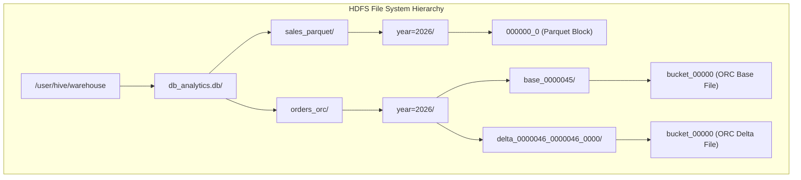
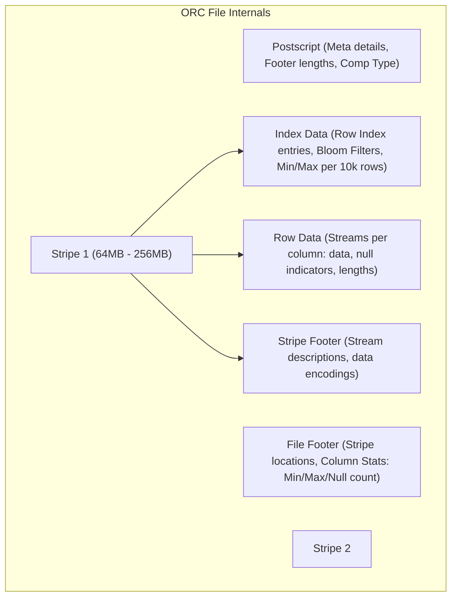
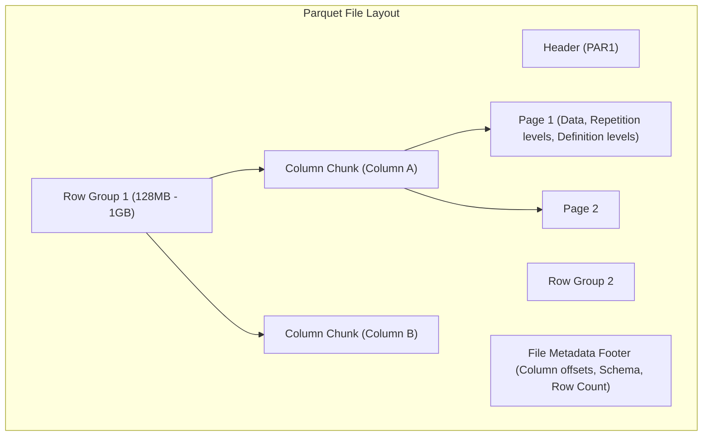
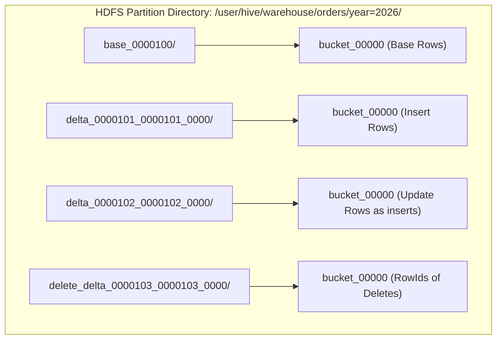
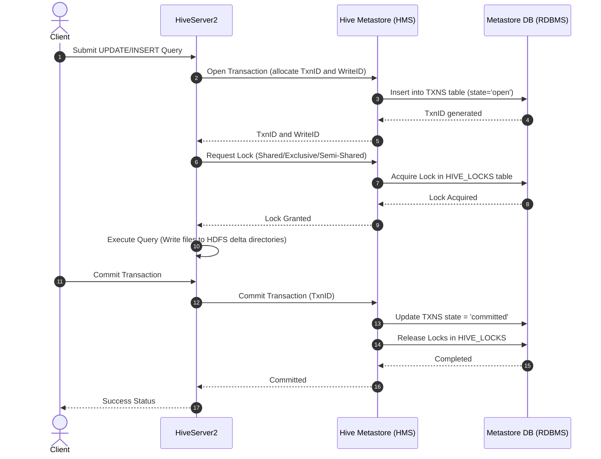
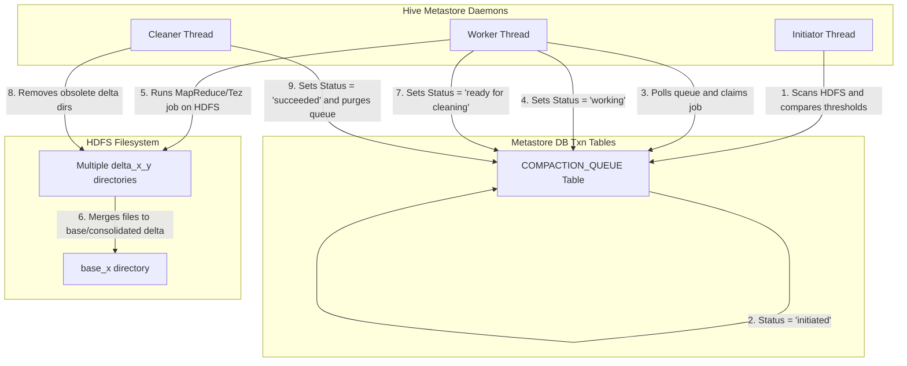
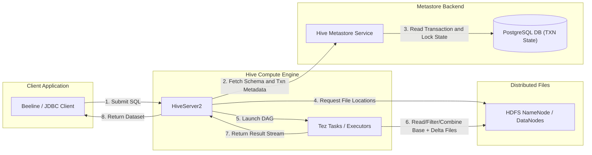
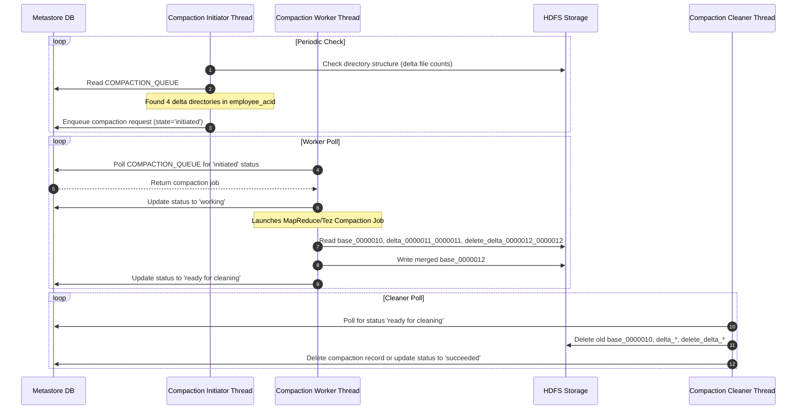

# Day 22: Hive Storage Formats (ORC & Parquet) and ACID Transactions

Welcome to Day 22 of the Hadoop Ecosystem deep-dive. Today, we focus on the fundamental shifts that transformed Apache Hive from a batch-oriented query engine into a performant, enterprise-ready transactional Data Lakehouse. We will examine **columnar file formats** (ORC & Parquet) and analyze **Hive ACID Transactions** (MVCC, base/delta write mechanisms, and compactions) from first principles.

---

## 1. Introduction

### What are Hive Storage Formats?
In the Hadoop ecosystem, Hive acts as an SQL abstraction layer over raw files stored in distributed storage (primarily HDFS, S3, or ADLS). A **storage format** defines how records (rows) and fields (columns) are serialized, structured, and laid out within physical files. It directly impacts:
* Disk space usage through compression and encoding.
* I/O efficiency (how much data must be read from disk to satisfy a query).
* CPU utilization during serialization and deserialization.

### Why Columnar Storage Was Introduced
Early Hadoop architectures used row-oriented formats (like CSV, TSV, or SequenceFiles). Analytical workloads (OLAP) typically query a subset of columns across billions of rows (e.g., `SELECT SUM(salary) FROM employees`). 
In row-oriented formats, the reader is forced to read *entire rows* off the disk, parsing and discarding unwanted fields. Columnar storage splits tables vertically, storing values of the same column together. This introduces two key optimizations:
1. **Column Pruning (I/O Reduction):** Only the file directories containing the target columns are read.
2. **Superior Compression:** Values of the same data type (e.g., integers, dates) exhibit high redundancy, allowing codecs like Snappy, GZIP, and ZSTD, and encoding techniques like Run-Length Encoding (RLE) and Dictionary Encoding, to compress data far more effectively than heterogeneous row bytes.

### The Evolution of Storage Formats
```
[ Text / CSV ] ────> [ SequenceFile ] ────> [ RCFile ] ────> [ ORC & Parquet ]
(Row-based, Plain)  (Row-based, Binary)   (Record-Columnar)  (True Columnar, Vectorized)
```
* **Text / CSV:** Human-readable, row-oriented, zero metadata, slow to parse, no compression support at field level.
* **SequenceFile:** Binary row-oriented key-value format. Introduced basic compression, but still required reading full records.
* **RCFile (Record Columnar File):** The first hybrid format. It split files into row splits and then laid out those rows column-major. It suffered from slow writes and lacked internal index statistics.
* **ORC (Optimized Row Columnar) & Parquet:** Modern columnar formats. They store data in block stripes with rich embedded metadata (min/max/null indexes per block, bloom filters, dictionary pools), enabling massive I/O skipping (predicate pushdown) and native vectorized read execution.

### Evolution of Hive ACID
Originally, Hive on top of HDFS was strictly **write-once, read-many (WORM)**. Modifying a single cell required rewriting the entire partition. This presented severe challenges for regulatory compliance (e.g., GDPR "right to be forgotten"), slowly changing dimensions (SCD Type 1/2), and streaming data ingestion.
* **Hive 0.13 (ACID V1 - Bucketed tables only):** Introduced transactions, inserts, updates, and deletes, but forced strict bucketing constraints, making writes highly complex.
* **Hive 3.x (ACID V2 - Default ACID):** Re-architected ACID engine to support non-bucketed tables. Re-designed the write path to reduce the overhead of delta files, optimized performance using vectorized readers, and established managed tables as transactional ACID by default.

---

## 2. Problem Statement

### Limitations of Row-Based Storage
Row-based formats (Text, SequenceFile) are optimized for transactional write patterns (OLTP) where entire records are inserted, modified, or retrieved together. In analytical query patterns (OLAP), they introduce massive inefficiencies:
* **Slow Queries:** If a table has 100 columns and a query scans 3, 97% of the disk reads, network transfers, and parsing overhead are wasted.
* **Storage Inefficiency:** Storing diverse data types adjacent to one another limits the efficacy of compression algorithms. 

### Lack of Transactional Support in Early Hive
HDFS is an append-only file system. It does not support in-place file modifications. This architecture imposed major limits on early Hive versions:
* **No Real-Time Mutations:** Updates and deletes required external workflows (e.g., reading the entire dataset, filtering or modifying records in Spark/MapReduce, and overwriting the directory).
* **Dirty Reads:** Readers querying a table while a writer was appending files would read partial or corrupt data states.
* **Lack of Atomicity:** If an ingestion job failed midway, the partially written files remained in HDFS, requiring manual cleanup.
* **Regulatory Violations:** Compliance commands (such as GDPR deletes) took hours or days of batch jobs instead of running simple `DELETE WHERE user_id = X` statements.

Enterprise data platforms required ACID (Atomicity, Consistency, Isolation, Durability) guarantees, driving the development of Hive ACID tables.

---

## 3. Architecture Deep Dive

### 1. Hive + HDFS Storage Architecture
Hive represents databases, tables, and partitions as directories on HDFS. The physical files reside within these directories.



### 2. ORC File Structure
ORC splits a table into groups of rows called **stripes** (typically 64MB - 256MB) and embeds indices directly inside the file footer to allow readers to skip stripes and row groups without scanning the full file.

```
+-----------------------------------------------------------+
| ORC FILE                                                  |
|  +-----------------------------------------------------+  |
|  | STRIPE 1                                            |  |
|  |  +-----------------------------------------------+  |  |
|  |  | Index Data (Row Group Indexes, Min/Max stats) |  |  |
|  |  +-----------------------------------------------+  |  |
|  |  | Row Data (Column 1 Streams, Column 2 Streams) |  |  |
|  |  +-----------------------------------------------+  |  |
|  |  | Stripe Footer (Encoding types, stream locations)|  |  |
|  |  +-----------------------------------------------+  |  |
|  +-----------------------------------------------------+  |
|  | STRIPE 2                                            |  |
|  +-----------------------------------------------------+  |
|  | FILE FOOTER                                         |  |
|  | (Metadata per column, stripe offsets, schema info)  |  |
|  +-----------------------------------------------------+  |
|  | POSTSCRIPT                                          |  |
|  | (Compression parameters, footer sizes)              |  |
|  +-----------------------------------------------------+  |
+-----------------------------------------------------------+
```



### 3. Parquet File Structure
Parquet separates metadata from data blocks. The data is partitioned into **Row Groups**, which contain **Column Chunks** (data for a specific column), subdivided into **Pages** (which are the actual units of compression and encoding).

```
+-----------------------------------------------------------+
| PARQUET FILE                                              |
|  +-----------------------------------------------------+  |
|  | Header ('PAR1' Magic Number)                        |  |
|  +-----------------------------------------------------+  |
|  | ROW GROUP 1                                         |  |
|  |  +-----------------------------------------------+  |  |
|  |  | Column Chunk 1 (ID Column)                    |  |  |
|  |  |  [Page 1: Data, Repetition & Def levels]      |  |  |
|  |  |  [Page 2]                                     |  |  |
|  |  +-----------------------------------------------+  |  |
|  |  | Column Chunk 2 (Salary Column)                |  |  |
|  |  +-----------------------------------------------+  |  |
|  +-----------------------------------------------------+  |
|  | ROW GROUP 2                                         |  |
|  +-----------------------------------------------------+  |
|  | FILE METADATA FOOTER                                |  |
|  | (Schema, Key-Value pairs, Row group locations,       |  |
|  |  Column chunk statistics: min/max/nulls)            |  |
|  +-----------------------------------------------------+  |
|  | File Metadata Length                                |  |
|  +-----------------------------------------------------+  |
|  | Trailer ('PAR1' Magic Number)                        |  |
|  +-----------------------------------------------------+  |
+-----------------------------------------------------------+
```



### 4. Hive ACID Table Architecture
Hive ACID uses append-only storage to support deletes and updates. It creates transactional subdirectories (`base` and `delta` directories) inside the partition path.

* **Base Directory (`base_x/`):** A consolidated snapshot of the table up to transaction ID `x`.
* **Delta Directory (`delta_x_y_z/`):** Contains rows inserted between transactions `x` and `y`.
* **Delete Delta Directory (`delete_delta_x_y_z/`):** Contains record ids (keys) deleted between transactions `x` and `y`.



### 5. Transaction Manager
The `DbTxnManager` tracks transactions in the Hive Metastore database (RDBMS), coordinating locks and transactions across concurrent read/write queries.



### 6. Compaction Workflow
As transactions write multiple `delta` and `delete_delta` files, query performance degrades due to the overhead of reading and merging files. **Compaction** consolidates these files in the background.



### 7. Read/Write Path and Metadata Interaction
When a query runs, HiveServer2 communicates with both the Hive Metastore and HDFS.



---

## 4. Internal Working

### Step-by-Step Execution Mechanics

#### 1. How Hive Writes ORC Files
1. **Memory Buffering:** As rows are fed into the ORC writer, they are buffered in memory and stored column-by-column.
2. **Row Group Statistics Accumulation:** For every 10,000 rows (default row group size), min/max values, null counts, and column types are computed and cached.
3. **Stripe Packing:** Once column streams reach the stripe size limit (e.g., 64MB/256MB), the writer formats the stripe:
   * Serializes the index data stream.
   * Compresses column byte streams (using Snappy/ZLIB).
   * Generates the stripe footer describing data encodings.
4. **File Finalization:** Upon completion, the writer appends the File Footer (containing global column statistics and stripe byte offsets) and the Postscript (metadata length and compression settings).

#### 2. How Hive Writes Parquet Files
1. **Row Group Buffering:** The writer buffers row groups (typically 128MB - 1GB) in memory.
2. **Page Formatting:** Columns are sliced into pages (usually 1MB). As pages are packed, definition levels (to track null values in optional fields) and repetition levels (to track nesting in arrays/structs) are computed.
3. **Encoding & Compression:** Pages are encoded (e.g., Run-Length Encoding, Dictionary Encoding) and compressed using the configured codec (e.g., Snappy).
4. **Footer Generation:** The file metadata footer is written at the *end* of the file, storing the byte offsets of the column chunks inside the row groups.

#### 3. Column Pruning and Predicate Pushdown
* **Column Pruning:** The query compiler parses the select block. The reader reads the file footer to find the byte offsets of the target columns, skipping the byte ranges of unselected columns.
* **Predicate Pushdown:** When evaluating a `WHERE` clause (e.g., `WHERE age > 30`), the engine reads the metadata (stripe/row group min/max statistics) *before* reading the data. If the max value of a stripe is 28, the entire stripe is skipped, avoiding disk and network I/O.

#### 4. The Transaction Lifecycle
```
[ Open Transaction ] ──> [ Allocate Write ID ] ──> [ Acquire Lock ] ──> [ Write Files ] ──> [ Commit / Abort ]
```

##### INSERT Path:
1. Opens transaction; allocates a unique `WriteID`.
2. Creates a directory name pattern: `delta_WriteID_WriteID_StatementID` (e.g., `delta_0000021_0000021_0000`).
3. Writes new data directly into this directory using ORC files (bucket files).

##### UPDATE Path (Split-Update in Hive 3.x):
1. In ACID V2, updates are split into a **Delete** followed by an **Insert**.
2. Identifies the row ids of target rows (each row has a system-generated metadata column containing: `originalTransactionID`, `bucketID`, `rowID`).
3. Writes the row ids of the updated rows into a `delete_delta_WriteID_WriteID_StatementID` directory (effectively marking them deleted).
4. Writes the updated rows as brand new records in a `delta_WriteID_WriteID_StatementID` directory.

##### DELETE Path:
1. Identifies the row ids (`originalTransactionID`, `bucketID`, `rowID`) of target records.
2. Appends only these identifiers to a file inside a `delete_delta_WriteID_WriteID_StatementID` directory.

##### MERGE Path:
1. Evaluates matching conditions.
2. Directs modifications to their respective `delta` and `delete_delta` directories based on the outcome of the matches.

##### Minor Compaction:
1. The Metastore Initiator identifies tables with multiple delta directories.
2. Spawns a Tez/MR compaction job.
3. Merges multiple `delta` directories into a single `delta_x_y` directory, and multiple `delete_delta` directories into a single `delete_delta_x_y` directory.
4. Leaves base files untouched.

##### Major Compaction:
1. Merges the existing `base_x` directory, all `delta` directories, and all `delete_delta` directories.
2. Drops rows marked deleted in the `delete_delta` files.
3. Resolves updates, outputting a consolidated `base_y` directory containing the final state of the table.

##### Failure Recovery:
If a transaction aborts (due to query error, node crash, or timeout):
* The state of the transaction is marked `aborted` in the Metastore DB.
* The written `delta` directories remain on HDFS.
* Readers skip these directories because they check the Metastore DB active list and ignore writes associated with aborted transaction IDs.
* The cleaner thread asynchronously deletes the aborted directories on HDFS.

---

### Sequence Diagram: Transaction Compaction Lifecycle
This sequence shows how Hive Metastore threads orchestrate compactions asynchronously.



---

## 5. Core Concepts

| Concept | Explanation |
| :--- | :--- |
| **Row vs. Column Storage** | Row storage places all values of record 1 adjacent to one another on disk. Column storage partitions data vertically, grouping values of Column A together across all rows. |
| **ORC Stripe** | A data block within an ORC file (default 64MB - 256MB). It operates as an independent self-contained row partition, containing index, row data, and a stripe footer. |
| **Row Group** | An index interval within ORC stripes or Parquet column chunks (default 10,000 rows). Used to scope statistics and skip blocks of data. |
| **Dictionary Encoding** | Replaces repeated string values with small integer IDs, storing a dictionary mapping inside the stripe/page metadata. This yields significant compression for low-cardinality columns. |
| **Compression** | Bit-level data size reduction. ORC and Parquet apply standard codecs (Snappy, ZLIB, LZO, ZSTD) on top of column-level encodings. |
| **Predicate Pushdown** | Optimization technique where filtering operations (e.g., `WHERE age > 10`) are evaluated at the storage driver level before reading the data. |
| **Bloom Filters** | Probabilistic data structures written inside column indexes. They allow the reader to check if a specific key *definitely does not exist* in a stripe, avoiding disk reads. |
| **Statistics** | In-file column metadata containing min, max, null count, and total counts for each stripe and row group. Used by the query planner and predicate engines. |
| **Delta Files** | Append-only directory files containing transaction writes (inserts and updates). Named with the `delta_` prefix followed by range coordinates (e.g. `delta_0000001_0000001_0000`). |
| **Base Files** | Consolidated data representations containing all committed record values up to a specific transaction checkpoint. |
| **Snapshot Isolation** | Transactional property ensuring that a query reads a consistent version of the database. The reader only sees files written by transactions committed *before* the query started. |
| **MVCC (Multi-Version Concurrency Control)** | A concurrency model that supports simultaneous reads and writes without locking tables, using transaction-indexed base and delta directories to track mutations. |
| **Write IDs** | Auto-incrementing numbers allocated per transactional table to track modifications. They isolate transaction writes across tables. |

---

## 6. Production Engineering

### Choosing ORC vs. Parquet
Both are modern columnar storage formats, but they are optimized for different ecosystems:

* **Choose ORC when:**
  * Your primary execution engine is **Hive** or **Tez**.
  * You require **Hive ACID Transactions**. Hive ACID only supports ORC.
  * You need highly advanced vectorization and performance optimizations in Hive.
* **Choose Parquet when:**
  * You run mixed multi-engine environments including **Apache Spark**, **Presto/Trino**, **Flink**, or **Impala**.
  * You ingest complex, highly nested schemas (Parquet's Repetition/Definition level encoding handles deep nesting more efficiently than ORC).

### Compression Strategies

| Compression Codec | Performance Profile | Recommended Use Case |
| :--- | :--- | :--- |
| **Snappy** | Low CPU usage, moderate compression ratio. Extremely fast compression/decompression. | Default choice for interactive queries and active tables. |
| **ZLIB / GZIP** | High CPU usage, high compression ratio. Slow speeds. | Cold data archiving, backup files, or tables queried infrequently. |
| **ZSTD** | Balanced CPU usage with compression ratios comparable to ZLIB. | Modern standard for high-throughput operational tables. |

### Small File Management
Every file on HDFS generates a metadata entry in the Hadoop NameNode's RAM (averaging 150 bytes per block). Millions of small files (caused by frequent inserts or streaming writes) exhaust NameNode memory and degrade query performance due to task scheduling overhead.
* **Tuning merges on write:** Set the following configurations in your Hive queries to merge small files after execution:
  ```sql
  SET hive.merge.tezfiles=true;
  SET hive.merge.mapfiles=true;
  SET hive.merge.mapredfiles=true;
  SET hive.merge.smallfiles.avgsize=16000000; -- 16MB threshold
  SET hive.merge.size.per.task=256000000;    -- Target file size (256MB)
  ```

### ACID Transaction Tuning
For high-concurrency systems, tune the locking backend in `hive-site.xml`:
* `hive.txn.timeout`: Time in seconds after which an inactive transaction is aborted (default is 300s). In production, set to 60s to prune dead locks.
* `hive.compactor.worker.threads`: Increase the thread count on Metastore servers (e.g., 4-8 threads per host) if compactions are falling behind.
* `hive.compactor.cleaner.run.interval`: Interval in seconds between cleaner daemon scans (default is 5s).

### Monitoring & Security
* **Monitoring Locks:** Query the Metastore database to monitor active locks and transaction queues:
  ```sql
  SHOW LOCKS;
  SHOW TRANSACTIONS;
  SHOW COMPACTIONS;
  ```
  Or query database tables directly inside the Metastore DB: `TXNS`, `HIVE_LOCKS`, `COMPACTION_QUEUE`.
* **Security:** Manage access control for transactional tables using **Apache Ranger**. Because Hive ACID tables rely on managed paths, protect direct HDFS storage access, forcing queries through HiveServer2.

---

## 7. Hands-On Lab

This lab guides you through creating, optimizing, mutating, and compacting ORC and Parquet tables in Hive.

### Prerequisites
Ensure your local Day 22 Docker container cluster is running. If not, follow the instructions in the [Docker Deployment](#9-docker-deployment) section.

### Step 1: Open the Beeline Interactive Shell
Bash into the `hiveserver2` container and connect to the Hive Server:
```bash
docker exec -it hiveserver2-day22 beeline -u jdbc:hive2://localhost:10000/default -n hive -p hivepassword
```
*(Expected Output: A connection message followed by a `0: jdbc:hive2://localhost:10000/default>` prompt)*

---

### Step 2: Create and Inspect ORC/Parquet Tables
Run the following SQL statements to create tables:

```sql
-- 1. Create ORC Optimized Table
CREATE TABLE employee_orc_lab (
    id INT,
    name STRING,
    salary DOUBLE,
    role STRING
)
PARTITIONED BY (dept STRING)
STORED AS ORC
TBLPROPERTIES (
    'orc.compress'='SNAPPY',
    'orc.stripe.size'='67108864'
);

-- 2. Create Parquet Optimized Table
CREATE TABLE employee_parquet_lab (
    id INT,
    name STRING,
    salary DOUBLE,
    role STRING
)
PARTITIONED BY (dept STRING)
STORED AS PARQUET
TBLPROPERTIES (
    'parquet.compression'='SNAPPY'
);
```

#### Insert Sample Data:
```sql
-- Load data into ORC
INSERT INTO TABLE employee_orc_lab PARTITION(dept='Engineering') VALUES 
(1, 'Alice Smith', 120000.0, 'Staff Engineer'),
(2, 'Bob Jones', 95000.0, 'Senior Engineer');

INSERT INTO TABLE employee_orc_lab PARTITION(dept='HR') VALUES 
(3, 'Charlie Brown', 70000.0, 'HR Recruiter');

-- Load data into Parquet
INSERT INTO TABLE employee_parquet_lab PARTITION(dept='Engineering') VALUES 
(1, 'Alice Smith', 120000.0, 'Staff Engineer'),
(2, 'Bob Jones', 95000.0, 'Senior Engineer');

INSERT INTO TABLE employee_parquet_lab PARTITION(dept='HR') VALUES 
(3, 'Charlie Brown', 70000.0, 'HR Recruiter');
```

---

### Step 3: Run Vectorized Query and Compare Explain Plans
Verify that the query is vectorized and skips partitions:

```sql
-- Run query
SELECT name, salary FROM employee_orc_lab WHERE dept='Engineering' AND salary > 100000;

-- Explain query execution plans
EXPLAIN SELECT name, salary FROM employee_orc_lab WHERE dept='Engineering';
```
*(Expected output contains execution stages showing `Partition Filter List` indicating partition pruning has resolved `dept='Engineering'` before evaluation)*

---

### Step 4: Perform ACID Transactions (INSERT, UPDATE, DELETE, MERGE)
Create and verify a transactional table.

```sql
-- Create Managed Transactional Table
CREATE TABLE employee_acid_lab (
    id INT,
    name STRING,
    salary DOUBLE,
    role STRING
)
STORED AS ORC
TBLPROPERTIES ('transactional'='true');

-- Insert initial values (creates delta_0000001_0000001)
INSERT INTO employee_acid_lab VALUES 
(1, 'Alice Smith', 120000.0, 'Staff Engineer'),
(2, 'Bob Jones', 95000.0, 'Senior Engineer'),
(3, 'Charlie Brown', 70000.0, 'HR Recruiter');

-- Verify inserted data
SELECT * FROM employee_acid_lab;

-- Update Alice's salary (creates delta_0000002_0000002 & delete_delta_0000002_0000002)
UPDATE employee_acid_lab SET salary = 135000.0 WHERE id = 1;

-- Delete Charlie Brown (creates delete_delta_0000003_0000003)
DELETE FROM employee_acid_lab WHERE id = 3;

-- Query the table to verify transaction output (Snapshot isolation)
SELECT * FROM employee_acid_lab;
```
*Notice that Charlie Brown is gone and Alice's salary shows the updated value.*

---

### Step 5: Demonstrate MERGE
Load a staging table and merge it:

```sql
-- Create staging table
CREATE TABLE employee_stage_lab (
    id INT,
    name STRING,
    salary DOUBLE,
    role STRING,
    action STRING
);

-- Load changes
INSERT INTO employee_stage_lab VALUES 
(1, 'Alice Smith', 140000.0, 'Principal Engineer', 'UPDATE'),
(2, 'Bob Jones', 95000.0, 'Senior Engineer', 'DELETE'),
(4, 'Diana Prince', 88000.0, 'Data Scientist', 'INSERT');

-- Execute MERGE Statement
MERGE INTO employee_acid_lab AS t USING employee_stage_lab AS s ON t.id = s.id
WHEN MATCHED AND s.action = 'DELETE' THEN DELETE
WHEN MATCHED AND s.action = 'UPDATE' THEN UPDATE SET salary = s.salary, role = s.role
WHEN NOT MATCHED THEN INSERT VALUES (s.id, s.name, s.salary, s.role);

-- Query the updated table
SELECT * FROM employee_acid_lab ORDER BY id;
```
*(Expected Output: Alice is updated to Principal/140k, Bob is deleted, and Diana is inserted).*

---

### Step 6: Trigger and Observe Compactions
Check the compaction state, force a Major Compaction, and check again.

```sql
-- Show current compaction records
SHOW COMPACTIONS;

-- Run Major Compaction
ALTER TABLE employee_acid_lab COMPACT 'MAJOR';

-- Monitor the queue
SHOW COMPACTIONS;
```
*(In a few seconds, the state should transition from `initiated` to `working`, and then `ready for cleaning` / `succeeded`)*.

---

### Step 7: Cleanup Lab Tables
```sql
DROP TABLE IF EXISTS employee_orc_lab;
DROP TABLE IF EXISTS employee_parquet_lab;
DROP TABLE IF EXISTS employee_acid_lab;
DROP TABLE IF EXISTS employee_stage_lab;
```

---

## 8. Build From Source

To understand where files, writers, and locking engines reside inside Apache Hive's codebase:

### Official Source Layout
* **Repository:** `https://github.com/apache/hive`
* **Core Modules:**
  * `ql/`: Query Logic and compiler. Contains transaction management (`lockmgr/`) and plan optimizer engines.
  * `metastore/`: Hive Metastore service containing schema definition and transactional DB interfaces.
  * `common/`: Shared utility classes.
  * `storage-api/`: Interfaces for physical formats (ORC/Parquet interaction interfaces).

### Build Prerequisites
* Java JDK 8
* Apache Maven 3.6+
* Sufficient heap allocation (`export MAVEN_OPTS="-Xmx2048m -XX:MaxPermSize=512m"`)

### Step-by-Step Compile Commands
Compile and package the Apache Hive source distribution:
```bash
# Clone the repository
git clone https://github.com/apache/hive.git
cd hive

# Checkout specific stable release tag (e.g. Hive 3.1.3 release)
git checkout rel/release-3.1.3

# Run Maven clean install, skipping tests for speed
mvn clean package -DskipTests -Pdist
```
The compiled, runnable binaries will be packaged inside the target directory: `packaging/target/apache-hive-3.1.3-bin.tar.gz`.

### Code Debugging Tip
If you are debugging transactional state changes or compaction daemons:
1. Enable Hive debugging logging by passing options to hiveserver2:
   ```bash
   hive --service hiveserver2 --hiveconf hive.root.logger=DEBUG,console
   ```
2. Inspect log occurrences of class `org.apache.hadoop.hive.ql.lockmgr.DbTxnManager` and `org.apache.hadoop.hive.ql.txn.compactor.Worker`.

---

## 9. Docker Deployment

We provide a complete, multi-service local sandbox cluster environment using Docker.

The docker cluster includes:
* **Hadoop HDFS (NameNode & DataNode)**
* **Hadoop YARN (ResourceManager & NodeManager)**
* **PostgreSQL (Metastore DB / Transaction Locker Database)**
* **Hive Metastore (HMS)**
* **HiveServer2 (HS2)**

### Configuration Setup
The cluster setup uses files located in the following repository paths:
* Dockerfile: [Dockerfile](file:///d:/30_Days_of_Modern_Hadoop_Ecosystem/Day-22-Hive-Formats-ACID/docker/Dockerfile)
* Docker Compose: [docker-compose.yml](file:///d:/30_Days_of_Modern_Hadoop_Ecosystem/Day-22-Hive-Formats-ACID/docker/docker-compose.yml)
* Bootstrap entrypoint: [bootstrap.sh](file:///d:/30_Days_of_Modern_Hadoop_Ecosystem/Day-22-Hive-Formats-ACID/docker/bootstrap.sh)
* Hive ACID configuration: [hive-site.xml](file:///d:/30_Days_of_Modern_Hadoop_Ecosystem/Day-22-Hive-Formats-ACID/configs/hive-site.xml)
* Core site layout: [core-site.xml](file:///d:/30_Days_of_Modern_Hadoop_Ecosystem/Day-22-Hive-Formats-ACID/configs/core-site.xml)
* HDFS node rules: [hdfs-site.xml](file:///d:/30_Days_of_Modern_Hadoop_Ecosystem/Day-22-Hive-Formats-ACID/configs/hdfs-site.xml)
* YARN config parameters: [yarn-site.xml](file:///d:/30_Days_of_Modern_Hadoop_Ecosystem/Day-22-Hive-Formats-ACID/configs/yarn-site.xml)
* MapReduce settings: [mapred-site.xml](file:///d:/30_Days_of_Modern_Hadoop_Ecosystem/Day-22-Hive-Formats-ACID/configs/mapred-site.xml)

### Startup Guide
To build, configure, and launch the cluster, navigate to the docker folder and execute:
```bash
cd Day-22-Hive-Formats-ACID/docker
docker-compose build
docker-compose up -d
```
Verify that all containers are healthy:
```bash
docker-compose ps
```

---

## 10. Local Cluster Deployment

For production deployments, follow these practices to set up your cluster.

### 1. Metastore Setup (PostgreSQL Database)
Initialize the PostgreSQL schema manually if the bootstrap script does not run automatically:
```bash
docker exec -it hive-metastore-day22 /opt/hive/bin/schematool -dbType postgres -initSchema
```

### 2. Configure Transactional Tables
To support ACID transactions, ensure the following configurations are added to the `/etc/hive/conf/hive-site.xml` files on **all** cluster nodes (Hiveserver2 instances and Metastore instances):
```xml
<property>
  <name>hive.support.concurrency</name>
  <value>true</value>
</property>
<property>
  <name>hive.txn.manager</name>
  <value>org.apache.hadoop.hive.ql.lockmgr.DbTxnManager</value>
</property>
<property>
  <name>hive.strict.managed.tables</name>
  <value>true</value>
</property>
```

### 3. Enable Background Compaction Daemons
Compaction is driven by the Metastore service. You must enable it on at least one Metastore server instance in your cluster:
```xml
<property>
  <name>hive.compactor.initiator.on</name>
  <value>true</value>
</property>
<property>
  <name>hive.compactor.worker.threads</name>
  <value>4</value>
</property>
<property>
  <name>hive.compactor.cleaner.on</name>
  <value>true</value>
</property>
```

---

## 11. Validation

We have created four shell verification scripts in the [scripts](file:///d:/30_Days_of_Modern_Hadoop_Ecosystem/Day-22-Hive-Formats-ACID/scripts) folder. You can execute these scripts inside the `hiveserver2` container to validate your cluster configuration.

### How to Run the Validation Scripts
Ensure the docker containers are running, then execute:

```bash
# 1. Run ORC format validation
docker exec -it hiveserver2-day22 /workspace/scripts/verify-orc.sh

# 2. Run Parquet format validation
docker exec -it hiveserver2-day22 /workspace/scripts/verify-parquet.sh

# 3. Run ACID transaction validation
docker exec -it hiveserver2-day22 /workspace/scripts/verify-acid.sh

# 4. Run Compaction workflow validation
docker exec -it hiveserver2-day22 /workspace/scripts/verify-compaction.sh
```

### Expected Outputs and Verification Points

#### `verify-orc.sh`
* **Actions:** Creates `employee_orc`, loads partitions, and runs `EXPLAIN`.
* **Verification Point:** Look for `ORC File Dump` outputs printing Stripe details. You should see outputs like:
  ```
  Structure for HDFS file: hdfs://namenode:9000/.../dept=Engineering/000000_0
  File length: X bytes
  Number of stripes: 1
  Stripe: offset: 3 data parent: ...
  Stripe: Entry count: 2, Rows: 2
  ```

#### `verify-parquet.sh`
* **Actions:** Creates `employee_parquet` and query-filters on HDFS directories.
* **Verification Point:** Look for output directories representing partitions (`dept=Engineering`, `dept=HR`) printed from `hadoop fs -ls -R`.

#### `verify-acid.sh`
* **Actions:** Executes database updates, deletes, and staging mergers.
* **Verification Point:** Look at the HDFS listing printout showing both `delta_0000001_0000001` and `delete_delta_0000002_0000002` directories simultaneously. The final select query must show the updated salary for Alice and exclude the deleted record for Charlie.

#### `verify-compaction.sh`
* **Actions:** Runs compactions and outputs their states.
* **Verification Point:** The script prints the output of `SHOW COMPACTIONS;`. The table row for `employee_acid` must show transaction states shifting to `succeeded` or `ready for cleaning`.

---

## 12. Production Troubleshooting Playbook

### 1. Slow ORC/Parquet Queries
* **Symptoms:** Analytical queries scan too many files or take too long during stage plan generation.
* **Possible Root Cause:**
  * Predicate pushdown is disabled or failing.
  * Lack of table column statistics, forcing CBO to perform full scans.
  * **Small file problem:** Thousands of 1KB files are written instead of consolidated blocks.
* **Resolution Steps:**
  1. Verify stats exist: Run `ANALYZE TABLE <table_name> COMPUTE STATISTICS FOR COLUMNS;` to regenerate statistics for Calcite CBO.
  2. Enable partition pruning in your queries: Set `hive.tez.dynamic.partition.pruning=true;`.
  3. Merge existing small files using dynamic compactions: Run `ALTER TABLE <table_name> COMPACT 'MAJOR';`.

### 2. Missing Compactions (Uncompacted Delta Directories Accumulate)
* **Symptoms:** HDFS folders are flooded with `delta_` and `delete_delta_` folders, causing NameNode memory consumption to spike and queries to crawl.
* **Possible Root Cause:**
  * Compactor threads are not enabled in the Metastore's `hive-site.xml`.
  * YARN cluster has no available container capacity to allocate compaction tasks.
  * Compactions are failing silently due to permission issues on the data directory.
* **Resolution Steps:**
  1. Verify configurations: Ensure `hive.compactor.initiator.on` is `true` and `hive.compactor.worker.threads` is greater than `0`.
  2. Check compactor states: Run `SHOW COMPACTIONS;` in Hive. If compactions show `failed` status, check the Metastore logs (`/var/log/hive/hive.log` or YARN aggregated resource logs) for JVM stack traces.
  3. Verify permissions: Ensure the `hive` user owns the table directory on HDFS (`hadoop fs -chmod -R 775 /user/hive/warehouse/` & `hadoop fs -chown -R hive:hive /user/hive/warehouse/`).

### 3. Transaction Failures & Lock Contention Issues
* **Symptoms:** Queries fail with lock acquisition errors, such as:
  `Error: Org.apache.hadoop.hive.ql.lockmgr.LockTxnFailedException: Lock acquisition failed.`
* **Possible Root Cause:**
  * A long-running write transaction or major compaction is holding an exclusive table lock, blocking other updates or deletes.
  * Hive Metastore lost connection to its backing transaction RDBMS.
* **Resolution Steps:**
  1. List active locks: Run `SHOW LOCKS;` to identify blockages.
  2. Identify the transaction ID holding the exclusive lock (`EXCLUSIVE` block state).
  3. Kill the blocking transaction or abort it by clearing the transaction ID.
  4. Tune transaction timeouts: In `hive-site.xml`, set `hive.txn.timeout=60` to automatically unlock aborted sessions after one minute.

### 4. Metastore DB / Transaction Inconsistencies
* **Symptoms:** Commits hang, or tables return empty results even though data directories exist on HDFS.
* **Possible Root Cause:**
  * The metastore database is corrupted, or transaction sequences went out of sync due to manual DB updates.
* **Resolution Steps:**
  1. Inspect the metastore DB directly. Connect to PostgreSQL and verify records in the tables `TXN_COMPONENTS`, `COMPLETED_TXN_COMPONENTS`, and `TXNS`.
  2. If cleanups hang, clear completed records from the queue or check DB logs for deadlocks.

---

## 13. Real-World Case Study

### How Netflix and Airbnb Leverage ORC, Parquet, and ACID Tables

#### Netflix: Standardizing on Parquet for Compute Agnosticism
Netflix operates a massive Cloud Data Platform storing petabytes of data on Amazon S3.
* **Format Choice:** Netflix standardized on **Apache Parquet**. Because their compute platform is highly heterogeneous—running Apache Spark for ETL, Presto/Trino for ad-hoc queries, and internal AI systems—Parquet's cross-engine compatibility is critical.
* **Optimizations:** Netflix uses metadata-skipping optimization. By utilizing row group statistics, their Spark engine avoids reading entire columns on disk, saving millions in cloud data transfer costs.

#### Airbnb: Using Hive ACID/Transactional Tables for GDPR Compliance
Following GDPR regulations, Airbnb was faced with deleting user records across historical tables stored in Hadoop/S3.
* **Problem:** Overwriting terabytes of data daily to delete a single user record was computationally prohibitive.
* **Solution:** Airbnb adopted transactional storage engines. By transitioning analytical tables to ACID structures, they ran daily delete batch processes (`DELETE FROM logs WHERE user_id = X`). Instead of rewriting entire datasets, Hive wrote small `delete_delta` files. During off-peak hours, compaction jobs ran to merge these directories and permanently delete user records on HDFS.

---

## 14. Interview Questions

### Beginner Questions

1. **What is the primary difference between a row-oriented format and a columnar-oriented format?**
   * **Answer:** Row-oriented formats (like Text or CSV) store all columns of a single row adjacent to each other on disk. Columnar formats (like ORC or Parquet) store values of the same column together across many rows. Row-oriented formats are optimized for writes and full-record access, while columnar formats are optimized for read-heavy OLAP queries that scan only a subset of columns.

2. **Why can columnar files achieve better compression ratios than row-based files?**
   * **Answer:** In columnar files, data of the same type and with similar values (e.g., dates, ages, repeated string values) are stored sequentially. This high degree of similarity allows compression algorithms (like Snappy or ZSTD) and encoding techniques (like RLE or dictionary encoding) to achieve much better compression ratios than they could on row-oriented files containing heterogeneous data types.

3. **Does Hive ACID modify existing HDFS files when executing an UPDATE statement?**
   * **Answer:** No. HDFS is an append-only file system that does not support in-place file modifications. When an UPDATE occurs, Hive writes a delete marker for the old row in a new `delete_delta` directory and writes the new updated row in a new `delta` directory. The consolidation of these changes happens later during compaction.

4. **What is the default storage format for managed tables in Hive 3.x?**
   * **Answer:** In Hive 3.x, managed tables are transactional (ACID) by default and use the **ORC** format.

5. **How do you show the compaction status of Hive transactional tables?**
   * **Answer:** By running the SQL command `SHOW COMPACTIONS;`.

---

### Intermediate Questions

6. **What is Predicate Pushdown, and how does it optimize analytical queries?**
   * **Answer:** Predicate pushdown is an optimization where query filters (e.g., `WHERE age > 25`) are pushed down to the storage format reader level. Using statistics stored in the ORC stripe footers or Parquet metadata footers, the reader checks the min/max values of column blocks. If the filter condition cannot be met by a block, the reader skips it entirely without reading it from disk, saving physical I/O and network transfer.

7. **Explain the difference between Minor and Major compactions in Hive ACID.**
   * **Answer:** 
     * **Minor Compaction** merges multiple existing `delta` directories into a single `delta` directory, and multiple `delete_delta` directories into a single `delete_delta` directory. It does not touch base files and does not remove deleted records.
     * **Major Compaction** merges all `delta` directories, `delete_delta` directories, and the `base` directory into a single new `base` directory. It resolves updates and permanently purges deleted records.

8. **How does Hive ACID implement Snapshot Isolation using Write IDs?**
   * **Answer:** When a reader starts a query, it queries the Hive Metastore to get a snapshot of the transaction states (a list of committed and active transaction IDs). Every folder written on HDFS is named with the table's `WriteID`. When reading the table's directory, the reader's input format filters the HDFS directories, reading only the `base` and `delta` directories that correspond to committed write IDs, while ignoring directories associated with active or aborted transactions.

9. **Why is Apache Parquet preferred over ORC in Apache Spark-heavy environments?**
   * **Answer:** Apache Parquet is a general-purpose, language-independent columnar format developed to be compute-engine agnostic. Spark, Trino, Flink, and Impala have highly optimized, native Parquet readers and writers built in. ORC is historically tied to the Hive project and is less optimized outside the Hive/Tez execution engine.

10. **What is the purpose of the `DbTxnManager` in Hive?**
    * **Answer:** The `DbTxnManager` is a client-side transaction manager that coordinates locks and transactions. It stores transaction states (open, committed, aborted) and locks (shared, semi-shared, exclusive) in the Hive Metastore database, ensuring ACID compliance across concurrent reader and writer sessions.

---

### Advanced Questions

11. **Explain the concept of "Split-Update" in Hive ACID V2. How does it improve performance over V1 update mechanisms?**
    * **Answer:** In Hive ACID V1, updates required rewriting the entire bucket file containing the updated records, which caused write amplification. In ACID V2, Hive uses a split-update approach: when a row is updated, its record identifier is appended to a file in a new `delete_delta` directory, and the new updated row is appended to a file in a new `delta` directory. This avoids the overhead of rewriting base data files during transactional updates.

12. **Describe the structure of a Parquet page. What are definition levels and repetition levels, and why are they necessary?**
    * **Answer:** A Parquet page contains header information, definition levels, repetition levels, and encoded values. Parquet uses Dremel's record shredding algorithm to store nested structures:
      * **Definition Levels:** Track how many optional ancestor fields are defined in the record hierarchy (used to reconstruct null values in nested schemas).
      * **Repetition Levels:** Track the depth at which a repeated field (like an array value) recurs, telling the reader when to start a new record or append to an array list.
      These levels allow Parquet to flatten and reconstruct complex nested structures with minimal overhead.

13. **How does the Hive Metastore Cleaner thread determine when to purge obsolete delta directories after compaction?**
    * **Answer:** When a Worker thread completes a Major or Minor compaction, it writes the new compacted directory (e.g. `base_x` or `delta_x_y`). The old directories are not deleted immediately because active queries might still be reading them. The Cleaner thread queries the Metastore database to see if there are any active transactions older than the compaction's output transaction ID. Once no active queries are reading the old files, the Cleaner thread safely deletes the obsolete folders from HDFS.

14. **How do Bloom Filters stored in ORC and Parquet files improve lookup query speeds?**
    * **Answer:** A Bloom Filter is a space-efficient, probabilistic data structure that can tell if an element is *definitely not* in a set, or if it *might be* in the set. During query execution with point lookup filters (e.g., `WHERE email = 'user@test.com'`), the reader checks the Bloom Filter stored in the stripe or row group index. If the filter returns false, the reader knows the value is not in that block and skips reading it, preventing unnecessary disk searches.

15. **If a Hive transaction fails midway during writing a delta directory, how does the system recover, and how do concurrent readers handle this state?**
    * **Answer:** When a writer fails, its transaction is marked as `aborted` in the Metastore DB (either manually or after a timeout). Concurrent readers query the Metastore DB to get the list of active/aborted transaction IDs and filter them out, ignoring the aborted directories on HDFS. Asynchronously, the Metastore Cleaner daemon finds directories associated with aborted transactions and purges them from HDFS.

---

## 15. Key Takeaways

* **Columnar vs. Row Storage:** Columnar storage (ORC and Parquet) is optimized for analytical workloads, providing column pruning and high compression ratios, while row storage is optimized for transactional workloads (OLTP).
* **ORC vs. Parquet Selection:** Choose ORC for Hive-centric environments requiring ACID transactions; choose Parquet for mixed environments using engines like Apache Spark and Presto/Trino.
* **ACID Transactions:** Hive ACID uses append-only storage (`base` and `delta` directories) and MVCC to support concurrent reads and writes without table locking.
* **Split-Update (ACID V2):** Writes updates as a delete in `delete_delta` followed by an insert in `delta`, preventing the write amplification of V1.
* **Compaction:** Background processes (Minor and Major) managed by the Hive Metastore consolidate delta files to optimize query performance and reduce HDFS file overhead.
* **Best Practices:** Set appropriate compaction thresholds, enable statistics gathering for the Calcite CBO, and merge small files on write to maintain cluster health.

---

## 16. References

* [Apache Hive Official Documentation](https://hive.apache.org/)
* [Apache ORC File Format Specifications](https://orc.apache.org/)
* [Apache Parquet Internals Documentation](https://parquet.apache.org/)
* [Hive ACID Design Specifications Wiki](https://cwiki.apache.org/confluence/display/Hive/Hive+Transactions)
* [Dremel: Interactive Analysis of Web-Scale Datasets (Parquet Design Inspiration)](https://research.google/pubs/dremel-interactive-analysis-of-web-scale-datasets/)
* [Netflix Tech Blog: Columnar Storage at Scale](https://netflixtechblog.com/)
