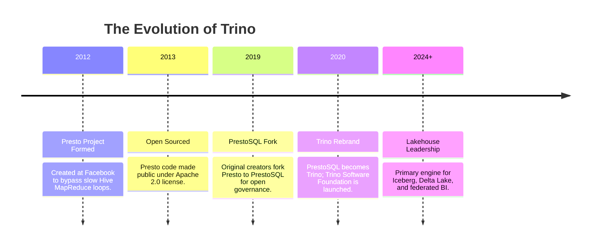
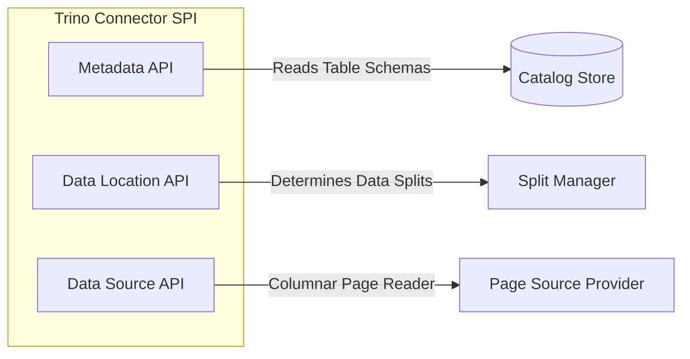
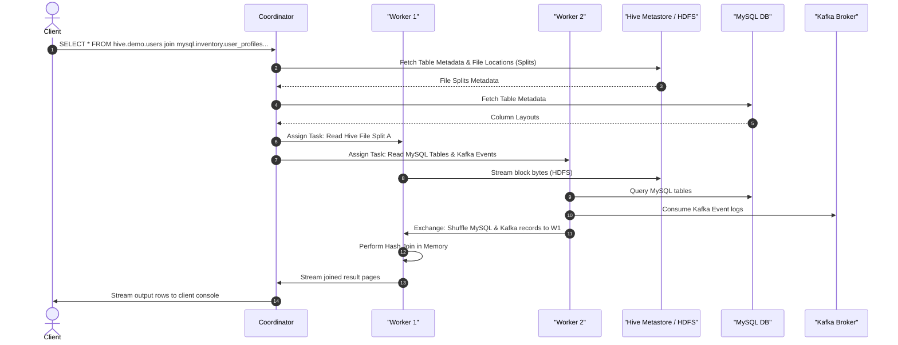
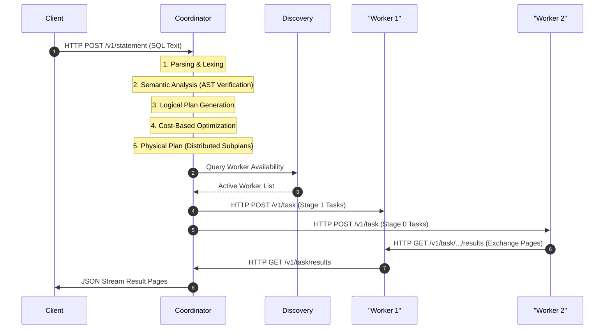

# Day 23: Apache Trino — Massively Parallel Processing (MPP) Engine, Catalogs & Distributed Queries

Welcome to Day 23 of the **30 Days of Modern Hadoop Ecosystem** series. Today, we are deep-diving into **Apache Trino** (formerly PrestoSQL), the industry-standard distributed SQL query engine designed for Massively Parallel Processing (MPP) and cross-catalog data federation. 

---

## SECTION 1 — INTRODUCTION

### 1.1 What is Trino?
**Apache Trino** is a highly efficient, storage-agnostic, open-source distributed SQL query engine. It was built from the ground up to query extremely large datasets (ranging from gigabytes to hundreds of petabytes) stored across one or multiple heterogeneous data sources using standard ANSI SQL.

Unlike traditional database systems or execution frameworks like MapReduce, Trino **does not store data** and **does not perform general-purpose batch processing**. Instead, it acts as a high-performance computation engine that queries data directly in its source locations, compiling SQL queries into distributed execution pipelines running concurrently in memory.

### 1.2 Why Was It Created?
At Facebook, by 2012, the data warehouse based on Apache Hive and MapReduce had grown so massive (tens of petabytes) that interactive querying became impossibly slow. Engineers were waiting hours for simple diagnostic queries to return. 

Traditional relational databases could not scale to this volume, and Hive was fundamentally bottlenecked by MapReduce's disk-writing boundaries. Facebook engineers (Martin Traverso, Dain Sundstrom, David Phillips, and Eric Hwang) created Presto to enable interactive, sub-second query latency for Facebook’s analysts on their Hadoop data lakes.

### 1.3 Evolution: Facebook Presto → PrestoSQL → Trino
* **2012**: Presto is designed at Facebook.
* **2013**: Facebook open-sources Presto under the Apache License.
* **2019**: Disagreements over project governance, release frequency, and open-source contribution flows lead the creators to leave Facebook and fork the project into **PrestoSQL**.
* **2020**: PrestoSQL is rebranded as **Trino** to distinguish it from the Facebook-led "PrestoDB" branch. The Presto Software Foundation is renamed the **Trino Software Foundation**.
* **Present**: Trino is the active, dominant branch of the original Presto engine, adopted by major cloud-scale enterprises globally.



### 1.4 Where Trino Fits in the Modern Hadoop Ecosystem
In a modern Hadoop or cloud-native data lake environment, Trino acts as the **Universal Query Layer**. It does not replace HDFS, S3, Hive Metastore, or Spark; rather, it sits on top of them, providing a unified SQL interface:

```
  +--------------------------------------------------------+
  |                   BI Tools / SQL Clients               |
  |              (Tableau, PowerBI, DBeaver, CLI)          |
  +---------------------------+----------------------------+
                              | (ANSI SQL over JDBC/ODBC)
                              v
  +--------------------------------------------------------+
  |                     TRINO ENGINE                       |
  |      (Federated Query Execution & Memory-Only MPP)      |
  +--------+------------------+-------------------+--------+
           |                  |                   |
           v (Hive SPI)       v (Kafka SPI)       v (MySQL SPI)
  +-----------------+  +-----------------+  +--------------+
  |  HDFS / S3      |  |  Kafka Broker   |  |  MySQL DB    |
  | (Parquet/ORC)   |  |  (JSON Streams) |  | (Relational) |
  +-----------------+  +-----------------+  +--------------+
```

### 1.5 Why Trino is the Query Engine for Lakehouses
The Lakehouse architecture aims to combine the reliability and transactional properties of a data warehouse with the low cost and flexibility of a data lake. Trino is the ideal engine for this because:
1. **Separation of Compute and Storage**: Scale CPU core clusters independently of file storage blocks.
2. **Metadata-Driven Execution**: Native support for modern transactional open table formats (Apache Iceberg, Delta Lake, and Apache Hudi) allows Trino to read partition listings directly from metadata files, skipping slow directory crawls.
3. **Low-Latency Ad-hoc Queries**: Memory-only, pipelined data exchanges bypass slow disk sync cycles, returning query results in seconds.

---

## SECTION 2 — PROBLEM STATEMENT

### 2.1 The Challenges of Centralizing Data (Anti-ETL)
Traditionally, companies solved multi-source analysis by copying all data into a single centralized Data Warehouse (DWH) using complex ETL (Extract, Transform, Load) pipelines:
* **High Latency**: ETL pipelines run on schedules (hourly/daily), making real-time analysis impossible.
* **Storage Duplication**: Keeping multiple copies of identical data across source DBs, staging files, and DWH tables inflates costs.
* **Pipeline Fragility**: Upstream schema changes (e.g., changing a column type in MySQL) break ETL processes, causing data drift and reporting failures.
* **Security Risks**: Moving sensitive data across networks increases the security surface area.

### 2.2 The Need for Federated Analytics
Rather than moving data to the compute, **Federated Analytics** allows the compute engine to push queries directly to where the data naturally resides. Trino acts as a virtualization layer, executing a single query that joins a customer table in PostgreSQL, transaction logs in Kafka, and historical clicks in an HDFS-based Hive catalog, without copying any source data to a permanent central repository.

```
Traditional ETL Pipeline:
[MySQL] --------\ 
[Kafka] --------+---> (Daily ETL Batch Job) ---> [Central Warehouse] ---> [BI Tool]
[Hive]  --------/ 

Trino Federated Query:
[MySQL] <------\ 
[Kafka] <------+--- (Trino Executes Virtual Join in Memory) <------------ [BI Tool]
[Hive]  <------/
```

### 2.3 Why Distributed SQL Matters
Executing complex joins on petabyte-scale files requires massive resource pooling. Single-node engines crash due to memory saturation. A distributed SQL engine compiles the query, partitions it, distributes individual workloads (splits) across a cluster of nodes, and executes them in parallel, enabling horizontal scale and performance.

---

## SECTION 3 — ARCHITECTURE DEEP DIVE

Trino uses a master-worker architecture consisting of a single **Coordinator** and multiple **Worker** nodes. 

### 3.1 Trino Cluster Architecture
```mermaid
graph TD
    Client[SQL Client / JDBC] -->|1. Submit SQL| Coord[Trino Coordinator Node]
    
    subgraph "Trino Coordinator JVM"
        Parser[Parser & Analyzer] --> Planner[Query Planner]
        Planner --> Optimizer[Cost-Based Optimizer]
        Optimizer --> Scheduler[Task Scheduler]
        Discovery[Discovery Service Server]
    end

    subgraph "Trino Worker JVM 1"
        W1_Exec[Task Execution Engine]
        W1_Buf[Output Buffers]
        W1_SPI[Connector SPI Manager]
    end

    subgraph "Trino Worker JVM 2"
        W2_Exec[Task Execution Engine]
        W2_Buf[Output Buffers]
        W2_SPI[Connector SPI Manager]
    end

    Scheduler -->|2. Assign Tasks| W1_Exec
    Scheduler -->|2. Assign Tasks| W2_Exec

    W1_Exec <-->|3. Exchange Operators (Data Shuffle)| W2_Exec

    W1_SPI -->|4. Pull Splits| Source1[("Hive Metastore / HDFS")]
    W2_SPI -->|4. Pull Splits| Source2[("MySQL / Kafka")]
    
    W1_Exec -->|5. Stream Streamed Rows| Coord
    Coord -->|6. Return Rows| Client

    W1_Exec -->|Heartbeat & Status| Discovery
    W2_Exec -->|Heartbeat & Status| Discovery
```

### 3.2 Coordinator vs. Worker Nodes
* **Coordinator Node**: 
  * Accepts SQL queries from clients.
  * Parses, analyzes, plans, and optimizes execution pathways.
  * Runs the **Discovery Service** (used by workers to locate coordinators and announce status).
  * Coordinates task assignments to workers and monitors worker health.
* **Worker Node**:
  * Fetches data slices (Splits) from underlying data sources via connectors.
  * Performs compute-heavy operations (filtering, projection, joins, aggregations).
  * Streams intermediate output pages to other workers (Exchange) or back to the coordinator.

### 3.3 Connector SPI Architecture
Trino communicates with storage systems using a plugin system based on the **Connector Service Provider Interface (SPI)**. 

Each Catalog represents a connector mount. The SPI consists of three main APIs:
1. **Metadata API**: Resolves schemas, tables, and column metadata. Used during query planning.
2. **Data Location API**: Identifies which workers should read specific files or splits.
3. **Data Source API**: Reads stream data blocks (Pages) from the underlying storage and converts them to Trino's internal columnar format.



### 3.4 Cross-Catalog Federated Query Flow
The diagram below shows the query flow when a user joins tables across MySQL, Kafka, and Hive.



---

## SECTION 4 — INTERNAL WORKING

Let's dissect the step-by-step lifecycle of a query execution inside Trino.



### Step 1: SQL Submission
A client (e.g., Trino CLI, Python client) submits an ASCII SQL statement via an HTTP POST request to the Coordinator's `/v1/statement` endpoint.

### Step 2: Parsing & Lexing
The Coordinator's **SqlParser** compiles the SQL text into an Abstract Syntax Tree (AST). It checks for grammar errors.

### Step 3: Semantic Analysis
The **Analyzer** checks the AST against metadata catalogs to:
* Validate that schemas, tables, and columns exist.
* Verify security privileges and access rights.
* Check column types and resolve functions.

### Step 4: Logical Planning
The **Query Planner** converts the AST into a directed acyclic graph (DAG) of logical query operators (TableScan, Filter, Project, Join, Aggregate).

### Step 5: Optimization (CBO)
The **Cost-Based Optimizer (CBO)** modifies the logical plan for performance:
* **Join Reordering**: Determines the cheapest order to join multiple tables based on size statistics.
* **Join Strategy Selection**: Decides whether to use a **Broadcast Join** (copying the smaller table to all nodes) or a **Partitioned/Hash Join** (repartitioning both tables on join keys).
* **Predicate Pushdown**: Moves filter operators as close to the storage layer as possible (e.g., pushing `WHERE age > 30` down to the connector so only matching blocks are read).

### Step 6: Physical Planning & Stage Generation
The logical plan is divided into **Stages** at exchange boundaries. Stages represent logical execution steps.
* **Stage 0 (Root)**: Aggregates final rows and streams them to the coordinator.
* **Stage 1 (Intermediate)**: Performs joins and aggregations.
* **Stage 2 (Source)**: Scans tables and filters data.

### Step 7: Task Distribution & Splitting
Each Stage is instantiated as a set of physical **Tasks** distributed across workers. 
The Coordinator's **Split Manager** queries the connector to divide table data into **Splits** (e.g., specific HDFS byte ranges or Kafka partitions). The Task Scheduler assigns these splits to workers based on locality and load.

### Step 8: Execution & Exchange
Workers execute tasks. Upstream tasks scan data, format it into memory blocks called **Pages**, and expose them via REST endpoints. Downstream tasks pull these pages over HTTP (the **Exchange** process) to complete joins or aggregations.

### Step 9: Result Aggregation
The root task combines results and streams them back to the coordinator, which writes them to the client's HTTP response buffer.

### Step 10: Fault Handling
Unlike Hadoop or Spark, Trino historically aborted the entire query if a node failed (focusing on low latency over durability). Modern Trino supports **Task-Level Retries** (spilling intermediate results to an exchange buffer), enabling query resilience for long-running batch workloads.

---

## SECTION 5 — CORE CONCEPTS

To master Trino, you must understand these architectural terms:

| Term | Definition |
| :--- | :--- |
| **Catalog** | A mount point for a connector configuration (e.g., `hive.properties` defines a catalog named `hive`). |
| **Schema** | A logical grouping of tables under a Catalog (equivalent to a Database). |
| **Split** | A unit of data processed by a single task. For file connectors, a split is a byte range of a file. |
| **Stage** | A section of query execution. Stages do not run tasks directly; they group tasks at shuffle boundaries. |
| **Task** | The physical worker execution unit. A task runs a series of operators on assigned splits. |
| **Exchange** | The mechanism used to transfer data between workers across different stages of execution. |
| **Predicate Pushdown** | Optimization that pushes filtering down to the connector to avoid reading unnecessary bytes. |
| **Dynamic Filtering** | Runtime optimization where the engine uses join key ranges from one table to filter the other table during a scan, reducing network traffic. |
| **MPP** | Massively Parallel Processing. Multiple nodes compute independent partitions concurrently in RAM. |

---

## SECTION 6 — PRODUCTION ENGINEERING

Running Trino in production requires careful tuning, memory planning, and resource management.

### 6.1 Cluster Sizing & JVM Configuration
Because Trino processes data in-memory, Memory and CPU are your primary constraints.
* **CPU Core Allocation**: 1 Thread per CPU core. Hyper-threading should be enabled.
* **JVM Selection**: Java 17 or 21 (depending on Trino version, e.g., Trino 400+ requires Java 17; Trino 430+ requires Java 21) is mandatory. Use the **G1 GC** collector.

### 6.2 The Trino Memory Model
Each worker node partitions JVM Heap space into distinct pools:

```
+-----------------------------------------------------------------------+
|                         JVM HEAP (e.g., 32 GB)                        |
|                                                                       |
|  +---------------------------+-------------------------------------+  |
|  |       User Memory         |           System Memory             |  |
|  |         (12 GB)           |              (12 GB)                |  |
|  |                           |                                     |  |
|  |  Allocated to query joins,|  Used by buffers, exchanges, hash   |  |
|  |  aggregations, and table  |  tables, and JVM internal operations|  |
|  |  scan caches.             |                                     |  |
|  +---------------------------+-------------------------------------+  |
|  +-----------------------------------------------------------------+  |
|  |                 Untracked / OS / Overhead Pool (8 GB)           |  |
|  +-----------------------------------------------------------------+  |
+-----------------------------------------------------------------------+
```

* **User Memory**: Memory used by queries during execution (joins, aggregates).
* **System Memory**: Memory used by Trino buffers, exchanges, and internal hash tables.
* **Memory Limits Config (`config.properties`)**:
  * `query.max-memory-per-node`: Maximum User memory a single query can consume on a worker node (e.g., `1GB`).
  * `query.max-total-memory-per-node`: Maximum User + System memory a single query can consume on a worker node (e.g., `1.5GB`).
  * `query.max-memory`: Global limit for a single query across the entire cluster.

### 6.3 Resource Groups for Concurrency
To prevent a single user from running a heavy query that locks up the entire cluster, use **Resource Groups**. Define resource rules in `resource-groups.properties` to limit query concurrency, queuing, and memory consumption per user group (e.g., BI Analysts vs. Ad-hoc Developers).

```json
{
  "selectors": [
    {
      "user": "alice",
      "group": "admin"
    },
    {
      "source": ".*tableau.*",
      "group": "bi"
    }
  ],
  "groups": [
    {
      "name": "admin",
      "softMemoryLimit": "80%",
      "hardConcurrencyLimit": 100,
      "maxQueued": 1000
    },
    {
      "name": "bi",
      "softMemoryLimit": "40%",
      "hardConcurrencyLimit": 10,
      "maxQueued": 100
    }
  ]
}
```

---

## SECTION 7 — HANDS-ON LAB

In this lab, we will run queries against a live, multi-node, federated Trino environment. We will join Hive, MySQL, and Kafka in a single query.

### 7.1 Setup the Lab Environment
Follow these steps to launch the containers:

```bash
# Navigate to the docker deployment directory
cd Day-23-Trino-MPP-Engine/docker

# Build and start the services in background
docker-compose up -d --build
```

Wait until all services are healthy. You can check the health status of the services by running:
```bash
docker-compose ps
```

### 7.2 Catalog Registrations
Our Trino Coordinator container is configured to mount three catalogs defined in the `configs/catalogs` directory:
1. `hive`: Points to the PostgreSQL-backed Hive Metastore.
2. `mysql`: Points to the MySQL instance containing transactional table databases.
3. `kafka`: Maps stream message feeds into structured columnar tables using schema descriptions.

### 7.3 Step-by-Step Validation Tasks

#### Step A: Access the Trino CLI
Enter the Trino Coordinator CLI interface:
```bash
docker exec -it trino-coordinator-day23 trino
```

#### Step B: Query System Runtime Nodes
Verify that the coordinator and worker are both active:
```sql
SELECT node_id, http_uri, coordinator, state FROM system.runtime.nodes;
```
*Expected Output:*
```
       node_id        |         http_uri          | coordinator | state  
----------------------+---------------------------+-------------+--------
 trino-coordinator... | http://172.23.0.9:8080    | true        | active 
 trino-worker-day23   | http://172.23.0.10:8080   | false       | active 
(2 rows)
```

#### Step C: Create and Populate a Hive Table
Create a schema and a table inside the Hive catalog:
```sql
CREATE SCHEMA hive.demo;

CREATE TABLE hive.demo.users (
  id INT,
  name VARCHAR,
  email VARCHAR
) WITH (
  format = 'ORC',
  external_location = 'hdfs://namenode-day23:9000/user/hive/warehouse/demo.db/users'
);

INSERT INTO hive.demo.users VALUES 
  (1, 'Alice Smith', 'alice@example.com'),
  (2, 'Bob Jones', 'bob@example.com'),
  (3, 'Charlie Brown', 'charlie@example.com');
```

Verify that you can query the data:
```sql
SELECT * FROM hive.demo.users;
```

#### Step D: Create and Populate MySQL Tables
Exit Trino CLI (`exit;`), and use the MySQL CLI tool to create user metadata:
```bash
docker exec -it mysql-day23 mysql -uroot -prootpassword -e "
  CREATE TABLE inventory.user_profiles (
    user_id INT PRIMARY KEY,
    signup_source VARCHAR(50),
    account_status VARCHAR(20)
  );
  INSERT INTO inventory.user_profiles VALUES 
    (1, 'Google Search Ads', 'Active'), 
    (2, 'Referral Invitation', 'Pending'),
    (3, 'Direct Bookmark Link', 'Active');
"
```

#### Step E: Populate Stream Clicks in Kafka
Create a topic named `clicks` and write three JSON events:
```bash
docker exec -t kafka-day23 kafka-topics --create --bootstrap-server localhost:9092 --replication-factor 1 --partitions 1 --topic clicks || true

docker exec -i kafka-day23 kafka-console-producer --bootstrap-server localhost:9092 --topic clicks <<EOF
{"click_id":"c-201","user_id":1,"page_url":"/home","click_timestamp":"2026-07-14T12:00:00Z"}
{"click_id":"c-202","user_id":2,"page_url":"/products","click_timestamp":"2026-07-14T12:05:00Z"}
{"click_id":"c-203","user_id":1,"page_url":"/checkout","click_timestamp":"2026-07-14T12:10:00Z"}
EOF
```

#### Step F: Run the Federated Query Join
Re-open Trino CLI (`docker exec -it trino-coordinator-day23 trino`), and run the federated join query:
```sql
SELECT 
  c.click_id AS click_id,
  h.name AS user_name,
  h.email AS user_email,
  m.signup_source AS signup_source,
  m.account_status AS account_status,
  c.page_url AS page_url
FROM kafka.default.clicks c
JOIN hive.demo.users h ON c.user_id = h.id
JOIN mysql.inventory.user_profiles m ON c.user_id = m.user_id
ORDER BY c.click_timestamp DESC;
```
*Expected Output:*
```
 click_id |  user_name  |    user_email     |    signup_source    | account_status | page_url  
----------+-------------+-------------------+---------------------+----------------+-----------
 c-203    | Alice Smith | alice@example.com | Google Search Ads   | Active         | /checkout 
 c-202    | Bob Jones   | bob@example.com   | Referral Invitation | Pending        | /products 
 c-201    | Alice Smith | alice@example.com | Google Search Ads   | Active         | /home     
(3 rows)
```

---

## SECTION 8 — BUILD FROM SOURCE

If you want to modify Trino plugins or contribute features, you need to compile Trino from source.

### 8.1 Prerequisites
* **OS**: Linux or macOS.
* **JDK**: Java 21 (64-bit architecture version).
* **Maven**: Version 3.9+ (used for package resolution).
* **Docker**: Required to compile containers during build checks.

### 8.2 Build Commands
```bash
# Clone the official repository
git clone https://github.com/trinodb/trino.git
cd trino

# Compile all modules skipping tests
./mvnw clean install -DskipTests
```
* **Source Layout**:
  * `trino-main/`: Contains the coordinator scheduler, planner, and task engine.
  * `trino-spi/`: Plugin API interfaces defining catalogs.
  * `trino-server/`: Packages target release zip binaries.
  * `plugin/`: Directory containing all connector plugins (e.g., `trino-hive`, `trino-mysql`).

---

## SECTION 9 — DOCKER DEPLOYMENT

The docker deployment is structured as follows:

```
Day-23-Trino-MPP-Engine/
├── configs/
│   ├── catalogs/
│   │   ├── hive.properties
│   │   ├── kafka.properties
│   │   └── mysql.properties
│   ├── kafka/
│   │   └── default.clicks.json
│   ├── config.properties
│   ├── config-worker.properties
│   ├── core-site.xml
│   ├── hdfs-site.xml
│   ├── hive-site.xml
│   ├── jvm.config
│   ├── log.properties
│   ├── node.properties
│   └── node-worker.properties
├── docker/
│   ├── bootstrap.sh
│   ├── Dockerfile
│   └── docker-compose.yml
└── scripts/
    ├── verify-trino.sh
    ├── verify-hive-catalog.sh
    ├── verify-kafka-catalog.sh
    └── verify-federation.sh
```

To run the environment, see the [Hands-On Lab](#71-setup-the-lab-environment) section.

---

## SECTION 10 — LOCAL CLUSTER DEPLOYMENT

To deploy a physical multi-node cluster without Docker, install the Trino binaries on every machine.

### 10.1 Coordinator Configuration (`/etc/trino/config.properties`)
```properties
coordinator=true
node-scheduler.include-coordinator=false
http-server.http.port=8080
query.max-memory=32GB
query.max-memory-per-node=4GB
query.max-total-memory-per-node=6GB
discovery.uri=http://coordinator.cluster.local:8080
```

### 10.2 Worker Configuration (`/etc/trino/config.properties`)
On every worker node, configure it to connect to the coordinator:
```properties
coordinator=false
http-server.http.port=8080
query.max-memory=32GB
query.max-memory-per-node=4GB
query.max-total-memory-per-node=6GB
discovery.uri=http://coordinator.cluster.local:8080
```

---

## SECTION 11 — VALIDATION

You can run our automated validation scripts to verify catalog integration and test federated queries:

```bash
# Navigate to validation scripts directory
cd Day-23-Trino-MPP-Engine/scripts/

# Make them executable
chmod +x *.sh

# Execute Validation
./verify-trino.sh
./verify-hive-catalog.sh
./verify-kafka-catalog.sh
./verify-federation.sh
```

---

## SECTION 12 — PRODUCTION TROUBLESHOOTING PLAYBOOK

Here is how to triage common Trino production issues:

### 12.1 Worker Node Offline
* **Symptoms**: Queries fail with `Active workers is fewer than minimum...` or show degradation in execution time.
* **Triage**: Check the Coordinator's active node list via Web UI (port `8080`) or system catalog query.
* **Root Causes**:
  * Network partition between Worker and Coordinator.
  * Worker JVM crashed due to Out-Of-Memory error (OOM).
* **Resolution**:
  * Inspect worker log files at `/var/trino/data/var/log/launcher.log` and `server.log`.
  * Check the worker system log (`/var/log/messages` or `dmesg`) for `Out of memory: Kill process` messages from the OS kernel.
  * Restart the worker process: `bin/launcher start`.

### 12.2 Coordinator Failures
* **Symptoms**: Clients receive HTTP 503 Service Unavailable errors or connection timeouts.
* **Triage**: Check if coordinator process is running.
* **Resolution**:
  * Implement **High Availability (HA)** using multiple coordinator instances sitting behind a proxy (like HAProxy or Nginx) configured with sticky sessions.
  * Ensure discovery service is active on the primary coordinator.

### 12.3 Query Aborted: Query Exceeded Max Memory Limit
* **Symptoms**: Query fails with error code `EXCEEDED_LOCAL_MEMORY_LIMIT` or `EXCEEDED_GLOBAL_MEMORY_LIMIT`.
* **Root Causes**: 
  * The query requested more memory for joins or aggregations than allowed by `query.max-memory-per-node`.
  * Severe skew in data partitioning, causing one worker to receive most of the join keys.
* **Resolution**:
  * Enable **Spill to Disk** by setting `spill-enabled=true` in `config.properties`. This writes temporary join tables to local NVMe disks when memory is full, preventing crashes (at the cost of query speed).
  * Optimize the SQL: Use `EXPLAIN ANALYZE` to find partition skew and rewrite joins to be more balanced.

---

## SECTION 13 — REAL-WORLD CASE STUDY

### 13.1 Netflix: Scale and Iceberg Integration
* **Scale**: Over 100 Petabytes of data stored on AWS S3.
* **Use Case**: Ad-hoc analytics and dashboards for thousands of employees.
* **Implementation**: Netflix uses Trino to run interactive queries directly on S3. They co-created the **Apache Iceberg** table format to solve S3 directory listing performance bottlenecks, allowing Trino to query large tables with sub-second metadata parsing.
* **Results**: Replaced large, slow Hive clusters with Trino, reducing query latency by up to 10x and saving millions in infrastructure costs.

### 13.2 Uber: Federated Geolocation Analytics
* **Use Case**: Joining real-time trip details (Kafka streams) with historical driver logs (Hadoop files) and geo-location metadata (MySQL).
* **Implementation**: Uber runs massive Trino clusters configured with connectors to Hive, Kafka, and MySQL. This allows engineers to query real-time trip statistics and historical patterns in a single SQL statement.

---

## SECTION 14 — INTERVIEW QUESTIONS & ANSWERS

### 14.1 Beginner Questions
**Q: Does Trino store data?**  
**A**: No. Trino is a compute-only query engine. It does not store tables on disk. It reads data from source systems (like HDFS, S3, MySQL) using connectors, processes it in memory, and returns results to the client.

**Q: What is a Split in Trino?**  
**A**: A Split is a logical chunk of a larger dataset that a single worker task can process in parallel. For example, in HDFS, a split is a byte range of an ORC file; in MySQL, a split might represent a partition of a table.

---

### 14.2 Intermediate Questions
**Q: How does Trino differ from Spark SQL?**  
**A**: Trino is designed for interactive, low-latency ad-hoc SQL queries. It runs as a persistent service, using a memory-only execution model where workers pipeline data over HTTP. Spark is a general-purpose cluster compute framework designed for both batch processing and ETL, compiling queries to JAR jobs that spin up JVM containers, historically saving intermediate shuffle stages to disk for fault tolerance.

**Q: Explain Predicate Pushdown in Trino.**  
**A**: Predicate Pushdown is an optimization where filter operations (`WHERE` clauses) are pushed down to the connector so they are executed directly by the underlying storage engine. This prevents Trino from reading unnecessary data blocks, reducing network I/O and processing overhead.

---

### 14.3 Advanced Questions
**Q: What is Dynamic Filtering and how does it optimize runtime joins?**  
**A**: Dynamic Filtering is a runtime optimization used during joins. During execution, a bloom filter or value range list is built on the smaller (build) table. This filter is dynamically pushed down to the scan stage of the larger (probe) table on worker nodes, allowing Trino to discard non-matching rows *before* they are read from disk or sent over the network, dramatically speeding up distributed joins.

**Q: What happens to a query if a worker node crashes during execution?**  
**A**: By default, Trino uses a memory-only pipeline, meaning if a worker crashes, the coordinator cannot retrieve intermediate data and the query fails. However, in modern Trino (version 370+), **Task-Level Retries** can be configured. This writes intermediate stage outputs to an external exchange buffer (e.g., S3 or HDFS), allowing the coordinator to reschedule failed tasks on healthy workers and complete the query without restarting it.

---

## SECTION 15 — KEY TAKEAWAYS

1. **Anti-ETL Architecture**: Trino virtualizes data, allowing you to query MySQL, Kafka, and Hive Metastore tables in a single statement without copying data to a central location.
2. **Massively Parallel Processing (MPP)**: Trino divides execution plans into logical stages and runs them concurrently in-memory across a cluster of worker JVMs.
3. **Pipelined Execution**: Data is transferred between worker tasks over the network via HTTP, avoiding slow disk writes.
4. **Lakehouse Optimized**: Native connectors for Apache Iceberg and Delta Lake enable high-performance transaction-aware reads.
5. **Memory Limits Matter**: Tune JVM heap sizes, user memory limits, and configure resource groups to keep your cluster stable under heavy concurrent workloads.

---

## SECTION 16 — REFERENCES & DEEP READS

1. **Official Trino Documentation**: [https://trino.io/docs/current/](https://trino.io/docs/current/)
2. **Presto: A Distributed SQL Query Engine for Big Data**: [Presto Paper (ACM SIGMOD)](https://dl.acm.org/doi/10.1145/3299869.3314033)
3. **Trino Github Repository**: [https://github.com/trinodb/trino](https://github.com/trinodb/trino)
4. **Netflix Tech Blog — Iceberg/Trino integration**: [Netflix Technology Blog](https://netflixtechblog.com/)
