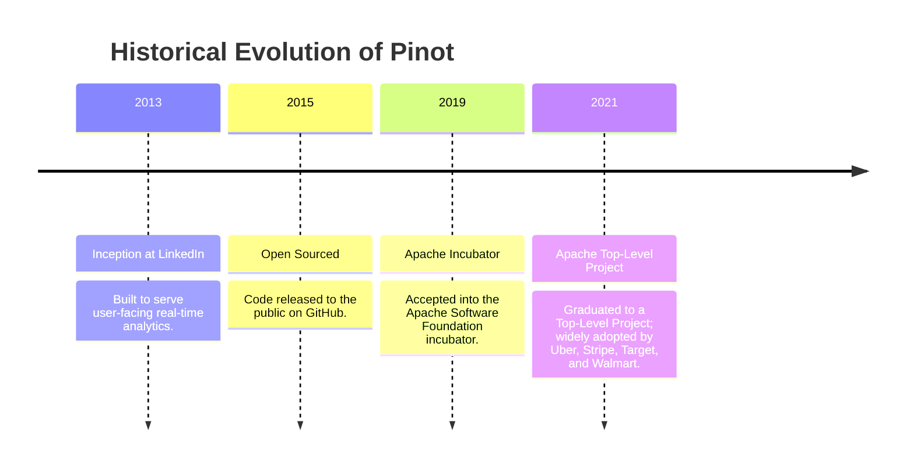
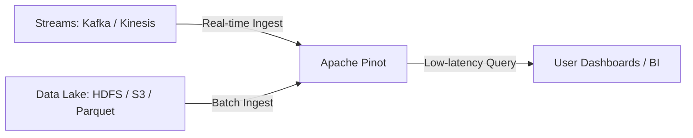
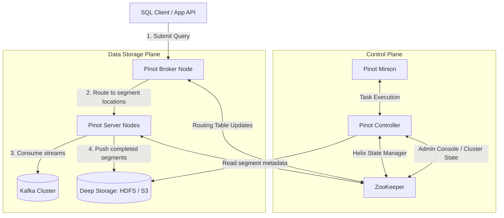
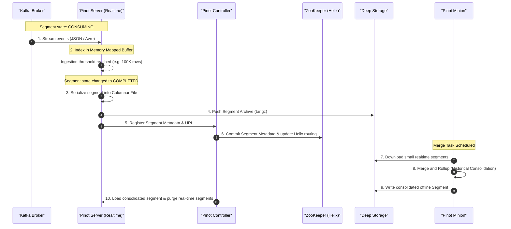

# Day 24: Apache Pinot OLAP Engine — Real-time Ingestion & Low-Latency Analytics

Welcome to Day 24 of the **30 Days of Modern Hadoop Ecosystem** series. Today, we are deep-diving into **Apache Pinot**, a distributed columnar real-time OLAP query engine designed to serve user-facing analytical queries with sub-second latencies on scale.

---

## 🗺️ Learning Roadmap
```
                       [ Apache Pinot OLAP Engine ]
                                    |
          +-------------------------+-------------------------+
          |                                                   |
[ Core Architecture ]                                [ Indexing & Mechanics ]
  - ZooKeeper Coordination                             - Dictionary Encoding
  - Controller, Broker, Server, Minion                 - Forward & Inverted Indexes
  - Segment Lifecycle (Consuming vs Completed)         - Bloom Filters & Range Indexes
          |                                            - Star-tree Index Aggregations
          |                                                   |
          +-------------------------+-------------------------+
                                    |
                         [ Production Operation ]
                           - Kafka Streaming Ingestion
                           - Scatter-Gather Execution
                           - Multi-tenant Resource Isolation
```

---

## SECTION 1 — INTRODUCTION

### 1.1 What is Apache Pinot?
**Apache Pinot** is a real-time, distributed, column-oriented OLAP (Online Analytical Processing) datastore. It is engineered to perform analytical queries (aggregations, filtering, group-bys) on massive datasets containing billions of rows, returning results in milliseconds.

Pinot does not replace operational databases (OLTP) or general-purpose batch processing engines (Spark/MapReduce). Instead, it sits at the intersection of streaming data pipelines and user-facing analytics, translating raw event streams into index-backed, queryable datasets immediately upon ingestion.

### 1.2 Why Was It Created? (The LinkedIn Origin Story)
At LinkedIn, around 2013-2014, features like "Who Viewed My Profile", "Feed Analytics", and "Member Dashboard Metrics" were growing exponentially.
* **The Challenge**: Millions of users needed to see their views, clicks, and metrics in real-time. Traditional databases could not handle the query load (thousands of QPS) while executing complex aggregates.
* **The Failure of Batch Systems**: Computing these metrics via Hadoop MapReduce resulted in data freshness lag of 24+ hours, creating a poor user experience.
* **The Pinot Solution**: LinkedIn engineers designed Pinot to ingest events directly from Kafka and store them in memory-mapped columnar index structures, serving low-latency requests directly to the web application.



### 1.3 Where Pinot Fits in the Data Platform
In a modern data stack, Pinot acts as the **Serving Layer for Real-time Analytics**, ingesting from both streaming (Kafka, Kinesis) and batch sources (HDFS, S3, Spark).



---

## SECTION 2 — PROBLEM STATEMENT

### 2.1 Why Traditional Databases and Warehouses Fail at Real-Time High-QPS Analytics
To understand why Pinot is necessary, let's contrast how MySQL, Snowflake, and Pinot behave under different workloads.

#### MySQL (OLTP)
* **Goal**: High-speed, row-level transaction safety (ACID).
* **Failure point under OLAP**: Running `SELECT SUM(amount) FROM tx WHERE country = 'US'` requires scanning rows sequentially or maintaining massive B-Tree indexes which slow down writes. At high concurrency (1000s of QPS) and big data volumes, it crashes due to locks and disk I/O saturation.

#### Snowflake / Hive / BigQuery (Batch Warehouses)
* **Goal**: Massive table joins and long-running reporting queries.
* **Failure point under Real-Time**: Designed for throughput, not concurrency. Ingestion takes minutes to hours. Running queries on dashboards takes seconds to minutes. If 5,000 active users refresh their dashboard concurrently, these warehouses will queue queries, causing massive dashboard latency.

#### Apache Pinot (Real-time OLAP)
* **Goal**: Ultra-low latency query execution at high QPS on streaming data.
* **Solution**: Ingests event logs, writes them to immutable column indices in-memory/off-heap, and leverages specialized indexing (e.g. Star-tree) to skip scanning raw data.

### 2.2 MySQL vs. Data Warehouse vs. Pinot

| Dimension | OLTP (MySQL) | Data Warehouse (Snowflake) | Real-time OLAP (Pinot) |
| :--- | :--- | :--- | :--- |
| **Ingestion Latency** | Milliseconds | Minutes to Hours | Sub-second (Streaming) |
| **Query Latency** | Milliseconds (Point lookup) | Seconds to Minutes | Milliseconds (Aggregations) |
| **Concurrency (QPS)** | High (Writes/Point reads) | Low (Tens to Hundreds) | Very High (Thousands) |
| **Data Mutability** | Highly Mutable | Immutable/Append-Mostly | Immutable (Append-Only) |
| **Joins** | Full relational joins | Multi-way large scale joins | Limited (optimized for denormalized tables) |

---

## SECTION 3 — ARCHITECTURE DEEP DIVE

Apache Pinot uses a modular, distributed architecture coordinated by ZooKeeper.



### 3.1 Components and Roles

* **ZooKeeper / Helix**: Helix runs on Zookeeper, maintaining cluster topology. It tracks the status of servers, brokers, and segment partition mappings (Helix states: Offline, Online, Consuming).
* **Pinot Controller**: The administrative hub. It handles cluster state transitions, schedules background jobs, manages table schemas, and instructs Servers on where to download or build segments.
* **Pinot Broker**: The query router. It parses SQL queries from clients, prunes segments to find which contain the necessary data, sends queries to target servers (Scatter), and merges intermediate results (Gather).
* **Pinot Server**: The execution engine. Servers host data segments. They consume events directly from streaming queues, write them to memory-mapped buffers (realtime), and run aggregations on localized segment data (offline).
* **Pinot Minion**: A worker node that executes heavy background tasks (e.g., segment compaction, rollups, and data retention scrubbing) offloaded by the Controller.
* **Deep Storage**: The durable system of record (HDFS, Amazon S3, Google Cloud Storage, or MinIO). Pinot Servers back up completed segments here. If a Server node dies, a replacement Server downloads the segment from Deep Storage.

---

## SECTION 4 — INTERNAL WORKING & LIFE OF A SEGMENT

This diagram maps the lifecycle of a record and segment from streaming ingestion to historical consolidation.



### 4.1 Ingestion & Segment Creation
1. **Low Level Ingestion**: Servers read chunks of records from Kafka partitions. Columns are dictionary-encoded in memory.
2. **Buffer Spilling**: Once row limits or durations are met, the buffer is sealed. Pinot parses dictionaries, builds indexing files (Forward, Inverted, Range, Star-tree), and saves the segment locally.
3. **Deep Storage Sync**: The server tars the segment and uploads it to the configured Deep Storage (S3/HDFS).
4. **Metadata Updates**: Zookeeper is updated. The Broker learns about the new segment's boundaries, updating its routing maps.

### 4.2 Query Execution (Scatter-Gather)
1. **Broker Routing**: A client requests `SELECT COUNT(*) FROM user_registrations WHERE country = 'USA'`.
2. **Segment Pruning**: The Broker looks at metadata and identifies only 10 out of 500 segments contain `country = 'USA'`.
3. **Scatter**: The Broker issues concurrent network requests to Pinot Servers holding those 10 segments.
4. **Local Scan**: Pinot Servers scan index files in parallel, computing local aggregate counts.
5. **Gather**: Servers reply with partial counts. The Broker sums these values and replies to the client.

---

## SECTION 5 — CORE CONCEPTS & INDEXING MECHANICS

### 5.1 Realtime, Offline, and Hybrid Tables
* **Realtime Tables**: Ingest data directly from active streaming sources (e.g. Kafka). Optimized for recent data (hours/days).
* **Offline Tables**: Ingest data via batch processes (Spark, Hadoop). Optimized for long-term historical records.
* **Hybrid Tables**: Combine Realtime and Offline tables under a single logical schema. Pinot queries both and automatically deduplicates data at the overlap boundary.

### 5.2 Indexing Strategies: How Pinot Speeds Up Queries
Pinot's performance relies on specialized indices configured per column.

#### 1. Dictionary Encoding
Converts repetitive string values into integer IDs, saving storage space and speeding up column scans.
```
Raw Data:    ["USA", "CAN", "USA", "DEU", "CAN"]
Dictionary:  {0: "CAN", 1: "DEU", 2: "USA"}
Encoded Array: [2, 0, 2, 1, 0]
```

#### 2. Forward Index
Maps row IDs to column values. Can be:
* **Sorted**: Highly compressed (Run-length encoded), fast range checks.
* **Unsorted**: Directly maps index to value ID.

#### 3. Inverted Index
Maps column values back to bitmap lists of row IDs.
```
Value "USA" -> Bitmap: [1, 0, 1, 0, 0] (Rows 0 and 2 match)
```
Allows Pinot to perform bitmap boolean operations (AND, OR) for multi-column filters without scanning arrays.

#### 4. Bloom Filter
Probabilistic structure that tells whether a value is **definitely not** in a segment. Pinot checks the Bloom filter to skip scanning segments.

#### 5. Range Index
Pre-groups numerical ranges to optimize operations like `WHERE age BETWEEN 20 AND 30` without scanning every record.

#### 6. Text Index
Uses Apache Lucene underneath to allow fuzzy text match: `TEXT_MATCH(email, '*gmail*')`.

#### 7. Star-Tree Index
A multi-dimensional pre-aggregation tree index. It splits dimensions hierarchically and stores pre-calculated aggregates at leaf nodes, bypassing CPU-intensive scans.

---

## SECTION 6 — PRODUCTION ENGINEERING & RUNNING AT SCALE

### 6.1 Sizing and Resource Calculations
* **CPU Sizing**: Pinot Query Execution is highly parallel. Allocate at least 1 vCPU per active segment queried concurrently.
* **Memory Sizing**: Use high off-heap allocation limits. Set `-Xmx` (Heap) to 8-16 GB and leave remaining RAM (32-64 GB) for memory-mapped segment files.
* **Disk Space**: Sized based on retention. Always provision SSDs for Servers hosting `CONSUMING` segments.

### 6.2 Security
* **Authentication**: Use TLS for broker/controller REST APIs. Configure Basic or OAuth2 plugins.
* **Authorization**: Bind role access levels (Read, Write, Admin) per table.
* **TLS Encryption**: Configure internal communication channels (Broker-to-Server, Controller-to-Server) using TLS to protect data shuffles.

### 6.3 Tiered Storage
To optimize costs:
* **Hot Tier**: Keep recent real-time segments on local NVMe SSDs.
* **Warm Tier**: Move older segments to slower SSDs or hard drives.
* **Cold Tier**: Store archive segments directly on Deep Storage (e.g. S3), with Servers mounting files on demand.

---

## SECTION 8 — BUILD FROM SOURCE

### 8.1 Official Repository
The official codebase is hosted on GitHub: [https://github.com/apache/pinot](https://github.com/apache/pinot)

### 8.2 Compilation Prerequisites
* **Java Development Kit (JDK)**: JDK 11 or JDK 17 (depending on Pinot version).
* **Apache Maven** or **Gradle**: Built using Maven.
* **Node.js & Yarn**: Required to compile the Controller Admin UI dashboard.

### 8.3 Compilation Commands
Clone the repository and build the distribution:
```bash
git clone https://github.com/apache/pinot.git
cd pinot
mvn clean install -DskipTests -Ppackage
```

### 8.4 Location of Compiled Packages
After compilation, packages are located in:
* `pinot-distribution/target/apache-pinot-<version>-bin.tar.gz`
Unzip this package to run scripts locally.

---

## SECTION 10 — LOCAL CLUSTER DEPLOYMENT

For a complete guide to running Pinot locally, check the Hands-on Lab folder:
* 🔬 [Hands-on Lab README](file:///c:/Users/Himanshu_Verma/DELL/Personal/30_Days_of_Modern_Hadoop_Ecosystem/Day-24-Pinot-OLAP-Engine/lab/README.md)

### Deployment Modes
* **Single Node**: Good for validation. Run all Pinot components in a single container.
* **Multi Node (Cluster)**: Recommended for testing production topologies. Controller, Broker, Server, and Minion run as separate JVM processes connected via ZooKeeper.

---

## SECTION 12 — PRODUCTION TROUBLESHOOTING

For operational runbooks, logs signatures, and issue resolution processes, check the Troubleshooting folder:
* 🛠️ [Troubleshooting Guide](file:///c:/Users/Himanshu_Verma/DELL/Personal/30_Days_of_Modern_Hadoop_Ecosystem/Day-24-Pinot-OLAP-Engine/troubleshooting/README.md)

---

## SECTION 13 — REAL-WORLD CASE STUDY: LINKEDIN

### 1. Who Viewed My Profile
LinkedIn uses Apache Pinot to power the "Who Viewed My Profile" feature.
* **Metrics**: Hundreds of millions of members, thousands of queries per second.
* **Workload**: Every time a user clicks "Who Viewed My Profile", Pinot aggregates logs of profile visits over the past 90 days.
* **Why Pinot**: Pre-aggregation index patterns and high write-throughput support enable this query to load in under 10ms.

### 2. LinkedIn Feed & Ads Analytics
* **Ad performance**: Advertisers require real-time impressions, clicks, CTR, and spend aggregation.
* **Why Pinot**: Combining Real-time tables (impressions from Kafka) and Offline tables (click validations) enables advertisers to optimize campaigns without waiting for daily ETL.

---

## SECTION 14 — TECHNICAL INTERVIEW PREPARATION

For key interview questions and detailed architectural answers, check:
* 🔑 [Interview Questions & Answers](file:///c:/Users/Himanshu_Verma/DELL/Personal/30_Days_of_Modern_Hadoop_Ecosystem/Day-24-Pinot-OLAP-Engine/interview/README.md)

---

## SECTION 15 — KEY TAKEAWAYS

1. **Why Pinot Exists**: To bridge the gap between streaming event ingestion and low-latency, user-facing analytics queries at high concurrency (QPS).
2. **Architecture**: Separate components (Controller, Broker, Server, Minion) allow independent scaling of compute, storage, and ingestion tasks.
3. **Low Latency Secret**: Pinot doesn't scan entire datasets. It maps columns to memory (`mmap`) and skips scans using specialized indexes: **Inverted**, **Bloom**, **Range**, and **Star-tree**.
4. **Segment Lifecycle**: Data is written into immutable segment partitions. In realtime ingestion, segments transition from `CONSUMING` (in-memory) to `COMPLETED` (spilled to Deep Storage).

---

## SECTION 16 — REFERENCES

For links to official documentation, conference videos, and academic papers:
* 📚 [References Directory](file:///c:/Users/Himanshu_Verma/DELL/Personal/30_Days_of_Modern_Hadoop_Ecosystem/Day-24-Pinot-OLAP-Engine/references/README.md)
