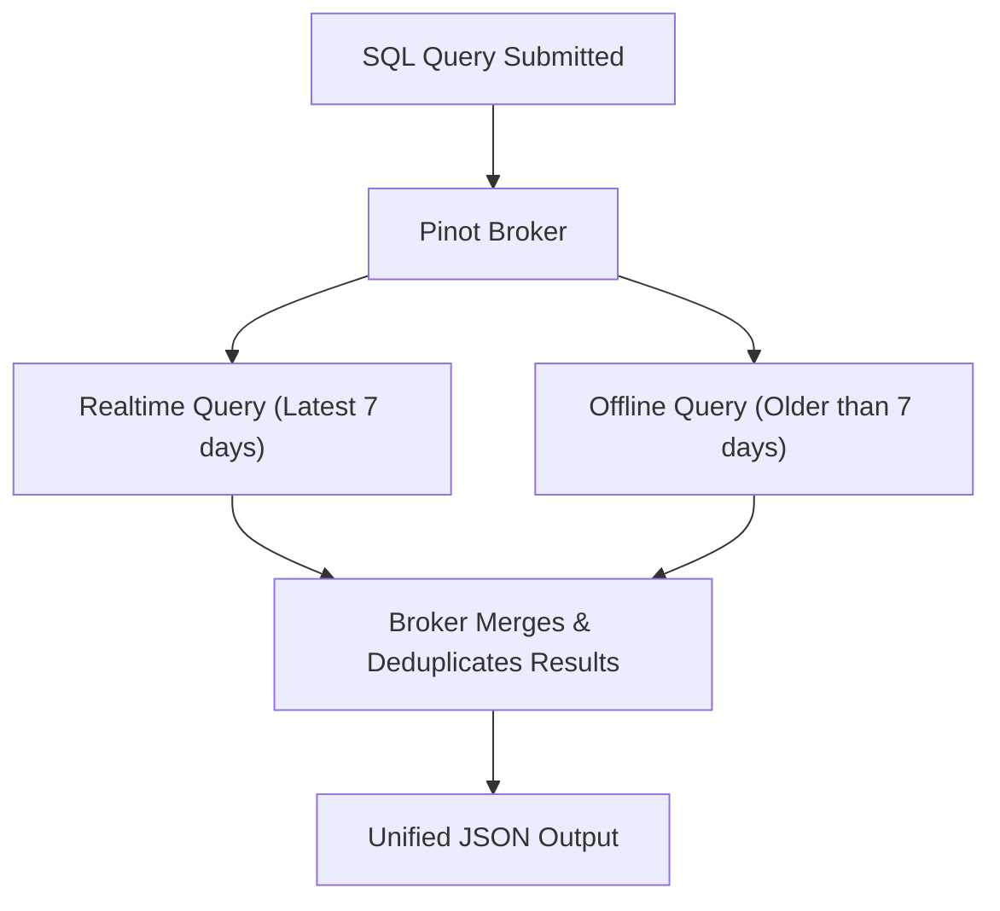

# Technical Interview Guide: Apache Pinot & OLAP Engineering

This guide contains production-grade interview questions and detailed answers designed to test concepts from fundamental OLAP principles to advanced query execution mechanics.

---

## 🟢 Beginner Questions

### Q1. What is Apache Pinot and when should an organization use it?
**Answer:**
Apache Pinot is an open-source, distributed, columnar, real-time OLAP (Online Analytical Processing) data store. It was designed by LinkedIn to serve ultra-low latency analytical queries (often sub-second or sub-10ms) on massive, high-throughput streaming datasets.

**When to use it:**
* You need **real-time ingestion** (e.g., from Kafka, Kinesis) with data available for queries within milliseconds.
* You are serving analytics **directly to user-facing applications** (e.g., LinkedIn’s "Who Viewed My Profile", real-time dashboards) where queries run at thousands of Queries Per Second (QPS) with sub-second SLA requirements.
* You need aggregations and filtering over massive dimensions, and traditional OLTP databases (like MySQL/Postgres) or batch data warehouses (like Snowflake/Hive) struggle with latency or scale.

---

### Q2. Compare OLTP, Traditional Data Warehouses, and Real-time OLAP Engines.
**Answer:**
* **OLTP (Online Transactional Processing)**:
  * *Purpose*: Manages operational transaction states (creates, updates, deletes).
  * *Storage*: Row-oriented, highly normalized to prevent duplicate writes.
  * *Query Pattern*: Looks up individual records by ID, low volume, fast writes.
  * *Examples*: PostgreSQL, MySQL.
* **Traditional Data Warehouse (OLAP)**:
  * *Purpose*: Large-scale historical analysis, batch BI, and reporting.
  * *Storage*: Column-oriented, optimized for scanning massive datasets.
  * *Query Pattern*: Heavy analytical scans. Latency is secondary (seconds to hours). Not designed for direct user-facing apps.
  * *Examples*: Snowflake, Amazon Redshift, Hive.
* **Real-time OLAP Engine (Pinot)**:
  * *Purpose*: Real-time indexing and interactive user-facing analytical queries.
  * *Storage*: Column-oriented with highly optimized index structures (Star-tree, Inverted, Bloom).
  * *Query Pattern*: High QPS (10,000+ queries/sec) with low latency (sub-100ms) on real-time streaming data.

---

### Q3. What is a Pinot Segment?
**Answer:**
A Pinot Segment is the basic unit of data storage and processing in Apache Pinot. It is a chunk of a table containing a subset of rows.
* **Internal Structure**: Inside a segment, data is stored in a column-oriented layout. Pinot automatically applies Dictionary Encoding and creates multiple indices (Forward, Inverted, Bloom, etc.) during segment build time.
* **Immutability**: Once created, segments are immutable. Modifications require recreating the segment or writing a new segment version.
* **Lifecycle**: For real-time tables, segments start as `CONSUMING` (in-memory) and transition to `COMPLETED` (packaged and saved to Deep Storage and local disk).

---

### Q4. What is the role of ZooKeeper in an Apache Pinot cluster?
**Answer:**
Pinot relies on Apache ZooKeeper as its centralized coordinator. It acts as the backbone for cluster state management:
* **Helix Coordination**: Pinot uses Apache Helix (which runs on ZooKeeper) to manage cluster state transitions and partition-to-replica mappings.
* **Metadata Directory**: Stores schema files, table configurations, segment statuses, and active instance routing tables.
* **Leader Election**: Handles election of the leader Controller node.
* **Health Checks**: Monitors node heartbeats (Brokers, Servers, Minions) and triggers Helix state changes if a node goes offline.

---

## 🟡 Intermediate Questions

### Q5. Explain Real-time Ingestion in Pinot and the concept of LLC (Low-Level Consumer).
**Answer:**
Real-time tables ingest data directly from streaming sources like Apache Kafka. Modern Pinot uses **LLC (Low-Level Consumer)** mode:
1. Each partition of the Kafka topic is mapped directly to a partition in Pinot.
2. Individual Pinot Server instances act as direct Kafka consumers. They connect directly to Kafka brokers and pull messages from specific partitions.
3. The Server keeps incoming messages in an **in-memory buffer** (Consuming Segment). These records are immediately available for query scans.
4. When the segment reaches a limit (threshold of rows or duration limit), the Server freezes the segment, writes it to a columnar file, registers it with the Controller, and pushes the final package to Deep Storage (e.g., S3/HDFS).
5. A new consuming segment is spawned to continue consumption.

*Contrast with HLC (High-Level Consumer)*: HLC relied on Kafka's consumer groups where Pinot had no direct partition control, leading to duplicate consumption, rebalancing storms, and consistency issues. LLC ensures exactly-once semantics within Pinot partitions.

---

### Q6. How does a Hybrid Table execute queries under the hood?
**Answer:**
A Hybrid Table is a logical Pinot concept that combines an Offline Table and a Real-time Table sharing the same schema name.
* **Why it exists**: Real-time tables have a limited retention period (e.g., 7 days) due to storage limits on fast disks. Offline tables store years of historical data on cheaper storage.
* **Query Execution Flow**:
  1. The client submits a query to the Broker.
  2. The Broker splits the query into two branches: one targeting the Realtime table and one targeting the Offline table.
  3. The Broker uses a **Time Boundary Manager** (which tracks the exact timestamp where the real-time consumption overlaps with the last uploaded offline segment) to prune overlapping segments.
  4. The query scans historical offline segments + active real-time segments without returning duplicates.
  5. The Broker merges both result sets in-memory and returns a unified result to the client.



---

### Q7. Explain the function of a Star-Tree Index.
**Answer:**
A Star-tree index is a specialized pre-aggregation index unique to Pinot. It addresses the "disk scan" bottleneck of high-cardinality aggregation queries:
* **The Problem**: If a query aggregates over multiple dimensions (e.g., `SELECT country, SUM(revenue) GROUP BY country`), Pinot must scan the entire column array, which is slow for billions of records.
* **The Solution**: The Star-tree index builds a tree structure where nodes represent combinations of dimensions, and leaf nodes contain pre-aggregated metrics.
* **The "Star" Node (*)**: To prevent combinatorial explosion (pre-aggregating every single combination of columns), Pinot introduces a star node (`*`) representing the aggregate of all remaining children.
* **Result**: During query execution, the Broker/Server detects if a query matches a Star-tree structure. Instead of scanning raw files, it jumps directly to the leaf node in the index, resolving complex group-by queries in milliseconds.

---

### Q8. What is Segment Pruning and how does it improve query performance?
**Answer:**
Segment Pruning is an optimization performed by Pinot Brokers to avoid scanning segments that cannot possibly match the query predicates:
* **Time Column Pruning**: Since segments have defined metadata start and end times, if a query specifies `WHERE timestamp > X AND timestamp < Y`, the Broker skips all segments whose time range does not overlap with `[X, Y]`.
* **Partition Pruning**: If data is partitioned (e.g., by `country`), the Broker reads segment metadata partition ranges and discards segments that do not contain the target partition key.
* **Bloom Filters**: At the segment level, metadata contains Bloom filters for specific dimensions. If a query filters on `userId = 'usr_123'`, Pinot queries the Bloom filter; if it returns false, Pinot skips loading/scanning that segment entirely.

---

## 🔴 Advanced Questions

### Q9. Describe the Scatter-Gather Query Execution model.
**Answer:**
Pinot processes queries using a distributed Scatter-Gather pattern:
1. **Scatter Phase**:
   * The client submits a query (e.g., `SELECT COUNT(*), SUM(fee) FROM user_registrations WHERE country = 'USA'`) to a Pinot Broker.
   * The Broker checks the routing table (built from Helix cluster state) to determine which Pinot Server instances host the segments for the target table.
   * The Broker prunes segments based on predicates.
   * It partitions the query workload and routes individual sub-queries (referencing specific segment IDs) to the selected Pinot Servers.
2. **Gather Phase**:
   * Each Pinot Server receives its task, scans its local memory-mapped segments, processes filters, and runs local aggregations.
   * The Servers return intermediate serialized tables (aggregates and partial counts) to the Broker.
   * The Broker gathers all responses, merges the partial aggregates, computes the final mathematical computations (e.g., dividing sum by count to compute averages), and formats the final JSON payload for the client.

---

### Q10. How does Tenant Isolation work in Pinot, and how is it configured?
**Answer:**
Tenant Isolation allows you to divide Pinot servers and brokers into logical groups (tenants) to ensure resource isolation and prevent "noisy neighbor" issues:
* **Architecture**: Physical nodes are tagged with tenant roles (e.g., Broker tag `sales_broker`, Server tag `sales_server`).
* **Table Binding**: In the table configuration JSON, you specify the tenant names:
  ```json
  "tenants": {
    "broker": "sales",
    "server": "sales"
  }
  ```
* **Routing**: The Controller allocates segments only to servers tagged with `sales_server`. The Broker routing table only sends queries to servers hosting those segments. No queries or storage cross the boundary to other tenants (like `marketing`).
* **Dynamic Sharing**: If necessary, nodes can be re-tagged dynamically, and Helix handles the segment data movement automatically.

---

### Q11. How does Pinot manage Off-Heap Memory and why is it important for JVM tuning?
**Answer:**
To achieve low latency and handle billions of rows without garbage collection overhead, Pinot relies extensively on off-heap memory:
* **Memory-Mapped Files (mmap)**: Pinot columns and indices are mapped from disk files into off-heap memory using Java's `MAPPED` loading mode.
* **Heap Minimization**: The Java heap is reserved for query coordination, parsing metadata, and temporary objects. The massive columnar search spaces do not load into the JVM heap.
* **Benefits**:
  * Eliminates GC pause latency spikes.
  * Allows Pinot servers to scale memory beyond JVM limits, utilizing OS page caches.
* **Tuning Implications**:
  * Ensure the JVM process max memory limits permit off-heap allocation.
  * Keep `-Xmx` (Heap) smaller (e.g., 8-16 GB) than physical system RAM, leaving the remaining capacity for the OS page cache and mmap allocations.
  * Adjust `vm.max_map_count` to avoid system mapping exhaustion.
