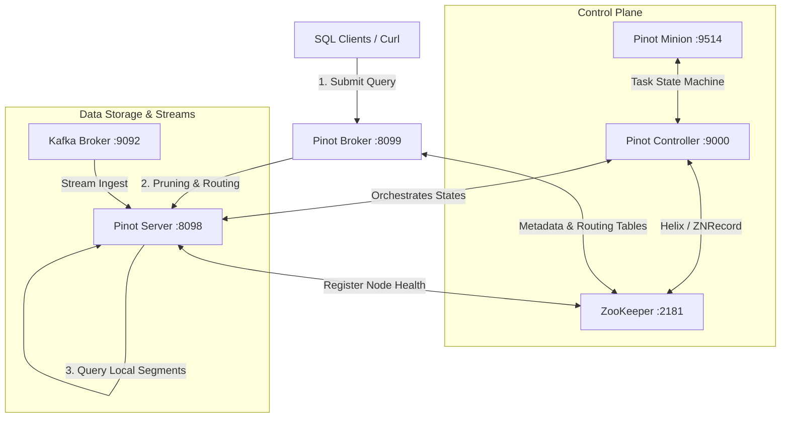

# Day 24 Lab: Hands-on Apache Pinot Deployment & Real-time Ingestion

This hands-on lab guides you through deploying a local Apache Pinot cluster, registering schema/table definitions, producing data to Apache Kafka, and querying ingestion metrics in sub-milliseconds.

---

## 🏗️ Prerequisites
Before starting, ensure you have the following installed on your host system:
* **Docker** (v20.10+) & **Docker Compose** (v2.0+)
* **curl** (for REST API interaction)
* **jq** (recommended, for parsing JSON query outputs)
* **RAM**: At least 4-6 GB of memory allocated to your Docker daemon.

---

## ⚡ Deployment Scenarios

### 1. Single Node (Quickstart Layout)
In a single-node Pinot deployment, the Controller, Broker, Server, and Minion processes are combined into a single JVM or run on a single host. While easy to test, this model is NOT production-resilient.

### 2. Multi-Node (Local Cluster)
This lab uses a multi-node cluster, where each component runs in its own container:
* **ZooKeeper**: Coordination and metadata engine.
* **Kafka**: Distributed streaming event logs.
* **Pinot Controller**: Oversees the cluster state, coordinates Segment creation, and Helix state transition.
* **Pinot Broker**: Receives user queries, prunes segments, scatters execution, and gathers results.
* **Pinot Server**: Hosts data segments, consumes streaming events, and performs queries.
* **Pinot Minion**: Background worker performing segment merges, rollup tasks, and tier transitions.



---

## 🔬 Step-by-Step Lab Execution

### Step 1: Spin Up the Cluster
Run Docker Compose from the root directory:
```bash
docker compose -f docker/docker-compose.yml up -d
```

**Verify Containers are Running:**
```bash
docker ps --format "table {{.Names}}\t{{.Status}}\t{{.Ports}}"
```
You should see:
* `pinot-zookeeper`
* `pinot-kafka`
* `pinot-controller`
* `pinot-broker`
* `pinot-server`
* `pinot-minion`

---

### Step 2: Initialize Kafka Topic & Stream Sample Data
The `verify-kafka.sh` script verifies Kafka container availability, creates a topic named `user-registrations` with 2 partitions, and pushes 8 sample events.

Execute:
```bash
./scripts/verify-kafka.sh
```

**What the script does:**
1. Connects to Kafka via standard CLI commands inside Docker.
2. Checks for `user-registrations`. If missing, runs:
   ```bash
   docker exec pinot-kafka kafka-topics --bootstrap-server kafka:9092 --create --topic user-registrations --partitions 2 --replication-factor 1
   ```
3. Pipes the JSON lines from `configs/sample-events.json` into `kafka-console-producer`:
   ```bash
   docker exec -i pinot-kafka kafka-console-producer --bootstrap-server kafka:9092 --topic user-registrations < configs/sample-events.json
   ```

---

### Step 3: Register Schema and Tables in Pinot
We upload schemas and table configurations to the Pinot Controller using its REST API.

Run the Pinot verification script:
```bash
./scripts/verify-pinot.sh
```

**Explanation of Commands inside the Script:**

* **Upload Schema:**
  ```bash
  curl -X POST -F schema=@configs/user-registrations-schema.json http://localhost:9000/schemas
  ```
  * *Why?* The Controller needs to know the type and format of incoming fields to configure dictionary mappings and prepare physical file structures.

* **Create Realtime Table:**
  ```bash
  curl -X POST -H "Content-Type: application/json" -d @configs/user-registrations-table-realtime.json http://localhost:9000/tables
  ```
  * *Why?* This registers the Realtime table configuration with the Controller. The Controller publishes table properties to ZooKeeper, which updates Helix. The Broker sets up routing tables, and the Server starts consuming from the Kafka topic specified in `streamConfigs`.

* **Create Offline Table:**
  ```bash
  curl -X POST -H "Content-Type: application/json" -d @configs/user-registrations-table-offline.json http://localhost:9000/tables
  ```
  * *Why?* This registers the Offline table. While real-time data is ingested via Kafka, historical batch segments can be uploaded to this table. Under a **Hybrid table** model (both Realtime and Offline matching the same schema name), Pinot seamlessly merges query results from both tables and removes overlapping duplicates.

---

### Step 4: Access the Pinot Query Console
Open your web browser and navigate to the Pinot Controller Console:
* **URL**: [http://localhost:9000](http://localhost:9000)

Here you can:
* Inspect table statuses and partition mappings.
* Browse Zookeeper ZNodes via the Helix ZK viewer.
* Query tables directly using the Query Console UI.

---

### Step 5: Query Pinot via CLI / curl
Run the query script to execute ANSI SQL queries:
```bash
./scripts/verify-query.sh
```

**Sample Query Example:**
```bash
curl -s -X POST -H 'Content-Type: application/json' \
     -d '{"sql":"SELECT accountType, COUNT(*), SUM(registrationFee) FROM user_registrations GROUP BY accountType"}' \
     http://localhost:8099/query/sql | jq .
```

Review the response JSON. Notice:
* `numDocsScanned`: The exact number of records scanned.
* `timeUsedMs`: Ingestion search query speed, usually 1 to 5 milliseconds.
* `numServersQueried`: The number of servers scanned to compile the output.

---

### Step 6: Verify Real-Time Consumption
Produce a new event to Kafka to verify Pinot ingests it instantly:

```bash
docker exec -i pinot-kafka kafka-console-producer --bootstrap-server kafka:9092 --topic user-registrations <<EOF
{"userId": "usr_009", "username": "ian", "email": "ian@gmail.com", "country": "SGP", "signupSource": "direct", "accountType": "PREMIUM", "device": "iOS", "age": 31, "registrationFee": 19.99, "signupTimestamp": $(date +%s%3N)}
EOF
```

Re-run the query script:
```bash
./scripts/verify-query.sh
```
Notice the `Total User Registrations` has increased instantly. This demonstrates sub-second streaming ingestion-to-query availability.

---

### Step 7: Clean Up Environment
To shut down the containers and delete all data volumes:
```bash
docker compose -f docker/docker-compose.yml down -v
```
The `-v` flag removes the persistent ZooKeeper databases, Kafka logs, and Pinot segment folders, ensuring a clean slate.
