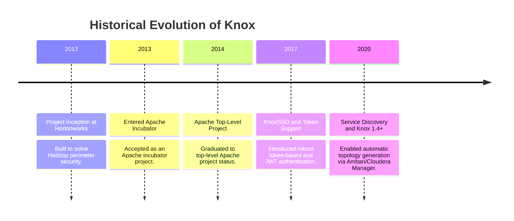
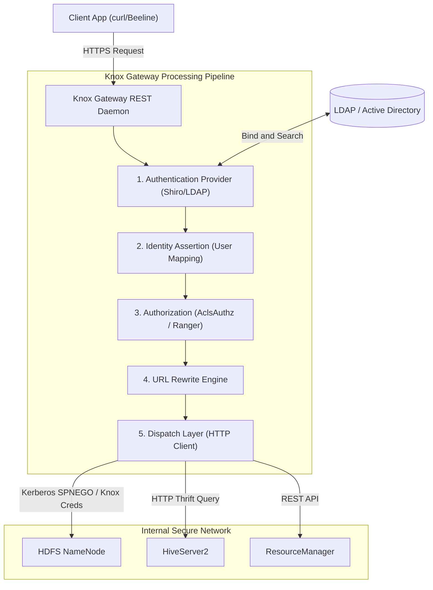
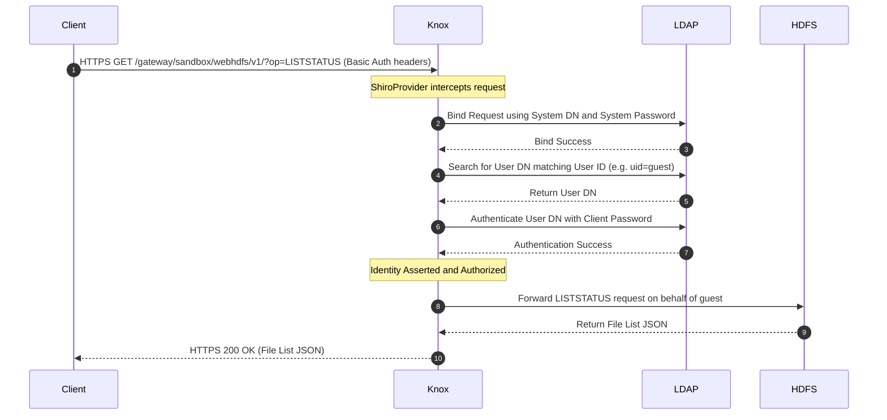
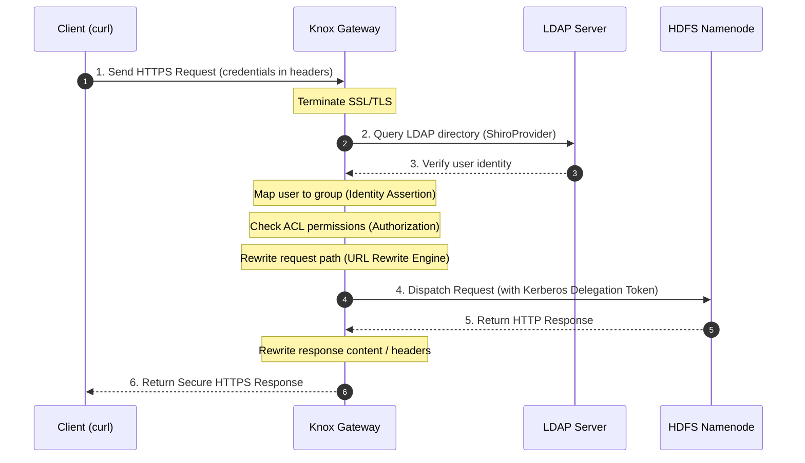

# Day 25: Apache Knox Gateway & Perimeter Security

Welcome to Day 25 of the **30 Days of Modern Hadoop Ecosystem** series. Today, we are deep-diving into **Apache Knox Security Gateway**, the standard solution for perimeter security, API gateway proxying, and single sign-on (SSO) in enterprise Big Data environments.

---

## 🗺️ Learning Roadmap

```
                       [ Apache Knox Gateway ]
                                  |
         +------------------------+------------------------+
         |                                                 |
[ Core Architecture ]                              [ Internal Mechanics ]
  - Knox Gateway REST Daemon                         - URL Rewrite Engine
  - Gateway Providers (Shiro, KnoxSSO)              - 307 Redirect Interception
  - Topologies & Service Maps                        - Dispatch Layer Pipeline
         |                                                 |
         +------------------------+------------------------+
                                  |
                       [ Production Operations ]
                         - LDAP & AD Integration
                         - Kerberos SPNEGO Delegation
                         - High Availability & LB
```

---

## SECTION 1 — INTRODUCTION

### 1.1 What is Apache Knox?
**Apache Knox** is a stateless, high-performance application gateway providing single-point perimeter security for Apache Hadoop clusters. Rather than exposing the hundreds of ports and endpoints inherent in a distributed Hadoop deployment, Knox presents a single, hardened port (`8443`) over HTTPS to the outside world, acting as a secure reverse proxy.

### 1.2 Why Hadoop Needed a Gateway: The Historical Problem
In the early days of Hadoop (Hadoop 1.x and early 2.x), clusters were designed to run in trusted networks. Every daemon (NameNode, DataNode, JobTracker) ran its own RPC and HTTP server, binding to separate ports:
- WebHDFS: `9870` / `9864`
- YARN Resource Manager: `8088`
- HiveServer2: `10001` / `10002`

If enterprise users needed to query Hive or read HDFS from outside the Hadoop network, corporate firewalls had to open hundreds of ports. This created severe **perimeter security challenges**:
1. **Network Vulnerability:** Opening direct firewall routes to database servers and storage nodes increases the risk of port scanning, exploits, and DDoS attacks.
2. **Identity Propagation:** Each service required separate authentication, making unified identity tracking difficult.
3. **Kerberos Client Complexity:** Direct interaction with Kerberized Hadoop services required external clients to run Kerberos clients, obtain KDC tickets, and configure local keytabs—creating support nightmares for business analysts using Windows laptops.



---

## SECTION 2 — PROBLEM STATEMENT

Exposing Hadoop services directly to client applications creates a complex and insecure network layout.

### Direct Access vs. Knox Gateway Architecture

```
DIRECT ACCESS (HIGH RISK & COMPLEXITY)
=====================================
                    +---> HDFS NameNode (Port 9870)
                    |
[ Client Browser ]  +---> HDFS DataNodes (Ports 9864)
    (Remote)        |
                    +---> YARN ResourceManager (Port 8088)
                    |
                    +---> HiveServer2 (Port 10001)


SECURE ACCESS VIA KNOX (RECOMMENDED)
====================================
                     SSL                  Internal Network
[ Client Browser ] =======> [ Knox Gateway ] ------------> [ Hadoop Cluster ]
    (Remote)                (Hardened Port)               (No direct public ports)
                               (8443)
```

### Key Risks of Exposing Hadoop Services Directly:
- **Too Many Endpoints:** Managing certificates and firewalls for hundreds of ephemeral DataNodes is operationally impossible.
- **Authentication Complexity:** Forcing external BI tools to authenticate directly against Kerberos results in high client-side configuration overhead.
- **SSL Management:** Maintaining SSL/TLS certificates on every cluster node requires complex lifecycle management.
- **Attack Surface:** Any unpatched vulnerability in any Web UI (like NameNode or ResourceManager) is directly exploitable from the enterprise network.

---

## SECTION 3 — ARCHITECTURE DEEP DIVE

Apache Knox is structured as a modular gateway that inspects, translates, and dispatches HTTP traffic.

### 3.1 Architecture Overview



### 3.2 LDAP Authentication Flow

This diagram illustrates how Knox interacts with the directory services to validate user credentials:



---

## SECTION 4 — INTERNAL WORKING & LIFE OF A REQUEST

Every request traversing the Knox Gateway goes through a step-by-step processing pipeline:



---

## SECTION 5 — CORE CONCEPTS

- **Reverse Proxy:** Knox acts as an intermediate server that receives external requests, forwards them to internal cluster nodes, and returns the response as if it originated from the gateway.
- **Topologies:** XML definitions (e.g. [sandbox.xml](file:///C:/Users/Himanshu_Verma/DELL/Personal/30_Days_of_Modern_Hadoop_Ecosystem/Day-25-Knox-Security-Gateway/topologies/sandbox.xml)) hosting the gateway's security policies and routing rules for a cluster.
- **URL Rewriting:** A powerful templating engine that updates request and response paths, ensuring links pointing to internal hostnames (e.g., DataNode servers) are rewritten to route back through Knox.
- **SSO & Token-based Authentication:** KnoxSSO allows users to authenticate once and receive a signed JSON Web Token (JWT) cookie (`hadoop-jwt`) which Hadoop web UIs accept to authorize the user sessions automatically.
- **Audit Logging:** Logs structured audit records capturing WHO initiated the request, WHAT resource they targeted, and whether the access was GRANTED or DENIED.

---

## SECTION 6 — PRODUCTION ENGINEERING

### 6.1 High Availability (HA) & Load Balancing
In a production deployment, run multiple stateless Knox Gateway instances behind a load balancer (such as HAProxy, F5, or NGINX).
- **ZooKeeper Integration:** Point all Knox nodes to a ZooKeeper quorum. If a topology is added or modified on one node, ZooKeeper automatically synchronizes and triggers hot-deployment of the topology configuration across all other instances.

### 6.2 SSL Keystore Management
Always replace the default Knox self-signed certificate with an enterprise CA-signed certificate:
```bash
# Export the CSR from Knox keystore
/opt/knox/bin/knox-cli.sh export-cert --alias gateway-identity
```

### 6.3 Performance Tuning & Hardening
- **JVM Heap Allocation:** Set memory parameters inside environment variables:
  `export KNOX_GATEWAY_OPTS="-Xms2g -Xmx4g -XX:+UseG1GC"`
- **Rate Limiting:** Protect backend services from DDoS by introducing a rate-limiting filter inside `gateway-site.xml` or at the load balancer level.
- **Thread Pool Settings:** Adjust jetty server thread pools to support high concurrent client traffic.

---

## SECTION 7 — HANDS-ON LAB OVERVIEW

A comprehensive hands-on deployment laboratory is located in the [lab/README.md](file:///C:/Users/Himanshu_Verma/DELL/Personal/30_Days_of_Modern_Hadoop_Ecosystem/Day-25-Knox-Security-Gateway/lab/README.md) file.
- **Environment:** Multi-service container orchestrating OpenLDAP, Apache Knox, HDFS NameNode, and HiveServer2.
- **Scope:** Configure Shiro providers, map ACL authorization, download Knox certificates, import local JKS client truststores, test WebHDFS redirects, and execute JDBC queries via Beeline over Knox.

---

## SECTION 8 — BUILD FROM SOURCE

To compile Apache Knox from the official Apache source repository, follow these steps:

### 8.1 Source Code Layout
- `gateway-server`: Core REST gateway daemon code.
- `gateway-provider-security-shiro`: Shiro integration classes.
- `gateway-provider-security-authz-acls`: Gateway level ACL checking logic.
- `gateway-service-definitions`: Out-of-the-box XML rewrite definitions for HDFS, Hive, etc.

### 8.2 Maven Build Command
Download the source from [Apache Knox GitHub](https://github.com/apache/knox) and build the package using Maven:
```bash
git clone https://github.com/apache/knox.git
cd knox
mvn clean package -DskipTests
```
The compiled binaries will be packaged as a tarball inside the `gateway-release/target/` directory.

### 8.3 Debugging the JVM
To attach a remote debugger to a starting Knox process, run:
```bash
export GATEWAY_OPTS="-agentlib:jdwp=transport=dt_socket,server=y,suspend=n,address=*:5005"
/opt/knox/bin/gateway.sh start
```

---

## SECTION 9 — DOCKER DEPLOYMENT

The complete files are located in the [docker/](file:///C:/Users/Himanshu_Verma/DELL/Personal/30_Days_of_Modern_Hadoop_Ecosystem/Day-25-Knox-Security-Gateway/docker/) directory:
- [Dockerfile](file:///C:/Users/Himanshu_Verma/DELL/Personal/30_Days_of_Modern_Hadoop_Ecosystem/Day-25-Knox-Security-Gateway/docker/Dockerfile): Assembles a Knox Gateway container with custom Java entrypoint settings.
- [docker-compose.yml](file:///C:/Users/Himanshu_Verma/DELL/Personal/30_Days_of_Modern_Hadoop_Ecosystem/Day-25-Knox-Security-Gateway/docker/docker-compose.yml): Deploys the multi-node mock Hadoop network, including Knox, OpenLDAP, NameNode, and HiveServer2.
- [users.ldif](file:///C:/Users/Himanshu_Verma/DELL/Personal/30_Days_of_Modern_Hadoop_Ecosystem/Day-25-Knox-Security-Gateway/docker/users.ldif): Configures test users and groups inside the directory server.

To launch:
```bash
cd docker
docker-compose up -d --build
```

---

## SECTION 10 — LOCAL CLUSTER DEPLOYMENT

For production-like local deployments without container virtualization:
1. **Single-node deployment:** Install Java, extract the Knox binary, run `knox-cli.sh create-master`, configure `sandbox.xml` pointing services to `localhost`, and start the gateway process.
2. **Multi-node deployment:** Standardize directories across nodes. Keep keystores secure on host machines. Use central configuration management (Ansible, Puppet) to synchronize the `/opt/knox/conf/` configs.

---

## SECTION 11 — VALIDATION

The [scripts/](file:///C:/Users/Himanshu_Verma/DELL/Personal/30_Days_of_Modern_Hadoop_Ecosystem/Day-25-Knox-Security-Gateway/scripts/) directory hosts automated tests:
1. [verify-knox.sh](file:///C:/Users/Himanshu_Verma/DELL/Personal/30_Days_of_Modern_Hadoop_Ecosystem/Day-25-Knox-Security-Gateway/scripts/verify-knox.sh): Tests Knox Gateway uptime and LDAP bind capability.
2. [verify-webhdfs.sh](file:///C:/Users/Himanshu_Verma/DELL/Personal/30_Days_of_Modern_Hadoop_Ecosystem/Day-25-Knox-Security-Gateway/scripts/verify-webhdfs.sh): Performs HDFS create, read, and write operations through Knox proxying, asserting redirect-rewriting accuracy.
3. [verify-hive.sh](file:///C:/Users/Himanshu_Verma/DELL/Personal/30_Days_of_Modern_Hadoop_Ecosystem/Day-25-Knox-Security-Gateway/scripts/verify-hive.sh): Automatically exports Knox SSL certs to compile a local JKS truststore, and executes SQL commands over HTTP JDBC transport.

---

## SECTION 12 — PRODUCTION TROUBLESHOOTING

An extensive database of symptoms, causes, and step-by-step solutions is located in [troubleshooting/README.md](file:///C:/Users/Himanshu_Verma/DELL/Personal/30_Days_of_Modern_Hadoop_Ecosystem/Day-25-Knox-Security-Gateway/troubleshooting/README.md). It addresses:
- SSL Keystore conflicts (tampered passwords, startup failures)
- Client-side truststore errors (PKIX path building errors)
- LDAP search DN mismatches (401 Unauthorized errors)
- Group/Role authorization blocks (403 Forbidden errors)
- Misconfigured rewrite mappings (404 Not Found or loops)
- Kerberos SPNEGO ticket expirations.

---

## SECTION 13 — REAL-WORLD CASE STUDY

### Securing a Financial Analytics Platform with Apache Knox

#### Background
A global banking institution manages a 500-node Hadoop cluster storing transactional logs, customer risk data, and analytical reports.
- **The Audit Challenge:** The bank must comply with SOX and PCI-DSS, requiring all access to personal credit tables in Hive and files in HDFS to be authenticated, authorized, and logged.
- **The Operations Challenge:** 2,000 data analysts need access to the data using Tableau, Beeline, and custom Python apps from remote corporate desktops.

#### The Architecture Solution
The bank implemented **Apache Knox Gateway** as the single gateway for all REST and JDBC access.

```
+--------------------+
| External BI Tools  |
| (Tableau, Python)  |
+---------+----------+
          | HTTPS (Single Port 8443)
          v
+--------------------+            +---------------------------------+
| Knox Gateway Pool  |<---------->| Active Directory / Identity Provider
+---------+----------+            +---------------------------------+
          | Internal Kerberos SPNEGO
          v
+--------------------+
| Secure Hadoop Core | (HDFS / HiveServer2 / YARN / Oozie)
+--------------------+
```

#### Detailed Setup & Governance Rules:
1. **LDAP/AD Sync:** Knox was configured to bind with the bank's Active Directory.
2. **Access Control Policies:** Using the authorization provider combined with Ranger, access permissions were mapped:
   - Data Analysts: Allowed Hive access (`HIVE` role), denied HDFS direct writing.
   - Core Data Engineers: Allowed HDFS access (`WEBHDFS` role).
3. **Auditing and Traceability:** Every query sent by Tableau went through Knox. Knox logged detailed audit entries in `gateway-audit.log` mapping client IP addresses to AD usernames and queries, solving compliance audit requirements.
4. **Credential Decoupling:** Analysts logged in using standard enterprise AD credentials, eliminating client-side Kerberos configuration. Knox translated these into Kerberos delegation tickets internally before accessing HDFS.

---

## SECTION 14 — INTERVIEW QUESTIONS

An exhaustive list of 15 interview questions and answers (Beginner, Intermediate, and Advanced) is provided in [interview/README.md](file:///C:/Users/Himanshu_Verma/DELL/Personal/30_Days_of_Modern_Hadoop_Ecosystem/Day-25-Knox-Security-Gateway/interview/README.md).

---

## SECTION 15 — KEY TAKEAWAYS

- **Perimeter Security:** Apache Knox simplifies Hadoop security by replacing direct access to hundreds of nodes with a single, secure gateway over port `8443`.
- **Decoupled Auth:** Clients use standard enterprise credentials (LDAP/AD/OIDC), while Knox manages the complex Kerberos authentication internally.
- **URL Rewriting:** Crucial for proxying Web interfaces (like HDFS redirects), ensuring internal IP addresses are never exposed or called by external clients.
- **Production Best Practices:** Ensure High Availability using a Load Balancer, synchronize configs via ZooKeeper, offload SSL with a corporate CA-signed cert, and audit access using `gateway-audit.log`.

---

## SECTION 16 — REFERENCES

For further resources, see [references/README.md](file:///C:/Users/Himanshu_Verma/DELL/Personal/30_Days_of_Modern_Hadoop_Ecosystem/Day-25-Knox-Security-Gateway/references/README.md).
