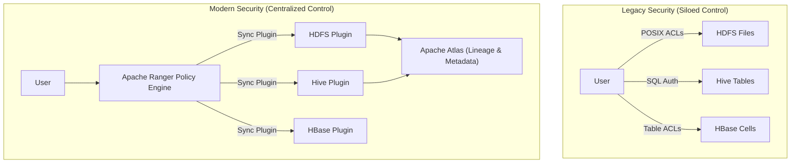
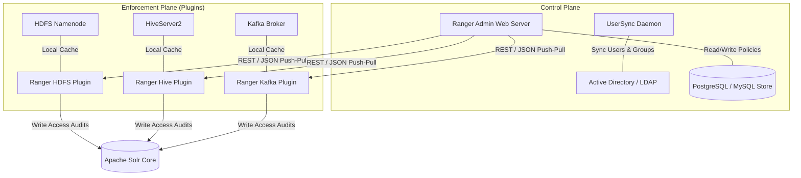
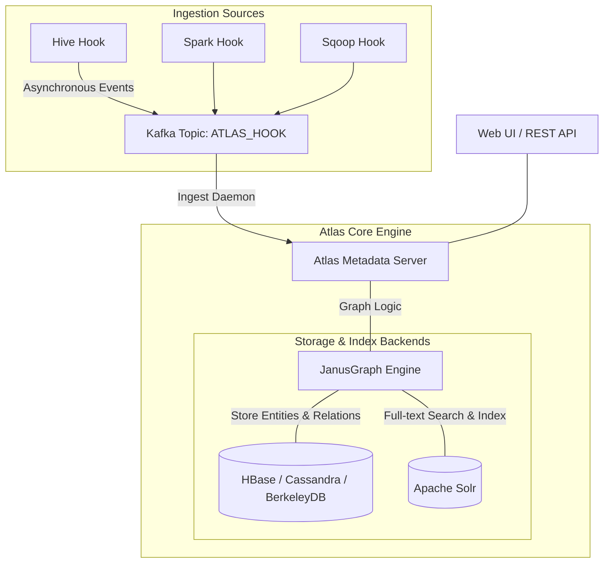
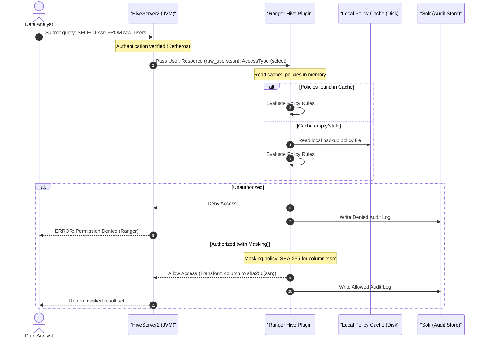
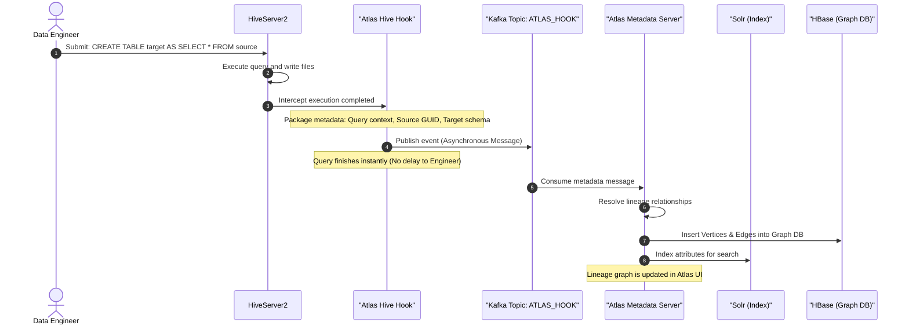
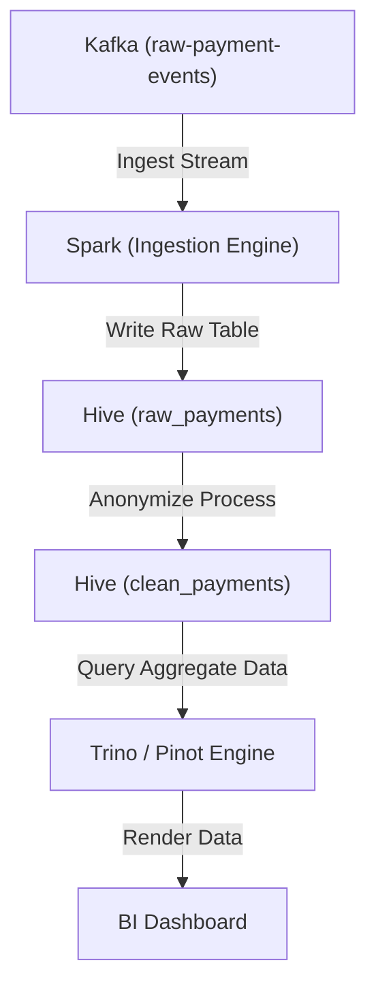

# Day 26: Data Governance with Apache Ranger & Apache Atlas

Welcome to Day 26 of the **30 Days of Modern Hadoop Ecosystem** series. Today, we are deep-diving into the core pillars of enterprise data management: **Security, Compliance, Metadata Management, and Data Lineage** using **Apache Ranger** and **Apache Atlas**.

---

## 🗺️ Learning Roadmap

```
                  [ Enterprise Data Governance Platform ]
                                     |
           +-------------------------+-------------------------+
           |                                                   |
 [ Apache Ranger (AuthZ) ]                           [ Apache Atlas (Lineage) ]
   - Centralized Access Control                        - Metadata Classification & Search
   - Resource-Based Policies (RBAC)                   - Dynamic Lineage Tracking (Hooks)
   - Tag-Based Security Policies (ABAC)                - Impact Analysis & Audits
   - Column Masking & Row Filtering                    - Business Glossary Definitions
           |                                                   |
           +-------------------------+-------------------------+
                                     |
                          [ Production Governance ]
                            - Kerberos & LDAP Integrations
                            - High Availability & Scaling
                            - Real-World Finance Case Study
```

---

## SECTION 1 — INTRODUCTION

### 1.1 What is Apache Ranger?
**Apache Ranger** is a centralized security framework designed to manage, administer, and monitor data security across the Apache Hadoop ecosystem. It acts as the **centralized authorization engine** (AuthZ), replacing localized access control mechanisms with a unified, policy-driven security plane.

### 1.2 What is Apache Atlas?
**Apache Atlas** is a scalable and extensible set of core foundational governance services. It enables enterprises to meet their compliance requirements, discover data assets, classify metadata, and build end-to-end **data lineage maps** across diverse storage and processing engines.

### 1.3 Why Were They Created?
Before Ranger and Atlas, Hadoop security was highly fragmented. HDFS relied on POSIX file permissions or basic Access Control Lists (ACLs); Hive managed security via SQL Standard Authorization; HBase used cell-level ACLs. Implementing a unified data access policy required security administrators to write custom scripts and manually synchronize roles across multiple platforms.

Furthermore, there was no centralized system to answer: *Where did this dataset come from?*, *Who touched it?*, or *Does this table contain Personal Identifiable Information (PII)?*



### 1.4 Evolution of Hadoop Security & Governance
The security lifecycle evolved across four key epochs:
1. **Perimeter-Only Security**: Hadoop initially lacked security, assuming a closed cluster. Anyone could execute commands as the `hdfs` superuser.
2. **Authentication (Kerberos)**: Introduced to verify identity. Users could prove *who* they were, but authorization was still managed per component.
3. **Resource-Based Authorization (Apache Sentry / Ranger)**: Transitioned control to centralized authorization. Apache Ranger emerged as the industry standard due to its support for both Ranger policy stores and lightweight plugins.
4. **Metadata-Driven Governance (Ranger + Atlas)**: Modern governance where authorization rules adapt dynamically based on data classifications (e.g., tags like `PII` applied in Atlas instantly trigger access restrictions in Ranger).

---

## SECTION 2 — PROBLEM STATEMENT

### 2.1 Problems Without Centralized Security and Lineage
Operating an enterprise data lake without centralized governance leads to critical system failures:

```
[ Raw Event Stream ] ➔ [ Data Swamp ] ➔ [ Data Leakage ] ➔ [ Auditing Failure ]
      (No Catalog)       (No Lineage)    (POSIX Bypass)      (Compliance Penalty)
```

#### Fragmented Authorization
* **The Administration Overhead**: Setting up a new data analyst requires registering HDFS permissions, HBase tables, Hive databases, and Kafka topic ACLs separately.
* **POSIX / SQL Discrepancies**: A user blocked from running `SELECT * FROM sales` in Hive might bypass the query engine by executing `hadoop fs -cat /apps/hive/warehouse/sales/*` directly on the underlying files.

#### Missing Metadata Catalog & Search
* **Data Swamps**: Enterprises ingest petabytes of data, but engineers cannot locate specific datasets, resulting in duplicate pipelines, wasted storage, and stale data.

#### The Lineage Blindspot
* **Impact Analysis Deficit**: If an engineer modifies a column type in an upstream database, they cannot predict which downstream Spark jobs, Hive tables, or Tableau dashboards will break.

### 2.2 Compliance & Audit Regulations
Global regulators impose strict rules on data architecture:

| Regulation | Domain | Key Governance Requirement | Ranger / Atlas Solution |
| :--- | :--- | :--- | :--- |
| **GDPR** | European Union | Right to Be Forgotten & Consent Audits | Atlas tracks lineage to locate all data instances; Ranger audits access history. |
| **HIPAA** | Healthcare | Access Control to Protected Health Info (PHI) | Ranger dynamic column masking hides medical records from unauthorized staff. |
| **BCBS-239** | Banking | Risk Data Aggregation & Provenance | Atlas builds immutable lineage graphs showing the origin of balance sheets. |
| **SOX** | Corporate Finance | Audit Trail of Financial Calculations | Ranger logs all SQL queries to Apache Solr for compliance reporting. |

---

## SECTION 3 — ARCHITECTURE DEEP DIVE

### 3.1 Apache Ranger Architecture
Ranger utilizes a **decentralized enforcement, centralized administration** design pattern.



#### Major Ranger Components
* **Ranger Admin Server**: Provides the portal UI and REST endpoints to configure access rules, resource hierarchies, masking strategies, and row-level filters.
* **UserSync**: A background service that queries LDAP or Active Directory, syncing corporate users, groups, and memberships into Ranger.
* **Policy Store**: Relational store (typically PostgreSQL) saving policy definitions.
* **Lightweight Plugins**: Lightweight Java agents embedded directly into the JVM process of Hadoop components (Namenode, HiveServer2, Trino, Spark). Plugins pull policies from Ranger Admin, cache them locally on disk, and evaluate access permissions **in-memory** within the query execution path (resulting in zero network latency during queries).

---

### 3.2 Apache Atlas Architecture
Atlas tracks metadata using an asynchronous hook model backed by a graph database structure.



#### Major Atlas Components
* **Atlas Server**: Exposes metadata discovery, lineage graph construction, and entity creation services.
* **Type System**: Defines schemas. Everything in Atlas is modeled as a Type (e.g., `hive_table` inherits from `DataSet`).
* **Graph Engine (JanusGraph)**: Stores relationship maps (e.g., a table `inputs` to a query process, which `outputs` to another table).
* **Search and Index (Solr)**: Indexes entity attributes, allowing users to search metadata instantaneously via wildcard text or DSL queries.
* **Atlas Hooks**: Interceptors running within Hive, Kafka, or Spark. When a DDL/DML query finishes, the hook posts an event to Kafka, which Atlas consumes asynchronously.

---

## SECTION 4 — INTERNAL WORKING

### 4.1 Sequence 1: The Request Authorization Flow
This flow tracks what occurs when a user submits a query to HiveServer2 secured by Ranger.



---

### 4.2 Sequence 2: Lineage Creation Flow
This flow tracks how Atlas registers a new table and builds its data lineage after a Hive query runs.



---

## SECTION 5 — CORE CONCEPTS

### 5.1 RBAC vs ABAC (Tag-Based Policies)
* **Role-Based Access Control (RBAC)**: Policies are tied directly to resources (e.g., granting the `finance_analyst` role access to the Hive database `finance_db`).
* **Attribute-Based Access Control (ABAC)**: Access is dynamically calculated based on attributes (tags) on resources. For example, if a table in Atlas is classified with the tag `PII`, a Ranger policy can automatically block all users except `compliance_officers` from reading it, regardless of which database it is moved to.

### 5.2 Business vs Technical Metadata
* **Technical Metadata**: Schema formats, column types, partition values, HDFS block sizes, and write timestamps. Generated automatically by hooks.
* **Business Metadata**: Contextual descriptions, owner contact details, compliance classifications, and terminology mappings (e.g., mapping column `cust_num` to Business Glossary term "Customer Identification Number").

### 5.3 Glossary of Terms

| Term | Definition |
| :--- | :--- |
| **Entity** | A specific instance of a metadata type (e.g., `raw_payments` table is an entity of type `hive_table`). |
| **Type** | The schema template representing a data asset (e.g., `hdfs_path`, `kafka_topic`). |
| **Classification** | A label/tag applied to entities to classify them (e.g., `PII`, `PCI-DSS`, `EXECUTIVE_ONLY`). |
| **Lineage** | The trace showing data movements, transforms, inputs, and outputs across platforms. |
| **Impact Analysis** | Analyzing downstream dependencies before executing changes on upstream schemas. |

---

## SECTION 6 — PRODUCTION ENGINEERING

### 6.1 Scaling Ranger & High Availability
To run Ranger in production, deploy two or more Ranger Admin instances behind a Load Balancer (HAProxy, F5, or AWS ALB) in an Active-Active configuration.

```
                  [ Load Balancer (ALB / HAProxy) ]
                                  |
           +----------------------+----------------------+
           |                                             |
 [ Ranger Admin Server 1 ]                     [ Ranger Admin Server 2 ]
           |                                             |
           +----------------------+----------------------+
                                  |
                   [ Shared PostgreSQL Database ]
```

* **Plugin Cache Resiliency**: If all Ranger Admin servers go down, the Hadoop plugins continue to authorize users using their local cached policies (`/etc/ranger/[service_name]/policycache/`).

### 6.2 Scaling Apache Atlas & High Availability
Atlas relies on Active-Passive high availability, coordinated by Apache ZooKeeper.
* **Leader Election**: Multiple Atlas instances run, but only one writes to the graph database. If the active instance fails, ZooKeeper elects a standby instance.
* **Ingestion Scaling**: Partition the `ATLAS_HOOK` Kafka topic to distribute the metadata ingestion load across multiple Atlas consumers.

### 6.3 Performance Tuning Configurations

#### Ranger Plugin Poll Tuning
Reduce Ranger Admin load by tuning poll intervals:
```xml
<!-- In ranger-hive-security.xml -->
<property>
    <name>ranger.plugin.hive.policy.pollIntervalMs</name>
    <value>30000</value> <!-- Increase in stable clusters (e.g., to 60000) to reduce network polling -->
</property>
```

#### Solr Memory Tuning for Auditing
Ensure Solr has sufficient memory heap for writing large streams of Ranger audits. Set the JVM heap size in `solr.in.sh`:
```bash
SOLR_JAVA_MEM="-Xms4g -Xmx4g"
```

---

## SECTION 7 — HANDS-ON LAB SUMMARY

Our hands-on directory contains a full end-to-end sandbox representing a production-grade governance platform.

* **Lab Manual**: [labs/lab-guide.md](file:///c:/Users/Himanshu_Verma/DELL/Personal/30_Days_of_Modern_Hadoop_Ecosystem/Day-26-Ranger-Atlas-Governance/labs/lab-guide.md)
* **SQL Queries**: [labs/sample-queries.sql](file:///c:/Users/Himanshu_Verma/DELL/Personal/30_Days_of_Modern_Hadoop_Ecosystem/Day-26-Ranger-Atlas-Governance/labs/sample-queries.sql)

### Lab Scenario
1. **Initialize Cluster**: Deploy HDFS, Hive, Ranger, Atlas, Solr, and Kafka via Docker Compose.
2. **Access Terminals**: Connect to HiveServer2 via Beeline.
3. **Execute Lineage SQL**: Run a SQL CTAS statement creating an aggregate table.
4. **Assert Lineage**: Open Atlas UI (`http://localhost:21000`) and visually verify that the lineage relation was tracked.
5. **Assert Security**: Create a masking policy in Ranger (`http://localhost:6080`) and confirm that unauthorized queries return masked/hashed credit card data.

---

## SECTION 8 — BUILD FROM SOURCE

Building Apache Ranger and Atlas from source allows you to incorporate custom plugin patches and compile for specific corporate distributions.

### 8.1 Build Dependencies
Before compiling, install the following prerequisite dependencies on your build server:
* **Java Development Kit**: JDK 8 (Ranger 2.4 / Atlas 2.3 require Java 8/11)
* **Apache Maven**: version 3.6.3 or higher
* **Node.js & npm**: required for compiling Atlas Web UI dashboards
* **Git**: to pull source packages

### 8.2 Compiling Apache Ranger
```bash
# 1. Clone source repository
git clone https://github.com/apache/ranger.git
cd ranger
git checkout tags/v2.4.0 -b build-v2.4.0

# 2. Run compilation skipping unit tests
mvn clean compile package -DskipTests

# 3. Locate compiled tarballs
# The built plugins and administrative server archives are located in target directories:
ls -la target/ranger-2.4.0-admin.tar.gz
ls -la target/ranger-2.4.0-hdfs-plugin.tar.gz
ls -la target/ranger-2.4.0-hive-plugin.tar.gz
```

### 8.3 Compiling Apache Atlas
```bash
# 1. Clone source repository
git clone https://github.com/apache/atlas.git
cd atlas
git checkout tags/release-2.3.0-rc2 -b build-v2.3.0

# 2. Build Atlas with embedded Cassandra/HBase & Solr profiles for testing
mvn clean package -DskipTests -Pdist,embedded-hbase-solr

# 3. Locate compiled distribution
ls -la dist/target/apache-atlas-2.3.0-bin.tar.gz
```

---

## SECTION 9 — DOCKER DEPLOYMENT

The complete deployment stack configuration is defined in the `docker/` directory.

* **Stack Definition**: [docker/docker-compose.yml](file:///c:/Users/Himanshu_Verma/DELL/Personal/30_Days_of_Modern_Hadoop_Ecosystem/Day-26-Ranger-Atlas-Governance/docker/docker-compose.yml)
* **Metadata Store Script**: [docker/init-postgres.sql](file:///c:/Users/Himanshu_Verma/DELL/Personal/30_Days_of_Modern_Hadoop_Ecosystem/Day-26-Ranger-Atlas-Governance/docker/init-postgres.sql)
* **Hadoop Environment configuration**: [docker/hadoop.env](file:///c:/Users/Himanshu_Verma/DELL/Personal/30_Days_of_Modern_Hadoop_Ecosystem/Day-26-Ranger-Atlas-Governance/docker/hadoop.env)

### Persistent Storage Design
* PostgreSQL utilizes persistent volumes (`postgres-data`) to prevent the loss of Ranger security policies and Hive metadata definitions on container restarts.
* The Apache Atlas service maintains graph databases on disk (`atlas-data`).
* Solr caches search collection listings in (`solr-data`).

---

## SECTION 10 — LOCAL CLUSTER DEPLOYMENT

For bare-metal and multi-node distributions, Ranger and Atlas must be integrated manually across nodes.

```
       [ Client Applications ]
                  |
     +------------+------------+
     |                         |
[ Gateway (Trino / Pinot) ]   [ Processing (Spark / Hive) ]
     |                         |
     +------------+------------+
                  | (Intercept via Ranger/Atlas plugins)
                  |
      [ Storage Plane (HDFS / Kafka) ]
```

### 10.1 Steps for Multi-Node Integration

#### Step 1: Install Ranger Admin
Deploy Ranger Admin on a dedicated gateway node. Distribute the respective plugins (`ranger-hdfs-plugin.tar.gz`, `ranger-hive-plugin.tar.gz`) to all worker nodes running Namenode and HiveServer2 daemons.

#### Step 2: Configure HDFS Plugin
Run the plugin install script on the active Namenode:
```bash
tar -xvf ranger-2.4.0-hdfs-plugin.tar.gz
cd ranger-2.4.0-hdfs-plugin
# Edit install.properties to point to Ranger Admin URL
./enable-hdfs-plugin.sh
# Restart Namenode
```

#### Step 3: Configure Hive Server Atlas Hook
Enable lineage capture on HiveServer2 nodes:
```bash
# Add Hook Class to hive-site.xml
# Copy atlas-application.properties to Hive classpath (/etc/hive/conf/)
# Restart HiveServer2
```

---

## SECTION 11 — VALIDATION & VERIFICATION

To verify security policies, database states, and lineage records automatically, use the scripts provided in the `scripts/` directory:

1. **Ranger Health Check**: [scripts/verify-ranger.sh](file:///c:/Users/Himanshu_Verma/DELL/Personal/30_Days_of_Modern_Hadoop_Ecosystem/Day-26-Ranger-Atlas-Governance/scripts/verify-ranger.sh)
   * *Expected output*: Confirms connection to port 6080 and downloads policy listings.
2. **Atlas Health Check**: [scripts/verify-atlas.sh](file:///c:/Users/Himanshu_Verma/DELL/Personal/30_Days_of_Modern_Hadoop_Ecosystem/Day-26-Ranger-Atlas-Governance/scripts/verify-atlas.sh)
   * *Expected output*: Confirms connection to port 21000, checks the Atlas version, and verifies that the `hive_table` metadata type is registered.
3. **Policy Validation**: [scripts/verify-policies.sh](file:///c:/Users/Himanshu_Verma/DELL/Personal/30_Days_of_Modern_Hadoop_Ecosystem/Day-26-Ranger-Atlas-Governance/scripts/verify-policies.sh)
   * *Expected output*: Downloads the latest policies and validates that authorization blocks for tables like `raw_transactions` are active.
4. **Lineage Validation**: [scripts/verify-lineage.sh](file:///c:/Users/Himanshu_Verma/DELL/Personal/30_Days_of_Modern_Hadoop_Ecosystem/Day-26-Ranger-Atlas-Governance/scripts/verify-lineage.sh)
   * *Expected output*: Fetches the lineage graph of a target table, showing input tables and process transitions.
5. **Audit Verification**: [scripts/verify-audit.sh](file:///c:/Users/Himanshu_Verma/DELL/Personal/30_Days_of_Modern_Hadoop_Ecosystem/Day-26-Ranger-Atlas-Governance/scripts/verify-audit.sh)
   * *Expected output*: Queries Apache Solr and prints the latest 5 query/access audit records.

---

## SECTION 12 — PRODUCTION TROUBLESHOOTING PLAYBOOK

For immediate system recoveries, consult the complete troubleshooting handbook:
➔ [troubleshooting/troubleshooting-guide.md](file:///c:/Users/Himanshu_Verma/DELL/Personal/30_Days_of_Modern_Hadoop_Ecosystem/Day-26-Ranger-Atlas-Governance/troubleshooting/troubleshooting-guide.md)

### Common Failure Points:
* **Plugin Out-of-Sync**: Caused by network timeouts between Namenodes and Ranger Admin or incorrect Ranger service names.
* **Atlas Message Drops**: If the Kafka brokers are overwhelmed, the Hive hook fails to register lineage. Configure fallback queues.
* **Kerberos Expired Tickets**: Results in immediate `GSSException` and blocks all metadata changes. Renew keytabs via cron or systemd timers.

---

## SECTION 13 — REAL-WORLD CASE STUDY

### Case Study: Financial Institution Payments Architecture
A global retail bank processes millions of online payments daily. They use a multi-engine architecture to ingest, process, store, and analyze transaction data.



#### How Ranger Controls Access
* **Raw Storage Level**: The `/financial_lake/raw_payments` HDFS folder is secured. Only the `SparkYarnPrincipal` can write, and only `compliance_officers` can read.
* **Query Engine Level**: Ranger masks the column `card_number` using a SHA-256 hash policy when read by `analysts` using Trino or Hive.
* **BI Dashboard Level**: Executives access the BI Dashboard which queries aggregate metrics from Trino. Ranger permits this group to read `payments_dashboard_feed` since it contains zero PII.

#### How Atlas Tracks Lineage
* **Topic to Table Lineage**: When the Spark streaming job runs, the Spark Atlas Hook registers that `raw-payment-events` (Kafka Topic) is the input source for `raw_payments` (Hive Table).
* **Anonymization Processing**: When Hive runs the nightly ETL SQL job, Atlas registers the transformation query, showing that `clean_payments` was created from `raw_payments`.
* **Regulatory Compliance Reporting**: During an external audit, compliance teams export the lineage diagram from Atlas to prove that no unhashed credit card numbers flow into downstream aggregate views or dashboards.

---

## SECTION 14 — INTERVIEW QUESTIONS

### 14.1 Beginner Questions (1 - 20)

#### 1. What is the primary difference between Authentication and Authorization?
Authentication (AuthN) verifies the identity of a user (proving *who* they are, e.g., via Kerberos or LDAP). Authorization (AuthZ) verifies what resources an authenticated user has permission to access (proving *what* they can do, e.g., via Ranger policies).

#### 2. Why is Apache Ranger preferred over POSIX permissions in a Hadoop cluster?
POSIX permissions are limited to Owner, Group, and Other, and only work at the file/directory level. Ranger provides centralized access control with fine-grained permissions (column-level masking, row-level filtering) and records audit trails.

#### 3. What is the role of a Ranger Plugin?
A Ranger Plugin is a lightweight Java agent that runs within the JVM of a Hadoop component (e.g., Namenode, HiveServer2). It periodically downloads policies from Ranger Admin, caches them, and evaluates authorization requests locally without making network calls.

#### 4. How does the Ranger Plugin behave if the Ranger Admin Server is down?
The plugin falls back to its local policy cache stored on disk. It continues to authorize or deny access requests based on the cached policies, preventing service downtime.

#### 5. What are Atlas Hooks?
Atlas Hooks are event listeners embedded in components like Hive, Spark, and Kafka. They intercept metadata events (like creating a table or running a query) and publish notifications asynchronously to Atlas via Kafka.

#### 6. What database backends are commonly used by Apache Atlas to store metadata?
Atlas uses JanusGraph as its core graph engine, which typically stores graph vertices and edges in Apache HBase, Cassandra, or BerkeleyDB (for testing/development).

#### 7. How does Apache Atlas track data lineage?
It tracks data lineage by linking datasets (inputs/outputs) to processes. For example, if a table is created using a SQL `SELECT` from another table, the Atlas Hive Hook captures both tables as entities and the query as a process connecting them.

#### 8. What is a "Type" in Apache Atlas?
A "Type" is a schema definition that models a specific data asset or process (e.g., `hive_table`, `hdfs_path`). It defines the attributes that instances (Entities) of that type must have.

#### 9. What is an "Entity" in Apache Atlas?
An "Entity" is a specific instance of a Type. For example, a Hive table named `raw_payments` is an Entity of the Type `hive_table`.

#### 10. What is a "Classification" in Atlas?
A Classification (or tag) is an annotation applied to entities to classify them (e.g., `PII`, `PCI-DSS`). Classifications can be used by Ranger to apply tag-based security policies.

#### 11. Can Atlas classifications propagate downstream automatically?
Yes. Atlas supports classification propagation. If table `A` is classified as `PII` and table `B` is created from table `A`, the classification propagates downstream to table `B` through the lineage graph.

#### 12. Where are Ranger access audits stored?
Ranger access audits are typically stored in Apache Solr for real-time querying and indexing, but they can also be archived in HDFS or Amazon S3 for long-term retention.

#### 13. What is the default administration port for Apache Ranger Admin?
The default port is `6080` (HTTP) or `6443` (HTTPS).

#### 14. What is the default administration port for Apache Atlas?
The default port is `21000` (HTTP) or `21443` (HTTPS).

#### 15. What is Apache Ranger UserSync?
UserSync is a background daemon that synchronizes users, groups, and group memberships from corporate directories (like LDAP or Active Directory) into the Ranger Admin store.

#### 16. What is the purpose of the `ATLAS_HOOK` Kafka topic?
It is the asynchronous notification queue where Atlas Hooks (running in Hive/Spark) publish metadata change events, which the Atlas Server then consumes and registers.

#### 17. What is column masking in Apache Ranger?
It is a security feature that dynamically modifies data returned by a query (e.g., hashing credit card numbers or showing only the last 4 digits) for unauthorized users, without modifying the underlying data on disk.

#### 18. What is row filtering in Apache Ranger?
It is a security feature that dynamically appends a `WHERE` clause to a user's SQL query (e.g., limiting regional sales managers to rows where `region = 'US'`), restricting access to specific rows.

#### 19. Can Apache Ranger authorize Kafka requests?
Yes, the Ranger Kafka Plugin authorizes access to Kafka topics (e.g., allow/deny read, write, or admin permissions).

#### 20. What is a Business Glossary in Apache Atlas?
It is a collection of business terms and definitions. It allows organizations to map technical assets (like database columns) to standardized business concepts (like "Customer Account Number").

---

### 14.2 Intermediate Questions (21 - 40)

#### 21. How do Ranger Tag-Based Policies (ABAC) differ from Resource-Based Policies (RBAC)?
Resource-Based Policies are tied to static paths or assets (e.g., `/data/finance`). Tag-Based Policies are evaluated based on Atlas tags (classifications) attached to the resource. If the resource has the `PII` tag, access is regulated by the `PII` policy, regardless of its storage path.

#### 22. What happens if a resource matches both an Allow policy and a Deny policy in Apache Ranger?
Ranger follows a "Deny-wins" evaluation hierarchy. If a user is explicitly allowed in one policy but blocked by a Deny rule in another, access is denied.

#### 23. Explain the internal evaluation logic sequence of a Ranger Plugin.
When evaluating a request:
1. First, check explicit **Deny** policies. If matched, access is denied.
2. Next, check **Deny Exceptions**. If matched, proceed.
3. Check explicit **Allow** policies. If matched, access is allowed.
4. Check **Allow Exceptions**. If matched, access is denied.
5. If no policies match, fall back to default permissions (e.g., HDFS POSIX/ACLs).

#### 24. How do you configure HiveServer2 to use Ranger for authorization?
In `hive-site.xml`, set the authorization manager to Ranger:
```xml
<property>
    <name>hive.security.authorization.manager</name>
    <value>org.apache.ranger.authorization.hive.authorizer.RangerHiveAuthorizerFactory</value>
</property>
```

#### 25. Why does Atlas use Kafka for metadata ingestion instead of direct REST API calls from hooks?
Using Kafka decouples the query engines (Hive/Spark) from Atlas. If the Atlas Server is offline or slow, queries do not block or fail; instead, hooks publish events to Kafka, which are processed when Atlas is available.

#### 26. How do you handle schema changes (schema evolution) in Apache Atlas?
When an upstream schema changes, the hook captures the new structure and updates the Atlas entity definition. Atlas stores historical entity states, allowing teams to audit schema changes over time.

#### 27. What is the performance impact of enabling a Ranger Plugin on Namenode memory?
Since policies are cached in-memory as Java objects, memory footprint increases slightly (usually a few megabytes). However, since policy evaluation is off-heap/in-memory, it adds negligible CPU overhead to query execution.

#### 28. How does Ranger prevent policy tampering on local disk caches?
Ranger writes local policy caches as encrypted JSON files, readable only by the service daemon user (e.g., `hdfs` or `hive`), preventing users from manually altering cached policies.

#### 29. Can you define custom entity types in Apache Atlas?
Yes, using the Atlas REST API, you can submit JSON schemas to define custom types, attributes, and relationships for systems that do not have out-of-the-box hooks.

#### 30. How do you integrate Ranger with Kerberos?
Ranger Admin and Ranger plugins must be configured with Kerberos service principals and keytabs. Communication between the plugins and Ranger Admin uses SPNEGO for secure authentication.

#### 31. What is the role of Solr in Apache Atlas?
Solr indexes entity attributes and classifications, enabling fast search queries and full-text keyword searches across thousands of metadata entities in the Atlas UI.

#### 32. Explain "Classification Propagation" in Atlas and how it impacts Ranger.
If table `raw_user_data` has the classification `PII` and a CTAS query creates `user_summary`, Atlas propagates the `PII` classification downstream. The Ranger Tag-Based policy immediately detects the new `PII` tag on `user_summary` and restricts access accordingly.

#### 33. How does Ranger handle authorization for Spark SQL queries?
Run the Ranger Spark Plugin inside the Spark driver process. The plugin analyzes the logical plan generated by the Spark Catalyst Optimizer and denies execution if the user lacks access to target tables or columns.

#### 34. What is the purpose of the `xasecure.audit.destination.solr` parameter?
It enables Ranger plugins to write access audit logs directly to Solr index collections, making audit events searchable in the Ranger Admin console.

#### 35. What is the role of ZooKeeper in Apache Atlas High Availability?
ZooKeeper coordinates leader election. If multiple Atlas instances run, ZooKeeper selects one as the active node, while the standby instances replicate state and wait to take over if the active node fails.

#### 36. How do you prevent security bypasses where a user queries Hive tables via Spark bypass scripts?
Enforce Ranger HDFS policies alongside Hive policies. If a user tries to access the underlying HDFS parquet files directly, the Ranger HDFS plugin will block them, even if they bypass the Hive query engine.

#### 37. What is an Atlas "Relationship"?
A relationship defines the link between two entities. For example, `hive_table_columns` defines the relationship between a `hive_table` entity and its `hive_column` entities.

#### 38. How do you configure LDAP group mapping in Ranger?
Configure the `install.properties` or system configuration in Ranger UserSync to point to your LDAP server URL, Bind DN, and Group Search Filter (e.g., `memberOf=cn=data-analyst,ou=groups,dc=enterprise,dc=com`).

#### 39. Can Apache Ranger manage row-level filters based on user groups?
Yes. You can write a policy specifying a SQL condition (e.g., `country = 'US'`) that Ranger dynamically appends to queries executed by users in the `us_analysts` group.

#### 40. What is "Impact Analysis" in Apache Atlas?
Impact Analysis is a feature that calculates which downstream datasets, reports, or dashboards will be impacted if a specific upstream table is modified or deleted.

---

### 14.3 Advanced Questions (41 - 60)

#### 41. How would you design a High Availability (HA) architecture for Apache Ranger Admin?
Deploy multiple Ranger Admin instances behind a Load Balancer (like HAProxy or F5) configured with session stickiness. Configure all instances to share a single PostgreSQL database instance (with hot-standby replication) and write audit logs to an external multi-node Solr Cloud cluster.

#### 42. Explain the "JanusGraph + HBase + Solr" storage stack in Apache Atlas.
Atlas uses JanusGraph to model metadata relations as graphs. Vertices (entities) and edges (relations) are saved in HBase tables (for high scalability and transactional writes). JanusGraph indices are stored in Apache Solr to support complex, low-latency search queries.

#### 43. How does Ranger handle overlapping policies?
Ranger evaluates all matching policies. If any matching policy denies access, access is denied (Deny-wins). If no deny policy matches, and at least one allow policy matches, access is allowed.

#### 44. What happens when Ranger Tag-based policies and Resource-based policies conflict?
Tag-based policies and Resource-based policies are evaluated together. If either policy explicitly denies access, the request is denied. If both allow access, the request is allowed.

#### 45. How would you tune a cluster experiencing performance lag due to Ranger plugin policy syncs?
1. Increase the policy poll interval (`ranger.plugin.[service].policy.pollIntervalMs`) to reduce the frequency of download requests.
2. Enable HTTP compression on Ranger Admin REST responses.
3. Scale out the Ranger Admin instances behind the load balancer to distribute the sync load.

#### 46. Under what circumstances will an Atlas Hive Hook fail to capture lineage?
1. If Hive Server2 crashes before the hook finishes executing.
2. If the connection to Kafka is lost and the hook's in-memory queue fills up, causing events to drop.
3. If the query fails to parse or fails execution.

#### 47. Explain how Ranger plugins leverage JAAS (Java Authentication and Authorization Service) for Kerberos keytab renewals.
Plugins run inside client JVMs (e.g. Namenode). They utilize JAAS configurations to log in using Kerberos keytabs. To prevent ticket expiration issues, configure the JVM settings with `ticketCache` enabled and set `renewTGT=true`.

#### 48. How do you recover from a corrupted JanusGraph index in Apache Atlas?
Rebuild the indexes using Solr management APIs or Atlas administration tools:
1. Put Atlas in maintenance mode.
2. Clear the Solr index collections.
3. Run the Atlas index repair tool (`atlas-index-repair.sh`) to read all data from HBase and re-index it in Solr.

#### 49. How do Ranger Audit filters prevent Solr disk space saturation?
Ranger Audit filters allow you to define rules in the plugin config to exclude high-frequency, non-sensitive actions (like internal `hdfs` heartbeat lookups) from being logged to Solr, saving disk space and reducing write I/O.

#### 50. How does Trino (formerly Presto SQL) integrate with Apache Ranger?
Trino uses the Starburst Ranger Connector or custom plugins to delegate SQL planning authorization checks to Ranger Admin. The plugin checks table, schema, and column permissions before Trino compiles the query execution plan.

#### 51. Explain the process of Atlas lineage tracking for Spark SQL applications.
Enable the Spark Atlas Connector (`SAC`) in your Spark application. The connector hooks into the Spark Session's query execution listener. It intercepts the physical plan during action runs, extracts data sources and destinations, and publishes the lineage details to Kafka.

#### 52. What is the impact of Kafka partition configuration on Atlas lineage order?
If the `ATLAS_HOOK` Kafka topic has multiple partitions, events might be processed out of order, which can cause Atlas to log updates before creation events. Set `atlas.notification.hook.num.retries` to retry processing, or use single-partition topics to maintain strict ordering for smaller environments.

#### 53. How do you implement data sovereignty rules (e.g., GDPR data localization) using Ranger and Atlas?
Tag tables with regional classifications (e.g., `EU_DATA`, `US_DATA`). Configure a Ranger Tag-Based policy that allows access to `EU_DATA` only if the user's location attribute (synced from LDAP) is `EU`.

#### 54. What is the purpose of the "Purge" API in Apache Atlas?
By default, deleting an entity in Atlas marks it as `DELETED` (soft delete) to preserve historical lineage graphs. The Purge REST API permanently deletes the entity and its relations from the graph store to free up space.

#### 55. How do you debug authentication handshake failures between Ranger Admin and PostgreSQL?
1. Check the Postgres log files (`postgresql.log`) for connection rejection traces.
2. Verify the JDBC driver compatibility in Ranger's classpath.
3. Ensure `/var/lib/pgsql/data/pg_hba.conf` is configured to accept connection requests from the Ranger Admin host IP.

#### 56. Can Ranger handle dynamic masking based on user attributes?
Yes, using Tag-based policies and user attributes synced from LDAP, you can define policies that mask data dynamically based on properties like the user's department, geographic region, or security clearance level.

#### 57. What are the scaling limits of Ranger Admin databases?
Because plugins cache policies locally, database queries only occur when policies change or plugins poll for updates. Consequently, a single PostgreSQL instance can easily support thousands of nodes.

#### 58. How do you back up Apache Atlas data?
1. Run a snapshot backup of the HBase tables (`atlas_janus`).
2. Back up the Solr index schemas and configurations.
3. Export Atlas entities as JSON files using the Atlas Export API.

#### 59. Explain the security risks of having Ranger policies without HDFS ACL synchronization.
If HDFS permissions are not synchronized, a user could access the raw database files on disk directly, bypassing Hive's SQL-level access controls and masking policies.

#### 60. How does the Ranger HDFS Plugin handle Hive scratch directories?
Ranger policies must include exceptions for Hive's scratch and temporary directories (like `/tmp/hive`). This allows Hive to write intermediate query files while restricting access to final tables.

---

## SECTION 15 — KEY TAKEAWAYS

* **Centralized Governance is Essential**: Trying to manage security rules across Hadoop services individually leads to security gaps, administrative overhead, and audit failures.
* **Metadata Tells the Story**: Lineage tracking turns a data swamp into a organized catalog, allowing you to trace data provenance and perform impact analyses.
* **Tag-Based Policies scale security**: By managing access rules based on data classification tags (like `PII`) rather than physical database paths, you can scale security management across thousands of tables.
* **Local Caches Provide Resiliency**: Ranger's plugin design ensures authorization checks add minimal latency to queries and continue to work even during administrative server outages.

---

## SECTION 16 — REFERENCES

* [Apache Ranger Project Site](https://ranger.apache.org/)
* [Apache Atlas Project Site](https://atlas.apache.org/)
* [Ranger Confluence Wiki](https://cwiki.apache.org/confluence/display/RANGER)
* [Atlas Confluence Wiki](https://cwiki.apache.org/confluence/display/ATLAS)
* [JanusGraph Architecture Documentation](https://docs.janusgraph.org/)
