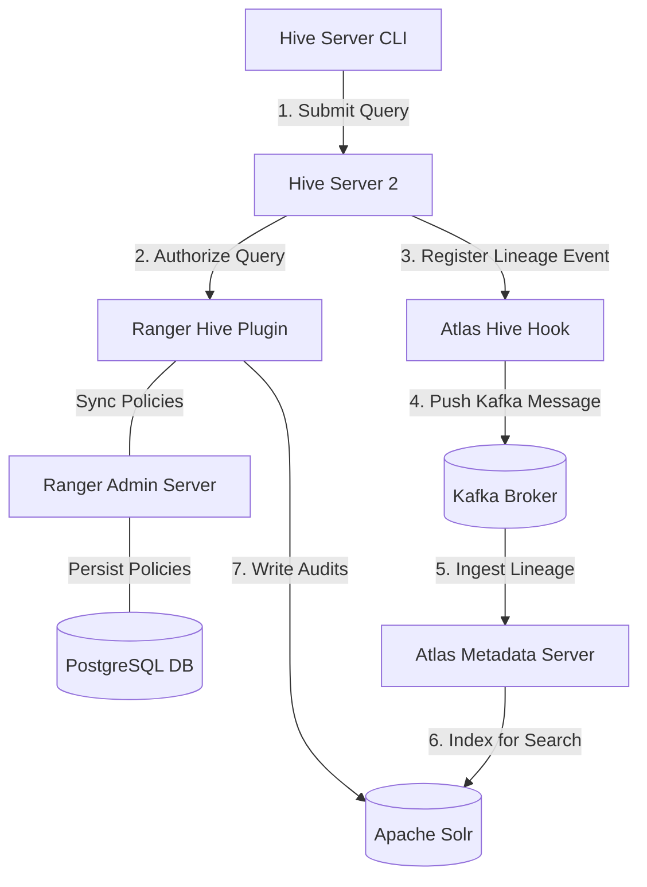

# Day 26 Hands-On Lab: Implementing Data Governance with Ranger and Atlas

This lab guides you through setting up a complete data governance environment using HDFS, Hive, Ranger, and Atlas, demonstrating policy enforcement, column masking, and lineage tracing.

---

## Lab Architecture



---

## Step 1: Spin Up the Infrastructure

1. Navigate to the `docker/` directory:
   ```bash
   cd docker
   ```
2. Launch the docker-compose stack:
   ```bash
   docker-compose up -d
   ```
3. Check status and wait for all containers to report healthy (especially `ranger-admin` and `atlas`):
   ```bash
   docker-compose ps
   ```

---

## Step 2: Configure Policies in Apache Ranger

1. Open your browser and navigate to the Ranger Admin Console:
   * **URL**: `http://localhost:6080`
   * **Username**: `admin`
   * **Password**: `RangerAdminPassword123`
2. Define a **Hive Service**:
   * Under the **Hive** category, add a service named `production_hive`.
   * Set configuration URL: `jdbc:hive2://hive-server2:10000`.
3. Create a **Security Policy**:
   * **Policy Name**: `Restrict Raw Transactions`
   * **Database**: `financial_lake`
   * **Table**: `raw_transactions`
   * **Column**: `*`
   * **Allow Conditions**:
     * Group: `compliance_officer` -> permissions: `select`, `read`
     * Group: `analyst` -> NO access allowed.
4. Create a **Column Masking Policy** (ABAC/Data Masking):
   * Under the Masking tab of `production_hive`, create a policy:
     * **Database**: `financial_lake`
     * **Table**: `raw_transactions`
     * **Column**: `card_number`
     * **Condition**: User/Group `analyst`
     * **Masking Option**: `Hash` (SHA-256) or `Partial Masking` (show last 4 digits).

---

## Step 3: Run the Hive Queries & Populate Data

1. Log into the Hive Server container:
   ```bash
   docker exec -it hive-server2 beeline -u jdbc:hive2://localhost:10000 -n admin
   ```
2. Execute the queries inside [sample-queries.sql](file:///c:/Users/Himanshu_Verma/DELL/Personal/30_Days_of_Modern_Hadoop_Ecosystem/Day-26-Ranger-Atlas-Governance/labs/sample-queries.sql):
   ```sql
   -- Run the table setup and CTAS query
   CREATE DATABASE IF NOT EXISTS financial_lake;
   USE financial_lake;
   CREATE TABLE raw_transactions (account_id STRING, customer_name STRING, card_number STRING, amount DOUBLE, country STRING) ROW FORMAT DELIMITED FIELDS TERMINATED BY ',';
   INSERT INTO raw_transactions VALUES ('ACC1', 'John Doe', '1111-2222-3333-4444', 100.50, 'US');
   CREATE TABLE transactions_summary AS SELECT country, SUM(amount) as total_amount FROM raw_transactions GROUP BY country;
   ```

---

## Step 4: Verify Metadata and Lineage in Apache Atlas

1. Open the Atlas Web UI in your browser:
   * **URL**: `http://localhost:21000`
   * **Username**: `admin`
   * **Password**: `admin`
2. Search for the Hive Table:
   * In the Search bar, choose type `hive_table` and type `raw_transactions` or `transactions_summary`.
3. Inspect **Lineage Graph**:
   * Click on `transactions_summary` and navigate to the **Lineage** tab.
   * You should see a graphical map showing:
     `raw_transactions` ➔ `create table transactions_summary ... (hive_process)` ➔ `transactions_summary`
4. Inspect Schema Details:
   * Verify columns, classifications, and system attributes.

---

## Step 5: Validate Audit Trails

1. Execute the verification script:
   ```bash
   ./scripts/verify-audit.sh
   ```
2. The output will print recent audit entries, confirming that Ranger logged the query executions and access requests successfully to Apache Solr.
