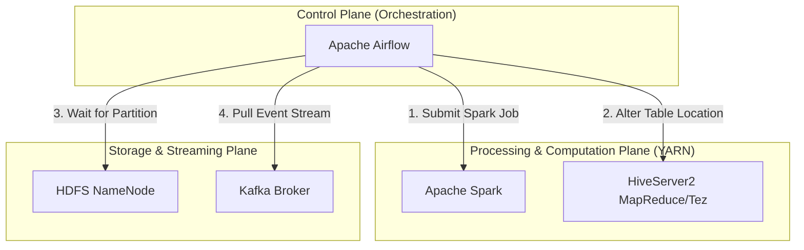
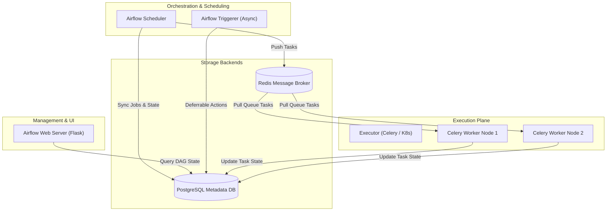
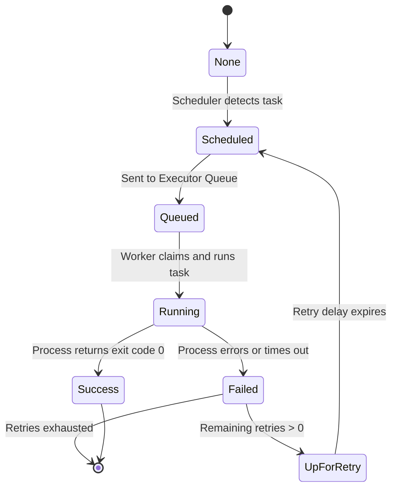
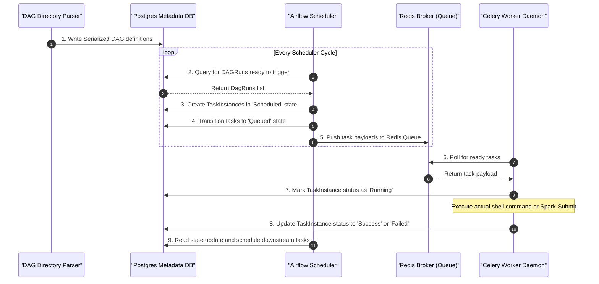
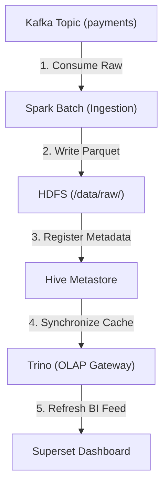

# Day 27: Workflow Orchestration with Apache Airflow

Welcome to Day 27 of the **30 Days of Modern Hadoop Ecosystem** series. Today, we are deep-diving into the core of enterprise data orchestration: **Apache Airflow**. In modern, distributed environments, scheduling, managing, and monitoring complex data workflows across disparate platforms (like Hadoop, Spark, Kafka, Hive, and Trino) is a critical operational requirement. This repository teaches Airflow from first principles using the philosophy: **WHY → HOW → INTERNALS → PRODUCTION → TROUBLESHOOTING**.

---

## 🗺️ Learning Roadmap

```
               [ Workflow Orchestration Lifecycle ]
                                |
       +------------------------+------------------------+
       |                                                 |
  [ Why Orchestration? ]                        [ Airflow Architecture ]
   - Silent Failures                             - Scheduler (Heartbeat Loop)
   - Cron Scaling Limits                         - Web Server (Flask console)
   - Dynamic Dependencies                        - Executor / Workers (Queue)
   - Failure Remediation                         - Metadata DB / Triggerer
       |                                                 |
       +------------------------+------------------------+
                                |
                    [ Advanced Production ]
                     - Celery / K8s Executors
                     - HA Scheduler (Active-Active)
                     - DB Tuning & Pools
                     - Secrets Backends
```

---

## SECTION 1 — INTRODUCTION

### 1.1 What is Apache Airflow?
**Apache Airflow** is an open-source platform designed to programmatically author, schedule, and monitor workflows. Workflows are declared as **Directed Acyclic Graphs (DAGs)** in Python, allowing developers to treat pipelines as code (Configuration-as-Code). Airflow's scheduler executes tasks on a array of workers while respecting their defined dependencies.

### 1.2 Why Was It Created?
Airflow was created at Airbnb in October 2014 by Maxime Beauchemin. Airbnb was experiencing rapid data growth, leading to hundreds of batch pipelines running on Hadoop. Existing systems (like Cron or custom shell scripts) could not manage task interdependencies, track execution states, or scale across multi-tenant teams without massive engineering overhead.

### 1.3 Evolution of Workflow Orchestration
1. **Time-Based Scheduling (Cron)**: Simple but blind to task dependencies or failures.
2. **XML/Properties-Based Ingestion (Apache Oozie, Azkaban)**: Rigid XML files defined map-reduce workflows. Hard to develop, debug, or write dynamic loops.
3. **Configuration-as-Code (Apache Airflow)**: Python scripts declare DAGs dynamically. Enables branching, object-oriented refactoring, and integration testing.
4. **Data-Aware Orchestration (Airflow 2.4+)**: Workflows trigger based on dataset events (AIP-48) rather than simple clock intervals.

### 1.4 Airflow's Role in the Hadoop Ecosystem
Airflow acts as the **control plane** (or conductor) of the data lake. It does not process database data itself. Instead, it delegates data computation tasks to processing engines:
* Submits Spark jobs to YARN resource pools.
* Triggers Hive/Trino SQL queries.
* Monitors Kafka consumer groups and offsets.
* Orchestrates HDFS partition creations.



---

## SECTION 2 — PROBLEM STATEMENT

### 2.1 Problems Before Workflow Orchestration
Operating an enterprise data platform without a centralized scheduler leads to systemic pipeline failures:

```
[ Scheduled Script ] ➔ [ Silent Job Failure ] ➔ [ Data Corruption ] ➔ [ Downstream Outage ]
   (POSIX Cron)         (No Log Capture)       (Missing Checks)        (Stale BI Report)
```

* **Silent Failure Blackhole**: If a cron script fails, there is no centralized alert system. Business reports display stale or corrupted calculations.
* **Brittle Dependency Management**: If Script B depends on Script A completing, engineers often schedule Script A at 01:00 AM and Script B at 02:00 AM. If Script A runs slow, Script B starts prematurely, leading to corrupt joins.
* **Failure Recovery Costs**: Rerunning failed workflows requires manually ssh-ing into nodes, identifying the failure line, commenting out completed sections, and executing the remainder.
* **Auditing and Compliance Blinds**: Compliance auditors cannot trace execution history, log histories, or see who modified table structures.

### 2.2 Chronological Comparison of Scheduling Approaches

| Capability | Linux Cron | Apache Oozie (Hadoop) | Apache Airflow |
| :--- | :--- | :--- | :--- |
| **Workflow Definition** | Cron String + Script Path | Rigid XML Configuration | Python Code (Dynamic) |
| **Dependency Logic** | Time-based scheduling only | Action/Control Nodes in XML | Direct Dependency Graphs |
| **Failure Recovery** | Manual script restarts | XML job reruns | One-click UI Task Retry |
| **Dynamic Workflows** | None | Limited parameterized configs | Programmatic Python Loops |
| **Monitoring Interface**| Local mail `/var/mail` | Basic Hadoop job console | Advanced Interactive Web UI |

---

## SECTION 3 — ARCHITECTURE DEEP DIVE

Apache Airflow splits execution responsibility between the administrative control plane, metadata storage, and worker nodes.



### 3.1 Component Architecture Definitions

1. **Scheduler**: A persistent process that parses DAG files, schedules task instances, and sends ready tasks to the queue.
2. **Web Server**: A Flask-based user interface displaying DAG structures, task logs, executions, and active connections.
3. **Executor**: The pluggable execution mechanism (Local, Celery, Kubernetes) that determines *how* and *where* tasks are run.
4. **Workers**: Daemons (or pods) that pull tasks from the queue and execute their code.
5. **Metadata Database**: Relational database (PostgreSQL/MySQL) storing DAG configurations, run histories, variables, and user profiles.
6. **Triggerer**: An asynchronous event loop running deferrable tasks to save worker resources during wait operations (e.g. waiting for external Spark jobs).
7. **DAG Files**: Python scripts containing workflow schemas.
8. **Task Instances**: Specific runs of tasks for a given execution date, tracking states (e.g., queued, running, failed).
9. **Operators**: The building blocks of workflows, representing atomic steps (e.g., `BashOperator`, `SparkSubmitOperator`).
10. **Hooks**: Standard interfaces connecting Airflow to external systems (e.g., `HdfsHook`, `PostgresHook`).
11. **Connections**: Configured credentials and hostnames stored in the database for external services.
12. **Variables**: Key-value settings stored globally for runtime parameterization.
13. **Pools**: Resource throttles limiting the number of parallel tasks assigned to resource-intensive platforms (like Spark YARN pools).
14. **XCom (Cross-Communication)**: A mechanism allowing tasks to pass small amounts of metadata state (like partition locations) between each other.

### 3.2 Task Instance State Machine Transitions



---

## SECTION 4 — INTERNAL WORKING

The execution of a task involves a continuous poll loop between the file system, scheduler scheduler threads, executors, message brokers, and database logs.



### 4.1 Step-by-Step Internal Flow
1. **DAG Parsing**: The `DagDirectoryParser` runs in the background. It reads Python files from `/opt/airflow/dags`, compiles them, and writes the serialized JSON representation into the `serialized_dag` database table.
2. **Scheduler Evaluation**: The Scheduler queries the database for `dag_run` rows. It locates runs whose execution criteria (cron schedule or dataset triggers) are met.
3. **Queue Push**: For each active run, the Scheduler evaluates task dependencies. Tasks with completed dependencies are set to `scheduled`, then marked as `queued` and pushed to the Celery Redis queue.
4. **Worker Pick up**: Celery workers polling the Redis queue pull task instructions, instantiate the task class, execute the `execute()` method, and redirect standard out to log files.
5. **Metadata Update**: Once execution completes, the worker updates the task's state in the metadata database (e.g. `success` or `failed`).
6. **Downstream Scheduling**: During the next scheduler loop, the scheduler detects the task success, resolves dependencies for the next tasks, and schedules them.

---

## SECTION 5 — CORE CONCEPTS

### 5.1 DAGs and Tasks
* **DAG (Directed Acyclic Graph)**: A collection of tasks organized in a way that reflects their relationships and dependencies. It has no loops (acyclic).
* **Task**: A unit of work. In code, it is represented as an operator instance.

### 5.2 Operators, Hooks, and Sensors
* **Operators**: Templates for tasks.
  * *Action Operators*: Execute computations (e.g. `BashOperator`, `PythonOperator`).
  * *Transfer Operators*: Move data (e.g. `S3ToRedshiftOperator`).
  * *Sensors*: A subclass of operators that wait for a specific condition (e.g. file arrival in HDFS, database record insert) to evaluate to True before proceeding.
* **Hooks**: The underlying connection adapters. They handle credentials, protocol handshakes, and network timeouts (e.g., `HiveServer2Hook`).

### 5.3 Task Dependency Syntax
In Airflow, task dependencies are declared using bitshift operators:
```python
# Task A runs first, then Task B, then Task C
task_a >> task_b >> task_c

# Task D runs only after both B and C finish
[task_b, task_c] >> task_d
```

### 5.4 Catchup vs Backfills
* **Catchup**: When a DAG is enabled, if `catchup=True` (default), the scheduler runs execution intervals that have passed since the DAG's `start_date` up to the current time. This can cause "catchup storms" that overload resources if not disabled:
  ```python
  # Best practice: disable catchup in production
  dag = DAG(dag_id='my_dag', catchup=False, start_date=datetime(2026, 1, 1))
  ```
* **Backfill**: A CLI-triggered manual command to execute a DAG over a historic date range, bypassing catchup locks.

### 5.5 Variable and Connections
* **Variables**: Global key-value configurations. Avoid querying variables inside top-level DAG code as it causes database lookups during parsing:
  ```python
  # BAD: Queries DB every 30 seconds during parse loop
  my_config = Variable.get("my_key")

  # GOOD: Evaluates only inside task execution context via template
  task = BashOperator(task_id='t', bash_command="echo {{ var.value.my_key }}")
  ```
* **Connections**: Hostnames, usernames, ports, and passwords. Securely encrypted using a Fernet key in the database.

---

## SECTION 6 — PRODUCTION ENGINEERING

### 6.1 Scaling Airflow Executors

```
                     [ Pluggable Airflow Executors ]
                                    |
         +--------------------------+--------------------------+
         |                          |                          |
 [ LocalExecutor ]          [ CeleryExecutor ]        [ KubernetesExecutor ]
  - Single-node scaling      - Multi-node scaling      - Multi-node dynamic scaling
  - Thread-pool tasks        - Redis queue broker      - Pod-per-task model
  - Shared disk limits       - Fixed worker pool       - Kubernetes scheduler
```

* **Local Executor**: Runs tasks as subprocesses on the scheduler node. Good for low-concurrency development environments, but limited by single-node CPU/memory limits.
* **Celery Executor**: Spawns a static pool of worker daemons. A broker (Redis/RabbitMQ) acts as a queue. Highly scalable and provides instantaneous execution.
* **Kubernetes Executor**: Spawns a temporary Kubernetes pod for each task instance. Zero resource waste since pods disappear on success. Highly scalable, but introduces minor pod-startup latency.

### 6.2 Active-Active High Availability Scheduler
In Airflow 2.0+, you can run multiple schedulers simultaneously. The schedulers synchronize using row-level locking on the PostgreSQL metadata database. If one scheduler crashes, active workflows are managed by the remaining schedulers without disruption.

### 6.3 Performance Optimization Tuning Parameters
Edit the following parameters in `configs/airflow.cfg` to optimize performance:
* `parallelism`: Max tasks running concurrently across the entire Airflow deployment.
* `max_active_runs_per_dag`: Restricts concurrent DAG executions to protect downstream target warehouses.
* `min_file_process_interval`: Frequency (seconds) at which DAG files are parsed. Increase to 60+ seconds to reduce CPU load.
* `sql_alchemy_pool_size`: Maximum open connections to the metadata database. Tune to 20-30 in production.

---

## SECTION 7 — HANDS-ON LAB SUMMARY

Our hands-on directory contains a full sandbox demonstrating a production-grade ETL pipeline.

* **Hands-on DAG**: [dags/hands_on_etl.py](file:///c:/Users/Himanshu_Verma/DELL/Personal/30_Days_of_Modern_Hadoop_Ecosystem/Day-27-Airflow-Orchestration/dags/hands_on_etl.py)
* **Lab Manual**: [labs/lab-guide.md](file:///c:/Users/Himanshu_Verma/DELL/Personal/30_Days_of_Modern_Hadoop_Ecosystem/Day-27-Airflow-Orchestration/labs/lab-guide.md)

### Execution Pipeline

```
[ Generate Data ] ➔ [ Publish to Kafka ] ➔ [ Spark Transform ] ➔ [ Load Hive Table ] ➔ [ Audit Check ] ➔ [ Alert ]
 (Python Task)       (Mock CLI Stream)      (YARN Submit)         (Alter Partition)    (Match Count)    (Notify)
```

1. **Deploy Stack**: Navigate to [docker/docker-compose.yml](file:///c:/Users/Himanshu_Verma/DELL/Personal/30_Days_of_Modern_Hadoop_Ecosystem/Day-27-Airflow-Orchestration/docker/docker-compose.yml) and launch services.
2. **Access UI**: Connect to Airflow Console (`http://localhost:8080`).
3. **Register Connections**: Set up `hive_metastore_default` connection and pool parameters in the Web UI.
4. **Trigger Run**: Enable the DAG and trigger it to verify task outputs.

---

## SECTION 8 — BUILD FROM SOURCE

Building Apache Airflow from source is useful when compiling custom plugin integrations or security managers.

### 8.1 Compilation Prerequisites
* **Java Development Kit**: JDK 11/17 (required for Spark/Hive client libraries)
* **Python**: version 3.8, 3.9, or 3.10
* **Node.js & Yarn**: required to compile Webserver frontend Javascript bundles.

### 8.2 Build Step Sequence
```bash
# 1. Clone official repository
git clone https://github.com/apache/airflow.git
cd airflow
git checkout tags/2.7.2 -b build-v2.7.2

# 2. Setup virtual environment
python -m venv venv
source venv/bin/activate
pip install --upgrade pip

# 3. Compile webserver frontend assets
cd airflow/www
yarn install
yarn run build
cd ../..

# 4. Build python wheel distribution package
pip install build
python -m build --wheel

# 5. Verify compiled package
ls -la dist/apache_airflow-2.7.2-py3-none-any.whl
```

### 8.3 Common Build Failures
* **gcc/g++ missing**: Compiling Python dependencies (like cryptography or confluent-kafka) requires C build tools. Fix by installing `build-essential`.
* **node/yarn lock conflicts**: Ensure your Node.js version is compatible with the Airflow UI package (Node 16/18 is recommended).

---

## SECTION 9 — DOCKER DEPLOYMENT

The complete multi-service environment is located in the `docker/` folder.

* **Dockerfile**: [docker/Dockerfile](file:///c:/Users/Himanshu_Verma/DELL/Personal/30_Days_of_Modern_Hadoop_Ecosystem/Day-27-Airflow-Orchestration/docker/Dockerfile)
* **Compose File**: [docker/docker-compose.yml](file:///c:/Users/Himanshu_Verma/DELL/Personal/30_Days_of_Modern_Hadoop_Ecosystem/Day-27-Airflow-Orchestration/docker/docker-compose.yml)
* **Init Database**: [docker/init-postgres.sql](file:///c:/Users/Himanshu_Verma/DELL/Personal/30_Days_of_Modern_Hadoop_Ecosystem/Day-27-Airflow-Orchestration/docker/init-postgres.sql)
* **Entrypoint**: [docker/entrypoint.sh](file:///c:/Users/Himanshu_Verma/DELL/Personal/30_Days_of_Modern_Hadoop_Ecosystem/Day-27-Airflow-Orchestration/docker/entrypoint.sh)

### Stack Configuration Details
* **PostgreSQL Store**: Persists metadata records.
* **Redis Broker**: Manages the task distribution queue.
* **Initialization Container**: Automates database migrations and default administrator profile setup.
* **Triggerer Container**: Handles asynchronous wait tasks (deferrable operators).

---

## SECTION 10 — LOCAL CLUSTER DEPLOYMENT

Integrating Airflow into an active big data platform cluster requires mapping execution environment connections:

```
                  [ Airflow Central Scheduler ]
                                |
       +------------------------+------------------------+
       |                                                 |
  [ HDFS Client ]                                [ Hive Metastore Client ]
   - Config path: /etc/hadoop/conf                - Port: thrift://metastore:9083
   - Binary path: /usr/bin/hdfs                   - Libs: PyHive, Thrift dependencies
       |                                                 |
       +------------------------+------------------------+
                                |
                       [ YARN Client Submit ]
                        - Spark-Submit CLI
                        - Core configuration maps
```

### 10.1 Multi-Service Integration Steps
1. **Copy Hadoop/Hive Configs**: Mount HDFS client configuration maps (`core-site.xml`, `hdfs-site.xml`) to `/etc/hadoop/conf` inside the workers and scheduler container.
2. **Setup Spark Classpaths**: Export environment paths `SPARK_HOME` and `HADOOP_CONF_DIR` to ensure `spark-submit` can locate YARN nodes.
3. **Register Trino/Pinot Drivers**: Install Python connector libraries (`trino`, `pinotdb`) in your custom Docker image to query analytics layers dynamically.

---

## SECTION 11 — VALIDATION & VERIFICATION

Automate connection and deployment validation using the scripts in `scripts/`:

1. **Verify Airflow Services**: [scripts/verify-airflow.sh](file:///c:/Users/Himanshu_Verma/DELL/Personal/30_Days_of_Modern_Hadoop_Ecosystem/Day-27-Airflow-Orchestration/scripts/verify-airflow.sh)
   * Checks database connections, Redis queues, and logs.
2. **Verify DAG Syntax**: [scripts/verify-dag.sh](file:///c:/Users/Himanshu_Verma/DELL/Personal/30_Days_of_Modern_Hadoop_Ecosystem/Day-27-Airflow-Orchestration/scripts/verify-dag.sh)
   * Validates Python compilation and import issues.
3. **Verify Scheduler Loop**: [scripts/verify-scheduler.sh](file:///c:/Users/Himanshu_Verma/DELL/Personal/30_Days_of_Modern_Hadoop_Ecosystem/Day-27-Airflow-Orchestration/scripts/verify-scheduler.sh)
   * Monitors scheduler jobs and active loops.
4. **Verify Workers Ping**: [scripts/verify-worker.sh](file:///c:/Users/Himanshu_Verma/DELL/Personal/30_Days_of_Modern_Hadoop_Ecosystem/Day-27-Airflow-Orchestration/scripts/verify-worker.sh)
   * Pinpoints worker availability and queue concurrency.
5. **Verify ETL Pipeline**: [scripts/verify-etl.sh](file:///c:/Users/Himanshu_Verma/DELL/Personal/30_Days_of_Modern_Hadoop_Ecosystem/Day-27-Airflow-Orchestration/scripts/verify-etl.sh)
   * Programmatically runs the hands-on DAG and asserts execution outcomes.

---

## SECTION 12 — PRODUCTION TROUBLESHOOTING PLAYBOOK

For detailed troubleshooting procedures, see [troubleshooting/troubleshooting-guide.md](file:///c:/Users/Himanshu_Verma/DELL/Personal/30_Days_of_Modern_Hadoop_Ecosystem/Day-27-Airflow-Orchestration/troubleshooting/troubleshooting-guide.md).

### Quick Troubleshooting Guide
* **DAG not loading**: Check `list-import-errors` via CLI.
* **Worker connection refused (8793)**: Verify firewall settings and remote logging variables in the config file.
* **Task stuck in Queued state**: Check pool capacity limits (`airflow pools list`) and Redis broker queues.
* **Database Deadlocks**: Check active sessions count in PostgreSQL and reduce task `max_threads` settings.

---

## SECTION 13 — REAL-WORLD CASE STUDY

### Case Study: Retail Bank Payment Process Ingestion

A global retail bank processes millions of online payments daily. They use a multi-engine architecture to ingest, process, store, and analyze transaction data.



#### How Airflow Orchestrates the Flow
* **SLA Configuration**: If Kafka ingest latency exceeds 15 minutes, Airflow triggers paging system alerts.
* **Conditional Resource Branching**: The `determine_spark_scaling` task uses a `BranchPythonOperator` to check the queue's message volume. High volumes route execution to YARN's high-memory queues, while low volumes route execution to standard YARN queues.
* **Trigger Rules for Alerting**: If upstream Spark tasks fail, the `alert_recovery` task (configured with `TriggerRule.ONE_FAILED`) runs to send details to Slack and pager platforms, while downstream database loading is safely bypassed.

---

## SECTION 14 — INTERVIEW QUESTIONS

### 14.1 Beginner Questions (1 - 20)

#### 1. What is Apache Airflow and how is it used?
Apache Airflow is a platform to programmatically author, schedule, and monitor workflows. It compiles task definitions into Directed Acyclic Graphs (DAGs) using Python.

#### 2. What is a DAG in Airflow?
A Directed Acyclic Graph (DAG) is a collection of all the tasks you want to run, organized in a way that reflects their relationships and dependencies. It has a single execution direction and contains no loops.

#### 3. What is the difference between an Operator and a Task?
An Operator is a template (e.g., Python class) defining the action to perform. A Task is an instantiated operator within a DAG.

#### 4. What is a Task Instance?
A Task Instance represents a specific run of a task for a given execution date (or logic date). It tracks state (e.g., queued, running, success, failed).

#### 5. Name three types of Executors supported by Airflow.
Local Executor, Celery Executor, and Kubernetes Executor.

#### 6. What is the role of the Airflow Webserver?
It serves a Flask-based web application displaying DAG logs, state grids, connections, variables, and DAG run progress.

#### 7. What is the role of the Airflow Scheduler?
It parses DAG files periodically, monitors task dependencies, determines which task instances are ready to run, and sends them to the executor queue.

#### 8. What is the database used for in Airflow?
The metadata database (e.g., PostgreSQL) stores historical DAG runs, task instance states, database connections, global variables, and login profiles.

#### 9. What is a Sensor in Airflow?
A Sensor is a type of operator that waits for a specific condition to evaluate to True (like a file appearing in HDFS) before executing downstream tasks.

#### 10. How do you define task dependencies in Airflow?
Using bitshift operators: `task_a >> task_b` (A runs before B) or methods like `task_a.set_downstream(task_b)`.

#### 11. What is XCom?
XCom (Cross-Communication) is a mechanism allowing tasks to pass small amounts of metadata state (like partition file paths) between each other.

#### 12. What database engines are supported by Airflow for production?
PostgreSQL and MySQL are fully supported in production environments.

#### 13. What is catchup in Airflow?
Catchup is a setting that determines whether the scheduler should trigger past, unexecuted runs of a DAG from its `start_date` up to the current date when the DAG is first enabled.

#### 14. How do you disable catchup?
By setting `catchup=False` in the DAG definition arguments.

#### 15. What is an Airflow Hook?
A Hook is a standard interface to connect to external platforms and databases, managing network connection parameters and credentials securely.

#### 16. What is an Airflow Connection?
A database record storing credentials, hostnames, ports, and connection parameters for external services.

#### 17. What is an Airflow Variable?
A global key-value configuration stored in the metadata database, used to parameterize DAG runs.

#### 18. What is an Airflow Pool?
A pool is a resource throttle used to limit the number of parallel tasks executed against resource-intensive external systems (like Spark YARN clusters).

#### 19. How do you trigger a DAG manually?
Using the **Trigger DAG** button in the Web UI or via the CLI command: `airflow dags trigger <dag_id>`.

#### 20. What port does the Airflow Webserver run on by default?
By default, the Webserver listens on port `8080`.

---

### 14.2 Intermediate Questions (21 - 40)

#### 21. What is the difference between LocalExecutor and CeleryExecutor?
LocalExecutor runs tasks as subprocesses on the scheduler node. CeleryExecutor distributes tasks across a static pool of worker nodes using a message broker (like Redis).

#### 22. What is a Deferrable Operator / Triggerer?
Introduced in Airflow 2.2, deferrable operators suspend themselves when waiting for external events, freeing up worker slots. The Triggerer handles these suspended tasks asynchronously using an event loop.

#### 23. What are Trigger Rules in Airflow?
Trigger rules determine when a task runs based on the status of its upstream tasks. Examples include `ALL_SUCCESS` (default), `ONE_FAILED`, `ONE_SUCCESS`, and `ALL_DONE`.

#### 24. Explain what `logical_date` (formerly `execution_date`) is.
The `logical_date` is the execution timestamp for which the DAG is run. For scheduled runs, it represents the *start* of the schedule interval, not the actual system time when the task executes.

#### 25. What is the danger of calling `Variable.get()` inside top-level DAG code?
Top-level DAG code is executed every few seconds by the scheduler. Calling `Variable.get()` here creates a database query on every parse loop, degrading scheduler performance.

#### 26. How do you pass data between tasks if XCom size limits are exceeded?
For large datasets, write the data to external storage (like HDFS or S3) in Task A, and pass the file path or URI to Task B via XCom.

#### 27. What is a Task Group in Airflow?
A Task Group is a UI grouping mechanism used to organize complex tasks within a DAG grid view, simplifying workflow visualization.

#### 28. How does the Celery Executor use Redis?
Redis acts as the message broker. The Scheduler pushes task execution commands to Redis, and Celery workers poll Redis to pull and run tasks.

#### 29. What is a backfill command?
A CLI command that allows engineers to execute a DAG for a historical date range, running tasks in chronological order while respecting dependencies.

#### 30. How do you handle secrets encryption in the Airflow DB?
Airflow encrypts credentials (like connection passwords) in the metadata database using a symmetric Fernet key configured via `fernet_key` in `airflow.cfg`.

#### 31. What is a SubDAG, and why is it deprecated?
SubDAGs allowed nesting DAGs inside other DAGs. They are deprecated because they caused scheduling locks and resource management issues. Use Task Groups instead.

#### 32. Explain the purpose of `depends_on_past`.
When set to True, a task instance will only run if its run in the *previous* schedule interval succeeded, enforcing chronological data processing.

#### 33. How does the Airflow Scheduler detect a dead worker node?
The scheduler periodically monitors the database for task heartbeats. If a worker fails to send heartbeats within the `scheduler_zombie_task_threshold` window, the scheduler marks the task as failed.

#### 34. What is the `TaskFlow` API?
Introduced in Airflow 2.0, the TaskFlow API simplifies Python workflows by using decorator syntax (`@task`, `@dag`) and managing XCom data serialization automatically.

#### 35. Can you run multiple Airflow Schedulers simultaneously?
Yes. Since Airflow 2.0, you can run active-active schedulers. They use database row-level locking to coordinate scheduling safely.

#### 36. What is the difference between `schedule_interval` and `schedule`?
`schedule` was introduced in Airflow 2.4 to support dataset-driven scheduling (triggering workflows when upstream datasets change) alongside traditional cron intervals.

#### 37. What happens if a task fails and has `retries=3` configured?
The task transitions to `up_for_retry` and is scheduled to run again after its `retry_delay` expires. This repeats up to 3 times before the task is marked as failed.

#### 38. How do you configure Airflow to send Slack notifications on failure?
By registering a Slack webhook in Airflow connections and calling a custom Python function in the DAG's `on_failure_callback` parameter.

#### 39. What is the role of the `standalone_dag_processor` setting?
When enabled, it runs the DAG parsing loop as a separate daemon, isolating parsing issues and reducing CPU load on the scheduler process.

#### 40. What is an SLA in Airflow?
A Service Level Agreement (SLA) is a time limit defined for tasks. If a task takes longer than the SLA limit to run, Airflow logs an SLA miss and emails alerts.

---

### 14.3 Advanced Questions (41 - 60)

#### 41. How does the Scheduler prevent race conditions when running in an active-active HA configuration?
Schedulers use row-level locking (e.g., `SELECT ... FOR UPDATE` in PostgreSQL) when querying task instances to schedule. This ensures only one scheduler can queue a specific task instance at a time.

#### 42. Explain the difference between CeleryExecutor and KubernetesExecutor during high-load spikes.
CeleryExecutor relies on a static pool of workers, so task spikes are queued until worker slots free up. KubernetesExecutor dynamically spawns a new Kubernetes pod for each task, scaling up to match the load immediately (within cluster resource limits).

#### 43. How would you configure a custom Secrets Backend in Airflow?
In `airflow.cfg`, configure `backend` under `[secrets]` (e.g., HashiCorp Vault or AWS Secrets Manager) and provide connection parameters:
```ini
[secrets]
backend = airflow.providers.hashicorp.secrets.vault.VaultBackend
backend_kwargs = {"url": "http://vault:8200", "token": "my-token"}
```

#### 44. What is a Zombie Task, and how does Airflow handle it?
A Zombie task is a task instance that the database records as `running`, but whose worker process has died. The scheduler identifies zombies by checking heartbeats, fails the task, and schedules retries.

#### 45. What is a Fiend Task (or Ghost Task)?
A Fiend task is a task instance that is running on a worker, but is recorded as `failed` or `scheduled` in the database. The worker daemon detects the state mismatch and kills the local process.

#### 46. How does Airflow serialize DAGs?
The DAG processor parses Python DAG files, converts them to JSON-serialized objects, and saves them in the `serialized_dag` table. The Webserver and Scheduler read this table, avoiding the need to parse raw Python files directly.

#### 47. Explain how AIP-39 (Richer Scheduling) changed the scheduling model.
Before AIP-39, the scheduler evaluated start dates and cron strings statically. AIP-39 introduced timetables, allowing developers to define dynamic, non-periodic scheduling intervals (like custom business calendars) using Python code.

#### 48. How would you optimize PostgreSQL database performance for a large Airflow cluster?
1. Regularly clean up execution tables using `airflow db clean`.
2. Tune `sql_alchemy_pool_size` and `sql_alchemy_max_overflow` in `airflow.cfg`.
3. Use a connection pooler like PgBouncer to manage database connections.

#### 49. What is the performance impact of `dag_dir_list_interval`?
It determines how often the scheduler scans the DAGs folder for new files. Setting it too low causes high disk I/O and database write load. In production, set it to 60 seconds or higher.

#### 50. How do you implement Tag-Based access controls in the Airflow Webserver?
By configuring Flask AppBuilder Roles (`webserver_config.py`) and mapping LDAP directory groups to Airflow roles (like Admin or Viewer).

#### 51. What is the difference between `poke` and `reschedule` modes in Sensors?
* `poke` mode: The sensor task runs continuously, blocking a worker slot until it succeeds or times out.
* `reschedule` mode: The sensor task queries the condition once. If it fails, it releases the worker slot and schedules itself to run again later, saving worker resources.

#### 52. How would you debug a scheduler deadlock issue?
1. Check the database logs for locks and blocked queries.
2. Thread dump the scheduler process using `py-spy` or `gdb`.
3. Audit scheduler loop metrics (like `scheduler_heartbeat_sec`) to identify processing bottlenecks.

#### 53. How do you generate DAGs dynamically from a database table?
Use a Python script in the DAGs folder that queries the database table, loops over the rows, and registers a DAG object in the global namespace (`globals()`) for each record.

#### 54. Explain AIP-44 (Airflow Internal API).
AIP-44 decouples execution tasks (workers) from the metadata database. Workers query a secure HTTP REST API hosted by the scheduler to get task metadata, preventing direct database access from worker nodes and improving security.

#### 55. What is the risk of utilizing dynamic database connections in dynamic DAG loops?
Dynamic queries in DAG loops are executed every time the scheduler parses the DAGs folder, leading to high database load and slow DAG parsing. Always read configs from local files or cache them to avoid this.

#### 56. What is the purpose of `provide_context=True` in PythonOperator?
It passes execution context parameters (like `ds`, `logical_date`, `ti`, and `var`) as keyword arguments to the Python callable function, allowing access to run-specific variables.

#### 57. How do you configure remote logging to HDFS?
Install the HDFS provider package, configure `remote_logging = True` and `remote_base_log_folder = hdfs://namenode:9000/logs/` in `airflow.cfg`, and configure HDFS connection details in Airflow connections.

#### 58. How does `max_active_runs` control DAG runs?
It limits the number of concurrent executions allowed for a specific DAG. If a DAG has historical backfills pending, this setting prevents it from launching too many runs simultaneously, protecting downstream databases.

#### 59. How would you design a test suite for Airflow DAGs?
1. Use `pytest` to run syntax compilation tests.
2. Use Python's unittest module to check DAG structures and task dependencies.
3. Use dry-run execution tests to verify task parameters without executing their commands.

#### 60. How does a custom XCom backend work?
You can configure a custom Python class as the XCom backend (e.g., writing data to S3 or HDFS). When a task returns a value, Airflow calls the backend's serialization method to save the data to external storage, and database records store only the URI.

---

## SECTION 15 — KEY TAKEAWAYS

* **Orchestrator ≠ Execution Engine**: Airflow manages scheduling and workflows; it does not process database records itself. Run heavy computations on external platforms (like Spark and YARN) to avoid overloading Airflow.
* **Keep DAG Files Lightweight**: Do not write heavy SQL queries or API calls in top-level DAG code. This code is parsed frequently by the scheduler, and heavy calls will degrade scheduling performance.
* **Configure Idempotent Tasks**: Design tasks to be idempotent. Running a task multiple times for the same execution date should produce the same results without duplicating data.
* **Disable Catchup in Production**: Set `catchup=False` to prevent the scheduler from launching many historical runs when a DAG is enabled. Use manual backfills instead.

---

## SECTION 16 — REFERENCES

* [Official Apache Airflow Documentation](https://airflow.apache.org/docs/)
* [Apache Airflow GitHub Repository](https://github.com/apache/airflow)
* [Airflow Improvement Proposals (AIPs)](https://cwiki.apache.org/confluence/display/AIRFLOW/Airflow+Improvement+Proposals)
* [Astronomer Production Guide](https://www.astronomer.io/docs/)
* [Airbnb Engineering Blog: Airflow](https://medium.com/airbnb-engineering)
