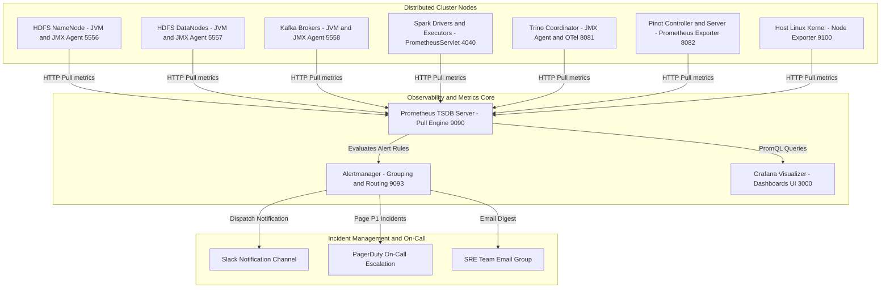
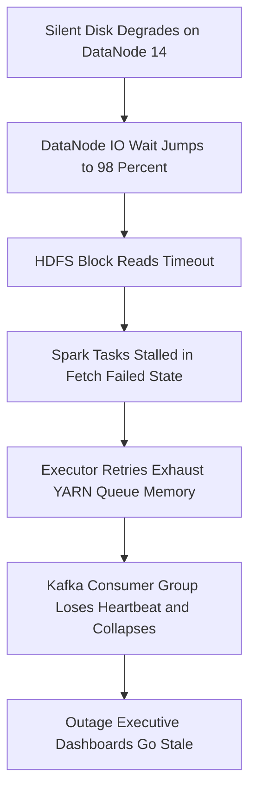
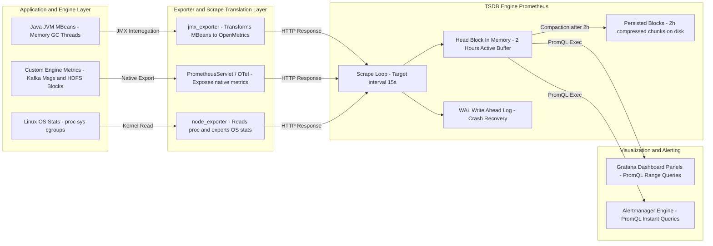
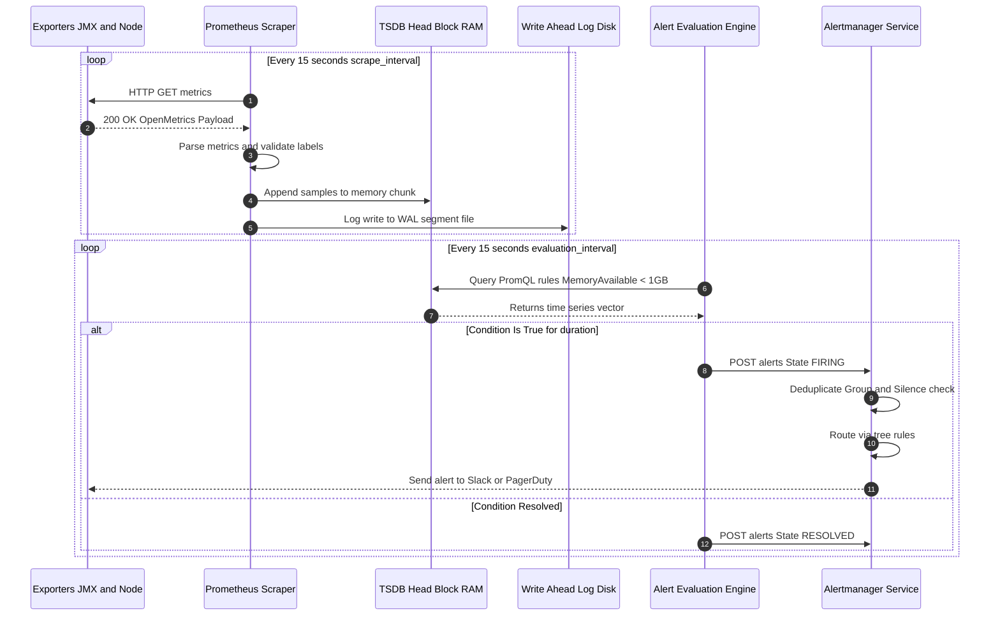
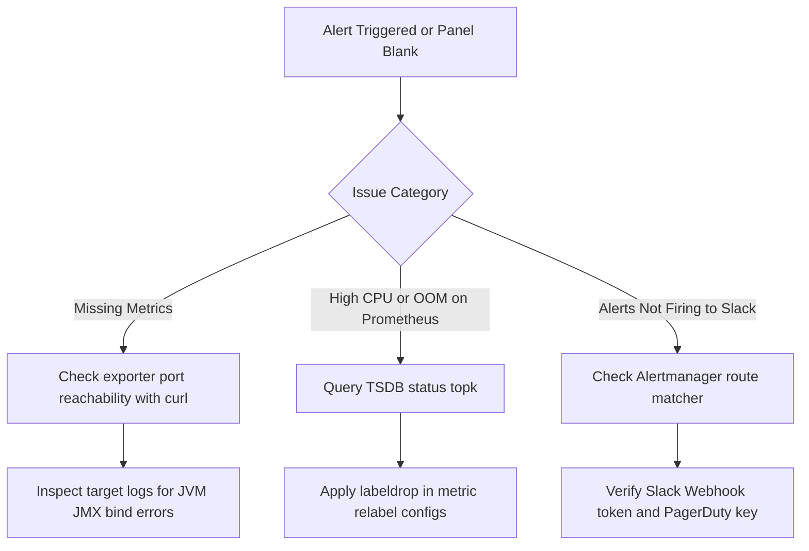
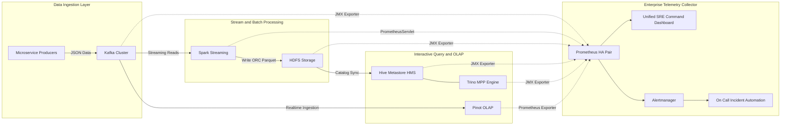

# Day 28 — Platform Observability: Prometheus, Grafana, Alertmanager & Distributed System Telemetry

> **Course:** 🚀 30 Days of Modern Hadoop Ecosystem — From HDFS to Production Data Platforms  
> **Target Audience:** Senior SREs, Platform Engineers, Data Infrastructure Engineers, Distributed Systems Architects  
> **Philosophy:** WHY → HOW → INTERNALS → PRODUCTION → TROUBLESHOOTING

---

## 📌 Table of Contents
1. [1. Introduction](#1-introduction)
2. [2. Problem Statement: Life Without Observability](#2-problem-statement-life-without-observability)
3. [3. Architecture Deep Dive](#3-architecture-deep-dive)
4. [4. Internal Working & Low-Level Mechanics](#4-internal-working--low-level-mechanics)
5. [5. Core Concepts & Mathematical Foundations](#5-core-concepts--mathematical-foundations)
6. [6. Production Engineering & High Availability](#6-production-engineering--high-availability)
7. [7. Hands-On Lab: Complete Monitoring Stack](#7-hands-on-lab-complete-monitoring-stack)
8. [8. Build From Source](#8-build-from-source)
9. [9. Docker Container Deployment](#9-docker-container-deployment)
10. [10. Local Cluster Deployment](#10-local-cluster-deployment)
11. [11. Comprehensive Validation & Verification](#11-comprehensive-validation--verification)
12. [12. Production Troubleshooting Playbook](#12-production-troubleshooting-playbook)
13. [13. Real-World Enterprise Case Study](#13-real-world-enterprise-case-study)
14. [14. Industry Interview Preparation (60 Questions)](#14-industry-interview-preparation-60-questions)
15. [15. Key Takeaways & Architecture Best Practices](#15-key-takeaways--architecture-best-practices)
16. [16. References & Deep Technical Reads](#16-references--deep-technical-reads)

---

## 1. Introduction

### What is Platform Observability?
**Platform Observability** is the measure of how well the internal state of a complex, distributed data platform can be inferred solely from its external outputs (telemetry: metrics, logs, traces, and events). In modern data platforms consisting of HDFS, YARN, Kafka, Spark, Hive, Airflow, Trino, and Pinot, observability provides real-time visibility into engine health, query execution performance, storage degradation, and inter-service dependencies.



### Why Observability is Essential in Distributed Systems
Distributed data platforms exhibit non-linear interactions, partial network failures, async pipeline backpressure, and complex garbage collection pauses. Unlike monolithic web applications:
- Failures manifest far downstream from their root cause (e.g., a slow disk on a DataNode causes Spark task speculative re-executions, which starves YARN queues, resulting in Kafka consumer group rebalances).
- Passive logging is insufficient due to multi-terabyte log volumes generated across thousands of worker containers per hour.

### Evolution: Monitoring vs. Observability

| Feature Dimension | Traditional Monitoring | Modern Platform Observability |
| :--- | :--- | :--- |
| **Philosophy** | "Is the system up or down?" | "Why is the system behaving unexpectedly?" |
| **Questions Answered** | Known Unknowns (pre-defined thresholds) | Unknown Unknowns (exploratory PromQL / Traces) |
| **Data Collection** | Black-box ping, basic SNMP, threshold alerts | White-box telemetry, MBeans, OpenMetrics, cgroups |
| **System View** | Isolated single-node resource gauges | High-cardinality multi-dimensional time series |
| **MTTR Impact** | High (Requires manual log grepping) | Low (Instant root-cause isolation across layers) |

### The Three Pillars of Observability
1. **Metrics**: Numeric, aggregated, time-stamped series representing system state (e.g., `kafka_server_brokertopicmetrics_messagesinpersec_count`). Low storage overhead, fast PromQL querying, primary driver for alerting.
2. **Logs**: Immutable, structured event records emitted during application execution (JSON / Text). Essential for context, stack traces, and forensic post-mortems.
3. **Traces**: End-to-end request pathways across distributed boundaries (Distributed Tracing via OpenTelemetry/Jaeger). Essential for pinpointing micro-latency bottlenecks in query engines (e.g., Trino split processing).

### Role in Modern Hadoop & Data Ecosystems
Observability acts as the central nerve center for modern data engineering. It enables automated cluster auto-scaling, proactive disk failure replacement, SLA breach prevention for streaming data pipelines, and cost optimization for ephemeral cloud worker nodes.

---

## 2. Problem Statement: Life Without Observability

Operating an enterprise-grade Hadoop platform without centralized observability leads to catastrophic failure modes across infrastructure, compute, and business SLAs:



### Real-World Production Failure Modes

1. **Silent Failures & Memory Leaks**:
   - *Scenario*: A custom Spark UDF leaks memory within the Java Native Interface (JNI) C++ memory heap.
   - *Impact*: JVM heap metrics appear normal, but YARN NodeManager nodemanager cgroup kills containers unexpectedly (`Exit Code 137`). SREs waste days searching for Java GC bugs while physical RAM is exhausted.

2. **Long Mean Time To Detect (MTTD) & Recover (MTTR)**:
   - *Scenario*: An HDFS NameNode enters SafeMode due to block report mismatches during midnight maintenance.
   - *Impact*: Without active Prometheus alerts (`HDFSNameNodeInSafemode`), batch ETL pipelines fail silently overnight. Data engineers discover unpopulated data marts 8 hours later during business standup.

3. **High Cardinality Explosion & TSDB Collapses**:
   - *Scenario*: A developer includes `user_session_id` as a label in a custom Prometheus metric.
   - *Impact*: Millions of unique time series saturate Prometheus RAM within 20 minutes, bringing down the monitoring system when it is needed most.

4. **Cascading Consumer Group Rebalances**:
   - *Scenario*: Long Garbage Collection (GC) pauses on Kafka broker JVMs (> 10 seconds) cause ZooKeeper/KRaft session timeouts.
   - *Impact*: Cascading broker leadership elections collapse ingest throughput for the entire enterprise message bus.

---

## 3. Architecture Deep Dive

Understanding the metrics workflow requires analyzing each exporter and engine interface within the telemetry stack.



### Key Components

1. **Prometheus**: Pull-based time-series database (TSDB). Scrapes HTTP `/metrics` endpoints, evaluates PromQL rules every `evaluation_interval`, writes samples to WAL and compressed chunk blocks.
2. **Grafana**: Multi-tenant analytics visualizer. Queries Prometheus TSDB via PromQL REST API (`/api/v1/query_range`) and renders real-time vector graphs and status panels.
3. **Alertmanager**: Deduplicates, groups, silences, and routes firing alerts received from Prometheus to target channels (Slack, PagerDuty, Webhooks).
4. **Node Exporter**: Hardware and OS metrics exporter for Unix kernels (`/proc`, `/sys`). Exposes CPU, Memory, Disk I/O, Network device, and File descriptor gauges.
5. **JMX Exporter**: Java agent that interrogates JMX MBeans via RMI/local connection, transforming complex Java MBean attributes into OpenMetrics formatted standard key-value series.
6. **Kafka Exporter**: Exposes broker metrics (`BytesInPerSec`), partition replication lag, and consumer group offset deltas.
7. **Spark Metrics System**: Configurable metrics infrastructure using `PrometheusServlet` to expose driver and executor JVM, task execution, GC, and shuffle metrics on port `4040`.
8. **HDFS & Hive Metrics**: Exposes NameNode FSNamesystem, DataNode FSDatasetState, and Hive Metastore connection pool status.
9. **Trino & Pinot Metrics**: Exposes query execution latency percentiles (P95/P99), active splits, and segment ingestion throughput.

---

## 4. Internal Working & Low-Level Mechanics



### Metrics Collection & Formatting
Prometheus expects the OpenMetrics exposition format:
```text
# HELP kafka_server_brokertopicmetrics_messagesinpersec_count Total messages ingested across topics.
# TYPE kafka_server_brokertopicmetrics_messagesinpersec_count counter
kafka_server_brokertopicmetrics_messagesinpersec_count{cluster="prod-east",topic="orders"} 142050 1721775600000
```

### Labeling, Aggregation & Gorilla Compression
1. **Labeling**: Metric name + key-value label pairs uniquely define a time series fingerprint (64-bit Hash).
2. **TSDB Storage Chunks**: Samples are held in the active **Head Block** (2 hours). Samples undergo **Gorilla XOR Floating Point Compression** for timestamps and values, reducing storage footprint from 16 bytes per sample down to ~1.37 bytes.
3. **Write-Ahead Log (WAL)**: Ensures crash consistency by flushing incoming metric samples to disk segments (`00000001`) before updating memory.

---

## 5. Core Concepts & Mathematical Foundations

### Metric Types
- **Counter**: Monotonically increasing cumulative metric (e.g., total HTTP requests, `kafka_messages_in_total`). Resets to 0 on service restart. Always wrap with `rate()` or `increase()` in PromQL.
- **Gauge**: Instantaneous numerical value that can go up or down (e.g., `node_memory_MemAvailable_bytes`, `hadoop_namenode_num_live_datanodes`).
- **Histogram**: Samples observations into configurable bucket ranges (`le="10"`, `le="50"`). Used to compute quantiles (P95/P99 latency).
- **Summary**: Calculates streaming quantiles directly on the client side over a sliding time window.

### Mathematical Formulation of Key Metrics
1. **CPU Utilization Percentage**:
   $$\text{CPU Percent} = 100 \times \left(1 - \text{rate}\left(\mathtt{node\_cpu\_seconds\_total}\{\mathtt{mode}="idle"\}[5m]\right)\right)$$

2. **Histogram P99 Latency Calculation**:
   $$\text{P99 Latency} = \text{histogram\_quantile}\left(0.99, \sum_{\text{le}} \text{rate}\left(\mathtt{trino\_query\_execution\_time\_bucket}[5m]\right)\right)$$

### Service Level Terminology (SLI / SLO / SLA)
- **SLI (Service Level Indicator)**: Quantifiable metric measuring service performance (e.g., "Percentage of Trino queries returning in under 2 seconds").
- **SLO (Service Level Objective)**: Target reliability goal set by SRE team (e.g., "Trino P99 latency SLI $\ge 99.5\%$ over 30 days").
- **SLA (Service Level Agreement)**: Legal/business contract specifying penalties if SLO is breached.

---

## 6. Production Engineering & High Availability

### High Availability Prometheus Patterns
Single Prometheus instances represent a single point of failure. Production architectures employ:
1. **HA Scrape Pairs**: Deploying two identical Prometheus instances scraping the same target set concurrently. Alertmanager deduplicates firing alerts.
2. **Thanos / VictoriaMetrics Architecture**: Sidecar/Agent model uploading immutable 2-hour TSDB blocks to S3/Object Storage with long-term retention and global query deduplication.

### TSDB Capacity Planning Formula
To calculate required RAM and Disk for Prometheus:

$$\text{Memory Required} = \text{Active Series} \times 4\,\text{KB}$$

$$\text{Disk Ingestion Rate (Bytes/sec)} = \frac{\text{Active Series} \times 1.5\,\text{Bytes}}{\text{Scrape Interval (sec)}}$$

*Example*: For $1,000,000$ active metrics scraped every $15\text{ seconds}$:
- **RAM Overhead**: $1,000,000 \times 4000\,\text{Bytes} \approx 4\,\text{GB}$ base memory.
- **Disk Space per Day**: $\frac{1,000,000 \times 1.5}{15} \times 86400 \approx 8.64\,\text{GB/day}$.

### Security Hardening (TLS, Auth, RBAC)
- Enforce TLS encryption and basic authentication (`web.config.file`) on Prometheus endpoints.
- Secure Grafana with OAuth2/OIDC (Keycloak/Okta) and map teams to RBAC roles (`Admin`, `Editor`, `Viewer`).

---

## 7. Hands-On Lab: Complete Monitoring Stack

### Deployment Topology
Deploy a complete containerized observability platform monitoring Node Exporter, JMX Exporters, Prometheus, Grafana, and Alertmanager.

```bash
# Clone and navigate to day-28 repository
cd Day-28-Platform-Observability

# Review directory structure
ls -la
```

### Lab Execution Steps

1. **Start the Stack**:
   ```bash
   cd docker
   docker-compose up -d --build
   ```

2. **Verify Target Scrape Health**:
   ```bash
   bash ../scripts/verify-prometheus.sh
   ```

3. **Verify Grafana Datasource & Dashboards**:
   ```bash
   bash ../scripts/verify-grafana.sh
   bash ../scripts/verify-dashboard.sh
   ```

4. **Verify Metric Ingestion**:
   ```bash
   bash ../scripts/verify-metrics.sh
   ```

---

## 8. Build From Source

Building monitoring components from official source repositories guarantees security compliance, custom metric patch integration, and enterprise distribution packaging.

### Build Requirements
- **Go Engine**: `v1.21+`
- **Java JDK**: `11` or `17`
- **Node.js & Yarn**: `v18+` / `v1.22+`
- **GNU Make & Git**

### Building Prometheus Engine from Source
```bash
# 1. Clone official Prometheus repository
git clone https://github.com/prometheus/prometheus.git
cd prometheus

# 2. Checkout stable tag
git checkout v2.48.0

# 3. Build UI assets and Go binaries
make assets
make build

# 4. Verify output binary
./prometheus --version
```

### Building Prometheus JMX Exporter from Source
```bash
# 1. Clone official JMX Exporter repository
git clone https://github.com/prometheus/jmx_exporter.git
cd jmx_exporter

# 2. Compile and package via Apache Maven
mvn clean package -DskipTests

# 3. Locate compiled Java Agent
ls -la jmx_prometheus_javaagent/target/jmx_prometheus_javaagent-*.jar
```

---

## 9. Docker Container Deployment

The stack is containerized using optimized Dockerfiles and orchestrated via `docker-compose.yml`.

### Docker Architecture
- `Prometheus.Dockerfile`: Based on `prom/prometheus:v2.48.0`, bakes in recording rules and alert definitions.
- `Grafana.Dockerfile`: Based on `grafana/grafana:10.2.0`, provisions Prometheus datasource and JSON dashboards automatically.

### File: `docker/docker-compose.yml`
```yaml
version: '3.8'

services:
  prometheus:
    build:
      context: ..
      dockerfile: docker/Prometheus.Dockerfile
    container_name: day28-prometheus
    ports:
      - "9090:9090"
    volumes:
      - ../prometheus/prometheus.yml:/etc/prometheus/prometheus.yml:ro
      - ../prometheus/recording-rules.yml:/etc/prometheus/recording-rules.yml:ro
      - ../prometheus/alert-rules.yml:/etc/prometheus/alert-rules.yml:ro
      - prometheus-data:/prometheus
    command:
      - '--config.file=/etc/prometheus/prometheus.yml'
      - '--storage.tsdb.path=/prometheus'
      - '--storage.tsdb.retention.time=15d'
      - '--web.enable-lifecycle'
    networks:
      - obs-network

  grafana:
    build:
      context: ..
      dockerfile: docker/Grafana.Dockerfile
    container_name: day28-grafana
    ports:
      - "3000:3000"
    environment:
      - GF_SECURITY_ADMIN_USER=admin
      - GF_SECURITY_ADMIN_PASSWORD=admin
    volumes:
      - ../grafana/provisioning:/etc/grafana/provisioning:ro
      - ../dashboards:/var/lib/grafana/dashboards:ro
      - grafana-data:/var/lib/grafana
    depends_on:
      - prometheus
    networks:
      - obs-network

  alertmanager:
    image: prom/alertmanager:v0.26.0
    container_name: day28-alertmanager
    ports:
      - "9093:9093"
    volumes:
      - ../alertmanager/alertmanager.yml:/etc/alertmanager/alertmanager.yml:ro
    networks:
      - obs-network

  node-exporter:
    image: prom/node-exporter:v1.7.0
    container_name: day28-node-exporter
    ports:
      - "9100:9100"
    networks:
      - obs-network

volumes:
  prometheus-data:
  grafana-data:

networks:
  obs-network:
    driver: bridge
```

---

## 10. Local Cluster Deployment

To integrate observability into a local bare-metal or VM-based Hadoop platform, configure component scrapers to target cluster nodes:

### Component Telemetry Port Matrix

| Service | Exporter Type | Port | Endpoint / Config Path |
| :--- | :--- | :--- | :--- |
| **Node Exporter** | Native Binary | `9100` | `http://<node-ip>:9100/metrics` |
| **HDFS NameNode** | JMX JavaAgent | `5556` | `exporters/jmx_exporter/hdfs_namenode.yml` |
| **HDFS DataNode** | JMX JavaAgent | `5557` | `exporters/jmx_exporter/hdfs_datanode.yml` |
| **Kafka Broker** | JMX JavaAgent | `5558` | `exporters/jmx_exporter/kafka.yml` |
| **YARN RM** | JMX JavaAgent | `5559` | `exporters/jmx_exporter/yarn_resourcemanager.yml` |
| **Spark Driver** | PrometheusServlet | `4040` | `http://<driver-ip>:4040/metrics/prometheus` |
| **Trino** | Telemetry Agent | `8081` | `configs/trino-telemetry.properties` |
| **Pinot Controller**| Prometheus Exporter | `8082` | `http://<pinot-ip>:8082/metrics` |

---

## 11. Comprehensive Validation & Verification

The repository includes automated diagnostic scripts in `scripts/` to validate cluster state:

```bash
# 1. Verify Prometheus server health and target scrape states
bash scripts/verify-prometheus.sh

# 2. Verify Grafana API responsiveness and datasource provisioning
bash scripts/verify-grafana.sh

# 3. Verify Alertmanager status and active firing alerts
bash scripts/verify-alertmanager.sh

# 4. Verify HTTP /metrics endpoints across exporters
bash scripts/verify-exporters.sh

# 5. Evaluate PromQL queries against Prometheus TSDB
bash scripts/verify-metrics.sh

# 6. Validate JSON syntax for all Grafana dashboard definitions
bash scripts/verify-dashboard.sh
```

---

## 12. Production Troubleshooting Playbook

### Diagnostic Matrix



### Playbook Index
- [Missing Metrics Troubleshooting](file:///c:/Users/Himanshu_Verma/DELL/Personal/30_Days_of_Modern_Hadoop_Ecosystem/Day-28-Platform-Observability/troubleshooting/missing-metrics.md)
- [High Cardinality Prevention & Fixes](file:///c:/Users/Himanshu_Verma/DELL/Personal/30_Days_of_Modern_Hadoop_Ecosystem/Day-28-Platform-Observability/troubleshooting/high-cardinality.md)
- [Alertmanager Routing & Suppression Debugging](file:///c:/Users/Himanshu_Verma/DELL/Personal/30_Days_of_Modern_Hadoop_Ecosystem/Day-28-Platform-Observability/troubleshooting/alertmanager-routing-issues.md)

---

## 13. Real-World Enterprise Case Study

### High-Throughput E-Commerce Pipeline



### Incident Scenario & Auto-Remediation
1. **Incident Trigger**: A Black Friday traffic surge spikes Kafka ingestion to 1.2M msg/sec.
2. **Prometheus Detection**: `kafka_consumergroup_lag_total` breaches threshold of 50,000 messages. Rule `KafkaConsumerGroupLagHigh` enters `FIRING` state.
3. **Alertmanager Action**: Alertmanager routes critical notification to `#alerts-critical` Slack channel and triggers PagerDuty webhook.
4. **Auto-Scaling Response**: On-call automation consumes Alertmanager webhook payload and dynamically scales Spark streaming executors on YARN from 20 to 80 instances, clearing consumer lag within 3 minutes without manual human intervention.

---

## 14. Industry Interview Preparation (60 Questions)

### Beginner Level (20 Questions)

1. **Q: What is the fundamental difference between monitoring and observability?**  
   *A:* Monitoring asks "Is the system working?" using pre-defined metrics. Observability asks "Why is the system broken?" by analyzing telemetry to understand internal states for unexpected failure modes.

2. **Q: Name the Three Pillars of Observability.**  
   *A:* Metrics, Logs, and Traces.

3. **Q: What data pull model does Prometheus use by default?**  
   *A:* HTTP Pull model (Prometheus pulls metrics from target HTTP `/metrics` endpoints).

4. **Q: What is an exporter in Prometheus?**  
   *A:* A helper service or agent that translates non-Prometheus metric formats (e.g., JMX, Linux `/proc`) into standard OpenMetrics format.

5. **Q: What port does Node Exporter run on by default?**  
   *A:* Port `9100`.

6. **Q: What is PromQL?**  
   *A:* Prometheus Query Language, a functional query language used to select, aggregate, and transform time-series data.

7. **Q: What is a Counter metric type?**  
   *A:* A monotonically increasing metric that only goes up (or resets to 0 on restart).

8. **Q: What is a Gauge metric type?**  
   *A:* A metric representing a single numerical value that can arbitrarily increase or decrease.

9. **Q: Why should you never use `rate()` directly on a Gauge?**  
   *A:* `rate()` calculates per-second average growth assuming counter resets. Gauges can decrease naturally, causing erroneous rate calculations.

10. **Q: What is Alertmanager?**  
    *A:* A Prometheus component responsible for handling alerts emitted by client applications, performing deduplication, grouping, silencing, and routing.

11. **Q: What is Grafana used for?**  
    *A:* Visualizing metrics from datasources like Prometheus through dynamic dashboards.

12. **Q: How does Prometheus handle target discovery?**  
    *A:* Via static file configurations or dynamic Service Discovery mechanisms (Kubernetes, Consul, EC2, File SD).

13. **Q: What is the difference between `scrape_interval` and `evaluation_interval`?**  
    *A:* `scrape_interval` defines how frequently metrics are pulled from targets. `evaluation_interval` defines how frequently alert and recording rules are computed.

14. **Q: What is JMX Exporter?**  
    *A:* A Java agent that exposes MBean metrics from Java Virtual Machines over HTTP.

15. **Q: What is a Recording Rule in Prometheus?**  
    *A:* A pre-calculated PromQL expression saved as a new time series to speed up heavy dashboard queries.

16. **Q: What does the metric `up` signify in Prometheus?**  
    *A:* A binary gauge (1 for success, 0 for failure) indicating whether target HTTP scrape succeeded.

17. **Q: What is SLI?**  
    *A:* Service Level Indicator, a metric measuring service performance.

18. **Q: What is SLO?**  
    *A:* Service Level Objective, a targeted reliability goal for an SLI.

19. **Q: What is SLA?**  
    *A:* Service Level Agreement, a business contract incorporating SLOs with financial/legal penalties.

20. **Q: What format does Prometheus ingest metrics in?**  
    *A:* OpenMetrics / Plain Text exposition format.

---

### Intermediate Level (20 Questions)

21. **Q: Explain Gorilla Compression in Prometheus TSDB.**  
    *A:* Gorilla applies delta-of-delta encoding to timestamps and XOR bitwise floating-point compression to sample values, reducing 16-byte samples to ~1.37 bytes.

22. **Q: How do you calculate 95th percentile latency from a Prometheus Histogram?**  
    *A:* `histogram_quantile(0.95, sum(rate(metric_bucket[5m])) by (le))`.

23. **Q: What happens if a metric label has high cardinality?**  
    *A:* It creates an huge number of unique time series, consuming excessive RAM in the TSDB Head block and crashing Prometheus with OOM.

24. **Q: How do you prevent high cardinality label ingestion in Prometheus?**  
    *A:* Use `metric_relabel_configs` with action `labeldrop` or `drop` to filter out volatile labels before indexing.

25. **Q: How does Alertmanager handle alert deduplication?**  
    *A:* Alerts are grouped by `group_by` label sets and dispatched in consolidated notifications within `group_wait` and `group_interval` windows.

26. **Q: What is an Inhibition Rule in Alertmanager?**  
    *A:* A rule that suppresses a target alert if a matching source alert is already firing (e.g., mute `ProcessDown` if `NodeDown` is active).

27. **Q: How do you configure Spark to expose Prometheus metrics natively?**  
    *A:* Set `spark.ui.prometheus.enabled=true` and configure `spark.metrics.conf.*.sink.prometheusServlet.class`.

28. **Q: What MBeans are critical for HDFS NameNode monitoring?**  
    *A:* `FSNamesystem` (CapacityUsed, UnderReplicatedBlocks) and `NameNodeInfo` (Safemode, NumLiveDataNodes).

29. **Q: What is the Write-Ahead Log (WAL) in Prometheus TSDB?**  
    *A:* An append-only log file on disk that records incoming samples before memory block commit, enabling crash recovery.

30. **Q: What is the function of `increase()` in PromQL?**  
    *A:* Calculates the absolute increment of a counter series over a specified duration, accounting for resets.

31. **Q: Explain how Grafana provisions datasources automatically.**  
    *A:* Via YAML configuration files located in `/etc/grafana/provisioning/datasources/`.

32. **Q: What is the role of Kafka JMX metric `UnderReplicatedPartitions`?**  
    *A:* Indicates partitions where follower replicas are falling behind the leader, signaling disk failure or network bottlenecks.

33. **Q: How do you monitor JVM Garbage Collection pauses via Prometheus?**  
    *A:* Using `jvm_gc_pause_seconds_sum` and `jvm_gc_pause_seconds_count` exported by JMX Exporter.

34. **Q: How does Thanos scale Prometheus for long-term storage?**  
    *A:* By attaching a sidecar to Prometheus that ships 2-hour TSDB blocks to object storage (S3/GCS) and executing global query deduplication.

35. **Q: What is `irate()` and how does it differ from `rate()`?**  
    *A:* `irate()` calculates per-second instant rate of change based on the last two data points, making it more responsive to brief spikes than `rate()`.

36. **Q: How do you reload Prometheus configuration without restarting the process?**  
    *A:* Send HTTP POST request to `http://localhost:9090/-/reload` (with `--web.enable-lifecycle` flag enabled).

37. **Q: What is the purpose of `external_labels` in `prometheus.yml`?**  
    *A:* Adds global key-value labels to all metrics emitted to Alertmanager or Thanos, identifying cluster/datacenter origin.

38. **Q: How do you monitor YARN queue resource allocation?**  
    *A:* Inspect JMX MBean `Hadoop:service=ResourceManager,name=QueueMetrics` for `AllocatedMB` and `AppsPending`.

39. **Q: What is the default retention period for Prometheus TSDB?**  
    *A:* 15 days (`--storage.tsdb.retention.time=15d`).

40. **Q: How do you measure Kafka consumer lag using Prometheus metrics?**  
    *A:* Compute difference between broker log end offset and consumer current committed offset (`kafka_consumergroup_lag`).

---

### Advanced Level (20 Questions)

41. **Q: Derive the memory estimation formula for Prometheus Head block indexing.**  
    *A:* Total RAM = $\text{Active Series} \times (1024\,\text{bytes byte-hash table} + 2048\,\text{bytes chunk memory} + 1024\,\text{bytes overhead}) \approx \text{Active Series} \times 4\,\text{KB}$.

42. **Q: Explain the internal chunk compaction algorithm in Prometheus TSDB.**  
    *A:* Every 2 hours, the Head block is frozen. Data in RAM and WAL is compacted into a immutable 2-hour directory block containing `meta.json`, `chunks/`, `index`, and `tombstones`. Overlapping blocks are periodically merged up to 10% of retention time.

43. **Q: How do you debug a deadlock in a Java JMX exporter agent running inside a Spark Driver?**  
    *A:* Attach `jcmd <pid> Thread.print` or `jstack` to inspect thread states waiting on RMI MBean invocation locks during scrape loops.

44. **Q: Compare VictoriaMetrics vs. Thanos architecture for massive scale.**  
    *A:* Thanos uses a decentralized architecture (Sidecar/Store Gateway/Querier) querying remote Object Storage. VictoriaMetrics uses a single-binary or clustered architecture with custom column-oriented storage optimizing compression and PromQL performance.

45. **Q: How do you handle scrape target drift in dynamic cloud Hadoop clusters?**  
    *A:* Implement File SD or Service Discovery plugins (e.g., Consul, AWS EC2, Kubernetes API) that dynamically populate target inventory without Prometheus restarts.

46. **Q: Explain how PromQL handles binary vector operations with mismatched label sets.**  
    *A:* Vector matching requires matching labels. Use matching modifiers `on(label_list)` or `ignoring(label_list)` with group modifiers `group_left` or `group_right` for one-to-many/many-to-one joins.

47. **Q: How do you audit and profile slow PromQL query execution?**  
    *A:* Inspect Prometheus query log (`--query.log-file`) and execute queries via `/api/v1/query_range` with parameter `stats=all` to analyze peak samples and memory blocks read.

48. **Q: What is the impact of clock skew between Prometheus and scrapers?**  
    *A:* Clock skew > 2 minutes causes Prometheus to drop samples as out-of-order or stale, resulting in metric gaps.

49. **Q: How do you instrument Trino split execution latency using OpenTelemetry collectors?**  
    *A:* Configure Trino `telemetry.properties` to send OTLP gRPC spans to OpenTelemetry Collector, which translates spans into Prometheus histogram metrics.

50. **Q: What is the TSDB tombstone file?**  
    *A:* A record of metric deletions. When time series are deleted via admin API, markers are written to `tombstones` files rather than immediately rewriting chunk blocks on disk.

51. **Q: Explain Alertmanager High Availability gossip cluster architecture.**  
    *A:* Alertmanager instances form a mesh cluster using Mesh / Memberlist gossip protocol over UDP/TCP port 9094 to synchronize silence states and alert notification state.

52. **Q: How do you design an alert for "predictive disk full" before it occurs?**  
    *A:* Use `predict_linear()` PromQL function: `predict_linear(node_filesystem_free_bytes[4h], 86400) < 0` (predicts if disk will fill in 24 hours based on 4-hour trend).

53. **Q: Explain how Spark Streaming micro-batch processing delay is monitored.**  
    *A:* Track `spark_streaming_lastCompletedBatch_processingDelay_value` vs `batchDuration`. If processing delay > batch duration, backpressure is accumulating.

54. **Q: How do you prevent notification storms when an entire rack fails?**  
    *A:* Configure root-level grouping in Alertmanager by `datacenter` and `rack`, and set up inhibition rules where `RackDown` suppresses all nested node/container alerts.

55. **Q: What is OpenMetrics exemplars support?**  
    *A:* Exemplars link specific time-series metric samples directly to distributed trace IDs (`trace_id`), enabling seamless one-click jump from Grafana metrics to Jaeger traces.

56. **Q: How do you monitor HDFS Block Corruption during background scrubbers?**  
    *A:* Interrogate `hadoop_namenode_corrupt_blocks` and `hadoop_namenode_missing_blocks` gauges from FSNamesystem MBean.

57. **Q: What is the difference between client-side summary and server-side histogram quantization?**  
    *A:* Summaries compute quantiles on client JVM, cannot be aggregated across instances. Histograms export bucket counters, allowing PromQL `histogram_quantile()` aggregation across arbitrary labels.

58. **Q: How do you secure Prometheus scrape targets across untrusted networks?**  
    *A:* Enforce TLS client certificate verification (`tls_config` in scrape job) and OAuth2/Bearer token authorization headers.

59. **Q: Explain how Pinot Real-Time Segment Ingestion lag is monitored.**  
    *A:* Track `pinot_controller_segment_consumer_realtime_lag` metric exposed by Pinot Controller for real-time Kafka-to-Pinot ingestion tables.

60. **Q: What is the recommended strategy for upgrading a production HA Prometheus pair?**  
    *A:* Perform a rolling upgrade: upgrade Instance A, verify scrape health and Alertmanager mesh connectivity, then upgrade Instance B to guarantee continuous monitoring coverage.

---

## 15. Key Takeaways & Architecture Best Practices

### Summary Matrix
- **WHY**: Distributed systems fail in complex ways; observability converts black-box infrastructure into transparent telemetry.
- **HOW**: Prometheus scrapes metric endpoints, TSDB compresses time series, Grafana visualizes, Alertmanager dispatches notifications.
- **INTERNALS**: Gorilla compression, WAL logging, 2-hour Head block compaction, OpenMetrics protocol.
- **PRODUCTION**: Implement HA scrape pairs, capacity planning, strict label hygiene, automated validation scripts.
- **TROUBLESHOOTING**: Diagnose missing metrics via target API, eliminate high cardinality via `labeldrop`, resolve alert suppression via `amtool`.

### Observability Golden Rules
1. **Never alert on raw gauges without `for` duration**: Avoid transient alert spam.
2. **Control Label Cardinality**: Never use IDs, tokens, or queries as label values.
3. **Automate Verification**: Always run `scripts/verify-*.sh` after deployment.

---

## 16. References & Deep Technical Reads

- [Prometheus Official Documentation](https://prometheus.io/docs/introduction/overview/)
- [Grafana Documentation & Provisioning Guide](https://grafana.com/docs/grafana/latest/)
- [Alertmanager Documentation](https://prometheus.io/docs/alerting/latest/alertmanager/)
- [Apache Hadoop Metrics2 Specification](https://hadoop.apache.org/docs/current/hadoop-project-dist/hadoop-common/Metrics.html)
- [Apache Spark Monitoring Guide](https://spark.apache.org/docs/latest/monitoring.html)
- [Apache Kafka JMX Monitoring](https://kafka.apache.org/documentation/#monitoring)
- [Google SRE Book — Chapter 6: Monitoring Distributed Systems](https://sre.google/sre-book/monitoring-distributed-systems/)
- [CNCF Observability Landscape](https://landscape.cncf.io/)
