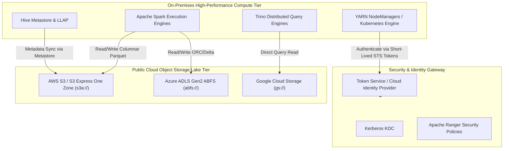
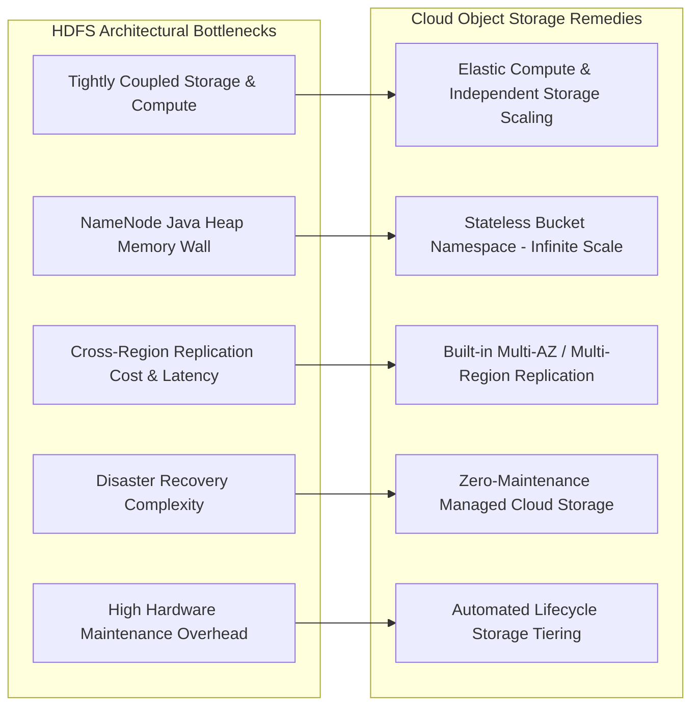
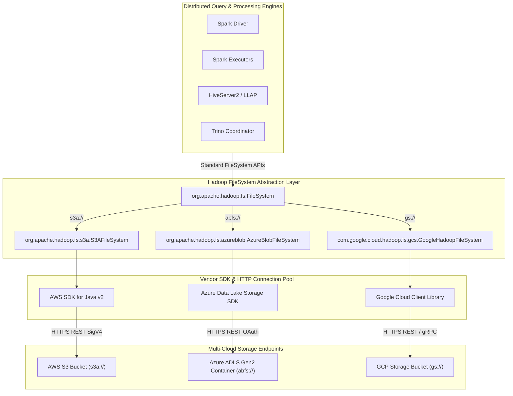
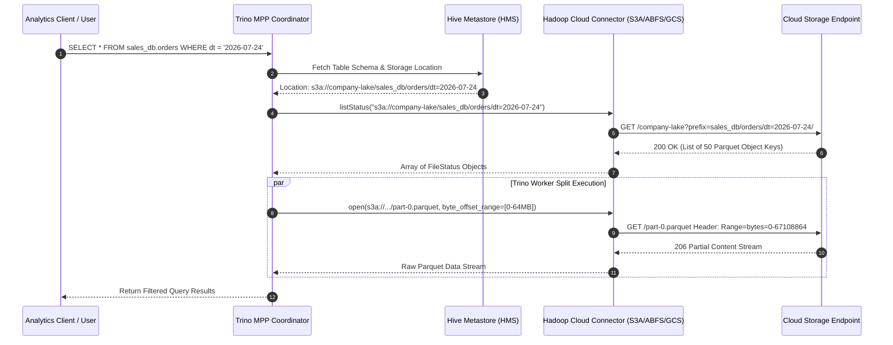
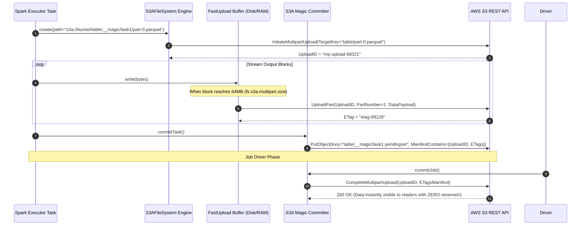

# Day 29 — Hybrid Cloud Integrations (S3, ADLS & GCS)

> **Course:** 🚀 30 Days of Modern Hadoop Ecosystem — From HDFS to Production Data Platforms  
> **Target Audience:** Senior Data Engineers, Platform Engineers, Cloud Solutions Architects, Distributed Systems SREs  
> **Philosophy:** WHY → HOW → ARCHITECTURE → PRODUCTION → TROUBLESHOOTING

---

## 📌 Table of Contents
1. [1. Introduction](#1-introduction)
2. [2. Problem Statement: Limitations of HDFS-Only Architecture](#2-problem-statement-limitations-of-hdfs-only-architecture)
3. [3. Architecture Deep Dive](#3-architecture-deep-dive)
4. [4. Internal Working & Low-Level Mechanics](#4-internal-working--low-level-mechanics)
5. [5. Core Concepts & Filesystem Connector Abstractions](#5-core-concepts--filesystem-connector-abstractions)
6. [6. Production Engineering](#6-production-engineering)
7. [7. Hands-On Lab: Multi-Cloud Object Storage Integration](#7-hands-on-lab-multi-cloud-object-storage-integration)
8. [8. Build From Source](#8-build-from-source)
9. [9. Docker Deployment](#9-docker-deployment)
10. [10. Local Cluster Deployment](#10-local-cluster-deployment)
11. [11. Validation & Verification](#11-validation--verification)
12. [12. Production Troubleshooting Playbook](#12-production-troubleshooting-playbook)
13. [13. Real-World Case Studies](#13-real-world-case-studies)
14. [14. Technical Interview Preparation (30 Questions)](#14-technical-interview-preparation-30-questions)
15. [15. Key Takeaways](#15-key-takeaways)
16. [16. References & Further Reading](#16-references--further-reading)

---

## 1. Introduction

### Why Enterprises Adopt Hybrid Cloud
Modern enterprise data architecture has evolved from single-data-center, monolithic Hadoop clusters into dynamic, hybrid cloud ecosystems. In a hybrid cloud pattern, organizations maintain high-performance on-premises compute nodes (YARN, Spark, Trino) while leveraging multi-cloud object storage—such as **Amazon Simple Storage Service (AWS S3)**, **Azure Data Lake Storage Gen2 (ADLS Gen2)**, and **Google Cloud Storage (GCS)**—as persistent, globally scalable data lakes.



### Evolution from HDFS-Only Architectures
In early Hadoop deployments (Hadoop 1.x / 2.x), compute (MapReduce/YARN) and storage (HDFS DataNodes) were strictly co-located on identical physical server chassis. While co-location optimized local disk read throughput via "Data Locality", it bound storage growth directly to compute hardware expansion.

The advent of 100GbE data center networking, high-speed NVMe caches, and cloud object storage disrupted this paradigm, driving the transition to **Compute-Storage Separation**.

```
[1st Gen: Co-located HDFS]       [2nd Gen: Dedicated HDFS]        [3rd Gen: Hybrid Cloud]
┌─────────────────────────┐     ┌─────────────────────────┐     ┌─────────────────────────┐
│ Compute + Local HDFS    │ ──► │ Compute Cluster (YARN)  │ ──► │ On-Prem Elastic Compute │
│ Co-located on 1,000     │     ├─────────────────────────┤     ├─────────────────────────┤
│ Physical Bare-Metal     │     │ Storage Cluster (HDFS)  │     │ AWS S3 / ADLS / GCS     │
└─────────────────────────┘     └─────────────────────────┘     └─────────────────────────┘
```

### Rise of Cloud Object Storage & Hybrid Dominance
Cloud object storage systems offer 11 Nines of durability ($99.999999999\%$), near-infinite scale, tiering lifecycle policies (Hot, Cool, Glacier), and zero physical disk replacement overhead. Hybrid cloud platforms allow enterprises to run compute intensive workloads on existing hardware or spot instances while keeping a single source of truth in cloud storage.

---

## 2. Problem Statement: Limitations of HDFS-Only Architecture

Operating massive enterprise data platforms exclusively on HDFS imposes severe engineering and operational challenges:



### Comparative Analysis: HDFS vs. Cloud Object Storage

| Metric / Dimension | Apache HDFS | AWS S3 / Azure ADLS Gen2 / GCP GCS |
| :--- | :--- | :--- |
| **Architecture** | Block Storage with centralized NameNode metadata | Distributed Key-Value Object Store |
| **Scaling** | Coupled (Adding storage requires buying compute servers) | Decoupled (Scale petabytes without adding compute nodes) |
| **Metadata Scale Limit** | NameNode RAM bottleneck (~150M files per 128GB JVM) | Virtually unlimited keys per bucket |
| **Durability SLA** | 3x Replication (~99.999%) | Erasure Coding across AZs (99.999999999%) |
| **Atomic Directory Rename** | O(1) Metadata update in NameNode | S3/GCS: O(N) Object Copy+Delete; ADLS: O(1) via HNS |
| **Cost Model** | Capital Expenditure (CapEx: Disks, Power, Cooling) | Operational Expenditure (OpEx: Pay per GB/month & API call) |
| **Data Locality** | Supported (Short-circuit local block reads) | Not supported (Network transfer over high-speed links) |

---

## 3. Architecture Deep Dive

### Hadoop + Cloud Object Storage Integration Architecture



### Access Flow & Query Routing



---

## 4. Internal Working & Low-Level Mechanics

### Low-Level Request & Committer Pipeline



### Multipart Uploads & Consistency Models
- **AWS S3**: Strong read-after-write consistency for PUTs and DELETEs of objects in all AWS regions (since Dec 2020).
- **Azure ADLS Gen2**: Strong consistency supported natively by the underlying Azure Blob storage architecture.
- **Google Cloud Storage**: Strong global consistency for object writes, updates, deletes, and metadata operations.

---

## 5. Core Concepts & Filesystem Connector Abstractions

### Key Concepts & Vocabulary
- **Bucket / Container**: Top-level namespace container isolated within a cloud account/region.
- **Blob / Object**: Fundamental unit of storage comprising data payload, key string, and system/custom metadata key-value pairs.
- **Prefix**: Key delimiter string (e.g. `raw/year=2026/`) mimicking directory hierarchies in object stores.
- **S3A Connector**: Apache Hadoop's high-performance connector module (`hadoop-aws`) translating Hadoop `FileSystem` calls into AWS SDK S3 REST requests.
- **ABFS Connector**: Hadoop Azure Blob File System driver (`hadoop-azure`) interfacing with Azure ADLS Gen2 REST endpoints (`account.dfs.core.windows.net`).
- **GCS Connector**: Google Hadoop FileSystem driver (`gcs-connector`) mapping `gs://` paths to Google Cloud Storage JSON/gRPC APIs.

---

## 6. Production Engineering

### Authentication & IAM Federation

```mermaid
graph TB
    subgraph AWS_Auth ["AWS Authorization"]
        IRSA["IAM Roles for Service Accounts - IRSA"]
        STS["Security Token Service"]
        S3_POLICY["S3 Bucket IAM Policy"]
        IRSA --> STS --> S3_POLICY
    end

    subgraph Azure_Auth ["Azure Authorization"]
        ENTRA["Microsoft Entra ID Service Principal"]
        OAUTH["OAuth 2.0 Client Credentials"]
        RBAC["Azure RBAC: Storage Blob Data Contributor"]
        ENTRA --> OAUTH --> RBAC
    end

    subgraph GCP_Auth ["GCP Authorization"]
        WI["Workload Identity Federation"]
        GCP_SA["GCP Service Account"]
        IAM_GCS["Storage Object Admin"]
        WI --> GCP_SA --> IAM_GCS
    end
```



### Production Tuning & Performance Configurations

```xml
<!-- Production S3A Configuration Options for core-site.xml -->
<configuration>
    <!-- Use S3A Fast Upload with Disk Buffering -->
    <property>
        <name>fs.s3a.fast.upload</name>
        <value>true</value>
    </property>
    <property>
        <name>fs.s3a.fast.upload.buffer</name>
        <value>disk</value>
    </property>
    
    <!-- Tune Multipart Size & Threads -->
    <property>
        <name>fs.s3a.multipart.size</name>
        <value>67108864</value> <!-- 64MB -->
    </property>
    <property>
        <name>fs.s3a.threads.max</name>
        <value>128</value>
    </property>
    
    <!-- Enable S3A Magic Committer for Spark -->
    <property>
        <name>fs.s3a.committer.name</name>
        <value>magic</value>
    </property>
    <property>
        <name>fs.s3a.committer.magic.enabled</name>
        <value>true</value>
    </property>
</configuration>
```

---

## 7. Hands-On Lab: Multi-Cloud Object Storage Integration

Refer to step-by-step lab guides in `hands-on/`:
- 📄 [AWS S3 Integration Guide](file:///c:/Users/Himanshu_Verma/DELL/Personal/30_Days_of_Modern_Hadoop_Ecosystem/Day-29-Hybrid-Cloud-Integrations/hands-on/aws-s3.md)
- 📄 [Azure ADLS Gen2 Guide](file:///c:/Users/Himanshu_Verma/DELL/Personal/30_Days_of_Modern_Hadoop_Ecosystem/Day-29-Hybrid-Cloud-Integrations/hands-on/azure-adls.md)
- 📄 [Google Cloud Storage Guide](file:///c:/Users/Himanshu_Verma/DELL/Personal/30_Days_of_Modern_Hadoop_Ecosystem/Day-29-Hybrid-Cloud-Integrations/hands-on/google-gcs.md)
- 📄 [Spark Object Storage Setup](file:///c:/Users/Himanshu_Verma/DELL/Personal/30_Days_of_Modern_Hadoop_Ecosystem/Day-29-Hybrid-Cloud-Integrations/hands-on/spark-object-storage.md)
- 📄 [Hive External Tables Setup](file:///c:/Users/Himanshu_Verma/DELL/Personal/30_Days_of_Modern_Hadoop_Ecosystem/Day-29-Hybrid-Cloud-Integrations/hands-on/hive-object-storage.md)
- 📄 [Trino MPP Engine Setup](file:///c:/Users/Himanshu_Verma/DELL/Personal/30_Days_of_Modern_Hadoop_Ecosystem/Day-29-Hybrid-Cloud-Integrations/hands-on/trino-object-storage.md)

---

## 8. Build From Source

To compile Apache Hadoop with cloud connectors from source:

```bash
# Clone Apache Hadoop repository
git clone https://github.com/apache/hadoop.git
cd hadoop

# Checkout release branch
git checkout branch-3.3.4

# Build Hadoop AWS module with S3A
mvn clean package -Pdist,native -DskipTests -Dtar -Dmaven.javadoc.skip=true \
  -pl hadoop-tools/hadoop-aws -am

# Build Hadoop Azure module with ABFS
mvn clean package -DskipTests -pl hadoop-tools/hadoop-azure -am

# Verify Fat JAR creation
ls -l hadoop-tools/hadoop-aws/target/hadoop-aws-3.3.4.jar
```

---

## 9. Docker Deployment

Launch the complete local multi-cloud testing environment using Docker Compose:

```bash
cd docker/
docker-compose up -d
```

Service Port Mapping:
- **MinIO S3 Console**: `http://localhost:9001` (user: `minioadmin`, pass: `minioadminpassword`)
- **Spark Master UI**: `http://localhost:8080`
- **Trino UI**: `http://localhost:8081`

---

## 10. Local Cluster Deployment

Ensure the following configuration files are deployed across all cluster nodes under `$HADOOP_CONF_DIR`:
- 📄 [core-site.xml](file:///c:/Users/Himanshu_Verma/DELL/Personal/30_Days_of_Modern_Hadoop_Ecosystem/Day-29-Hybrid-Cloud-Integrations/docker/core-site.xml)
- 📄 [hive-site.xml](file:///c:/Users/Himanshu_Verma/DELL/Personal/30_Days_of_Modern_Hadoop_Ecosystem/Day-29-Hybrid-Cloud-Integrations/docker/hive-site.xml)
- 📄 [spark-defaults.conf](file:///c:/Users/Himanshu_Verma/DELL/Personal/30_Days_of_Modern_Hadoop_Ecosystem/Day-29-Hybrid-Cloud-Integrations/docker/spark-defaults.conf)

---

## 11. Validation & Verification

Run the validation suite inside `validation/`:

```bash
# 1. Verify S3A / MinIO Read/Write Cycle
./validation/verify-s3.sh

# 2. Verify ADLS Gen2 ABFS Connector
./validation/verify-adls.sh

# 3. Verify Google Cloud Storage Connector
./validation/verify-gcs.sh

# 4. Verify Hive Metastore External Tables
./validation/verify-hive.sh

# 5. Verify Spark Parquet S3 Writes
./validation/verify-spark.sh
```

---

## 12. Production Troubleshooting Playbook

Refer to 📄 [cloud-storage-playbook.md](file:///c:/Users/Himanshu_Verma/DELL/Personal/30_Days_of_Modern_Hadoop_Ecosystem/Day-29-Hybrid-Cloud-Integrations/troubleshooting/cloud-storage-playbook.md) for root-cause analyses, log traces, resolutions, and preventive measures for 10 common failure scenarios:

1. **Authentication Failures & Access Denied**: Missing credential provider, expired IAM/STS session tokens, missing `s3:ListBucket` permissions.
2. **Invalid Credentials**: Unescaped secret key special characters or system clock skew (> 15 minutes) between cluster and cloud NTP.
3. **Slow Uploads & Network Throughput Degraded**: Single-threaded write buffering without fast upload disk spooling (`fs.s3a.fast.upload=disk`).
4. **Multipart Upload Failures & Storage Leaks**: Abandoned multipart fragments from aborted Spark/YARN tasks inflating S3 bills.
5. **Connection & Socket Timeouts**: Low `fs.s3a.connection.timeout` values during deep prefix scans or heavy write buffer flushes.
6. **Bucket Permission & Policy Conflicts**: Explicit `DENY` in S3 Bucket Policy (e.g. enforcing HTTPS `aws:SecureTransport`) overriding IAM role grants.
7. **DNS Failures & Name Resolution Errors**: `UnknownHostException` due to VPC DNS rate limits or broken VPN resolvers.
8. **SSL & Certificate Validation Issues**: `PKIX path building failed` caused by corporate proxy or outdated Java KeyStore (`cacerts`).
9. **Connector Version & Dependency Mismatches**: Classpath collisions between `hadoop-aws`, `aws-java-sdk-bundle`, and Spark's Jackson/Guava libraries.
10. **Throttling & HTTP 503 SlowDown / 429 Too Many Requests**: Exceeding 3,500 PUT / 5,500 GET requests per second per prefix limit on S3.

---

## 13. Real-World Case Studies

### 1. Netflix (Keystone Data Platform)
- **Data Lake Architecture**: Migrated 100+ Petabytes of telemetry, viewing history, and media logs from on-prem HDFS to AWS S3.
- **Cloud Storage Strategy**: Uses S3 as the primary single source of truth, backed by S3 Intelligent-Tiering and Glacier for cold archives.
- **Hybrid Analytics**: Runs thousands of ephemeral EMR and Spark compute clusters querying S3 via Hive Metastore.
- **Disaster Recovery**: Multi-region S3 replication across `us-east-1` and `us-west-2` with active-active query routing.
- **Cost Optimization**: Co-developed early zero-rename S3 committers (precursor to S3A Magic Committer), saving millions of dollars in unnecessary object renames and API fees.

### 2. LinkedIn (Hybrid Ingestion & Analytics Data Lake)
- **Data Lake Architecture**: Operates high-throughput on-premises Hadoop/HDFS clusters for real-time Kafka event streaming ingestion combined with Azure ADLS Gen2 for long-term analytical storage.
- **Cloud Storage Strategy**: Uses ADLS Gen2 with Hierarchical Namespace (HNS) enabled for fast, POSIX-compatible directory renames.
- **Hybrid Analytics**: Runs Spark and Trino jobs on-premises while directly querying ADLS Gen2 `abfs://` paths via Azure ExpressRoute.
- **Disaster Recovery**: Automated cross-region replication between Azure East US and West US regions for core business telemetry.
- **Cost Optimization**: Offloads cold HDFS data older than 90 days to ADLS Cool/Archive tier, reducing on-prem physical server footprint by 40%.

### 3. Uber (Global Data Lake Engine)
- **Data Lake Architecture**: Processes exabytes of trip, pricing, and marketplace data using Apache Hudi on top of HDFS, AWS S3, and GCP GCS.
- **Cloud Storage Strategy**: Multi-cloud deployment using GCS (`gs://`) in GCP regions and AWS S3 (`s3a://`) in AWS regions.
- **Hybrid Analytics**: Uses Spark and Presto/Trino to query transactional Hudi tables stored on cloud object storage.
- **Disaster Recovery**: Dual-region GCS buckets ensuring zero data loss during cloud availability zone outages.
- **Cost Optimization**: Eliminated NameNode JVM RAM bottlenecks by archiving cold partition files from HDFS to object storage.

### 4. Airbnb (Minerva Metrics & Analytical Engine)
- **Data Lake Architecture**: Separates compute clusters (EC2 + EMR) from persistent storage (AWS S3) to support the Minerva unified metrics platform.
- **Cloud Storage Strategy**: Standardizes on S3 Parquet datasets partitioned by date and dimension prefixes.
- **Hybrid Analytics**: Decoupled compute allows scaling Spark nodes up by 10x during peak search events (holidays) without paying for idle storage drives.
- **Disaster Recovery**: Automated S3 bucket versioning and cross-region replication for critical financial datasets.
- **Cost Optimization**: Leveraged S3A Directory Committers and S3 Lifecycle policies to clean up incomplete multipart uploads automatically.

### 5. Pinterest (PinLake Platform)
- **Data Lake Architecture**: Operates PinLake, a multi-petabyte data platform serving recommendation, ad analytics, and image feature pipelines.
- **Cloud Storage Strategy**: Migrated legacy HDFS clusters to AWS S3 and GCP GCS using vectorized cloud connectors.
- **Hybrid Analytics**: Uses PySpark and Hive on YARN/Kubernetes querying cloud storage via remote metastores.
- **Disaster Recovery**: Multi-cloud storage replication between S3 and GCS for mission-critical ad revenue event logs.
- **Cost Optimization**: Achieved 35% cost reduction by transitioning from raw HDFS 3x replication to S3 Erasure Coding and Glacier Deep Archive.


---

## 14. Technical Interview Preparation (30 Questions)

### Beginner Questions (10)

#### Q1: What is the main difference between HDFS and cloud object storage like AWS S3?
**Answer:** HDFS is a distributed block storage system with a centralized NameNode managing metadata in JVM heap memory. S3 is a key-value object store with virtually unlimited metadata scale. HDFS supports atomic directory renames and append operations, whereas S3 objects are immutable and renames require copying every object to a new key prefix.

#### Q2: What is the S3A connector in Apache Hadoop?
**Answer:** S3A is Apache Hadoop's high-performance `FileSystem` implementation class (`org.apache.hadoop.fs.s3a.S3AFileSystem`) that translates standard Hadoop FileSystem calls (`fs.open`, `fs.create`, `fs.listStatus`) into S3 REST API requests using the AWS SDK for Java.

#### Q3: What is ABFS in Azure Data Lake Storage Gen2?
**Answer:** ABFS (Azure Blob File System) is the dedicated Hadoop driver (`org.apache.hadoop.fs.azureblob.AzureBlobFileSystem`) for Azure ADLS Gen2, optimized to leverage Azure's Hierarchical Namespace (HNS) feature for high-performance directory operations.

#### Q4: Why is traditional directory rename slow on AWS S3?
**Answer:** AWS S3 does not have physical directories; it uses key prefixes. Renaming a directory requires listing all objects under the prefix, issuing an HTTP COPY for each file, and then issuing an HTTP DELETE for the original objects, resulting in $O(N)$ HTTP calls.

#### Q5: What is the purpose of S3A Magic Committer?
**Answer:** S3A Magic Committer is a zero-rename task output committer for Spark/Hadoop. It writes pending task data directly to final S3 destination paths using S3 Multipart Uploads and completes the job by calling `CompleteMultipartUpload` on the driver, bypassing directory renames entirely.

#### Q6: How does object storage affect data locality in Spark jobs?
**Answer:** Object storage removes data locality because compute nodes and storage endpoints are separated by high-speed networks. Spark schedules tasks based on available cluster compute slots rather than HDFS block locations.

#### Q7: What is an S3 Multipart Upload?
**Answer:** An S3 feature allowing files larger than 5MB to be uploaded as smaller parts in parallel. If a part upload fails, only that part needs to be retried rather than the entire file.

#### Q8: What security credential method is recommended for production Hadoop S3 access?
**Answer:** AWS IRSA (IAM Roles for Service Accounts) or AWS STS short-lived session credentials, avoiding hardcoded static IAM secret keys in configuration files.

#### Q9: What is Hierarchical Namespace (HNS) in Azure ADLS Gen2?
**Answer:** HNS is a feature in ADLS Gen2 that organizes objects into a true directory hierarchy (like a POSIX filesystem), enabling $O(1)$ atomic directory renames and POSIX-compliant ACL permissions.

#### Q10: What is the file scheme prefix for Google Cloud Storage in Hadoop?
**Answer:** `gs://` (implemented via `com.google.cloud.hadoop.fs.gcs.GoogleHadoopFileSystem`).

---

### Intermediate Questions (10)

#### Q11: How do you prevent partial file accumulation in S3 from failed Spark jobs?
**Answer:** Configure S3 Lifecycle Rules on the bucket to automatically abort uncommitted multipart uploads older than 7 days (`AbortIncompleteMultipartUpload`), and periodically run `hadoop s3guard uploads -abort`.

#### Q12: How does Spark handle eventual consistency issues on older S3 setups?
**Answer:** Modern S3 (since Dec 2020) provides strong read-after-write consistency out-of-the-box. For older systems, S3Guard (backed by DynamoDB) was used to store consistent metadata state.

#### Q13: Explain how Trino queries external tables stored on S3 without HDFS.
**Answer:** Trino queries Hive Metastore to retrieve table schema and S3 locations (`s3a://...`), uses its native S3 connector to perform prefix scans, and issues parallel HTTP GET range requests directly to S3 objects to stream Parquet/ORC columns into worker memory.

#### Q14: What is vectorization in S3 read operations?
**Answer:** S3 connectors combine adjacent byte range requests into consolidated HTTP GET calls to reduce connection overhead when reading sparse columnar Parquet/ORC row groups.

#### Q15: What configuration parameter enables path-style access in S3A?
**Answer:** `fs.s3a.path.style.access=true` (required for local MinIO or Ceph, whereas AWS S3 defaults to virtual-hosted style).

#### Q16: How do you pass GCP service account credentials to a YARN container running Spark?
**Answer:** Configure `fs.gs.auth.service.account.json.keyfile` pointing to a local keyfile path or use GCP Workload Identity to exchange YARN/K8s service account tokens for short-lived GCP tokens.

#### Q17: What is the role of Hive Metastore when moving storage from HDFS to S3?
**Answer:** Hive Metastore maintains table schema definitions and partition metadata (`LOCATION 's3a://bucket/table/part=1'`), decoupled from physical HDFS DataNode blocks.

#### Q18: What is the difference between S3A Directory Committer and Magic Committer?
**Answer:** S3A Directory Committer stages task files on local disk (or HDFS) and uploads them directly to destination S3 paths during the job commit phase. Magic Committer writes data directly to S3 during task execution via uncommitted Multipart Uploads.

#### Q19: How do HTTP 503 SlowDown errors impact Hadoop jobs on S3?
**Answer:** They indicate that request rates on a specific S3 prefix exceed limits (3,500 writes/sec or 5,500 reads/sec). They cause task retries and require retry backoff tuning (`fs.s3a.retry.limit`) or prefix partition hashing.

#### Q20: Can HDFS and S3 be used simultaneously in the same Hive Metastore?
**Answer:** Yes. Hive supports multi-location catalog definitions where Table A resides on `hdfs://namenode:8020/` and Table B resides on `s3a://bucket/`.

---

### Advanced Production Architecture Questions (10)

#### Q21: Architectural Design: Design a hybrid data platform handling 5PB daily ingestion with on-prem YARN clusters and AWS S3 object storage.
**Answer:** Use on-prem YARN with NVMe local SSD scratch disks for Spark intermediate shuffle data. Ingest raw streams into local HDFS or MinIO buffer buckets. Run batch Spark compaction jobs using S3A Magic Committers to write partitioned Parquet files directly to AWS S3 (`s3a://prod-lake/`). Federate identity using IRSA and AWS STS. Enforce access policies via Apache Ranger and manage table schema through a centralized remote Hive Metastore.

#### Q22: Deep Dive: Compare the internal file commit protocols of Spark on HDFS vs Spark on S3.
**Answer:** On HDFS, Spark uses `FileOutputCommitter` (Algorithm 2) where tasks write to `_temporary/attempt_id/` and execute an $O(1)$ NameNode metadata move to the final table path upon task completion. On S3, metadata-only moves do not exist; moving a directory requires copying every object. Hence, S3 uses S3A Magic Committer, which leverages S3 Multipart Uploads to upload part blocks directly to the final key destination during task execution and executes `CompleteMultipartUpload` during job commit, avoiding data movement.

#### Q23: Security: How do you enforce fine-grained column-level access control on S3 datasets queried by Trino and Spark?
**Answer:** Integrate Apache Ranger with Trino and Spark (via Ranger Spark plugin or Starburst). Compute engines evaluate user queries against Ranger authorization policies. When access is granted, the engine reads S3 objects using short-lived credentials generated by an STS token broker, protecting raw S3 buckets from direct unauthenticated user access.

#### Q24: Performance: You observe severe query degradation in Trino when listing partitions on S3 with 500,000 files. How do you resolve it?
**Answer:** 
1. Enable Hive Metastore Partition Indexing.
2. Store partition metadata in metastore tables rather than performing raw S3 prefix listings.
3. Migrate layout to Apache Iceberg or Delta Lake format, which store file manifests in metadata JSON/AVRO files, avoiding S3 directory scans entirely.

#### Q25: Disaster Recovery: How do you implement active-passive DR for an enterprise object storage data lake?
**Answer:** Configure native cross-region replication (S3 Cross-Region Replication, ADLS Geo-Redundant Storage, or GCS Dual-Region Buckets). Sync Hive Metastore databases asynchronously using tools like Apache Atlas / Metastore Replication or AWS Glue Schema Registry replication.

#### Q26: Cost Tuning: How do you optimize S3 API request costs for a Spark cluster processing billions of small files?
**Answer:** 
1. Run a compaction job (Spark `coalesce` or Iceberg `rewriteDataFiles`) to merge small files into optimal 128MB-512MB Parquet blocks.
2. Enable S3A byte range request vectorization to decrease GET call counts.
3. Apply S3 Intelligent-Tiering lifecycle policies.

#### Q27: Network Engineering: How do you secure data traffic between on-premises YARN clusters and AWS S3?
**Answer:** Provision AWS Direct Connect with Private VIF or AWS Site-to-Site VPN, and configure VPC Endpoints for S3 (`com.amazonaws.region.s3`) to keep all S3 REST API traffic strictly within private fiber backbones.

#### Q28: Reliability: What causes `S3ABlockOutputStream` memory leaks in Spark Executors and how is it resolved?
**Answer:** Occurs when `fs.s3a.fast.upload.buffer` is set to `bytebuffer` or `array` under heavy write loads. Fixed by setting `fs.s3a.fast.upload.buffer=disk` to spill multipart upload buffers to local worker NVMe disks.

#### Q29: Migration Strategy: How do you migrate a 10PB HDFS dataset to Azure ADLS Gen2 without downtime?
**Answer:** Use Apache Hadoop `distcp` with ABFS connector (`hadoop distcp hdfs://nn:8020/data abfs://container@account.dfs.core.windows.net/data`). Perform initial bulk copy, then run incremental `distcp -update` passes. Dual-write new incoming streams during final cutover.

#### Q30: Modern Data Stack: Why are modern table formats (Iceberg, Delta Lake, Hudi) critical for Hybrid Cloud Object Storage?
**Answer:** Object storage systems lack native file locking and atomic directory renames. Modern table formats introduce ACID transaction logs (`_delta_log` or Iceberg metadata snapshots) stored directly in object storage. They enable atomic commits, time travel, schema evolution, and eliminate prefix listing performance penalties.

---

## 15. Key Takeaways

1. **Compute-Storage Separation** is the architectural standard for modern enterprise data platforms.
2. **Hadoop FileSystem Connectors** (`S3AFileSystem`, `AzureBlobFileSystem`, `GoogleHadoopFileSystem`) bridge distributed compute engines to cloud storage APIs.
3. **Committers Matter**: Always use zero-rename committers (S3A Magic Committer) on object storage to prevent severe $O(N)$ directory copy bottlenecks.
4. **Security Best Practice**: Rely on federated identity providers (AWS IRSA, Azure Entra ID Service Principals, GCP Workload Identity) rather than hardcoded keys.
5. **Modern Table Formats**: Apache Iceberg and Delta Lake represent the future of cloud object storage analytics by providing ACID transactions and eliminating prefix scan overheads.

---

## 16. References & Further Reading
- 📚 [Apache Hadoop AWS (S3A) Documentation](https://hadoop.apache.org/docs/current/hadoop-aws/tools/hadoop-aws/index.html)
- 📚 [Azure Data Lake Storage Gen2 ABFS Driver Documentation](https://hadoop.apache.org/docs/current/hadoop-azure/abfs.html)
- 📚 [Google Cloud Storage Connector for Hadoop](https://github.com/GoogleCloudDataproc/hadoop-connectors)
- 📚 [Apache Spark Cloud Integration Guide](https://spark.apache.org/docs/latest/cloud-integration.html)
- 📚 [Trino Hive Connector Documentation](https://trino.io/docs/current/connector/hive.html)
