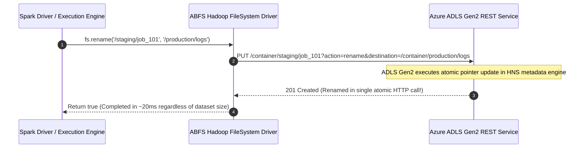

# Azure ADLS Gen2 Integration Diagrams

Architecture diagrams for Azure Data Lake Storage Gen2 (ABFS Driver) showing Hierarchical Namespace (HNS), OAuth token acquisition, and atomic operations.

---

## 1. ABFS Driver & Azure ADLS Gen2 Architecture

```mermaid
graph TB
    subgraph Compute_Engines ["Compute Engines"]
        SPARK["Spark Executors"]
        HIVE["Hive / Tez Tasks"]
        TRINO["Trino Workers"]
    end

    subgraph ABFS_Driver ["org.apache.hadoop.fs.azureblob.AzureBlobFileSystem"]
        ABFS_CORE["ABFS Core Engine (abfs://)"]
        OAUTH_MGR["OAuth2 Token Manager"]
        RETRY_MGR["Exponential Backoff Retry Manager"]
        HNS_OPS["Hierarchical Namespace API Client"]
    end

    subgraph Azure_Entra_ID ["Microsoft Entra ID / Azure AD"]
        LOGIN["https://login.microsoftonline.com"]
    end

    subgraph ADLS_Gen2_Storage ["Azure ADLS Gen2 Service"]
        DFS_ENDPOINT["account.dfs.core.windows.net"]
        CONTAINER["Blob Storage Container"]
        HNS_ENGINE["Hierarchical Namespace Engine - Inodes & Directories"]
    end

    Compute_Engines -->|FileSystem Operations| ABFS_CORE
    ABFS_CORE -->|Fetch OAuth Access Token| OAUTH_MGR
    OAUTH_MGR -->|Client Credentials Grant| LOGIN
    LOGIN -->>OAUTH_MGR: Return Bearer Token (Valid 60 min)
    
    ABFS_CORE -->|HTTPS REST with Bearer Token| HNS_OPS
    HNS_OPS -->|Atomic Rename / Create Directory| DFS_ENDPOINT
    DFS_ENDPOINT --> CONTAINER
    CONTAINER --> HNS_ENGINE
```

---

## 2. ADLS Gen2 Atomic Directory Rename Flow


