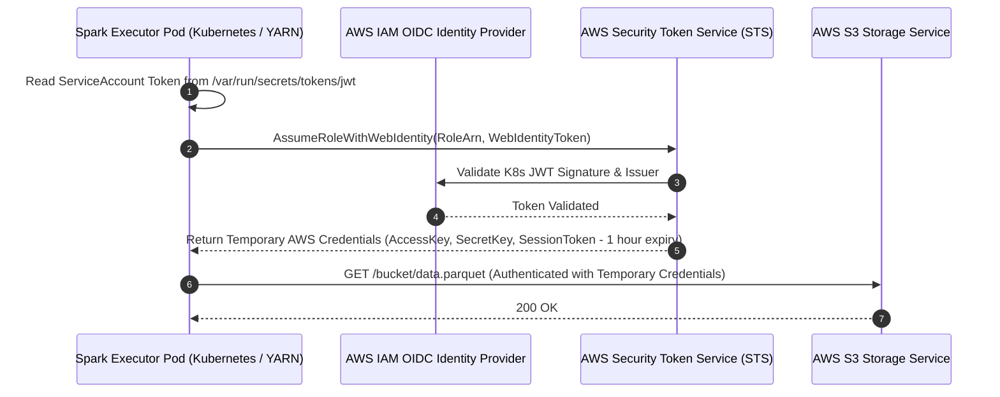
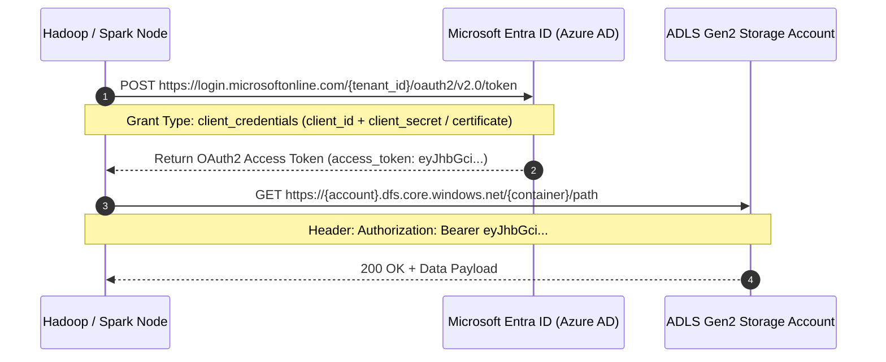
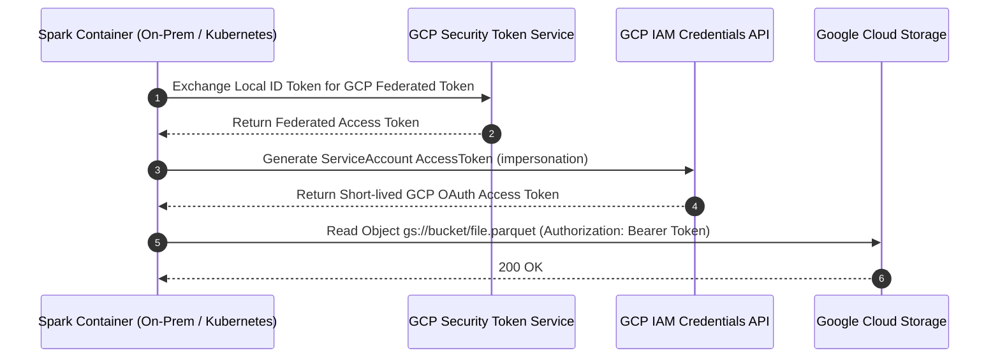

# Hybrid Cloud Authentication Flow Diagrams

Exhaustive authentication diagrams for enterprise hybrid cloud setups, detailing IRSA (AWS IAM Roles for Service Accounts), Azure Entra ID Service Principals, and GCP Workload Identity.

---

## 1. AWS IRSA (IAM Roles for Service Accounts) Authentication Flow

---

## 2. Azure Service Principal & Managed Identity Authentication Flow

---

## 3. GCP Workload Identity Federation Flow

