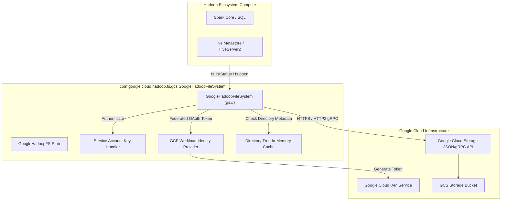
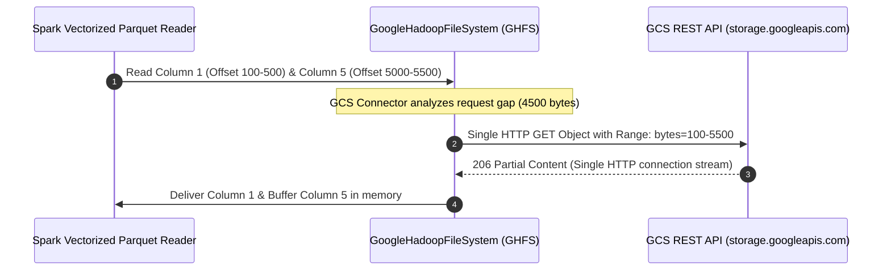

# Google Cloud Storage (GCS) Integration Diagrams

Architecture diagrams for the GoogleHadoopFileSystem (GHFS) GCS connector, service account authentication, and Workload Identity federation.

---

## 1. GCS Connector Engine Architecture

---

## 2. GCS Coalesced Read & Prefetching Mechanics

