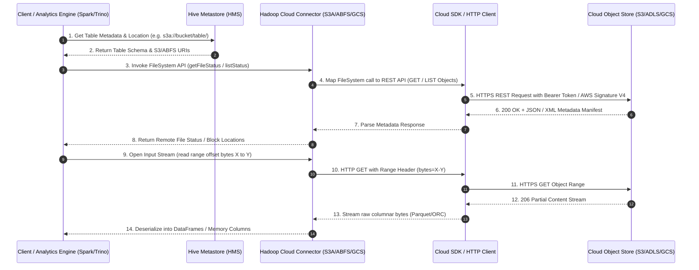

# Hybrid Cloud Architecture Diagrams

This document contains visual architectural diagrams explaining how on-premises Hadoop data platforms integrate with multi-cloud object storage systems (AWS S3, Azure ADLS Gen2, and Google Cloud Storage).

---

## 1. Enterprise Hybrid Cloud Topology

```mermaid
graph TB
    subgraph On_Premises_Data_Center ["On-Premises Corporate Data Center"]
        subgraph Compute_Cluster ["Hadoop & Engine Compute Nodes"]
            YARN["YARN NodeManager Cluster"]
            SPARK["Spark Executors / Drivers"]
            HIVE["Hive Metastore & LLAP"]
            TRINO["Trino Coordinator & Workers"]
        end
        
        subgraph OnPrem_Storage ["Hot Tier / Operational Storage"]
            HDFS_NN["HDFS NameNode Active/Standby"]
            HDFS_DN["HDFS DataNode Storage Blocks"]
        end
    end

    subgraph Security_And_Identity ["Hybrid Security & Identity Gateway"]
        KNOX["Apache Knox Security Gateway"]
        RANGER["Apache Ranger Authorization"]
        STS["Cloud Token Service / STS Provider"]
    end

    subgraph Public_Cloud_Providers ["Multi-Cloud Object Storage Tier"]
        subgraph AWS_Cloud ["Amazon Web Services"]
            S3["AWS S3 / S3 Express One Zone"]
            IAM_AWS["AWS IAM / IRSA"]
        end
        
        subgraph Azure_Cloud ["Microsoft Azure"]
            ADLS["Azure ADLS Gen2 (ABFS Driver)"]
            ENTRA["Microsoft Entra ID / Service Principal"]
        end

        subgraph GCP_Cloud ["Google Cloud Platform"]
            GCS["Google Cloud Storage (gs://)"]
            GCP_IAM["GCP IAM / Workload Identity"]
        end
    end

    %% Compute to OnPrem HDFS
    SPARK -->|HDFS API hdfs://| HDFS_NN
    HIVE -->|HDFS API hdfs://| HDFS_NN

    %% Security Federation
    SPARK -->|Authenticate / Get Delegation Tokens| STS
    STS -->|AssumeRole / Exchange Token| IAM_AWS
    STS -->|OAuth Token Exchange| ENTRA
    STS -->|Workload Identity Exchange| GCP_IAM

    %% Compute to Cloud Storage
    SPARK -->|S3A Connector s3a://| S3
    SPARK -->|ABFS Connector abfs://| ADLS
    SPARK -->|GCS Connector gs://| GCS

    TRINO -->|Direct Parquet/ORC Read s3a://| S3
    TRINO -->|Direct Parquet/ORC Read abfs://| ADLS
    TRINO -->|Direct Parquet/ORC Read gs://| GCS
```

---

## 2. Compute-Storage Separation Data Flow

