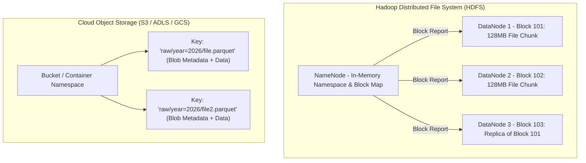
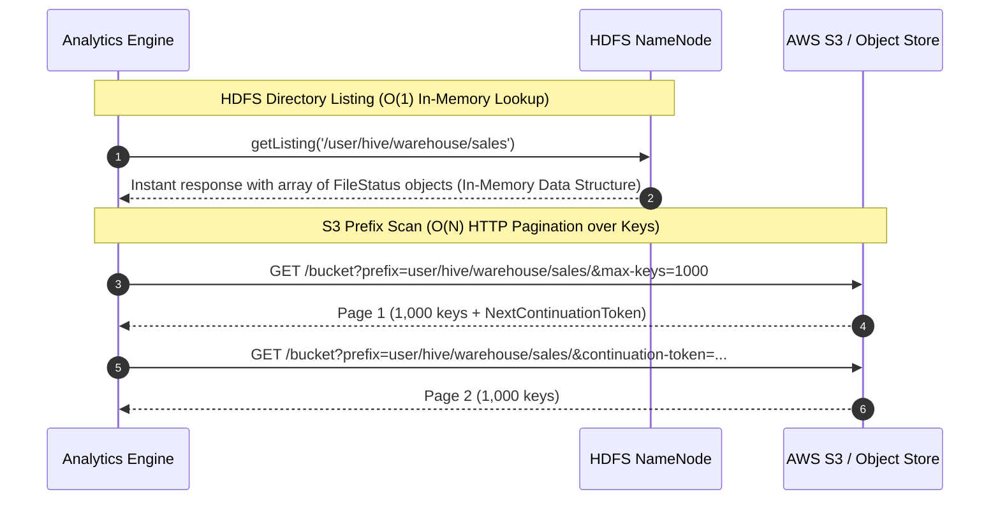

# Object Storage vs HDFS Comparison Diagrams

Architectural breakdown comparing block-based HDFS with Key-Value Object Storage.

---

## 1. Physical vs Logical Storage Structure

---

## 2. Directory Listing vs Prefix Scan Mechanics

