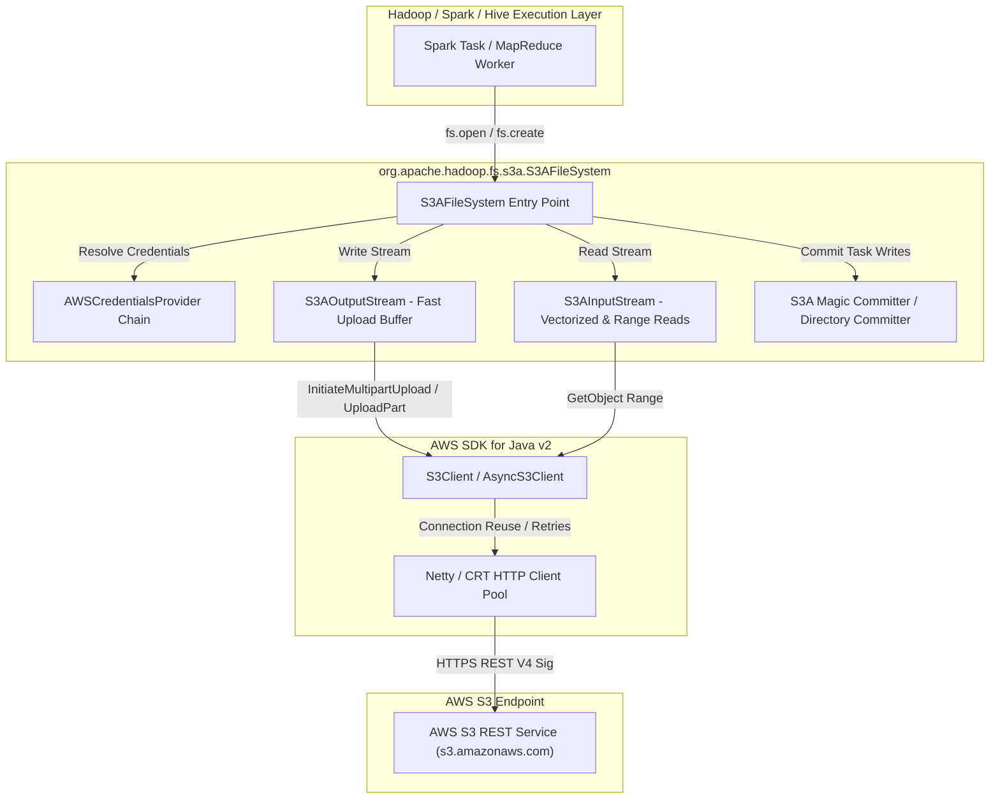
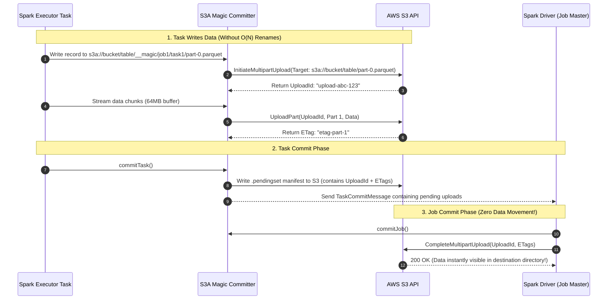

# AWS S3 Integration Diagrams

Detailed diagrams for AWS S3 and S3A connector internals including S3A Magic Committers and Directory Committers.

---

## 1. S3A Connector Internal Architecture

---

## 2. S3A Magic Committer Zero-Rename Architecture

